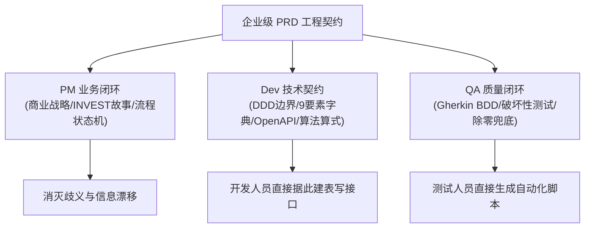

# 📘 通用企业级产品需求规格说明书 (PRD) 编制与工程交付标准技能 (enterprise-prd-standards)

> **技能代号**：`SKILL-ENTERPRISE-PRD-STANDARDS-V1.0`  
> **适用领域**：复杂企业级系统、数字化平台、工业互联网、大型 SaaS、金融核心中台及高复杂度软件工程  
> **设计哲学**：**“专业立地、高效行车、清晰透亮”**。让产品需求成为兼具业务洞察力、架构契约严谨性与自动化可测性的单一事实源（Single Source of Truth）。

---

## 一、 核心定位与产研闭环协同 (Triad Architecture)

本 Skill 旨在彻底根除传统 PRD “大段抒情小作文、界面见截图、开发靠猜、测试靠问、算法靠口头约定”的痼疾，建立 **PM 业务战略 + Dev 技术架构 + QA 质量防护** 的三位一体闭环：



---

## 二、 宏观系统级 PRD 十大核心卷目架构 (The 10 System Pillars)

当面对一个全新的软件系统或大型项目编制全局 PRD 时，必须覆盖以下 10 大标准卷目：

1. **第一卷：文档元数据与四方审签 (Metadata & RACI Sign-off)**
   - 受控编号（如 `PRD-[项目代号]-2026-V1.0`）、密级标注（公开/内部/商密/绝密）；
   - 四方联合会签表：PM 负责人、系统架构师、前端主管、QA 主管；
   - 版本修订历史：原位追加，记录版本号、日期、变更章节、动因与责任人。
2. **第二卷：项目背景与北极星指标 (Context & NSM Matrix)**
   - 业务痛点阐述与现状瓶颈；
   - 核心商业与管理目标；
   - 北极星指标（NSM）矩阵：定义公式、目标阈值、责任角色与考核周期。
3. **第三卷：目标用户画像与权限边界矩阵 (Personas & RBAC)**
   - 典型用户角色画像（P1~Pn）；
   - 多级组织/管理穿透层级；
   - RBAC 权限访问控制矩阵（功能权限 + 数据行级/列级权限）。
4. **第四卷：总体架构与端到端控制流 (Architecture & Process Flow)**
   - 系统功能分层架构图（接入层、计算数仓层、业务应用层）；
   - 端到端跨部门业务泳道图；
   - 核心单据生命周期状态机（FSM，全部分支：正向、驳回、超时、终态）。
5. **第五卷：详细功能规格说明 (Detailed Specifications · 八段式模块主体)**
   - 按照系统功能拓扑逐层拆解，每一个页面/功能点无一例外严格执行**“八段式”完整度**。
6. **第六卷：数据治理与冲突仲裁机制 (Data Governance & Reconciliation)**
   - 端到端数据血缘映射表（Data Lineage）；
   - 离线/断网缓存补传与版本冲突消解规则（禁止静默覆盖、时序重写、差异流水留痕）；
   - 跨期调价与追溯调账机制（时间切片锁定 + 差额追溯凭证）。
7. **第七卷：系统接口与外部集成契约 (API & Protocol Contracts)**
   - OpenAPI 3.0.3 规范接口定义（路径、参数、请求体、返回体 Schema）；
   - 物联网/消息队列协议（MQTT/Kafka Topic、采集频率分层策略）。
8. **第八卷：统一错误码字典与异常治理 (Unified Error Code Dictionary)**
   - 统一机器可读错误码体系（HTTP 状态码 + 业务错误码 + 错误级别 + 处置动作）。
9. **第九卷：UI/UX 设计系统契约 (Design System Tokens)**
   - 工业级交互规范（高密表格行高、操作按钮规格、表单输入框尺寸、色彩字典）；
   - 状态自解释准则：剥离“图表联动中”等废话标签，由边框/高亮自解释；
   - 客观中立准则：严禁主观褒贬评价（优良、优异、落后等），以事实、时序环比与偏差量呈现；
   - UI 四态全覆盖（正常态、加载态、空数据态单行文案、错误态）。
10. **第十卷：非功能性需求与质量门禁 (NFR & DoR/DoD)**
    - 量化性能基线（首屏秒开、LCP、P95 响应时间、高密导出上限）；
    - 可靠性与容灾基线（高可用 SLA、断网自愈）；
    - 安全合规（商密脱敏、数据出境白名单）；
    - 研发准入（DoR）与交付准出（DoD）十项一票否决检查清单。

---

## 三、 微观模块级标准：八段式完整度规范 (The 8-Section Module Model)

每一个具体业务功能页面在编制或细化时，必须严格执行以下八段式结构：

```text
【1】定位与架构角色 (Positioning & Architecture)
     - 功能定位、承载角色、页面完整路由（主页+详情）、上游数据依赖、下游业务输出。
【2】业务场景与用户故事 (Business Scenarios & INVEST Stories)
     - 业务现场实况叙述 + INVEST 结构化用户故事 (As a ... / I want ... / So that ...)。
【3】功能规格与交互契约 (Functional Specs & Interactions)
     - 全局控制流（组织树/时间控件）+ 细分子模块规格 + 跨层级聚合口径矩阵表 + 业务约束 Callout。
【4】页面字段字典与数据契约 (9-Attribute Field Schema)
     - 序号、字段英文 Key、中文名、数据类型、量纲单位、必填性、小数精度、来源系统、校验与约束规则。
【5】核心数学模型与算法公式 (Mathematical Models & Formulas)
     - 绿色公式卡片 + LaTeX 形式化算式 + 变量定义约定 + 判定逻辑。
【6】展示、对标与判定口径 (Display & Benchmark Rules)
     - 绝对量求和 vs 比值分子分母重算 + 客观中立时序环比 + 三色预警阈值 + 极限除零软兜底 "--"。
【7】边界条件、异常处理与防错规则 (Edge Cases & Redlines)
     - 红色高危约束卡片 + 极限除零保护 + 非法值拦截 + 白名单精准判空单行输出 + 受控错误码绑定。
【8】QA 自动化验收准则 (Gherkin BDD Scenarios)
     - 紫色测试卡片 + Feature 声明 + 覆盖主流程、极限除零、逆向拦截的多分支 Given-When-Then-And 断言。
```

---

## 四、 本技能内置模板与工具链资源 (Assets & Templates)

本 Skill 目录下配备了可以直接调用和定制的开箱即用工程模板与验证工具：

| 资源相对路径 | 类型 | 适用场景与用途 |
|:---|:---|:---|
| `templates/01_SYSTEM_PRD_MASTER.md` | 全景模板 | 用于新项目从 0 到 1 快速脚手架化生成一份 10 大卷完整 PRD 母版 |
| `templates/02_MODULE_PAGE_PRD.md` | 单页模板 | 用于团队成员或 AI Agent 并行编写具体某一个功能页面的八段式规格 |
| `templates/03_DOR_DOD_CHECKLIST.md` | 门禁清单 | 研发准入评审 (DoR) 与上线验收 (DoD) 的 10 项一票否决核对表 |
| `scripts/validate_prd.py` | Python 脚本 | 自动化扫描检测 PRD 文档中的未决占位符、八段式完整性、定性敏感词与字段缺失 |

---

## 五、 如何使用本 Skill 为新项目生成 PRD

### 场景 1：为一个新系统创建全景 PRD 架构
1. **输入信息**：提供新项目的项目名称、业务背景、主要角色（如运营、用户、审核员）、核心业务模块列表；
2. **执行动作**：读取 `templates/01_SYSTEM_PRD_MASTER.md`，基于项目上下文填充第 1~4 卷及 6~10 卷系统级框架；
3. **输出成果**：生成一份结构完整、包含架构图、状态机、数据字典与 NFR 基线的宏观 PRD 骨架。

### 场景 2：为某个特定业务功能页面编写深度规格
1. **输入信息**：指定页面名称、功能目标、输入输出字段及计算逻辑；
2. **执行动作**：严格激活 `templates/02_MODULE_PAGE_PRD.md` 的八段式结构，逐项补齐 9 要素字段字典、LaTeX 数学公式、异常错误码与 Gherkin BDD 验收用例；
3. **质量核验**：确保不留 `待补充` 占位符，除法算式明确兜底 `--`，状态机覆盖逆向流。

### 场景 3：审查并重构一份已有但不够规范的 PRD
1. **执行静态扫描**：调用 `scripts/validate_prd.py` 扫描文档缺陷；
2. **对照 DoR 门禁**：比对 `templates/03_DOR_DOD_CHECKLIST.md` 找出模糊描述、缺失字段与定性褒贬评价；
3. **重构交付**：将粗放的自然语言小作文重构为矩阵表、状态流转表与八段式规范文档。
