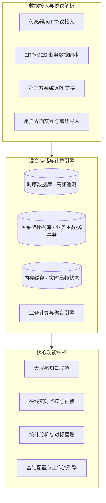
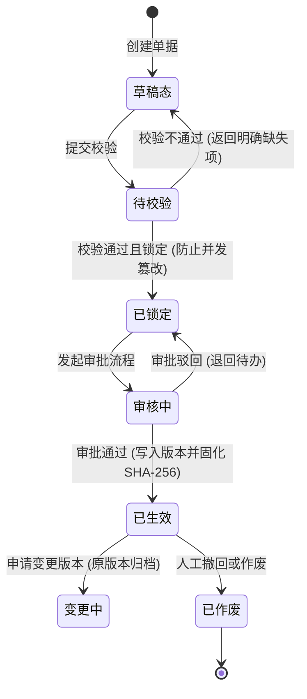

# 📘 [项目/系统全称] · 产品需求规格说明书 (PRD)

> **受控编号**：`PRD-[系统英文代号]-2026-V1.0`  
> **文档版本**：`v1.0.0 (生产施工研发基线版)`  
> **密级标注**：`内部绝密 / 商业秘密 / 内部公开`  
> **归属工程**：`[系统/工程归属平台全称]`  
> **编制部门**：`[产品研发中心 / 联合项目组]`  
> **生效日期**：`2026-XX-XX`  
> **审签状态**：`APPROVED & BASELINED`

---

## 全局目录 (Table of Contents)

- [第一卷：工程治理与全局架构](#第一卷工程治理与全局架构)
  - [1. 文档元数据与四方审签表](#1-文档元数据与四方审签表)
  - [2. 业务背景、战略定位与北极星指标](#2-业务背景战略定位与北极星指标)
  - [3. 目标用户画像与权限边界矩阵](#3-目标用户画像与权限边界矩阵)
  - [4. 总体架构、数据血缘与核心状态机](#4-总体架构数据血缘与核心状态机)
- [第二卷：详细功能需求规格说明 (八段式展开)](#第二卷详细功能需求规格说明)
  - [5.1 业务模块一：[模块中文名称]](#51-业务模块一)
  - [5.2 业务模块二：[模块中文名称]](#52-业务模块二)
- [第三卷：技术底座与工程契约](#第三卷技术底座与工程契约)
  - [6. 数据治理与冲突仲裁机制 (Reconciliation)](#6-数据治理与冲突仲裁机制)
  - [7. 外部系统集成契约与服务点表 (OpenAPI 3.0)](#7-外部系统集成契约与服务点表)
  - [8. 统一错误码字典与异常治理规范](#8-统一错误码字典与异常治理规范)
  - [9. UI/UX 工业设计规范与交互契约](#9-uiux-工业设计规范与交互契约)
  - [10. 非功能性需求与安全合规体系](#10-非功能性需求与安全合规体系)
  - [11. 质量保障体系与研发准入准出门禁 (DoR & DoD)](#11-质量保障体系与研发准入准出门禁)

---

# 第一卷：工程治理与全局架构

## 1. 文档元数据与四方审签表

### 1.1 四方联合审签矩阵
| 审签角色 | 姓名 / 工号 | 核心审查职责与要点 | 审签结论 | 签署日期 |
|:---|:---|:---|:---:|:---:|
| **产品总监 / PM 负责人** | [填报人] | 商业逻辑闭环、用户场景覆盖度、八段式完整度、客观中立性 | `APPROVED` | 2026-XX-XX |
| **系统架构师 (Architect)** | [填报人] | 领域模型解耦、高并发高可用 SLA、存储引擎分层、接口契约 | `APPROVED` | 2026-XX-XX |
| **前端技术负责人 (Frontend)** | [填报人] | 工业高密表格规范、组件复用度、Design Tokens、响应式性能 | `APPROVED` | 2026-XX-XX |
| **QA 测试负责人 (QA Lead)** | [填报人] | Gherkin 验收覆盖度、极限除零防御、破坏性测试矩阵完备性 | `APPROVED` | 2026-XX-XX |

### 1.2 版本修订演变历史台账
| 版本号 | 修订日期 | 修订章节 | 修订动因（业务变更 / 评审反馈 / 合规要求） | 修订人 | 审核人 |
|:---:|:---:|:---|:---|:---:|:---:|
| `v1.0.0` | 2026-XX-XX | 全文 | 初始全量施工基线编制并审签发布 | [姓名] | [姓名] |

---

## 2. 业务背景、战略定位与北极星指标

### 2.1 业务痛点与建设动因
- **现状瓶颈**：[明确当前业务的痛点，如：手工台账低效、多源数据孤岛、缺乏跨组织协同、面临出海合规壁垒等]；
- **建设愿景**：[系统在企业或行业数字化大盘中的核心定位与战略使命]。

### 2.2 全系统北极星指标 (NSM) 矩阵
| 层级 | 北极星指标名称 | 形式化数学定义与计算式 | 目标方向与量化阈值 | 责任角色与考核周期 |
|:---|:---|:---|:---:|:---:|
| **战略级 (L1)** | [核心指标名称，如：综合运营成本下降率] | $\frac{\text{基期成本} - \text{当期成本}}{\text{基期成本}} \times 100\%$ | 同比下降 $\ge 5.00\%$ | P1 决策层 · 年度 |
| **运营级 (L2)** | [过程效率指标，如：业务工单自动化处理率] | $\frac{\sum \text{自动流转工单}}{\sum \text{工单总量}} \times 100\%$ | 同比上升 $\ge 90.00\%$ | P2 运营主管 · 月度 |

---

## 3. 目标用户画像与权限边界矩阵

### 3.1 核心用户角色画像 (Personas)
- **`P1 战略决策层`**：关注宏观大盘、经营态势与综合对标，拥有全域只读透视权与重大事务终审签章权；
- **`P2 运营管理专员`**：关注部门/车间/区域的运行效率、异动排查与资源优化调度；
- **`P3 基层一线操作员`**：关注高频事务录入、数据纠错报工，要求界面高效防错；
- **`P4 领域技术工程师`**：关注底层算法模型、基础参数字典、版本演变追溯；
- **`P5 外部合规审计员`**：关注操作日志、单据存证完整性、真实性防伪验真。

### 3.2 组织架构或管理穿透层级
$$\text{一级 (集团/总部)} \rightarrow \text{二级 (板块/大区)} \rightarrow \text{三级 (子公司/工厂)} \rightarrow \text{四级 (部门/车间)} \rightarrow \text{五级 (工位/设备)}$$

### 3.3 RBAC 功能与数据权限矩阵
| 功能模块 / 业务页面 | P1 决策层 | P2 运营专员 | P3 操作员 | P4 工程师 | P5 审计员 |
|:---|:---:|:---:|:---:|:---:|:---:|
| **全局监控大屏** | 全域只读 | 本域只读 | 无权限 | 本域只读 | 无权限 |
| **基础参数配置** | 查看 | 查看 | 无权限 | 新增/修改/升版 | 查看 |
| **日常填报与审批** | 无权限 | 审核/关账 | 录入/编辑 | 无权限 | 无权限 |
| **权威报告发布** | 终审签发 | 申请 | 无权限 | 组装/校核 | 在线验真 |

---

## 4. 总体架构、数据血缘与核心状态机

### 4.1 系统功能分层架构


### 4.2 核心业务实体状态机 (FSM)
所有具备生命周期的核心实体，必须明确正向、逆向、超时与终态：



---

# 第二卷：详细功能需求规格说明

> 说明：本卷包含所有具体功能页面的深度需求，每一个页面请直接调用并复制 `templates/02_MODULE_PAGE_PRD.md` 中的八段式结构进行逐项展开。

### 5.1 业务模块一：[模块中文名称]
*(使用 02_MODULE_PAGE_PRD 八段式模板展开)*

### 5.2 业务模块二：[模块中文名称]
*(使用 02_MODULE_PAGE_PRD 八段式模板展开)*

---

# 第三卷：技术底座与工程契约

## 6. 数据治理与冲突仲裁机制 (Reconciliation)

| 冲突场景 | 触发条件 | 仲裁基准 (Single Source of Truth) | 系统动作与留痕机制 |
|:---|:---|:---|:---|
| **离线缓存补传冲突** | 边缘网关断网重连后上报历史数据与云端产生时间重叠 | 以边缘节点本地带原始硬件时间戳的记录为准 | 触发时序重写，重算受影响区间指标，记入补传流水 |
| **外部系统同步差异** | 外部 ERP/MES 系统恢复后与本地手工填报数据存在出入 | **禁止静默覆盖**，强制生成差异对账待办 | 推送至负责角色待办中心，人工逐项裁决并留痕 |
| **跨期追溯调整** | 历史已关账月份发生价格或参数追溯变更 | **时间切片锁定 + 差额追溯调整凭证** | 历史已封账数据不作物理修改，以差额调整单计入当期 |

---

## 7. 外部系统集成契约与服务点表 (OpenAPI 3.0)

### 7.1 核心 API 规范样例 (RESTful / OpenAPI 3.0.3)
```yaml
paths:
  /api/v1/core/resource:
    get:
      summary: 查询资源状态与指标数据
      parameters:
        - name: entityId
          in: query
          required: true
          schema: { type: string }
        - name: period
          in: query
          required: true
          schema: { type: string, example: "2026-Q3" }
      responses:
        '200':
          description: 成功返回数据对象
          content:
            application/json:
              schema:
                type: object
                properties:
                  code: { type: integer, example: 0 }
                  data: { type: object }
                  timestamp: { type: integer }
        '409':
          description: 资源状态冲突（如版本已锁定）
        '422':
          description: 业务参数校验未通过
```

---

## 8. 统一错误码字典与异常治理规范

全系统统一机器可读错误码结构，严禁在前端直接弹出未捕获的代码堆栈：

| HTTP 状态码 | 业务错误代码 | 严重等级 | 触发业务场景 | 前端展示文案与处置指引 |
|:---:|:---|:---:|:---|:---|
| `409` | `E_ENTITY_VERSION_LOCKED` | P1 阻断 | 试图编辑已被锁定的归档版本 | “该版本已归档锁定，如需修改请新建子版本” |
| `422` | `E_CALC_DIV_ZERO_SOFT` | P2 降级 | 统计计算分母为 0 触发软兜底 | 前端安全显示 `--`，后台记录告警日志 |
| `403` | `E_PERIOD_ALREADY_CLOSED` | P1 阻断 | 试图修改已关账的历史月份数据 | “当前账期已关闭，修改须走特批反冲流程” |
| `504` | `E_GATEWAY_TIMEOUT` | P2 降级 | 边缘感知网关离线或通讯超时 | 标注“数据延迟”微徽章，展示本地缓存数据 |

---

## 9. UI/UX 工业设计规范与交互契约

- **44px 工业高密表格**：全系统标准数据表格行高统一固定为 **`44px`**（`h-[44px]`），垂直居中，数字列采用 Mono 等宽字体对齐；
- **交互组件标准尺寸**：主要操作/导出按钮统一 **`80×36px`**，通用输入框/下拉框宽度 **`200px`**、高度 **`36px`**、圆角 **`8px`**；
- **状态自解释原则**：卡片激活态由高亮边框自解释，严禁增加“图表联动中”、“已选中”等废话说明文字；
- **客观中立原则**：界面严禁出现定性褒贬信息（如“表现优异”、“运行欠佳”等），纯粹以时序环比（如 `+1.8% ↑`）与客观基准偏差呈现；
- **空数据状态标准**：无数据或无关联对象时，输出统一干练结论（如 `暂无相关记录！`），严禁长篇大论解释理由。

---

## 10. 非功能性需求与安全合规体系

### 10.1 量化性能指标 (SLO)
- **大屏首屏渲染**：$\le 3.0 \text{ s}$；动态渲染帧率 $\ge 45 \text{ FPS}$；
- **核心业务页面 LCP**：$\le 1.8 \text{ s}$；页面交互延迟 INP $\le 100 \text{ ms}$；
- **时序历史查询响应 (P95)**：$\le 800 \text{ ms}$；
- **海量报表异步导出**：十万行级导出耗时 $\le 30 \text{ s}$。

### 10.2 数据安全与跨境合规
- **数据分级**：L1 公开 ➔ L2 内部 ➔ L3 核心商密（配方/核心成本） ➔ L4 绝密（未脱敏财务/客户私密数据）；
- **数据出境信安前置网关**：对外报送或跨境申报时，强制执行严格字段白名单过滤，白名单外字段一律本地强制剔除，不设人工放行后门。

---

## 11. 质量保障体系与研发准入准出门禁 (DoR & DoD)

### 11.1 研发准入前置条件 (DoR - Definition of Ready)
在进入研发排期开发前，PRD 必须满足：
- [ ] 全文检索 `待补充`、`待确认`、`TBD`、`FIXME`，结果为 **0**；
- [ ] 所有功能页面均具备八段式完整规格与 9 要素字段字典；
- [ ] 所有除法公式均定义了分母为零时的安全兜底（`--`）；
- [ ] 所有核心单据具备完整全分支状态机；
- [ ] 四方会签矩阵（PM、架构、前端、QA）完成在线签字。

### 11.2 交付验收准出标准 (DoD - Definition of Done)
在系统部署发布前，必须满足：
- [ ] PRD 中全量 Gherkin BDD 场景转换为自动化测试且 100% 通过；
- [ ] 极限除零、负数输入、越权操作破坏性测试用例 0 遗留缺陷；
- [ ] 系统静态扫描 0 包含主观定性评价敏感词；
- [ ] 系统性能达标并通过压测验证。
