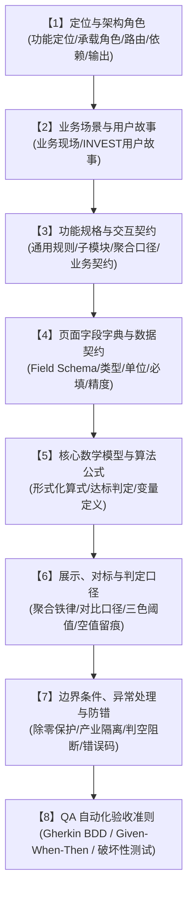

# 📑 特变电工能碳数字化双中心 · 模块级 PRD 标准模板与工程规范 (tbea-module-prd-template)

> **受控编号**：`TBEA-SKILL-MODULE-PRD-TEMPLATE-V1.0`  
> **归属工程**：特变电工能碳数字化双中心（零碳园区集控中心 + 产品碳足迹集采中心）  
> **基准来源**：基于【指标管控】v2.0 工业级样板沉淀，确立为全系统所有页面 PRD 的八段式完整度基准（Single Source of Truth）  
> **适用范围**：所有产品经理 (PM)、系统架构师 (Dev)、测试工程师 (QA) 及 AI Agent 在编写、扩展、重构或评审具体功能页面需求规格时**必须全量遵循**。

---

## 一、 八段式完整度总览与设计哲学

在特变电工工业软件研发体系中，任何业务功能页面均不得采用粗放的“界面截图 + 简单说明”方式编写 PRD。每个功能页面必须严格具备 **“八段式完整度”**，确保业务价值、技术实现与测试验收形成闭环：



---

## 二、 八大板块 Schema 结构与编写规范

### 【1】定位与架构角色 (Positioning & Architectural Role)
- **核心目的**：界定本页面在全景系统拓扑中的业务定位与上下游契约。
- **必备要素**：
  1. **功能定位**：一句话阐明该页面的核心业务使命与交互模式（如 Mode A 宏观矩阵 / Mode B 详情内页双模无损穿透）；
  2. **承载角色 (Persona)**：明确主要使用角色的代码与职责（如 P1 集团决策层、P2 园区能碳专员、P3 车间填报员、P4 碳核算工程师、P5 国际贸易专家、P6 外部审计）；
  3. **页面路由体系**：
     - 主页面路由：如 `/zero-carbon/monitor/indicators`
     - 详情/下钻页面路由：如 `/zero-carbon/monitor/indicators/detail/:kpiCode`
  4. **上游数据依赖**：明确前序输入系统（IoT 实时遥测、ERP 报工、MES 产量、折标系数库版本、六级组织主数据）；
  5. **下游业务输出**：明确该页面计算或交互结果输出至何处（归因桑基图、对标管理、统计报表、自评估输入等）；
  6. **文档基准地位**：声明版本效力与演进关系。

---

### 【2】业务场景与用户故事 (Business Scenarios & User Stories)
- **核心目的**：将抽象功能锚定于真实的生产、运营与经营现场，明确商业防错价值。
- **必备要素**：
  1. **典型业务场景**：叙述具体场景（如月度经营分析会、突增能耗排查、工序用能对标、出海关税模拟等）；
  2. **INVEST 用户故事**：严格遵循结构化 INVEST 模板：
     ```text
     As a <角色名称与 Persona ID>,
     I want <在什么界面/维度进行何种操作或查看何种数据>,
     So that <解决什么具体业务痛点，达成什么管理目标与防错价值>.
     ```

---

### 【3】功能规格与交互契约 (Functional Specifications & Interaction Contracts)
- **核心目的**：全景拆解界面的视觉形态、交互联动机制、子模块规格与业务约束。
- **必备要素**：
  1. **页面通用交互规则**：
     - 左侧组织拓扑树联动规则（4级/6级组织树下钻）；
     - 顶部时间控件规格与周期联动（日/月/年，单选/跨度区间）；
     - 多模穿透与状态保留（如平滑展开 Mode B 抽屉/内页，返回时保留筛选上下文）；
  2. **细分子模块规格拆解 (按 3.1, 3.2, 3.3... 逐一细分展开)**：
     - **组件形态**：卡片矩阵、趋势折线图、结构圆环、44px 工业表格、桑基图、雷达图等；
     - **联动与条件渲染**：触发联动的条件（如点击卡片联动下方图表、仅选择一级节点时渲染桑基图等）；
     - **跨层级聚合口径矩阵表**：定义关键参数在“一级(集团) ➔ 二级(产业) ➔ 三级(分子公司) ➔ 四级(工厂)”不同层级下的计算规则（直接求和 vs 分子分母相加后重算）；
     - **指标与数据清单表**：列出子模块包含的全部指标名称、单位、模型与业务说明；
     - **📌 【业务约束与工程规范契约】Callout 框**：
       - **产业分母物理隔离**：变压器（`kVA` / `万kVA`）与线缆（`km·mm²` / `万km·mm²`）严禁混算；
       - **权威制造工序白名单精准单行判空**：遵循《生产单位与涉及关键工序对应表》，10 家无关键工序单位精准单行输出 `暂无相关工序！`，严禁空白占位与主观说教。

---

### 【4】页面字段字典与数据契约 (Data Dictionary & Schema)
- **核心目的**：为前端组件状态、后端 REST/GraphQL API、数仓建模提供单一事实源。
- **标准表格字段定义**：

| 序号 | 字段唯一标识 (`field_id`) | 字段中文名称 (`name_zh`) | 数据类型 (`type`) | 工程物理单位 (`unit`) | 必填 (`required`) | 精度 (`precision`) | 来源系统 (`source`) | 校验与约束规则 (`business_rule`) |
| :---: | :--- | :--- | :---: | :---: | :---: | :---: | :---: | :--- |
| 1 | `KPI_ENERGY_TOTAL_TCE` | 综合能源消费量 | decimal | tce | true | 4 | `tbea_calc.energy_coal_eq` | `>= 0`；空值显示 `--`；严格按 GB/T 2589-2020 当量折标 |

---

### 【5】核心数学模型与算法公式 (Mathematical Models & Algorithms)
- **核心目的**：确保所有业务计算逻辑具备严谨的数学形式化定义与除零容错机制。
- **规范展现形式**：使用独立绿色公式卡片 `📐 【核心业务数学模型与计算公式】` 包裹：
  - **核心计算模型 (LaTeX 表达式)**：如折标煤、碳排放、单耗滚算、分摊模型；
  - **达标判定与偏差量算法**：
    $$Ach = \begin{cases} \frac{\text{Benchmark}}{\text{Actual}}, & \text{指标越低越好（如单耗、碳排）} \\ \frac{\text{Actual}}{\text{Benchmark}}, & \text{指标越高越好（如绿电占比、自用率）} \end{cases}$$
    $$gapPct = \begin{cases} \frac{\text{Actual} - \text{Benchmark}}{\text{Benchmark}} \times 100\%, & \text{指标越低越好} \\ \frac{\text{Benchmark} - \text{Actual}}{\text{Benchmark}} \times 100\%, & \text{指标越高越好} \end{cases}$$
  - **变量定义与取值约定**：明确各变量符号的物理含义、标准系数引用来源及取值范围。

---

### 【6】展示、对标与判定口径 (Display, Benchmark & Criteria)
- **核心目的**：消除界面呈现歧义，统一前端视觉编码与统计口径。
- **规范要素**：
  1. **聚合口径铁律**：
     - **绝对量类指标**（总用能、总碳排、用水量）：各下级直接累加汇总；
     - **比率/单耗类指标**（单耗、绿电占比、自用率）：必须先汇总分子总和、汇总分母总和后再行相除，**严禁对各下级比率直接求算术平均**；
  2. **对比口径**：明确同比（与去年同期相比）、环比（与上月/上期相比，且锁定同型号产品对比）；
  3. **状态三色判定阈值字典**：
     - **优秀（绿色）**：达标系数 $Ach \ge 1.00$；
     - **正常（黄色/蓝色）**：达标系数 $0.85 \le Ach < 1.00$；
     - **异常（红色）**：达标系数 $Ach < 0.85$；
  4. **空值口径**：任何缺失或未上报指标统一输出 `--`，支持悬停查看“数据尚未上报”，严禁显示 `0` 冒充真实值；
  5. **口径版本留痕**：卡片支持查看核算采用的指标口径版本、折标系数版本及最后核算时间戳。

---

### 【7】边界条件、异常处理与防错规则 (Boundaries, Errors & Guards)
- **核心目的**：构建工业级高鲁棒性防线，统一系统错误码体系。
- **规范展现形式**：以 `⚠️ 【研发设计红线与强约束校验】` 包裹，并挂载受控错误码：
  - **除零安全防御**：分母（产量、产值、增加值、总电量）为 0 时统一兜底 `--`，抛出 `E_CALC_UNIT_DIV_ZERO_SOFT`，严禁白屏或抛出 `NaN`/`Infinity`；
  - **跨产业物理量隔离**：变压器与线缆在数据库表、API 响应、页面展示与导出文件中绝对禁止混编在同一统计列，违规触发 `E_BIZ_INDUSTRY_MIXED`；
  - **工序白名单缺失判空**：10 家无工序单位精准单行输出 `暂无相关工序！`，触发 `E_QM_WHITE_LIST_MISS`；
  - **RBAC 权限越权拦截**：无权限角色访问触发 `E_AUTH_RBAC_FORBIDDEN`；
  - **财务切账锁账防篡改**：已关账月份禁止重算或写入，触发 `E_SYS_ENTRY_ALREADY_LOCKED`；
  - **因子/参数过期预警**：引用过期折标系数或排放因子触发 `E_VAL_FACTOR_EXPIRED`。

---

### 【8】QA 自动化验收准则 (QA Acceptance Criteria & Gherkin BDD)
- **核心目的**：以 BDD 行为驱动开发语言定义测试与交付门禁，实现自动化回归测试。
- **规范展现形式**：以 `🧪 【QA 自动化验收准则 · Gherkin BDD 用例契约】` 呈现，必须包含：
  1. `Feature`：功能特性唯一命名；
  2. 至少 4 个典型场景（`Scenario`）：
     - 主干业务与聚合口径正确性场景；
     - 极限除零边界与空值安全兜底场景；
     - 工序白名单与无工序单行判空场景；
     - 产业分母隔离与 Excel 导出隔离场景；
  3. 每个场景严格按照 `Given`（前置环境）➔ `When`（触发动作）➔ `Then`（预期响应）➔ `And`（并列断言）书写。

---

## 三、 特变电工 6 大工程设计不变量 (Engineering Invariants)

在编写任何模块 PRD 时，必须无条件遵循以下 6 大硬性准则：

1. **绝对客观中立原则**：系统是纯粹的工业物理量与时序数据中枢，严禁出现任何主观褒贬、定性评价或说教指责词汇（如“表现优异”、“落后单位”、“运行欠佳”、“建议推进技改”等），统一以**客观时序对比（同环比、基准偏差量）与客观运行工况（运行中、待机、检修）**呈现；
2. **44px 工业高密表格**：全系统数据表格行高固定为 **`44px`**（`h-[44px]`），垂直居中，数字列采用等宽 Mono 字体右对齐；
3. **状态自解释无多余标签**：激活态统一由边框高亮（`border-primary ring-2`）自解释，严禁在卡片或控件上增加“图表联动中”、“已选中”等自述说明标签；
4. **极简空状态单行结论**：无工序或无数据时仅输出单行干练结论（如 `暂无相关工序！`、`暂无相关产品！`），严禁大段陈述理由与依据；
5. **分母物理量物理隔离**：变压器按容量 `kVA`，线缆按规格 `km·mm²`，严禁跨产业横向对比或混合排名；
6. **数学除零软兜底**：分母为零一律输出 `--`，底层记录软告警，杜绝系统白屏。

---

## 四、 页面级 PRD 开箱即用空白模板 (Markdown Template)

后续编写任何新页面/模块时，直接复制以下空白骨架并填入内容：

```markdown
# [页面/模块名称] · 功能需求规格说明书 (PRD)

> **页面路由**：`/[主路由]` ｜ 详情内页：`/[主路由]/detail/:id`  
> **归属工程**：特变电工能碳数字化双中心 · [零碳园区集控中心 / 产品碳足迹集采中心]  
> **受控编号**：`TBEA-PRD-MOD-[模块代码]-2026`  
> **基准规范**：`tbea-module-prd-template` (v1.0.0) × `tbea-industrial-design` (v1.0.0)

---

## 【1】定位与架构角色
- **功能定位**：[一句话说明功能定位，如双模穿透、监控大屏、数据台账等]
- **承载角色**：[明确主要 Persona，如 P1 集团决策层 / P2 园区能碳专员 / P4 碳核算工程师]
- **页面路由**：`[主路由]`；详情内页：`[详情路由]`
- **上游依赖**：[数据来源，如 IoT 遥测、MES 产量、折标系数库版本、组织树六级节点]
- **下游输出**：[输出目标，如归因流、对标管理、统计报表、认证中心]
- **本文档定位**：[版本效力与基准说明]

---

## 【2】业务场景与用户故事
- **业务场景**：[描述具体的工业/管理生产现场与高频使用时机]
- **用户故事 (INVEST)**：
  ```text
  As a [角色名称与 Persona ID],
  I want [在什么界面/维度进行何种操作或查看何种数据],
  So that [解决什么具体业务痛点，达成什么管理目标与防错价值].
  ```

---

## 【3】功能规格与交互契约
### 3.0 页面通用交互规则
- **组织拓扑树驱动**：[左侧企业组织树联动规则]
- **时间控件规格**：[右上方日/月/年，单月/跨月筛选规则]
- **交互与穿透模式**：[如 Mode A 宏观矩阵与 Mode B 详情内页侧滑展开]

### 3.1 [子功能模块一名称]
- **展示组件与形态**：[卡片、图表、表格等]
- **交互联动机制**：[点击、悬浮、切页联动逻辑]
- **指标清单与数据字典**：

| 序号 | 指标名称 | 单位 | 核算数学模型 | 业务说明 |
| :---: | :--- | :---: | :--- | :--- |
| 1 | [指标名] | [单位] | [算式] | [说明] |

### 3.2 [子功能模块二名称]
...

### 3.X 跨层级聚合口径矩阵表
| 一级节点 (集团) | 二级节点 (产业公司) | 三级节点 (分子公司) | 四级节点 (实体工厂) |
| :--- | :--- | :--- | :--- |
| [聚合规则] | [聚合规则] | [聚合规则] | [显示工厂底度/明细] |

📌 【业务约束与工程规范契约】
- [约束 1：产业分母物理量隔离规则]
- [约束 2：权威工序白名单与无工序单行输出“暂无相关工序！”规则]

---

## 【4】页面字段字典与数据契约
| 序号 | 字段唯一标识 (`field_id`) | 字段中文名称 (`name_zh`) | 数据类型 (`type`) | 工程物理单位 (`unit`) | 必填 (`required`) | 精度 (`precision`) | 来源系统 (`source`) | 校验与约束规则 (`business_rule`) |
| :---: | :--- | :--- | :---: | :---: | :---: | :---: | :---: | :--- |
| 1 | `FIELD_KEY` | 字段名称 | decimal | kWh | true | 2 | `tbea_iot.meter` | `>= 0`；空值兜底 `--` |

---

## 【5】核心数学模型与算法公式
📐 【核心业务数学模型与计算公式】

[形式化 LaTeX 核心计算公式]

- 达标判定与偏差量算法：
  $$Ach = \dots$$
  $$gapPct = \dots$$

- 变量定义与取值约定：
  - [变量 1]：定义与单位；
  - [变量 2]：定义与单位。

---

## 【6】展示、对标与判定口径
- **聚合口径铁律**：[绝对量直接累加；比率/单耗类先汇总分子分母再重新计算，严禁对平均值求平均]
- **对比口径**：[同比与环比定义，环比锁定同型号对比]
- **三色判定阈值**：[优秀绿: Ach ≥ 1.00；正常蓝/黄: 0.85 ≤ Ach < 1.00；异常红: Ach < 0.85]
- **空值口径**：[统一显示 `--`，支持 Tooltip 查看原因，严禁显示 0]
- **口径版本留痕**：[卡片右下角悬停查看采用的口径与系数版本]

---

## 【7】边界条件、异常处理与防错规则
⚠️ 【研发设计红线与强约束校验】
- **除零安全兜底**：分母为 0 时统一兜底显示 `--`，记录 `E_CALC_UNIT_DIV_ZERO_SOFT`，严禁抛出 `NaN` 或白屏；
- **产业分母隔离**：[产业隔离防错]；
- **无工序精准判空**：[未配置工序单位精准单行输出“暂无相关工序！”，触发 `E_QM_WHITE_LIST_MISS`]；
- **RBAC 越权拦截**：[触发 `E_AUTH_RBAC_FORBIDDEN`]；
- **财务切账锁账拦截**：[已关账月度禁止修改，触发 `E_SYS_ENTRY_ALREADY_LOCKED`]；
- **因子失效拦截**：[触发 `E_VAL_FACTOR_EXPIRED`]。

---

## 【8】QA 自动化验收准则 (Gherkin BDD)
🧪 【QA 自动化验收准则 · Gherkin BDD 用例契约】

Feature: [功能特性名称]
  Scenario: [场景一：核心逻辑与聚合口径正确性]
    Given [前置工况]
    When [用户触发动作]
    Then [系统响应]
    And [断言详情]

  Scenario: [场景二：极限除零边界安全防御]
    Given [分母为 0 工况]
    When [渲染指标卡片]
    Then 指标安全显示为 "--"
    And 页面不出现 NaN、Infinity 或白屏
    And 后台记录 E_CALC_UNIT_DIV_ZERO_SOFT

  Scenario: [场景三：无工序单位精准单行判空]
    Given 组织树选中 10 家无工序单位之一
    When 页面渲染工序区域
    Then 整行仅输出单行文本 "暂无相关工序！"
    And 不出现空白占位与主观说教文案

  Scenario: [场景四：跨产业隔离与导出隔离]
    Given [变压器与线缆数据同时存在]
    When [生成报表与导出]
    Then 两产业分别以独立口径成列，无跨产业混算
```
