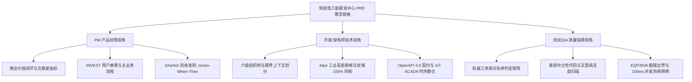

# 📘 特变电工能碳数字化双中心 · PRD 需求规格说明书编制与工程维护规范 (TBEA PRD Standards)

> **文档代号**：`TBEA-PRD-MASTER-2026`  
> **Skill 版本**：`v1.1.0`（v1.0 → v1.1 补强了数据治理/状态机/错误码/RACI/Skill 契约/Agent 输出 Schema/法规映射 7 个章节）  
> **位置说明**：本 skill 为项目级 skill，落盘于 `D:\Project\TJ-nengtan\.workbuddy\skills\tbea-prd-standards\SKILL.md`

本规范作为特变电工（TBEA）能碳数字化双中心（零碳园区集控中心 + 产品碳足迹集采中心）产品需求规格说明书（PRD）的标准编制指南与工程底座。所有产品经理 (PM)、系统架构师 (Dev)、测试工程师 (QA) 及 AI Agent 在编写、评审、迭代或维护本项目 PRD 文档时，**必须无条件激活并全量遵循本 Skill**。

---

## 一、 PRD 核心定位与三方协同闭环 (Multi-Agent Triad)

一份工业级 PRD 不仅是功能说明，更是**连接业务战略、技术实现与质量验收的最高工程契约**。必须严格实现 PM、开发与测试三方闭环：



### 1. PM 产品经理视角 (Business Value & User Stories)
- **INVEST 原则**：所有功能故事必须满足独立性 (Independent)、可协商 (Negotiable)、有价值 (Valuable)、可估算 (Estimable)、小颗粒度 (Small)、可测试 (Testable)；
- **Gherkin 规范**：功能验收必须明确描述 `Given (前置条件) - When (操作动作) - Then (预期输出)`；
- **双模穿透机制**：深入设计宏观态势（Mode A）与微观分析（Mode B）之间的钻取与联动闭环。

### 2. 开发与系统架构视角 (Dev & Technical Contracts)
- **架构解耦**：严格遵循时序数据（IoT SCADA 秒级高频读数）与关系型业务数据（ERP/MES/BOM/台账）的物理隔离与数仓分层；
- **双端同构**：暗黑科技蓝（3000 端口）与浅色办公商务（3001 端口）功能、数据、布局必须 100% 严格同构；
- **工业设计落地**：严格落实 `tbea-industrial-design` 工业设计铁律（表格 44px 强制行高、微透科技蓝光标、自解释状态）。

### 3. 测试质量负责人视角 (QA Lead & Safety Net)
- **破坏性测试思维**：主动针对除以零（单耗产量为 0）、负数输入、超大数值、网络抖动进行故障注入 (Chaos Testing)；
- **权威工序表白名单强制校验**：严格依据《生产单位与涉及关键工序对应表(1).et》，对 10 家无工序单位精准单行输出 `暂无相关工序！`；
- **客观中立性代码审查**：全量代码与文本严禁包含任何主观褒贬与定性评判词汇。

---

## 二、 PRD 标准 10 大内容板块架构 (The 10 PRD Pillars)

每篇完整的模块 PRD 或系统级 PRD 详案，必须完整包含以下 10 大核心板块：

### 1. 文档元数据与多方审签表 (Metadata & Sign-off)
- **受控编号**：统一采用 `TBEA-PRD-[模块代号]-2026-V[X.Y]` 命名；
- **密级标注**：标明"内部绝密 (Confidential)"或"商业秘密"；
- **四方审签表**：PM 负责人、研发架构师、QA 测试组长、数字化项目总监会签结论；
- **修订演变历史**：版本号、修订时间、修改章节与动因（权威工序依据/客户反馈）、修改人与审核人。

### 2. 业务背景、目标与北极星指标 (Context & Vision)
- **业务痛点**：全集团综合能耗穿透难、基层离线数据杂乱、产品出口面临欧盟 CBAM 关税壁垒；
- **北极星指标**：万元产值综合能耗下降率、关键制造工序能效提升比、出口产品碳足迹认证覆盖率、CBAM 关税扣减优化率。

### 3. 目标用户画像与权限边界矩阵 (Personas & RBAC)
- 必须涵盖 **6 大典型用户画像**：
  1. `P1 集团决策层`：宏观态势感知、零碳工厂达标率、国际关税风险；
  2. `P2 园区/企业能碳专员`：穿透监管设备/工序用能，抓取跑冒滴漏，推进峰谷平尖降本；
  3. `P3 车间填报员`：离线产量、能耗高密录入与纠错防错；
  4. `P4 碳核算与认证工程师`：BOM 展开、因子匹配、LCA 建模与碳标签签批；
  5. `P5 国际贸易与关税专家`：海关税号映射、前驱物追溯、关税测算与申报；
  6. `P6 外部审计机构`：物料平衡核验、绿证核销链条真实性防伪查验。
- **六级组织穿透鉴权**：集团 ➔ 产业集团 ➔ 二级公司 ➔ 生产园区 ➔ 制造车间 ➔ 用能设备。

### 4. 总体架构与端到端数据流 (Architecture & Data Flows)
- 平台双中心功能架构图（零碳园区集控中心 + 产品碳足迹集采中心）；
- 端到端数据链路图：物理采集（SCADA/物联表） ➔ 业务数仓 ➔ 规则与算法引擎 ➔ 驾驶舱/报表。

### 5. 专属工业设计与交互规范 (`tbea-industrial-design` 硬性红线)
1. **数据表格强制 44px 行高**：全系统 `<tr>` 行高强制固定为 **`44px`**（`h-[44px]`），垂直居中；
2. **绝对客观中立**：严禁出现定性评价信息（如"表现优异"、"落后单位"、"运行欠佳"等），纯以客观时序对比（同比/环比/基准偏差）呈现；
3. **极简状态自解释**：杜绝"图表联动中"、"已选中"等标签，激活态由蓝框高亮（`border-primary ring-2`）自解释；
4. **单行干练判空**：无工序单位统一单行输出 `暂无相关工序！`，无大段解释；
5. **图表悬停微透光标**：深色模式柱状图游标统一为 `rgba(56, 189, 248, 0.08)`，浅色为 `rgba(0, 0, 0, 0.04)`，严禁纯白眩光；
6. **双端 100% 同构**：暗黑端与浅色端功能、数据与状态流严格一致。

### 6. 详细功能需求规格 (按主导航逐层拆解 - 核心主体)
- 详见后文【第三章：主导航层级逐层拆解法】。

### 7. 数据字典与核心数学核算模型 (Data Dictionary & Formulas)
- **数据字段详表**：字段英文标识、字段中文名、数据类型、量纲单位、来源、必填、精度格式；
- **核心算法模型**：
  - 单位产品能耗隔离公式：变压器以千伏安为分母 $e = \frac{E}{M_{\text{kVA}}}$；电缆以公里为分母 $e = \frac{E}{M_{\text{km}}}$；
  - 能源折标煤系数：电力 $0.1229\text{ kgce/kWh}$ 等国家标准折标库；
  - LCA 碳足迹滚算模型：原材料、运输、制造、检测、包装五大阶段碳排放滚算；
  - CBAM 欧盟碳关税测算模型：ETS 碳价联动、直接/间接排放边界与国内已付碳成本抵扣。

### 8. 非功能性需求 (NFR)
- **页面性能指标 (Core Web Vitals)**：LCP $< 1.8\text{s}$，INP $< 100\text{ms}$，CLS $< 0.05$；
- **大屏矢量缩放**：1920×1080 自适应缩放，4K 下动画 CPU 占用 $< 15\%$；
- **防伪与合规**：导出文件强制附带操作员工号与时间戳防伪水印。

### 9. 外部系统接口与集成契约 (API & IoT)
- **IoT 物联采集**：Modbus-TCP / MQTT 秒级遥测规范；
- **企业信息化集成**：遵循 OpenAPI 3.0 标准契约，支持 ERP BOM、MES 产量报工与财务电费发票同步。

### 10. 质量保障体系与全量验收测试用例矩阵 (QA Matrix)
- 编写 Gherkin 验收准则与破坏性测试矩阵（EQP/BVA：除以零防御、负数拦截、100ms 并发防刷、白名单单行判空）。

---

## 三、 主导航层级逐层拆解法 (Navigation Hierarchy Breakdown)

在编写功能需求章节时，**必须严格映射系统的真实操作路径，按层级递进展开**：

```
系统顶层门户 (Portal)
└── 切换至对应中心：
    ├── 【平台一】零碳园区集控中心 (zero-carbon)
    │   ├── 一级导航 1: 集控中心大屏 (/zero-carbon/screen)
    │   │   ├── 二级导航: 全景环幕大屏 (/zero-carbon/screen)
    │   │   └── 二级导航: 综合集控大屏 (16:9) (/screen/control-center)
    │   ├── 一级导航 2: 集中监管 (/zero-carbon/monitor)
    │   │   ├── 二级导航: 指标管控 (/zero-carbon/monitor/indicator) -> Mode A ⇄ Mode B
    │   │   ├── 二级导航: 用能在线监测 (/zero-carbon/monitor/online/usage) -> 电力峰平谷 vs 非电重点工序
    │   │   ├── 二级导航: 工业微电网监测 (/zero-carbon/monitor/online/microgrid)
    │   │   └── 二级导航: 能源碳排放监测 (/zero-carbon/monitor/carbon-emission)
    │   ├── 一级导航 3: 能耗能效分析 (/zero-carbon/energy)
    │   │   ├── 二级导航: 用能结构分析 (/zero-carbon/energy/structure)
    │   │   ├── 二级导航: 能源成本分析 (/zero-carbon/energy/cost)
    │   │   ├── 二级导航: 单位产品能耗 (/zero-carbon/energy/unit-product)
    │   │   ├── 二级导航: 单位产值能耗 (/zero-carbon/energy/unit-output)
    │   │   └── 二级导航: 对标管理 (/zero-carbon/energy/benchmark)
    │   ├── 一级导航 4: 零碳项目评估 (/zero-carbon/project)
    │   │   ├── 二级导航: 项目档案管理 (/zero-carbon/project/archive)
    │   │   ├── 二级导航: 实时监控 (/zero-carbon/project/monitoring)
    │   │   ├── 二级导航: 项目运行评估 (/zero-carbon/project/benefit)
    │   │   └── 二级导航: 零碳工厂自评估 (/zero-carbon/project/self) -> 集团/公司/工厂三层穿透
    │   ├── 一级导航 5: 统计报表 (/zero-carbon/reports)
    │   │   ├── 二级导航: 用能报表 (/zero-carbon/reports/usage)
    │   │   ├── 二级导航: 成本报表 (/zero-carbon/reports/cost)
    │   │   └── 二级导航: 单耗报表 (/zero-carbon/reports/unit)
    │   └── 一级导航 6: 基础管理 (/zero-carbon/config/entry)
    │       └── 二级导航: 数据录入工作台 (/zero-carbon/config/entry)
    │           ├── Tab 1: 产品产量录入 (同类型跨行合并居中)
    │           ├── Tab 2: 能源消耗录入 (非负校验拦截)
    │           ├── Tab 3: 园区相册维护 (实景轮播配置)
    │           └── Tab 4: 园区大事记维护 (时间轴节点)
    │
    └── 【平台二】产品碳足迹集采中心 (carbon-footprint)
        ├── 一级导航 1: 对外示范窗口 (/carbon-footprint/cockpit)
        ├── 一级导航 2: 多维分析 (/carbon-footprint/analysis)
        │   ├── 二级导航: 横向对比 (/carbon-footprint/analysis/compare)
        │   └── 二级导航: 纵向对比 (/carbon-footprint/analysis/ranking)
        ├── 一级导航 3: 实景数据库 (/carbon-footprint/database)
        │   ├── 二级导航: 实景数据库 (/carbon-footprint/database/realscene)
        │   ├── 二级导航: 碳足迹核算 (/carbon-footprint/database/accounting) -> LCA 5大阶段
        │   └── 二级导航: 碳足迹报告 (/carbon-footprint/database/report)
        ├── 一级导航 4: CBAM管理 (/carbon-footprint/cbam)
        │   ├── 二级导航: 合规管理 (/carbon-footprint/cbam/compliance)
        │   ├── 二级导航: 申报模拟 (/carbon-footprint/cbam/declaration)
        │   └── 二级导航: 知识库 (/carbon-footprint/cbam/knowledge)
        ├── 一级导航 5: 第三方认证管理 (/carbon-footprint/certification)
        │   ├── 二级导航: 认证资料维护 (/carbon-footprint/certification/material)
        │   ├── 二级导航: 认证申请 (/carbon-footprint/certification/apply)
        │   └── 二级导航: 认证结果管理 (/carbon-footprint/certification/result)
        └── 一级导航 6: 因子库管理 (/carbon-footprint/factor)
            ├── 二级导航: 原材料碳排因子 (/carbon-footprint/factor/material)
            ├── 二级导航: 电力碳排因子 (/carbon-footprint/factor/power)
            ├── 二级导航: 能源活动碳排因子 (/carbon-footprint/factor/energy)
            └── 二级导航: 折标煤系数库 (/carbon-footprint/factor/coal)
```

每个功能节点的 PRD 说明必须遵循以下固定结构：
1. **【定位与路由】**：明确页面路径与权限归属；
2. **【业务场景与用户故事 (PM)】**：INVEST 格式用户故事与北极星驱动；
3. **【功能规格与交互契约 (Dev)】**：详细控件逻辑、44px 表格、联动模型；
4. **【数据字典与数学公式】**：底层输入输出定义与计算公式；
5. **【验收标准与边界测试 (QA)】**：Gherkin 规范与破坏性测试用例。

### 3.1 主导航节点标准 ID 锚点规范 (Nav ID Anchor)

为便于 AI Agent 与人类读者双向跳转引用，每个节点必须分配**稳定 ID 锚点**，命名规则：

```
NAV-<CENTER>-<NAVI>-<NAVII>
```

| 样例路径 | 标准 ID | 释义 |
|:---|:---|:---|
| `/zero-carbon/screen` | `NAV-ZC-SCR-PANORAMA` | 零碳 / 大屏 / 全景 |
| `/zero-carbon/monitor/indicator` | `NAV-ZC-MON-IND` | 零碳 / 监管 / 指标管控 |
| `/zero-carbon/config/entry` | `NAV-ZC-CON-ENTRY` | 零碳 / 配置 / 录入工作台 |
| `/carbon-footprint/database/accounting` | `NAV-CF-DB-LCA` | 碳足迹 / 数据库 / LCA 核算 |
| `/carbon-footprint/cbam/declaration` | `NAV-CF-CBAM-DECL` | 碳足迹 / CBAM / 申报模拟 |

> **强制**：PRD 文档引用任何导航节点时，**必须使用 NAV-ID** 而非人类解读路径，便于文档交叉引用、变更追踪与 Agent 检索。

---

## 四、 Word 版 (.docx) 输出排版与工程构建规范

所有最终交付给客户与管理层的 PRD 必须采用高标准 Word 版输出：
1. **统一存储目录**：必须保存于 `D:\Project\TJ-nengtan\PRD\` 目录下；
2. **自动化构建引擎**：统一通过 `D:\Project\TJ-nengtan\PRD\build_prd_docx.py` 脚本自动化生成，支持一键无损更新；
3. **排版设计标准**：
   - **企业深蓝封面**：特变深蓝 `#1E3A8A` 标题与审签表；
   - **高密工业表格**：表头深蓝底白字，内容行支持交替浅灰底色 `#F8FAFC`，内边距紧凑；
   - **Callout 约束提示框**：业务约束、白名单红线采用左侧加粗色条（`#2563EB` 或 `#DC2626`）与浅色背景框；
   - **受控页眉页脚**：包含文档编号、版本代号、内部绝密警告与居中页码。

---

## 五、 PRD 维护纪律与建档机制

1. **自动维护档案**：每次编写或修改 PRD 文档后，**必须在向用户汇报前原位更新 `MODIFICATIONS_LOG.md` 第 6.5 节**；
2. **严格遵循部署纪律**：**严禁自动向生产机（8.215.89.194）执行线上推送，严禁自动执行 `git commit` 或 `git push`**。所有 PRD 产物必须仅留存于本地工作区 `D:\Project\TJ-nengtan\PRD\`，等待用户明确指令！

---

## 六、 数据治理与商密合规 (Data Governance & Confidentiality) 🆕

> 本章在 v1.0 基础上为补强章节，专治"敏感字段无脱敏、操作无留痕、数据无法定保留期限"的工业级病灶。

### 6.1 数据分级矩阵 (Data Classification)

| 级别 | 标签 | 样例字段 | 处理要求 |
|:---|:---|:---|:---|
| **L0 公开** | `PUBLIC` | 国家行业能耗先进值、政策法规 | 可对外发布 |
| **L1 内部** | `INTERNAL` | 集团万元产值能耗、单位产品单耗 | 仅特变集团内可见 |
| **L2 敏感** | `SENSITIVE` | 客户名称、设备编号、电费金额 | 脱敏后展示，审计留痕 |
| **L3 商密** | `CONFIDENTIAL` | 工艺配方、节能技改节能量、CBAM 申报底表 | 加密存储 + 操作审计 |
| **L4 绝密** | `TOP_SECRET` | 集团战略级零碳路线图、领导批示 | 强制水印 + 双人审批 |

> **强制**：所有 PRD 在描述数据字段时，必须明确标注 `data_class=` 枚举（见附录 B.2 字段 Schema）。

### 6.2 商密字段处理规则 (Field Masking Rules)

| 字段类型 | 展示规则 | 导出规则 | 示例 |
|:---|:---|:---|:---|
| 身份证号 | `110***********1234` | 保留前 6 后 4，CSV/PDF 中强制带 `[MASKED]` 标记 | L4 |
| 手机号 | `138****1234` | 保留前 3 后 4 | L3 |
| 电费金额 | `***.*** 元` | 仅 P1 决策层可见完整数字；导出报表自动四舍五入到万元 | L3 |
| 设备 UUID | `EQP-2024-****-A2C3` | 保留前缀与尾 4 字符 | L2 |
| 客户名 | `[客户 A]` (代号化) | 脱敏为客户代号，除非合同授权 | L3 |
| CBAM 申报底表 | 仅 P5 + PM 可见 | 打印强制水印 + PDF 数字签名 | L3 |

### 6.3 操作审计留痕 (Audit Trail)

所有针对 L2 及以上级别的字段做 **增、删、改、查** 操作，必须记录：
- 操作人工号、IP、时间戳（精确到毫秒）；
- 操作前后字段值 diff（hash 链式锚定，前一 hash 写入后一 hash 头部，防篡改）；
- 授权审批单 ID（涉及审批场景）。

PRD 编写时必须明确：**哪些页面、哪些动作触发审计埋点**。

### 6.4 数据保留与销毁 (Retention & Disposal)

| 数据类别 | 保留期限 | 销毁方式 |
|:---|:---|:---|
| 工业时序遥测 | ≥ 3 年（在线）+ 10 年（冷归档） | 离线物理销毁 |
| 财务报表 | ≥ 10 年 | 不可逆加密擦除 |
| CBAM 申报底表 | ≥ 10 年（欧盟海关要求） | 不可逆加密擦除 |
| 操作日志 | ≥ 5 年 | 不可逆加密擦除 |
| LCA 报告 | 永久留底（认证机构可能 5 年后追溯） | 不可销毁 |

### 6.5 GDPR / 个人信息保护法适配边界

虽然本系统以工业数据为主，但：
- 涉及 `P3 车间填报员` 录入人员信息的场景，遵循《个人信息保护法》最小必要原则；
- 涉及 `P6 外部审计机构` 持有只读通道的，必须签署 DTA（数据处理协议）；
- 数据出境（如 CBAM 报关数据包欧盟上传）：必须经法务与数据出境安全评估。

---

## 七、 关键业务状态机图谱 (Business State Machines) 🆕

> 本章在 v1.0 基础上为补强章节，为 LCA、CBAM、项目评估等长链路业务提供状态机范式。

PRD 中凡涉及"长流程、可审批、可回退"的业务节点，必须给出状态机 + 状态转移矩阵。

### 7.1 碳足迹核算状态机 (LCA Workflow)

```
[草稿 DRAFT] --内审通过--> [送审 SUBMITTED]
[送审 SUBMITTED] --机构受理--> [认证中 CERTIFYING]
[认证中 CERTIFYING] --签发证书--> [已认证 CERTIFIED]
[认证中 CERTIFYING] --退回修改--> [草稿 DRAFT]
[已认证 CERTIFIED] --生成 LCA 报告--> [已发布 PUBLISHED]
[已发布 PUBLISHED] --归档--> [已归档 ARCHIVED]
```

| 当前状态 | 可触发动作 | 触发者 |
|:---|:---|:---|
| 草稿 DRAFT | 提交内审、废弃删除 | P4 自身 |
| 送审 SUBMITTED | 撤回（限内审驳回） | P4 自身 |
| 认证中 CERTIFYING | 不可编辑，仅审批 | P4 + 外部机构 |
| 已认证 CERTIFIED | 一键发布 | P4 + PM 联合 |
| 已发布 PUBLISHED | 归档 | 仅 PM |

### 7.2 CBAM 申报状态机

```
[模拟测算 SIMULATING] --确认--> [待审 PENDING_REVIEW]
[待审 PENDING_REVIEW] --P5+P1 双签--> [已提交 SUBMITTED]
[已提交 SUBMITTED] --海关反馈--> [海关反馈 CUSTOMS_FEEDBACK]
[海关反馈 CUSTOMS_FEEDBACK] --补正--> [已提交 SUBMITTED]
[已提交 SUBMITTED] --年度归档--> [已归档 ARCHIVED]
```

### 7.3 零碳项目效益评估状态机

```
[项目立项 REGISTERED] --> [建设施工 CONSTRUCTING]
[建设施工 CONSTRUCTING] --> [并网试运行 TRIAL_RUN]
[并网试运行 TRIAL_RUN] --M&V 验收通过--> [稳定运行 STABLE]
[稳定运行 STABLE] --年度复评--> [稳定运行 STABLE] | [整改 RECTIFICATION]
[整改 RECTIFICATION] --整改完成--> [稳定运行 STABLE]
[稳定运行 STABLE] --项目终验--> [已完结 CLOSED]
```

### 7.4 基层数据填报状态机

```
[空白 BLANK] --P3 开始录入--> [录入中 EDITING]
[录入中 EDITING] --保存--> [已暂存 SAVED]
[已暂存 SAVED] --提交--> [已提交 SUBMITTED]
[已提交 SUBMITTED] --审核退回--> [已暂存 SAVED]
[已提交 SUBMITTED] --审核通过--> [已入账 POSTED]
[已入账 POSTED] --关账后--> [锁账 LOCKED]
```

> **强制**：PRD 中每个"业务对象"章节都必须有上述状态机的最简版，状态码见附录 B.3。

---

## 八、 术语表与缩略语 (Glossary & Abbreviations) 🆕

> 本章在 v1.0 基础上为补强章节，消除 PM/Dev/QA 跨角色沟通时的术语鸿沟。

| 术语 / 缩写 | 全称 | 释义 |
|:---|:---|:---|
| **PRD** | Product Requirements Document | 产品需求规格说明书 |
| **INVEST** | Independent / Negotiable / Valuable / Estimable / Small / Testable | 用户故事质量六维评估 |
| **Gherkin** | Given-When-Then | BDD 验收用例三段式语法 |
| **CBAM** | Carbon Border Adjustment Mechanism | 欧盟碳边境调节机制 |
| **ETS** | Emissions Trading System | 欧盟碳排放交易体系 |
| **LCA** | Life Cycle Assessment | 生命周期评价 |
| **BOM** | Bill of Materials | 物料清单 |
| **SCADA** | Supervisory Control and Data Acquisition | 数据采集与监视控制系统 |
| **MQTT** | Message Queuing Telemetry Transport | 轻量级物联网消息协议 |
| **OpenAPI** | OpenAPI Specification 3.0 | API 契约标准 |
| **GHG Protocol** | Greenhouse Gas Protocol | 温室气体核算体系 |
| **Scope 1 / 2 / 3** | 直接排放 / 间接电力排放 / 价值链排放 | GHG 三层排放边界 |
| **kgce** | kilogram of coal equivalent | 千克标煤 |
| **kVA / km** | 千伏安 / 公里 | 变压器 / 电缆单耗分母 |
| **M&V** | Measurement and Verification | 节能量测量与验证 |
| **EQP / BVA** | Equivalence Partitioning / Boundary Value Analysis | 等价类划分 / 边界值分析测试方法 |
| **NFR** | Non-Functional Requirement | 非功能性需求 |
| **LCP / INP / CLS** | Largest Contentful Paint / Interaction to Next Paint / Cumulative Layout Shift | Core Web Vitals 三大指标 |
| **RACI** | Responsible / Accountable / Consulted / Informed | 责任分配矩阵 |
| **RAFT** | Red / Amber / Green / Filled | 状态指示类型 |
| **MVI** | Minimum Viable Increment | 最小可行增量 |
| **DDD** | Domain-Driven Design | 领域驱动设计 |
| **Bounded Context** | — | 限界上下文（DDD 概念） |

---

## 九、 错误码字典与异常分类 (Error Code Catalog) 🆕

> 本章在 v1.0 基础上为补强章节，统一全平台错误响应格式。

### 9.1 错误码格式

```
E_<DOMAIN>_<MODULE>_<REASON>[_<SUFFIX>]
```

| 段 | 含义 | 取值样例 |
|:---|:---|:---|
| DOMAIN | 业务域 | `VAL` 校验 / `IO` 物联 / `AUTH` 鉴权 / `CALC` 计算 / `EXT` 外部接口 / `SYS` 系统 |
| MODULE | 模块名 | `MON-IND` 指标管控 / `CF-LCA` LCA / `CBAM-DECL` 申报 |
| REASON | 原因 | `NEGATIVE` 负数 / `ZERO_DIV` 除零 / `TIMEOUT` 超时 |
| SUFFIX | 可选后缀 | `_HARD` 硬中断 / `_SOFT` 软降级 |

### 9.2 异常分级

| 级别 | 含义 | 用户感知 | 处理 |
|:---|:---|:---|:---|
| **P0 系统级** | 平台不可用 | 全平台 500 页 | 双中心容灾切换、运维 PagerDuty |
| **P1 业务级** | 关键业务中断 | 模块级降级提示 | 自动 failover + 事务回滚 |
| **P2 提示级** | 单点业务提示 | Toast / 行内红字 | 用户修正 + 字段级校验 |
| **P3 信息级** | 状态通知 | Toast 绿条 | 仅前端提示 |

### 9.3 高频错误码样例表

| 错误码 | HTTP | 异常级别 | 触发场景 | 处理建议 |
|:---|:---:|:---:|:---|:---|
| `E_VAL_ENERGY_NEGATIVE` | 400 | P2 | 能源消耗录入负数 | 字段红字 + 拦截提交 |
| `E_VAL_MON_KVA_ZERO` | 400 | P2 | 单位产品能耗分母为零 | 强制要求补录产量 |
| `E_CALC_UNIT_DIV_ZERO_SOFT` | 200 | P3 | 单元表计算除零 | 显示 `—` 而非崩页 |
| `E_IO_MQTT_TIMEOUT` | 504 | P1 | IoT 网关 5 秒无响应 | 降级到最近一次缓存值 |
| `E_AUTH_RBAC_FORBIDDEN` | 403 | P1 | 越权访问 P5 模块 | 跳转 403 页 |
| `E_EXT_ETS_PRICE_STALE` | 200 | P2 | CBAM 测算时欧盟 ETS 价格超 24h 未更新 | 红字标注价格时间戳，建议手动刷新 |
| `E_SYS_DB_CONN_LOST` | 503 | P0 | 主库连接断开 | 双中心自动切换只读模式 |
| `E_QM_WHITE_LIST_MISS` | 200 | P3 | 工序列表查询不在白名单 | 单行输出 `暂无相关工序！` |

### 9.4 PRD 错误码章节最低完备度

每篇 PRD 中"QA 验收章节"必须**至少枚举 8 条错误码**（覆盖：负数、除零、超时、越权、白名单未命中、外部数据陈旧、并发冲突、零结果展示）。

---

## 十、 RACI 责任矩阵 (Responsibility Matrix) 🆕

> 本章在 v1.0 基础上为补强章节，对关键决策点做角色化分配，避免 PM/Dev/QA 互相甩锅。

### 10.1 角色代码

| 代码 | 角色 |
|:---|:---|
| **R** | Responsible 执行人 |
| **A** | Accountable 最终责任人（每个任务唯一） |
| **C** | Consulted 咨询方 |
| **I** | Informed 知会方 |

### 10.2 关键决策点 RACI

| 决策点 | P1 集团 | P4 LCA | P5 报关 | PM | Dev | QA | 法务 |
|:---|:---:|:---:|:---:|:---:|:---:|:---:|:---:|
| 北极星指标定义 | **A** | C | C | R | C | C | I |
| LCA 报告对外发布 | I | **A** | C | R | C | C | C |
| CBAM 正式申报提交 | I | C | **A** | R | C | C | **A** |
| 基层数据关账 | I | — | — | **A** | R | C | I |
| 错误码字典更新 | I | C | C | **A** | R | C | I |
| 工业设计铁律变更 | I | I | I | C | **A** | R | I |
| 节能技改项目立项评审 | C | — | — | **A** | C | I | C |
| 权威工序白名单扩展 | I | — | — | C | R | **A** | I |

> **强制**：任何"对外发布""正式申报""关账""铁律变更"四类决策必须有 **A 角色**，不允许空白。

---

## 十一、 Skill 生态依赖契约与降级策略 (Skill Dependencies & Degradation) 🆕

> 本章在 v1.0 基础上为补强章节，是本 skill 与其他 skill 的"硬契约"，对 AI Agent 至关重要。

### 11.1 强制依赖 (Hard Dependency)

| 依赖 Skill | 用途 | 缺失时行为 |
|:---|:---|:---|
| **`tbea-industrial-design`** | 6 条工业设计铁律（44px / 客观中立 / 状态自解释 / 单行判空 / 微透光标 / 双端同构） | **拒绝执行**：Agent 必须显式报错并提示用户安装 `tbea-industrial-design` 后再继续 |

### 11.2 推荐依赖 (Soft Dependency)

| 依赖 Skill | 用途 | 缺失时降级 |
|:---|:---|:---|
| `tbea-data-dictionary` | 字段级元数据规范 | 自动启用**内联字段模板**继续执行，并在文档头部标注 `[DATA_DICT_FALLBACK]` |
| `tbea-qa-destructive-testing` | 破坏性测试用例库 | 自动启用**第六章内置最小破坏性测试矩阵**继续执行 |
| `tbea-domain-glossary` | 能碳领域术语表 | 自动启用**第八章内置术语表**继续执行 |

### 11.3 降级策略矩阵

| 场景 | 一级降级 | 二级降级 | 兜底 |
|:---|:---|:---|:---|
| 工业设计 skill 不存在 | 拒绝执行，提示安装 | N/A | 抛错终止 |
| 数据字典 skill 不存在 | 内联字段模板 | 提示 `[DATA_DICT_FALLBACK]` | 正常出稿 |
| QA 测试 skill 不存在 | 内置最小破坏性矩阵 | 文档降级标注 | 正常出稿 |
| 全部缺失 | 内联兜底版 | 文档头部列缺失清单 | 仅在用户明确同意时执行 |

### 11.4 工业设计契约接口 (与 `tbea-industrial-design` 对齐)

```yaml
interface_version: "1.0"
consumed_by: "tbea-prd-standards"
expects_from_industrial_design:
  - token_44px_table_height: 44 (单位 px)
  - token_hover_cursor_dark: "rgba(56, 189, 248, 0.08)"
  - token_hover_cursor_light: "rgba(0, 0, 0, 0.04)"
  - token_activated_state: "border-primary ring-2"
  - token_empty_state_text: "暂无相关工序！"
  - dual_port_contract:
      dark_port: 3000
      light_port: 3001
      parity_requirement: "100% feature/data/layout parity"
```

---

## 十二、 AI Agent 输出格式 Schema (Agent Output Schema) 🆕

> 本章在 v1.0 基础上为补强章节，让 Agent 输出可断言、可校验、可对比。

### 12.1 PRD 顶层结构 Schema (JSON Schema 摘要)

```json
{
  "$schema": "http://json-schema.org/draft-07/schema#",
  "title": "TBEA PRD Module",
  "type": "object",
  "required": ["metadata", "context", "personas", "architecture",
                "industrial_design_compliance", "functional_spec",
                "data_dictionary", "nfr", "api_iot", "qa_matrix"],
  "properties": {
    "metadata":       { "$ref": "#/definitions/metadata" },
    "context":        { "$ref": "#/definitions/context" },
    "personas":       { "type": "array", "items": { "$ref": "#/definitions/persona" } },
    "architecture":   { "$ref": "#/definitions/architecture" },
    "industrial_design_compliance": { "type": "boolean" },
    "functional_spec": { "type": "array", "items": { "$ref": "#/definitions/nav_node" } },
    "data_dictionary":  { "type": "array", "items": { "$ref": "#/definitions/field" } },
    "nfr":            { "type": "object" },
    "api_iot":        { "type": "object" },
    "qa_matrix":      { "type": "array", "minItems": 8 }
  }
}
```

### 12.2 数据字段 Schema (Field Schema)

```yaml
field:
  field_id: string             # e.g. EN_PROD_OUTPUT_QTY
  name_zh: string              # 字段中文名
  name_en: string              # 字段英文名
  type: enum                   # string/int/float/decimal/datetime/enum/bool
  unit: string                 # 国际标准量纲 (e.g. "kVA", "tce", "kgce/kWh")
  required: boolean
  precision: integer           # 小数位
  data_class: enum             # PUBLIC/INTERNAL/SENSITIVE/CONFIDENTIAL/TOP_SECRET
  source: string               # 系统.表.字段 (e.g. tbea_mes.production_value)
  nav_id: string               # 归属 NAV-ID
  business_rule: string        # 关键校验规则 (e.g. ">=0 且 <= MAX(90d)*1.5")
```

### 12.3 状态码字典 Schema (State Schema)

```yaml
state:
  state_code: enum             # 见各业务状态机 7.1-7.4
  state_name_zh: string
  allowed_transitions: array   # 可达状态码集合
  required_role: enum          # 操作该状态所需角色 P1-P6
  audit_log: boolean           # 是否写入审计日志
```

### 12.4 反模式与反例清单 (Anti-Patterns)

| 反模式 | 反例 | 正例 |
|:---|:---|:---|
| 定性评价 | "该公司能效表现优异，严重落后于集团均值" | "该公司单位产品能耗 1.23 tce/kVA，集团均值 0.98 tce/kVA，超出均值 25.5%" |
| 主观修辞 | "本系统完美解决客户痛点" | "本系统覆盖 47 类标准工序，支持 100ms 并发提交拦截" |
| 模糊动作 | "图表正在联动中，请稍候" | 蓝框高亮 + 无文字 |
| 大段判空 | "未找到与该单位相关的工序信息，请检查工序对应表中是否包含该单位的工序数据，或联系管理员确认……" | `暂无相关工序！` |
| 负数吞没 | 直接接受负数输入 | `E_VAL_ENERGY_NEGATIVE` + 红字 |
| 散布错误码 | 各模块自创错误码 | 严格遵循第九章错误码字典 |
| 主观决定角色 | "由相关人员负责" | 严格遵循第十章 RACI 矩阵 |

---

## 附录 A：国标 / 行标 / 欧标 法规映射 🆕

> 本附录在 v1.0 基础上为补强章节，确保 PRD 描述与现行法规一一映射。

| 法规代号 | 名称 | 适用范围 | PRD 章节引用 |
|:---|:---|:---|:---|
| **GB/T 2589-2020** | 综合能耗计算通则 | 全平台单耗计算 | 7. 数据字典 (折标煤系数) |
| **GB 17167-2006** | 用能单位能源计量器具配备与管理 | 基层数据填报 | 9. 外部接口 (IoT) |
| **GB/T 21367-2023** | 钢铁行业能耗监测技术规范 | 重点工序管控 | 5. 工业设计 + QA |
| **GB/T 32150-2015** | 工业企业温室气体排放核算和报告通则 | Scope 1 + Scope 2 测算 | 7.2 碳排放公式 |
| **ISO 14067:2018** | 产品碳足迹量化要求和指南 | LCA 报告 | 5.3 LCA 核算 |
| **ISO 14064-1:2018** | 组织层面温室气体核算 | 集团总盘 | 5.2 排放边界 |
| **ISO 50001:2018** | 能源管理体系 | 零碳工厂评估 | 5.4 自评估 |
| **GHG Protocol** | Corporate Standard | Scope 1/2/3 体系 | 全文引用 |
| **EU CBAM Regulation 2023/956** | 欧盟碳边境调节机制 | CBAM 申报模块 | 8. CBAM 全章节 |
| **EU ETS Directive 2003/87** | 欧盟碳排放交易体系 | CBAM 关税扣减 | 8.2 关税测算 |
| **ISO/TS 14071** | LCA 评审与重要性评估 | LCA 内审与外审 | 7.1 状态机内审环节 |
| **PAS 2050:2011** | 商品和服务生命周期温室气体评价 | LCA 备选标准 | 7.1 LCA 算法 |

---

## 附录 B：输出断言示例 🆕

> 本附录提供三类最小可断言的输出样例，Agent 出稿后可被自动校验。

### B.1 北极星指标断言示例

```json
{
  "indicator_id": "EN_PER_10K_OUTPUT",
  "name_zh": "万元产值综合能耗",
  "name_en": "Energy Consumption per 10k CNY Output",
  "unit": "kgce / 万元",
  "polarity": "lower_is_better",
  "calculation_formula": "SUM(energy_coal_eq_total_kg) / SUM(GVAP_10000_CNY)",
  "data_sources": ["tbea_mes.production_value", "tbea_iot.energy_coal_eq"],
  "refresh_frequency": "daily",
  "nav_id": "NAV-ZC-MON-IND",
  "owner_persona": ["P1", "P2"],
  "data_class": "INTERNAL"
}
```

### B.2 字段断言示例

```yaml
field_id: PRODUCT_UNIT_CONSUMPTION_KVA
name_zh: 单位产品能耗 (变压器口径)
name_en: Unit Product Energy Consumption (kVA basis)
type: decimal
unit: tce/kVA
required: true
precision: 4
data_class: INTERNAL
source: tbea_calc.unit_product_kva
nav_id: NAV-ZC-ENERGY-UNIT-PRODUCT
business_rule: ">=0 且 <= MAX(90d)*1.5；分母产线投运时段必须落在统计周期内"
```

### B.3 状态码断言示例

```yaml
state_code: LCA_DRAFT
state_name_zh: 草稿
allowed_transitions: [LCA_SUBMITTED, LCA_ABANDONED]
required_role: P4
audit_log: true
nav_id: NAV-CF-DB-LCA
```

---

## 附录 C：版本演进日志 (Changelog)

| 版本 | 时间 | 变更摘要 | 编写人 |
|:---|:---|:---|:---|
| **v1.0** | 2026-09-08 | 初版：10 大板块 + 主导航拆解 + 工业设计 + Word 构建 | PM × AI |
| **v1.1** | 2026-09-08 | 补强：第六章数据治理 / 第七章状态机 / 第八章术语表 / 第九章错误码 / 第十章RACI / 第十一章Skill 契约 / 第十二章Agent 输出 Schema / 附录A法规 / 附录B断言样例 | PM × AI |
| _next_ | _TBD_ | 待补：附录 D 培训转译会议模板 / 附录 E i18n 与本地化矩阵 | — |

---

*特变电工能碳数字化双中心联合项目组 · 2026 年 9月 · v1.1.0*
