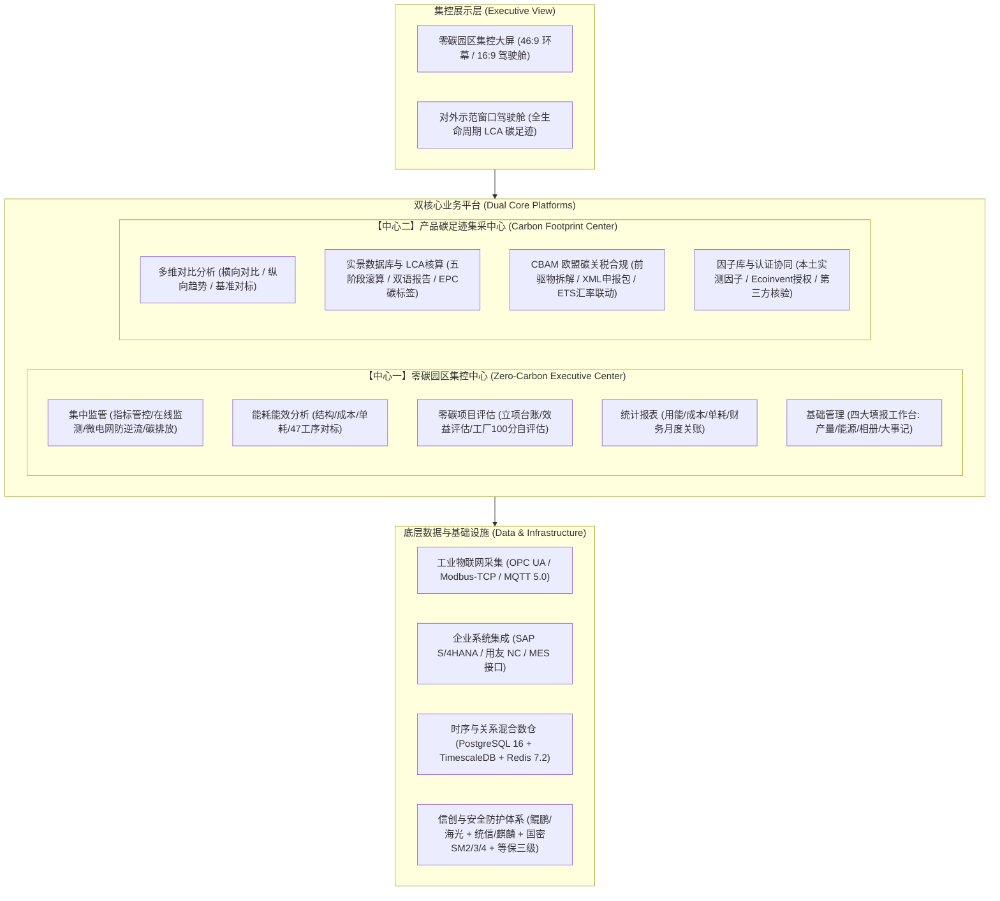

# 【PRD-00】全局业务架构、术语体系与组织模型规范

> **文档受控编号**：`TBEA-PRD-MASTER-2026-VOL-00`  
> **归属工程**：特变电工能碳数字化双中心  
> **基线版本**：Release v1.2.0 (生产基线版)  
> **密级**：内部绝密 (L4 - Top Secret)  
> **生效日期**：2026-09-14  

---

## 一、 顶层业务架构与产品战略定位

特变电工能碳数字化双中心是面向特变电工全集团（涵盖输变电、新能源、新材料三大产业板块及下属 15 个生产基地）打造的工业级能碳一体化数字化中枢，支撑“从物理工厂设备级用能，到集团宏观战略管控，再到全球产品出海合规”的全链路数字化闭环。

---

## 二、 核心用户画像与六级穿透鉴权

| 角色编号 | 角色名称 | 代表岗位 | 核心使用场景 | 访问与操控边界 |
|:---|:---|:---|:---|:---|
| **P1** | **集团决策层** | 集团董事长、分管副总裁、双碳战略总监 | 查看宏观指标大屏、万元产值能耗趋势、审批月度特批反冲、LCA报告与CBAM出境终审签章 | 全集团数据穿透只读 + 关键高危动作唯一电子签章权 |
| **P2** | **园区能碳专员** | 各基地动力处长、能源运行主管 | 监控所辖工厂设备与微电网消纳，审核车间月度报工与能源消耗，维护零碳自评估打分 | 仅限所辖组织树节点读写与初审 |
| **P3** | **车间填报员** | 生产车间统计员、动力车间值班员 | 44px 高密填报工作台离线填报（产量、用能、相册、大事记） | 仅限所辖车间录入、提交与撤回 |
| **P4** | **碳核算工程师** | 集团碳资产部、产品研发 LCA 专员 | 维护产品 BOM 与工序边界、匹配碳因子、执行 LCA 自动滚算、签发报告草案 | LCA 模块全权限 CRUD + 送审 |
| **P5** | **国际贸易专家** | 国际业务部合规经理、海关报关员 | 追溯出口变压器/电缆 CBAM 前驱物碳排、模拟关税、生成并导出欧盟 XML 申报包 | CBAM 模块全权限 + 申报出境触发 |
| **P6** | **外部审计机构** | 莱茵/SGS/方圆认证等第三方核查员 | 访问专用只读审计通道，核验 LCA 原始凭证、BOM 映射、物联遥测与 SHA-256 哈希链 | 专有独立只读审计通道 |

---

## 三、 六级组织架构与基地统一编码权威对照表

针对前期文档 18 基地 vs 15 园区数字矛盾，权威明确：特变电工集团中长期规划 18 个生产基地，本期系统基线接入 15 个主力投产园区，预留 3 个在建及海外园区编码：

| 园区统一编码 | 归属二级经营单位 | 生产基地/园区标准名称 | 核心产品/能耗形态 | 工序白名单规则 |
|:---|:---|:---|:---|:---|
| **TB-PK-001** | 特变电工沈变公司 | 沈阳变压器集团沈北特高压生产基地 | 特高压交流变压器 / 电力、天然气 | 覆盖 47 项变压器标准工序 |
| **TB-PK-002** | 特变电工衡变公司 | 衡阳变压器有限公司雁峰产业基地 | 直流换流变压器 / 电力、蒸汽 | 覆盖 47 项变压器标准工序 |
| **TB-PK-003** | 特变电工新变厂 | 新疆变压器厂昌吉高新产业基地 | 配电变与特种箱变 / 电力、燃气 | 覆盖 47 项变压器标准工序 |
| **TB-PK-004** | 特变电工鲁缆公司 | 山东鲁能泰山电缆新泰超高压基地 | 超高压交联电缆 / 电力、蒸汽 | 覆盖线缆专属工序 |
| **TB-PK-005** | 特变电工新缆厂 | 新疆线缆厂昌吉总厂制造基地 | 架空绝缘线与控制电缆 / 电力 | 覆盖线缆专属工序 |
| **TB-PK-006** | 特变电工德缆公司 | 四川德阳电缆高新生产基地 | 矿用特种橡套电缆 / 电力、燃气 | 覆盖线缆专属工序 |
| **TB-PK-007** | 天传电控设备公司 | 天津天传电控成套产业园 | 大型电控箱柜 / 电力 | 专属特定组装工序 |
| **TB-PK-008** | 西安柔输成套公司 | 西安柔性输配电产业基地 | SVG/特种高压变频器 / 电力 | 专属特定电子工序 |
| **TB-PK-009** | 新疆天池能源公司 | 准东五彩湾煤电化一体化工业园 | 火力发电机组 / 煤炭、电力、水 | 大型火电与煤化工流程 |
| **TB-PK-010** | 新疆天池能源公司 | 准东北露天智慧矿山数字化园区 | 采掘重卡 / 柴油、纯电重卡 | 数字化智慧露天矿流程 |
| **TB-PK-011** | 新特能源股份公司 | 硅基高纯多晶硅产业基地 | 高纯多晶硅 / 电力、液氮、蒸汽 | 光伏高纯硅料流程 |
| **TB-PK-012** | 特变自控设备公司 | 昌吉智能微网控制器产业园 | 自动化控制柜 / 电力 | 自动化装配流程 |
| **TB-PK-013** | 中发上海高压公司 | 上海高压开关研发制造基地 | GIS组合电器 / 电力、SF6 | 高压开关装配流程 |
| **TB-PK-014** | 特变衡变出线基地 | 衡阳云集特高压出线装置基地 | 特高压套管 / 电力、特种蒸汽 | 特种绝缘浸胶工序 |
| **TB-PK-015** | 特变沈变互感基地 | 铁岭互感器成套设备产业基地 | 电流互感器、电抗器 / 电力 | 互感器专用工序 |
| *TB-PK-016* | *集团预留规划* | *西南特种输配电装备产业园 (在建)* | *特种输配电设备* | *规划预留* |
| *TB-PK-017* | *集团预留规划* | *印尼绿色智慧工业园 (海外布局)* | *海外本地化组装* | *规划预留* |
| *TB-PK-018* | *集团预留规划* | *安哥拉海外成套制造基地 (海外)* | *成套工程电网设备* | *规划预留* |

> **10 家无工序直属单位判空规范**：科技投资公司、新能源集控中心、特变电装总部、进出口贸易公司、工程建设分公司、物资供应链公司、智慧能源科技公司、金融租赁公司、后勤服务中心、设计咨询研究院，无制造产线，工序界面统一单行干练输出：`暂无相关工序！`。\n