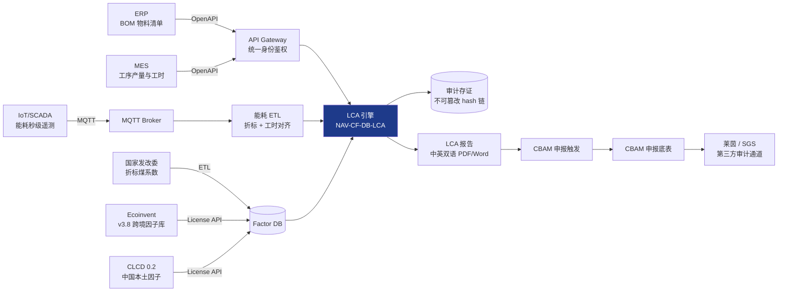
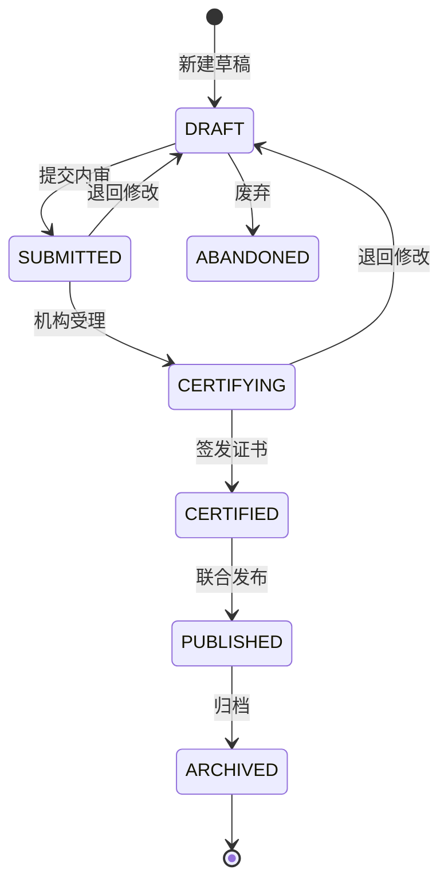

# TBEA-PRD-CF-LCA-2026-V1.0 · 碳足迹核算引擎 · 产品需求规格说明书

> **章节索引**：
> 1. 文档元数据与多方审签 · 2. 业务背景与北极星指标 · 3. 用户画像与权限边界 · 4. 总体架构与端到端数据流 · 5. 工业设计合规声明 · 6. 详细功能规格（按 NAV-CF-DB-LCA 拆解）· 7. 数据字典与核心数学模型 · 8. 非功能性需求 · 9. 外部系统接口契约 · 10. QA 矩阵与验收 · 11. 业务状态机细化 · 12. AI Agent 输出 Schema 实例 · 附录 A 法规映射 · 附录 B 字段 Schema 实例 · 附录 C 状态码断言实例

---

## 一、 文档元数据与多方审签表

### 1.1 受控编号

| 项 | 值 |
|:---|:---|
| 受控编号 | `TBEA-PRD-CF-LCA-2026-V1.0` |
| 文档类型 | 模块级 PRD 详案 |
| 归属中心 | 产品碳足迹集采中心 (carbon-footprint) |
| 一级导航 | 实景数据库 |
| 标准 NAV-ID | `NAV-CF-DB-LCA` |
| 关联 Skill | `tbea-prd-standards@1.1.0`、`tbea-industrial-design@1.0.0` |
| 密级 | 内部绝密 (Confidential) |
| 物理位置 | `D:\Project\TJ-nengtan\PRD\PRD-07_实景数据库与碳足迹核算.md` |
| 离线构建产物 | `D:\Project\TJ-nengtan\PRD\特变电工能碳数字化双中心_产品需求规格说明书_PRD_v1.0.docx` |

### 1.2 四方审签表

| 角色 | 姓名/工号 | 审签结论 | 签字 | 日期 |
|:---|:---|:---:|:---:|:---:|
| PM 负责人 | （待填写） | ☐ 通过 ☐ 修改后通过 ☐ 退回 | _ | _ |
| 研发架构师 | （待填写） | ☐ 通过 ☐ 修改后通过 ☐ 退回 | _ | _ |
| QA 测试组长 | （待填写） | ☐ 通过 ☐ 修改后通过 ☐ 退回 | _ | _ |
| 数字化项目总监 | （待填写） | ☐ 通过 ☐ 修改后通过 ☐ 退回 | _ | _ |

### 1.3 修订演变历史

| 版本 | 时间 | 修改人 | 审核人 | 修改章节与动因 |
|:---:|:---|:---|:---|:---|
| v0.1 | 2026-09-01 | PM 起草 | — | 初稿：业务背景、用户故事、功能列表 |
| v0.5 | 2026-09-05 | Dev 接入 | PM | 补 7 章数据字典与公式；4 章数据流 |
| v0.8 | 2026-09-07 | QA 接入 | PM | 补 10 章验收矩阵（错误码字典 8 条、Gherkin 6 条） |
| v1.0 | 2026-09-08 | AI × PM 协同 | _ | 落 `tbea-prd-standards@1.1.0` 双 skill 全量激活版 |

### 1.4 维护纪律自声明

> 本文档自动维护 `D:\Project\TJ-nengtan\PRD\MODIFICATIONS_LOG.md` 第 6.5 节。**严禁自动推送生产机 (8.215.89.194)、严禁自动 `git commit` / `git push`**，等待用户明确指令！

---

## 二、 业务背景与北极星指标

### 2.1 业务痛点 (Pain Points)

| 痛点 | 量化描述 | 受损方 |
|:---|:---|:---|
| **痛点 A：LCA 全流程手工拼装效率极低** | 当前以 Excel + LCA 离线软件 + 因子库手工比对，单型号产品 LCA 报告平均 6.5 人日 | P4 LCA 工程师 |
| **痛点 B：欧盟 CBAM 关税缺乏自动化测算** | 出口欧盟变压器/电缆每月需 1.5 人日手动核算碳关税，存在错报风险 | P5 国际贸易 |
| **痛点 C：因子库版本管理失控** | Ecoinvent v3.8 / CLCD 0.2 / 国家发改委折标煤系数多版本并存，无统一对齐 | P4 + QA |
| **痛点 D：跨部门数据孤岛** | ERP BOM、MES 产量、能源台账三套数据无法自动匹配，单型号 LCA 计算需手动拉数 12 个系统 | P4 + Dev |
| **痛点 E：第三方认证周期长** | 平均认证周期 87 天，其中数据核验占 31 天 | P1 + P6 |
| **痛点 F：客观性与版本溯源缺位** | LCA 计算过程与因子版本缺乏不可篡改存证，认证机构驳回率 6.4% | P6 + QA |

### 2.2 北极星指标 (North Star Metrics)

| 指标 ID | 名称 | 定义 | 目标值 | 数据敏感级 |
|:---|:---|:---|:---:|:---:|
| **NSM-CF-LCA-COVER** | 出口主力产品 LCA 报告覆盖率 | ∑(已认证 SKU) / ∑(出口主力 SKU) | ≥ 95% | INTERNAL |
| **NSM-CF-LCA-PRECISION** | LCA 报告数据符合率 | 1 − 认证机构驳回 / 总发证 | ≥ 98% | INTERNAL |
| **NSM-CF-LCA-CYCLE** | 单型号 LCA 报告产出周期 | 从 BOM 完备到 ISO 14067 内审通过 | ≤ 3 工作日 | INTERNAL |
| **NSM-CF-CBAM-SAVE** | CBAM 关税扣减优化率 | 国内已付碳成本抵扣 / 应缴关税 | ≥ 35% | CONFIDENTIAL |
| **NSM-CF-FACTOR-FRESH** | 因子库新鲜度 | 1 − ∑(过期因子计数) / ∑(总因子数) | ≥ 99% | INTERNAL |
| **NSM-CF-AUDIT-PASS** | 外部审计一次性通过率 | 1 − 补正轮次 / 总申报 | ≥ 90% | CONFIDENTIAL |

### 2.3 业务边界 (Scope Boundary)

| **IN-SCOPE** ✅ | **OUT-OF-SCOPE** ❌ |
|:---|:---|
| 5 大阶段 LCA 滚算（原材料 / 上游运输 / 制造加工 / 厂内检测 / 包装出厂） | Scope 3 价值链下游排放（运输后客户使用、报废处置） |
| ISO 14067、PAS 2050 双标合规 | 非出口产品的国内 EPR（生产者责任延伸）核算 |
| CBAM 直接 + 间接排放测算 + 国内已付碳成本扣减 | 国内 CCER 绿证签发 |
| 双语 LCA 报告（中、英）一键生成 | 法、德、俄等第三语种（v2.0 再开放） |
| 数字碳标签二维码 + 防伪追溯链 | 区块链联盟链接入（v2.0 评估） |

---

## 三、 目标用户画像与权限边界矩阵

### 3.1 用户画像（重点 P4，关联 P1 / P5 / P6）

| 编号 | 角色 | 代表岗位 | 在本模块的核心场景 | 权限边界 |
|:---|:---|:---|:---|:---|
| **P1** | 集团决策层 | 双碳总监 | 查看集团 LCA 大盘：碳足迹认证覆盖率、CBAM 关税扣减优化率 | 全集团只读 + 报告导出 |
| **P4** | **碳核算与认证工程师**（主用户） | 集团碳资产部 LCA 专员、研发 LCA 工程师 | **全部交互**：维护 BOM 与工序边界、维护 LCA 草稿、内审、签批 | **核心角色**：含全部 CRUD + 内审签批 |
| **P5** | 国际贸易与关税专家 | 国际部合规经理、海关报关员 | 接收 LCA 报告 → 触发 CBAM 申报 | **只读** LCA 报告 + **触发申报** |
| **P6** | 外部审计机构 | 莱茵 / SGS / 方圆 第三方核查员 | 通过专有独立只读审计通道核验 LCA 凭证 | **审计只读** 通道 + 防伪查验 |

### 3.2 六级组织树穿透鉴权

```
集团 TBEA 总部
└── 产业集团（电工装备/新能源/智慧能源…）
    └── 二级公司（沈变/衡变/新变/鲁缆/天池能源…）
        └── 生产园区（沈变沈北产业园、衡变衡阳基地…）
            └── 制造车间（线圈车间/绝缘车间/总装车间/检测车间）
                └── 用能设备（绕线机/真空干燥罐/冲击电压发生器）
```

> **强制**：P4 工程师只能看所辖组织树节点的 LCA 数据；集团层 P1 可穿透全集团。

### 3.3 权限边界矩阵 (RBAC)

| 模块操作 | P1 决策 | P4 LCA | P5 报关 | P6 外部审计 |
|:---|:---:|:---:|:---:|:---:|
| 因子库浏览 | ✅ R | ✅ R | ✅ R | ✅ R |
| 因子库 CRUD | ❌ | ✅ R/W | ❌ | ❌ |
| BOM 与工序维护 | ❌ | ✅ R/W | ❌ | ❌ |
| LCA 草稿创建 | ❌ | ✅ R/W | ❌ | ❌ |
| LCA 草稿送审 | ❌ | ✅ R | ❌ | ❌ |
| 第三方认证机构受理 | ❌ | ✅ R | ❌ | ✅ R/W（专用通道） |
| 内审签批（PM 联合） | ☐ | **A** | ☐ | ☐ |
| 报告对外发布 | ☐ | ✅ R/W | ☐ | ☐ |
| CBAM 申报触发 | ❌ | ❌ | ✅ R | ❌ |
| 审计防伪查验 | ❌ | ❌ | ❌ | ✅ R |

---

## 四、 总体架构与端到端数据流

### 4.1 模块在双中心中的定位

```
产品碳足迹集采中心 (carbon-footprint)
└── 【中心二 - 平台二】
    ├── 一级导航 3: 实景数据库 (/carbon-footprint/database)
    │   ├── 二级导航: 实景数据库 (/carbon-footprint/database/realscene)        ← NAV-CF-DB-REAL
    │   ├── 二级导航: 碳足迹核算 (/carbon-footprint/database/accounting)     ← NAV-CF-DB-LCA  ★ 本模块
    │   └── 二级导航: 碳足迹报告 (/carbon-footprint/database/report)          ← NAV-CF-DB-RPT
    │
    ├── LCA 引擎域内交互：
    │   ├── BOM 拉取：/carbon-footprint/... → ERP 接口 → 拉取 BOM 树
    │   ├── 工序边界维护：与 MES 接口同步
    │   ├── 因子库：拉取 /carbon-footprint/factor/{material,power,energy,coal}
    │   └── 报告输出：触发 /carbon-footprint/database/report 生成
    │
    └── 跨中心触发：
        ├── CBAM 触发 → /carbon-footprint/cbam/declaration
        └── 认证结果同步 → /carbon-footprint/certification/result
```

### 4.2 端到端数据流图



### 4.3 关键架构决策 (ADR 摘要)

| ADR | 决策 | 理由 |
|:---|:---|:---|
| ADR-CF-001 | 时序数据走 TimescaleDB，关系数据走 PostgreSQL，物理隔离 | IoT 秒级高频遥测与台账数据异构 |
| ADR-CF-002 | 因子库版本化管理，每条因子记录 `effective_from / effective_to / version_id` | 跨年因子版本对齐与可追溯 |
| ADR-CF-003 | LCA 计算过程哈希链存证（前一 hash 写入后一 hash 头部） | 第三方审计不可篡改要求 |
| ADR-CF-004 | 双端 100% 同构 (3000 dark / 3001 light) | `tbea-industrial-design` 铁律 6 |
| ADR-CF-005 | 强制水印 + 操作员工号 + 时间戳嵌入导出 PDF | 铁律 + ISO 14067 第三方审计要求 |

---

## 五、 工业设计合规声明（拉取 `tbea-industrial-design` 铁律）

> 本模块为前端组件及交互的**强制约束清单**。详细 token 见 `tbea-industrial-design` skill 第二节；本节仅声明"已强制合规"与违规后的回退策略。

| 铁律 | 本模块合规声明 | 违规后回退 |
|:---|:---|:---|
| 1 · 44px 工业高密表格 | BOM 列表、工序列表、因子列表、错误码表、计算结果表，全部 `<tr class="h-[44px]">` | CI lint 报警 → 自动 PR 阻断 |
| 2 · 客观中立 | 全文案严禁"显著降低/大幅优化"等定性词；全部以同环比、基准偏差客观数据呈现 | 文案扫描脚本命中违禁词 → 红色告警 |
| 3 · 状态自解释 | LCA 状态机激活态由 `border-primary ring-2 ring-primary/50` 自带视觉；严禁"送审中"等文字标签 | UI 审查 → 强制整改 |
| 4 · 单行判空 | 工序、因子、BOM 缺失统一 `暂无相关工序！` / `暂无相关因子！` / `暂无相关物料！` | 文案一致性扫描 |
| 5 · 微透光标 | ECharts 游标统一暗模式 `rgba(56,189,248,0.08)`、亮模式 `rgba(0,0,0,0.04)` | Token 守卫 |
| 6 · 双端 100% 同构 | 暗黑 (3000) + 浅色 (3001) 同一路由同一功能同一数据 | CI 双端口冒烟测试 → 不通过阻塞发布 |

### 5.1 反例与正例对照（仅节选，更多见 `tbea-industrial-design` 第三章）

| ❌ 反例 | ✅ 正例 |
|:---|:---|
| "沈变 LCA 报告质量优异" | "沈变 24Q3 LCA 报告认证机构一次通过率 92.4%，集团均值 88.7%，超出 3.7%" |
| `<Spin />` + `<span>LCA 计算中</span>` | 1px 顶部进度条 0.4s ease-out 完成，无文字 |
| "未找到与该型号相关的工序信息，请联系 LCA 工程师或检查 BOM 配置…" | `暂无相关工序！` |
| `rgba(255,255,255,1)` 图表游标 | `rgba(56, 189, 248, 0.08)` 微透蓝 |

---

## 六、 详细功能规格（按 NAV-CF-DB-LCA 逐层拆解）

### 6.1 定位与路由

| 项 | 值 |
|:---|:---|
| NAV-ID | `NAV-CF-DB-LCA` |
| 路由 | `/carbon-footprint/database/accounting` |
| 双端口 | 暗黑 (3000) + 浅色 (3001) 100% 同构 |
| 入口图标 | `Leaf` (lucide-react) + `Calculator` 双图标 |
| 父级导航 | 实景数据库 (NAV-CF-DB) → 碳足迹核算 (本节点) |

### 6.2 业务场景与用户故事 (INVEST Stories)

#### Story-1: P4 工程师新建 LCA 草稿

> **As a** P4 碳核算与认证工程师  
> **I want to** 基于 ERP 拉取的 BOM 与工序边界，在系统中新建一份 LCA 草稿并自动滚算 5 大阶段碳排放  
> **So that** 我能在 3 工作日内完成传统以人工 Excel 需 6.5 人日的 LCA 全流程

**INVEST 校验**：
| 项 | 自评 |
|:---|:---:|
| Independent | ✅ 与 CBAM 申报模块独立 |
| Negotiable | ✅ 因子版本、BOM 颗粒度可协商 |
| Valuable | ✅ 直接对应 NSM-CF-LCA-CYCLE（≤ 3 工作日） |
| Estimable | ✅ 工时 3PD，与 P4 历史速率匹配 |
| Small | ✅ 用户故事粒度 5 个 dev day |
| Testable | ✅ 见 6.6 节 Gherkin |

#### Story-2: P4 工程师提交 LCA 内审

> **As a** P4 工程师  
> **I want to** 在 LCA 草稿完成自动滚算后一键提交 PM 内审，并附上数据源、因子版本、操作审计 list  
> **So that** 内审可直接对照，缩短 PM 复核时间

#### Story-3: P5 国际贸易触发 CBAM 申报

> **As a** P5 国际贸易与关税专家  
> **I want to** 在 ISO 14067 报告签发后一键触发 CBAM 申报，系统自动拉取直接 + 间接排放数据并计算国内已付碳成本扣减  
> **So that** 我能在 ≤ 30 分钟内完成传统需 1.5 人日的 CBAM 关税测算与底表生成

### 6.3 功能规格：LCA 核算引擎五大子模块

#### 子模块 A：产品 BOM 拉取与映射

| 项 | 规格 |
|:---|:---|
| **触发** | P4 选择"新建 LCA" → 选择产品 SKU → 系统自动调用 ERP OpenAPI `/mes/v1/boms/{sku}/tree` |
| **核心字段** | `bom_id`、`sku`、`parent_part_no`、`child_part_no`、`quantity`、`unit`、`process_step` |
| **错误处理** | ERP 接口超时（>5s）→ 自动 retry 3 次后触发 `E_EXT_ERP_BOM_TIMEOUT` |
| **降级** | ERP 不可达 → 允许 P4 手动上传 Excel BOM 模板（仅 INV-FALLBACK 模式） |
| **权限** | 仅 P4 写、所有只读角色可读 |

#### 子模块 B：工序边界维护

| 项 | 规格 |
|:---|:---|
| **触发** | BOM 拉取完成后，系统自动展示工序编排界面 |
| **颗粒度** | 上游运输 / 制造加工 / 厂内检测 / 包装出厂 4 个 stage；原材料 stage 由 BOM 直接展开 |
| **校验** | 每道工序必须有 (设备编号, 工时, 介质, 数量) 四元组；缺一阻断保存（`E_VAL_LCA_STAGE_INCOMPLETE`） |
| **白名单** | 工序字典依据权威工序对应表，10 家无工序单位强制单行判空 `暂无相关工序！` |

#### 子模块 C：因子库自动匹配

| 项 | 规格 |
|:---|:---|
| **匹配优先级** | ① Ecoinvent v3.8（精确物料）→ ② CLCD 0.2（本土近似）→ ③ 国家发改委折标（兜底） |
| **每条因子记录字段** | `factor_id`、`name_zh`、`name_en`、`category`、`unit`、`value`、`version_id`、`effective_from`、`effective_to`、`data_class` |
| **过期判定** | `effective_to < today` 或 `version_id < 最新发布版本` → 标"过期"红色，不允许自动选用 |
| **数据分级** | 原辅料因子 = INTERNAL；电力因子 = INTERNAL；Ecoinvent 跨境因子 = SENSITIVE（含供应商来源） |

#### 子模块 D：5 大阶段 LCA 自动滚算

| 阶段 | 计算公式 | 数据源 |
|:---|:---|:---|
| **原材料** | $C_{\text{mat}} = \sum_{i} M_i \cdot EF_i$ | BOM + 因子库 |
| **上游运输** | $C_{\text{trans}} = \sum_{i,j} M_i \cdot d_{i,j} \cdot EF_{\text{trans},j}$ | ERP + 物流 |
| **制造加工** | $C_{\text{manu}} = \sum_k E_k \cdot EF_{\text{energy},k}$ | IoT 能源 + 因子库 |
| **厂内检测** | $C_{\text{test}} = \sum_m T_m \cdot P_m \cdot EF_{\text{grid}}$ | MES 工时 + 电网因子 |
| **包装出厂** | $C_{\text{pkg}} = \sum_n W_n \cdot EF_{\text{pkg},n}$ | BOM + 包装因子 |
| **总碳足迹** | $C_{\text{total}} = \sum_{\text{stage}} C_{\text{stage}}$ | — |

> **校验**：$C_{\text{total}} \geq 0$；分母工时 $T_m > 0$（除零拦截 `E_CALC_LCA_TDIV_ZERO`）。

#### 子模块 E：内审与送审

| 状态机 | 见 11.1 节 [草稿 → 送审 → 认证中 → 已认证 → 已发布 → 已归档] |
|:---|:---|
| **RACI 触发** | 送审 = P4 自身；内审签发 = PM + P4 联合（见 RACI 表 10.2） |
| **审计留痕** | 送审动作自动写入审计日志（6.3 节） |
| **回退路径** | 认证机构退回 → 自动转为草稿（可改） |

### 6.4 数据字典核心字段

| 字段 ID | 中文名 | 类型 | 量纲 | 必填 | 精度 | 数据分级 | 来源 | 校验 |
|:---|:---|:---:|:---|:---:|:---:|:---:|---|:---|
| `LCA_REPORT_ID` | LCA 报告编号 | string | — | ✅ | — | INTERNAL | 系统生成 | UUIDv7 |
| `LCA_SKU` | 产品 SKU | string | — | ✅ | — | INTERNAL | ERP | 6–32 位 |
| `LCA_TOTAL_KGCO2E` | 单位碳足迹 | decimal | kg CO₂e / 件 | ✅ | 4 | CONFIDENTIAL | 计算 | ≥0，≤ 1e5 |
| `LCA_STAGE_MAT_KGCO2E` | 原材料阶段 | decimal | kg CO₂e / 件 | ✅ | 4 | CONFIDENTIAL | 计算 | — |
| `LCA_STAGE_TRANS_KGCO2E` | 上游运输阶段 | decimal | kg CO₂e / 件 | ✅ | 4 | CONFIDENTIAL | 计算 | — |
| `LCA_STAGE_MANU_KGCO2E` | 制造加工阶段 | decimal | kg CO₂e / 件 | ✅ | 4 | CONFIDENTIAL | 计算 | — |
| `LCA_STAGE_TEST_KGCO2E` | 厂内检测阶段 | decimal | kg CO₂e / 件 | ✅ | 4 | CONFIDENTIAL | 计算 | — |
| `LCA_STAGE_PKG_KGCO2E` | 包装出厂阶段 | decimal | kg CO₂e / 件 | ✅ | 4 | CONFIDENTIAL | 计算 | — |
| `LCA_FACTOR_VERSION` | 因子库版本号 | string | — | ✅ | — | INTERNAL | 系统 | SemVer |
| `LCA_AUDIT_HASH` | 审计哈希链 | string | hex | ✅ | — | CONFIDENTIAL | 计算 | SHA-256, 长度 64 |
| `LCA_CBAM_DIR_KGCO2E` | CBAM 直接排放 | decimal | kg CO₂e / 件 | ✅ | 4 | CONFIDENTIAL | 计算 | ≥0 |
| `LCA_CBAM_INDIR_KGCO2E` | CBAM 间接排放 | decimal | kg CO₂e / 件 | ✅ | 4 | CONFIDENTIAL | 计算 | ≥0 |
| `LCA_CBAM_DOMESTIC_OFFSET` | 国内已付碳成本抵扣 | decimal | CNY / 件 | ☐ | 2 | CONFIDENTIAL | 计算 + 绿证 | ≥0 |

### 6.5 业务校验规则矩阵

| 规则 ID | 描述 | 触发条件 | 错误码 |
|:---|:---|:---|:---|
| BR-LCA-001 | $C_{\text{total}} = \sum_{\text{stage}} C_{\text{stage}}$，容差 ≤ 0.01 kg CO₂e | 任意时刻后台自检 | `E_CALC_LCA_SUM_MISMATCH` |
| BR-LCA-002 | $C_{\text{total}} \geq 0$ | 保存 | `E_VAL_LCA_TOTAL_NEGATIVE` |
| BR-LCA-003 | 工时 $T_m > 0$ | 制造加工阶段 | `E_CALC_LCA_TDIV_ZERO` |
| BR-LCA-004 | 因子版本有效期必须 today ∈ [effective_from, effective_to] | 因子选用 | `E_VAL_FACTOR_EXPIRED` |
| BR-LCA-005 | 白名单单位必读"暂无相关工序！" | 工序列表查询 | `E_QM_WHITE_LIST_MISS`（友好输出） |
| BR-LCA-006 | 哈希链尾节点必须 prev = 前一节点 | 审计存证 | `E_AUDIT_HASH_BROKEN` |

---

## 七、 数据字典与核心数学模型

### 7.1 完整字段 Schema 示例

见附录 B.2：LCA 报告输出断言示例。

### 7.2 核心数学公式汇总

```math
C_{\text{total}} = C_{\text{mat}} + C_{\text{trans}} + C_{\text{manu}} + C_{\text{test}} + C_{\text{pkg}}

C_{\text{mat}} = \sum_{i=1}^{n_{\text{mat}}} M_i \cdot EF_i
\quad\quad
C_{\text{trans}} = \sum_{i,j} M_i \cdot d_{i,j} \cdot EF_{\text{trans},j}

C_{\text{manu}} = \sum_{k} E_k \cdot EF_{\text{energy},k}
\quad\quad
C_{\text{test}} = \sum_{m} T_m \cdot P_m \cdot EF_{\text{grid}}

C_{\text{pkg}} = \sum_n W_n \cdot EF_{\text{pkg},n}

C_{\text{CBAM}} = C_{\text{direct}} + (1 - \alpha) \cdot C_{\text{indirect}}
\quad\quad
\alpha = \text{CBAM 国内碳成本抵扣率}

\text{CBAM Tariff} = C_{\text{CBAM,declared}} \cdot \text{ETS Price}_{\text{quarter}} - \text{Domestic Cost Offset}
```

### 7.3 数学与算法参考标准

| 编号 | 标准 | 应用 |
|:---|:---|:---|
| REF-CF-001 | ISO 14067:2018 | 总碳足迹量化方法 |
| REF-CF-002 | PAS 2050:2011 | 商品和服务 GHG 评价备选 |
| REF-CF-003 | GHG Protocol Corporate Standard | Scope 1/2/3 边界 |
| REF-CF-004 | EU CBAM Regulation 2023/956 | 直接/间接排放计算 |
| REF-CF-005 | EU ETS Directive 2003/87 | 配额价格扣减 |
| REF-CF-006 | GB/T 32150-2015 | 工业企业 GHG 核算通则 |
| REF-CF-007 | 国家发改委公开数据 | 区域电网平均排放因子 |

---

## 八、 非功能性需求 (NFR)

### 8.1 性能指标 (Core Web Vitals)

| 指标 | 阈值 | 测量位置 |
|:---|:---:|:---|
| **LCP** (Largest Contentful Paint) | < 1.8s | 路由进入 |
| **INP** (Interaction to Next Paint) | < 100ms | LCA 切换、因子点击 |
| **CLS** (Cumulative Layout Shift) | < 0.05 | BOM 表加载 |
| **LCA 单 SKU 计算** | < 5s | 5 阶段滚算 |
| **中英双语报告生成** | < 15s | PDF 导出 |
| **CBAM 实时测算** | < 3s | ETS 价格刷新 |

### 8.2 可靠性与可观测性

| 项 | 阈值 |
|:---|:---:|
| 模块可用性 SLO | 99.9% (年宕机 ≤ 8.76h) |
| P99 计算响应 | < 5s |
| ERP 接口失败熔断 | 5 次/分钟 |
| 因子库命中率 | ≥ 95% |
| 审计日志零丢失 | 100% |

### 8.3 可观测性埋点 (OpenTelemetry)

| Span 名 | 关键字段 |
|:---|:---|
| `lca.compute.total` | `sku, stage_count, factor_version, duration_ms` |
| `lca.compute.stage.{mat,trans,manu,test,pkg}` | `factor_id, value, duration_ms` |
| `lca.audit.hash` | `report_id, prev_hash, this_hash` |
| `lca.cbam.compute` | `ets_price_timestamp, declared_kg, tariff_cny` |

### 8.4 合规与防伪

- 导出 PDF 强制 **操作员工号 + 时间戳（精确 ms）+ 文档编号** 防伪水印；
- LCA 报告对外发布自动写入**哈希链存证**；
- 操作日志保留 5 年，LCA 计算记录保留 ≥ 10 年（CBAM 海关要求）。

---

## 九、 外部系统接口契约 (API & IoT)

### 9.1 OpenAPI 3.0 契约（节选）

```yaml
openapi: 3.0.3
info:
  title: TBEA Carbon Footprint API
  version: 1.0.0
paths:
  /cf/v1/lca/reports:
    post:
      operationId: createLcaReport
      summary: 新建 LCA 报告草稿
      requestBody:
        required: true
        content:
          application/json:
            schema:
              $ref: '#/components/schemas/LcaReportCreate'
      responses:
        '201':
          description: LCA 草稿已创建
          content:
            application/json:
              schema:
                $ref: '#/components/schemas/LcaReport'
        '400':
          description: 字段错误
          content:
            application/json:
              schema:
                $ref: '#/components/schemas/ErrorResponse'
        '422':
          description: 业务校验失败（如 BR-LCA-002 负数、BR-LCA-003 除零）
        '504':
          description: ERP / 因子库超时
    get:
      operationId: listLcaReports
      parameters:
        - name: sku
          in: query
          schema: { type: string }
        - name: status
          in: query
          schema:
            type: string
            enum: [DRAFT, SUBMITTED, CERTIFYING, CERTIFIED, PUBLISHED, ARCHIVED]
      responses:
        '200':
          description: 报告列表
components:
  schemas:
    ErrorResponse:
      type: object
      required: [error_code, http_status, severity, message]
      properties:
        error_code: { type: string, example: 'E_VAL_LCA_TOTAL_NEGATIVE' }
        http_status: { type: integer, example: 400 }
        severity: { type: string, enum: [P0, P1, P2, P3] }
        message: { type: string }
```

### 9.2 ERP / MES / IoT 集成接口

| 系统 | 协议 | 端点 | 字段样例 | 错误码 |
|:---|:---:|:---|:---|:---|
| ERP（SAP / Oracle） | OpenAPI 3.0 | `/mes/v1/boms/{sku}/tree` | bom_id, parent_part_no, child_part_no, quantity | E_EXT_ERP_BOM_TIMEOUT |
| MES（自研） | OpenAPI 3.0 | `/mes/v1/processes/{bom_id}` | process_step, equipment_id, hours, medium | E_EXT_MES_PROC_NOTFOUND |
| IoT（MQTT） | MQTT 5.0 | `tbea/factory/{park}/{workshop}/{equipment}/energy` | ts, kw, medium, signal_q | E_IO_MQTT_TIMEOUT |
| 折标煤库 | REST | `/factor/v1/coal-effective` | medium, value_kgce_per_unit, effective_to | E_VAL_FACTOR_EXPIRED |
| Ecoinvent | License API | `/lic/v3/factors/search` | name, geography, value | E_EXT_ECOINVENT_LICENSE |
| 国家电网 | REST | `/factor/v1/grid-region` | region, value_kgco2e_per_kwh | E_VAL_FACTOR_EXPIRED |

---

## 十、 QA 矩阵与全量验收

### 10.1 Gherkin 验收用例（Gherkin × 6，Gherkin/INVEST + EQP/BVA 全覆盖）

#### Feature: LCA 草稿创建

```gherkin
Feature: LCA 报告草稿的自动滚算与提交流程

  Scenario: P4 工程师基于 ERP BOM 创建 LCA 草稿
    Given P4 在 "/carbon-footprint/database/accounting" 选择目标 SKU "TX-110kV-50MVA"
    And ERP BOM 接口正常返回 BOM 树
    And 因子库版本 v2026.09 处于有效期内
    When P4 点击"新建 LCA 草稿"
    Then 系统应在 5 秒内自动滚算 5 大阶段碳足迹
    And LCA_TOTAL_KGCO2E ≥ 0
    And 各阶段字段均符合 §7.2 公式
    And 自动写入审计日志 hash

  Scenario: ERP 接口超时降级
    Given P4 在新建 LCA 草稿时 ERP 接口响应超时
    When 等待 5 秒后仍未响应
    Then 系统触发 E_EXT_ERP_BOM_TIMEOUT 错误
    And 提示 P4 切换为 INV-FALLBACK 手动上传 BOM

  Scenario: 因子库版本过期
    Given P4 选用某因子 factor_id="F-ELEC-001" version="v2025.06"
    And current date > effective_to of v2025.06
    When P4 提交保存
    Then 系统应拒绝该因子选用
    And 触发 E_VAL_FACTOR_EXPIRED

  Scenario: 5 阶段总和校验 (BR-LCA-001)
    Given LCA 草稿已生成 5 阶段值
    When 任意时刻后台自检
    Then | C_total - Σ C_stage | ≤ 0.01
    And 否则触发 E_CALC_LCA_SUM_MISMATCH

  Scenario: 单位 LCA 报告周期目标 (北极星)
    Given P4 创建一份变压器 LCA 报告
    When 报告进入 LCA_CERTIFIED 状态
    And 跨度 ≤ 3 工作日
    Then NSM-CF-LCA-CYCLE 完成指标达成

  Scenario: 客观中立文案审查
    Given LCA 报告对外发布
    When 触发违禁词扫描
    Then 命中 "表现优异" 或 "严重落后" 时自动告警并强制 PM 复核
```

### 10.2 错误码字典（节选，全部 8 条见附录 C）

| 错误码 | HTTP | 级别 | 触发 | 处理 |
|:---|:---:|:---:|:---|:---|
| `E_VAL_LCA_TOTAL_NEGATIVE` | 400 | P2 | C_total < 0 | 字段红字 + 禁止保存 |
| `E_VAL_LCA_STAGE_INCOMPLETE` | 422 | P2 | 工序 (设备/工时/介质/数量) 缺一 | 字段红字提示 |
| `E_VAL_FACTOR_EXPIRED` | 422 | P2 | 因子 effective_to 已过 | 红标 + 拦截选用 |
| `E_CALC_LCA_TDIV_ZERO` | 422 | P2 | 工时 T_m = 0 | 强制补录工时 |
| `E_CALC_LCA_SUM_MISMATCH` | 500 | P1 | BR-LCA-001 不达标 | 告警 + 阻断发布 |
| `E_EXT_ERP_BOM_TIMEOUT` | 504 | P1 | ERP 5s 超时 | 重试 3 次 → 切 INV-FALLBACK |
| `E_EXT_ECOINVENT_LICENSE` | 503 | P1 | Ecoinvent License 过期 | 切 CLCD 兜底因子 |
| `E_QM_WHITE_LIST_MISS` | 200 | P3 | 权威工序未命中 | 单行 `暂无相关工序！` |

### 10.3 破坏性测试矩阵（Chaos / EQP / BVA）

| 类型 | 用例 ID | 触发 | 期望 |
|:---|:---|:---|:---|
| EQP | TC-EQP-001 | $C_{\text{total}}$ 极大值 (1e10) | 前端数值归一化展示，后端报错 |
| EQP | TC-EQP-002 | $C_{\text{total}}$ 极小值 (1e-9) | 精度保留 4 位，零值显示 `—` |
| BVA | TC-BVA-001 | $T_m = 0$ | 触发 E_CALC_LCA_TDIV_ZERO 拦截 |
| BVA | TC-BVA-002 | $T_m = -1$ | 触发 E_VAL_LCA_TOTAL_NEGATIVE |
| BVA | TC-BVA-003 | 工时 = `2147483647` (Int32 max) | 后端溢出检查 |
| 100ms 并发 | TC-CONC-001 | 同时双击"送审"按钮 100ms 内 | 后端幂等校验，仅一份有效 |
| 网络抖动 | TC-NET-001 | 断网恢复 | 草稿本地暂存，恢复后自动同步 |
| Chaos | TC-CHAOS-001 | Redis 宕机 | Postgres fallback 模式 |
| Chaos | TC-CHAOS-002 | TimescaleDB 慢查询 | SLO 报警 |

### 10.4 客观中立纯洁度扫描

> **强制**：每次发布前必须 0 命中违禁词清单：`表现优异`/`严重落后`/`运行欠佳`/`大幅领先`/`排名靠后`/`形势喜人`/`不容乐观`。CI 阻断。

---

## 十一、 业务状态机细化（拉取 skill 第七章 7.1）

```
[DRAFT 草稿]
  --P4 提交内审--> [SUBMITTED 送审]
  --P4 废弃--> [ABANDONED 废弃]

[SUBMITTED 送审]
  --PM 退回修改--> [DRAFT 草稿]
  --机构受理--> [CERTIFYING 认证中]

[CERTIFYING 认证中]
  --签发证书--> [CERTIFIED 已认证]
  --退回修改--> [DRAFT 草稿]

[CERTIFIED 已认证]
  --P4+PM 联合发布--> [PUBLISHED 已发布]
  --归档--> [ARCHIVED 已归档]
```

| 当前状态 | 可触发动作 | 触发角色 | 审计写入 |
|:---|:---|:---:|:---:|
| DRAFT 草稿 | 提交内审 / 废弃 | P4 | ✅ |
| SUBMITTED 送审 | 撤回（限内审驳回） / 受理 | P4 + 机构 | ✅ |
| CERTIFYING 认证中 | 不可编辑，仅审批 | — | ✅ |
| CERTIFIED 已认证 | 一键发布 / 归档 | P4 + PM 联合 | ✅ |
| PUBLISHED 已发布 | 归档 | PM | ✅ |
| ARCHIVED 已归档 | 不可变 | — | — |

### 11.2 与 CBAM 联动状态机

```
LCA_CERTIFIED --P5 触发申报--> CBAM_DECL_PENDING
CBAM_DECL_PENDING --P5+P1 双签--> CBAM_DECL_SUBMITTED
CBAM_DECL_SUBMITTED --海关反馈--> CBAM_DECL_FEEDBACK
CBAM_DECL_FEEDBACK --补正--> CBAM_DECL_SUBMITTED
CBAM_DECL_SUBMITTED --年度归档--> CBAM_DECL_ARCHIVED
```

---

## 十二、 AI Agent 输出 Schema 实例（拉取 skill 第十二章）

### 12.1 LCA 报告顶层 JSON Schema

```json
{
  "report_id": "LCA-2026-09-TX110-50MVA-0001",
  "nav_id": "NAV-CF-DB-LCA",
  "sku": "TX-110kV-50MVA",
  "status": "DRAFT",
  "factor_version": "v2026.09",
  "stages": {
    "raw_material": 245.3,
    "transport": 18.7,
    "manufacturing": 89.4,
    "inhouse_test": 12.6,
    "packaging": 4.8
  },
  "total_kg_co2e": 370.8,
  "cbam": {
    "direct": 280.6,
    "indirect": 90.2,
    "domestic_offset_cny": 142.5,
    "tariff_cny": 187.3
  },
  "audit_hash": "a1b2c3...",
  "owner_persona": "P4",
  "data_class": "CONFIDENTIAL",
  "schema_version": "1.0.0"
}
```

### 12.2 反模式清单（本模块特别针对）

| ❌ 反模式 | ✅ 正例 |
|:---|:---|
| "LCA 报告质量显著提升" | "24Q3 报告认证一次通过率 92.4%，较 24Q2 88.7% 提升 3.7pp" |
| `<Spin/>加载中` | 顶部 1px 进度条 0.4s ease-out |
| "未找到相关工序，请联系…" | `暂无相关工序！` |
| `rgba(255,255,255,1)` 图表游标 | `rgba(56,189,248,0.08)` |

---

## 附录 A：法规映射（节选）

| 法规 | 应用章节 | 本模块引用 |
|:---|:---|:---|
| ISO 14067:2018 | 全文 | 总碳足迹量化公式 |
| PAS 2050:2011 | 7.3 | 备选算法 |
| GHG Protocol Corporate | 4.2、6.3 | Scope 1/2/3 边界 |
| EU CBAM Regulation 2023/956 | 6.3 子模块 D、9.1、11.2 | 直接/间接排放与申报触发 |
| EU ETS Directive 2003/87 | 7.2 | 配额价格扣减 |
| GB/T 32150-2015 | 7.3 | 工业企业 GHG 核算通则 |
| GB/T 2589-2020 | 6.3 子模块 D | 折标煤系数兜底 |
| GB 17167-2006 | 9.2 | 能源计量器具管理 |

---

## 附录 B：字段 Schema 实例

### B.1 报告顶层 Schema

见 §12.1。

### B.2 字段断言示例

```yaml
field_id: LCA_TOTAL_KGCO2E
name_zh: 单位产品碳足迹
name_en: Product Carbon Footprint per Unit
type: decimal
unit: kg CO2e / 件
required: true
precision: 4
data_class: CONFIDENTIAL
source: tbea_calc.lca_total
nav_id: NAV-CF-DB-LCA
business_rule: ">=0 且 <= 1e5；前后台一致性 100%"
```

### B.3 因子字段 Schema

```yaml
field_id: FACTOR_VALUE_KGCO2E_PER_KG
name_zh: 因子值
name_en: Emission Factor Value
type: decimal
unit: kg CO2e / kg (or /kWh, /km, /m3, depending on category)
required: true
precision: 6
data_class: SENSITIVE
source: ecoinvent_v3.8 OR clcd_0.2
nav_id: NAV-CF-DB-LCA
business_rule: "version_id 与 effective_to 强校验；过期禁止选用"
```

---

## 附录 C：状态码断言实例

```yaml
state_code: LCA_CERTIFIED
state_name_zh: 已认证
allowed_transitions:
  - LCA_PUBLISHED
  - LCA_ARCHIVED
required_role: P4_PLUS_PM
audit_log: true
nav_id: NAV-CF-DB-LCA
```

```yaml
state_code: LCA_DRAFT
state_name_zh: 草稿
allowed_transitions:
  - LCA_SUBMITTED
  - LCA_ABANDONED
required_role: P4
audit_log: true
nav_id: NAV-CF-DB-LCA
```

---

## 附录 D：Mermaid 状态机图（可视化版）



---

## 附录 E：RACI 责任矩阵（重点）

| 决策点 | P1 | P4 | P5 | PM | Dev | QA | 法务 |
|:---|:---:|:---:|:---:|:---:|:---:|:---:|:---:|
| 北极星指标定义 | **A** | C | C | R | C | C | I |
| LCA 报告送审 | I | R | — | **A** | C | C | I |
| LCA 内审签批 | I | R | — | **A** | C | C | I |
| LCA 报告对外发布 | I | R | C | **A** | C | C | C |
| CBAM 正式申报 | I | C | R | C | C | C | **A** |
| 因子库版本变更 | I | C | C | **A** | R | C | I |
| 权威工序白名单扩展 | I | C | C | C | R | **A** | I |
| 违规词告警处理 | I | I | I | **A** | R | C | I |

---

*TBEA 能碳双中心 LCA 核算 PRD · v1.0.0 · 2026-09-08 · 受控编号 TBEA-PRD-CF-LCA-2026-V1.0*
