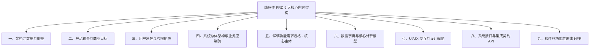

# 📘 软件系统产品需求规格说明书 (PRD) 标准框架指南

> **文档代号**：`PRD-TBEA-SPEC-2026-V1.0`  
> **适用范围**：纯软件系统、数字化集成平台、SaaS 应用与 Web/移动端产品（不包含任何物理硬件要求）  
> **存放位置**：`D:\Project\TJ-nengtan\PRD\PRD_软件需求规格说明书标准框架.md`  
> **配套单页**：[`PRD_软件需求规格说明书标准框架.html`](./PRD_软件需求规格说明书标准框架.html)（可直接双击使用浏览器查看完整交互单页）  
> **版本**：`v1.0`（纯软件标准 9 大核心板块）

---

## 🏛️ 总体内容架构全景

---

## 一、 文档元数据与多方审签 (Metadata & Sign-off)

1. **基本标识**：
   - **文档受控编号**：统一采用规范编码，如 `PRD-SYS-2026-V1.0`；
   - **系统/产品全称**：软件产品标准中英文名称与代码代号；
   - **保密等级**：标明安全密级（内部公开、商业秘密、核心绝密），规定外发和拷贝权限。
2. **多方审签会签表 (Sign-off Matrix)**：

| 审签角色 | 关注要点 | 审签状态 |
| :--- | :--- | :---: |
| **产品经理 (PM)** | 商业价值闭环、用户需求覆盖度、功能场景无遗漏 | 已确认 |
| **系统架构师 (Architect)** | DDD 领域模型解耦、高可用架构、数据一致性与服务契约 | 已确认 |
| **前端负责人 (Frontend)** | 交互规范对齐、组件库复用、微交互与响应式性能 | 已确认 |
| **后端负责人 (Backend)** | 业务控制流、分布式事务、数据库 Schema 与接口规范 | 已确认 |

3. **修订历史台账 (Changelog)**：记录版本号、变更日期、修改章节、改动动因（业务变更/用户反馈）、修改人。

---

## 二、 业务背景、目标与北极星指标 (Context & Objectives)

1. **业务痛点与现状描述**：当前业务面临的瓶颈、线下痛点或老旧系统缺陷（阐明“为什么要做”）；
2. **产品战略定位与愿景**：界定软件系统在企业整体数字化架构中的定位；
3. **商业/管理目标**：期望达成的量化业务成效；
4. **核心北极星指标**：如业务成本降低率、工序能效提升比、报表自动化生成覆盖率等。

---

## 三、 目标用户画像与权限边界矩阵 (Personas & RBAC)

1. **典型用户画像 (Personas)**：梳理各端核心使用角色（如决策高管、业务专员、基层填报员、系统审计员），阐述各角色的诉求与核心操作路径；
2. **组织架构穿透层级**：明确多级组织或业务分支的从属关系（如：`集团总部 ➔ 二级公司 ➔ 制造工厂 ➔ 车间工段 ➔ 产线测点`）；
3. **权限访问控制矩阵 (RBAC)**：
   - **功能权限**：角色对菜单、页面及具体操作按钮（增、删、改、查、审、导出）的显隐与可用控制；
   - **数据权限**：行级数据隔离策略（只看所属单位、全域穿透查看）与涉密列脱敏（成本金额加星号掩码）。

---

## 四、 总体架构与业务控制流 (Architecture & Process Flow)

1. **系统功能架构图**：系统各子系统、业务模块的分层划分（展示层、应用服务层、业务规则层、数据契约层）；
2. **端到端业务泳道图 (Cross-functional Flowchart)**：跨角色、跨部门的完整业务操作主流程与异常分支流程；
3. **关键业务状态机 (Finite State Machine, FSM)**：明确核心业务单据的生命周期流转（如：`草稿态 ➔ 待审核 ➔ 审核通过/驳回 ➔ 执行中 ➔ 已归档 ➔ 已作废`）及其触发条件与回滚规则。

---

## 五、 详细功能需求规格 (Detailed Functional Specifications · 核心主体)

按 **“系统主导航 ➔ 二级页面 ➔ 三级子模块/弹窗/标签页”** 逐层拆解展开，每个具体功能点明确：

1. **用户故事 (User Story)**：以 `作为 [某角色]，我想要 [执行某操作]，以便于 [达成某目标]` 阐述业务目的；
2. **页面原型与布局定义**：界面排布、信息分区结构（搜索过滤区、图表区、数据表格区、操作工具栏）；
3. **详细交互行为与状态规范**：
   - **前置条件**：触发该操作必须满足的数据或业务状态；
   - **操作流转**：常规操作、多控件联动、弹窗交互；
   - **状态全覆盖**：默认态、激活高亮态、加载中 (Loading)、空数据状态 (Empty State，明确单行文案)、错误失败态 (Error)；
   - **输入防错校验**：必填项、字段长度与格式限制、范围阈值校验、防重复提交（防抖节流与提交后置灰）；
4. **业务验收准则 (Gherkin 规范)**：采用 `Given [前置条件] - When [操作动作] - Then [预期结果]` 清晰界定。

---

## 六、 数据字典与核心计算模型 (Data Dictionary & Business Logic)

1. **数据实体字典详表**：

| 字段英文名 (Key) | 业务中文名 | 数据类型 | 必填 | 取值范围 / 精度 | 数据源 | 显示格式与单位 |
| :--- | :--- | :--- | :---: | :--- | :--- | :--- |
| `record_id` | 记录唯一主键 | String | 是 | UUID / 32位字符 | 系统生成 | - |
| `total_elec` | 本期总耗电量 | Decimal | 是 | ≥ 0.00，保留2位小数 | 自动同步/手填 | 128,450.00 kWh |
| `unit_energy`| 单位产品综合单耗 | Decimal | 否 | 保留4位小数 | 公式计算 | 0.1425 tce/万kVA |
| `status_code`| 工况运行状态 | Enum | 是 | 'ok' \| 'warn' \| 'danger' | 规则计算 | 状态徽章 |

2. **核心数学与计算模型**：
   - 业务核算模型、聚合统计公式、同比/环比算法、权重分摊模型；
   - **除零与边界防错逻辑**：明确分母为零时前端统一展示占位符 `--`，杜绝出现 `NaN` 或 `Infinity`。

---

## 七、 UI/UX 交互与设计规范契约 (Design System Constraints)

1. **核心尺寸标尺与不变量**：
   - 表格行高强制 **44px**（`h-[44px]`），垂直居中，数字列启用 Mono 等宽右对齐；
   - 导出按钮统一固定 **80px × 36px**，背景色 `#2C7CFF`，圆角 8px，白字白图标；
   - 输入框与下拉框统一固定高度 **36px**，推荐宽度 **200px**，边框 `#E2E8F0`，圆角 8px；
   - 左侧导航栏统一固定 **260px**，组织树节点间距 30px，激活浅蓝底色 `#EBF3FF`；
   - 全局面板容器固定圆角 **8px**，统一板块间距 **24px**。
2. **客观中立原则**：界面与报表中严禁出现主观评价或说教褒贬词汇（如“表现优异”、“落后单位”），纯粹以时序对比与客观工况呈现。

---

## 八、 软件系统接口与集成契约 (API & System Integration)

1. **RESTful 接口规范 (OpenAPI 3.0)**：
   - 请求方法（`GET`/`POST`/`PUT`/`DELETE`）、URI 路径、请求 Header；
   - 请求 Body/Query 结构与参数校验；
   - 统一响应外壳（`code`, `message`, `data`, `timestamp`）。
2. **标准错误码字典体系**：
   - `200 OK`、`400 Bad Request`、`401 Unauthorized`、`403 Forbidden`、`500 Internal Server Error`。
3. **外部系统集成契约**：与第三方系统（ERP、MES、OA 审批流等）的数据交互协议、定时同步与 Webhook 机制。

---

## 九、 软件非功能性需求 (Software Non-Functional Requirements)

1. **前端核心性能指标 (Core Web Vitals)**：
   - 最大内容渲染时间 **LCP < 1.8s**，首屏渲染 **FCP < 1.0s**；
   - 交互响应时延 **INP < 100ms**；
   - 累积布局偏移 **CLS < 0.05**。
2. **浏览器兼容性**：完全兼容 Chrome 90+、Edge、Firefox、Safari 等现代浏览器。
3. **数据安全性与审计追踪**：
   - 全站强制启用 HTTPS / TLS 1.3 通信加密；
   - 敏感信息掩码脱敏与常见网络攻击拦截（XSS、CSRF、SQL 注入）；
   - 关键操作审计日志与导出文件强制携带“工号 + 时间戳”防伪水印。
4. **数据可用性**：支持数据软删除与误操作恢复，系统服务可用度 SLA 99.9%。
