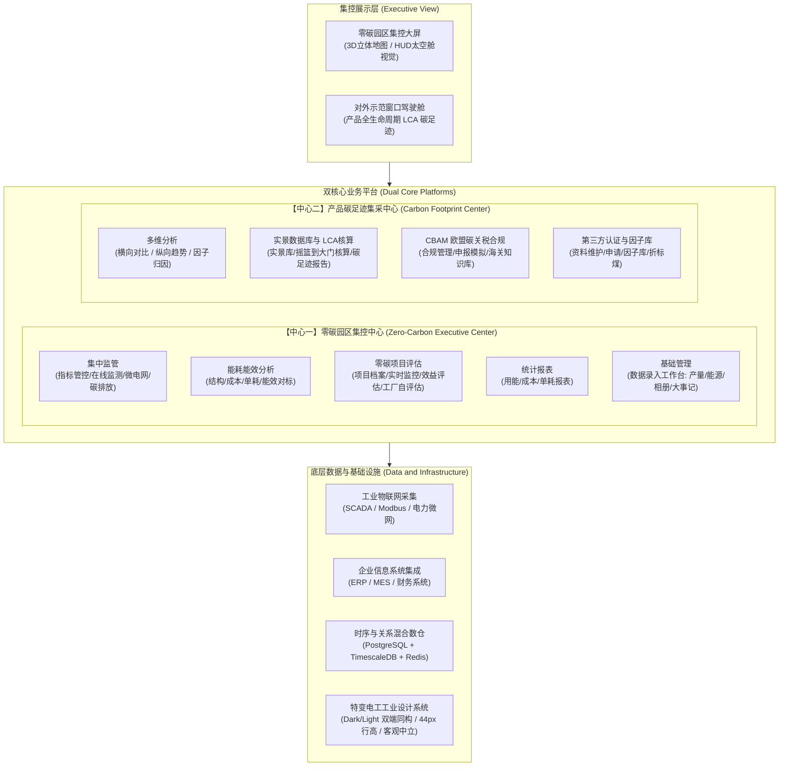

# 特变电工能碳数字化双中心 · PRD 需求规格总纲与目录蓝图

> **文档代号**：`TBEA-PRD-MASTER-2026`  
> **文档位置**：`D:\Project\TJ-nengtan\PRD\README.md`  
> **归属工程**：特变电工（电装集团）零碳园区集控中心 + 产品碳足迹集采中心  
> **协同编制团队**：产品管理部 (PM) × 数字化研发中心 (Architect/Dev) × 质量保障中心 (QA)  
> **基线版本**：v1.0.0 (规划基线版)

---

## 一、 顶层业务架构与产品定位 (Strategic Vision & Architecture)

特变电工能碳数字化双中心是面向特变电工全集团（涵盖沈变、衡变、新变、鲁缆、天池能源、智慧能源等各产业板块及下属园区）打造的工业级能碳一体化数字化中枢，支撑“从物理工厂设备级用能，到集团宏观战略管控，再到全球产品出海合规”的全链路数字化闭环。



---

## 二、 核心用户角色画像矩阵 (Target Personas Matrix)

| 角色编号 | 角色名称 | 代表岗位 | 核心诉求与使用场景 | 访问与操控边界 |
| :--- | :--- | :--- | :--- | :--- |
| **P1** | **集团决策层** | 集团董事长、分管副总裁、双碳战略总监 | 查看集团全景宏观指标大屏、全域万元产值能耗趋势、零碳工厂建设进度与海外 CBAM 关税合规风险大盘。 | 全系统数据只读、审批权限、战略大盘导出 |
| **P2** | **园区/企业能碳专员** | 各子集团/基地动力处长、能源运行主管 | 监控所辖企业/车间电网与重点设备运行，分析用能结构异常，对比单位产品单耗，追踪节能技改项目投资回收率。 | 仅限所辖组织树节点的监控、对标与分析 |
| **P3** | **车间数据填报员** | 各生产车间统计员、动力车间值班员 | 快捷高效完成月度/日度离线生产台账填报（产品产量、外购水电气汽、现场施工相册、大事记）。 | 44px 高密填报工作台录入、修改与撤回 |
| **P4** | **碳核算与认证工程师** | 集团碳资产部、产品研发 LCA 专员 | 维护产品 BOM 与生命周期工序边界、匹配原辅料与电力碳因子、生成碳足迹标签与 ISO 14067 声明，发起机构核查。 | LCA 建模、因子库维护、报告签批与送审 |
| **P5** | **国际贸易与关税专家** | 国际业务部合规经理、海关报关员 | 针对变压器、电缆出口欧盟产品进行 CBAM 前驱物碳排放追溯、关税扣减测算、填报 XML 申报包。 | CBAM 模块全权限、合规推演仿真与海关报送 |
| **P6** | **外部审计与认证机构** | 莱茵/SGS/方圆认证等第三方核查员 | 对特变电工提供的碳足迹凭证、物料平衡、微电网计量数据、绿证核销链进行防伪查验与原始存证核验。 | 专有独立只读审计通道与数据溯源链 |

---

## 三、 PRD 体系分卷目录与架构规划 (PRD Volumes Blueprint)

全套 PRD 文档体系划分为 **10 大业务与工程分卷**，各卷深度融合 PM（业务价值与 Gherkin 验收准则）、开发（架构设计与字段字典）、测试（极限边界与用例矩阵）：

```
PRD/
├── README.md                               # 本文档: PRD 全局架构总纲与目录蓝图
├── PRD-00_全局业务架构与术语规范.md          # 集团业务背景、核心术语定义、指标数学模型与换算基准
├── PRD-01_集中监控大屏与对外示范窗口.md       # 零碳园区全景大屏 (3D立体地图) & 碳足迹对外示范驾驶舱
├── PRD-02_集中监管系统规格说明书.md          # 指标管控看板、用能在线监测、工业微电网、能源碳排放
├── PRD-03_能耗能效与对标分析规格说明书.md    # 用能结构、能源成本、单位产品能耗、产值单耗、能效对标
├── PRD-04_零碳项目与工厂自评估规格说明书.md  # 节能技改项目档案、效益评估、零碳工厂建设三层评估体系
├── PRD-05_统计报表与数据导出规格说明书.md    # 用能/成本/单耗多维度报表、动态列配置、数据防篡改导出
├── PRD-06_基础管理与基层数据填报工作台.md    # 数据录入 (产品产量/能源消耗/园区相册/园区大事记)
├── PRD-07_产品碳足迹核算与实景数据库.md      # LCA 生命周期建模、实景数据库、碳足迹核算与报告生成
├── PRD-08_CBAM欧盟碳关税与合规申报.md       # 欧盟 CBAM 法案适配、前驱物追溯、申报模拟与海关知识库
├── PRD-09_基础支撑与系统配置规格说明书.md    # 组织树权限、碳因子库、折标煤系数、IoT 物联接口规范
└── PRD-10_质量保障体系与测试验收矩阵.md      # 多端同构测试、极端边界用例矩阵、数据级联对齐验收准则
```

---

## 四、 核心分卷 PRD 深度拆解与规划纲要

### 【PRD-01】集中监控大屏与对外示范窗口
- **业务价值**：面向决策层与来访领导打造航天级 HUD 科技感数字驾驶舱，实现“1 秒洞察全集团能碳大盘”。
- **功能组成**：
  1. **零碳园区集控大屏**：
     - 顶部航天级切角金属 HUD 框架，实时动态气象与秒级网络时钟；
     - 中央 3D 浮雕中国立体地图底图，下辖基地雷达脉冲光晕与高科技发光折线引线；
     - 左侧双碳建设勋章环形进度、大事记发光时间轴、光伏电站建设进度滚动表与实景相册轮播；
     - 右侧企业/园区级联下拉选择器、5 个核心工厂胶囊 Tab 切换、10 项重点指标 (5×2) 环形矩阵看板、16:9 运营平台一键钻取窗口。
  2. **产品碳足迹对外示范窗口**：
     - 产品绿色供应链碳标签、摇篮到大门各生命周期阶段碳足迹流向桑基图、欧盟 CBAM 关税节省量化徽标。
- **技术要点**：全屏自适应 Scale 响应式方案（1920×1080 矢量基准），高帧率动效，无卡顿轮播。

---

### 【PRD-02】集中监管系统 (Zero-Carbon Monitor)
- **业务价值**：穿透式实时掌控集团下辖所有企业、工序、设备的能耗脉搏与微电网消纳。
- **功能组成**：
  1. **指标管控看板**：
     - 一、经营单位及项目公司整体指标（综合能耗、产值单耗、ESG 水耗等）；
     - 二、产品管控指标（5 项标准单位产品单耗，支持联动跳转）；
     - 三、关键制造工序能耗管控指标（覆盖 47 项标准工序指标，严格与《生产单位与涉及关键工序对应表》白名单映射；无工序企业单行判空 `暂无相关工序！`）；
     - Mode A（卡片宏观概览）与 Mode B（深入分析详情：指标定义、计算公式、采集路径、12个月时序趋势折线、底层水电气汽历史台账）一键平滑切换。
  2. **用能在线监测**：
     - 工业设备介质自适应（电力为主，蒸汽/燃气/水为辅）；
     - 拓扑层级钻取（园区 ➔ 企业 ➔ 车间 ➔ 重点设备/工序）；
     - 44px 工业高密数据表格，客观展示当前功率、今日用量、昨日同期、环比偏差，无主观定性标签。
  3. **工业微电网监测**：
     - 分布式光伏实时发电量、储能充放电状态、市电并网/逆流防护、微网消纳率。
  4. **能源碳排放监测**：
     - Scope 1 (直接化石燃烧)、Scope 2 (外购电力/热力) 动态排放时序折线与碳减排抵消量。

---

### 【PRD-03】能耗能效与对标分析 (Zero-Carbon Energy)
- **业务价值**：通过横向同构对标与纵向历史对标，挖掘工厂节能降碳空间，赋能工艺改造。
- **功能组成**：
  1. **用能结构分析**：电、水、天然气、蒸汽等多能互补结构桑基图与南丁格尔玫瑰图；
  2. **能源成本分析**：峰谷平尖电价时段用能占比、折标单价分析、需量用电优化策略；
  3. **单位产品能耗 & 产值单耗**：变压器（tce/kVA）、电缆（tce/km）标准化单耗时序分析与多厂区自身历史对比；
  4. **能效对标管理**：国家行业先进值、国家准入值、企业内部领跑线自身基准对标，采用微透科技蓝悬停游标，杜绝眩光纯白。

---

### 【PRD-04】零碳项目与工厂评估 (Zero-Carbon Project)
- **业务价值**：量化节能技改项目投资回报，推动下辖园区向“零碳工厂”标准进阶。
- **功能组成**：
  1. **节能效益评估**：项目全生命周期立项、施工、并网台账，节能量真实测量与验证 (M&V)；
  2. **零碳工厂自评估 (三层钻取体系)**：
     - **第 1 层 (集团宏观层)**：全集团零碳工厂星级分布、平均得分率、核心差距雷达图；
     - **第 2 层 (二级公司层)**：沈变、衡变、新变、鲁缆等各分子公司总得分、星级达标率与整改进展；
     - **第 3 层 (具体工厂层)**：6 大维度细化评分（基础设施、能源利用、产品生态、温室气体、碳抵消、运营管理），支持条款级扣分项穿透与支撑凭证上传。

---

### 【PRD-05】统计报表与数据导出 (Zero-Carbon Reports)
- **业务价值**：为集团财务核算、ESG 信息披露及国家统计局能耗报送提供一键化、高置信度的权威报表。
- **功能组成**：
  1. **用能报表 / 成本报表 / 单耗报表**：
     - 支持时/日/月/年跨度聚合与同比/环比同屏对比；
     - 支持变压器产业（以 kVA 为分母）与线缆产业（以 km 为分母）分类隔离统计；
     - 44px 标准表格高密展示，支持动态表头折叠与字段自定义展示；
     - Excel / CSV / PDF 导出水印存证，严格保证与屏幕呈现数值 100% 吻合。

---

### 【PRD-06】基础管理与基层数据填报工作台 (Data Entry Workbench)
- **业务价值**：收敛解决基层车间无自动化仪表情况下的生产数据、工序产量、离线能耗人工录入痛点。
- **功能组成**：
  1. **四大业务标签页**：
     - **产品产量录入**：支持生产单位、工序、产品名称选择；同类型产品产量数据行合并居中；弹窗新增联动单位选择（台/kVA/km/吨/件）；右下角极简操作按钮组；
     - **能源消耗录入**：结构与产品产量 100% 同构（生产单位、介质、周期、消耗量、计量单位），支持按能源介质分组合并展示；
     - **园区相册维护**：施工现场、厂房顶光伏、储能电站高清实景图上传与多园区轮播配置；
     - **园区大事记维护**：时间轴节点式录入里程碑事件（如光伏并网、绿色工厂获批）。
  2. **防错校验机制**：
     - 非负数值拦截、单位级联约束、同类型多行跨行合并渲染、极简编辑与删除。

---

### 【PRD-07】产品碳足迹核算与实景数据库 (Carbon Footprint)
- **业务价值**：为特变电工变压器、电抗器、线缆等主力出口产品建立符合 ISO 14067 / GHG Protocol 的全生命周期碳账本。
- **功能组成**：
  1. **实景数据库 (Ecoinvent / CLCD 权威库本土化)**：
     - 汇集硅钢片、电解铜、变压器油、特种绝缘纸等工业原料实测本土因子；
  2. **LCA 生命周期核算引擎**：
     - 覆盖“原材料获取 ➔ 上游运输 ➔ 制造加工 ➔ 厂内检测 ➔ 包装出厂”五大阶段；
     - BOM 级碳足迹自动滚算、敏感性分析与关键碳热点识别；
  3. **碳足迹报告与电子标签生成**：
     - 一键生成双语 LCA 碳足迹报告、二维码数字绿标与防伪追溯链。

---

### 【PRD-08】CBAM 欧盟碳关税与合规申报 (CBAM Compliance)
- **业务价值**：助力特变电工海外销售团队应对欧盟 CBAM 正式开征，精准测算关税成本并合规申报。
- **功能组成**：
  1. **合规管理看板**：欧盟 CN 关税税号映射、直接碳排放 vs 间接碳排放判定边界；
  2. **申报模拟与关税测算**：
     - 结合欧盟 ETS 碳配额实时价格变动，测算每台变压器出口欧盟应缴纳的 CBAM 凭证数量及预计成本；
     - 中国国内已支付碳成本（绿电、中国碳交易体系抵扣）抵消抵减计算；
  3. **CBAM 知识库与官方通信指南**：欧盟委员会官方最新通报、过渡期填报模版与核查指引。

---

### 【PRD-09】基础支撑与系统配置 (System Infrastructure)
- **业务价值**：提供平台运行的核心元数据引擎、权限隔离中枢与异构系统通信协议桥梁。
- **功能组成**：
  1. **组织架构与权限管理**：支持“集团 ➔ 产业集团 ➔ 二级公司 ➔ 生产园区 ➔ 车间 ➔ 设备”六级组织树精确鉴权；
  2. **碳因子与折标煤系数库**：国家电网区域电网平均排放因子、发改委标准折标煤系数（0.1229 kgce/kWh 等）版本化管理；
  3. **IoT 物联网与系统集成接口**：支持与特变现有 MES、ERP、变电站 SCADA 系统的 OpenAPI 3.0 / MQTT 数据对接契约。

---

### 【PRD-10】质量保障体系与测试验收矩阵 (QA Matrix)
- **质量方针**：工业软件高稳定性、高准确性、像素级视觉一致性。
- **验收重点**：
  1. **工业高密 44px 行高验收**：全系统所有表格行高强制 `h-[44px]`，垂直居中无抖动；
  2. **双端 100% 同构验收**：暗黑科技蓝 (3000端口) 与浅色办公商务 (3001端口) 功能、布局、数据 100% 一致；
  3. **权威工序白名单判定测试**：严格遵循 10 家无工序单位精准输出 `暂无相关工序！` 单行结论；
  4. **客观中立原则审计**：全量代码与 UI 绝不允许出现“表现优异”、“落后单位”、“运行欠佳”等定性评判词句；
  5. **极端边界测试 (BVA & Race Conditions)**：数值负数防御、小数位精度舍入、网络延迟断网容灾、100ms 并发重复提交防刷。

---

## 五、 PRD 编写规范与演进纪律 (Authoring Discipline)

所有参与 PRD 编写的团队成员与 Agent 必须严格执行以下三条纪律：
1. **多角色协同闭环**：每篇分卷 PRD 必须包含 **PM 业务场景与 INVEST/Gherkin User Story**、**Dev 架构控制流与数据字段规范**、**QA 边界测试矩阵**；
2. **客观中立与极简克制**：文内交互与原型设计完全遵循 `tbea-industrial-design` 工业设计规范；
3. **版本迭代追溯**：每个分卷头部必须保留版本号、修改日志、关联页面路由及作者信息。

---

*特变电工能碳数字化双中心联合项目组 · 2026 年 9 月*
