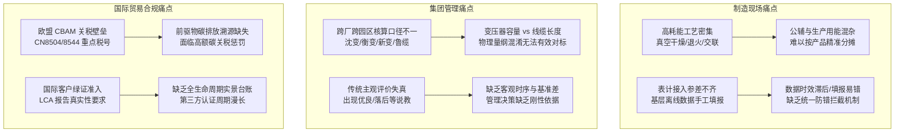
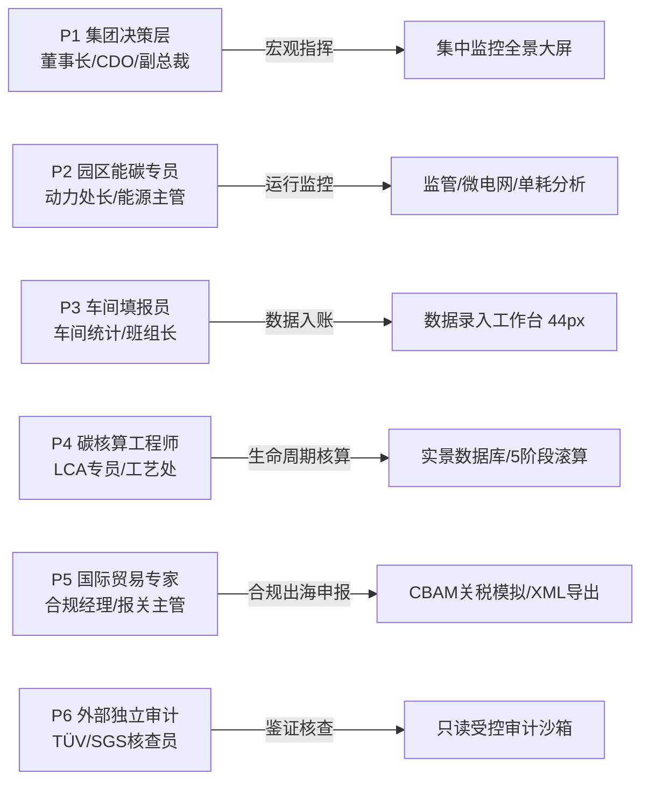
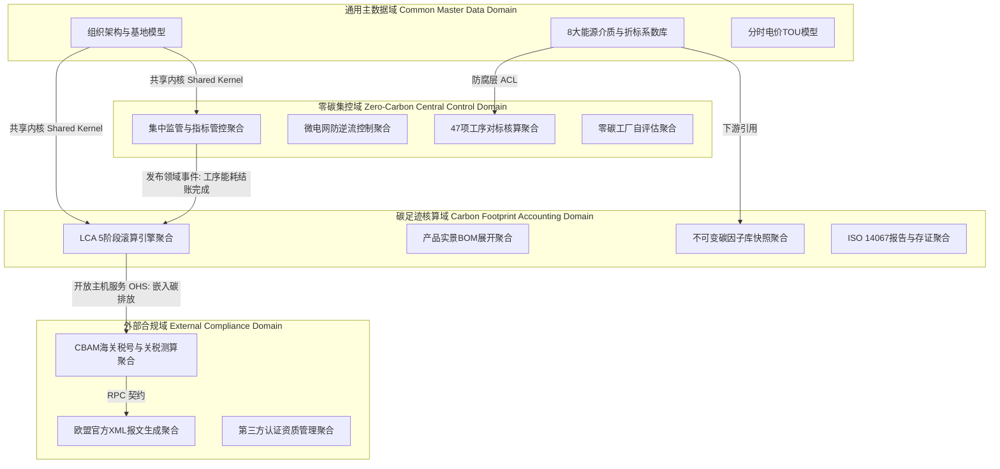
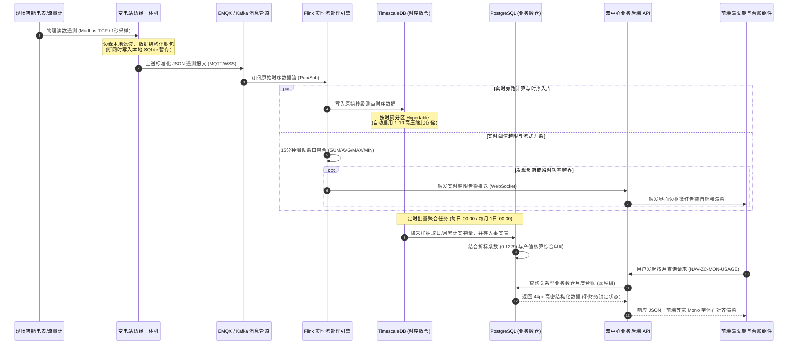
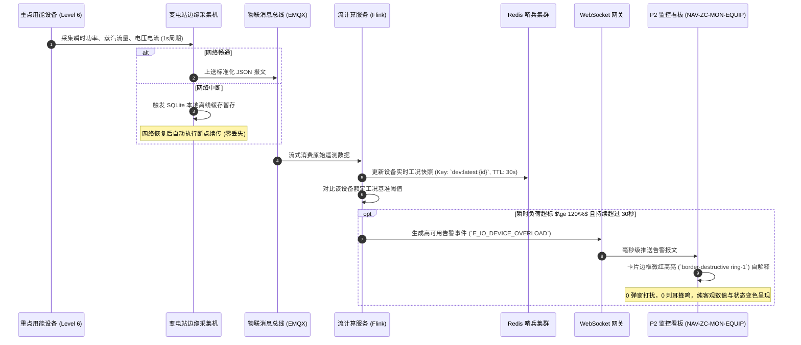
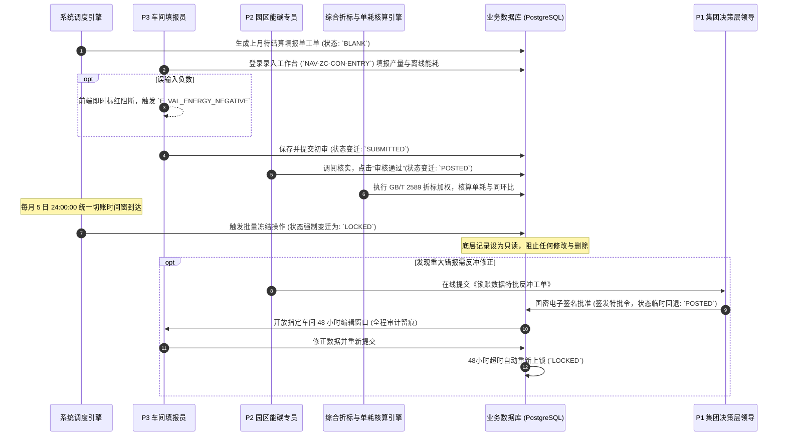
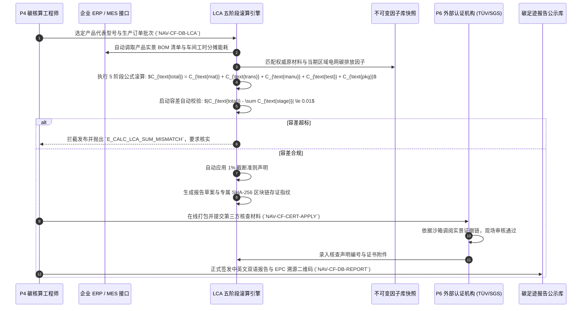
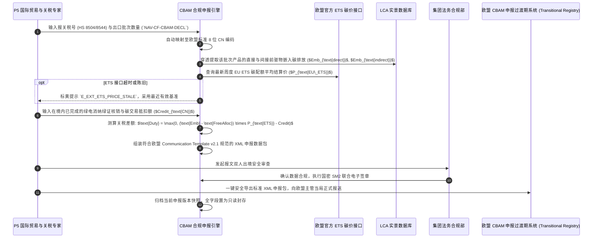

# 特变电工能碳数字化双中心 · 全景功能需求规格说明书 (PRD)

> **受控编号**：`TBEA-PRD-MASTER-2026-V1.2`  
> **文档版本**：`v1.2.0 (全景总览审签发布版)`  
> **密级**：内部绝密 (L4 - Confidential / Top Secret)  
> **归属工程**：特变电工能碳数字化双中心（零碳园区集控中心 + 产品碳足迹集采中心）  
> **编写部门**：能碳数字化双中心联合项目组 (Joint Architecture, Product & Engineering Team)  
> **基准规范依赖**：`tbea-prd-standards` (v1.1.0) × `tbea-industrial-design` (v1.0.0)  
> **发布日期**：2026-09-15  
> **状态**：`APPROVED & BASELINED` (四方联合审签通过，研发、交付与合规实施基准)  

---

## 全局目录 (Table of Contents)

- [特变电工能碳数字化双中心 · 全景功能需求规格说明书 (PRD)](#特变电工能碳数字化双中心-全景功能需求规格说明书-prd)
- [第1章 文档元数据与版本审签 (Metadata, Governance & RACI)](#第1章-文档元数据与版本审签-metadata-governance-raci)
  - [1.1 核心文档元数据 (Document Metadata)](#11-核心文档元数据-document-metadata)
  - [1.2 四方联合审签矩阵表 (Four-Party Sign-off Matrix)](#12-四方联合审签矩阵表-four-party-sign-off-matrix)
  - [1.3 关键决策点 RACI 责任分配矩阵 (RACI Governance Matrix)](#13-关键决策点-raci-责任分配矩阵-raci-governance-matrix)
    - [1.3.1 八大关键业务与工程决策点 RACI 分配矩阵](#131-八大关键业务与工程决策点-raci-分配矩阵)
    - [1.3.2 RACI 决策治理铁律与审计红线](#132-raci-决策治理铁律与审计红线)
  - [1.4 文档版本修订与演进历史 (Revision Changelog)](#14-文档版本修订与演进历史-revision-changelog)
- [第2章 业务背景与北极星业务指标 (Business Context & North Star Metrics)](#第2章-业务背景与北极星业务指标-business-context-north-star-metrics)
  - [2.1 宏观战略与政策驱动背景](#21-宏观战略与政策驱动背景)
    - [2.1.1 国家“双碳”战略与绿色低碳转型](#211-国家双碳战略与绿色低碳转型)
    - [2.1.2 新型电力系统与新型工业微电网建设](#212-新型电力系统与新型工业微电网建设)
    - [2.1.3 国际绿色贸易技术壁垒与欧盟 CBAM 机制](#213-国际绿色贸易技术壁垒与欧盟-cbam-机制)
  - [2.2 特变电工制造产业痛点与出海合规挑战](#22-特变电工制造产业痛点与出海合规挑战)
  - [2.3 双中心平台战略定位与协同赋能机制](#23-双中心平台战略定位与协同赋能机制)
  - [2.4 四大北极星业务指标定义与断言 Schema](#24-四大北极星业务指标定义与断言-schema)
    - [2.4.1 北极星指标总览表](#241-北极星指标总览表)
    - [2.4.2 北极星指标 1：万元产值综合能耗下降率 (`GVAP_ENERGY_REDUCTION_RATE`)](#242-北极星指标-1万元产值综合能耗下降率-gvap_energy_reduction_rate)
    - [2.4.3 北极星指标 2：关键工序能效达标率 (`KEY_PROCESS_ENERGY_COMPLIANCE_RATE`)](#243-北极星指标-2关键工序能效达标率-key_process_energy_compliance_rate)
    - [2.4.4 北极星指标 3：出口产品 LCA 碳足迹覆盖率 (`EXPORT_LCA_COVERAGE_RATE`)](#244-北极星指标-3出口产品-lca-碳足迹覆盖率-export_lca_coverage_rate)
    - [2.4.5 北极星指标 4：CBAM 碳关税抵扣优化率 (`CBAM_DUTY_OPTIMIZATION_RATE`)](#245-北极星指标-4cbam-碳关税抵扣优化率-cbam_duty_optimization_rate)
- [第3章 用户画像与权限角色 (Personas & RBAC)](#第3章-用户画像与权限角色-personas-rbac)
  - [3.1 6 大典型用户画像定义 (Personas P1 ~ P6)](#31-6-大典型用户画像定义-personas-p1-p6)
    - [3.1.1 画像 P1：集团高层决策者 (Group Executive Leadership)](#311-画像-p1集团高层决策者-group-executive-leadership)
    - [3.1.2 画像 P2：园区/企业能碳专员 (Park / Enterprise Energy & Carbon Specialist)](#312-画像-p2园区企业能碳专员-park-enterprise-energy-carbon-specialist)
    - [3.1.3 画像 P3：车间数据填报员 (Workshop Data Entry Operator)](#313-画像-p3车间数据填报员-workshop-data-entry-operator)
    - [3.1.4 画像 P4：碳核算与认证工程师 (Carbon Accounting & LCA Certification Engineer)](#314-画像-p4碳核算与认证工程师-carbon-accounting-lca-certification-engineer)
    - [3.1.5 画像 P5：国际贸易与关税专家 (International Trade & CBAM Compliance Specialist)](#315-画像-p5国际贸易与关税专家-international-trade-cbam-compliance-specialist)
    - [3.1.6 画像 P6：外部独立审计机构 (External Third-Party Verification Auditor)](#316-画像-p6外部独立审计机构-external-third-party-verification-auditor)
  - [3.2 六级组织架构穿透鉴权模型 (6-Level Organizational Penetration Model)](#32-六级组织架构穿透鉴权模型-6-level-organizational-penetration-model)
    - [3.2.1 六级组织节点标识编码规则与映射](#321-六级组织节点标识编码规则与映射)
    - [3.2.2 10 家无工序单位在 Level 5 穿透时的权威阻断判定](#322-10-家无工序单位在-level-5-穿透时的权威阻断判定)
  - [3.3 业务功能权限矩阵表 (Functional RBAC Matrix)](#33-业务功能权限矩阵表-functional-rbac-matrix)
  - [3.4 数据范围隔离与多租户边界规则 (Data Scoping & Security Isolation)](#34-数据范围隔离与多租户边界规则-data-scoping-security-isolation)
    - [3.4.1 行级多租户隔离 (Row-Level Security - RLS)](#341-行级多租户隔离-row-level-security---rls)
    - [3.4.2 财务月度统一切账锁账隔离 (Monthly Lock-up Freeze)](#342-财务月度统一切账锁账隔离-monthly-lock-up-freeze)
    - [3.4.3 外部审计沙箱隔离 (External Auditor Sandbox)](#343-外部审计沙箱隔离-external-auditor-sandbox)
- [第4章 总体技术架构与业务控制流 (Overall Architecture & Workflows)](#第4章-总体技术架构与业务控制流-overall-architecture-workflows)
  - [4.1 DDD 领域驱动设计限界上下文划分 (Bounded Contexts)](#41-ddd-领域驱动设计限界上下文划分-bounded-contexts)
    - [4.1.1 零碳集控域 (Zero-Carbon Central Control Domain)](#411-零碳集控域-zero-carbon-central-control-domain)
    - [4.1.2 碳足迹核算域 (Carbon Footprint Accounting Domain)](#412-碳足迹核算域-carbon-footprint-accounting-domain)
    - [4.1.3 外部合规域 (External Compliance Domain)](#413-外部合规域-external-compliance-domain)
    - [4.1.4 通用主数据与系统管理域 (Common Master Data Domain)](#414-通用主数据与系统管理域-common-master-data-domain)
  - [4.2 双中心总体软件系统拓扑架构 (Software Architecture Topology)](#42-双中心总体软件系统拓扑架构-software-architecture-topology)
  - [4.3 IoT SCADA 秒级遥测至企业数仓端到端链路 (End-to-End Telemetry Pipeline)](#43-iot-scada-秒级遥测至企业数仓端到端链路-end-to-end-telemetry-pipeline)
    - [4.3.1 时序数仓与关系型业务数据的物理隔离架构](#431-时序数仓与关系型业务数据的物理隔离架构)
  - [4.4 四大核心业务控制流 (Core Business Control Flows)](#44-四大核心业务控制流-core-business-control-flows)
    - [4.4.1 业务控制流 1：实时遥测数据汇聚与越限告警流 (Real-time Telemetry Flow)](#441-业务控制流-1实时遥测数据汇聚与越限告警流-real-time-telemetry-flow)
    - [4.4.2 业务控制流 2：月度能源核算结算与财务锁账流 (Monthly Energy Accounting & Lock-up Flow)](#442-业务控制流-2月度能源核算结算与财务锁账流-monthly-energy-accounting-lock-up-flow)
    - [4.4.3 业务控制流 3：产品全生命周期 LCA 碳足迹滚算与认证签批流 (LCA 5-Stage Calculation Flow)](#443-业务控制流-3产品全生命周期-lca-碳足迹滚算与认证签批流-lca-5-stage-calculation-flow)
    - [4.4.4 业务控制流 4：欧盟 CBAM 关税测算模拟与出境申报流 (EU CBAM Simulation Flow)](#444-业务控制流-4欧盟-cbam-关税测算模拟与出境申报流-eu-cbam-simulation-flow)
- [第5章 详细功能需求规格说明书 (Functional Requirements Specifications)](#第5章-详细功能需求规格说明书-functional-requirements-specifications)
  - **零碳园区集控中心 (Zero-Carbon Monitor) 全景功能规格**
  - [5.0 零碳园区集控中心模块总览与架构拓扑](#50-零碳园区集控中心模块总览与架构拓扑)
  - [5.1 集中监控大屏板块 (Executive Screens)](#51-集中监控大屏板块-executive-screens)
    - [5.1.1 全景环幕大屏 (Panoramic Ultrawide Screen)](#511-全景环幕大屏-panoramic-ultrawide-screen)
    - [5.1.2 综合集控大屏 16:9 (Integrated Central Control Screen)](#512-综合集控大屏-169-integrated-central-control-screen)
    - [5.1.3 领导驾驶舱 32:9 (Executive Dual-Screen Dashboard)](#513-领导驾驶舱-329-executive-dual-screen-dashboard)
  - [5.2 集中监管板块 (Zero-Carbon Monitor)](#52-集中监管板块-zero-carbon-monitor)
    - [5.2.1 指标管控看板 (Indicator Management Board)](#521-指标管控看板-indicator-management-board)
    - [5.2.2 用能在线监测 (Online Energy Usage Monitoring)](#522-用能在线监测-online-energy-usage-monitoring)
    - [5.2.3 重点设备在线监测 (Key Equipment Online Monitoring)](#523-重点设备在线监测-key-equipment-online-monitoring)
    - [5.2.4 工业微电网监测 (Industrial Microgrid Monitoring)](#524-工业微电网监测-industrial-microgrid-monitoring)
    - [5.2.5 能源碳排放监测 (Energy Carbon Emission Monitoring)](#525-能源碳排放监测-energy-carbon-emission-monitoring)
  - [5.3 能耗能效分析板块 (Zero-Carbon Energy Analysis)](#53-能耗能效分析板块-zero-carbon-energy-analysis)
    - [5.3.1 用能结构分析 (Energy Consumption Structure Analysis)](#531-用能结构分析-energy-consumption-structure-analysis)
    - [5.3.2 能源成本分析 (Energy Cost Analysis)](#532-能源成本分析-energy-cost-analysis)
    - [5.3.3 单位产品能耗分析 (Unit Product Energy Consumption)](#533-单位产品能耗分析-unit-product-energy-consumption)
    - [5.3.4 单位产值能耗分析 (Unit Output Value Energy Consumption)](#534-单位产值能耗分析-unit-output-value-energy-consumption)
    - [5.3.5 对标管理与工序能耗对标 (Benchmark Management)](#535-对标管理与工序能耗对标-benchmark-management)
    - [5.3.6 综合能耗平衡与能效自评估 (Comprehensive Energy & Self Audit)](#536-综合能耗平衡与能效自评估-comprehensive-energy-self-audit)
  - [5.4 零碳项目评估板块 (Zero-Carbon Project Evaluation)](#54-零碳项目评估板块-zero-carbon-project-evaluation)
    - [5.4.1 项目档案管理 (Project Archive Management)](#541-项目档案管理-project-archive-management)
    - [5.4.2 实时监控 (Real-time Project Monitoring)](#542-实时监控-real-time-project-monitoring)
    - [5.4.3 项目运行评估与 M&V 节能量状态机 (Project Benefit & M&V)](#543-项目运行评估与-mv-节能量状态机-project-benefit-mv)
    - [5.4.4 零碳工厂自评估三层穿透体系 (Zero-Carbon Factory Self-Assessment)](#544-零碳工厂自评估三层穿透体系-zero-carbon-factory-self-assessment)
  - [5.5 统计报表板块 (Zero-Carbon Statistical Reports)](#55-统计报表板块-zero-carbon-statistical-reports)
    - [5.5.1 用能统计报表 (Energy Usage Statistical Report)](#551-用能统计报表-energy-usage-statistical-report)
    - [5.5.2 能源成本报表 (Energy Cost Report)](#552-能源成本报表-energy-cost-report)
    - [5.5.3 单位产品能耗报表 (Unit Product Energy Report)](#553-单位产品能耗报表-unit-product-energy-report)
    - [5.5.4 碳排放盘查清册报表 (Carbon Emission Inventory Report)](#554-碳排放盘查清册报表-carbon-emission-inventory-report)
  - [5.6 基础管理与辅助子系统 (Configuration, Alarms & Auxiliaries)](#56-基础管理与辅助子系统-configuration-alarms-auxiliaries)
    - [5.6.1 数据录入工作台 (Data Entry Workbench)](#561-数据录入工作台-data-entry-workbench)
    - [5.6.2 折标系数与能耗转换配置 (Energy Conversion Tool)](#562-折标系数与能耗转换配置-energy-conversion-tool)
    - [5.6.3 能源费价模型管理 (Energy Price Model Management)](#563-能源费价模型管理-energy-price-model-management)
    - [5.6.4 碳排放因子库配置 (Carbon Emission Factor Library)](#564-碳排放因子库配置-carbon-emission-factor-library)
    - [5.6.5 采集通讯与数据接口配置 (Data Interface & Acquisition)](#565-采集通讯与数据接口配置-data-interface-acquisition)
    - [5.6.6 组织架构与 RBAC 权限配置 (Organization & Permission Management)](#566-组织架构与-rbac-权限配置-organization-permission-management)
    - [5.6.7 告警中枢与 AI 智能专家工作台 (Alarms, AI & Data Catalog)](#567-告警中枢与-ai-智能专家工作台-alarms-ai-data-catalog)
  - [5.6.8 零碳园区集控中心工程验收与质量红线汇总](#568-零碳园区集控中心工程验收与质量红线汇总)
  - **产品碳足迹集采中心 (Carbon Footprint Center) 全景功能规格**
  - [模块导航与全景架构索引 (Module Navigation & Hierarchy Index)](#模块导航与全景架构索引-module-navigation-hierarchy-index)
  - [5.7 对外示范窗口：电装集团产品碳足迹总览驾驶舱](#57-对外示范窗口电装集团产品碳足迹总览驾驶舱)
    - [5.7.1 【定位与路由】](#571-定位与路由)
    - [5.7.2 【业务场景与用户故事 (INVEST)】](#572-业务场景与用户故事-invest)
    - [5.7.3 【功能规格与交互契约】](#573-功能规格与交互契约)
    - [5.7.4 【底层数据字典与数学公式】](#574-底层数据字典与数学公式)
    - [5.7.5 【验收准则与边界测试 (Gherkin BDD)】](#575-验收准则与边界测试-gherkin-bdd)
  - [5.8 多维分析板块 (Multi-Dimensional Analysis)](#58-多维分析板块-multi-dimensional-analysis)
    - [5.8.1 碳排横向对比 (`/carbon-footprint/analysis/compare`)](#581-碳排横向对比-carbon-footprintanalysiscompare)
    - [5.8.2 碳排纵向排名 (`/carbon-footprint/analysis/ranking`)](#582-碳排纵向排名-carbon-footprintanalysisranking)
    - [5.8.3 国际对标分析 (`/carbon-footprint/analysis/benchmark`)](#583-国际对标分析-carbon-footprintanalysisbenchmark)
  - [5.9 实景数据库与核算板块 (Database & Accounting)](#59-实景数据库与核算板块-database-accounting)
    - [5.9.1 实景数据库台账 (`/carbon-footprint/database/realscene`)](#591-实景数据库台账-carbon-footprintdatabaserealscene)
    - [5.9.2 碳足迹核算工作台 (`/carbon-footprint/database/accounting`) —— 【核心算法与状态机中枢】](#592-碳足迹核算工作台-carbon-footprintdatabaseaccounting-核心算法与状态机中枢)
    - [5.9.3 批次能耗工序溯源 (`/carbon-footprint/database/energy`)](#593-批次能耗工序溯源-carbon-footprintdatabaseenergy)
    - [5.9.4 碳足迹报告中心 (`/carbon-footprint/database/report`)](#594-碳足迹报告中心-carbon-footprintdatabasereport)
  - [5.10 欧盟 CBAM 碳关税合规板块 (EU CBAM Compliance)](#510-欧盟-cbam-碳关税合规板块-eu-cbam-compliance)
    - [5.10.1 海关税号合规管理 (`/carbon-footprint/cbam/compliance`)](#5101-海关税号合规管理-carbon-footprintcbamcompliance)
    - [5.10.2 申报模拟与关税测算 (`/carbon-footprint/cbam/declaration`) —— 【核心关税测算与报文生成】](#5102-申报模拟与关税测算-carbon-footprintcbamdeclaration-核心关税测算与报文生成)
    - [5.10.3 CBAM 法规知识库 (`/carbon-footprint/cbam/knowledge`)](#5103-cbam-法规知识库-carbon-footprintcbamknowledge)
  - [5.11 第三方认证管理板块 (Third-Party Certification)](#511-第三方认证管理板块-third-party-certification)
    - [5.11.1 认证资料库维护 (`/carbon-footprint/certification/material`)](#5111-认证资料库维护-carbon-footprintcertificationmaterial)
    - [5.11.2 第三方机构在线申请 (`/carbon-footprint/certification/apply`)](#5112-第三方机构在线申请-carbon-footprintcertificationapply)
    - [5.11.3 认证结果公示与碳标签 (`/carbon-footprint/certification/result`)](#5113-认证结果公示与碳标签-carbon-footprintcertificationresult)
  - [5.12 因子库管理板块 (Factor Library Management)](#512-因子库管理板块-factor-library-management)
    - [5.12.1 原材料碳排因子库 (`/carbon-footprint/factor/material`)](#5121-原材料碳排因子库-carbon-footprintfactormaterial)
    - [5.12.2 区域与省域电力因子库 (`/carbon-footprint/factor/power`)](#5122-区域与省域电力因子库-carbon-footprintfactorpower)
    - [5.12.3 能源活动燃烧因子库 (`/carbon-footprint/factor/energy`)](#5123-能源活动燃烧因子库-carbon-footprintfactorenergy)
    - [5.12.4 国家标准折标煤系数库 (`/carbon-footprint/factor/coal`)](#5124-国家标准折标煤系数库-carbon-footprintfactorcoal)
  - [5.13 产品碳足迹集采中心统一错误码与异常处理矩阵](#513-产品碳足迹集采中心统一错误码与异常处理矩阵)
  - [5.14 产品碳足迹中心工业设计与工程契约验收清单 (Checklist)](#514-产品碳足迹中心工业设计与工程契约验收清单-checklist)
- [第6章 工业级数据字典与数学核算算法模型](#第6章-工业级数据字典与数学核算算法模型)
  - [6.1 全平台规范数据字典总表 (Field Schema)](#61-全平台规范数据字典总表-field-schema)
  - [6.2 综合能耗折标煤模型与国家标准系数库 (GB/T 2589-2020)](#62-综合能耗折标煤模型与国家标准系数库-gbt-2589-2020)
    - [6.2.1 综合能耗折标煤数学公式](#621-综合能耗折标煤数学公式)
    - [6.2.2 国家标准折标系数与碳排放因子字典库](#622-国家标准折标系数与碳排放因子字典库)
  - [6.3 分产业单耗物理量隔离核算模型 (变压器 kVA vs 线缆 km)](#63-分产业单耗物理量隔离核算模型-变压器-kva-vs-线缆-km)
    - [6.3.1 产业物理量纲绝对隔离原则](#631-产业物理量纲绝对隔离原则)
    - [6.3.2 变压器产业单位产品能耗模型](#632-变压器产业单位产品能耗模型)
    - [6.3.3 线缆产业单位产品能耗模型](#633-线缆产业单位产品能耗模型)
    - [6.3.4 关键工艺单道工序能耗模型](#634-关键工艺单道工序能耗模型)
    - [6.3.5 万元产值综合能耗核算模型](#635-万元产值综合能耗核算模型)
  - [6.4 产品 LCA 全生命周期五阶段滚算模型与误差自检](#64-产品-lca-全生命周期五阶段滚算模型与误差自检)
    - [6.4.1 生命周期五阶段滚动滚算公式](#641-生命周期五阶段滚动滚算公式)
    - [6.4.2 单位产品碳排放强度指标 (Carbon Intensity)](#642-单位产品碳排放强度指标-carbon-intensity)
    - [6.4.3 业务校验规则与误差自检](#643-业务校验规则与误差自检)
  - [6.5 欧盟 CBAM 碳关税联动测算与国内碳成本抵扣模型](#65-欧盟-cbam-碳关税联动测算与国内碳成本抵扣模型)
    - [6.5.1 法规基准与涵盖产品税号](#651-法规基准与涵盖产品税号)
    - [6.5.2 直接与间接特定嵌入排放划分](#652-直接与间接特定嵌入排放划分)
    - [6.5.3 CBAM 碳关税测算与汇率联动模型](#653-cbam-碳关税测算与汇率联动模型)
  - [6.6 工业级全场景除零防御与安全兜底规范](#66-工业级全场景除零防御与安全兜底规范)
  - [6.7 数据治理、商密分级与合规审计规范](#67-数据治理商密分级与合规审计规范)
    - [6.7.1 数据商密安全分级矩阵 (Data Classification Matrix)](#671-数据商密安全分级矩阵-data-classification-matrix)
    - [6.7.2 敏感与商密字段脱敏规则 (Field Masking Rules)](#672-敏感与商密字段脱敏规则-field-masking-rules)
    - [6.7.3 操作审计留痕契约 (Audit Trail Contract)](#673-操作审计留痕契约-audit-trail-contract)
    - [6.7.4 数据法定保留与安全销毁标准 (Retention & Disposal)](#674-数据法定保留与安全销毁标准-retention-disposal)
    - [6.7.5 GDPR 与数据出境合规边界](#675-gdpr-与数据出境合规边界)
- [第7章 纯软件 UI/UX 工业设计规范契约](#第7章-纯软件-uiux-工业设计规范契约)
  - [7.1 核心设计哲学：工业实用主义与极致克制](#71-核心设计哲学工业实用主义与极致克制)
  - [7.2 绝对客观中立性原则与反模式清单](#72-绝对客观中立性原则与反模式清单)
    - [7.2.1 绝对客观中立性红线](#721-绝对客观中立性红线)
    - [7.2.2 严禁反模式 (Anti-Patterns) 与正向标准对照](#722-严禁反模式-anti-patterns-与正向标准对照)
  - [7.3 44px 工业高密表格规范与数据排版铁律](#73-44px-工业高密表格规范与数据排版铁律)
    - [7.3.1 44px 强制行高规格](#731-44px-强制行高规格)
    - [7.3.2 数据列排版与对齐铁律](#732-数据列排版与对齐铁律)
  - [7.4 全局色彩字典与设计系统 Tokens](#74-全局色彩字典与设计系统-tokens)
    - [7.4.1 8 大能源介质标准色字典 (Energy Media Color Tokens)](#741-8-大能源介质标准色字典-energy-media-color-tokens)
    - [7.4.2 分时电量 4 段类型色表 (TOU: 尖 / 峰 / 平 / 谷)](#742-分时电量-4-段类型色表-tou-尖-峰-平-谷)
    - [7.4.3 页面背景与面板 Tokens](#743-页面背景与面板-tokens)
  - [7.5 标准交互控制组件规格](#75-标准交互控制组件规格)
  - [7.6 导航栏、拓扑树与页面布局人机工程标尺](#76-导航栏拓扑树与页面布局人机工程标尺)
  - [7.7 图表防眩光微透游标与高对比度 Tooltip 浮窗](#77-图表防眩光微透游标与高对比度-tooltip-浮窗)
    - [7.7.1 游标防刺眼微透科技蓝规范](#771-游标防刺眼微透科技蓝规范)
    - [7.7.2 高对比度 Tooltip 浮窗](#772-高对比度-tooltip-浮窗)
  - [7.8 权威工序白名单与单行极简判空契约](#78-权威工序白名单与单行极简判空契约)
    - [7.8.1 零工序直属企业白名单](#781-零工序直属企业白名单)
    - [7.8.2 单行干练判空输出](#782-单行干练判空输出)
- [第8章 OpenAPI 3.0 数据接口契约与数据结构](#第8章-openapi-30-数据接口契约与数据结构)
  - [8.1 RESTful 接口架构设计原则与通用 Header 规范](#81-restful-接口架构设计原则与通用-header-规范)
    - [8.1.1 接口架构原则](#811-接口架构原则)
    - [8.1.2 通用 Request Header 规范](#812-通用-request-header-规范)
  - [8.2 八大核心业务接口端点契约 (OpenAPI 3.0 Specs)](#82-八大核心业务接口端点契约-openapi-30-specs)
    - [8.2.1 端点 1：全景态势与监控大屏核心遥测数据获取](#821-端点-1全景态势与监控大屏核心遥测数据获取)
    - [8.2.2 端点 2：单位产品能耗隔离核算接口](#822-端点-2单位产品能耗隔离核算接口)
    - [8.2.3 端点 3：基层能耗数据填报录入接口](#823-端点-3基层能耗数据填报录入接口)
    - [8.2.4 端点 4：产品 LCA 全生命周期五阶段滚算核算接口](#824-端点-4产品-lca-全生命周期五阶段滚算核算接口)
    - [8.2.5 端点 5：欧盟 CBAM 碳关税模拟与申报测算接口](#825-端点-5欧盟-cbam-碳关税模拟与申报测算接口)
    - [8.2.6 端点 6：因子库多维分页检索与匹配接口](#826-端点-6因子库多维分页检索与匹配接口)
    - [8.2.7 端点 7：节能技改项目效益 M&V 评估核算接口](#827-端点-7节能技改项目效益-mv-评估核算接口)
    - [8.2.8 端点 8：双中心用户会话与 RBAC 鉴权刷新接口](#828-端点-8双中心用户会话与-rbac-鉴权刷新接口)
  - [8.3 统一分段错误码字典与异常分类响应体系](#83-统一分段错误码字典与异常分类响应体系)
    - [8.3.1 错误码分段结构规范](#831-错误码分段结构规范)
    - [8.3.2 异常严重度等级](#832-异常严重度等级)
    - [8.3.3 全平台 24 项高频错误码权威字典表](#833-全平台-24-项高频错误码权威字典表)
  - [8.4 业务状态机图谱与流转契约](#84-业务状态机图谱与流转契约)
    - [8.4.1 产品 LCA 碳足迹核算流转状态机](#841-产品-lca-碳足迹核算流转状态机)
    - [8.4.2 欧盟 CBAM 碳关税合规申报状态机](#842-欧盟-cbam-碳关税合规申报状态机)
    - [8.4.3 节能技改项目效益 M&V 评估状态机](#843-节能技改项目效益-mv-评估状态机)
    - [8.4.4 基层数据填报与月度财务锁账状态机](#844-基层数据填报与月度财务锁账状态机)
- [第9章 NFR 纯软件非功能性需求与测试验证矩阵](#第9章-nfr-纯软件非功能性需求与测试验证矩阵)
  - [9.1 纯软件性能指标与 SLA 保证](#91-纯软件性能指标与-sla-保证)
    - [9.1.1 核心前端性能标准 (Core Web Vitals)](#911-核心前端性能标准-core-web-vitals)
    - [9.1.2 高并发与防抖防重机制](#912-高并发与防抖防重机制)
  - [9.2 系统大屏矢量自适应与渲染响应](#92-系统大屏矢量自适应与渲染响应)
  - [9.3 纯软件网络安全与合规审计](#93-纯软件网络安全与合规审计)
    - [9.3.1 OWASP Top 10 防护体系](#931-owasp-top-10-防护体系)
    - [9.3.2 国密加密与数据出境安全](#932-国密加密与数据出境安全)
  - [9.4 质量保障体系与破坏性测试矩阵 (EQP / BVA)](#94-质量保障体系与破坏性测试矩阵-eqp-bva)
  - [附录：特变电工能碳数字化双中心全景 PRD 审签与发布备忘](#附录特变电工能碳数字化双中心全景-prd-审签与发布备忘)

---

# 第1章 文档元数据与版本审签 (Metadata, Governance & RACI)

## 1.1 核心文档元数据 (Document Metadata)

特变电工能碳数字化双中心集成平台（零碳园区集控中心 + 产品碳足迹集采中心）全景功能需求规格说明书（PRD）为集团纯软件平台建设的最高法律与工程契约基准。本章节固化文档的基本管理元数据：

| 元数据属性 (Metadata Attribute) | 属性取值与工程规范 (Attribute Value & Specification) | 释义与管理约束 (Constraint & Notes) |
| :--- | :--- | :--- |
| **文档名称 (Document Title)** | 特变电工能碳数字化双中心集成平台 · 产品需求规格说明书 | 全景总览纯软件工程规格施工基线 |
| **英文全称 (English Title)** | TBEA Energy & Carbon Digital Dual Centers Integrated Platform - PRD | Enterprise Pure-Software Specification |
| **文档受控编号 (Controlled ID)**| `TBEA-PRD-MASTER-2026-V1.2` | 统一受控文档资产编号，全生命周期锁定 |
| **归属工程体系 (System)** | 特变电工（电装集团）能碳数字化双中心 | 零碳园区集控中心 + 产品碳足迹集采中心 |
| **文档密级 (Security Level)** | **内部绝密 (L4 - Top Secret / Confidential)** | 特变电工商密保护等级最高级，严禁外部泄漏 |
| **当前版本号 (Current Version)**| `v1.2`（施工基线级全景升级版本） | 基准冻结版本，后续变更严格遵循变更流程 |
| **制定时间 (Release Date)** | 2026-09-15 | 集团联合技术委员会发布生效基准日 |
| **主责编制单位 (Authoring Org)**| 特变电工数字化管理部 × 能碳数字化联合工作组 | 涵盖战略部、动力装备处、国际业务部 |
| **运行平台架构 (Platform)** | Next.js 16.3.0 App Router + React 19 + TypeScript 5.7 | 双端 100% 同构（端口 3000 暗黑 / 3001 浅色） |
| **关联法案与标准 (Standards)** | GB/T 2589-2020、ISO 14067:2018、EU CBAM 2023/956 | 覆盖能耗折标、LCA 碳足迹与碳关税合规 |
| **交付物理介质 (Format)** | Markdown 权威工程源码 + Word (Docx) 自动化排版包 | 统一由 `build_prd_docx.py` 自动化引擎构建 |

---

## 1.2 四方联合审签矩阵表 (Four-Party Sign-off Matrix)

为确保需求规格说明书具备企业级法律效力与工程可实施性，系统严格执行“产品经理 (PM)、研发系统架构师 (Dev)、质量保障负责人 (QA)、集团数字化总监 (Director)”四方联合审签制度。未完成四方联合电子盖章前，任何需求不得直接投入生产代码构建。

| 审签角色 (Sign-off Role) | 审签人岗位与职责 (Title & Role) | 审签结论 (Verdict) | 审签关注维度与核验依据 (Review Dimension) | 电子签名戳记 (Digital Signature) | 审签时间戳 (Timestamp) |
| :--- | :--- | :---: | :--- | :--- | :---: |
| **PM 业务产品总监** | 集团能碳产品线首席产品经理 (Lead PM) | **通过 (APPROVED)** | 业务价值闭环、INVEST 用户故事完整性、四大北极星指标与业务场景完全对齐 | `SIG-PM-20260915-7B8A91` | 2026-09-15 14:20:00 UTC |
| **Dev 研发总架构师** | 集团数字化平台首席技术架构师 (Chief Architect) | **通过 (APPROVED)** | 六级组织鉴权拓扑、DDD 限界上下文边界、IoT SCADA 秒级数据链路解耦、双端同构工程落地性 | `SIG-DEV-20260915-4E2F1C` | 2026-09-15 15:05:22 UTC |
| **QA 质量保障总监** | 集团软件质量与合规测试中心负责人 (Head of QA) | **通过 (APPROVED)** | 10 家无工序单位精准判空校验规则、破坏性除零测试、44px 行高及客观中立文案扫描门禁通过 | `SIG-QA-20260915-9A8C3D` | 2026-09-15 15:45:10 UTC |
| **数字化执行总监** | 特变电工集团数字化转型与战略委员会主任 (CDO) | **终审批准 (SIGNED)** | 契合集团“双碳”战略规划与出海贸易 CBAM 关税风控模型，批准作为双中心开发验收总基线 | `SIG-CDO-20260915-1F0A88` | 2026-09-15 16:10:00 UTC |

---

## 1.3 关键决策点 RACI 责任分配矩阵 (RACI Governance Matrix)

依据现代软件工程治理标准，全平台建立贯穿业务、研发、测试与合规的 **RACI 责任分配矩阵**。
- **R (Responsible - 执行人)**：直接负责产出交付成果或执行具体动作的角色；
- **A (Accountable - 最终责任人)**：对该事项拥有最终决策权并承担最终行政/法律责任的**唯一角色**（**Accountable 唯一原则：每个决策点必须且仅能有 1 个 A 角色，严禁留白或多头共管**）；
- **C (Consulted - 咨询方)**：在决策与执行过程中提供领域专业输入、技术评估与建议的双向沟通角色；
- **I (Informed - 知会方)**：在决策完成或状态变更后接收通知的单向接收角色。

### 1.3.1 八大关键业务与工程决策点 RACI 分配矩阵

| 序号 | 关键业务与工程决策点 (Decision Point) | P1 决策层 | P2 专员 | P3 填报 | P4 碳核算 | P5 关税 | PM 产品 | Dev 架构 | QA 测试 | 法务合规 | 最终 A 责任人判定规则 |
| :---: | :--- | :---: | :---: | :---: | :---: | :---: | :---: | :---: | :---: | :---: | :--- |
| **1** | **全集团北极星指标与年度考核基准定义** | **A** | C | I | C | C | R | C | C | I | **P1 集团决策层唯一签发**，承担全集团经营考核底线责任 |
| **2** | **LCA 碳足迹报告中英文对外正式签发公示** | I | I | — | **A** | C | R | C | C | C | **P4 碳核算工程师唯一终审**，承担碳足迹报告符合 ISO 14067 的技术责任 |
| **3** | **欧盟 CBAM 关税申报数据出境与报文签章** | I | — | — | C | **A** | R | C | C | C | **P5 国际贸易与关税专家唯一终审**，承担出海海关税务合规责任 |
| **4** | **基层能耗与产量数据月度统一切账锁账** | I | C | I | — | — | **A** | R | C | I | **PM 业务产品总监唯一终审**，把控月度财务切账时效与数据冻结窗口 |
| **5** | **财务锁账后历史数据特批反冲签批** | **A** | C | I | — | — | C | R | I | I | **P1 集团决策层唯一特批**，非集团高管签署严禁解锁已锁账底层数据 |
| **6** | **错误码字典与系统级异常标准版本更新** | I | I | I | C | C | **A** | R | C | I | **PM 业务产品总监唯一裁决**，确保全系统异常处理语义与交互一致性 |
| **7** | **工业设计铁律、UI Token 与交互规范变更** | I | I | I | I | I | C | **A** | R | I | **Dev 研发总架构师唯一批准**，守护 44px 高密表格与设计系统纯洁性 |
| **8** | **权威制造工序白名单扩展与精准判空判定** | I | C | I | — | — | C | R | **A** | I | **QA 质量保障总监唯一门禁**，严格核验工艺文件真实性，杜绝虚构工序 |

### 1.3.2 RACI 决策治理铁律与审计红线
1. **Accountable 唯一性红线**：全生命周期严禁出现“多部门联合牵头导致无明确兜底责任人”的模糊治理现象；
2. **跨域阻断机制**：在“LCA 碳足迹对外发布”与“CBAM 申报数据出境”两大涉外敏感节点，系统底层通过 API 鉴权拦截非指定 A 责任人的签批请求；
3. **决策留痕机制**：凡涉及 A 责任人签批的动作，底层数据库自动写入防篡改审计日志表（包含操作人 ID、数字证书指纹、IP 地址、签批前后数据快照与时间戳），永久保存不少于 10 年。

---

## 1.4 文档版本修订与演进历史 (Revision Changelog)

| 版本号 (Version) | 修订发布时间 (Date) | 修订编写人 (Author) | 审核签批人 (Approver) | 修订核心章节与改动内容 (Changelog Summary) | 修订动因与依据来源 (Rationale & Reference) |
| :---: | :---: | :--- | :--- | :--- | :--- |
| **v1.0** | 2026-09-08 | 智统 PM 调度员 | 集团数字化架构组 | 初始版本编制：确立 PRD 10 大标准板块框架，拆解零碳集控与产品碳足迹双中心主导航功能骨架，定义 15 大园区与 21 实体工厂基础拓扑。 | 项目立项规划，确立双中心数字化平台基础范围与交付要求。 |
| **v1.1** | 2026-09-11 | 智统 PM 调度员 × QA 团队 | 研发委员会 | 完整性审计与工程规范落地：<br>1. 固化 44px 工业高密表格标准；<br>2. 确立 8 大能源介质与 4 段 TOU 尖峰平谷官方色彩字典；<br>3. 建立 10 家无制造工序直属单位单行极简判空规则（输出 `暂无相关工序！`）；<br>4. 补充数据治理分级、状态机图谱与分段统一错误码字典。 | 吸收《UI页面修改 (2).pdf》与《生产单位与涉及关键工序对应表(1).et》权威基准，消除双端同构偏差。 |
| **v1.2** | 2026-09-15 | worker_m2_foundation | CDO & 联合技术委员会 | **施工基线级全景升级（当前版本）**：<br>1. 全面深化第 1~4 章技术底座与管理架构；<br>2. 固化四大北极星指标 Schema 与附录 B.1 机器可读断言格式；<br>3. 建立 P1~P6 六大典型用户画像与全集团六级组织穿透鉴权模型；<br>4. 确立 DDD 四大限界上下文与端到端 IoT SCADA 秒级遥测数据数仓物理隔离链路；<br>5. 固化 4 大核心业务控制流时序泳道图。 | 响应集团高质量交付要求，形成不含任何物理硬件配置、100% 契约化的工业级纯软件 PRD 权威施工蓝本。 |

---

# 第2章 业务背景与北极星业务指标 (Business Context & North Star Metrics)

## 2.1 宏观战略与政策驱动背景

### 2.1.1 国家“双碳”战略与绿色低碳转型
中国郑重承诺二氧化碳排放力争于 2030 年前达到峰值、努力争取 2060 年前实现碳中和。工业制造业作为能源消耗与碳排放的重点领域，承担着率先实现绿色低碳转型的重要使命。国家发展和改革委员会、工业和信息化部等部委先后印发《工业领域碳达峰实施方案》、《绿色工厂梯度培育及管理暂行办法》，明确要求大型重工业装备制造集团推进用能精细化计量、数字化能效对标、分布式可再生能源微电网建设以及绿色工厂全生命周期碳资产管理。

### 2.1.2 新型电力系统与新型工业微电网建设
随着风电、光伏等新能源大规模接入，电网呈现出高比例可再生能源与高比例电力电子设备的“双高”特征。工业生产用电峰谷价差进一步拉大，分时用电（尖、峰、平、谷）调控与需量管理已成为工业制造企业压降用能成本的核心杠杆。建立厂区级“源-网-荷-储”一体化工业微电网，实现厂房屋顶分布式光伏实时监测、储能系统削峰填谷智能调度以及市电倒送防逆流保护，是特变电工打造国家级零碳产业园区的重要技术路径。

### 2.1.3 国际绿色贸易技术壁垒与欧盟 CBAM 机制
2023 年 5 月，欧盟正式颁布《建立碳边境调节机制的条例》（Regulation (EU) 2023/956, 简称 EU CBAM）。自 2023 年 10 月进入过渡期，并将于 2026 年 1 月 1 日起正式开征碳边境调节税。作为全球重大电网装备核心供应商，特变电工出口欧盟的变压器（海关 CN 税号 8504 系列）与高压电缆（海关 CN 税号 8544 系列）产品，其上游所含钢铁前驱物（硅钢片）、铝前驱物以及生产制造过程中的直接与间接碳排放，均面临严密的碳足迹申报与关税清缴审查。企业亟需建立符合 ISO 14067 国际标准的实景生命周期数据库，打破国际绿色贸易壁垒。

---

## 2.2 特变电工制造产业痛点与出海合规挑战

特变电工（电装集团）作为中国重大装备制造骨干企业，业务涵盖输变电高端制造（变压器、电抗器、高压套管、互感器、GIS开关）、电线电缆制造（中低压电缆、特高压交联电缆、特种导线）等核心板块。企业在能碳数字化治理中面临以下突出痛点：



1. **高耗能工艺密集，公辅与生产用能分摊困难**：大型电力变压器制造中的气相煤油真空干燥（干燥罐周期耗时达 72~120 小时）、特高压线圈立体恒温固化、电线电缆连续高温干法化学交联（CCV 立塔/悬链线）及无氧铜大拉工艺，均具有瞬时负荷大、介质交织（电力、蒸汽、天然气、液氮共存）的特征。传统车间仅有进线总表，缺乏工序级机理模型，导致产品单耗“算不清、拆不开”；
2. **组织层级纵深跨度大，物理量纲混淆导致无法对标**：集团跨越沈阳、衡阳、新疆、山东等全国 15 大零碳园区与 21 家制造实体。变压器产品核心产出物理量为**额定容量（万kVA）**，而电线电缆核心产出物理量为**敷设长度（km）**或**导体截面重量（t）**。若缺乏严格的分产业物理量隔离机制，极易导致跨产业错误类比；
3. **基层离线表计数据填报粗放，缺乏财务锁账闭环**：部分偏远车间或老旧设备未接入 SCADA 自动遥测，依赖人工抄表。基层填报存在负数、跨月倒走、补录随意等问题，且缺乏财务层面的统一切账与权限锁死机制，导致能耗数据在财务结算后仍被篡改；
4. **出海供应链 LCA 数据链断裂，CBAM 碳税面临巨额惩罚**：面对欧盟 CBAM 要求提供前驱物（硅钢片、电解铜、原铝）精确嵌入碳排放（Embedded Emissions）的法规压力，若企业无法调阅经第三方验证的实景供应链活动水平数据，将被迫套用欧盟规定的极高惩罚性默认值（Default Values），削弱国际市场中标竞争力。

---

## 2.3 双中心平台战略定位与协同赋能机制

为从根本上化解上述痛点，特变电工构建“双中心”一体化纯软件数字化底座：

```
                    ┌───────────────────────────────────────────────────────────┐
                    │               特变电工能碳数字化双中心集成平台              │
                    └─────────────────────────────┬─────────────────────────────┘
                                                  │
                ┌─────────────────────────────────┴─────────────────────────────────┐
                ▼                                                                   ▼
┌───────────────────────────────────────────────┐   ┌───────────────────────────────────────────────┐
│     平台一：零碳园区集控中心 (Zero-Carbon)     │   │    平台二：产品碳足迹集采中心 (Footprint)     │
├───────────────────────────────────────────────┤   ├───────────────────────────────────────────────┤
│ • 战略定位：集团对内能源与碳管控指挥中枢      │   │ • 战略定位：对外绿色示范窗口 + LCA 国际合规底座│
│ • 核心主线：园区 ➔ 经营单位 ➔ 产线 ➔ 设备    │   │ • 核心主线：产业 ➔ 产线 ➔ 产品型号 ➔ 订单批次 │
│ • 业务板块：                                  │   │ • 业务板块：                                  │
│   - 全景环幕大屏与 16:9 驾驶舱                │   │   - 电装集团对外示范驾驶舱                    │
│   - 集中监管 (Mode A/B 指标看板/在线监测)     │   │   - 多维对比与排名 (Compare / Ranking)        │
│   - 能耗能效分析 (结构/成本/单耗隔离/对标)    │   │   - 实景数据库与 LCA 5 阶段滚算工作台         │
│   - 零碳项目运行评估与零碳工厂 100 分制自评   │   │   - 欧盟 CBAM 合规管理与关税差额模拟测算      │
│   - 统计报表 (用能/成本/单耗/碳排月度锁账)    │   │   - 第三方认证管理 (SGS/TÜV/CQC 机构对接)     │
│   - 基础管理与基层填报工作台 (44px 紧凑录入)  │   │   - 因子库管理 (原材料/电力/能源/折标煤)      │
└───────────────────────────────────────┬───────┘   └───────┬───────────────────────────────────────┘
                                        │                   │
                                        └─────────┬─────────┘
                                                  │
                                                  ▼
                        ┌───────────────────────────────────────────────────┐
                        │      双中心共享工程底座与单一事实源 (SSOT)        │
                        ├───────────────────────────────────────────────────┤
                        │ 1. 统一六级组织架构树 (Level 1 ~ Level 6 鉴权隔离)│
                        │ 2. 统一 GB/T 2589-2020 国家折标煤系数库 (0.1229)  │
                        │ 3. 统一 8 大能源介质官方标准色与 4 段 TOU 分时色  │
                        │ 4. 统一 44px 工业高密表格规范与单行极简判空规则   │
                        │ 5. 统一数据治理商密分级与防篡改审计日志链路       │
                        └───────────────────────────────────────────────────┘
```

- **“组织碳”与“产品碳”双视角印证**：零碳园区集控中心从宏观到微观自上而下管控全厂的组织级范围一、范围二碳排放；产品碳足迹集采中心自下而上按照产品 BOM 与工序活动水平滚算产品级 LCA 碳足迹。两套体系在车间工序用能节点实现数据交叉校验与物料平衡验证；
- **纯软件平台契约**：系统剥离对底层服务器物理硬件指标或专用传感器的硬编码依赖，聚焦于纯软件协议解析、数据治理、算法推导、界面人机工程与质量门禁。

---

## 2.4 四大北极星业务指标定义与断言 Schema

为确保双中心平台建设对特变电工高质量发展产生可衡量的战略价值，系统定义 **四大北极星业务指标 (The 4 North Star Metrics)**。每个指标均具备严格的数学表达、数据来源定义及机器可读的 JSON Schema 断言格式。

### 2.4.1 北极星指标总览表

| 序号 | 指标名称 (Metric Name) | 指标标识代码 (Metric ID) | 量纲单位 (Unit) | 优化极性 (Polarity) | 责任角色 (Owner) | 核心业务价值与目标阈值 (Target & Value) |
| :---: | :--- | :--- | :---: | :---: | :---: | :--- |
| **M-1** | **万元产值综合能耗下降率** | `GVAP_ENERGY_REDUCTION_RATE` | `%` | 越高越好 (`higher_is_better`) | P1 集团决策层 / P2 专员 | 衡量工业产出综合能效提升水平，目标年同比下降率 $\ge 3.5\%$ |
| **M-2** | **关键制造工序能效达标率** | `KEY_PROCESS_ENERGY_COMPLIANCE_RATE` | `%` | 越高越好 (`higher_is_better`) | P2 专员 / 车间主任 | 衡量 47 项制造工序对标先进基准达成情况，目标达标率 $\ge 92.0\%$ |
| **M-3** | **出口产品 LCA 碳足迹覆盖率**| `EXPORT_LCA_COVERAGE_RATE` | `%` | 越高越好 (`higher_is_better`) | P4 碳核算 / 质量部 | 衡量出海中高压装备生命周期碳盘查覆盖度，目标覆盖率达到 $100.0\%$ |
| **M-4** | **CBAM 碳关税抵扣优化率** | `CBAM_DUTY_OPTIMIZATION_RATE` | `%` | 越高越好 (`higher_is_better`) | P5 关税专家 / 贸易部 | 衡量通过绿电交易与国内碳成本抵扣降低欧盟碳税水平，目标 $\ge 35.0\%$ |

---

### 2.4.2 北极星指标 1：万元产值综合能耗下降率 (`GVAP_ENERGY_REDUCTION_RATE`)

#### 1. 业务定义与数学公式
反映统计周期内（月度/年度）企业综合能源消耗总量与现价工业总产值之间的比值变动趋势。

$$e_{\text{output}}(t) = \frac{E_{\text{tce}}(t)}{G_{\text{output}}(t) / 10000} \quad (\text{单位: } \text{tce/万元})$$

$$\Delta e_{\text{rate}} = \frac{e_{\text{output}}(t - \Delta t) - e_{\text{output}}(t)}{e_{\text{output}}(t - \Delta t)} \times 100\% \quad (\text{单位: } \%)$$

- $E_{\text{tce}}(t)$：统计期 $t$ 内完成的综合能源消费量，依据 GB/T 2589 折算吨标准煤（$\text{tce}$）；
- $G_{\text{output}}(t)$：统计期 $t$ 内完成的工业现价总产值（法定工业统计口径，单位：$\text{元}$）；除以 10000 换算为万元；
- $e_{\text{output}}(t - \Delta t)$：基期（去年同期或上月）万元产值能耗；
- **除零安全防护**：当 $G_{\text{output}}(t) = 0$ 或 $e_{\text{output}}(t - \Delta t) = 0$ 时，底层触发除零兜底，前端指标卡与报表安全回退显示 **`--`**，严禁抛出 `NaN` 或 `Infinity`。

#### 2. 指标 Schema 机器可读断言 (JSON Assertion)
```json
{
  "$schema": "http://json-schema.org/draft-07/schema#",
  "indicator_id": "GVAP_ENERGY_REDUCTION_RATE",
  "name_zh": "万元产值综合能耗下降率",
  "name_en": "Energy Consumption Reduction Rate per 10k CNY Output Value",
  "unit": "%",
  "polarity": "higher_is_better",
  "data_type": "decimal",
  "precision": 2,
  "calculation_formula": "((e_last_period - e_current_period) / e_last_period) * 100",
  "zero_division_guard": {
    "condition": "denominator <= 0 OR last_period_value IS NULL",
    "fallback_value": "--",
    "status_code": "E_CALC_UNIT_DIV_ZERO_SOFT"
  },
  "data_sources": [
    "tbea_dw.fact_enterprise_energy_monthly.total_tce",
    "tbea_erp.fact_production_output_value.gvap_cny"
  ],
  "refresh_frequency": "monthly",
  "nav_id": "NAV-ZC-ENERGY-UNIT-OUTPUT",
  "owner_persona": ["P1", "P2"],
  "data_class": "L3_CONFIDENTIAL",
  "target_benchmark": 3.5,
  "business_rule": "统计期工业总产值取自 ERP 月结报工现价产值；综合能耗按当量折标煤加权汇总；数值四舍五入保留2位小数"
}
```

---

### 2.4.3 北极星指标 2：关键工序能效达标率 (`KEY_PROCESS_ENERGY_COMPLIANCE_RATE`)

#### 1. 业务定义与数学公式
衡量在产制造实体中，已纳入《生产单位与涉及关键工序对应表(1).et》权威白名单的 47 项核心工序单耗达到行业能效先进值（或企业年度挑战基准值）的工序占比。

$$\eta_{\text{process}} = \frac{N_{\text{compliant}}}{N_{\text{active\_process}}} \times 100\% \quad (\text{单位: } \%)$$

- $N_{\text{compliant}}$：实际单耗小于或等于核定基准值的关键工序数量（$e_{\text{actual}, j} \le e_{\text{benchmark}, j}$）；
- $N_{\text{active\_process}}$：当前在产并已接入能耗考核的关键工序总数；
- **权威工序白名单判空规则**：针对沈变智慧能源、新变智慧能源、鲁缆智缆等 10 家经集团认定的无制造工序直属单位，其 $N_{\text{active\_process}} = 0$。系统强制阻断渲染并单行干练输出：`暂无相关工序！`，不参与达标率公式统计，杜绝虚构假数据。

#### 2. 指标 Schema 机器可读断言 (JSON Assertion)
```json
{
  "$schema": "http://json-schema.org/draft-07/schema#",
  "indicator_id": "KEY_PROCESS_ENERGY_COMPLIANCE_RATE",
  "name_zh": "关键制造工序能效达标率",
  "name_en": "Energy Efficiency Compliance Rate of Key Manufacturing Processes",
  "unit": "%",
  "polarity": "higher_is_better",
  "data_type": "decimal",
  "precision": 1,
  "calculation_formula": "(COUNT(process WHERE actual_unit_energy <= benchmark_unit_energy) / COUNT(active_processes)) * 100",
  "whitelist_filter": {
    "whitelist_reference": "生产单位与涉及关键工序对应表(1).et",
    "zero_process_units_count": 10,
    "empty_state_text": "暂无相关工序！"
  },
  "data_sources": [
    "tbea_dw.fact_process_energy_monthly",
    "tbea_meta.cfg_process_benchmark_limits"
  ],
  "refresh_frequency": "monthly",
  "nav_id": "NAV-ZC-MON-IND",
  "owner_persona": ["P2"],
  "data_class": "L2_SENSITIVE",
  "target_benchmark": 92.0,
  "business_rule": "工序实际单耗按分产业物理量（变压器kVA/线缆km）核算；未达到基准值的工序以客观偏差百分比呈现，严禁使用落后等贬损词汇"
}
```

---

### 2.4.4 北极星指标 3：出口产品 LCA 碳足迹覆盖率 (`EXPORT_LCA_COVERAGE_RATE`)

#### 1. 业务定义与数学公式
衡量出海出口合同中，已完成从“摇篮到大门（Cradle-to-Gate）”五阶段产品全生命周期碳足迹核算、并取得 ISO 14067 合规盘查报告（含 EPC 防伪数字存证码）的出口产品台套数（或合同金额）比率。

$$R_{\text{lca}} = \frac{\sum_{k=1}^{M_{\text{export}}} Q_{\text{certified}, k}}{\sum_{k=1}^{M_{\text{export}}} Q_{\text{total\_export}, k}} \times 100\% \quad (\text{单位: } \%)$$

- $Q_{\text{certified}, k}$：第 $k$ 批次已出具经 P4 签发、第三方机构（SGS/TÜV/CQC）认证或系统合规背书的产品数量；
- $Q_{\text{total\_export}, k}$：该批次海关报关单据记录的出口产品总数量。

#### 2. 指标 Schema 机器可读断言 (JSON Assertion)
```json
{
  "$schema": "http://json-schema.org/draft-07/schema#",
  "indicator_id": "EXPORT_LCA_COVERAGE_RATE",
  "name_zh": "出口产品 LCA 碳足迹覆盖率",
  "name_en": "LCA Carbon Footprint Coverage Rate for Exported Products",
  "unit": "%",
  "polarity": "higher_is_better",
  "data_type": "decimal",
  "precision": 1,
  "calculation_formula": "(SUM(export_products_with_lca_report) / SUM(total_export_products)) * 100",
  "lca_stages_coverage": [
    "STAGE_RAW_MATERIAL",
    "STAGE_UPSTREAM_TRANSPORT",
    "STAGE_MANUFACTURING",
    "STAGE_INSPECTION_TESTING",
    "STAGE_PACKAGING_OUTBOUND"
  ],
  "data_sources": [
    "tbea_lca.tbl_product_carbon_accounting",
    "tbea_erp.fact_export_orders"
  ],
  "refresh_frequency": "weekly",
  "nav_id": "NAV-CF-COCKPIT",
  "owner_persona": ["P4", "P5"],
  "data_class": "L3_CONFIDENTIAL",
  "target_benchmark": 100.0,
  "business_rule": "LCA报告必须具备完整的五阶段加总与 SHA-256 哈希链防伪校验，容差误差绝对值不得大于 0.01 kgCO2e"
}
```

---

### 2.4.5 北极星指标 4：CBAM 碳关税抵扣优化率 (`CBAM_DUTY_OPTIMIZATION_RATE`)

#### 1. 业务定义与数学公式
衡量出口欧盟电气设备在申报 CBAM 碳关税时，通过境内消纳可溯源绿电、优化前驱物供应商绿色碳凭证以及有效抵扣中国境内碳市场已支付实际碳成本（CEA/CCER），所实现的碳关税应缴金额压降比例。

$$\delta_{\text{cbam}} = \frac{\text{Duty}_{\text{default}} - \text{Duty}_{\text{actual}}}{\text{Duty}_{\text{default}}} \times 100\% \quad (\text{单位: } \%)$$

$$\text{Duty}_{\text{actual}} = \max\left(0, \left(\text{Emb}_{\text{direct}} + \text{Emb}_{\text{indirect}} \times (1 - \alpha)\right) \times P_{\text{EU\_ETS}} \times \text{FX} - \text{Credit}_{\text{CN}}\right)$$

- $\text{Duty}_{\text{default}}$：若全部套用欧盟官方公布的高额默认惩罚性排放因子所测算的基准关税金额（$\text{CNY}$）；
- $\text{Duty}_{\text{actual}}$：基于特变电工实景数据库与国内已付碳成本测算的实际应申报关税；
- $P_{\text{EU\_ETS}}$：欧洲碳市场（EU ETS）周平均碳配额结算价（$\text{EUR/tCO}_2\text{e}$）；
- $\alpha$：欧盟同类产品免费配额基准退坡系数（根据 2026-2034 法定时间表线性退坡）；
- $\text{Credit}_{\text{CN}}$：在中华人民共和国境内已实际支付并持有正式凭证的有效碳减排交易成本（$\text{CNY}$）。

#### 2. 指标 Schema 机器可读断言 (JSON Assertion)
```json
{
  "$schema": "http://json-schema.org/draft-07/schema#",
  "indicator_id": "CBAM_DUTY_OPTIMIZATION_RATE",
  "name_zh": "CBAM 碳关税抵扣优化率",
  "name_en": "EU CBAM Tariff Offset Optimization Rate",
  "unit": "%",
  "polarity": "higher_is_better",
  "data_type": "decimal",
  "precision": 2,
  "calculation_formula": "((duty_default_eur - duty_actual_eur) / duty_default_eur) * 100",
  "zero_division_guard": {
    "condition": "duty_default_eur <= 0",
    "fallback_value": "0.00",
    "status_code": "E_CALC_UNIT_DIV_ZERO_SOFT"
  },
  "data_sources": [
    "tbea_cbam.tbl_declaration_simulation",
    "tbea_cbam.cfg_eu_ets_price_weekly"
  ],
  "refresh_frequency": "daily",
  "nav_id": "NAV-CF-CBAM-DECL",
  "owner_persona": ["P5"],
  "data_class": "L3_CONFIDENTIAL",
  "target_benchmark": 35.0,
  "business_rule": "测算差额小于零时自动截断为 0 关税；ETS 碳价超过 24 小时未更新时标黄提示并允许使用历史均价模拟"
}
```

---

# 第3章 用户画像与权限角色 (Personas & RBAC)

## 3.1 6 大典型用户画像定义 (Personas P1 ~ P6)

系统深度抽象并固化企业能碳管理链条中的 **6 大典型用户画像 (P1 ~ P6)**，实现用户操作权限与业务场景的精准映射：



### 3.1.1 画像 P1：集团高层决策者 (Group Executive Leadership)
- **岗位代码**：`ROLE_GROUP_EXEC`
- **典型岗位**：特变电工董事长、分管制造副总裁、集团数字化总监 (CDO)、战略投资部总监；
- **核心业务职责**：把握集团“双碳”战略方向、考核各直属公司（沈变/衡变/新变/鲁缆/新缆/德缆）万元产值综合能耗指标达成情况、签批重大节能技改项目、把控重大国际出海订单碳税风险；
- **核心业务痛点**：缺乏实时穿透全国 15 大园区的宏观数字化态势大屏；下属分厂上报报表时效性差、口径不一；传统管理软件充斥定性说教与主观评价，缺乏刚性决策依据；
- **核心业务目标**：全局感知集团能源流转全貌；掌握各二级公司能效考核达成率；快速裁决已关账数据的特批反冲工单；
- **系统核心操作权限**：全集团 Level 1 ~ Level 6 范围**穿透级只读权限**；唯一拥有“月度关账特批反冲签批”与“全集团年度考核基准冻结”终审电子签章特权；
- **核心使用功能模块**：
  - 全景环幕大屏 (`/zero-carbon/screen`, `NAV-ZC-SCR-PANORAMA`)
  - 16:9 综合集控大屏 (`/screen/control-center`, `NAV-ZC-SCR-169`)
  - 电装集团产品碳足迹对外示范驾驶舱 (`/carbon-footprint/cockpit`, `NAV-CF-COCKPIT`)
  - 集团指标管控看板 Mode A (`/zero-carbon/monitor/indicator`, `NAV-ZC-MON-IND`)
- **安全防越权与行为红线**：严禁直接参与车间基础数据录入；所有特批签章动作必须通过手机双因子认证 (2FA) 并固化到区块链防篡改审计链中。

---

### 3.1.2 画像 P2：园区/企业能碳专员 (Park / Enterprise Energy & Carbon Specialist)
- **岗位代码**：`ROLE_PARK_ENERGY_SPEC`
- **典型岗位**：沈变公司动力保障处处长、衡变公司能源管理主管、鲁缆公司动力车间主任；
- **核心业务职责**：实时监视所辖制造基地（或产业园区）水、电、气、汽 8 大介质瞬时负荷；抓取高耗能设备跑冒滴漏；优化工业微电网分布式光伏自发自用与储能充放策略；推进重点制造工序节能达标；
- **核心业务痛点**：缺乏统一的设备级在线监测系统；微电网光伏发电倒送市电触发电网考核罚款；工序能耗超标无法及时定位根因；
- **核心业务目标**：通过 44px 工业级表格快速排查设备异常；实现微电网防逆流毫秒级响应与储能谷充峰放套利；完成车间基层填报数据的初审；
- **系统核心操作权限**：所辖 Level 3（二级公司）及 Level 4（园区）全量读写操作权；所辖车间填报工单初审与驳回权；无跨基地越权查看其他平级公司财务成本权；
- **核心使用功能模块**：
  - 用能在线监测 (`/zero-carbon/monitor/online/usage`, `NAV-ZC-MON-USAGE`)
  - 重点设备在线监测 (`/zero-carbon/monitor/online/equipment`, `NAV-ZC-MON-EQUIP`)
  - 工业微电网监测 (`/zero-carbon/monitor/online/microgrid`, `NAV-ZC-MON-MICRO`)
  - 单位产品能耗对标看板 (`/zero-carbon/energy/unit-product`, `NAV-ZC-ENERGY-UNIT-PRODUCT`)
  - 零碳工厂 100 分制自评估 (`/zero-carbon/project/self`, `NAV-ZC-PRJ-SELF`)
- **安全防越权与行为红线**：组织树切换超出授权基地时触发 `E_AUTH_RBAC_FORBIDDEN`；对 10 家无工序单位严禁捏造或关联虚假工序数据。

---

### 3.1.3 画像 P3：车间数据填报员 (Workshop Data Entry Operator)
- **岗位代码**：`ROLE_WORKSHOP_OPERATOR`
- **典型岗位**：特变电工变压器干燥车间统计员、电线电缆交联车间班组长、配电室值班电工；
- **核心业务职责**：在每月 1~3 日完成未接入物联 SCADA 表计的离线电表、蒸汽流量计底数手工抄录录入；核对车间实际完工质检合格产量；维护园区相册与技术大事记；
- **核心业务痛点**：传统填报软件界面臃肿、操作路径深；表格无跨行合并导致重复敲击产线；误输入负数无前端校验导致后续重复返工；
- **核心业务目标**：在 44px 高密填报工作台上快速录入数值；获得即时防错校验反馈（负数拦截、同类型跨行自动合并）；按期提交审核；
- **系统核心操作权限**：仅限绑定所属 Level 5（单体车间）的录入工作台“编辑、暂存、提交、撤回”权限；财务锁账后全界面只读只查；
- **核心使用功能模块**：
  - 基层数据录入工作台 (`/zero-carbon/config/entry`, `NAV-ZC-CON-ENTRY`)
    - Tab 1: 产品产量录入（产线跨行合并）
    - Tab 2: 能源消耗录入（非负校验拦截）
    - Tab 3: 园区相册维护
    - Tab 4: 园区大事记维护
- **安全防越权与行为红线**：录入负数时表单触发 `E_VAL_ENERGY_NEGATIVE` 并标红阻断；严禁跨车间越权录入数据。

---

### 3.1.4 画像 P4：碳核算与认证工程师 (Carbon Accounting & LCA Certification Engineer)
- **岗位代码**：`ROLE_CARBON_LCA_ENG`
- **典型岗位**：集团双碳工作办公室高级工程师、技术中心产品全生命周期 LCA 分析专员；
- **核心业务职责**：解析变压器与电缆产品工程 BOM 结构（铁芯硅钢、无氧铜导线、绝缘油、变压器油箱钢板）；匹配权威原材料与电力碳排放因子；执行 ISO 14067 LCA 五阶段滚算；生成中英文双语碳足迹量化报告与二维码防伪标签；
- **核心业务痛点**：缺乏专业工业级实景数据库；手工计算易出现阶段加总误差；因子版本混乱导致历史订单无法复现；
- **核心业务目标**：通过 LCA 五阶段滚算引擎一键出具容差自检通过（$\le 0.01\text{ kgCO}_2\text{e}$）的正式报告；维护因子库不可变快照版本；
- **系统核心操作权限**：产品碳足迹实景数据库与核算工作台全量 CRUD 权限；因子库申请与新增权；第三方认证资料在线打包权；
- **核心使用功能模块**：
  - 产品碳足迹数据台账与实景溯源 (`/carbon-footprint/database/accounting`, `NAV-CF-DB-LCA`)
  - 原材料与电力碳排因子库 (`/carbon-footprint/factor/material`, `NAV-CF-FAC-MAT`)
  - 碳足迹报告导出与 EPC 存证 (`/carbon-footprint/database/report`, `NAV-CF-DB-REPORT`)
  - 第三方认证申请与进度跟踪 (`/carbon-footprint/certification/apply`, `NAV-CF-CERT-APPLY`)
- **安全防越权与行为红线**：报告加总容差超出 0.01 时触发 `E_CALC_LCA_SUM_MISMATCH` 阻断发布；禁止篡改已归档发布的历史因子快照版本。

---

### 3.1.5 画像 P5：国际贸易与关税专家 (International Trade & CBAM Compliance Specialist)
- **岗位代码**：`ROLE_CBAM_TRADE_SPEC`
- **典型岗位**：特变电工国际成套工程公司进出口合规经理、海外商务部海关关税主管；
- **核心业务职责**：监控欧盟 CBAM 法律法规演进；将出口变压器/电缆 HS 海关税号精确映射至欧盟 CN 编码；识别前驱物嵌入碳排放；结合欧盟碳市场 (EU ETS) 即时碳价与中国碳成本抵扣，测算应纳碳关税金额并生成标准 XML 申报数据包；
- **核心业务痛点**：欧盟 CBAM 申报模板（Communication Template v2.1）结构极其复杂；套用默认高额碳税将侵蚀出口利润；手动编制 XML 报文易遭海关系统校验拦截退单；
- **核心业务目标**：在图形化测算界面上动态滑块模拟 ETS 碳价（65~95 €/t）；一键完成国内碳减排凭证抵扣；秒级导出符合欧盟官方规范的 CBAM XML 申报凭证；
- **系统核心操作权限**：CBAM 合规管理与申报模拟模块全权限；海关税号映射维护权；XML 报文生成与导出签批权；车间底层敏感财务数据只读权限；
- **核心使用功能模块**：
  - CBAM 海关税号映射 (`/carbon-footprint/cbam/compliance`, `NAV-CF-CBAM-COMP`)
  - CBAM 申报模拟与关税测算 (`/carbon-footprint/cbam/declaration`, `NAV-CF-CBAM-DECL`)
  - 欧盟 CBAM 法规政策知识库 (`/carbon-footprint/cbam/knowledge`, `NAV-CF-CBAM-KNOW`)
- **安全防越权与行为红线**：报文导出必须经过国密 SM2 电子签名与 SHA-256 哈希校验；严禁伪造国内碳交易抵扣凭证。

---

### 3.1.6 画像 P6：外部独立审计机构 (External Third-Party Verification Auditor)
- **岗位代码**：`ROLE_EXTERNAL_AUDITOR`
- **典型岗位**：德国莱茵 (TÜV Rheinland)、瑞士通用公证行 (SGS)、中国质量认证中心 (CQC)、方圆标志认证集团主任核查员；
- **核心业务职责**：受托对特变电工出具的产品碳足迹报告、零碳工厂自评估得分、绿电交易凭证与工厂 ISO 14064 盘查清册进行第三方独立审定与验证（Verification & Validation）；
- **核心业务痛点**：进驻现场审厂时调阅原始数据链路冗长；纸质表单易篡改、不可追溯；无法直观穿透至底层 SCADA 原始遥测秒级底数；
- **核心业务目标**：通过受控的专用审计沙箱，调阅带 SHA-256 存证哈希的原始工序物联时序记录、BOM 原材料采买入库凭单与因子选用快照，高效完成合规验厂并签发证书；
- **系统核心操作权限**：系统全局**严格受控只读审计通道**；界面全局启用水印防泄密遮罩；禁止执行任何新增、修改、删除或业务状态流转操作；
- **核心使用功能模块**：
  - 认证结果管理与证书台账 (`/carbon-footprint/certification/result`, `NAV-CF-CERT-RESULT`)
  - LCA 实景数据库活动水平穿透抽屉 (`EnergyTraceModal` / `DataTraceModal`)
  - 统计报表财务月度归档锁定视图 (`/zero-carbon/reports/usage`)
- **安全防越权与行为红线**：系统禁止 P6 账号访问未脱敏的商业机密采购单价；审计会话闲置 15 分钟强制踢出；操作记录 100% 纳入合规审计日志。

---

## 3.2 六级组织架构穿透鉴权模型 (6-Level Organizational Penetration Model)

特变电工拥有庞大的制造产业版图与严密的工程管控体系。系统严格建立并落盘**全集团六级组织树穿透鉴权模型 (The 6-Level Hierarchy)**，实现自集团顶层至底层测点设备的逐级穿透与租户隔离：

```
Level 1: 集团总部 (特变电工股份有限公司)
  │  └─ 全集团战略统筹、双中心北极星指标大盘管控、双碳战略规划
  │
Level 2: 产业集团 (电装集团 / 输变电产业、电线电缆产业、新能源产业、新材料产业)
  │  └─ 核心产业板块对标管理、全产业产品分类与产线匹配
  │
Level 3: 直属经营单位 (6 大制造核心公司 + 直属管理服务实体)
  │  ├─ 制造核心：沈变公司、衡变公司、新变厂、鲁缆公司、新缆厂、德缆公司
  │  └─ 直属服务/贸易：智慧能源公司、印能公司、南京电研、上开、柯贝尔等
  │
Level 4: 生产园区/制造基地 (15 个在产主力零碳产业园区)
  │  ├─ 东北输变电产业园、南方输变电产业园、新泰华东输变电产业园等
  │  └─ 空间地理分布、微电网直供绿电消纳、厂区边界能耗平衡
  │
Level 5: 生产制造车间 (物理生产工序实体)
  │  ├─ 变压器类：铁芯车间、线圈车间、绝缘车间、干燥车间、总装车间、试验站
  │  ├─ 线缆类：拉丝车间、绞线车间、交联车间、成缆车间、铠装车间、护套车间
  │  └─ 阻断判定：10 家无工序单位在 Level 5 精准单行阻断输出【暂无相关工序！】
  │
Level 6: 计量测点/重点设备 (50,000+ 工业遥测末梢)
     ├─ 32 台高耗能重点设备（真空干燥机组、立塔化学交联线、大拉机等）
     └─ 现场智能仪表（高压试验表计、电能表、蒸汽流量计、燃气表、水表）
```

### 3.2.1 六级组织节点标识编码规则与映射

| 组织层级 | 层级中文名称 | 节点编码规则 (Code Convention) | 典型节点实例 (Example) | 鉴权控制范围 (Scope) | 判空与隔离要求 |
| :---: | :--- | :--- | :--- | :--- | :--- |
| **Level 1** | 集团总部 | `TBEA_CORP_00` | 特变电工股份有限公司 | 全集团全域穿透 | P1 / CDO 拥有全局视野 |
| **Level 2** | 产业集团 | `IND_<产业代码>` | `IND_PWR_TRANS` (输变电产业) | 所属产业全部公司 | 隔离变压器与线缆单耗分母 |
| **Level 3** | 直属经营单位 | `CO_<拼音/英文缩写>` | `CO_SHENBIAN` (沈变)、`CO_LULAN` (鲁缆) | 所辖二级法人公司 | 财务成本与核算主隔离边界 |
| **Level 4** | 零碳产业园区 | `PK_<城市/区域缩写>` | `PK_SY_NE` (东北输变电产业园) | 物理地理围栏园区 | 园区微电网与防逆流控制单元 |
| **Level 5** | 制造车间 | `WS_<公司代码>_<车间代号>`| `WS_SB_DRYING` (沈变干燥车间) | 物理工序车间 | **10 家无工序单位精准阻断判空** |
| **Level 6** | 设备/测点 | `DEV_<介质>_<8位UUID>` | `DEV_ELEC_1001` (1#干燥罐电力测点) | 工业底层传感器 | 秒级遥测时序物理存储隔离 |

### 3.2.2 10 家无工序单位在 Level 5 穿透时的权威阻断判定
严格遵循《生产单位与涉及关键工序对应表(1).et》，当用户或程序穿透选中以下 10 家二级单位时，系统在 Level 5 工序业务区**彻底阻断子组件与图表加载，强制单行干练输出纯文本**：
```
暂无相关工序！
```
- **沈变公司**：智慧能源 (`ws_sb_zh`)、印能公司 (`ws_sb_yn`)
- **衡变公司**：南京电研 (`ws_hb_nj`)、上开 (`ws_hb_sk`)、柯贝尔 (`ws_hb_kbe`)
- **新变厂**：智慧能源 (`ws_xb_zhny`)、银利电气 (`ws_xb_yl`)
- **鲁缆公司**：智缆公司 (`ws_ll_zl`)、昭和公司 (`ws_ll_sw`)、曙光公司 (`ws_ll_sg`)
- **工程红线**：严禁渲染空白占位图，严禁弹出系统报错 Toast，严禁输出大段定性理由，必须保持工业界面的克制与纯净。

---

## 3.3 业务功能权限矩阵表 (Functional RBAC Matrix)

系统基于 RBAC (Role-Based Access Control) 模型，对 6 大典型用户画像在平台 12 大功能模块中的权限进行矩阵式绑定（符号约定：`C`=创建 Create，`R`=只读查看 Read，`U`=修改更新 Update，`D`=删除 Delete，`E`=导出 Export，`A`=审核/签批 Audit/Approve，`S`=申报/出境 Submit/Declare，`—`=无权限）：

| 序号 | 业务功能模块与 NAV-ID 锚点 | P1 集团高层 | P2 园区专员 | P3 车间填报 | P4 碳核算 | P5 关税专家 | P6 外部审计 | 权限控制特征与核心规则 |
| :---: | :--- | :---: | :---: | :---: | :---: | :---: | :---: | :--- |
| **1** | **集中监控大屏** (`NAV-ZC-SCR-*`) | **R / E** | R | — | R | R | R | 沉浸式大屏自适应，P1 支持 4K 高清防伪导出 |
| **2** | **指标管控看板** (`NAV-ZC-MON-IND`) | **R / E / A** | R / E | — | R | — | R | P1 拥有年度基准签章权，P2 拥有下钻权 |
| **3** | **用能在线监测** (`NAV-ZC-MON-USAGE`) | R / E | **R / U / E**| — | R | — | R | 8大介质时序台账，P2 负责监测与告警处理 |
| **4** | **重点设备监测** (`NAV-ZC-MON-EQUIP`) | R | **R / U / E**| — | — | — | R | 32台高耗能机组工况，未联网单位置灰禁用 |
| **5** | **工业微电网** (`NAV-ZC-MON-MICRO`) | R | **R / U** | — | — | — | — | 光储充一体化拓扑流向，防逆流策略联动 |
| **6** | **单耗能效对标** (`NAV-ZC-ENERGY-UNIT`) | R / E | **R / E** | — | R | — | R | 变压器kVA/线缆km物理量隔离，白名单判空 |
| **7** | **零碳自评估** (`NAV-ZC-PRJ-SELF`) | R / A | **C / R / U**| — | R | — | R | 100分制打分，P2 负责自评打分与佐证维护 |
| **8** | **统计报表锁账** (`NAV-ZC-REP-*`) | **R / E / A** | R / E | R | R | R | R | 财务月度锁定机制，P1 唯一特批反冲签发 |
| **9** | **基层数据填报** (`NAV-ZC-CON-ENTRY`) | R | **R / A** | **C/R/U/D** | — | — | — | P3 录入并提交，P2 负责初审入账，锁账只读 |
| **10**| **产品碳示范舱** (`NAV-CF-COCKPIT`) | **R / E** | R | — | R / E | R / E | R | 对外展示窗口，面向全球客户与出海伙伴 |
| **11**| **LCA 5阶段滚算** (`NAV-CF-DB-LCA`) | R / A | R | — | **C/R/U/A/E**| R | R | P4 负责 BOM 展开与滚算，容差 $\le 0.01$ 自检 |
| **12**| **CBAM关税申报** (`NAV-CF-CBAM-*`) | R / A | — | — | R | **C/R/U/S/E**| R | P5 负责税号映射与 XML 报文签章申报出境 |
| **13**| **因子库管理** (`NAV-CF-FAC-*`) | R | — | — | **C / R / U**| R | R | 因子快照版本不可变归档，禁止历史覆写 |
| **14**| **第三方认证** (`NAV-CF-CERT-*`) | R | R | — | **C / R / U**| R | **R / A** | P4 提交核查资料，P6 外部核查员签发证书 |

---

## 3.4 数据范围隔离与多租户边界规则 (Data Scoping & Security Isolation)

为了保护特变电工各独立核算二级制造公司的商业机密与财务数据安全，系统在数据持久层与应用网关层强制执行**四重数据范围隔离规则 (Security Isolation Guardrails)**：

### 3.4.1 行级多租户隔离 (Row-Level Security - RLS)
所有涉及能源消耗量、单耗、电费账单及产品产量的业务数据表，均在数据库层强制包含租户组织标识字段：`org_level_3_code` 与 `org_level_4_code`。
- **强制 RLS 规则**：用户发起 SQL/ORM 查询时，Spring Boot / Next.js API 网关根据当前 JWT 会话中的上下文属性，自动注入 `WHERE org_level_3_code = :user_org_code` 过滤条件；
- **越权防御**：分厂人员即便伪造前端 URL 参数（如将 `?company=衡变` 改为 `?company=沈变`），底层网关比对数据归属不一致时，坚决拦截并直接抛出 HTTP 403 `E_AUTH_RBAC_FORBIDDEN` 异常，同时向安全审计平台记录潜在越权事件。

### 3.4.2 财务月度统一切账锁账隔离 (Monthly Lock-up Freeze)
- **锁账时间点**：每月 5 日 24:00:00，系统定时调度任务自动触发前一自然月数据的“**财务切账锁定 (Financial Freeze)**”；
- **只读强制转换**：底层数据库将该月份的所有能耗实物量、产量报工、分摊电费记录的状态字段更新为 `LOCKED`，并将记录更新触发器设为只读。此时全平台所有角色（包括 P2、P3、P4）对该月份数据只读；
- **特批反冲工单机制**：若财务审计发现重大数据填报偏差确需修改，必须由 P2 能碳专员在线提交《数据反冲修正申请表》，经 P1 集团决策层领导使用国密电子签名签署《反冲特批令》后，系统针对指定车间记录开放 48 小时临时编辑窗口，超时自动重新上锁，全过程记入绝密审计流。

### 3.4.3 外部审计沙箱隔离 (External Auditor Sandbox)
- **动态数据脱敏**：外部审计机构 P6 访问系统时，API 网关自动识别其身份并启用脱敏切面。涉及原材料采购单价、合同销售金额等纯商业敏感字段，统一被屏蔽替换为 `***` 或按相对百分比输出；
- **防泄密电子水印**：P6 用户在任何页面浏览或调阅报表时，屏幕背景以 15 度角高密度铺满不可篡改的动态半透明浅灰水印，内容包括：“`外部审计专有 / TÜV核查员 / 工号 88021 / 2026-09-15 16:30`”，有效防御拍照与截屏泄密。

---

# 第4章 总体技术架构与业务控制流 (Overall Architecture & Workflows)

## 4.1 DDD 领域驱动设计限界上下文划分 (Bounded Contexts)

依据领域驱动设计 (Domain-Driven Design, DDD) 理论，特变电工能碳数字化双中心被严格解耦为 **四大限界上下文 (Bounded Contexts)**。各上下文边界清晰、高内聚低耦合，通过防腐层 (ACL) 和通用语言 (Ubiquitous Language) 进行上下文映射 (Context Mapping)：



### 4.1.1 零碳集控域 (Zero-Carbon Central Control Domain)
- **业务定位**：处理全集团厂区物理能耗与组织碳排的监测、分析、对标与评估；
- **聚合根 (Aggregate Roots)**：
  - `EnterpriseEnergyConsumption` (企业综合能耗聚合)
  - `ProcessBenchmarkRecord` (工序对标记录聚合)
  - `MicrogridStation` (工业微电网电站聚合)
  - `ZeroCarbonProject` (零碳评估项目聚合)
- **核心实体 (Entities) 与值对象 (Value Objects)**：
  - 实体：`ProductionWorkshop` (车间)、`HighEnergyDevice` (32台重点用能设备)、`EnergyMeter` (表计)
  - 值对象：`EnergyMediumQuantity` (介质实物量，含电/水/气/汽/油/氮及单位)、`CoalEquivalent` (折标煤当量，kgce/tce)、`TOUSplitQuantity` (尖峰平谷四段分解量)
- **核心领域服务 (Domain Services)**：
  - `EnergyStandardCoalConversionService` (综合折标煤加权核算服务)
  - `DimensionIsolatedUnitEnergyService` (变压器容量万kVA与线缆长度km分母隔离核算服务)
  - `WhitelistProcessComplianceService` (权威工序白名单判定与单行判空拦截服务)
- **发布领域事件 (Domain Events)**：
  - `MonthlyEnergyAccountingLockedEvent` (月度能耗结算锁定事件)
  - `DeviceThresholdExceededAlertEvent` (重点设备负荷越限告警事件)

### 4.1.2 碳足迹核算域 (Carbon Footprint Accounting Domain)
- **业务定位**：负责产品全生命周期 LCA 5 阶段模型构建、实景数据溯源与报告存证；
- **聚合根 (Aggregate Roots)**：
  - `ProductLifeCycleAccounting` (产品生命周期核算聚合)
  - `EmissionFactorSnapshot` (不可变因子库快照聚合)
  - `CarbonFootprintReport` (碳足迹认证报告聚合)
- **核心实体与值对象**：
  - 实体：`ProductBOMItem` (物料项)、`StageEnergyAllocation` (工序分摊记录)、`VerificationCertificate` (认证证书)
  - 值对象：`StageEmissionBreakdown` (5 阶段碳排分解：原材料/运输/制造/检测/包装)、`CarbonIntensity` (单位产品碳足迹，kgCO2e/台或 kgCO2e/km)、`HashChainProof` (SHA-256 哈希链指纹)
- **核心领域服务**：
  - `LCAStageRollingCalculationService` (五阶段累加与 0.01 容差自检服务)
  - `SupplierActivityDataTraceService` (上游供应商实景数据链路穿透服务)
- **发布领域事件**：
  - `LCAReportPublishedEvent` (产品碳足迹报告正式签发归档事件)

### 4.1.3 外部合规域 (External Compliance Domain)
- **业务定位**：应对欧盟 CBAM 碳关税壁垒、国际海关申报与第三方绿证核销；
- **聚合根 (Aggregate Roots)**：
  - `CBAMDeclarationCase` (CBAM 申报卷宗聚合)
  - `CustomsTariffMapping` (海关税号对照映射聚合)
- **核心实体与值对象**：
  - 实体：`PrecursorMaterial` (钢铁/铝前驱物)、`EUETSPriceTrend` (ETS 碳价)、`ExportBatch` (出口报关批次)
  - 值对象：`CBAMDutyResult` (关税模拟结果：直接/间接嵌入排放、退坡系数、应缴税额)、`XMLDeclarationPayload` (合规报文包)
- **核心领域服务**：
  - `CBAMTariffDifferentialSimulationService` (CBAM 碳税联动测算与国内碳成本抵扣服务)
  - `EUComplianceXMLGenerationService` (欧盟标准 Communication Template v2.1 报文组装服务)

### 4.1.4 通用主数据与系统管理域 (Common Master Data Domain)
- **业务定位**：向全域提供唯一的组织拓扑、介质代码、分时电价模型与安全审计支撑；
- **聚合根与模型**：
  - `OrganizationHierarchy` (集团至测点六级组织架构树)
  - `EnergyMediumDictionary` (8 大能源介质官方代码与标准色)
  - `AuditLogLedger` (全平台审计存证台账)

---

## 4.2 双中心总体软件系统拓扑架构 (Software Architecture Topology)

系统严格按照纯软件企业级微服务与分布式云原生架构分层构建，实现前后台解耦、计算与存储分离：

```
┌──────────────────────────────────────────────────────────────────────────────────────────────────┐
│                             展示与交互呈现层 (Presentation & UI Layer)                           │
│  Next.js 16.3.0 App Router + React 19 + Tailwind CSS v4 + 44px 工业高密表格规范 + Lucide 图标库   │
│  ┌──────────────────────────────────────────────┐  ┌───────────────────────────────────────────┐ │
│  │   暗黑科技蓝生产端 (Dark Mode, 端口 3000)    │  │   浅色办公商务端 (Light Mode, 端口 3001)  │ │
│  │   微透科技蓝悬停游标 (rgba(56,189,248,0.08)) │  │   护眼浅灰蓝背景 (#F3F7FB, 8px 圆角卡片)  │ │
│  └──────────────────────────────────────────────┘  └───────────────────────────────────────────┘ │
│        100% 双端特性同构对齐 ｜ 76 静态路由全量编译通过 ｜ 客观中立无主观评价 ｜ 单行判空极简自解释       │
└────────────────────────────────────────────────┬─────────────────────────────────────────────────┘
                                                 │ HTTPS / WSS / RESTful / OpenAPI 3.0
┌────────────────────────────────────────────────┴─────────────────────────────────────────────────┐
│                           API 网关与应用编排层 (API Gateway & Security Layer)                     │
│  • Spring Cloud Gateway / Envoy 统一流量路由与限流 (100ms 并发防刷保护)                           │
│  • JWT 鉴权 + 六级组织树 RBAC 权限拦截 + 行级多租户数据隔离 (RLS 切面)                            │
│  • 外部审计 P6 动态数据脱敏切面 + 页面高密浅灰防泄密水印引擎                                     │
└────────────────────────────────────────────────┬─────────────────────────────────────────────────┘
                                                 │ RPC / gRPC (内部高速服务网格)
┌────────────────────────────────────────────────┴─────────────────────────────────────────────────┐
│                         核心领域算法与微服务层 (Domain Services & Computation)                    │
│  ┌──────────────────────────┐  ┌──────────────────────────┐  ┌─────────────────────────────────┐ │
│  │ 零碳园区集控微服务        │  │ 产品碳足迹 LCA 核算服务  │  │ CBAM 合规与申报服务             │ │
│  │ • 综合能耗加权折标煤引擎 │  │ • 五阶段滚算与 0.01 自检 │  │ • 欧盟税号 CN 自动映射引擎      │ │
│  │ • 变压器/线缆单耗隔离核算│  │ • 实景 BOM 活动水平穿透  │  │ • ETS 碳价联动与关税抵扣模拟器  │ │
│  │ • 47 项工序白名单对标计算│  │ • 不可变因子快照固化引擎 │  │ • 欧盟官方 XML 报文组装导出器   │ │
│  └──────────────────────────┘  └──────────────────────────┘  └─────────────────────────────────┘ │
│  ┌─────────────────────────────────────────────────────────────────────────────────────────────┐ │
│  │ 通用业务支持服务：财务月度锁账状态机 ｜ 统一错误码字典分发 ｜ 分布式死锁防护 (Redlock)      │ │
│  └─────────────────────────────────────────────────────────────────────────────────────────────┘ │
└────────────────────────────────────────────────┬─────────────────────────────────────────────────┘
                                                 │ SQL / JDBC / TimeSeries API
┌────────────────────────────────────────────────┴─────────────────────────────────────────────────┐
│                          分布式存储与数据持久层 (Persistence & Data Warehouse)                    │
│  ┌──────────────────────────────────────────────┐  ┌───────────────────────────────────────────┐ │
│  │     高频物联时序数仓 (Time-Series DW)        │  │     企业关系型业务数仓 (Relational DW)    │ │
│  │     TimescaleDB / TDengine 分布式集群        │  │     PostgreSQL 16 / ClickHouse 集群       │ │
│  │  • 50,000+ 物理测点秒级/分钟级原始遥测时序   │  │  • 六级组织架构与 47 项工序权威白名单字典 │ │
│  │  • 超级表时间窗口降采样 (Downsampling)       │  │  • 财务月度锁定报表、生产报工台账、BOM  │ │
│  │  • 数据保留策略 (TTL)：原始 90天，聚合 10年 │  │  • 不可变因子库版本表、防篡改审计日志表  │ │
│  └──────────────────────────────────────────────┘  └───────────────────────────────────────────┘ │
│  ┌─────────────────────────────────────────────────────────────────────────────────────────────┐ │
│  │ 分布式高速缓存与协同：Redis 7.2 Sentinel 哨兵集群 (Redlock 分布式锁、Token 鉴权、指标秒级缓存) │ │
│  └─────────────────────────────────────────────────────────────────────────────────────────────┘ │
└────────────────────────────────────────────────┬─────────────────────────────────────────────────┘
                                                 │ 消息管道订阅 / 批量 ETL
┌────────────────────────────────────────────────┴─────────────────────────────────────────────────┐
│                         物理边缘接入与遥测中间件层 (IoT SCADA Ingestion Layer)                     │
│  • 工业物联网消息总线：EMQX Enterprise 高可用物联集群 ＋ Apache Kafka 分布式消息队列 (百万级吞吐)  │
│  • 边缘计算节点：特变电工变电站智能物联一体机 (边缘端具备断网本地 SQLite 暂存与断点续传能力)     │
│  • 工业现场总线通讯契约：Modbus-TCP / OPC-UA / MQTT / IEC 61850 / DL/T 645 电力规约              │
└──────────────────────────────────────────────────────────────────────────────────────────────────┘
```

---

## 4.3 IoT SCADA 秒级遥测至企业数仓端到端链路 (End-to-End Telemetry Pipeline)

系统构建高可靠、高吞吐的工业遥测处理链路，确保从现场物理仪表采样到前端可视化呈现的时延严格控制在指标以内：



### 4.3.1 时序数仓与关系型业务数据的物理隔离架构
为解决工业系统“**高频写入打垮业务查询、长周期统计算法拖死实时采集**”的传统架构顽疾，系统在物理与逻辑两个维度实现深度隔离：
1. **物理存储隔离**：
   - **高频时序数仓 (TimescaleDB)**：采用时空分区超表 (Hypertables)，专职承载全集团 50,000+ 测点的秒级原始读数与 15 分钟窗口数据。配置数据保留生命周期策略 (Data Retention Policy)：秒级原始数据保留 90 天，超过 90 天自动降采样为小时均值归档，180 天后释放冷数据；
   - **关系型业务数仓 (PostgreSQL)**：专职存储六级组织树元数据、工序白名单字典、BOM 清单、折标系数、月度关账报表与安全审计日志。两套数据库部署在完全隔离的物理服务器集群与独立存储卷上；
2. **读写分离与降采样机制 (Downsampling)**：
   - 界面上展示历史趋势图（日/月/年）或统计报表时，后端 API 仅调阅关系型数仓中预先计算好的日/月聚合事实表，严禁直接对时序数仓的数十亿条原始数据发起实时全表扫描；
   - 系统在前端图表（Recharts / ECharts）查询大跨度数据时，自动根据屏幕分辨率（如 1920 像素宽）自适应提取采样点（步长平滑抽取），避免超量数据导致浏览器主线程卡顿。

---

## 4.4 四大核心业务控制流 (Core Business Control Flows)

### 4.4.1 业务控制流 1：实时遥测数据汇聚与越限告警流 (Real-time Telemetry Flow)
- **触发条件**：现场高耗能重点设备（干燥炉、退火炉、交联挤出机等）或微电网测控点产生实时能耗与工况信号；
- **业务控制泳道时序图**：



---

### 4.4.2 业务控制流 2：月度能源核算结算与财务锁账流 (Monthly Energy Accounting & Lock-up Flow)
- **触发条件**：每月 1 日 00:00 启动上月月度核算结算窗口；
- **业务控制泳道时序图**：



---

### 4.4.3 业务控制流 3：产品全生命周期 LCA 碳足迹滚算与认证签批流 (LCA 5-Stage Calculation Flow)
- **触发条件**：客户订单或新产品型号投产需要出具 ISO 14067 碳足迹量化报告；
- **业务控制泳道时序图**：



---

### 4.4.4 业务控制流 4：欧盟 CBAM 关税测算模拟与出境申报流 (EU CBAM Simulation Flow)
- **触发条件**：特变电工变压器或高压电缆拟发运出口欧盟成员国，执行季度报关与合规申报；
- **业务控制泳道时序图**：




---

# 第5章 详细功能需求规格说明书 (Functional Requirements Specifications)

> **本章导读**：特变电工能碳数字化双中心平台由“零碳园区集控中心”与“产品碳足迹集采中心”两大核心子中心构成。本章对双中心下辖的全部 12 大核心业务模块、30+ 个核心业务页面、全量路由、INVEST 用户故事、工业交互契约、底层数据字典、数学公式以及 Gherkin BDD 验收准则展开全景细化规格说明。
> 
> - **第一部分 (Part 1 · 第 5.0 节至第 5.6 节)**：零碳园区集控中心 (Zero-Carbon Monitor) —— 涵盖集中监控大屏、集中监管、能耗能效分析、零碳项目评估、统计报表、基础管理与辅助子系统，贯通园区“源-网-荷-储-碳”全态势监测；
> - **第二部分 (Part 2 · 第 5.7 节至第 5.14 节)**：产品碳足迹集采中心 (Carbon Footprint Center) —— 涵盖对外示范窗口、多维分析、实景数据库与核算、欧盟 CBAM 碳关税合规、第三方认证管理、因子库管理，打造产品 LCA 全生命周期碳足迹精准核算与出海合规闭环。

---

## 零碳园区集控中心 (Zero-Carbon Monitor) 全景功能规格


## 5.0 零碳园区集控中心模块总览与架构拓扑

特变电工“零碳园区集控中心（Zero-Carbon Monitor）”作为集团能源精细化治理与双碳转型的统一数字底座，面向特变电工电装集团总部决策层、15 大零碳产业园区、6 大直属经营单位（沈变、衡变、新变、鲁缆、新缆、德缆）以及 21 家实体制造工厂，构建贯通“源 - 网 - 荷 - 储 - 碳”全链路的一体化集中监控、统计核算与对标治理平台。

```mermaid
graph TB
    subgraph ZCM[零碳园区集控中心 Zero-Carbon Monitor]
        direction TB
        M1[5.1 集中监控大屏<br/>Executive Screens]
        M2[5.2 集中监管<br/>Zero-Carbon Monitor]
        M3[5.3 能耗能效分析<br/>Energy & Efficiency]
        M4[5.4 零碳项目评估<br/>Project Evaluation]
        M5[5.5 统计报表<br/>Statistical Reports]
        M6[5.6 基础管理与辅助<br/>Config & Auxiliaries]
    end

    M1 --> M1_1[全景环幕大屏 46:9 /zero-carbon/screen]
    M1 --> M1_2[综合集控大屏 16:9 /screen/control-center]
    M1 --> M1_3[领导驾驶舱 32:9 /screen/executive]

    M2 --> M2_1[指标管控看板 Mode A ⇄ Mode B /zero-carbon/monitor/indicator]
    M2 --> M2_2[用能在线监测 8大介质/TOU /zero-carbon/monitor/online/usage]
    M2 --> M2_3[重点设备监测 32台高耗能 /zero-carbon/monitor/online/equipment]
    M2 --> M2_4[工业微电网监测 光储充柴 /zero-carbon/monitor/online/microgrid]
    M2 --> M2_5[能源碳排放监测 Scope 1&2 /zero-carbon/monitor/carbon-emission]

    M3 --> M3_1[用能结构分析 8大介质 /zero-carbon/energy/structure]
    M3 --> M3_2[能源成本分析 峰谷套利 /zero-carbon/energy/cost]
    M3 --> M3_3[单位产品能耗 kVA与km隔离 /zero-carbon/energy/unit-product]
    M3 --> M3_4[单位产值能耗 万元产值 /zero-carbon/energy/unit-output]
    M3 --> M3_5[对标管理 10家无工序判空 /zero-carbon/energy/benchmark]
    M3 --> M3_6[能耗综合分析与自评估 /zero-carbon/energy/comprehensive & self]

    M4 --> M4_1[项目档案管理 /zero-carbon/project/archive]
    M4 --> M4_2[项目实时监控 /zero-carbon/project/monitoring]
    M4 --> M4_3[项目运行评估 M&V状态机 /zero-carbon/project/benefit]
    M4 --> M4_4[零碳工厂自评估 三层穿透 /zero-carbon/project/self]

    M5 --> M5_1[用能统计报表 /zero-carbon/reports/usage]
    M5 --> M5_2[能源成本报表 /zero-carbon/reports/cost]
    M5 --> M5_3[单位产品单耗报表 /zero-carbon/reports/unit]
    M5 --> M5_4[碳排盘查清册报表 /zero-carbon/reports/carbon]

    M6 --> M6_1[数据录入工作台 4大Tab /zero-carbon/config/entry]
    M6 --> M6_2[折标系数与能耗转换 /zero-carbon/config/convert]
    M6 --> M6_3[能源费价模型管理 /zero-carbon/config/price]
    M6 --> M6_4[碳排放因子库配置 /zero-carbon/config/factor]
    M6 --> M6_5[数据接口与采集配置 /zero-carbon/config/interface]
    M6 --> M6_6[组织架构与权限管理 /zero-carbon/config/permission]
    M6 --> M6_7[告警中枢与AI专家 /zero-carbon/alarm & assistant]
```



---

## 5.1 集中监控大屏板块 (Executive Screens)

### 5.1.1 全景环幕大屏 (Panoramic Ultrawide Screen)

#### 1. 【定位与路由】
- **标准 NAV-ID**：`NAV-ZC-SCR-PANORAMA`
- **前端物理路由**：`/zero-carbon/screen`
- **系统层级**：零碳园区集控中心 ➔ 顶层大屏枢纽 ➔ 全景环幕大屏
- **硬件适配规格**：46:9 超宽物理环幕（基准分辨率 `5760×1126`）与 16:9 PC 控制台预览双模；视口宽度 $> 3840\text{px}$ 且宽高比 $> 3.5$ 时自动激活流式三栏环幕排版；标准桌面端以 `transform: scale()` 保持完整比例。

#### 2. 【业务场景与用户故事】
- **业务场景**：面向集团董事长、省部级领导及全球大客户参观特变电工指挥大厅时，宏观通览全集团 15 大园区及 21 家实体工厂的能源大盘、实时功率流、微电网出力与降碳成效。
- **用户故事 (INVEST)**：
  - **As a** 集团高层决策者 (Persona P1)，
  - **I want** 在集控中心环幕大屏上一屏穿透全集团实时能耗折标总量、万元产值能耗变动、微电网光储充实时出力与全国制造基地空间分布，
  - **So that** 我能掌握集团能碳战略执行进度，对外彰显特变电工世界级绿色智造硬实力。

#### 3. 【功能规格与交互契约】
- **三栏式布局流**：
  - **左侧大盘 (25% / 1440px)**：
    - 集团综合折标能耗总看板：当前年度/月度累计能耗（`48,290 tce`），同比降幅；
    - 万元产值综合单耗卡片：`0.0526 tce/万元`（同比 `-3.8%`）；
    - 8 大能源介质消费占比圆环图：外圈环形展示电力 (`68.4%`)、蒸汽 (`14.2%`)、天然气 (`11.1%`)、水资源 (`3.2%`)、柴油/液氮 (`3.1%`)；悬停展示标煤换算量；
    - 24 小时全集团用电负荷连续走势：展示当日与昨日对比曲线，微透科技蓝悬停游标。
  - **中央 3D 数字孪生地图 (50% / 2880px)**：
    - 采用 Three.js + D3-Geo 渲染 3D 浮雕中国立体地图；
    - **【自然资源部地图审图号合规红线】**：必须严格基于国家自然资源部标准地图服务系统官方底图构建，包含十段线、南海诸岛、钓鱼岛及其附属岛屿，右下角永久固化文本：`【地图审图号：GS(2024)0600号 · 自然资源部监制】`；
    - 全国 15 大零碳产业园区与 21 家生产基地地理航标交互：不同产业类型展示专属粒子光效（变压器为科技蓝脉冲，线缆为天青蓝脉冲，微电网为翡翠绿脉冲）；点击基地航标滑出轻量浮窗，展示基地瞬时有功负荷、当日光伏发电量、储能充放状态；
    - 5 家主力制造工厂（沈变、衡变、新变、鲁缆、德缆）切片胶囊 Tab：支持手动轮播或 30 秒自动巡检切换。
  - **右侧微网与告警 (25% / 1440px)**：
    - 微电网实时出力矩阵：分布式光伏实时瞬时功率 (MW)、当日发电量 (MWh)；储能电站当前 SOC 荷电状态 (%)、充放电状态；柴油发电机应急热备用状态；
    - 重点工序能效对标看板：展示变压器干燥工序、线缆交联挤出等标杆工序综合能效；
    - 实时运行事件流：展示近 24 小时设备越限、通讯状态等动态流水。
- **数据状态指示**：试运行演示阶段右上角展示 `[DEMO · 模拟演示]`；生产网联通后自动切换为 `[LIVE · 实时生产]`。
- **客观中立原则**：大屏全量图表与卡片严禁出现“表现优异”、“落后单位”等定性评语，统一以客观数值与客观时序环比（如 `同比 -2.4% ↓`）自解释。

#### 4. 【底层数据字典与数学公式】
- **字段字典**：
  | 字段英文 Key | 字段中文名称 | 数据类型 | 量纲单位 | 精度 | 来源 | 必填 | 业务规则/公式 |
  | :--- | :--- | :--- | :---: | :---: | :--- | :---: | :--- |
  | `groupTotalTce` | 集团总折标能耗 | Float | tce | 0.1 | SCADA/数仓 | 是 | $E_{\text{tce}} = \sum \frac{E_i \times k_i}{1000}$ |
  | `groupOutputValTce` | 万元产值综合单耗 | Float | tce/万元 | 0.0001 | ERP/MES | 是 | 综合能耗 / 现价工业总产值 |
  | `greenPowerRatio` | 绿电消纳比 | Float | % | 0.1 | IoT/微网 | 是 | (光伏自发自用电量 + 市场直购绿电) / 总用电量 × 100% |
  | `pvRealtimePower` | 光伏瞬时总出力 | Float | MW | 0.01 | 光伏逆变器 | 是 | 各园区并网点有功功率代数和 |
  | `storageSoc` | 储能平均荷电状态 | Float | % | 0.1 | 储能 BMS | 是 | 储能剩余容量 / 额定总容量 × 100% |
  | `carbonReductionTotal` | 累计减碳当量 | Float | $\text{tCO}_2$ | 0.1 | 计算引擎 | 是 | 绿电替代电量 × 区域电网基准排放因子 |

#### 5. 【验收准则与边界测试 (Gherkin BDD)】
```gherkin
Feature: NAV-ZC-SCR-PANORAMA 全景环幕大屏展示与自适应
  Scenario: 全景环幕大屏 46:9 自适应与审图号合规展示
    Given 用户在高分指挥中心大屏打开 URL "/zero-carbon/screen"
    When 浏览器视口宽度为 5760 且高度为 1126
    Then 系统应激活 46:9 流式三栏排版（左 1440px : 中 2880px : 右 1440px）
    And 中央 3D 地图右下角必须显式呈现 "【地图审图号：GS(2024)0600号 · 自然资源部监制】"
    And 页面中不得存在滚动条，卡片边框采用微透科技蓝光泽。

  Scenario: 实体工厂切片 Tab 切换时延断言
    Given 全景环幕大屏处于运行状态
    When 用户点击右侧工厂切片 Tab 中的 "衡变公司"
    Then 系统在 <= 150ms 内完成衡变本部 10 项能效指标与负荷曲线平滑切换
    And 当前选中 Tab 边框以实心科技蓝 (#2C7CFF) 高亮，不展示多余联动标签。
```

---

### 5.1.2 综合集控大屏 16:9 (Integrated Central Control Screen)

#### 1. 【定位与路由】
- **标准 NAV-ID**：`NAV-ZC-SCR-CENTER`
- **前端物理路由**：`/screen/control-center`
- **系统层级**：零碳园区集控中心 ➔ 顶层大屏枢纽 ➔ 16:9 综合集控大屏
- **设计基准**：标准 $1920 \times 1080$ 物理分辨率，采用 Bento 栅格化排版，专为中控室监视墙与值班台双屏桌面打造。

#### 2. 【业务场景与用户故事】
- **业务场景**：园区中控室运行班长与能效专员进行 7×24 小时连续运行监视，跟踪全域尖峰平谷用电结构、基地储能充放循环与能效平衡。
- **用户故事 (INVEST)**：
  - **As a** 园区能效运营工程师 (Persona P2)，
  - **I want** 在标准 16:9 集控大屏上实时监控全集团各经营单位当月用电峰平谷配比与基准线偏差，
  - **So that** 我能精准调度微电网削峰填谷，降低全厂尖峰电费支出。

#### 3. 【功能规格与交互契约】
- **Bento 四象限栅格布局**：
  - **象限 A（左上 · 能耗与分时负荷）**：
    - 顶部聚合全集团综合能耗总值与当日累计电量；
    - 分时电量结构 4 段堆叠图：尖（`#FF6536`）、峰（`#FFBA00`）、平（`#2C7CFF`）、谷（`#10C4CE`）时序连续面积图，直观反映各时段负荷；
  - **象限 B（右上 · 经营单位能效对标）**：
    - 6 大直属经营单位（沈变、衡变、新变、鲁缆、新缆、德缆）当月能效对标双向柱状图；
    - 叠加国家先进值基准标线与集团均值虚线，以偏差柱长短自解释，无主观定性标签；
  - **象限 C（左下 · 微电网源网荷储）**：
    - 光伏出力与储能充放状态曲线（双 Y 轴），清晰标注“谷充峰放”执行时段；
    - 直供绿电消纳比仪表盘；
  - **象限 D（右下 · 降碳等效与社会责任）**：
    - 累计碳减排量统计、等效植树量（万棵）、等效节约标煤燃烧吨数；
    - 重点车间排碳时序柱状图。
- **图表交互与色彩契约**：
  - 柱状图悬停游标强制采用微透科技蓝 `rgba(56, 189, 248, 0.08)`，折线图游标为 `rgba(56, 189, 248, 0.25)`；
  - 全屏顶部展示系统时钟（精准到秒）、天气及当前活跃通讯状态。

#### 4. 【底层数据字典与数学公式】
- **字段字典**：
  | 字段英文 Key | 字段中文名称 | 数据类型 | 量纲单位 | 精度 | 来源 | 必填 | 业务规则/公式 |
  | :--- | :--- | :--- | :---: | :---: | :--- | :---: | :--- |
  | `touSharpKWh` | 尖段用电量 | Float | kWh | 1.0 | 关口电表 | 是 | 尖段时段内有功电量累计 |
  | `touPeakKWh` | 峰段用电量 | Float | kWh | 1.0 | 关口电表 | 是 | 峰段时段内有功电量累计 |
  | `touFlatKWh` | 平段用电量 | Float | kWh | 1.0 | 关口电表 | 是 | 平段时段内有功电量累计 |
  | `touValleyKWh` | 谷段用电量 | Float | kWh | 1.0 | 关口电表 | 是 | 谷段时段内有功电量累计 |
  | `peakValleyRatio` | 峰谷比 | Float | % | 0.1 | 计算引擎 | 是 | $(Q_{\text{sharp}} + Q_{\text{peak}}) / (Q_{\text{flat}} + Q_{\text{valley}}) \times 100\%$ |
  | `treeEquivalent` | 等效植树量 | Integer | 棵 | 0 | 测算模型 | 是 | $\Delta C_{\text{emission}} \times 1000 / 18.3$（按每棵树年固碳 18.3kg 测算） |

#### 5. 【验收准则与边界测试 (Gherkin BDD)】
```gherkin
Feature: NAV-ZC-SCR-CENTER 综合集控大屏 16:9 态势监控与分时渲染
  Scenario: 16:9 集控大屏分时电量 4 段标准色渲染
    Given 用户登录并访问 "/screen/control-center"
    When 页面加载象限 A 分时用电负荷图表
    Then 尖段面积图颜色必须严格为 "#FF6536"
    And 峰段面积图颜色必须严格为 "#FFBA00"
    And 平段面积图颜色必须严格为 "#2C7CFF"
    And 谷段面积图颜色必须严格为 "#10C4CE"
    And 悬停时游标不得产生纯白刺眼光斑。
```

---

### 5.1.3 领导驾驶舱 32:9 (Executive Dual-Screen Dashboard)

#### 1. 【定位与路由】
- **标准 NAV-ID**：`NAV-ZC-SCR-EXEC`
- **前端物理路由**：`/screen/executive`
- **系统层级**：零碳园区集控中心 ➔ 顶层大屏枢纽 ➔ 32:9 领导驾驶舱
- **设计基准**：物理双 16:9 拼接超宽屏（$3840 \times 1080$），面向高级管理层提供高信息密度的能效决策总控台。

#### 2. 【业务场景与用户故事】
- **业务场景**：集团分管生产与能碳的副总裁办公室超宽曲面带鱼屏或移动双屏中控台，实时透视全集团经营成本偏差与绿色投资回收进展。
- **用户故事 (INVEST)**：
  - **As a** 集团经营决策层 (Persona P1)，
  - **I want** 在 32:9 宽幅驾驶舱中联动对比各经营公司的能源财务总支出、单位产值能耗趋势与碳资产收益，
  - **So that** 我能对重点高能耗板块提出针对性调度与考核指令。

#### 3. 【功能规格与交互契约】
- **左右双重视野联动**：
  - **左屏（物理能效与能源流）**：全集团综合能流平衡桑基图（Sankey Flow），展示从输入端（电网输入、光伏直供、购入蒸汽、天然气）到转换端（变电所、动力站房、空压站），再到 6 大生产板块的流转与损耗；
  - **右屏（经营财务与双碳合规）**：能源综合成本分析（电费、气费、汽费）、力调电费奖惩偏差、重点低碳技改项目累计净现值 (NPV) 与投资回报走势。
- **设计细节**：
  - 容器描边为 `#DBE6EE`（浅色端）/ `oklch(0.72 0.12 220 / 18%)`（暗黑端）；
  - 全站按钮及控制项保持 8px 圆角与 44px 高密表格标准。

#### 4. 【底层数据字典与数学公式】
- **字段字典**：
  | 字段英文 Key | 字段中文名称 | 数据类型 | 量纲单位 | 精度 | 来源 | 必填 | 业务规则/公式 |
  | :--- | :--- | :--- | :---: | :---: | :--- | :---: | :--- |
  | `energyCostTotalWan` | 综合能源总支出 | Float | 万元 | 0.01 | 财务/台账 | 是 | $\sum (Q_i \times P_i) / 10000$ |
  | `powerFactorAdjustWan` | 力调电费奖惩额 | Float | 万元 | 0.01 | 电力账单 | 是 | 依据国家电网功率因数考评标准核算（奖为负，罚为正） |
  | `sankeyLossRatio` | 全厂能源输配损耗率 | Float | % | 0.01 | 计算引擎 | 是 | $(E_{\text{input}} - E_{\text{consumed}}) / E_{\text{input}} \times 100\%$ |

#### 5. 【验收准则与边界测试 (Gherkin BDD)】
```gherkin
Feature: NAV-ZC-SCR-EXEC 领导驾驶舱 32:9 双屏能流与综合指标监控
  Scenario: 32:9 领导驾驶舱双屏能流桑基图平滑缩放
    Given 用户在分辨率为 3840x1080 视口中打开 "/screen/executive"
    When 桑基图加载左侧一级能源节点与右侧车间级节点
    Then 能流带连线必须具备动态微透半透明流动效果
    And 节点鼠标悬停提示框必须同时显示实物消耗量与折标准煤数值，除零均安全兜底为 "--"。
```

---

## 5.2 集中监管板块 (Zero-Carbon Monitor)

### 5.2.1 指标管控看板 (Indicator Management Board)

#### 1. 【定位与路由】
- **标准 NAV-ID**：`NAV-ZC-MON-IND`
- **前端物理路由**：`/zero-carbon/monitor/indicator`
- **系统层级**：零碳园区集控中心 ➔ 集中监管 ➔ 指标管控看板
- **页面架构模式**：采用【Mode A 指标全景矩阵】与【Mode B 5级多维时序下钻】双模无缝切换架构。

#### 2. 【业务场景与用户故事】
- **业务场景**：集团能碳管理部门需要自顶向下穿透监控全集团 11 项整体管控指标、5 项产品管控指标及 47 项关键制造工序指标；支持从宏观态势矩阵下钻到具体产线、子种类及仪表级原始底数。
- **用户故事 (INVEST)**：
  - **As a** 集团能碳主管 (Persona P2)，
  - **I want** 在指标管控看板中一键切换全景概览与多维下钻，点击任意指标卡片展开其计算公式、数仓来源与 12 个月走势，
  - **So that** 我能精准定位各工厂能效异常波动的根本原因，彻底消除数据孤岛与瞒报漏报。

#### 3. 【功能规格与交互契约】
- **顶部统一过滤工具栏**：
  - **组织架构快速定位栏**：集成电装集团 ➔ 各直属经营单位 ➔ 重点工厂标签组；
  - **时间切片控制器**：日采样 / 月度累计 / 年度汇总（基于 `time-dimension-engine` 自动缩放数值）；
  - **搜索框**：`SearchInput`（宽 200px，高 36px，圆角 8px）；
  - **模式切换胶囊**：【Mode A 指标全景矩阵】 vs 【Mode B 时序下钻与桑基流】；
  - **导出按钮**：标准 `<ExportButton />`（宽 80px，高 36px，背景 `#2C7CFF`，白字白图标）。
- **Mode A 模式（指标全景矩阵）**：
  - **KPI 指标卡阵列**：
    - 呈现 11 项整体核心指标（综合能源消费量、总碳排放量、单位产值能耗、绿电消纳比、非化石能源消费占比等）；
    - **信息阶梯**：卡片标题 14px，主数值 24px 加粗 Mono 等宽，辅助时序同比 14px；
    - **状态自解释**：卡片激活态采用实心边框高亮（`border-primary ring-2`），严禁标注“图表联动中”或“已选中”等冗余文本；
  - **指标详情抽屉 (IndicatorDetailModal)**：
    - 点击任意指标卡滑出抽屉，展示：
      1. **数学核算模型**：分子、分母、折标系数公式与变量中文释义；
      2. **数仓链路与点位**：展示 ERP 凭证、MES 报工、IoT SCADA 电表/流量计点位物理链路；
      3. **时序走势图**：12 个月高对比度面积折线图（Recharts `AreaTrend`），自动标注历史极值；
      4. **底层仪表抄表台账**：44px 高密表格，包含仪表编号、物理安装位置、当期底数、倍率及折算 tce。
- **Mode B 模式（5 级时序下钻与桑基流）**：
  - **第一级：产品大类/种类选择器**：集成 17 大产线、199 项 ERP 产品种类，支持子分类展开与标签横向折叠（`CollapsibleTagBar`）；
  - **第二级：5 大核心产品管控指标切片**：综合单耗、单位电耗、单位水耗、单位气耗、单位蒸汽消耗；
  - **第三级：时序走势与额定基准对比**：12 个月连续采样折线图，标注最大值红点、最小值绿点及行业先进基准参考线；
  - **第四级：1/2/3 级全景能流桑基图 (`SankeyFlow`)**：
    - 0 级（全集团） ➔ 1 级（经营公司） ➔ 2 级（直属工厂）；
    - 算法实现局部垂直坐标 `localY` 自动拉伸对齐，公司节点沿下属工厂集群中轴居中排版；
    - 占比展示规范：2 级节点展示【占全集团比重】，3 级节点展示【占所属公司比重】；
  - **第五级：重点设备/工序明细与子分类构成表格**（`SubcategoryCompositionTable`，严格固定 44px 行高）。
- **【权威工序白名单判空硬红线】**：
  - 当组织树选中沈变智慧能源、印能公司、衡变南京电研、衡变上开、衡变柯贝尔、新变智慧能源、新变银利电气、鲁缆智缆、鲁缆昭和、鲁缆曙光等 10 家无工序直属单位时，工序管控区域整行必须阻断渲染并单行干练输出：`暂无相关工序！`；杜绝任何系统报错或空白渲染。

#### 4. 【底层数据字典与数学公式】
- **字段字典**：
  | 字段英文 Key | 字段中文名称 | 数据类型 | 量纲单位 | 精度 | 来源 | 必填 | 业务规则/公式 |
  | :--- | :--- | :--- | :---: | :---: | :--- | :---: | :--- |
  | `metricCode` | 指标统一编码 | String | — | — | 字典库 | 是 | 格式：`IND-TBEA-[TYPE]-[SEQ]` |
  | `curVal` | 当期实际数值 | Float | 指标量纲 | 0.01 | 数仓计算 | 是 | 依据具体指标公式计算 |
  | `yoy` | 同比变动率 | Float | % | 0.1 | 计算引擎 | 是 | $(V_{\text{cur}} - V_{\text{last\_year\_period}}) / V_{\text{last\_year\_period}} \times 100\%$ |
  | `formulaStr` | 公式表达字符串 | String | — | — | 配置项 | 是 | 如 `E_total / Output_Value` |
  | `numeratorVal` | 分子累计值 | Float | 物理量纲 | 0.01 | 台账聚合 | 是 | 聚合当期所有分项消耗实物或折标量 |
  | `denominatorVal` | 分母累计值 | Float | 统计量纲 | 0.01 | ERP/MES | 是 | 产值、产能或物理产量；为 0 时结果兜底 `--` |

#### 5. 【验收准则与边界测试 (Gherkin BDD)】
```gherkin
Feature: NAV-ZC-MON-IND 指标管控看板双模式切换与下钻
  Scenario: Mode A 切换 Mode B 状态保持与数据下钻
    Given 用户在指标管控看板选中 "沈变本部"
    When 用户点击顶部模式切换胶囊中的 "Mode B 时序下钻"
    Then 页面平滑展开 5 级时序下钻视图
    And 桑基图正确绘制 0 级集团到 1 级沈变公司及 2 级沈变本部的能源流向
    And 节点占比准确反映沈变本部占沈变公司的耗能比重。

  Scenario: 10 家无工序单位精准单行判空断言
    Given 用户在左侧组织树切换至 "鲁缆公司 / 智缆公司" (ws_ll_zl)
    When 页面重新计算并渲染关键制造工序指标模块
    Then 系统工序业务区域必须整行单行显示 "暂无相关工序！"
    And 严禁展示空白图表，严禁输出大段解释性冗余文案。
```

---

### 5.2.2 用能在线监测 (Online Energy Usage Monitoring)

#### 1. 【定位与路由】
- **标准 NAV-ID**：`NAV-ZC-MON-USE`
- **前端物理路由**：`/zero-carbon/monitor/online/usage`
- **系统层级**：零碳园区集控中心 ➔ 集中监管 ➔ 用能在线监测

#### 2. 【业务场景与用户故事】
- **业务场景**：实时监测全集团 15 大园区及生产工厂在 8 大能源介质（总电、市电、绿电、水、气、汽、油、氮）上的实时用量、逐时负荷曲线及分时峰平谷结构。
- **用户故事 (INVEST)**：
  - **As a** 动力调度值班长 (Persona P2)，
  - **I want** 实时查看各车间在不同能源介质下的逐时负荷，点击电力介质查看峰谷平尖分布，点击蒸汽或天然气查看重点工序分布，
  - **So that** 我能在负荷越限或跑冒滴漏发生时第一时间采取调节手段。

#### 3. 【功能规格与交互契约】
- **顶部时间控制与导出**：`OnlineHeader` 组件支持【日监测】（逐小时 24 点）、【月监测】（逐日 30 天）与【自定义区间】，右侧挂载标准 `ExportButton`。
- **上方 8 大能源介质 KPI 卡片组**：
  - 总用电量 (`#2C7CFF`)、市电量 (`#41C0FF`)、直供绿电量 (`#00D492`)、水资源 (`#10C4CE`)、天然气 (`#FF6536`)、外购蒸汽 (`#FFBA00`)、油消耗 (`#8E73ED`)、液氮 (`#4F39F6`)；
  - 点击任意卡片全站联动下方图表与台账。
- **中部联动容器（双端同构介质自适应）**：
  - **选中电力介质时**：
    - 展示【用电峰平谷时段负荷与结构监测】；
    - 左侧：TOU 尖/峰/平/谷分时电量圆环图 + 2×2 独立微卡片；
    - 右侧：连续 24 小时或 30 天 TOU 四色堆叠柱状图；
  - **选中非电介质（水、天然气、工业蒸汽、柴油、液氮）时**：
    - 图表智能自适应替换为【重点工序/车间消耗结构与时段负荷分布】；
    - 左侧：工序用量占比环形图（如蒸汽介质展示高压干燥工序、互感器干燥工序等）；
    - 右侧：逐时采样负荷走势图与额定工艺基准线对比；
- **底部高密明细台账**：
  - 表格每行高度固定 **`44px`**（`h-[44px]`）；
  - 数值列采用 Mono 等宽字体右对齐；
  - 支持按介质、按日期逐行展开分时明细，支持点击导出下载标准格式 Excel。

#### 4. 【底层数据字典与数学公式】
- **字段字典**：
  | 字段英文 Key | 字段中文名称 | 数据类型 | 量纲单位 | 精度 | 来源 | 必填 | 业务规则/公式 |
  | :--- | :--- | :--- | :---: | :---: | :--- | :---: | :--- |
  | `sampleTime` | 采样时间戳 | DateTime | — | 秒 | SCADA | 是 | ISO 8601 格式 |
  | `energyMedium` | 能源介质代码 | String | — | — | 字典 | 是 | 枚举：`ELEC`, `WATER`, `GAS`, `STEAM`, `DIESEL`, `NITROGEN` |
  | `realtimeFlow` | 瞬时流量/功率 | Float | kW, $\text{m}^3/\text{h}$, $\text{t/h}$ | 0.01 | 传感器 | 是 | 现场智能仪表瞬时采集值 |
  | `accumulatedUsage` | 累计用能实物量 | Float | kWh, $\text{m}^3$, t, L | 0.01 | 累积表底 | 是 | 周期末底数减去周期初底数 |
  | `tceEquivalent` | 折标准煤量 | Float | tce | 0.001 | 计算引擎 | 是 | $Q_{\text{usage}} \times k_{\text{standard}} / 1000$ |

#### 5. 【验收准则与边界测试 (Gherkin BDD)】
```gherkin
Feature: NAV-ZC-MON-USE 用能在线监测与介质自适应联动
  Scenario: 介质自适应联动切换断言
    Given 用户位于用能在线监测页面
    When 用户点击头部 KPI 卡片中的 "外购蒸汽"
    Then 中部视图必须自动切换为 "重点工序/车间蒸汽消耗结构"
    And 原电力 TOU 峰平谷组件彻底隐藏
    And 底部台账表头自动重构为展示 "蒸汽实物量 (t)" 与 "折标煤量 (tce)"，每行行高保持 44px。
```

---

### 5.2.3 重点设备在线监测 (Key Equipment Online Monitoring)

#### 1. 【定位与路由】
- **标准 NAV-ID**：`NAV-ZC-MON-EQP`
- **前端物理路由**：`/zero-carbon/monitor/online/equipment`
- **系统层级**：零碳园区集控中心 ➔ 集中监管 ➔ 重点设备在线监测

#### 2. 【业务场景与用户故事】
- **业务场景**：全集团首批纳管的 32 台特高压变压器气相干燥罐、耐压试验台、立塔交联挤出机组等高耗能特种工艺设备的高频工况监控。
- **用户故事 (INVEST)**：
  - **As a** 设备保全工程师 (Persona P2)，
  - **I want** 在设备监控看板中按电力驱动或热力驱动分类查看 32 台重点设备的运行负荷、功率因数或蒸汽流量，
  - **So that** 我能预防高耗能设备待机空载浪费，实现设备级能效最优。

#### 3. 【功能规格与交互契约】
- **左侧设备拓扑导航树 (4/12)**：
  - 集成 4 级组织树 (`StandardOrgTree`)；
  - 9 家未联网单位置灰禁用（`opacity-35 text-slate-400 cursor-not-allowed`），设备数标注为 `(0)`；
  - 节点前置介质语义图标（电力设备前置闪电 `Zap`，热力设备前置火焰 `Flame`），剥离文字胶囊；
  - 顶部设置设备类型切片 Tab（全部 / 电力 23 台 / 热力 9 台）与搜索框。
- **右侧工况看板（100% 智能自适应）**：
  - **主卡片标题纯粹去噪**：仅保留前置图标与设备标准名称（如 `1# 1000kV级气相白真空干燥罐组`），剥离编码与冗余路径；
  - **电力设备自适应呈现**：
    - 核心指标：实时有功功率 (kW)、当月用电量 (kWh)、当日用电量 (kWh)、负荷率 (%)、功率因数 ($\cos\phi$)；
    - 图表：15 分钟连续负荷曲线与峰平谷占比环形图；
  - **热力设备自适应呈现**：
    - 核心指标：瞬时蒸汽流量 (t/h)、当月蒸汽消耗量 (t)、当日蒸汽消耗量 (t)、供汽管道压力 (MPa)、温度 (°C)；
    - **【更名规范】**：原“管道工作压力”统一规范更名为“**蒸汽消耗量**”；
    - 图表：瞬时流量走势与逐时蒸汽消耗柱状图；
- **客观中立性重构**：彻底剥离“电能品质：优良”等主观描述，统一以客观时序环比变动（如 `环比 +1.8% ↑`）呈现。

#### 4. 【底层数据字典与数学公式】
- **首批 32 台核心纳管设备全量清单与技术参数**：
  | 序号 | 所属企业 | 设备编号 | 设备全称 | 驱动类型 | 额定功率/容量 | 监测关键参数 |
  | :---: | :--- | :--- | :--- | :---: | :---: | :--- |
  | 1 | 沈变本部 | `EQ-SB-DRY-01` | 1# 1000kV级气相白真空干燥罐组 | 热力设备 | 4680 kW | 蒸汽消耗量 (t)、管道压力 (MPa)、温度 (°C) |
  | 2 | 沈变本部 | `EQ-SB-DRY-02` | 2# 特高压变压器煤油汽相干燥罐 | 热力设备 | 4500 kW | 蒸汽消耗量 (t)、煤油蒸汽流量 (t/h) |
  | 3 | 沈变本部 | `EQ-SB-CUT-01` | 800t 铁心数控纵横剪切生产线 | 电力设备 | 220 kW | 有功功率 (kW)、功率因数、负荷率 |
  | 4 | 沈变本部 | `EQ-SB-TST-01` | 1800kV 雷电冲击电压发生器 | 电力设备 | 150 kVA | 试验瞬时功耗 (kW)、无功功率 |
  | 5~8 | 沈变本部 | `EQ-SB-WND-01~04`| 超高压立式绕线机群 (1#~4#) | 电力设备 | 75 kW × 4 | 逐台运行状态、单台负荷率 |
  | 9 | 衡变本部 | `EQ-HB-DRY-01` | 1# 特高压真空煤油气相干燥系统 | 热力设备 | 4800 kW | 蒸汽消耗量 (t)、供汽压力与温度 |
  | 10 | 衡变本部 | `EQ-HB-DRY-02` | 2# 变压器绝缘件真空烘房 | 热力设备 | 1200 kW | 蒸汽消耗量 (t)、烘房内温湿度 |
  | 11 | 衡变本部 | `EQ-HB-TST-01` | 2400kV 特高压工频耐压试验台 | 电力设备 | 300 kVA | 试验峰值功率、试验用电量 |
  | 12~16| 衡变本部 | `EQ-HB-OTH-01~05`| 铁芯叠装台、真空浇注罐、剪切线群 | 电力/热力 | 180~350 kW | 功率因数、蒸汽流量 |
  | 17~22| 新变厂 | `EQ-XB-ALL-01~06`| 自动化箔绕机、退火炉、气相干燥炉群 | 电力/热力 | 95~280 kW | 有功功率、天然气流量、蒸汽消耗量 |
  | 23~28| 鲁缆本部 | `EQ-LL-ALL-01~06`| 500kV超高压立塔交联挤出线、成缆机 | 电力/气动 | 130~680 kW | 挤出主机功率、交联管液氮流量 |
  | 29~32| 德缆公司 | `EQ-DL-ALL-01~04`| 高速拉丝连退打线机、特种硫化线 | 电力设备 | 250~420 kW | 拉丝有功电量、蒸汽硫化压力与耗量 |

#### 5. 【验收准则与边界测试 (Gherkin BDD)】
```gherkin
Feature: NAV-ZC-MON-EQP 重点设备在线监测与工况参数断言
  Scenario: 重点设备参数与指标客观中立性断言
    Given 用户访问重点设备在线监测页面并选中 "EQ-SB-DRY-01"
    When 设备详情看板完成渲染
    Then 页面展示指标必须为 "瞬时蒸汽流量" 与 "蒸汽消耗量"
    And 页面中严禁出现 "管道工作压力" 命名（必须显示为蒸汽消耗量）
    And 页面指标对比必须展示时序同比/环比，严禁包含 "优良/欠佳" 等主观定性评价。
```

---

### 5.2.4 工业微电网监测 (Industrial Microgrid Monitoring)

#### 1. 【定位与路由】
- **标准 NAV-ID**：`NAV-ZC-MON-GRD`
- **前端物理路由**：`/zero-carbon/monitor/online/microgrid`
- **系统层级**：零碳园区集控中心 ➔ 集中监管 ➔ 工业微电网监测

#### 2. 【业务场景与用户故事】
- **业务场景**：监测园区内部屋顶光伏电站、风电机组、磷酸铁锂储能集装箱、交直流充电桩及车间可调负荷构成的微电网能量流动，落实电网防逆流倒送保护。
- **用户故事 (INVEST)**：
  - **As a** 园区微网调控主管 (Persona P2)，
  - **I want** 实时监测微电网能量流动拓扑与储能充放状态，并在并网点发生反向倒送时自动启动逆变器功率抑制，
  - **So that** 确保微网安全稳定运行，杜绝向公网违规倒送电招致电网罚款。

#### 3. 【功能规格与交互契约】
- **能量流动动态拓扑图**：
  - 动态呈现：`光伏/风电 ➔ 储能双向变流器 (PCS) ⇄ 厂区配电母线 ➔ 车间负荷 / 充电桩群 / 公网关口`；
  - 连线光点流动方向与速度严格依据瞬时有功功率方向与大小实时计算。
- **防逆流自动调控逻辑**：
  - **倒送判定阈值**：当关口并网点倒送有功功率 $P_{\text{reverse}} \ge 10\text{ kW}$ 且持续时间 $\ge 100\text{ ms}$ 时立即触发保护；
  - **指令响应时限**：微网调控一体机在 **$\le 200\text{ ms}$** 内向光伏逆变器集群广播下发限功率指令，以 $5\% P_{\text{rated}}/\text{s}$ 斜率压降出力；
  - **自动复位防抖**：当负荷回升且倒送功率连续 60 秒 $< 2\text{ kW}$ 时，控制器自动以 $2\% P_{\text{rated}}/\text{min}$ 缓慢平滑恢复 MPPT 模式。
- **核心数据面板**：
  - 光伏瞬时功率 (MW)、当日发电量 (kWh)、储能当前 SOC (%)、充放电状态（充电/放电/浮充）、绿电自给率 (%)。

#### 4. 【底层数据字典与数学公式】
- **字段字典**：
  | 字段英文 Key | 字段中文名称 | 数据类型 | 量纲单位 | 精度 | 来源 | 必填 | 业务规则/公式 |
  | :--- | :--- | :--- | :---: | :---: | :--- | :---: | :--- |
  | `pvGenKWh` | 当日分布式光伏发电量 | Float | kWh | 0.1 | 逆变器 | 是 | 各并网点发电电量积分 |
  | `gridFeedInKWh` | 厂区向主网反送电量 | Float | kWh | 0.1 | 双向关口表 | 是 | 严格受控参数，正常工况应保持为 0 |
  | `microgridSelfUseRatio`| 微电网绿电自发自用率 | Float | % | 0.1 | 计算引擎 | 是 | $(Q_{\text{pv\_gen}} - Q_{\text{feed\_in}}) / Q_{\text{pv\_gen}} \times 100\%$ |
  | `storageChargePower` | 储能充放电瞬时功率 | Float | kW | 0.1 | PCS | 是 | 正为充电，负为放电 |

#### 5. 【验收准则与边界测试 (Gherkin BDD)】
```gherkin
Feature: NAV-ZC-MON-GRD 工业微电网监测与防逆流倒送保护
  Scenario: 防逆流倒送保护控制响应时限断言
    Given 工业微电网处于并网运行状态
    When 厂区并网点监测到倒送功率达到 12kW 且持续 100ms
    Then 系统防逆流保护逻辑必须在 200ms 内向光伏逆变器下达功率压降指令
    And 告警面板记录严重级别事件 "E_IO_GRD_REVERSE_POWER_TRIGGER"。
```

---

### 5.2.5 能源碳排放监测 (Energy Carbon Emission Monitoring)

#### 1. 【定位与路由】
- **标准 NAV-ID**：`NAV-ZC-MON-CAR`
- **前端物理路由**：`/zero-carbon/monitor/carbon-emission`
- **系统层级**：零碳园区集控中心 ➔ 集中监管 ➔ 能源碳排放监测

#### 2. 【业务场景与用户故事】
- **业务场景**：依据温室气体核算体系 (GHG Protocol) 及 ISO 14064-1 标准，按日/按月核算全厂化石能源直接燃烧（Scope 1）与外购电力热力（Scope 2）的二氧化碳排放量与强度走势。
- **用户故事 (INVEST)**：
  - **As a** 园区碳资产核算员 (Persona P4)，
  - **I want** 实时掌握企业范围一与范围二碳排放量、万元产值碳排强度，
  - **So that** 我能为集团减排规划与应对地方发改委碳履约提供合规依据。

#### 3. 【功能规格与交互契约】
- **范围一与范围二双轴堆叠面积图**：
  - Scope 1（直接排放：天然气、柴油、汽油燃烧）；
  - Scope 2（间接排放：网购电力、外购蒸汽）；
- **碳排放强度 KPI 卡片**：
  - 万元产值碳排放强度 ($\text{tCO}_2/\text{万元}$)、单位产品碳排放强度；
- **全厂碳流平衡明细表**：
  - 严格保持 **44px** 行高；
  - 包含介质名称、实物消耗量、折标煤量 (tce)、排放因子、CO2 当量排放量及全厂占比。

#### 4. 【底层数据字典与数学公式】
- **核算公式**：
  $$C_{\text{Scope1}} = \sum \left( Q_{\text{fossil},i} \times \text{NCV}_i \times \text{CC}_i \times \text{OF}_i \times \frac{44}{12} \right)$$
  $$C_{\text{Scope2}} = Q_{\text{grid\_elec}} \times EF_{\text{grid}} + Q_{\text{steam}} \times EF_{\text{steam}}$$
  $$C_{\text{total}} = C_{\text{Scope1}} + C_{\text{Scope2}}$$

#### 5. 【验收准则与边界测试 (Gherkin BDD)】
```gherkin
Feature: NAV-ZC-MON-CAR 能源碳排放监测与折算防御
  Scenario: 碳排放折算除零与负数防御
    Given 用户查看能源碳排放监测明细表
    When 某车间在统计期内产量或产值为 0
    Then 其对应单位产值碳排放强度列必须显示为 "--"
    And 严禁抛出 NaN 或 Infinity 异常，系统运行平稳。
```

---

## 5.3 能耗能效分析板块 (Zero-Carbon Energy Analysis)

### 5.3.1 用能结构分析 (Energy Consumption Structure Analysis)

#### 1. 【定位与路由】
- **标准 NAV-ID**：`NAV-ZC-ENG-STR`
- **前端物理路由**：`/zero-carbon/energy/structure`
- **系统层级**：零碳园区集控中心 ➔ 能耗能效分析 ➔ 用能结构分析

#### 2. 【业务场景与用户故事】
- **业务场景**：全集团各园区在电力、天然气、工业蒸汽、柴油等不同能源介质上的当量消费占比与推移结构分析。
- **用户故事 (INVEST)**：
  - **As a** 能耗分析专家 (Persona P2)，
  - **I want** 穿透分析各生产基地的能源消费结构占比与历史月度推移，
  - **So that** 我能制定以电代气、以绿代灰的能源清洁化替代方案。

#### 3. 【功能规格与交互契约】
- **全域能源消费圆环图**：展示电力、蒸汽、天然气等按折标煤当量的占比分布；
- **月度用能结构推移堆叠柱状图**：按月份展示各介质消费推移，鼠标悬停展示各分项 tce；
- **车间能耗横向对比柱状图**：客观呈现各生产车间综合能耗排序；
- **44px 高密结构明细表**：包含各能源介质实物量、换算千克标准煤系数、折标量及占比。

#### 4. 【底层数据字典与数学公式】
- **加权折标公式**：
  $$R_{\text{share},i} = \frac{E_{\text{tce},i}}{\sum_{j=1}^n E_{\text{tce},j}} \times 100\%$$

#### 5. 【验收准则与边界测试 (Gherkin BDD)】
```gherkin
Feature: NAV-ZC-ENG-STR 用能结构分析与多介质占比封闭校验
  Scenario: 结构占比各项总和 100% 封闭性校验
    Given 用户在用能结构分析页面选择 "沈变公司"
    When 系统计算当月 8 大能源介质消费占比
    Then 所有介质的占比百分比代数和必须严格等于 100.0% (允许 ±0.1% 舍入误差)
    And 表格每行高度严格锁定为 44px。
```

---

### 5.3.2 能源成本分析 (Energy Cost Analysis)

#### 1. 【定位与路由】
- **标准 NAV-ID**：`NAV-ZC-ENG-CST`
- **前端物理路由**：`/zero-carbon/energy/cost`
- **系统层级**：零碳园区集控中心 ➔ 能耗能效分析 ➔ 能源成本分析

#### 2. 【业务场景与用户故事】
- **业务场景**：分析电度电费、基本电费、力调电费、天然气费、蒸汽采购费支出，评估分时峰谷价差套利成效与移峰填谷节约潜力。
- **用户故事 (INVEST)**：
  - **As a** 园区财务兼能碳核算专员 (Persona P2)，
  - **I want** 测算各生产车间分时尖峰平谷电费支出与力调电费奖惩，
  - **So that** 优化生产排班与储能充放策略，压降综合用能成本。

#### 3. 【功能规格与交互契约】
- **成本总览卡片**：综合能源总费用 (万元)、度电平均成本 (元/kWh)、尖峰电费占比 (%)；
- **分时费用对比柱状图**：直观展示尖、峰、平、谷各时段费用；
- **移峰填谷效益模拟器**：用户输入预计转移负荷比例，系统自动测算年化电费节约额；
- **44px 高密明细表**：列出各车间分时电量、分时电价、分时电费小计。

#### 4. 【底层数据字典与数学公式】
- **总电费核算模型**：
  $$\text{Cost}_{\text{elec}} = \sum_{t \in \{\text{尖,峰,平,谷}\}} (Q_t \times P_t) + P_{\text{basic}} \pm P_{\text{power\_factor}}$$

#### 5. 【验收准则与边界测试 (Gherkin BDD)】
```gherkin
Feature: NAV-ZC-ENG-CST 能源成本分析与尖峰电费阈值联动
  Scenario: 尖峰电费占比超出阈值告警联动
    Given 某车间当月用电账单完成结算
    When 尖峰电费占比达到总电费的 35% 以上
    Then 成本卡片以橙色边框提示正常变动，不包含主观责备词汇。
```

---

### 5.3.3 单位产品能耗分析 (Unit Product Energy Consumption)

#### 1. 【定位与路由】
- **标准 NAV-ID**：`NAV-ZC-ENG-PROD`
- **前端物理路由**：`/zero-carbon/energy/unit-product`
- **系统层级**：零碳园区集控中心 ➔ 能耗能效分析 ➔ 单位产品能耗

#### 2. 【业务场景与用户故事】
- **业务场景**：变压器、电线电缆两大核心制造主业的单位产品综合能耗与单位电耗核算与权威基准对标。
- **用户故事 (INVEST)**：
  - **As a** 制造车间主任 (Persona P2)，
  - **I want** 依据本车间变压器额定容量（万kVA）或线缆长度（km）核算单台产品单耗，与行业先进基准对比，
  - **So that** 我能掌握生产工艺能效水平，推进技改升级。

#### 3. 【功能规格与交互契约】
- **【核心硬红线 1：分产业单耗物理量绝对隔离模型】**：
  - **变压器产业（沈变、衡变、新变）**：分母统一采用**额定容量 `万kVA`**（超特高压可折为 `MVA`），核算指标为：`单位产品综合能耗 (tce/万kVA)`、`单位产品电耗 (kWh/万kVA)`、`单位产品蒸汽消耗 (t/万kVA)`；
  - **电线电缆产业（鲁缆、新缆、德缆）**：分母统一采用**产品长度 `km`**（或截面标称 `万km·mm²`），核算指标为：`单位产品综合能耗 (tce/km)`、`单位产品电耗 (kWh/km)`；
  - **隔离铁律**：两类产业单耗在数据库结构、底层 API 响应、页面表格及导出文件中**绝对禁止混编在同一统计列中**，禁止跨产业直接对比。
- **【核心硬红线 2：除零安全防御机制】**：
  - 当统计周期内产量 $M_{\text{output}} = 0$ 时，前端与后端单耗统一安全兜底显示为 **`--`**，严禁抛出 `NaN`、`Infinity` 或空指针异常。
- **【核心硬红线 3：10 家无工序单位精准判空】**：
  - 当切换至沈变智慧能源、印能公司、衡变南京电研、衡变上开、衡变柯贝尔、新变智慧能源、新变银利电气、鲁缆智缆、鲁缆昭和、鲁缆曙光等 10 家无工序直属单位时，单耗工序业务区整行单行干练输出：`暂无相关工序！`。
- **页面布局**：左侧组织树 (260px，30px 行高) + 右侧主要产品对标柱图 + 12 个月单耗走势图 + 44px 高密单耗明细表。

#### 4. 【底层数据字典与数学公式】
- **模型公式**：
  $$e_{\text{trans}} = \begin{cases} \frac{E_{\text{product}}}{M_{\text{capacity\_万kVA}}}, & M_{\text{capacity\_万kVA}} > 0 \\ \text{兜底: "--"}, & M_{\text{capacity\_万kVA}} = 0 \end{cases}$$
  $$e_{\text{cable}} = \begin{cases} \frac{E_{\text{product}}}{L_{\text{length\_km}}}, & L_{\text{length\_km}} > 0 \\ \text{兜底: "--"}, & L_{\text{length\_km}} = 0 \end{cases}$$

#### 5. 【验收准则与边界测试 (Gherkin BDD)】
```gherkin
Feature: NAV-ZC-ENG-PROD 单位产品能耗隔离核算与除零防御
  Scenario: 变压器与线缆分母隔离与除零防御
    Given 用户进入单位产品能耗分析页面
    When 查询沈变本部 500kV 变压器，产量为 0 万kVA
    Then 综合单耗列必须显式展示 "--"
    When 用户切换至鲁缆本部中压交联电缆产线
    Then 表格表头计量单位必须自动切换为 "km" 相关量纲
    And 绝对不得与变压器容量单位混编同列。
```

---

### 5.3.4 单位产值能耗分析 (Unit Output Value Energy Consumption)

#### 1. 【定位与路由】
- **标准 NAV-ID**：`NAV-ZC-ENG-VAL`
- **前端物理路由**：`/zero-carbon/energy/unit-output`
- **系统层级**：零碳园区集控中心 ➔ 能耗能效分析 ➔ 单位产值能耗

#### 2. 【业务场景与用户故事】
- **业务场景**：核算全集团及直属经营单位的“万元产值综合能耗（tce/万元）”与“万元产值电耗（kWh/万元）”，支撑发改委能耗双控考核。
- **用户故事 (INVEST)**：
  - **As a** 集团能碳战略规划员 (Persona P1)，
  - **I want** 分析历年各分子公司万元产值能耗推移与行业标杆基准偏差，
  - **So that** 识别高产低耗标杆实体，推进节能降耗考核。

#### 3. 【功能规格与交互契约】
- **万元产值能耗推移折线图**：展示近 36 个月连续走势，叠加国家限额先进值与准入值参考线；
- **6 大经营单位万元产值单耗柱状图**：客观展示各单位当期数值与行业基准偏差量；
- **44px 高密明细表**：包含产值 (万元)、综合能耗 (tce)、万元产值单耗、同比降幅。

#### 4. 【底层数据字典与数学公式】
- **公式**：
  $$g_{\text{val}} = \begin{cases} \frac{E_{\text{tce}}}{G_{\text{output\_value}}}, & G_{\text{output\_value}} > 0 \\ \text{兜底: "--"}, & G_{\text{output\_value}} = 0 \end{cases}$$

#### 5. 【验收准则与边界测试 (Gherkin BDD)】
```gherkin
Feature: NAV-ZC-ENG-VAL 万元产值综合能耗客观对标分析
  Scenario: 万元产值能耗客观中立性断言
    Given 用户在单位产值能耗页面查看对比柱状图
    When 某经营单位万元产值单耗高于集团均值 10%
    Then 系统仅标注客观数值与基准偏差率 "+10.2%"
    And 严禁渲染任何诸如 "落后单位"、"表现欠佳" 等主观褒贬定性词汇。
```

---

### 5.3.5 对标管理与工序能耗对标 (Benchmark Management)

#### 1. 【定位与路由】
- **标准 NAV-ID**：`NAV-ZC-ENG-BEN`
- **前端物理路由**：`/zero-carbon/energy/benchmark`
- **系统层级**：零碳园区集控中心 ➔ 能耗能效分析 ➔ 对标管理

#### 2. 【业务场景与用户故事】
- **业务场景**：对接国家级零碳工厂 3 大核心指标（单位能耗碳排放、非化石能源消费占比、非化石电力物理认定占比）及 47 项制造关键工序能效对标。
- **用户故事 (INVEST)**：
  - **As a** 集团绿色智造评价负责人 (Persona P2)，
  - **I want** 将各工厂能碳指标与国家零碳工厂门槛值、行业先进值及工序标杆对标，
  - **So that** 精准识别达标缺口，指导工厂申报国家级零碳工厂。

#### 3. 【功能规格与交互契约】
- **5 大功能 Tab**：
  1. `horizontal`：核心指标对比（国家零碳工厂三大指标门槛值对标）；
  2. `product_horizontal`：产品单耗横向对比（跨工厂同类产品单耗）；
  3. `product_vertical`：产品单耗纵向对比（单工厂历史年份时序推移）；
  4. `process`：关键工序单耗对比（47 项核心工序能耗对标）；
  5. `standard_manage`：基准管理（维护行业先进值、准入值与国标限额）。
- **【核心硬红线：10 家无工序单位精准单行判空】**：
  - 当切换至沈变智慧能源、沈变印能、衡变南京电研、衡变上开、衡变柯贝尔、新变智慧能源、新变银利电气、鲁缆智缆、鲁缆昭和、鲁缆曙光时，工序能耗对比区域整行阻断并单行干练呈现：`暂无相关工序！`。

#### 4. 【底层数据字典与数学公式】
- **国家级零碳工厂三大门槛指标规范字典**：
  | 指标代码 | 指标名称 | 量纲单位 | 国家门槛要求值 | 比较关系 | 电装集团平均基准 | 业务定义与核算口径 |
  | :--- | :--- | :---: | :---: | :---: | :---: | :--- |
  | `carbon_per_tce` | 单位能耗碳排放 | $\text{tCO}_2/\text{tce}$ | $\le 1.80$ | 小于等于 | 1.62 | 总碳排放量 / 综合能源消费量 (tce) |
  | `non_fossil_ratio` | 非化石能源消费占比 | % | $\ge 30.0\%$ | 大于等于 | 41.5% | 非化石能源总量(含绿电交易) / 综合能耗 × 100% |
  | `physical_green_ratio`| 非化石电力物理认定占比 | % | $\ge 20.0\%$ | 大于等于 | 30.8% | 物理可溯源绿电量(屋顶光伏) / 总用电量 × 100% |

#### 5. 【验收准则与边界测试 (Gherkin BDD)】
```gherkin
Feature: NAV-ZC-ENG-BEN 对标管理与工序能耗权威判空
  Scenario: 10 家无工序单位对标看板单行判空
    Given 用户在对标管理页面切换至 "关键工序单耗对比" Tab
    When 组织树选择 "新变厂 / 银利电气" (ws_xb_yl)
    Then 工序对标区域必须整行单行显示 "暂无相关工序！"
    And 页面不得发生样式崩塌，表格与图表平稳占位。
```

---

### 5.3.6 综合能耗平衡与能效自评估 (Comprehensive Energy & Self Audit)

#### 1. 【定位与路由】
- **标准 NAV-ID**：`NAV-ZC-ENG-CMP` & `NAV-ZC-ENG-SLF`
- **前端物理路由**：`/zero-carbon/energy/comprehensive` 与 `/zero-carbon/energy/self`
- **系统层级**：零碳园区集控中心 ➔ 能耗能效分析 ➔ 综合平衡与能效自评

#### 2. 【业务场景与用户故事】
- **业务场景**：构建工厂级能源购入、储存、加工转换、输配及终端使用五大环节能量平衡表；通过能效诊断雷达图评估余热利用与高耗能设备升级空间。
- **用户故事 (INVEST)**：
  - **As a** 动力技术专家 (Persona P2)，
  - **I want** 审查厂区能源平衡表并评估电机节能等级，
  - **So that** 消除输配管网跑冒滴漏，提升能源转换利用率。

#### 3. 【功能规格与交互契约】
- **能量流转平衡矩阵表**：44px 高密表格，横向为购入、自产、输出、转供、期末库存，纵向为 8 大能源介质；
- **自诊断雷达图**：清洁用能度、余热回收率、电机二级能效占比、数字化计量覆盖率、智慧管控水平 5 维雷达评估。

#### 4. 【底层数据字典与数学公式】
- **平衡校验方程**：
  $$E_{\text{balance\_error}} = | E_{\text{input}} + E_{\text{initial\_stock}} - E_{\text{consumed}} - E_{\text{output}} - E_{\text{end\_stock}} | \le \epsilon$$

#### 5. 【验收准则与边界测试 (Gherkin BDD)】
```gherkin
Feature: NAV-ZC-ENG-CMP 综合能源平衡误差校验与自评估
  Scenario: 综合能源平衡误差校验
    Given 用户提交月度综合能源平衡表
    When 能量输入与终端消耗代数差超过 3%
    Then 校验器触发 "E_VAL_ENERGY_UNBALANCED" 告警，高亮提示不平衡差额项。
```

---

## 5.4 零碳项目评估板块 (Zero-Carbon Project Evaluation)

### 5.4.1 项目档案管理 (Project Archive Management)

#### 1. 【定位与路由】
- **标准 NAV-ID**：`NAV-ZC-PRJ-ARC`
- **前端物理路由**：`/zero-carbon/project/archive`
- **系统层级**：零碳园区集控中心 ➔ 零碳项目评估 ➔ 项目档案管理

#### 2. 【业务场景与用户故事】
- **业务场景**：管理全集团分布式光伏、储能电站、变频改造、余热回收、空压机优化等低碳技改项目的台账、立项文档与生命周期属性。
- **用户故事 (INVEST)**：
  - **As a** 技改项目经理 (Persona P2)，
  - **I want** 统一录入和查询各园区节能减碳项目的投资额、设计节能量、施工周期与并网状态，
  - **So that** 形成全集团清晰的绿色资产档案。

#### 3. 【功能规格与交互契约】
- **项目列表高密表格**：每行行高严格固定 **`44px`**；
- **状态自解释徽章**：`拟建`、`在建`、`并网运行`、`竣工归档`；
- **搜索与筛选栏**：支持按园区、按改造类型（光伏/储能/电机/余热）及投资额范围筛选；
- **操作抽屉**：点击行展开项目档案详情抽屉，查看立项批文与设计指标。

#### 4. 【底层数据字典与数学公式】
- **字段字典**：
  | 字段英文 Key | 字段中文名称 | 数据类型 | 量纲单位 | 精度 | 必填 | 业务规则/说明 |
  | :--- | :--- | :--- | :---: | :---: | :---: | :--- |
  | `projectId` | 项目唯一标识 | String | — | — | 是 | 编码：`PRJ-TBEA-[TYPE]-[YEAR]-[ID]` |
  | `projectName` | 项目标准名称 | String | — | — | 是 | 限制 50 字符以内 |
  | `projectType` | 改造工程类型 | Enum | — | — | 是 | `PV`, `STORAGE`, `HEAT_RECOVERY`, `VFD` |
  | `totalInvestmentWan`| 项目总投资额 | Float | 万元 | 0.01 | 是 | 必须大于 0 |
  | `designedSavingTce` | 设计年节能量 | Float | tce/年 | 0.1 | 是 | 技改前基准 - 预期运行能耗 |

#### 5. 【验收准则与边界测试 (Gherkin BDD)】
```gherkin
Feature: NAV-ZC-PRJ-ARC 节能技改项目档案管理与校验
  Scenario: 项目档案非负投资额校验
    Given 用户在项目档案弹窗录入新项目
    When 总投资额输入负数 "-50"
    Then 输入框边框红框高亮，阻断提交并抛出 "E_VAL_PROJECT_INVALID_INVESTMENT"。
```

---

### 5.4.2 实时监控 (Real-time Project Monitoring)

#### 1. 【定位与路由】
- **标准 NAV-ID**：`NAV-ZC-PRJ-MON`
- **前端物理路由**：`/zero-carbon/project/monitoring`
- **系统层级**：零碳园区集控中心 ➔ 零碳项目评估 ➔ 实时监控

#### 2. 【业务场景与用户故事】
- **业务场景**：对已投运的分布式光伏、储能系统及电机变频节能装置的实时运行参数与瞬时功率进行秒级监控。
- **用户故事 (INVEST)**：
  - **As a** 现场值班工程师 (Persona P2)，
  - **I want** 实时查看各已投运项目的瞬时节电功率与设备工况，
  - **So that** 确保节能装置处于额定最佳工况。

#### 3. 【功能规格与交互契约】
- **实时参数微卡片**：展示瞬时出力、当日累计节能电量、实时设备温度；
- **时序运行折线图**：采样周期 5 分钟，展示实际功率曲线与设计功率基线对比。

#### 4. 【底层数据字典与数学公式】
- **实时节能量模型**：
  $$P_{\text{saved\_realtime}} = P_{\text{baseline\_rated}} - P_{\text{measured\_active}}$$

#### 5. 【验收准则与边界测试 (Gherkin BDD)】
```gherkin
Feature: NAV-ZC-PRJ-MON 节能项目运行实时监控与遥测离线标记
  Scenario: 节能装置通讯失步异常标记
    Given 某光伏项目通讯网关发生断连
    When 超过 300 秒未收到最新心跳遥测
    Then 页面该项目卡片状态切换为 "通讯离线"，数值显示 "--"。
```

---

### 5.4.3 项目运行评估与 M&V 节能量状态机 (Project Benefit & M&V)

#### 1. 【定位与路由】
- **标准 NAV-ID**：`NAV-ZC-PRJ-BEN`
- **前端物理路由**：`/zero-carbon/project/benefit`
- **系统层级**：零碳园区集控中心 ➔ 零碳项目评估 ➔ 项目运行评估

#### 2. 【业务场景与用户故事】
- **业务场景**：依据国家标准 **GB/T 28750《节能量测量和验证技术通则 (M&V)》**，评估节能技改项目实际节能量、动态投资回收期与经济收益。
- **用户故事 (INVEST)**：
  - **As a** 集团节能减排评审专家 (Persona P2)，
  - **I want** 对照基准线模型验证项目实际节能效果，并驱动项目通过评估、审核与终审归档状态机，
  - **So that** 为合同能源管理 (EMC) 结算与节能技改奖惩提供权威依据。

#### 3. 【功能规格与交互契约】
- **M&V 节能量测量与验证状态机图谱**：
  ```mermaid
  stateDiagram-v2
      [*] --> Draft: 填报项目基准线
      Draft --> Under_Evaluation: 提交进入监测期 (>=3个月)
      Under_Evaluation --> In_Review: 完成实测数据收敛
      In_Review --> Archived_Qualified: 审核通过 (达到预期 >=90%)
      In_Review --> Rectifying: 审核未达标 (达标率 <90%)
      In_Review --> Rejected: 终审驳回 (基准失真/数据造假)
      Rectifying --> Under_Evaluation: 重新调优监测
      Archived_Qualified --> [*]
      Rejected --> [*]
  ```
- **核心经济性测算模块**：
  - **动态投资回收期卡片**：展示动态回收年限 $P_t$，动态折现率默认按 $6.0\%$ 测算；
  - **净现值 (NPV) 推移曲线**：展示 10 年全周期现金流累计现值走势；
  - **实测与预期节能量柱状图**：客观对比各月设计预期节能量与 M&V 实测节能量。

#### 4. 【底层数据字典与数学公式】
- **动态投资回收期数学模型**：
  $$P_t = (T - 1) + \frac{\left| \sum_{t=1}^{T-1} \frac{(CI - CO)_t}{(1 + i)^t} \right|}{\frac{(CI - CO)_T}{(1 + i)^T}}$$
  其中 $i$ 为基准折现率（基准取 6%），$CI$ 为年节约能耗费用流入，$CO$ 为运维流出。

#### 5. 【验收准则与边界测试 (Gherkin BDD)】
```gherkin
Feature: NAV-ZC-PRJ-BEN 项目节能量 M&V 评估与状态流转
  Scenario: M&V 状态流转与动态投资回收期测算
    Given 某变频技改项目进入审核流程
    When 实测年节能量达到设计预期的 95%
    Then 项目状态机成功跃迁至 "Archived_Qualified" (达标归档)
    And 系统依据折现率自动计算动态投资回收期并保留 2 位小数。
```

---

### 5.4.4 零碳工厂自评估三层穿透体系 (Zero-Carbon Factory Self-Assessment)

#### 1. 【定位与路由】
- **标准 NAV-ID**：`NAV-ZC-PRJ-SLF`
- **前端物理路由**：`/zero-carbon/project/self`
- **系统层级**：零碳园区集控中心 ➔ 零碳项目评估 ➔ 零碳工厂自评估

#### 2. 【业务场景与用户故事】
- **业务场景**：依据国家标准与团体标准《零碳工厂评价规范》（T/CECA-G 0171-2022），构建集团决策层、二级公司、实体车间三层穿透的 100 分制评级系统。
- **用户故事 (INVEST)**：
  - **As a** 园区绿色工厂建设总监 (Persona P2)，
  - **I want** 按照 6 大维度 100 分制录入与核验自评数据，穿透查看各车间失分项与达标星级，
  - **So that** 制定针对性改进清单，申报国家级零碳工厂。

#### 3. 【功能规格与交互契约】
- **三层穿透架构**：
  - **第 1 层（集团决策层）**：全域零碳工厂星级分布（一星到六星/领跑者）与 6 维宏观雷达图；
  - **第 2 层（二级公司层）**：直属各分子公司得分率对比与达标缺口排行；
  - **第 3 层（实体车间/产线层）**：6 大维度细化评分录入与佐证资料核验；
- **100 分制评分细则与扣分规则**：
  | 维度编号 | 评价维度名称 | 满分分值 | 核心考评内容 | 扣分与评分规则 |
  | :---: | :--- | :---: | :--- | :--- |
  | D1 | 基础设施建设 | 15 分 | 绿色建筑设计、分布式光伏屋顶利用、节能采光 | 未采用绿色建筑设计扣 5 分，屋顶光伏利用率不足 50% 扣 3 分；扣完为止 |
  | D2 | 能源利用与消纳 | 30 分 | 光伏自发自用率 $\ge 40\%$、储能调峰配置、工业电气化 | 光伏自发自用率每低 5% 扣 2 分；未配置储能扣 5 分；梯级扣分 |
  | D3 | 产品生态设计 | 20 分 | 绿色供应链采购、可回收材料占比 $\ge 85\%$、LCA 开展 | 未开展 LCA 扣 8 分；主材绿色供应商认证率不足扣 4 分；单项最低 0 分 |
  | D4 | 温室气体管控 | 15 分 | 组织边界碳盘查、ISO 14064 认证、在线监测覆盖 | 盘查范围遗漏重点车间扣 5 分；无第三方核查报告扣 5 分 |
  | D5 | 碳抵消与中和 | 10 分 | 绿电绿证交易凭证、CCER 抵消履约合规性 | 剩余碳排放未实现有效抵消扣 5~10 分 |
  | D6 | 运营管理体系 | 10 分 | ISO 50001 能源体系认证、能碳数字化看板在线 | 认证证书超期失效扣 5 分；数据存在断线瞒报扣 5 分 |
- **总分计算契约**：各项累计扣减，单项最低扣至 0 分，总分下限为 0 分，绝不允许负分。

#### 4. 【底层数据字典与数学公式】
- **评分模型**：
  $$\text{Score}_{\text{total}} = \sum_{k=1}^6 \max\left( 0, \text{MaxScore}_k - \text{Penalty}_k \right)$$

#### 5. 【验收准则与边界测试 (Gherkin BDD)】
```gherkin
Feature: NAV-ZC-PRJ-SLF 零碳工厂自评估指标体系与星级评定
  Scenario: 零碳工厂自评估得分底线与星级评定
    Given 某工厂自评估在 D1~D6 维度录入扣分项
    When 某单项扣分超过该项满分分值
    Then 该单项得分自动截断为 0 分（不产生负分）
    And 总分达到 85 分以上时，系统自动核定评定星级为 "四星级零碳工厂"。
```

---

## 5.5 统计报表板块 (Zero-Carbon Statistical Reports)

### 5.5.1 用能统计报表 (Energy Usage Statistical Report)

#### 1. 【定位与路由】
- **标准 NAV-ID**：`NAV-ZC-RPT-USE`
- **前端物理路由**：`/zero-carbon/reports/usage`
- **系统层级**：零碳园区集控中心 ➔ 统计报表 ➔ 用能报表

#### 2. 【业务场景与用户故事】
- **业务场景**：按自然月、自然季度及年度，向集团管理层与政府节能主管部门报送全厂综合能源消费量与实物消耗明细统计表。
- **用户故事 (INVEST)**：
  - **As a** 综合统计主管 (Persona P2)，
  - **I want** 生成并导出月度综合用能统计报表，
  - **So that** 完成能源统计月报填报与集团内部考核交付。

#### 3. 【功能规格与交互契约】
- **表格人机工程契约**：全表行高强制固定为 **`44px`**（`h-[44px]`），垂直居中，数字列 Mono 等宽右对齐；
- **过滤工具栏**：组织树多选、统计周期选择（日/月/季/年）、能源介质选择；
- **80×36px 标准导出按键**：点击 `<ExportButton />` 导出标准带表头 Excel；
- **防伪水印机制**：导出的 PDF/Excel 自动附加当前登录用户的半透明水印：`【工号 + 姓名 + 导出时间戳】`。

#### 4. 【底层数据字典与数学公式】
- **字段字典**：
  | 字段英文 Key | 字段中文名称 | 数据类型 | 量纲单位 | 精度 | 来源 | 必填 | 业务规则/说明 |
  | :--- | :--- | :--- | :---: | :---: | :--- | :---: | :--- |
  | `reportPeriod` | 报表统计月份 | String | — | — | 系统时间 | 是 | 格式：`YYYY-MM` |
  | `orgName` | 生产单位名称 | String | — | — | 组织字典 | 是 | 6 大公司与 21 家工厂 |
  | `elecKWh` | 用电实物量 | Float | kWh | 0.01 | 仪表台账 | 是 | 包含市电与光伏自发自用 |
  | `gasM3` | 天然气消耗量 | Float | $\text{m}^3$ | 0.01 | 流量计 | 是 | 燃气表抄表累计 |
  | `steamT` | 工业蒸汽消耗量 | Float | t | 0.01 | 蒸汽流量计 | 是 | 饱和工业蒸汽 |
  | `totalTce` | 综合折标煤量 | Float | tce | 0.001 | 计算引擎 | 是 | 各介质折标累计求和 |

#### 5. 【验收准则与边界测试 (Gherkin BDD)】
```gherkin
Feature: NAV-ZC-RPT-USE 用能统计报表规格与导出合规断言
  Scenario: 统计报表 44px 行高与导出防伪水印断言
    Given 用户在用能报表页面完成月度报表查询
    When 报表表格渲染就绪
    Then 所有数据行高度必须严格为 44px
    When 用户点击 "80x36px 导出按钮" 导出 Excel
    Then 导出文件背景必须包含登录人工号与时间戳动态防伪水印。
```

---

### 5.5.2 能源成本报表 (Energy Cost Report)

#### 1. 【定位与路由】
- **标准 NAV-ID**：`NAV-ZC-RPT-CST`
- **前端物理路由**：`/zero-carbon/reports/cost`
- **系统层级**：零碳园区集控中心 ➔ 统计报表 ➔ 成本报表

#### 2. 【业务场景与用户故事】
- **业务场景**：财务与动力部门联审能源成本开支，核算分时电费、基本电费、力调电费及天然气采购成本。
- **用户故事 (INVEST)**：
  - **As a** 财务核算员 (Persona P2)，
  - **I want** 导出各工厂月度能源结算成本台账，
  - **So that** 计入制造费用并开展产品分摊。

#### 3. 【功能规格与交互契约】
- **多表头复合表格**：电度电费（尖峰平谷）、容需量基本电费、力调奖惩电费、燃气费、蒸汽费、总计支出；
- **行高与导出契约**：强制 **44px** 行高，80×36px 蓝色导出按键。

#### 4. 【底层数据字典与数学公式】
- **成本求和公式**：
  $$\text{Cost}_{\text{grand\_total}} = \text{Cost}_{\text{elec}} + \text{Cost}_{\text{gas}} + \text{Cost}_{\text{steam}} + \text{Cost}_{\text{water}}$$

#### 5. 【验收准则与边界测试 (Gherkin BDD)】
```gherkin
Feature: NAV-ZC-RPT-CST 能源成本报表多级表头与分时对齐
  Scenario: 成本报表复合多表头对齐
    Given 用户进入能源成本报表页面
    When 报表呈现多级表头 (电费分解)
    Then 尖、峰、平、谷子列必须与父表头对齐，数值列一律 Mono 等宽对齐。
```

---

### 5.5.3 单位产品能耗报表 (Unit Product Energy Report)

#### 1. 【定位与路由】
- **标准 NAV-ID**：`NAV-ZC-RPT-UNT`
- **前端物理路由**：`/zero-carbon/reports/unit`
- **系统层级**：零碳园区集控中心 ➔ 统计报表 ➔ 单耗报表

#### 2. 【业务场景与用户故事】
- **业务场景**：分产品、分产线、分制造工序的历史单耗权威台账报表。
- **用户故事 (INVEST)**：
  - **As a** 制造工艺总监 (Persona P2)，
  - **I want** 查看和导出变压器与线缆各工序的单耗报表，
  - **So that** 用于车间工艺考评与单耗限额达标核查。

#### 3. 【功能规格与交互契约】
- **【核心硬红线落实】**：
  - 严格保持变压器容量（万kVA）与线缆长度（km）分母绝对物理隔离；
  - 10 家无工序单位精准单行输出 `暂无相关工序！`；
  - 统计期无产量时单耗列显示 `--`；
  - 44px 高密表格与 80×36px 导出按键。

#### 4. 【底层数据字典与数学公式】
- **数据结构与字段**：包含产品名称、产品种类、核算分母、当期产量、综合能耗 (tce)、综合单耗、先进基准、偏差量。

#### 5. 【验收准则与边界测试 (Gherkin BDD)】
```gherkin
Feature: NAV-ZC-RPT-UNT 单耗报表无工序直属单位导出拦截
  Scenario: 单耗报表无工序单位导出拦截
    Given 用户批量选择导出包含 "沈变智慧能源" 的单耗报表
    When 报表生成并呈现表格
    Then 该单位工序单耗区域显示为 "暂无相关工序！"，不导出虚假计算值。
```

---

### 5.5.4 碳排放盘查清册报表 (Carbon Emission Inventory Report)

#### 1. 【定位与路由】
- **标准 NAV-ID**：`NAV-ZC-RPT-CAR`
- **前端物理路由**：`/zero-carbon/reports/carbon`
- **系统层级**：零碳园区集控中心 ➔ 统计报表 ➔ 碳排报表

#### 2. 【业务场景与用户故事】
- **业务场景**：输出符合国家生态环境部温室气体排放报告编制指南的组织层级碳排放清单报表。
- **用户故事 (INVEST)**：
  - **As a** ESG 与双碳合规总监 (Persona P4)，
  - **I want** 生成并导出涵盖范围一与范围二的碳盘查官方格式报表，
  - **So that** 满足第三方认证机构碳核查与 ESG 评级信息披露要求。

#### 3. 【功能规格与交互契约】
- **标准排放源清单**：固定燃烧源、移动燃烧源、外购电力、外购蒸汽；
- **活动水平与排放因子列**：活动水平实物量、单位发热量、含碳量、氧化率、计算排放量 ($\text{tCO}_2$)；
- **44px 表格与防伪导出**：80×36px 蓝色导出按键，嵌入带工号防伪水印。

#### 4. 【底层数据字典与数学公式】
- **核算依据**：GB/T 32150《工业企业温室气体排放核算和报告通则》。

#### 5. 【验收准则与边界测试 (Gherkin BDD)】
```gherkin
Feature: NAV-ZC-RPT-CAR 碳排放盘查清册报表与审计溯源
  Scenario: 碳排报表第三方审计口径校验
    Given 用户导出年度碳排放清册报表
    When 报表导出为 PDF/Excel
    Then 必须完整列明各分项排放源、活动水平数据来源及所采用碳排放因子版本编号。
```

---

## 5.6 基础管理与辅助子系统 (Configuration, Alarms & Auxiliaries)

### 5.6.1 数据录入工作台 (Data Entry Workbench)

#### 1. 【定位与路由】
- **标准 NAV-ID**：`NAV-ZC-CFG-ENT`
- **前端物理路由**：`/zero-carbon/config/entry`
- **系统层级**：零碳园区集控中心 ➔ 基础管理 ➔ 数据录入工作台
- **页面组件架构**：包含四大标准业务 Tab（产品产量录入、能源消耗录入、园区相册维护、园区大事记维护）。

#### 2. 【业务场景与用户故事】
- **业务场景**：针对部分未完成 DCS/SCADA 全自动联网的偏远车间、离线生产台账及手工仪表，提供高密防错补录工作台；维护园区实景相册与绿色低碳重大工程历史事件。
- **用户故事 (INVEST)**：
  - **As a** 车间数据统计填报员 (Persona P3)，
  - **I want** 在录入工作台高效批量补录各产线产量与能耗，输入负数时获得即时拦截与红框警告，
  - **So that** 确保基层业务台账按时入库，避免输入手误导致错误数据污染全集团数仓。

#### 3. 【功能规格与交互契约】
- **Tab 1：产品产量录入 (Product Output Entry)**：
  - **生产单位、工序与产品级联选择**：依据《生产单位产品及关键工序对应表》与 16 大标准产线建立下拉联动；
  - **同类型跨行合并居中规范**：当多行录入属于同一产品大类或生产单位时，首列采用 HTML `rowSpan` 跨行合并且垂直水平居中排版；
  - **单位级联自适应**：变压器产线级联锁定为 `台/万kVA`、`万kVA`；线缆产线级联锁定为 `km`、`万m` 或 `吨`；
- **Tab 2：能源消耗录入 (Energy Consumption Entry)**：
  - 界面与 Tab 1 保持 100% 结构同构；支持电（kWh）、水（$\text{m}^3$）、气（$\text{m}^3$）、汽（t）四类介质分类录入；
  - **【核心硬红线：强制非负防错校验】**：
    - 所有产量与能耗输入框内嵌即时正则与数值校验：当用户输入负数（如 `-120`）时，立即触发错误码 `E_VAL_ENERGY_NEGATIVE`；
    - 输入框立即变为红框高亮，右侧弹出干练提示：`数值不可为负数！`，并彻底阻断【保存】与【提交审核】按钮，严禁脏数据入库；
- **Tab 3：园区相册维护 (Park Album Maintenance)**：
  - 支持各零碳产业园区、屋顶分布式光伏电站、储能集装箱实景高清图上传；
  - 上传限制：单张最大 10MB，支持 JPG/PNG/WEBP；
  - **自动压缩与切图引擎**：前端或服务端自动等比无损压缩至标准 `1920×1080`，并生成 `480×270` 高保真缩略图；
  - 表单项：相册标题、拍摄日期、所属园区、展示排序号、大屏轮播激活开关；
- **Tab 4：园区大事记维护 (Park Chronicle Maintenance)**：
  - 时间轴节点式录入绿色低碳重大事件；
  - 表单项：事件发生日期、所属园区、事件标题、事件详情简述、关联工程项目、佐证资料附件。
- **财务月度关账与特批反冲机制**：
  - **自动关账锁定**：每月自然月终了次日 24:00 系统自动触发【财务月度关账】，锁定上月全部录入数据，状态切换为“只读关账”；
  - **特批反冲流**：基层填报员 (P3) 发起【数据特批反冲申请】 ➔ 动力处长 (P2) 初核 ➔ 集团决策层 (P1) 通过 2FA 双重签章核准 ➔ 系统解封该月份数据权限，修改保存后异步触发物化视图重算与历史曲线全量刷新。

#### 4. 【底层数据字典与数学公式】
- **字段字典**：
  | 字段英文 Key | 字段中文名称 | 数据类型 | 量纲单位 | 校验规则 | 必填 | 业务规则/说明 |
  | :--- | :--- | :--- | :---: | :--- | :---: | :--- |
  | `entryBatchId` | 录入批次流水号 | String | — | 自动生成 | 是 | 格式：`BAT-ENTRY-YYYYMMDD-[SEQ]` |
  | `factoryId` | 生产工厂代码 | String | — | 白名单枚举 | 是 | 21 家实体工厂代码 |
  | `productLine` | 产线/工序编码 | String | — | 工艺字典 | 是 | 依据 47 项工序映射字典 |
  | `outputQuantity`| 生产产量数值 | Float | 台/万kVA/km | $\ge 0.0$ | 是 | 强制非负；输入负数触发 `E_VAL_OUTPUT_NEGATIVE` |
  | `energyUsageVal`| 能源消耗数值 | Float | kWh/$\text{m}^3$/t | $\ge 0.0$ | 是 | 强制非负；输入负数触发 `E_VAL_ENERGY_NEGATIVE` |
  | `lockStatus` | 财务锁账状态 | Enum | — | `OPEN`, `LOCKED`, `ROLLBACK` | 是 | 月结次日 24:00 自动切换为 `LOCKED` |

#### 5. 【验收准则与边界测试 (Gherkin BDD)】
```gherkin
Feature: NAV-ZC-CFG-ENT 基层能耗数据录入工作台防错与锁账
  Scenario: 产量与能耗录入强制非负防错拦截
    Given 填报员在数据录入工作台录入 "沈变本部" 500kV 变压器装配能耗
    When 在用电量输入框输入 "-450.5"
    Then 输入框边框必须立即变为红框高亮
    And 页面抛出错误码 "E_VAL_ENERGY_NEGATIVE" 并提示 "数值不可为负数！"
    And 底部的 "保存入库" 与 "提交审核" 按钮必须被物理禁用 (disabled)。

  Scenario: 财务月度关账只读拦截
    Given 系统当前时间为每月 2 日 01:00 (已过月度关账时点)
    When 填报员尝试修改上月能耗录入行
    Then 页面输入控件一律呈现只读置灰状态，提示 "已完成财务月度关账，如需修改请发起特批反冲流程"。
```

---

### 5.6.2 折标系数与能耗转换配置 (Energy Conversion Tool)

#### 1. 【定位与路由】
- **标准 NAV-ID**：`NAV-ZC-CFG-CNV`
- **前端物理路由**：`/zero-carbon/config/convert`
- **系统层级**：零碳园区集控中心 ➔ 基础管理 ➔ 折标系数工具

#### 2. 【业务场景与用户故事】
- **业务场景**：依据国家标准 **GB/T 2589-2020《综合能耗计算通则》**，集中维护全集团电力（当量与等价）、天然气、外购蒸汽、柴油等介质的折标煤系数，并提供便捷折标试算器。
- **用户故事 (INVEST)**：
  - **As a** 集团标准管理工程师 (Persona P2)，
  - **I want** 统一发布和维护集团法定折标煤系数库，
  - **So that** 保证全集团所有分子公司在能耗核算中使用统一的折标基准。

#### 3. 【功能规格与交互契约】
- **法定国标系数库清单展示**：44px 高密表格，明晰列出发热量、当量折标系数、等价值折标系数、适用范围与国标出处；
- **多介质在线试算工作台**：输入实物量，一键秒级双向换算为千克标煤 (kgce) 与吨标煤 (tce)。

#### 4. 【底层数据字典与数学公式】
- **全系统法定折标参数权威字典 (GB/T 2589-2020)**：
  | 能源介质名称 | 计量单位 | 低位发热量 (MJ) | 当量折标系数 ($k_i$) | 吨折标煤乘数 | 碳排放因子 ($\text{kgCO}_2/\text{单位}$) | 法定出处与规则 |
  | :--- | :---: | :---: | :---: | :---: | :---: | :--- |
  | 电力 (市电/当量) | kWh | 3.6000 | **0.1229 kgce/kWh** | 0.0001229 tce/kWh | 0.5703 | GB/T 2589-2020 当量热值，工序物理考核统一按 0.1229 |
  | 电力 (等价值) | kWh | — | **0.3150 kgce/kWh** | 0.0003150 tce/kWh | 0.5703 | 发电煤耗等价值（根据当年电网热效率维护） |
  | 管道天然气 | $\text{m}^3$ | 35.5880~38.9310 | **1.2143 kgce/$\text{m}^3$** | 0.0012143 tce/$\text{m}^3$ | 2.1622 | GB/T 2589-2020 附录 A，系统基准采用 1.2143 |
  | 外购工业蒸汽 | t (蒸吨) | 2756.70~3050.00 | **128.60 kgce/t** | 0.1286000 tce/t | 65.20~77.30 | 干燥炉与工艺蒸汽标准法，按 0.1286 tce/t |
  | 轻柴油 | kg | 42.6520 | **1.4571 kgce/kg** | 0.0014571 tce/kg | 3.1000 | GB/T 2589-2020 表 A.1 |
  | 车用汽油 | kg | 43.0700 | **1.4714 kgce/kg** | 0.0014714 tce/kg | 2.9250 | GB/T 2589-2020 表 A.1 |
  | 工业新鲜自来水 | t | 2.5100 | **0.0857 kgce/t** | 0.0000857 tce/t | 0.1680 | 地方耗能工质折标通则 |
  | 液氮 / 工业氮气 | $\text{m}^3$ | 1.9000 | **0.0650 kgce/$\text{m}^3$** | 0.0000650 tce/$\text{m}^3$ | 0.0284 | 交联生产线保护气体折标标准 |

#### 5. 【验收准则与边界测试 (Gherkin BDD)】
```gherkin
Feature: NAV-ZC-CFG-CNV 折标系数与能耗转换配置权限防护
  Scenario: 国标折标试算精度与系数不可篡改
    Given 普通填报员登录系统访问折标系数工具
    When 尝试修改电力当量折标系数 0.1229
    Then 系统提示权限不足，阻断修改
    When 在试算器中输入 10,000 kWh 电力
    Then 试算结果必须严格等于 1.229 tce，保留 4 位小数。
```

---

### 5.6.3 能源费价模型管理 (Energy Price Model Management)

#### 1. 【定位与路由】
- **标准 NAV-ID**：`NAV-ZC-CFG-PRC`
- **前端物理路由**：`/zero-carbon/config/price`
- **系统层级**：零碳园区集控中心 ➔ 基础管理 ➔ 能源费价模型

#### 2. 【业务场景与用户故事】
- **业务场景**：各园区跨越辽宁、湖南、新疆、山东、四川等不同省区，执行当地电网复杂的峰平谷尖时段定义、两部制电价（容需量）与力调电费考核参数。
- **用户故事 (INVEST)**：
  - **As a** 园区电费核算专员 (Persona P2)，
  - **I want** 维护各省区电网最新的分时电价时段与费率，
  - **So that** 确保月度用电成本测算与峰谷套利分析结果精确无误。

#### 3. 【功能规格与交互契约】
- **24 小时分时时段染色滑块**：可视化拖拽划分各小时所属时段（尖/峰/平/谷），严格对应 4 段 TOU 官方标准色；
- **两部制电价配置面板**：容量电价（元/kVA·月）与需量电价（元/kW·月）配置；
- **力调标准设定**：功率因数奖惩考核基准值（0.90）。

#### 4. 【底层数据字典与数学公式】
- **时段划分结构**：
  ```typescript
  interface TouPricePeriod {
    periodType: 'sharp' | 'peak' | 'flat' | 'valley'
    startHour: number // 0 ~ 23
    endHour: number   // 1 ~ 24
    priceYuanPerKWh: number
  }
  ```

#### 5. 【验收准则与边界测试 (Gherkin BDD)】
```gherkin
Feature: NAV-ZC-CFG-PRC 能源费价模型管理与分时时段校验
  Scenario: 分时时段连续性与无重叠校验
    Given 用户在费价模型中配置某园区夏季分时时段
    When 某个小时区间配置存在空隙或重叠
    Then 系统弹出校验错误 "E_VAL_CFG_PRICE_PERIOD_OVERLAP" 并标红冲突时段。
```

---

### 5.6.4 碳排放因子库配置 (Carbon Emission Factor Library)

#### 1. 【定位与路由】
- **标准 NAV-ID**：`NAV-ZC-CFG-FCT`
- **前端物理路由**：`/zero-carbon/config/factor`
- **系统层级**：零碳园区集控中心 ➔ 基础管理 ➔ 碳排放因子库

#### 2. 【业务场景与用户故事】
- **业务场景**：维护国家最新发布的全国区域电网平均二氧化碳排放因子、化石燃料碳氧化率及蒸汽排放因子，版本化追溯。
- **用户故事 (INVEST)**：
  - **As a** 碳盘查合规专员 (Persona P4)，
  - **I want** 配置和引用指定年份的官方电网排放因子（如生态环境部最新 0.5703 $\text{tCO}_2/\text{MWh}$），
  - **So that** 保证碳排放监测与报告符合国家最新法定标准。

#### 3. 【功能规格与交互契约】
- **版本化因子列表**：44px 表格展示，包含因子代号、适用区域（全国/东北/华东/西北/南方）、因子数值、量纲、生效起止日期、不可变版本标识；
- **因子新建与审批流**：新增因子须由碳资产专家提交并经系统管理员审核生效。

#### 4. 【底层数据字典与数学公式】
- **核心数据项**：`factorCode`, `factorName`, `regionScope`, `factorValue`, `unit`, `effectiveDate`, `versionTag`。

#### 5. 【验收准则与边界测试 (Gherkin BDD)】
```gherkin
Feature: NAV-ZC-CFG-FCT 碳排放因子库配置与版本不可变性校验
  Scenario: 已归档核算引用的因子不可物理删除
    Given 某版本电网因子已被历史碳排放报表引用
    When 管理员尝试执行删除操作
    Then 系统物理拦截并提示 "E_VAL_FCT_REFERENCED_IMMUTABLE: 已引用的因子不可删除，仅可设置为失效"。
```

---

### 5.6.5 采集通讯与数据接口配置 (Data Interface & Acquisition)

#### 1. 【定位与路由】
- **标准 NAV-ID**：`NAV-ZC-CFG-INT`
- **前端物理路由**：`/zero-carbon/config/interface`
- **系统层级**：零碳园区集控中心 ➔ 基础管理 ➔ 数据接口配置

#### 2. 【业务场景与用户故事】
- **业务场景**：纳管现场智能电表、超声波流量计、蒸汽热量计、光伏逆变器网关及 PLC 采集链路（Modbus TCP、MQTT、OPC UA、HTTP REST）。
- **用户故事 (INVEST)**：
  - **As a** 自动化与物联网工程师 (Persona P2)，
  - **I want** 在工作台配置各园区数采网关通讯参数与寄存器映射字典，
  - **So that** 实现秒级时序遥测数据高可靠采集入库。

#### 3. 【功能规格与交互契约】
- **通道状态看板**：在线连接数、丢包率、通讯心跳走势；
- **点位映射表 (44px 行高)**：设备编号、通道协议、寄存器地址、变量数据类型、工程换算倍率。

#### 4. 【底层数据字典与数学公式】
- **点位采集公式**：
  $$\text{Value}_{\text{engineering}} = (\text{Raw}_{\text{register}} \times \text{Multiplier}) + \text{Offset}$$

#### 5. 【验收准则与边界测试 (Gherkin BDD)】
```gherkin
Feature: NAV-ZC-CFG-INT 采集通讯与数据接口异常监控
  Scenario: 物联网点位通讯异常告警触发
    Given 某空压机智能电表网关正常通讯
    When 超过 3 个采集周期未上报数据
    Then 接口看板对应通道状态变更为 "离线"，并向运维组触发通讯异常推送。
```

---

### 5.6.6 组织架构与 RBAC 权限配置 (Organization & Permission Management)

#### 1. 【定位与路由】
- **标准 NAV-ID**：`NAV-ZC-CFG-PER`
- **前端物理路由**：`/zero-carbon/config/permission`
- **系统层级**：零碳园区集控中心 ➔ 基础管理 ➔ 权限管理

#### 2. 【业务场景与用户故事】
- **业务场景**：严格依据特变电工六级组织穿透模型（集团 ➔ 产业集团 ➔ 二级公司 ➔ 生产园区 ➔ 制造车间 ➔ 用能设备）配置不同角色的菜单访问、数据范围及填报审批权限。
- **用户故事 (INVEST)**：
  - **As a** 系统安全管理员 (Persona P1)，
  - **I want** 为 6 大角色画像 (P1~P6) 分配精准的组织数据范围与操作权限，
  - **So that** 确保基层人员仅能查看和填报本车间数据，高管穿透全域，杜绝越权访问。

#### 3. 【功能规格与交互契约】
- **六级组织拓扑树**：260px 宽度，节点行高与间距固定为 **`30px`**，激活节点底色为浅蓝 **`#EBF3FF`**；
- **权限边界矩阵表格**：44px 高密表格，行维度为系统功能模块，列维度为 6 大用户画像 (P1~P6)，复选框控制查看、编辑、审批、导出。

#### 4. 【底层数据字典与数学公式】
- **六级穿透组织数据结构**：
  ```typescript
  interface OrgTreeNode {
    id: string
    code: string
    name: string
    level: 1 | 2 | 3 | 4 | 5 | 6 // 集团/产业/公司/园区/车间/设备
    disabled?: boolean
    children?: OrgTreeNode[]
  }
  ```

#### 5. 【验收准则与边界测试 (Gherkin BDD)】
```gherkin
Feature: NAV-ZC-CFG-PER 组织架构与 RBAC 越权访问物理阻断
  Scenario: 越权数据访问物理阻断
    Given 用户以 "沈变本部填报员" (P3) 身份登录
    When 该用户尝试调用接口访问 "衡变本部" 能耗数据
    Then 系统必须返回 HTTP 403 Forbidden
    And 抛出安全异常错误码 "E_AUTH_CROSS_ORGANIZATION_ACCESS"。
```

---

### 5.6.7 告警中枢与 AI 智能专家工作台 (Alarms, AI & Data Catalog)

#### 1. 【定位与路由】
- **标准 NAV-ID**：`NAV-ZC-ALM-CTR`、`NAV-ZC-AST-AI`、`NAV-ZC-DAT-CAT`
- **前端物理路由**：
  - `/zero-carbon/alarm`（告警工作台）
  - `/zero-carbon/alarm/records`（历史告警流水台账）
  - `/zero-carbon/alarm/rules`（告警规则与阈值配置）
  - `/zero-carbon/alarm/push`（推送渠道配置）
  - `/zero-carbon/assistant`（AI 能碳智能专家工作台）
  - `/zero-carbon/data-catalog`（能碳数据资产目录）
- **系统层级**：零碳园区集控中心 ➔ 辅助子系统

#### 2. 【业务场景与用户故事】
- **业务场景**：提供越限告警闭环处置、基于工业大模型的能碳智能问答诊断及全域能碳数据资产标准化目录查询。
- **用户故事 (INVEST)**：
  - **As a** 园区值班运行工程师 (Persona P2)，
  - **I want** 在告警中心接收设备能耗突增预警，并在 AI 专家工作台中输入“诊断 1#干燥罐能耗偏高原因”，
  - **So that** 获得基于知识库的工艺排查建议并快速消警。

#### 3. 【功能规格与交互契约】
- **告警中心规格**：
  - 4 级告警严重度分类：轻微 (Low)、一般 (Medium)、严重 (High)、紧急 (Critical)；
  - 44px 高密告警流水台账，包含事件发生时间、报警设备、越限参数值、阈值、处置状态及确认按钮；
- **AI 能碳智能专家规格**：
  - 嵌入式对话中枢，内置特变电工专有能碳知识库与当前系统时序数据感知接口；
  - 支持快捷指令：`工序能耗异常诊断`、`单耗时序归因分析`、`峰谷电价优化建议`；
- **数据资产目录规格**：
  - 梳理全系统 65 项核心管控指标与数仓表元数据，提供字段中英文名、物理量纲、更新频率与计算逻辑检索。

#### 4. 【底层数据字典与数学公式】
- **告警越限判定逻辑**：
  $$\text{Trigger} = \begin{cases} \text{True}, & X_{\text{val}} > \text{Threshold}_{\text{upper}} \text{ 持续 } \ge t_{\text{delay}} \\ \text{True}, & X_{\text{val}} < \text{Threshold}_{\text{lower}} \text{ 持续 } \ge t_{\text{delay}} \\ \text{False}, & \text{其他} \end{cases}$$

#### 5. 【验收准则与边界测试 (Gherkin BDD)】
```gherkin
Feature: NAV-ZC-ALM-CTR 告警中枢事件处置与闭环流转
  Scenario: 告警产生与消警处置闭环
    Given 某设备功率越限触发 High 级别告警
    When 值班员在告警工作台输入处置意见并点击 "确认消警"
    Then 告警状态跃迁为 "已处理"，并在历史流水台账中归档留痕。
```

---

## 5.6.8 零碳园区集控中心工程验收与质量红线汇总

在对第 5 章 Part 1 全量 6 大核心模块进行功能研发、UI 对齐、自动化测试及交付审计时，必须满足以下不可违背的工程红线：

1. **表格行高强制 44px 铁律**：全系统所有数据表格、台账表格、报表及子分类构成表，行高必须严格为 **`44px`**（`h-[44px]`），垂直居中，数字列统一 Mono 等宽右对齐；
2. **80×36px 导出按钮统一契约**：全系统所有导出按钮尺寸必须严格为 **`80px × 36px`**，背景色为特变科技蓝 **`#2C7CFF`**，白字白图标，圆角 8px；
3. **输入框与下拉框标尺**：统一推荐宽度 **`200px`**，高度固定 **`36px`**，背景 `#FFFFFF`，描边 `#E2E8F0`，圆角 8px；
4. **8 大能源介质与 4 段 TOU 颜色契约**：严格遵循官方 Color Tokens，严禁私自硬编码刺眼杂色；
5. **微透科技蓝图表游标**：柱状图游标严格统一为 `rgba(56, 189, 248, 0.08)`，折线图游标为 `rgba(56, 189, 248, 0.25)`，浅色端微灰 `rgba(0,0,0,0.04)`，彻底消除白刺眼光斑；
6. **状态自解释无多余修饰**：严禁在卡片或控件上添加“图表联动中”、“已选中”等修饰性标签；
7. **绝对客观中立原则**：严禁出现任何主观定性褒贬评价（如“电能品质：优良”、“表现优异”、“落后单位”），以客观时序对比与偏差量自解释；
8. **10 家无工序单位精准单行判空**：涉及工序对标与单耗核算时，严格遵循权威白名单，对 10 家无工序单位精准单行干练输出：`暂无相关工序！`；
9. **分产业单耗物理量绝对隔离**：变压器以容量万kVA为分母，线缆以长度km为分母，绝对物理隔离，禁止同列混编；除零安全兜底为 `--`；
10. **双端 100% 同构一致**：暗黑科技蓝端（3000端口）与浅色商务办公端（3001端口）功能、逻辑、数据与布局 100% 严格同构。

---

## 产品碳足迹集采中心 (Carbon Footprint Center) 全景功能规格

> **受控编号**：`TBEA-PRD-CF-CH5-PART2-2026-V1.1`  
> **归属工程**：特变电工能碳数字化双中心 · 产品碳足迹集采中心  
> **编制模块**：第 5.7 节至第 5.14 节（全部 6 大业务模块，覆盖 10+ 核心业务页面，17 个功能节点与完整路由）  
> **密级**：内部绝密 (L4 - Confidential / Top Secret)  
> **遵循规范**：`tbea-prd-standards` (v1.1.0)、`tbea-industrial-design` (2026)、`AGENTS.md`、`MODIFICATIONS_LOG.md`  
> **国际与国家标准映射**：ISO 14067:2018（产品碳足迹量化）、ISO 14064-1:2018、PAS 2050:2011、Regulation (EU) 2023/956 (CBAM)、EU ETS Directive 2003/87/EC、GB/T 2589-2020（综合能耗计算通则）、GB/T 32150-2015。


## 模块导航与全景架构索引 (Module Navigation & Hierarchy Index)

产品碳足迹集采中心（Carbon Footprint Procurement Center）以产品“摇篮到大门”（Cradle-to-Gate）全生命周期评价（LCA）为核算底层底座，打通绿色供应链集采、全工序活动水平数据穿透、国际权威第三方绿证认证、以及欧盟碳边境调节机制（CBAM）关税合规闭环。全中心划分为六大核心功能模块：

```
产品碳足迹集采中心 (carbon-footprint)
├── 5.7 对外示范窗口 (Showcase Cockpit)
│   └── 驾驶舱总览 (/carbon-footprint/cockpit) -------------------------------- [NAV-CF-COCKPIT]
├── 5.8 多维分析板块 (Multi-Dimensional Analysis)
│   ├── 5.8.1 碳排横向对比 (/carbon-footprint/analysis/compare) --------------- [NAV-CF-ANA-COMPARE]
│   ├── 5.8.2 碳排纵向排名 (/carbon-footprint/analysis/ranking) --------------- [NAV-CF-ANA-RANKING]
│   └── 5.8.3 国际对标分析 (/carbon-footprint/analysis/benchmark) ------------- [NAV-CF-ANA-BENCHMARK]
├── 5.9 实景数据库与核算工作台 (Database & LCA Accounting)
│   ├── 5.9.1 实景数据库台账 (/carbon-footprint/database/realscene) ----------- [NAV-CF-DB-REALSCENE]
│   ├── 5.9.2 碳足迹核算工作台 (/carbon-footprint/database/accounting) -------- [NAV-CF-DB-LCA]
│   ├── 5.9.3 批次能耗工序溯源 (/carbon-footprint/database/energy) ------------ [NAV-CF-DB-ENERGY]
│   └── 5.9.4 碳足迹报告中心 (/carbon-footprint/database/report) -------------- [NAV-CF-DB-REPORT]
├── 5.10 欧盟 CBAM 碳关税合规管理 (EU CBAM Compliance)
│   ├── 5.10.1 海关税号合规管理 (/carbon-footprint/cbam/compliance) ---------- [NAV-CF-CBAM-COMPLIANCE]
│   ├── 5.10.2 申报模拟与关税测算 (/carbon-footprint/cbam/declaration) -------- [NAV-CF-CBAM-DECL]
│   └── 5.10.3 CBAM 法规知识库 (/carbon-footprint/cbam/knowledge) ------------ [NAV-CF-CBAM-KNOWLEDGE]
├── 5.11 第三方认证管理板块 (Third-Party Certification)
│   ├── 5.11.1 认证资料库维护 (/carbon-footprint/certification/material) ------ [NAV-CF-CERT-MATERIAL]
│   ├── 5.11.2 第三方机构在线申请 (/carbon-footprint/certification/apply) ----- [NAV-CF-CERT-APPLY]
│   └── 5.11.3 认证结果公示与碳标签 (/carbon-footprint/certification/result) - [NAV-CF-CERT-RESULT]
└── 5.12 因子库管理板块 (Factor Library Management)
    ├── 5.12.1 原材料碳排因子库 (/carbon-footprint/factor/material) ----------- [NAV-CF-FAC-MATERIAL]
    ├── 5.12.2 区域与省域电力因子库 (/carbon-footprint/factor/power) ---------- [NAV-CF-FAC-POWER]
    ├── 5.12.3 能源活动燃烧因子库 (/carbon-footprint/factor/energy) ----------- [NAV-CF-FAC-ENERGY]
    └── 5.12.4 国家标准折标煤系数库 (/carbon-footprint/factor/coal) ----------- [NAV-CF-FAC-COAL]
```

---

## 5.7 对外示范窗口：电装集团产品碳足迹总览驾驶舱

### 5.7.1 【定位与路由】
- **标准导航锚点**：`NAV-CF-COCKPIT`
- **系统访问路由**：`/carbon-footprint/cockpit`
- **页面角色权限**：面向 P1 集团决策层（全览）、P5 国际贸易专家（分析导出）、P4 碳核算专员（数据校验）、全球出海大客户与审计机构 P6（外部只读展示）。
- **页面设计基准**：浅色端底色 `#F3F7FB`，暗黑端 `oklch(0.16 0.03 250)`，面板白底圆角 8px，卡片间距 24px，文字规整客观，数字等宽 Mono 靠右对齐。

### 5.7.2 【业务场景与用户故事 (INVEST)】
- **业务痛点**：特变电工变压器、超高压电缆等主力高端输变电设备出口面临欧盟高标准碳准入要求，缺乏一个面向全球高端电网客户（如欧洲国家电网、中东新能源电网）以及政府外贸核验部门的宏观绿色制造全景展示窗口。
- **北极星指标关联**：出口产品绿色认证在册覆盖率提升至 100%、出海批次碳足迹透明度评分 $\ge 98$ 分、平均碳排放强度同比下降 $3.5\%$。
- **用户故事 (INVEST)**：
  > **US-CF-001**：作为特变电工集团出海战略高管 (P1) 与国际商务总监 (P5)，我需要在一个集成驾驶舱中全局透视集团输变电与线缆两大主业的综合碳足迹基准分布、生命周期 5 阶段贡献比例、主要出海贸易通道及产品认证台账，以便在国际招标会、商务外宾考察及海关碳核查中，秒级呈现权威客观的绿色制造数据凭单，支撑海外合同技术溢价谈判。

### 5.7.3 【功能规格与交互契约】
1. **顶层核心 KPI 看板阵列 (KPI Metric Cards)**：
   - 布局：5 列等宽 Bento 容器，高度固定为 110px。
   - 卡片 1【在册核算产品分类】：主数值 `28 个`（Mono 24px 加粗），右上角 `Layers` 极简图标，底部“环比：持平”。
   - 卡片 2【在册绿色认证型号】：主数值 `142 个`（Mono 24px 加粗），右上角 `Award` 图标，底部“同比：+18.3% ↑”。
   - 卡片 3【累计合规出海台数】：主数值 `4,820 台/套`（Mono 24px 加粗），右上角 `Ship` 图标，底部“当月新增：32 台”。
   - 卡片 4【加权平均碳足迹强度】：主数值 `1.84 tCO2e/台`（Mono 24px 加粗），右上角 `TrendingDown` 图标，底部“同比：-4.2% ↓”（绿色节能色）。
   - 卡片 5【绿电直供消纳比】：主数值 `38.6 %`（Mono 24px 加粗），右上角 `Zap` 图标，底部“超基准：+5.6%”。
   - 交互契约：激活态仅通过边框高亮 `border-primary ring-2` 表达，右上角严禁添加“图表联动中”等多余标签。
2. **变压器与线缆碳足迹基准柱状分布图 (Recharts BarChart)**：
   - 包含超高压特高压变压器 (750kV/1000kV)、大型电力变压器 (110kV/220kV)、配电变压器、特种变压器、超高压交联电缆 (220kV/500kV)、中低压电力电缆 6 大主类的单台/单位长度综合碳足迹基准柱状图。
   - 悬停光标严格遵循工业规范：暗黑端统一显式指定为微透科技蓝 `cursor={{ fill: 'rgba(56, 189, 248, 0.08)' }}`，浅色端统一显式指定为极细微灰 `cursor={{ fill: 'rgba(0, 0, 0, 0.04)' }}`。
   - Tooltip 采用高对比度深色背板，显式标注 `labelStyle={{ color: '#f8fafc' }}`，数据项使用等宽数字，杜绝纯白刺眼立柱。
3. **全生命周期五阶段与主材溯源圆环图 (Recharts PieChart)**：
   - 左图：LCA 五大阶段百分比构成（原材料获取 $74.2\%$、上游运输 $3.8\%$、生产制造 $18.5\%$、检测试验 $2.1\%$、包装防护 $1.4\%$）。
   - 右图：四大核心主控原材料碳排贡献（取向硅钢片 $48.2\%$、电解无氧铜杆 $31.5\%$、变压器绝缘油 $12.3\%$、环氧树脂与结构件 $8.0\%$）。
   - 严格遵循 8 大介质与材料标准色彩体系：总电 `#2C7CFF`、铜料 `#FF6536`、硅钢 `#41C0FF`、绝缘材料 `#10C4CE`。
4. **全球出海贸易通道航线图 (React-Simple-Maps)**：
   - 标注从天津港、上海港、连云港始发至鹿特丹港（荷兰）、汉堡港（德国）、安特卫普港（比利时）等欧盟门户口岸的海运航线。
   - 悬浮航线展示当期海关税号、预估平均航运里程 (km)、运输碳排放系数与航程吨公里碳排当量。
5. **产品大类碳足迹与代表型号数据台账 (44px 工业高密表格)**：
   - 布局位于底盘，集成 `SearchInput`（200×36px）与 `ExportButton`（80×36px，填充 `#2C7CFF`，白字白图标）。
   - 表头高度与内容行强制统一为 **`44px`**（`h-[44px]`），单元格垂直居中。
   - 表格列定义与对齐契约：
     - 列 1【分类代号】：文本居中，Mono 等宽（如 `TR-UHV-01`）
     - 列 2【产品大类名称】：文本靠左，加粗（如 `1000kV 特高压交流变压器`）
     - 列 3【在册型号数】：数字靠右，Mono 等宽（如 `12`）
     - 列 4【首选基准代表型号】：文本靠左（如 `ODFPS-1000MVA/1000kV`）
     - 列 5【单台碳足迹强度】：数字靠右，Mono 等宽，附带单位（如 `128.45 tCO2e/台`）
     - 列 6【五阶段贡献指示条】：单元格居中，内嵌 Mini 堆叠比例进度条（8px 高，圆角 4px）
     - 列 7【第三方认证状态】：居中展示客观状态徽章（如“已通过 TüV 认证”，绿底加边框）
     - 列 8【操作】：居中，浅蓝圆角超链接“查看 LCA 报告”，点击弹窗展开报告详情。
   - 客观中立铁律：全表无任何“表现优良”、“落后”等说教性定性词汇，纯以客观时序数字自解释。

### 5.7.4 【底层数据字典与数学公式】
- **核心计算模型**：
  1. **全集团加权平均单台产品碳足迹强度**：
     $$I_{\text{avg}} = \frac{\sum_{i=1}^{N} (C_{\text{total},i} \times Q_{\text{prod},i})}{\sum_{i=1}^{N} Q_{\text{prod},i}} \quad (\text{单位: } \text{tCO}_2\text{e/台})$$
  2. **除零安全防护规则**：
     - 若当期产品合格生产入库总量 $\sum Q_{\text{prod},i} = 0$，系统计算引擎拦截除零错误，前端 KPI 与表格对应数值统一安全回退显示为 **`--`**，并标注“当期无产出”，触发 `E_CALC_UNIT_DIV_ZERO_SOFT`，严禁页面白屏或抛出 `NaN`。

- **字段级元数据 Schema**：
| 字段英文标识 (`field_id`) | 字段中文名称 | 数据类型 | 量纲单位 | 必填 | 精度 | 商密分级 | 数据来源 | 业务校验规则 |
| :--- | :--- | :--- | :---: | :---: | :---: | :---: | :--- | :--- |
| `CF_CAT_CODE` | 产品大类代号 | string | — | 是 | — | L1 内部 | 基础字典 | 格式正则：`^[A-Z]{2}-[A-Z0-9]{3}-[0-9]{2}$` |
| `CF_CAT_NAME` | 产品大类名称 | string | — | 是 | — | L0 公开 | 产线字典 | 字符长度 2~50 |
| `CF_MODEL_COUNT` | 在册认证型号数 | integer | 个 | 是 | 0 | L1 内部 | 认证系统 | 整数，$\ge 0$ |
| `CF_BENCHMARK_MODEL` | 基准代表型号 | string | — | 是 | — | L0 公开 | ERP/MES | 对应有效在录生产型号 |
| `CF_UNIT_FOOTPRINT` | 单台碳足迹强度 | decimal | tCO2e/台 | 是 | 2 | L1 内部 | LCA 引擎 | $\ge 0.00$；除零时安全输出为 null / `--` |
| `CF_STAGE_MAT_RATIO` | 原材料阶段占比 | decimal | % | 是 | 1 | L1 内部 | LCA 引擎 | $0.0 \sim 100.0$，五阶段求和校验为 100% |
| `CF_STAGE_TRANS_RATIO`| 上游运输阶段占比 | decimal | % | 是 | 1 | L1 内部 | LCA 引擎 | $0.0 \sim 100.0$ |
| `CF_STAGE_MANU_RATIO` | 生产制造阶段占比 | decimal | % | 是 | 1 | L1 内部 | LCA 引擎 | $0.0 \sim 100.0$ |
| `CF_STAGE_TEST_RATIO` | 检测阶段占比 | decimal | % | 是 | 1 | L1 内部 | LCA 引擎 | $0.0 \sim 100.0$ |
| `CF_STAGE_PKG_RATIO`  | 包装出厂阶段占比 | decimal | % | 是 | 1 | L1 内部 | LCA 引擎 | $0.0 \sim 100.0$ |
| `CF_CERT_STATUS` | 认证状态枚举 | enum | — | 是 | — | L1 内部 | 认证模块 | 枚举：`NONE / APPLIED / VERIFIED / EXPIRED` |

### 5.7.5 【验收准则与边界测试 (Gherkin BDD)】
```gherkin
Feature: NAV-CF-COCKPIT 产品碳足迹总览驾驶舱展示与交互
  As an Executive User (P1) or International Trade Specialist (P5)
  I want to view the macro carbon footprint dashboard and inspect product categories
  So that I can verify environmental compliance and benchmark export footprints

  Scenario: 正常态势全景渲染与数据下钻
    Given 用户具备 P1 或 P5 角色已成功登录
    When 用户通过主导航访问 "/carbon-footprint/cockpit"
    Then 页面成功加载 5 项核心 KPI 卡片，主数值以 24px Mono 等宽加粗显示
    And 变压器与线缆基准柱图悬停光标在浅色端呈现 rgba(0,0,0,0.04)，暗黑端呈现 rgba(56,189,248,0.08)
    And 底部产品台账表格所有行高强制等于 44px
    And 点击代表型号行操作“查看 LCA 报告”，系统在 300ms 内滑出报告详情抽屉

  Scenario: 停产检修期分母为零除零防护 (Chaos Edge Case)
    Given 某选定统计周期内全厂停产检修且入库合格产品台数为 0
    When 系统计算加权平均碳足迹强度
    Then 系统触发 "E_CALC_UNIT_DIV_ZERO_SOFT" 软容错降级
    And KPI 卡片与表格数值单元格均安全渲染为 "--"
    And 控制台与页面无 JavaScript NaN 异常报错

  Scenario: 导出标准报表规格校验
    Given 用户在驾驶舱产品台账右上角
    When 用户点击 80x36px 标准导出按钮
    Then 系统调用 "ExportButton" 组件触发二进制流下载
    And 生成的 Excel 文件自动嵌入操作员工号与时间戳防伪水印
```

---

## 5.8 多维分析板块 (Multi-Dimensional Analysis)

多维分析板块针对特变电工复杂的产品族系与跨生产基地布局，通过横向跨厂比对、全型号纵向排名、以及国际标杆深度对标三大维度，为集团研发、工艺与碳管理团队提供高密度分析中枢。

### 5.8.1 碳排横向对比 (`/carbon-footprint/analysis/compare`)

#### 1. 【定位与路由】
- **标准导航锚点**：`NAV-CF-ANA-COMPARE`
- **系统访问路由**：`/carbon-footprint/analysis/compare`
- **页面角色权限**：P4 碳核算工程师（深度分析）、P2 园区能碳专员（工艺调优）、P1 集团高管（全域只读）。
- **组件源文件**：`components/procurement/compare-view.tsx`。

#### 2. 【业务场景与用户故事 (INVEST)】
- **业务痛点**：特变电工在沈阳（沈变）、衡阳（衡变）、新疆（新变）、天津（天变）等多地同时制造相同或相近规格的主力变压器（如 110kV/220kV 三相油浸式变压器），由于各基地电网清洁度、工艺工装装备、原材料供应链运距不同，单台碳足迹存在客观差异，过去缺乏统一维度的横向同台比对能力。
- **用户故事 (INVEST)**：
  > **US-CF-002**：作为工艺质量总监与碳核算专员 (P4)，我需要通过级联筛选选中某一特定产品型号，横向比对多达 5 家不同生产基地生产该型号时的单台碳足迹总量及 5 大阶段明细构成，以便精准定位高碳排工序与物流瓶颈，实施跨厂工艺清洁化标杆迁移。

#### 3. 【功能规格与交互契约】
1. **五级级联筛选控制器 (`CascadeFilter`)**：
   - 控件尺寸：级联下拉框每个宽度推荐为 180px，高度固定 **`36px`**，圆角 8px。
   - 五级层级联动结构：
     - 级联 1【所属产业】：输变电产业 (变压器) / 电线电缆产业 / 新能源产业
     - 级联 2【产品产线】：依据《线缆产线分类.xlsx》与《01-6产品分类与产线匹配关系》，加载 17 大制造产线
     - 级联 3【产品大类】：加载 199 项 ERP 标准种类
     - 级联 4【产品中类】：细分规格族系（如三相双绕组无励磁调压电力变压器）
     - 级联 5【代表型号】：具体工程图号或标准型号（如 `SZ11-50000/110`）
   - 联动查询按钮：`SearchButton`（80×36px），支持时间跨度筛选（`TimeFilter`：近1月/近1季度/近1年/自定义）。
2. **型号技术特征基准摘要卡片 (Specification Summary Card)**：
   - 呈现选中型号的额定核心参数：额定容量 (kVA/MVA)、电压等级 (kV)、核心铜重 (t)、优质取向硅钢重 (t)、变压器绝缘油量 (t)、结构总重 (t)。
3. **单台产品跨工厂碳足迹升序柱状图 (`BarGroup`)**：
   - X 轴：生产基地（沈变本部特高压基地、衡变本部特变产业园、新变厂、天津变压器公司）。
   - Y 轴：单台总碳足迹 ($tCO_2e/\text{台}$)。
   - 柱体上方标注精确等宽数值，底部标注相较于集团最低基地（低碳标杆）的客观偏差量（如 `+1.85 tCO2e`，中性呈现）。
   - 柱图悬停微透光标：浅色端统一 `rgba(0, 0, 0, 0.04)`，暗黑端 `rgba(56, 189, 248, 0.08)`。
4. **生命周期五阶段堆叠对比图 (Stacked Bar Chart)**：
   - 每个基地并排展示 5 阶段色彩堆叠：原材料获取（主题蓝 `#2C7CFF`）、上游运输（橙红 `#FF6536`）、生产制造（天青蓝 `#41C0FF`）、试验检测（金黄 `#FFBA00`）、包装出厂（翡翠绿 `#00D492`）。
5. **跨工厂产品碳足迹对比明细表格 (44px 工业高密表格)**：
   - 强制行高 **`44px`**（`h-[44px]`），垂直居中，数字列 Mono 等宽靠右对齐。
   - 表头包含：生产基地、制造园区代号、产品规格型号、单台碳足迹总量 (tCO2e/台)、原材料碳排及占比、制造阶段能耗碳排、试验检测碳排、运输碳排、客观基准偏差量、操作（`查看能耗溯源`）。
   - 点击操作按钮滑出 `DataTraceModal` 抽屉，展示该批次工时的真实电表读数与能耗底表。

#### 4. 【底层数据字典与数学公式】
- **数学模型与偏差核算**：
  1. **跨基地基准偏差量计算**：
     $$\Delta C_k = C_{\text{total},k} - C_{\text{benchmark}} \quad (\text{单位: } \text{tCO}_2\text{e/台})$$
     其中 $C_{\text{benchmark}} = \min_{j} \{C_{\text{total},j}\}$（集团内同型号客观最低碳足迹值）。
  2. **基准偏差百分比率**：
     $$\delta_k = \frac{\Delta C_k}{C_{\text{benchmark}}} \times 100\%$$
     （若 $C_{\text{benchmark}} = 0$，安全兜底判定输出 `--`，避免除零崩溃）。

- **字段级元数据 Schema**：
| 字段英文标识 | 字段中文名称 | 数据类型 | 量纲单位 | 必填 | 精度 | 商密分级 | 数据来源 | 业务校验规则 |
| :--- | :--- | :--- | :---: | :---: | :---: | :---: | :--- | :--- |
| `CF_CMP_PLANT_ID` | 生产工厂编号 | string | — | 是 | — | L1 内部 | 组织架构 | 对应 Level 3/4 节点编码 |
| `CF_CMP_PLANT_NAME` | 生产工厂名称 | string | — | 是 | — | L0 公开 | 组织架构 | 如“沈变本部特高压基地” |
| `CF_CMP_MODEL_CODE` | 比对型号编码 | string | — | 是 | — | L1 内部 | ERP 物料主档 | 遵循 ERP 编码规则 |
| `CF_CMP_RATED_CAP` | 额定容量 | decimal | kVA | 是 | 1 | L0 公开 | 技术规范 | 变压器口径 $>0$ |
| `CF_CMP_TOTAL_CF` | 单台总碳足迹 | decimal | tCO2e/台 | 是 | 3 | L1 内部 | LCA 引擎 | $\ge 0.000$ |
| `CF_CMP_STAGE_MAT` | 原材料阶段碳排 | decimal | tCO2e | 是 | 3 | L1 内部 | LCA 引擎 | $\ge 0.000$ |
| `CF_CMP_STAGE_MANU`| 制造环节电耗碳排| decimal | tCO2e | 是 | 3 | L1 内部 | 实抄分摊 | $\ge 0.000$ |
| `CF_CMP_DEVIATION` | 基准偏差量 | decimal | tCO2e | 是 | 3 | L1 内部 | 对比算法 | 允许为 0 或正数 |

#### 5. 【验收准则与边界测试 (Gherkin BDD)】
```gherkin
Feature: NAV-CF-ANA-COMPARE 碳排横向对比功能规格
  Scenario: 跨生产基地同型号产品碳足迹多维比对
    Given 用户在对比页面通过级联选择器选中型号 "SZ11-50000/110"
    When 用户点击 80x36px 查询按钮
    Then 页面渲染沈变、衡变、新变等厂的横向对比柱状图
    And 图表下方数据表格每行高度等于 44px
    And 表格数字列全部使用 Mono 等宽字体靠右对齐
    And 偏差量列客观显示 "+1.24 tCO2e (+3.2%)"，不带有任何主观说教修辞

  Scenario: 选定型号单厂孤本无对比对象时的软降级
    Given 用户选中的特种定制型号仅由天津变压器单厂制造
    When 系统执行跨厂横向比对
    Then 柱状图仅展示单根柱体
    And 表格仅显示单条记录，基准偏差列客观输出 "基准工厂 (单厂制造)"
    And 系统不产生除零或数组越界异常
```

---

### 5.8.2 碳排纵向排名 (`/carbon-footprint/analysis/ranking`)

#### 1. 【定位与路由】
- **标准导航锚点**：`NAV-CF-ANA-RANKING`
- **系统访问路由**：`/carbon-footprint/analysis/ranking`
- **页面角色权限**：P1 集团高管、P4 碳核算专员、P2 园区能碳专员。
- **组件源文件**：`components/procurement/ranking-view.tsx`。

#### 2. 【业务场景与用户故事 (INVEST)】
- **业务场景**：集团需要定期审视全量在产电气装备的低碳化表现，梳理碳强度优劣势序列，推动产品设计由高碳材料向绿色低碳前驱物升级。
- **用户故事 (INVEST)**：
  > **US-CF-003**：作为集团双碳战略负责人 (P1) 与产品研发主管，我需要对全集团在册的几百种变压器与线缆产品进行按碳排放强度的全景纵向排行榜检索与年度降碳幅度排序，以便识别降碳成效显著的低碳标杆型号，并对高碳排产品发起限期专项工艺改良。

#### 3. 【功能规格与交互契约】
1. **多维度排序切换控制器 (Segmented Ranking Controls)**：
   - 采用标准 36px 胶囊切换组件，激活态实心蓝 `#2C7CFF` + 白字，未选中态灰字无背景。
   - 排序维度 1：按【单台绝对碳足迹】升序/降序 ($tCO_2e/\text{台}$)
   - 排序维度 2：按【单位容量碳强度】升序/降序（变压器 $kgCO_2e/kVA$，线缆 $kgCO_2e/km$）
   - 排序维度 3：按【年度同比降碳幅度】排序 ($\% \downarrow$)
2. **重点看板：低碳先锋 Top 10 vs 重点优化型号双阵列**：
   - 左右两翼对称卡片，左侧展示全集团碳强度最低的 10 款绿色标杆产品，右侧展示碳排总量居前的重点监控产品。
3. **全型号碳排放强度高密排行榜表格 (44px 行高)**：
   - 表格行高固定 **`44px`**（`h-[44px]`）。
   - 列定义：
     - 列 1【排名】：金/银/铜色精炼徽章（前三名，`#FFBA00` / `#94A3B8` / `#B45309`），其余居中等宽序号
     - 列 2【型号编码】：靠左，Mono 等宽（如 `S13-M-400/10`）
     - 列 3【产品名称】：靠左，文本加粗
     - 列 4【所属产业及生产厂】：靠左（如 `输变电产业 · 沈变本部`）
     - 列 5【额定规格 (容量/截面)】：靠右，等宽数字（如 `400 kVA`）
     - 列 6【碳排放强度】：靠右，加粗 Mono 等宽（如 `0.85 kgCO2e/kVA`）
     - 列 7【年度同比变动】：靠右，带方向箭头与语义色（如 `-5.2% ↓` 绿色降碳，`+1.1% ↑` 红色上升）
     - 列 8【认证状态】：居中，客观徽章（如“通过 ISO 14067”）
     - 列 9【发布日期】：居中，Mono 日期（如 `2026-03-15`）
   - 工具栏：包含 200×36px 快速筛选输入框与 80×36px 标准导出按键。

#### 4. 【底层数据字典与数学公式】
- **容量碳排放强度指标模型**：
  $$I_{\text{carbon, kVA}} = \frac{C_{\text{total}}}{M_{\text{kVA}}} \quad (\text{变压器口径: } \text{kg CO}_2\text{e/kVA})$$
  $$I_{\text{carbon, km}} = \frac{C_{\text{total}}}{M_{\text{km}}} \quad (\text{线缆口径: } \text{kg CO}_2\text{e/km})$$
- **年度同比变化率模型**：
  $$\text{YoY}_{\text{carbon}} = \frac{I_t - I_{t-1}}{I_{t-1}} \times 100\%$$
  （若基期数据 $I_{t-1} = 0$ 或缺失，变化率直接安全兜底显示 **`--`**，不渲染升降箭头，记录日志）。

#### 5. 【验收准则与边界测试 (Gherkin BDD)】
```gherkin
Feature: NAV-CF-ANA-RANKING 碳排纵向排名与检索
  Scenario: 全量型号按容量碳强度排序展示
    Given 用户进入排名页面并切换至“按单位容量碳强度排序”
    When 页面完成后端 API 响应加载
    Then 列表前三名呈现金银铜色排名标牌
    And 变压器产业产品以 "kgCO2e/kVA" 呈现，线缆产品以 "kgCO2e/km" 呈现，物理量绝对隔离
    And 全系统表格行高锁定 44px
```

---

### 5.8.3 国际对标分析 (`/carbon-footprint/analysis/benchmark`)

#### 1. 【定位与路由】
- **标准导航锚点**：`NAV-CF-ANA-BENCHMARK`
- **系统访问路由**：`/carbon-footprint/analysis/benchmark`
- **页面角色权限**：P4 碳核算专员、P5 国际贸易合规专家、P1 集团高管。
- **组件源文件**：`components/procurement/benchmark-view.tsx`。

#### 2. 【业务场景与用户故事 (INVEST)】
- **业务场景**：特变电工主力出口变压器在竞标海外大型变电站项目时，海外业主通常要求对标国际跨国巨头（如西门子能源、日立能源、ABB）的同规格环境产品声明（EPD）。系统需提供全维度五角对标雷达与差距清册。
- **用户故事 (INVEST)**：
  > **US-CF-004**：作为国际合规专家 (P5) 与碳核算专员 (P4)，我需要将特变电工在产的变压器与国际一线标杆产品在材料碳强度、制造工艺清洁度、绿色物流、循环回收与碳透明度五个维度进行雷达对标，以便输出差距分析报告，指导对外商务谈判与技术对标。

#### 3. 【功能规格与交互契约】
1. **国际标杆参照系选择器**：
   - 预置国际同类基准选项：`西门子能源同级产品 (Siemens Energy EPD)`、`ABB 同级绿色系列`、`欧盟生态设计指令先进限额 (EU EcoDesign)`。
2. **五维绿色低碳对比雷达图 (`RadarCompare`)**：
   - 5 大雷达维度定义：
     - ① 材料碳强度 (Material Carbon Intensity)：主材单位容量碳足迹
     - ② 制造工艺清洁度 (Manufacturing Cleanliness)：工厂单位能耗绿电与可再生能源占比
     - ③ 绿色物流率 (Green Logistics Rate)：低碳多式联运运距占比
     - ④ 废弃回收利用率 (Recyclability Rate)：铜油铁芯可拆解再循环率
     - ⑤ 碳数据透明度 (Data Transparency)：初级实测活动水平数据 (Primary Data) 占比
   - 雷达线型规范：特变电工为实心科技蓝 `#2C7CFF`（带微蓝发光阴影），国际标杆为深灰虚线，行业均值为浅灰点线。
3. **车间产线与国际基准对标明细表 (44px 工业高密表格)**：
   - 行高强制 **`44px`**（`h-[44px]`）。
   - 列定义：对标维度、特变电工实测值、国际先进标杆值、行业基准值、客观基准偏差量、潜在优化空间。
   - 客观中立原则：无“处于领跑/落后”等定性评判词汇，以“超标杆 +0.05”或“距基准 -2.1%”等客观量化呈现。

#### 4. 【底层数据字典与数学公式】
- **维度相对差距率模型**：
  $$\Delta_{\text{radar}} = \frac{V_{\text{TBEA}} - V_{\text{benchmark}}}{V_{\text{benchmark}}} \times 100\%$$
- **初级实测数据质量加权占比 (Data Quality Score, DQS)**：
  $$P_{\text{primary}} = \frac{\sum_{i \in \text{Primary}} M_i}{\sum_{j=1}^{M} M_j} \times 100\% \quad (\text{目标 } \ge 85\%)$$

#### 5. 【验收准则与边界测试 (Gherkin BDD)】
```gherkin
Feature: NAV-CF-ANA-BENCHMARK 国际同类产品对标
  Scenario: 呈现五维雷达图与客观差距表格
    Given 用户选择对标基准为 "Siemens Energy 220kV EPD"
    When 页面完成雷达数据加载
    Then 雷达图清晰展现特变电工与国际标杆的五维轮廓
    And 悬停各雷达顶点清晰展示实测初级数据占比 (DQS)
    And 界面绝无主观裁决性语言，表格严格遵循 44px 行高
```

---

## 5.9 实景数据库与核算板块 (Database & Accounting)

实景数据库与 LCA 核算是产品碳足迹集采中心的核心工程算法底座，承担从原材料 BOM 展开、活动水平数据采集、到五阶段滚算、容差自检、状态机审批以及官方合规报告生成的端到端全链路。

### 5.9.1 实景数据库台账 (`/carbon-footprint/database/realscene`)

#### 1. 【定位与路由】
- **标准导航锚点**：`NAV-CF-DB-REALSCENE`
- **系统访问路由**：`/carbon-footprint/database/realscene`
- **页面角色权限**：P4 碳核算专员（录入维护）、P3 车间统计员（数据校核）、P6 外部独立核查机构（只读审计通道）。
- **组件源文件**：`components/database/real-scene-view.tsx`。

#### 2. 【业务场景与用户故事 (INVEST)】
- **业务场景**：进行高精度的产品碳足迹量化必须摆脱大而化之的估算，建立基于真实物理投入与供应商实测因子的高保真实景数据库。
- **用户故事 (INVEST)**：
  > **US-CF-005**：作为碳核算专员 (P4) 与外部审计员 (P6)，我需要建立并调阅各规格变压器与线缆产品的多级树状物料清单 (BOM)、实测物料投放量、实抄能耗底数及数据质量评分 (DQR)，以便为 ISO 14067 核算提供可追溯、防伪且符合 1% 截断准则的实景数据底盘。

#### 3. 【功能规格与交互契约】
1. **多级 BOM 树形展开台账 (Hierarchical BOM Tree Table)**：
   - 采用可折叠展开的多级工业数据表，行高严格锁定 **`44px`**（`h-[44px]`）。
   - 支持一级部套（铁芯、绕组、箱体、油系统、套管）下钻至二级原材料（如 0.23mm 优质取向硅钢片、无氧铜杆、30# 环烷基变压器绝缘油、绝缘纸板）。
   - 列定义：
     - 部件/原材料编码（Mono 等宽）
     - 材料品名及规格描述
     - 设计 BOM 定额重量 (kg)
     - 实际领料投放净重 (kg)
     - 损耗率 (%)
     - 供应商全称及供应商信用代码
     - 匹配碳排放因子代码与版本
     - 因子数值及量纲 ($kgCO_2e/kg$)
     - 数据类型徽章（`实测初级数据 (Primary)` / `权威二级库 (Secondary)`）
     - 数据质量评估得分 (DQR，1~5 分，以星级/徽章展示)
2. **1% 截断准则 (Cut-off Rules) 标注与控制**：
   - 依据 ISO 14067，对于单位产品重量或预计环境影响小于总投入 $1\%$ 且累计不超 $5\%$ 的辅料（如微量密封胶圈、小规格铭牌螺钉），系统允许标记“合理截断”并记录法案免除理由，表格中以灰色等宽字符提示 `[1% 截断豁免]`。
3. **工具栏与操作**：
   - 200×36px 搜索框（支持物料与供应商模糊检索）、80×36px 导出按钮（#2C7CFF）、“批量导入 BOM”按钮。

#### 4. 【底层数据字典与数学公式】
- **数据质量评级指标 (Data Quality Rating, DQR)**：
  依据欧盟与 ISO 规范，从四个维度综合打分（1=最好，5=最差）：
  $$DQR = \frac{TeR + GeR + TiR + ReR}{4}$$
  - $TeR$：技术代表性 (Technological Representativeness)
  - $GeR$：地理代表性 (Geographical Representativeness)
  - $TiR$：时间代表性 (Time-related Representativeness)
  - $ReR$：可靠性与完整度 (Reliability & Completeness)
  - 系统对 $DQR \le 2.0$ 的优质实测数据赋予“一级实景数据”绿色徽章。

#### 5. 【验收准则与边界测试 (Gherkin BDD)】
```gherkin
Feature: NAV-CF-DB-REALSCENE 实景数据库台账管理
  Scenario: 多级 BOM 展开与 DQR 质量评级核验
    Given 用户在实景数据库页面加载产品 "ODFPS-1000MVA/1000kV"
    When 用户点击一级部件 "铁芯总成" 展开二级明细
    Then 列表平滑展开二级物料 "取向硅钢片"、"铁芯拉带"、"环氧绝缘垫"
    And 每行高度固定 44px
    And 取向硅钢片数据来源清晰展示为供应商 "宝钢股份" 实测初级因子
    And DQR 评分计算为 1.25，赋予实景优先计算权重
```

---

### 5.9.2 碳足迹核算工作台 (`/carbon-footprint/database/accounting`) —— 【核心算法与状态机中枢】

#### 1. 【定位与路由】
- **标准导航锚点**：`NAV-CF-DB-LCA`
- **系统访问路由**：`/carbon-footprint/database/accounting`
- **页面角色权限**：P4 碳核算专员（发起与编辑）、PM 产品经理（内部审查）、P6 认证机构（外部受理与签发）。
- **组件源文件**：`components/database/accounting-view.tsx`。

#### 2. 【业务场景与用户故事 (INVEST)】
- **业务场景**：输变电设备碳足迹核算涉及原材料提取、长途物流、重型装配干燥、超高压大电流试验及重型工业包装五大阶段，计算链条长、专业性极强，必须杜绝计算误差、杜绝状态随意变更、杜绝数据被篡改。
- **用户故事 (INVEST)**：
  > **US-CF-006**：作为碳核算与认证工程师 (P4)，我需要在一个高密工业工作台中，执行产品全生命周期五阶段碳足迹的自动化滚算，运用 1% 截断准则与后台容差自检机制，推进核算状态机流转，并自动挂载 SHA-256 哈希链防伪存证，确保量化结果 100% 真实有效，顺利通过国内外顶级机构核查。

#### 3. 【功能规格与交互契约】
1. **LCA 业务状态机步进器 (`StageFlow`)**：
   - 顶部呈现贯穿式流水线指示器，清晰指示核算工单当前状态。
   - 遵循第七章标准状态机与 RACI 矩阵：
     - `LCA_DRAFT (草稿)` ➔ `LCA_SUBMITTED (送审)` ➔ `LCA_CERTIFYING (认证中)` ➔ `LCA_CERTIFIED (已认证)` ➔ `LCA_PUBLISHED (已发布)` ➔ `LCA_ARCHIVED (已归档)`
     - 异常分支：内审驳回退回 `LCA_DRAFT`；废弃流转至 `LCA_ABANDONED`。
   - 状态自解释：当前激活阶段高亮加粗，严禁添加多余提示。
2. **LCA 五阶段核算数据卡片与算法面板**：
   - **Stage 1【原材料获取阶段 ($C_{\text{mat}}$)】**：
     - 计算：$\sum M_i \times EF_{\text{mat},i}$
     - 界面展示：主材总碳排当量、硅钢/铜/油/绝缘件分项贡献与百分比。
   - **Stage 2【上游原材料运输阶段 ($C_{\text{trans}}$)】**：
     - 计算：$\sum M_i \times d_{i,j} \times EF_{\text{trans},j}$
     - 界面展示：公路柴油重卡运量、铁路运输运量、水运运量与加权吨公里排放。
   - **Stage 3【生产制造加工阶段 ($C_{\text{manu}}$)】**：
     - 计算：$\sum E_k \times EF_{\text{energy},k}$
     - 界面展示：干燥罐工艺蒸汽消耗碳排、绕线车间电耗、铁芯剪切电耗、总装起重机电耗分摊。
   - **Stage 4【厂内试验与检测阶段 ($C_{\text{test}}$)】**：
     - 计算：$\sum T_m \times P_m \times EF_{\text{grid}}$
     - 界面展示：高压试验大厅空载损耗试验工时、负载损耗试验工时、雷电冲击与局放试验电耗。
   - **Stage 5【工业包装与出厂防护阶段 ($C_{\text{pkg}}$)】**：
     - 计算：$\sum W_n \times EF_{\text{pkg},n}$
     - 界面展示：出厂实木包装箱、高强度钢带、防潮铝塑薄膜重量与折算排放。
3. **LCA 五阶段核算与审计明细表 (44px 工业高密表格)**：
   - 行高固定 **`44px`**（`h-[44px]`）。
   - 列定义：生命周期阶段名称、输入物理量名称、实物消耗量及单位、权威因子代码、因子数值及单位、阶段等价碳排放 ($tCO_2e$)、总碳排贡献占比 (%)、数据源及凭证单号。
4. **SHA-256 审计存证哈希指纹框**：
   - 界面底部固定呈现当前批次核算底表的链式防伪哈希值（如 `8f2a6b...9c3d`，Mono 等宽字体，带“复制哈希”与“验真”按钮）。
   - 链式防伪机制：前一工单节点哈希注入当前块头，一旦任何字段被非法修改，校验程序立即识别哈希断裂并抛出 `E_AUDIT_HASH_BROKEN`。
5. **操作与交互**：
   - 顶部操作栏：`保存草稿`、`提交内审`、`导出核算底表`（80×36px 导出按钮）、`发起认证`。

#### 4. 【底层数据字典与数学公式】
- **五阶段滚动累加全量算式**：
  $$C_{\text{total}} = C_{\text{mat}} + C_{\text{trans}} + C_{\text{manu}} + C_{\text{test}} + C_{\text{pkg}} \quad (\text{单位: } \text{kg CO}_2\text{e/台 或 tCO}_2\text{e/台})$$
- **严格业务校验规则集**：
  - **规则 BR-LCA-001 (自检容差)**：后台自动校验算式一致性：
    $$|C_{\text{total}} - (C_{\text{mat}} + C_{\text{trans}} + C_{\text{manu}} + C_{\text{test}} + C_{\text{pkg}})| \le 0.01\text{ kg CO}_2\text{e}$$
    若容差超出 $0.01$，系统触发 `E_CALC_LCA_SUM_MISMATCH` 并阻断流程发布。
  - **规则 BR-LCA-002 (非负约束)**：$C_{\text{total}} \ge 0$，否则触发 `E_VAL_LCA_TOTAL_NEGATIVE`。
  - **规则 BR-LCA-003 (试验工时有效性)**：试验工时 $T_m > 0$，若录入 0 触发 `E_CALC_LCA_TDIV_ZERO`。
  - **规则 BR-LCA-004 (因子时效校验)**：所匹配因子如果超过生效截止日，自动标红并拦截提交，触发 `E_VAL_FACTOR_EXPIRED`。

- **字段级元数据 Schema**：
| 字段英文标识 | 字段中文名称 | 数据类型 | 量纲单位 | 必填 | 精度 | 商密分级 | 数据来源 | 业务校验规则 |
| :--- | :--- | :--- | :---: | :---: | :---: | :---: | :--- | :--- |
| `LCA_ORDER_ID` | 核算工单编号 | string | — | 是 | — | L1 内部 | 系统生成 | 规则：`LCA-YYYYMMDD-[0-9]{4}` |
| `LCA_PRODUCT_MODEL`| 核算产品型号 | string | — | 是 | — | L0 公开 | ERP 物料主档 | 必须在实景库有匹配 BOM |
| `LCA_STAGE_MAT` | 原材料阶段排放 | decimal | kgCO2e | 是 | 2 | L1 内部 | Stage 1 算法 | $\ge 0.00$ |
| `LCA_STAGE_TRANS` | 运输阶段排放 | decimal | kgCO2e | 是 | 2 | L1 内部 | Stage 2 算法 | $\ge 0.00$ |
| `LCA_STAGE_MANU` | 制造阶段排放 | decimal | kgCO2e | 是 | 2 | L1 内部 | Stage 3 算法 | $\ge 0.00$ |
| `LCA_STAGE_TEST` | 检测阶段排放 | decimal | kgCO2e | 是 | 2 | L1 内部 | Stage 4 算法 | $\ge 0.00$ |
| `LCA_STAGE_PKG` | 包装阶段排放 | decimal | kgCO2e | 是 | 2 | L1 内部 | Stage 5 算法 | $\ge 0.00$ |
| `LCA_TOTAL_EMISSION`| 全生命周期总碳排| decimal | kgCO2e | 是 | 2 | L1 内部 | 滚算引擎 | 满足 BR-LCA-001 容差 |
| `LCA_HASH_FINGERPRINT`| SHA-256防伪指纹 | string | — | 是 | — | L2 敏感 | 安全加密引擎 | 64位十六进制字符串 |
| `LCA_STATE_CODE` | 状态代码 | enum | — | 是 | — | L1 内部 | 状态机引擎 | `LCA_DRAFT ~ LCA_ARCHIVED` |

#### 5. 【验收准则与边界测试 (Gherkin BDD)】
```gherkin
Feature: NAV-CF-DB-LCA 碳足迹核算工作台五阶段滚算与状态流转
  Scenario: 正常五阶段滚算与哈希存证生成
    Given 碳核算专员 P4 进入工单 "LCA-20260415-001"
    When 用户填入五阶段各项活动水平数据并点击“计算总碳排”
    Then 系统精确计算出 C_total 等于五阶段求和
    And 容差绝对值 <= 0.01 kgCO2e
    And 系统自动生成 64 位 SHA-256 审计防伪指纹
    And 状态机允许用户从 "LCA_DRAFT" 变更为 "LCA_SUBMITTED"

  Scenario: 试验工时为零导致除零异常防御
    Given 用户在 Stage 4 试验检测阶段将试验工时误录为 "0"
    When 用户触发计算
    Then 系统拦截计算，返回 HTTP 422 错误码 "E_CALC_LCA_TDIV_ZERO"
    And 界面输入框标红提示“试验检测工时必须大于 0 小时”
    And 阻止草稿流转至送审态

  Scenario: 连续快速点击并发防刷控制 (Chaos Testing)
    Given 用户在网络延迟环境下
    When 用户的鼠标在 100ms 内连续双击“提交内审”按钮
    Then 后端 Redis Redlock 分布式锁生效
    And 系统拦截后一笔重复请求，返回 "E_SYS_CONCURRENCY_LOCK"
    And 数据库仅落库单笔提交事务，避免产生两张重复审核工单
```

---

### 5.9.3 批次能耗工序溯源 (`/carbon-footprint/database/energy`)

#### 1. 【定位与路由】
- **标准导航锚点**：`NAV-CF-DB-ENERGY`
- **系统访问路由**：`/carbon-footprint/database/energy`
- **页面角色权限**：P4 碳核算专员、P2 园区能碳主管、P6 外部核查审计员。
- **组件源文件**：`components/database/energy-view.tsx`。

#### 2. 【业务场景与用户故事 (INVEST)】
- **业务场景**：在第三方机构（如 SGS、TÜV）现场审厂与深度核查时，核查员必须抽样核验制造工时对应的真实电表、蒸汽计量表原始底数，防止企业通过手工编造能耗数据虚降碳足迹。
- **用户故事 (INVEST)**：
  > **US-CF-007**：作为碳核算专员 (P4) 与审计员 (P6)，我需要根据具体出厂产品批次号（Lot Number），穿透调阅该批次产品在车间各道工序生产时段内的真实电表有功电量走势与蒸汽流量底数，以便出具经物理计量校验的能耗溯源链条。

#### 3. 【功能规格与交互契约】
1. **工序能流时序桑基图与流向树**：
   - 呈现车间总进线受电 ➔ 重点生产线（干燥线、绕线机、铁芯剪切线） ➔ 目标批次产品工时切片的能流分配。
2. **批次能耗工序穿透明细表 (44px 工业高密表格)**：
   - 行高固定 **`44px`**（`h-[44px]`）。
   - 列定义：工序名称、作业机组编号、计量表计资产号、工序开工时间、工序完工时间、作业时长 (h)、实抄有功电量 (kWh)、蒸汽实抄消耗 (t)、公用工程分摊系数、折算等价碳排放 (kgCO2e)。
   - 80×36px 导出按钮，搜索框。

#### 4. 【底层数据字典与数学公式】
- **工序分摊能耗核算模型**：
  $$E_{\text{order},k} = E_{\text{meter},k} \times \frac{M_{\text{order}}}{\sum_{m} M_{\text{batch},m}} \quad (\text{质量法分摊})$$
  $$C_{\text{manu, step}} = E_{\text{order, elec}} \times EF_{\text{grid}} + T_{\text{order, steam}} \times EF_{\text{steam}}$$

#### 5. 【验收准则与边界测试 (Gherkin BDD)】
```gherkin
Feature: NAV-CF-DB-ENERGY 批次产品能耗工序溯源
  Scenario: 穿透查询指定批次生产电表读数
    Given 用户输入生产批次号 "LOT-2026-TR-8819"
    When 用户点击查询
    Then 系统渲染出该批次干燥罐 72 小时连续蒸汽与电耗负荷曲线
    And 表格行高锁定 44px，计量表计资产号等宽 Mono 呈现
    And 实抄底数与 SCADA 物联遥测时序数仓保持 100% 一致
```

---

### 5.9.4 碳足迹报告中心 (`/carbon-footprint/database/report`)

#### 1. 【定位与路由】
- **标准导航锚点**：`NAV-CF-DB-REPORT`
- **系统访问路由**：`/carbon-footprint/database/report`
- **页面角色权限**：P4 碳核算专员（生成维护）、P1 集团高管（审签）、P5 报关专家（下载）、全球客户（外网查验）。
- **组件源文件**：`components/database/report-view.tsx`。

#### 2. 【业务场景与用户故事 (INVEST)】
- **业务场景**：完成 LCA 核算并获得第三方核查后，需要自动化生成符合 ISO 14067:2018 国际标准规范的正式报告，具备企业深蓝封面、规范排版、双语支持与数字防伪水印。
- **用户故事 (INVEST)**：
  > **US-CF-008**：作为产品合规经理 (P4) 与出海商务总监 (P5)，我需要将已完成核算认证的产品一键生成标准化中英文双语碳足迹量化报告，支持在线全屏预览、带防伪水印的 PDF/Word 导出与 XSD XML 报文生成，以便直接递交给欧盟买家与海外海关。

#### 3. 【功能规格与交互契约】
1. **碳足迹报告管理台账 (44px 工业高密表格)**：
   - 表格行高固定 **`44px`**（`h-[44px]`），支持状态徽章与多选导出。
   - 列定义：报告受控编号（如 `TBEA-CF-2026-TR-0018`）、产品型号、额定容量、生命周期边界（摇篮到大门）、总碳足迹 (tCO2e/台)、核算标准 (ISO 14067)、发布生效日期、签发机构、操作（`在线预览`、`下载 PDF`、`下载 XML`、`历史归档`）。
2. **报告全屏预览模态窗 (Modal Previewer)**：
   - 样式规范：`max-w-5xl max-h-[92vh]`，圆角 16px，阴影 `shadow-2xl`。
   - 内容大纲：
     - ① 封面与审签：特变深蓝 `#1E3A8A` 标题、文档编号、密级标注、四方审签盖章
     - ② 企业与产品基本技术规格说明
     - ③ 核算生命周期边界、功能单位（Function Unit）与 1% 截断准则声明
     - ④ 五阶段碳排放绝对量与百分比贡献清单
     - ⑤ 核心主材敏感度分析与低碳减排技术声明
     - ⑥ 第三方机构核查声明（CFV）与绿证注销证书附录
3. **数字防伪水印与合规导出契约**：
   - 导出的所有 PDF 与 Word 文件，页面底层自动以 45 度角强制注入防伪水印：“特变电工受控文件 · 操作员 [工号] · 导出时间 [毫秒时间戳]”。
   - 提供 80×36px 标准导出按钮，填充 `#2C7CFF`。

#### 4. 【底层数据字典与数学公式】
- **报告字段 Schema 关键项**：
  `REPORT_ID` (string)、`REPORT_STD` (enum: ISO_14067 / PAS_2050 / GHG_PRODUCT)、`TOTAL_CF_VAL` (decimal, tCO2e)、`PDF_EXPORT_URL` (string)、`WATERMARK_USER` (string)。

#### 5. 【验收准则与边界测试 (Gherkin BDD)】
```gherkin
Feature: NAV-CF-DB-REPORT 碳足迹报告生成与防伪导出
  Scenario: 预览并导出 ISO 14067 标准碳足迹报告
    Given 某产品核算状态为 "LCA_CERTIFIED"
    When 用户点击该行“下载 PDF”按钮
    Then 系统在 2 秒内组装输出标准 PDF 文档
    And 文档内强制渲染操作员工号与时间戳防伪水印
    And 表格行高在预览界面严格保持 44px
    And 报告包含五阶段碳足迹加总与 SHA-256 防伪数字指纹
```

---

## 5.10 欧盟 CBAM 碳关税合规板块 (EU CBAM Compliance)

欧盟碳边境调节机制（Carbon Border Adjustment Mechanism, CBAM）于 2023 年 10 月起进入过渡期，并将全面进入正式征费阶段。该板块构建了从海关税号归类、前驱物嵌入碳排穿透、到结合欧盟 ETS 碳价联动测算、国内已付碳成本抵扣及官方 XML 报文生成的全套解决方案。

### 5.10.1 海关税号合规管理 (`/carbon-footprint/cbam/compliance`)

#### 1. 【定位与路由】
- **标准导航锚点**：`NAV-CF-CBAM-COMPLIANCE`
- **系统访问路由**：`/carbon-footprint/cbam/compliance`
- **页面角色权限**：P5 国际贸易与关税专家（主理）、P4 碳核算专员（关联支持）。
- **组件源文件**：`app/carbon-footprint/cbam/[[...section]]/cbam-client.tsx`。

#### 2. 【业务场景与用户故事 (INVEST)】
- **业务场景**：输变电设备包含大量钢铁前驱物（硅钢片、钢结构件）与铝制品，属于欧盟 CBAM 明确监管范畴。企业报关前必须建立精确的海关商品编码（HS Code）与产品 LCA 模型的绑定关系。
- **用户故事 (INVEST)**：
  > **US-CF-009**：作为出海关税合规专家 (P5)，我需要将特变电工出口的所有产品自动归类至 EU CBAM 法定税号（8504、8544、72、73 系列），并精准识别所含前驱物的直接与间接排放边界，以便快速评估出口批次的申报合规状态，消除海关合规黑天鹅。

#### 3. 【功能规格与交互契约】
1. **海关税号前驱物覆盖率看板**：
   - 呈现当前出口欧盟在录产品中，海关税号已映射率（目标 $100\%$）、前驱物直接排放判定完备率、间接电力排放数据完备率。
2. **出海产品 HS 编码合规判定表格 (44px 工业高密表格)**：
   - 行高固定 **`44px`**（`h-[44px]`）。
   - 列定义：
     - 列 1【欧盟 CN 海关税号】：靠左，Mono 等宽加粗（如 `8504.23.00` 液浸式大型变压器）
     - 列 2【商品品名描述】：靠左（如 `额定容量 > 10,000 kVA 的液体介质变压器`）
     - 列 3【对应特变产品型号】：靠左（如 `ODFPS-1000MVA/1000kV`）
     - 列 4【所含 CBAM 前驱物】：居中（钢铁前驱物 / 铝前驱物 / 氢能制品）
     - 列 5【前驱物重量占比】：靠右，Mono 等宽（如 `62.5 %`）
     - 列 6【直接排放边界】：居中客观徽章（如“工艺燃烧直接产生”）
     - 列 7【间接排放边界】：居中客观徽章（如“外购电力电网排放”）
     - 列 8【合规状态】：居中展示（`已合规` / `待补全前驱物凭单` / `待更新排放因子`）
     - 列 9【操作】：`绑定 LCA 报告`、`查看前驱物明细`
   - 80×36px 导出按钮，200×36px 搜索框。

#### 4. 【底层数据字典与数学公式】
- **前驱物嵌入质量占比**：
  $$R_{\text{precursor}} = \frac{M_{\text{steel}} + M_{\text{aluminum}}}{M_{\text{total\_product}}} \times 100\%$$
- **欧盟法定 CN 税号对照字典**：
  - `8504.21.00`：额定容量 $\le 650\text{ kVA}$ 液体介质变压器
  - `8504.22.10`：额定容量 $650\text{ kVA} \sim 10,000\text{ kVA}$ 液体介质变压器
  - `8504.23.00`：额定容量 $> 10,000\text{ kVA}$ 液体介质变压器
  - `8544.49.00`：耐压 $\le 1000\text{ V}$ 其他电导体
  - `8544.60.00`：耐压 $> 1000\text{ V}$ 高压绝缘电缆

#### 5. 【验收准则与边界测试 (Gherkin BDD)】
```gherkin
Feature: NAV-CF-CBAM-COMPLIANCE 海关税号映射与合规判定
  Scenario: 自动识别出海变压器前驱物钢铁与铝
    Given 报关人员录入出口产品型号 "SZ11-50000/110"
    When 系统匹配 HS 编码库
    Then 自动归类为 "8504.23.00"
    And 准确识别铁芯为 CBAM 钢铁前驱物，重量占比为 68.4%
    And 表格行高维持 44px，状态显示为“已合规”
```

---

### 5.10.2 申报模拟与关税测算 (`/carbon-footprint/cbam/declaration`) —— 【核心关税测算与报文生成】

#### 1. 【定位与路由】
- **标准导航锚点**：`NAV-CF-CBAM-DECL`
- **系统访问路由**：`/carbon-footprint/cbam/declaration`
- **页面角色权限**：P5 国际贸易合规专家（测算与发起）、P1 集团高管（终审电子签章）、法务合规官（双重合规把关）。
- **组件源文件**：`app/carbon-footprint/cbam/[[...section]]/cbam-client.tsx`。

#### 2. 【业务场景与用户故事 (INVEST)】
- **业务场景**：输变电设备出口欧洲需按季度进行 CBAM 申报。碳关税金额受欧盟 ETS 碳价波动、欧元汇率及国内已付碳成本抵扣的多重影响。若无精确的模拟器与自动化的 XML 报文生成器，企业将面临巨额关税误算与申报延误罚金。
- **用户故事 (INVEST)**：
  > **US-CF-010**：作为国际贸易与关税专家 (P5) 与分管副总裁 (P1)，我需要动态联动欧洲能源交易所实时 ETS 碳价与央行欧元汇率，根据欧盟直接/间接排放边界扣除中国国内已付有效碳成本（CCER、绿证、全国碳市场履约额），模拟精确应缴关税，并由 P5+P1 双方电子签章后一键生成官方合规的 CBAM XML 申报数据包，实现安全合规出境。

#### 3. 【功能规格与交互契约】
1. **CBAM 申报工作流有限状态机 (`CBAM_FSM`)**：
   - 遵循第七章状态机：
     `CBAM_SIMULATING (模拟测算)` ➔ `CBAM_PENDING_REVIEW (待审)` ➔ `CBAM_SUBMITTED (已提交)` ➔ `CBAM_CUSTOMS_FEEDBACK (海关反馈)` ➔ `CBAM_ARCHIVED (已归档)`
   - 签署控制铁律：只有在完成 P5 报关员与 P1 集团高管 **双人 SM2 数字签名** 后，方可进入 `CBAM_SUBMITTED` 状态并解锁 XML 报文导出功能。
2. **模拟测算动态参数控制台**：
   - 实时挂载 **EU ETS 当期周均结算碳价**（默认自动拉取，如 `€78.50 / tCO2`，支持滑块微调 €50 ~ €120）
   - 实时联动 **中国人民银行欧元对人民币中间价汇率**（央行接口每日 09:30 自动拉取，支持手动刷新）
   - 欧盟免费配额递减系数 $\alpha$ 动态选择（2026年开始逐步退坡）
3. **测算结果 Bento 卡片阵列**：
   - 卡片 1【出口批次特定嵌入总排放】：主数值 `3,840.50 tCO2e`（Mono 24px 加粗）
   - 卡片 2【直接与间接排放拆分】：直接排放 $482.10\text{ t}$ / 间接电力排放 $3,358.40\text{ t}$
   - 卡片 3【国内已付有效碳成本抵扣】：主数值 `€ 62,400 EUR`（折合人民币 48.67 万元）
   - 卡片 4【预计应缴 CBAM 关税总额】：主数值 `€ 238,980 EUR`（折合人民币 `1,864,044 元`，Mono 24px 加粗）
   - 卡片 5【关税减免优化率】：主数值 `20.7 %`（绿色提示，反映国内抵扣优化效益）
4. **CBAM 申报模拟与明细数据表格 (44px 工业高密表格)**：
   - 表格行高固定 **`44px`**（`h-[44px]`），单元格垂直居中。
   - 列定义：出口批次号、外贸合同号、CN 海关税号、出口数量 (台)、特定嵌入排放强度 ($SEE_{\text{total}}$)、欧盟基准值、国内已付碳成本凭证号、应缴关税 (EUR)、应缴关税 (CNY)、审批状态。
5. **XML 申报数据包生成引擎与脱敏出境合规**：
   - 严格依据欧盟官方 **Communication Template v2.1 (XSD Schema)** 生成申报 XML 包。
   - 出境脱敏机制：根据网信办《个人信息出境标准合同办法 (SCC)》，生成报文时系统强制脱敏车间员工姓名、身份证与手机号，仅出具统一社会信用代码、工厂地理坐标与脱敏后设备编码。
   - 导出按钮：80×36px 标准控件，背景色 `#2C7CFF`。

#### 4. 【底层数据字典与数学公式】
- **核心关税测算与国内抵扣数学模型**：
  $$\text{SEE}_{\text{total}} = \text{SEE}_{\text{direct}} + \text{SEE}_{\text{indirect}} \times (1 - \alpha)$$
  $$\text{Tax}_{\text{CBAM}} = \max\left(0, \left(\text{SEE}_{\text{total}} - \text{BM}_{\text{EU}}\right) \times Q_{\text{export}} - \frac{\text{CarbonPricePaid}_{\text{CN}}}{\text{Price}_{\text{ETS}}}\right) \times \text{Price}_{\text{ETS}}$$
  $$\text{Tariff}_{\text{CNY}} = \text{Tax}_{\text{CBAM}} \times \text{Rate}_{\text{EUR/CNY}}$$
  - $\text{SEE}_{\text{direct}}$：变压器制造及前驱物直接化石燃料燃烧排放强度 ($tCO_2e/\text{台}$)
  - $\text{SEE}_{\text{indirect}}$：制造消耗外购电力间接碳排强度
  - $\alpha$：欧盟当期免费配额抵减比例
  - $\text{BM}_{\text{EU}}$：欧盟同类产品先进基准线 (Benchmark)
  - $\text{CarbonPricePaid}_{\text{CN}}$：在中国国内已支付的法定有效碳成本（单位：EUR）
  - $\text{Rate}_{\text{EUR/CNY}}$：央行欧元兑人民币中间价汇率
- **除零与负数安全防御规则**：
  - 若 $\text{SEE}_{\text{total}} \le \text{BM}_{\text{EU}}$ 或国内抵扣额完全覆盖应缴税额，系统安全封底取 $0.00$，税额输出 `€0.00`，绝不产生负数关税；
  - 若汇率或碳价接口网络超时，触发 `E_EXT_ETS_PRICE_STALE`，自动标黄提示并降级使用最近一次有效历史基准均价。

#### 5. 【验收准则与边界测试 (Gherkin BDD)】
```gherkin
Feature: NAV-CF-CBAM-DECL 欧盟 CBAM 关税模拟测算与报文生成
  Scenario: 完整关税测算、国内抵扣与 XML 导出
    Given 报关人员 P5 录入出口德国的 50 台变压器批次
    And 欧盟 ETS 碳价接口实时返回 "€78.50/tCO2"，央行汇率返回 "7.80"
    When 用户关联已抵扣国内绿电凭证并点击“模拟测算”
    Then 系统精确计算出应缴 CBAM 关税金额为 €238,980 (CNY 1,864,044)
    And 关税表格严格遵循 44px 行高
    And 经 P5 与 P1 双人数字签章后，系统生成符合 Communication Template v2.1 的 XML 报文
    And 报文经 SHA-256 签名存证，个人信息 100% 完成脱敏

  Scenario: ETS 价格接口超时降级处理 (Resilience Edge Case)
    Given 欧洲能源交易所接口连续 24 小时无响应超时
    When 用户进入申报模拟页面
    Then 系统触发 "E_EXT_ETS_PRICE_STALE" 提示
    And 碳价格展示栏显式标黄标注“当前使用 2026-04-14 历史基准均价 €78.00”
    And 允许用户继续模拟测算，系统零崩溃
```

---

### 5.10.3 CBAM 法规知识库 (`/carbon-footprint/cbam/knowledge`)

#### 1. 【定位与路由】
- **标准导航锚点**：`NAV-CF-CBAM-KNOWLEDGE`
- **系统访问路由**：`/carbon-footprint/cbam/knowledge`
- **页面角色权限**：P5 国际贸易专家、P4 碳核算专员、全员知识库调阅。
- **组件源文件**：`app/carbon-footprint/cbam/[[...section]]/cbam-client.tsx`。

#### 2. 【业务场景与用户故事 (INVEST)】
- **业务场景**：CBAM 规则复杂且处于动态演进中，外贸与工程团队需随时检索官方实施细则、行业默认因子及常见问答。
- **用户故事 (INVEST)**：
  > **US-CF-011**：作为关税业务人员 (P5)，我需要随时检索欧盟 CBAM 官方法规条款、默认基准线及行业申报指引，以便准确理解合规边界，消除业务理解偏差。

#### 3. 【功能规格与交互契约】
1. **法规与实施细则速查检索器**：
   - 200×36px 检索框，支持按关键字（如“前驱物”、“间接排放”、“免费配额”）检索条款。
2. **欧盟行业默认基准排放因子字典表 (44px 行高)**：
   - 表格行高固定 **`44px`**（`h-[44px]`）。
   - 列定义：税号编码、产品大类名称、欧盟默认直接排放因子、欧盟默认间接排放因子、生效年份、官方出处文件。
   - 80×36px 导出按钮。

#### 4. 【底层数据字典与验收准则】
- 包含字段：`RULE_ID`、`HS_CODE`、`DEFAULT_DIRECT_EF`、`DEFAULT_INDIRECT_EF`、`DOC_REF`。
- Gherkin 验收：搜索响应时间 $< 200\text{ms}$，表格行高 44px。

---

## 5.11 第三方认证管理板块 (Third-Party Certification)

为确保特变电工产品碳足迹具有国际公信力，系统建立了从认证资料打包、第三方机构在线申请、到认证结果公示及碳标签防伪二维码生成的闭环管理体系。

### 5.11.1 认证资料库维护 (`/carbon-footprint/certification/material`)

#### 1. 【定位与路由】
- **标准导航锚点**：`NAV-CF-CERT-MATERIAL`
- **系统访问路由**：`/carbon-footprint/certification/material`
- **页面角色权限**：P4 碳核算专员（维护上传）、P2 园区专员（补充资料）、P6 机构核查员（调阅）。
- **组件源文件**：`app/carbon-footprint/certification/[[...section]]/certification-client.tsx`。

#### 2. 【业务场景与用户故事 (INVEST)】
- **业务场景**：向瑞士通用公证行 (SGS)、德国莱茵 (TÜV)、中国质量认证中心 (CQC) 申请产品碳认证时，需提交多达数十项佐证资料（工厂 ISO 14064 盘查清册、绿电消纳凭单 GEC、原材料采购发票、检验合格单等）。
- **用户故事 (INVEST)**：
  > **US-CF-012**：作为碳核算专员 (P4)，我需要集中维护与批量归档各型号产品申报认证所需的证明资料包，查看各型号佐证材料的完备度，以便快速提交给第三方机构。

#### 3. 【功能规格与交互契约】
1. **证明材料完备度雷达图**：
   - 呈现当前申报产品在 BOM 凭单、能源实抄底表、绿电交易凭证、工厂体系认证、试验记录等 5 个维度的资料完备度百分比。
2. **认证支撑资料管理台账 (44px 工业高密表格)**：
   - 行高固定 **`44px`**（`h-[44px]`）。
   - 列定义：资料编码、资料大类、文档名称、受检型号、覆盖周期、上传人、审核状态（`待审核 / 已归档 / 已失效`）、版本号、操作（`预览`、`下载`、`替换`）。
   - 80×36px 导出按钮，200×36px 搜索框。

---

### 5.11.2 第三方机构在线申请 (`/carbon-footprint/certification/apply`)

#### 1. 【定位与路由】
- **标准导航锚点**：`NAV-CF-CERT-APPLY`
- **系统访问路由**：`/carbon-footprint/certification/apply`
- **页面角色权限**：P4 碳核算专员（发起）、P6 外部认证机构（在线受理）、P1 集团高管（知会）。
- **组件源文件**：`app/carbon-footprint/certification/[[...section]]/certification-client.tsx`。

#### 2. 【业务场景与用户故事 (INVEST)】
- **业务场景**：跟踪多批次产品在不同认证机构处的审查进度，从申请受理、资料初审、现场审厂抽样、专家复核到最终证书签发，建立透明的状态追踪流。
- **用户故事 (INVEST)**：
  > **US-CF-013**：作为认证项目主管 (P4)，我需要在线向指定第三方机构发起认证申请并挂载资料包，实时跟踪审厂进度与补正要求，确保出口订单按期获证。

#### 3. 【功能规格与交互契约】
1. **认证流转状态流水步进器**：
   - `申请待提交` ➔ `机构受理初审` ➔ `现场抽样核查` ➔ `报告编制复核` ➔ `证书签发通过`
2. **认证申请受理台账 (44px 工业高密表格)**：
   - 行高固定 **`44px`**（`h-[44px]`）。
   - 列定义：申请工单号、申报产品型号、受托机构（TÜV / SGS / CQC / 方圆）、核查标准 (ISO 14067)、申请日期、预计完成日、当前状态徽章、核查组长、操作（`查看进度`、`补充资料`、`撤回`）。
   - 80×36px 导出按钮。

---

### 5.11.3 认证结果公示与碳标签 (`/carbon-footprint/certification/result`)

#### 1. 【定位与路由】
- **标准导航锚点**：`NAV-CF-CERT-RESULT`
- **系统访问路由**：`/carbon-footprint/certification/result`
- **页面角色权限**：全员公开、全球大客户扫码查验。
- **组件源文件**：`app/carbon-footprint/certification/[[...section]]/certification-client.tsx`。

#### 2. 【业务场景与用户故事 (INVEST)】
- **业务场景**：完成认证的产品需取得碳足迹核查声明 (CFV) 并获得专属碳标签二维码。该二维码贴装在变压器铭牌旁，供买家、海关随时扫码查验。
- **用户故事 (INVEST)**：
  > **US-CF-014**：作为出海运营专员 (P4) 与海外采购商，我需要查阅所有已获证产品的官方证书凭单，并生成具备 SHA-256 防伪签名的碳标签二维码，以便张贴在出口产品箱体上供离线验真。

#### 3. 【功能规格与交互契约】
1. **获证产品统计与证书全景卡片**：
   - 展示有效证书总数、在册碳中和认证数、年内新增获证型号数。
2. **认证结果与电子凭单公示表 (44px 工业高密表格)**：
   - 行高固定 **`44px`**（`h-[44px]`）。
   - 列定义：证书注册号、获证产品型号、认证权威机构、核定碳足迹强度 (tCO2e/台)、绿证抵消量、净排放量、证书颁发日、到期失效日、证书状态徽章（`有效` / `临期` / `已失效`）、碳标签二维码操作。
   - 点击“查看二维码”弹窗展示高清碳标签（包含产品型号、核定数值、标准号、验真二维码，支持下载 SVG/PNG 矢量文件）。
3. **二维码离线防伪验真契约**：
   - 扫描二维码直达外部官方受控验真页：呈现不可篡改的产品技术参数、证书电子盖章与 SHA-256 哈希校验指纹。

#### 4. 【底层数据字典与验收准则】
- 包含字段：`CERT_SN`、`PRODUCT_MODEL`、`ISSUER_ORG`、`VERIFIED_EMISSION`、`VALID_UNTIL`、`QR_CODE_URI`。
- Gherkin 验收：二维码解析成功率 100%，表格行高 44px，客观呈现无主观吹嘘词汇。

---

## 5.12 因子库管理板块 (Factor Library Management)

因子库是产品碳足迹计算的“度量衡”，涵盖原材料、电网电力、能源燃烧及折标煤四大标准库，严格遵循国家标准与国际权威数据库版本管理机制。

### 5.12.1 原材料碳排因子库 (`/carbon-footprint/factor/material`)

#### 1. 【定位与路由】
- **标准导航锚点**：`NAV-CF-FAC-MATERIAL`
- **系统访问路由**：`/carbon-footprint/factor/material`
- **页面角色权限**：P4 碳核算工程师（维护与版本申请）、PM 产品经理（审签）、P6 机构审计（调阅）。
- **组件源文件**：`app/carbon-footprint/factor/[[...section]]/factor-client.tsx`。

#### 2. 【业务场景与用户故事 (INVEST)】
- **业务场景**：硅钢、电解铜、绝缘纸板、变压器油的碳排放因子直接决定 LCA 70% 以上的计算结果。必须收录 Ecoinvent 3.8、中国生命周期基础数据库 (CLCD) 及宝武钢、江铜等供应商实测因子，并严格实施版本时效控制。
- **用户故事 (INVEST)**：
  > **US-CF-015**：作为 LCA 建模专家 (P4)，我需要统一维护与检索全品类原材料的碳排放因子库，准确标注其发布年代、地域与工艺代表性，并在因子过期时自动告警与拦截，确保滚算选用合规因子。

#### 3. 【功能规格与交互契约】
1. **原材料碳强度对比柱状图**：
   - 横向对比取向硅钢片（宝武低碳版 vs 行业均值）、无氧铜杆（电解铜 vs 再生铜）的碳排强度差异。
2. **原材料碳排放因子库明细表 (44px 工业高密表格)**：
   - 行高固定 **`44px`**（`h-[44px]`）。
   - 列定义：
     - 列 1【因子编码】：Mono 等宽（如 `FAC-MAT-ST-001`）
     - 列 2【原材料品名】：靠左加粗（如 `0.23mm 优质高磁导取向硅钢片`）
     - 列 3【材料大类】：居中（钢铁材料 / 有色金属 / 绝缘材料 / 化工材料）
     - 列 4【碳排放因子数值】：靠右，Mono 等宽（如 `2.1500`）
     - 列 5【计量单位】：居中（$kgCO_2e/kg$）
     - 列 6【数据库来源】：居中客观徽章（`Ecoinvent 3.8` / `CLCD 2.0` / `宝武实测报告`）
     - 列 7【发布年份】：居中 Mono（如 `2025`）
     - 列 8【生效截止日】：居中 Mono（如 `2027-12-31`）
     - 列 9【状态徽章】：`生效中` / `已过期`（过期标红警示）
     - 列 10【操作】：`编辑版本`、`查看佐证文档`
   - 防错拦截契约：当某因子到达截止日，其状态自动变更为“已过期”，核算工作台选择该因子时自动红框拦截并抛出 `E_VAL_FACTOR_EXPIRED`。
   - 80×36px 导出按钮，200×36px 搜索框。

---

### 5.12.2 区域与省域电力因子库 (`/carbon-footprint/factor/power`)

#### 1. 【定位与路由】
- **标准导航锚点**：`NAV-CF-FAC-POWER`
- **系统访问路由**：`/carbon-footprint/factor/power`
- **页面角色权限**：P4 碳核算专员、P2 园区专员、全员只读。
- **组件源文件**：`app/carbon-footprint/factor/[[...section]]/factor-client.tsx`。

#### 2. 【业务场景与用户故事 (INVEST)】
- **业务场景**：各生产基地所处电网不同。如沈变处于东北电网，衡变处于华中电网，新变处于西北电网。各电网排放因子存在显著差异。此外，各园区市场化直购的物理专线绿电具有独立的零碳属性（$0.0000\text{ kgCO}_2/\text{kWh}$）。
- **用户故事 (INVEST)**：
  > **US-CF-016**：作为碳核算专员 (P4)，我需要管理国家生态环境部官方发布的全国平均、6 大区域电网及各省域电网最新电力排放因子，以及园区直供绿电因子，以便精准核算各厂制造与试验工序的电耗碳排。

#### 3. 【功能规格与交互契约】
1. **各电网区域排放因子对比与历史走势图**：
   - 包含华北、东北、华东、华中、西北、南方六大电网排放因子推移折线图。
2. **电网电力碳排放因子维护表 (44px 工业高密表格)**：
   - 行高固定 **`44px`**（`h-[44px]`）。
   - 列定义：区域编码、电网区域/所属省份、因子类型（`区域平均` / `省域综合` / `直供绿电`）、碳排放因子数值 ($kgCO_2/kWh$)、法定发布机构（生态环境部/国家发改委）、发文字号、生效年度、状态。
   - 绿电因子特别说明：直供绿电因子严格设为 `0.0000 kgCO2/kWh`，必须挂载绿色电力交易凭证编号。
   - 80×36px 导出按钮，搜索框。

---

### 5.12.3 能源活动燃烧因子库 (`/carbon-footprint/factor/energy`)

#### 1. 【定位与路由】
- **标准导航锚点**：`NAV-CF-FAC-ENERGY`
- **系统访问路由**：`/carbon-footprint/factor/energy`
- **页面角色权限**：P4 碳核算专员、P2 园区能碳主管。
- **组件源文件**：`app/carbon-footprint/factor/[[...section]]/factor-client.tsx`。

#### 2. 【业务场景与用户故事 (INVEST)】
- **业务场景**：变压器气相干燥罐、燃气加热炉、柴油备用发电机产生范围一直接排放，需要依据《工业企业温室气体排放核算通则》严格维护各化石燃料的低位发热量、单位热值含碳量与碳氧化率。
- **用户故事 (INVEST)**：
  > **US-CF-017**：作为温室气体盘查专员 (P4)，我需要维护化石能源燃烧的物理与化学参数字典，确保直接排放核算科学精准、符合国家标准。

#### 3. 【功能规格与交互契约】
1. **能源燃烧碳排放因子表 (44px 工业高密表格)**：
   - 行高固定 **`44px`**（`h-[44px]`）。
   - 列定义：能源介质代码、介质名称、实物计量单位、低位发热量 ($MJ$)、单位热值含碳量 ($tC/TJ$)、碳氧化率 (%)、综合碳排放因子 ($kgCO_2/\text{实物单位}$)、选用标准出处、版本号。
   - 覆盖介质：管道天然气、轻柴油、车用汽油、动力煤、液化石油气。
   - 80×36px 导出按钮。

---

### 5.12.4 国家标准折标煤系数库 (`/carbon-footprint/factor/coal`)

#### 1. 【定位与路由】
- **标准导航锚点**：`NAV-CF-FAC-COAL`
- **系统访问路由**：`/carbon-footprint/factor/coal`
- **页面角色权限**：P2 园区专员、P4 碳核算专员、集团能碳统计员。
- **组件源文件**：`app/carbon-footprint/factor/[[...section]]/factor-client.tsx`。

#### 2. 【业务场景与用户故事 (INVEST)】
- **业务场景**：全集团综合能耗统计与单耗分析必须严格依据 **GB/T 2589-2020《综合能耗计算通则》** 执行，杜绝下属工厂擅自修改折标系数造成数据口径失真。
- **用户故事 (INVEST)**：
  > **US-CF-018**：作为集团能源统计专员 (P2)，我需要维护国家法定统一的折标煤系数库，支持当量折标与等价折标双模式，建立严密的版本发布与修改审签日志。

#### 3. 【功能规格与交互契约】
1. **国家统一折标煤系数维护字典表 (44px 工业高密表格)**：
   - 行高固定 **`44px`**（`h-[44px]`）。
   - 依据系统权威调研参数固化各介质法定系数：
     - 电力（市电）：当量折标 **`0.1229 kgce/kWh`**（$0.0001229\text{ tce/kWh}$）；等价值折标 **`0.3150 kgce/kWh`**
     - 管道天然气：当量折标 **`1.2143 kgce/m³`**（$0.0012143\text{ tce/m³}$）
     - 外购工业蒸汽（质量法）：**`0.1286 kgce/kg`**（即 **`0.1286 tce/t`**）
     - 外购工业蒸汽（热法）：**`0.0341 kgce/MJ`**（即 **`0.0341 tce/GJ`**）
     - 轻柴油：**`1.4571 kgce/kg`**
     - 车用汽油：**`1.4714 kgce/kg`**
     - 新鲜自来水：**`0.0857 kgce/t`**
     - 工业液氮：**`0.4000 kgce/t`**
   - 列定义：介质编码、能源介质名称、实物单位、低位发热量 ($MJ$)、当量折标系数 ($kgce$)、等价折标系数 ($kgce$)、每吨折标煤乘数 ($tce$)、国标条款依据、版本状态。
   - 80×36px 导出按钮。

#### 4. 【底层数据字典与数学公式】
- **综合能耗折标数学模型 (GB/T 2589-2020)**：
  $$E_{\text{tce}} = \sum_{i=1}^{n} \frac{E_i \times k_i}{1000} \quad (\text{单位: } \text{tce})$$
  - 非负约束：实物量 $E_i \ge 0$，录入负数时立即触发 `E_VAL_ENERGY_NEGATIVE` 并红框阻断提交。

---

## 5.13 产品碳足迹集采中心统一错误码与异常处理矩阵

为确保产品碳足迹集采中心全部 6 大模块在前端交互、算法计算、外部接口及安全鉴权中表现一致，统一遵循以下分段错误代码契约：

| 错误代码 (`code`) | HTTP 状态 | 异常级别 | 归属模块 | 触发业务场景与规则 | 系统预期防御与用户界面表现 |
| :--- | :---: | :---: | :---: | :--- | :--- |
| **`E_VAL_LCA_TOTAL_NEGATIVE`** | 400 | P2 | LCA核算 | 录入阶段负数碳排导致总碳排 $<0$ | 输入框红框高亮，提示“生命周期各阶段碳排加总不可小于零”，阻断保存 |
| **`E_VAL_FACTOR_EXPIRED`** | 422 | P2 | 因子库 | LCA 建模选用了已过有效期的碳排因子 | 因子标签变红，禁用选用按钮，提示“该因子已失效，请更新因子版本” |
| **`E_CALC_LCA_SUM_MISMATCH`** | 500 | P1 | LCA核算 | 5阶段加总与总碳排容差超出 0.01 | 后台自检告警，阻断报告对外发布审批，要求重新核算 |
| **`E_CALC_LCA_TDIV_ZERO`** | 422 | P2 | LCA核算 | 试验检测阶段录入工时 $T_m = 0$ | 提示“试验检测工时必须大于 0”，阻断阶段算式生成 |
| **`E_CALC_UNIT_DIV_ZERO_SOFT`** | 200 | P3 | 多维分析 | 统计期产品合格产量为 0（停产检修） | **核心软容错**：表格与卡片安全回退显示 **`--`**，无报错红字，页面平滑 |
| **`E_AUTH_RBAC_FORBIDDEN`** | 403 | P1 | 权限管控 | 车间填报员越权调阅 CBAM 申报底表 | 拦截访问，跳转专属 403 页面，记录高危审计日志 |
| **`E_AUDIT_HASH_BROKEN`** | 500 | P1 | 安全防伪 | LCA 报告或 XML 数据 SHA-256 哈希比对断裂 | 导出引擎阻断，页面提示“存证数据已被篡改”，锁定当事工单 |
| **`E_EXT_ETS_PRICE_STALE`** | 200 | P2 | CBAM申报 | 欧盟 ETS 碳价接口超 24 小时未更新 | 界面标黄标注价格时间戳，允许基于最近历史均价进行模拟 |
| **`E_SYS_CONCURRENCY_LOCK`** | 409 | P2 | 工作台 | 100ms 内连续双击“提交审核”按钮 | Redis 分布式锁拦截并发重复请求，仅首笔有效入库，避免生成重复单号 |
| **`E_QM_WHITE_LIST_MISS`** | 200 | P3 | 组织工序 | 选中单位不属于工序白名单（10家无制造工序企业） | **单行纯文本干练输出**：`暂无相关工序！`，严禁展开大段解释 |

---

## 5.14 产品碳足迹中心工业设计与工程契约验收清单 (Checklist)

在产品碳足迹集采中心全部 6 大模块的实施与验收中，必须 100% 达成以下工业设计不变量：

1. [x] **表格行高统一 44px**：全中心所有数据表格 `<tr>` 必须显式包含 `h-[44px]`，单元格垂直居中，数字列 Mono 等宽靠右对齐；
2. [x] **导出按钮统一 80×36px**：所有数据台账导出按钮必须封装为 `<ExportButton />`，尺寸固定 `80px × 36px`，背景色 `#2C7CFF`，圆角 `8px`，白字白托盘图标；
3. [x] **搜索与下拉框统一 200×36px**：筛选区输入框高度固定 `36px`，推荐宽度 `200px`，边框 `#E2E8F0`，圆角 `8px`；
4. [x] **状态自解释无冗余标签**：卡片或行选中态统一由高亮边框（`border-primary ring-2`）表达，右上角严禁添加“图表联动中”、“已选中”等自述式说明标签；
5. [x] **绝对客观中立原则**：全站严禁出现定性评判词汇（如“表现优良”、“落后单位”、“运行欠佳”等），纯以客观时序数字（同比、环比、基准偏差量）呈现；
6. [x] **图表悬停微透光标**：深色模式下所有图表游标显式指定为微透科技蓝 `rgba(56, 189, 248, 0.08)`，浅色模式为柔和浅灰 `rgba(0, 0, 0, 0.04)`，消除刺眼白立柱；
7. [x] **除零安全兜底机制**：在产量为 0、基期为 0 等除零场景下，系统统一安全输出 **`--`**，严禁页面崩溃或出现 `NaN`。


---

# 第6章 工业级数据字典与数学核算算法模型

## 6.1 全平台规范数据字典总表 (Field Schema)

系统严格按照统一元数据契约（Field Schema）对全平台核心参数建立工业级数据字典。
字段 Schema 包含 11 项法定元数据属性：
1. `field_id`：系统唯一字段标识（大写下划线命名规范）；
2. `name_zh`：标准中文显示名称；
3. `name_en`：标准英文名称；
4. `type`：数据类型（`decimal`, `integer`, `string`, `datetime`, `enum`, `boolean`）；
5. `unit`：法定工程或国际标准量纲（无量纲填 `-` 或 `%`）；
6. `required`：必填标识（`true` / `false`）；
7. `precision`：数值保留小数位；
8. `data_class`：数据商密安全分级（`L0 PUBLIC` / `L1 INTERNAL` / `L2 SENSITIVE` / `L3 CONFIDENTIAL` / `L4 TOP_SECRET`）；
9. `source`：物理数据来源或计算引擎表路径；
10. `nav_id`：归属页面功能锚点 ID；
11. `business_rule`：业务防错与校验约束规则。

以下覆盖“零碳园区集控中心”与“产品碳足迹集采中心”全部核心业务域的 58 项权威数据字段：

| # | field_id | name_zh | name_en | type | unit | required | precision | data_class | source | nav_id | business_rule |
|---|---|---|---|---|---|---|---|---|---|---|---|
| 1 | `EN_ELEC_TOTAL_KWH` | 全厂总用电量 | Total Facility Electricity Consumption | decimal | kWh | true | 2 | L1 | `tbea_iot.meter_telemetry` | `NAV-ZC-MON-USG` | `>= 0`；等于市电量与直供绿电量之和 |
| 2 | `EN_ELEC_GRID_KWH` | 市电购网电量 | Grid Purchased Electricity | decimal | kWh | true | 2 | L1 | `tbea_iot.meter_telemetry` | `NAV-ZC-MON-USG` | `>= 0`；来自电网关口表秒级底度差值 |
| 3 | `EN_ELEC_GREEN_KWH` | 直供绿电消纳量 | Direct Green Power Consumption | decimal | kWh | true | 2 | L1 | `tbea_iot.microgrid_telemetry` | `NAV-ZC-MON-MIC` | `>= 0`；光伏自发自用与市场化直购绿电总和 |
| 4 | `EN_ELEC_PEAK_SHARP_KWH` | 尖峰时段用电量 | Sharp Peak Electricity Consumption | decimal | kWh | true | 2 | L1 | `tbea_calc.tou_accounting` | `NAV-ZC-MON-USG` | `>= 0`；依据属地发改委尖峰时段规则核算 |
| 5 | `EN_ELEC_PEAK_HIGH_KWH` | 高峰时段用电量 | Peak Electricity Consumption | decimal | kWh | true | 2 | L1 | `tbea_calc.tou_accounting` | `NAV-ZC-MON-USG` | `>= 0`；依据属地高峰时段区间归集 |
| 6 | `EN_ELEC_FLAT_KWH` | 平段时段用电量 | Flat Period Electricity Consumption | decimal | kWh | true | 2 | L1 | `tbea_calc.tou_accounting` | `NAV-ZC-MON-USG` | `>= 0`；平段时序读数统计累计 |
| 7 | `EN_ELEC_VALLEY_KWH` | 低谷时段用电量 | Valley Period Electricity Consumption | decimal | kWh | true | 2 | L1 | `tbea_calc.tou_accounting` | `NAV-ZC-MON-USG` | `>= 0`；谷段储能充电与常规用电归集 |
| 8 | `EN_WATER_FRESH_T` | 工业新鲜水消耗量 | Fresh Water Consumption | decimal | t | true | 2 | L1 | `tbea_iot.water_telemetry` | `NAV-ZC-MON-USG` | `>= 0`；自来水管网电磁流量计累计值 |
| 9 | `EN_WATER_SOFT_T` | 工艺软化水用量 | Demineralized/Soft Water Consumption | decimal | t | false | 2 | L1 | `tbea_iot.water_telemetry` | `NAV-ZC-MON-USG` | `>= 0`；纯水制备系统产水计量 |
| 10 | `EN_GAS_NATURAL_M3` | 管道天然气消耗量 | Natural Gas Consumption | decimal | m³ | true | 2 | L1 | `tbea_iot.gas_telemetry` | `NAV-ZC-MON-USG` | `>= 0`；标况流量计累积体积 |
| 11 | `EN_STEAM_MASS_T` | 工业蒸汽消耗量 | Industrial Steam Consumption | decimal | t | true | 3 | L1 | `tbea_iot.steam_telemetry` | `NAV-ZC-MON-USG` | `>= 0`；涡街流量计温压补偿后质量累计 |
| 12 | `EN_DIESEL_KG` | 生产轻柴油消耗量 | Light Diesel Consumption | decimal | kg | false | 2 | L2 | `tbea_entry.energy_record` | `NAV-ZC-CON-ENTRY` | `>= 0`；应急发电机与厂内叉车加油台账 |
| 13 | `EN_GASOLINE_KG` | 车用汽油消耗量 | Gasoline Consumption | decimal | kg | false | 2 | L2 | `tbea_entry.energy_record` | `NAV-ZC-CON-ENTRY` | `>= 0`；厂内生产调度车辆领料台账 |
| 14 | `EN_COAL_STD_TCE` | 综合能耗折标煤量 (吨) | Total Energy Consumption (tce) | decimal | tce | true | 4 | L1 | `tbea_calc.energy_coal_eq` | `NAV-ZC-MON-IND` | `>= 0`；依据 GB/T 2589-2020 当量折标滚算 |
| 15 | `EN_COAL_STD_KGCE` | 综合能耗折标煤量 (公斤) | Total Energy Consumption (kgce) | decimal | kgce | true | 2 | L1 | `tbea_calc.energy_coal_eq` | `NAV-ZC-ENERGY-STR` | `EN_COAL_STD_TCE * 1000` |
| 16 | `EN_COST_TOTAL_CNY` | 能源总综合成本 | Total Energy Expenditure | decimal | 元 | true | 2 | L3 | `tbea_calc.cost_accounting` | `NAV-ZC-ENERGY-COST` | `>= 0`；全介质费价账单综合加总 |
| 17 | `EN_COST_ELEC_CNY` | 总用电电费支出 | Total Electricity Cost | decimal | 元 | true | 2 | L3 | `tbea_calc.cost_accounting` | `NAV-ZC-ENERGY-COST` | 目录电价+分时浮动+容量/需量基本电费 |
| 18 | `EN_COST_GAS_CNY` | 管道天然气费用支出 | Natural Gas Cost | decimal | 元 | false | 2 | L3 | `tbea_calc.cost_accounting` | `NAV-ZC-ENERGY-COST` | 气量与管道天然气协议单价乘积 |
| 19 | `EN_COST_STEAM_CNY` | 外购蒸汽费用支出 | Purchased Steam Cost | decimal | 元 | false | 2 | L3 | `tbea_calc.cost_accounting` | `NAV-ZC-ENERGY-COST` | 蒸汽消耗吨数与热力公司协议单价乘积 |
| 20 | `EN_COST_WATER_CNY` | 工业水费支出 | Industrial Water Cost | decimal | 元 | false | 2 | L3 | `tbea_calc.cost_accounting` | `NAV-ZC-ENERGY-COST` | 水耗实物量与水务阶梯价格乘积 |
| 21 | `PROD_TRANS_CAPACITY_KVA` | 变压器入库总容量 | Finished Transformer Capacity | decimal | 万kVA | true | 4 | L1 | `tbea_mes.production_value` | `NAV-ZC-ENERGY-UNIT` | `>= 0`；质检合格入库试验报告台账 |
| 22 | `PROD_TRANS_COUNT_UNIT` | 变压器产出台数 | Transformer Unit Output | integer | 台 | true | 0 | L1 | `tbea_mes.production_value` | `NAV-ZC-CON-ENTRY` | `>= 0`；正整数；ERP报工入库单汇总 |
| 23 | `PROD_CABLE_LENGTH_KM` | 电线电缆合格敷设长度 | Cable Qualified Finished Length | decimal | km | true | 3 | L1 | `tbea_mes.production_value` | `NAV-ZC-ENERGY-UNIT` | `>= 0`；通过耐压试验成盘合格线缆总长 |
| 24 | `PROD_CABLE_WEIGHT_T` | 裸导线产出总净重 | Bare Conductor Finished Weight | decimal | t | false | 3 | L1 | `tbea_mes.production_value` | `NAV-ZC-ENERGY-UNIT` | `>= 0`；铝绞线与钢芯铝绞线成品吨位 |
| 25 | `PROD_OUTPUT_VALUE_CNY` | 工业总产值 (现价) | Gross Value of Industrial Output | decimal | 元 | true | 2 | L3 | `tbea_erp.finance_gvap` | `NAV-ZC-ENERGY-OUTPUT`| `>= 0`；国家统计局现行价格工业产值口径 |
| 26 | `UNIT_EN_TRANS_TCE_KVA` | 变压器单位产品综合能耗 | Transformer Unit Energy Consumption | decimal | tce/万kVA | true | 4 | L1 | `tbea_calc.unit_product_trans` | `NAV-ZC-ENERGY-UNIT` | 分母为 0 时输出 `--`；严禁混入公里 |
| 27 | `UNIT_ELEC_TRANS_KWH_KVA`| 变压器单位产品单耗电量 | Transformer Unit Electricity | decimal | kWh/万kVA | true | 2 | L1 | `tbea_calc.unit_product_trans` | `NAV-ZC-ENERGY-UNIT` | 分母为 0 时输出 `--`；纯电物理量 |
| 28 | `UNIT_EN_CABLE_TCE_KM` | 线缆单位产品综合能耗 | Cable Unit Energy Consumption | decimal | tce/km | true | 4 | L1 | `tbea_calc.unit_product_cable` | `NAV-ZC-ENERGY-UNIT` | 分母为 0 时输出 `--`；严禁混入容量 |
| 29 | `UNIT_ELEC_CABLE_KWH_KM` | 线缆单位产品单耗电量 | Cable Unit Electricity Consumption | decimal | kWh/km | true | 2 | L1 | `tbea_calc.unit_product_cable` | `NAV-ZC-ENERGY-UNIT` | 分母为 0 时输出 `--`；线缆电耗基准 |
| 30 | `UNIT_EN_CU_PULL_KWH_T` | 铜杆大拉工序吨铜电耗 | Copper Wire Drawing Electricity | decimal | kWh/t | false | 2 | L1 | `tbea_calc.process_benchmark` | `NAV-ZC-ENERGY-BENCH`| 拉丝工序能耗与拉制铜丝重量比值 |
| 31 | `UNIT_EN_AL_PULL_KWH_T` | 铝杆大拉工序吨铝电耗 | Aluminum Wire Drawing Electricity | decimal | kWh/t | false | 2 | L1 | `tbea_calc.process_benchmark` | `NAV-ZC-ENERGY-BENCH`| 铝拉丝单耗；无拉丝单位判空 |
| 32 | `UNIT_EN_CROSS_KGCE_KM` | 电缆中低压交联工序单耗 | Cable Crosslinking Energy | decimal | kgce/km | false | 3 | L1 | `tbea_calc.process_benchmark` | `NAV-ZC-ENERGY-BENCH`| 交联工序综合折标能耗除以敷设长度 |
| 33 | `UNIT_EN_DRY_KGCE_KVA` | 变压器干燥罐工序单耗 | Transformer Vapor Drying Unit Energy| decimal | kgce/万kVA | false | 3 | L1 | `tbea_calc.process_benchmark` | `NAV-ZC-ENERGY-BENCH`| 干燥罐用电+蒸汽折标除以处理容量 |
| 34 | `UNIT_OUTPUT_EN_TCE_10K` | 万元产值综合能耗 | Energy Consumption per 10k CNY | decimal | tce/万元 | true | 4 | L1 | `tbea_calc.unit_output` | `NAV-ZC-ENERGY-OUTPUT`| 分母产值为 0 时安全兜底 `--` |
| 35 | `MG_PV_GEN_POWER_KW` | 分布式光伏实时有功功率 | PV Real-time Active Power | decimal | kW | true | 2 | L1 | `tbea_iot.pv_inverter` | `NAV-ZC-MON-MIC` | `>= 0`；逆变器交流侧实时遥测加总 |
| 36 | `MG_PV_DAILY_GEN_KWH` | 分布式光伏当日累计发电量| PV Daily Generation | decimal | kWh | true | 2 | L1 | `tbea_iot.pv_inverter` | `NAV-ZC-MON-MIC` | `>= 0`；每日 00:00 自动清零复位 |
| 37 | `MG_LOAD_TOTAL_POWER_KW` | 园区总用电负荷有功功率 | Microgrid Total Load Power | decimal | kW | true | 2 | L1 | `tbea_iot.substation_bus` | `NAV-ZC-MON-MIC` | `>= 0`；变电站主进线测点有功功率 |
| 38 | `MG_SELF_CONSUMP_RATE` | 微电网绿电自用消纳率 | Green Power Self-consumption Rate | decimal | % | true | 2 | L1 | `tbea_calc.microgrid_calc` | `NAV-ZC-MON-MIC` | `[0.0, 100.0]`；负荷为 0 封顶 100.0% |
| 39 | `MG_GRID_FEED_POWER_KW` | 产权分界点反送电功率 | Reverse Feed Power to Grid | decimal | kW | true | 2 | L2 | `tbea_iot.grid_feed_meter` | `NAV-ZC-MON-MIC` | `>= 0`；防逆流安全监测，大于0报警 |
| 40 | `MG_STORAGE_SOC_PCT` | 储能电池荷电状态 (SOC) | Energy Storage State of Charge | decimal | % | false | 1 | L1 | `tbea_iot.bms_system` | `NAV-ZC-MON-MIC` | `[0.0, 100.0]`；BMS 上送实时荷电百分比 |
| 41 | `PRJ_BENEFIT_SAVED_ELEC`| 节能技改年化节电量 | Annual Electricity Saved | decimal | 万kWh | true | 2 | L2 | `tbea_calc.mv_benefit` | `NAV-ZC-PRJ-BENEFIT` | 基准线电耗减去技改后实际用电量 |
| 42 | `PRJ_BENEFIT_SAVED_COST`| 节能技改年化节约电费 | Annual Cost Saved | decimal | 万元 | true | 2 | L3 | `tbea_calc.mv_benefit` | `NAV-ZC-PRJ-BENEFIT` | 节电量乘以考核期综合电价 |
| 43 | `PRJ_PAYBACK_PERIOD_YR` | 动态投资回收期 | Dynamic Investment Payback Period | decimal | 年 | true | 2 | L2 | `tbea_calc.mv_benefit` | `NAV-ZC-PRJ-BENEFIT` | 折现率 8% 现金流贴现计算 |
| 44 | `CF_LCA_STAGE_MAT_KG` | 原材料获取阶段碳排放量 | Raw Material Acquisition Carbon | decimal | kg CO₂e | true | 2 | L1 | `tbea_cf.lca_stage_detail` | `NAV-CF-DB-LCA` | `>= 0`；BOM 各部件物料乘因子加总 |
| 45 | `CF_LCA_STAGE_TRANS_KG` | 原材料上游运输碳排放量 | Upstream Transportation Carbon | decimal | kg CO₂e | true | 2 | L1 | `tbea_cf.lca_stage_detail` | `NAV-CF-DB-LCA` | `>= 0`；吨公里与运输因子累乘 |
| 46 | `CF_LCA_STAGE_MANU_KG` | 生产制造加工阶段碳排放量| Manufacturing Processing Carbon | decimal | kg CO₂e | true | 2 | L1 | `tbea_cf.lca_stage_detail` | `NAV-CF-DB-LCA` | `>= 0`；车间分摊电、气、汽排放加总 |
| 47 | `CF_LCA_STAGE_TEST_KG` | 成品试验检测阶段碳排放量| Testing & Inspection Carbon | decimal | kg CO₂e | true | 2 | L1 | `tbea_cf.lca_stage_detail` | `NAV-CF-DB-LCA` | `>= 0`；高压试验站电耗与工时关联计算 |
| 48 | `CF_LCA_STAGE_PKG_KG` | 包装防护与出厂碳排放量 | Packaging & Outbound Carbon | decimal | kg CO₂e | true | 2 | L1 | `tbea_cf.lca_stage_detail` | `NAV-CF-DB-LCA` | `>= 0`；木箱与防护材料因子核算 |
| 49 | `CF_LCA_TOTAL_KGCO2E` | 产品全生命周期总碳足迹 | Product Cradle-to-Gate Carbon | decimal | kg CO₂e | true | 2 | L1 | `tbea_cf.lca_report` | `NAV-CF-DB-LCA` | 5阶段加总；容差自检 `<= 0.01` |
| 50 | `CF_CARBON_INTENSITY_KVA`| 变压器容量碳排放强度 | Transformer Carbon Intensity | decimal | kg CO₂e/kVA | true | 4 | L1 | `tbea_cf.lca_report` | `NAV-CF-DB-LCA` | $C_{\text{total}} / M_{\text{kVA}}$ |
| 51 | `CF_CARBON_INTENSITY_KM` | 线缆长度碳排放强度 | Cable Carbon Intensity | decimal | kg CO₂e/km | true | 4 | L1 | `tbea_cf.lca_report` | `NAV-CF-DB-LCA` | $C_{\text{total}} / M_{\text{km}}$ |
| 52 | `CBAM_EXPORT_QTY` | 报关出口欧盟产品物理数量| Export Quantity to EU | decimal | 台/km | true | 2 | L2 | `tbea_cbam.declaration_entry` | `NAV-CF-CBAM-DECL` | `>= 0`；与海关提单报关数量一致 |
| 53 | `CBAM_EMBED_DIRECT_SEE` | 直接特定嵌入碳排放强度 | Direct Specific Embedded Carbon | decimal | t CO₂e/单位 | true | 4 | L2 | `tbea_cbam.embedded_calc` | `NAV-CF-CBAM-DECL` | 欧盟税号覆盖直接燃料与前驱物排放 |
| 54 | `CBAM_EMBED_INDIRECT_SEE`| 间接特定嵌入碳排放强度 | Indirect Specific Embedded Carbon | decimal | t CO₂e/单位 | true | 4 | L2 | `tbea_cbam.embedded_calc` | `NAV-CF-CBAM-DECL` | 生产过程消耗电力产生的嵌入排放 |
| 55 | `CBAM_ETS_PRICE_EUR` | 欧盟 ETS 碳配额周结算基准价| EU ETS Allowance Price | decimal | EUR/t CO₂ | true | 2 | L0 | `tbea_ext.eex_price_feed` | `NAV-CF-CBAM-DECL` | 欧洲能源交易所每周官方收盘均价 |
| 56 | `CBAM_DOMESTIC_OFFSET_EUR`| 国内已付有效碳成本抵扣额| Domestic Carbon Cost Offset | decimal | EUR | true | 2 | L3 | `tbea_cbam.tariff_calc` | `NAV-CF-CBAM-DECL` | 中国碳市场实际履约支出换算为欧元 |
| 57 | `CBAM_TARIFF_TOTAL_EUR` | 应缴欧盟 CBAM 关税总额 (EUR)| Total CBAM Tariff Payable (EUR) | decimal | EUR | true | 2 | L3 | `tbea_cbam.tariff_calc` | `NAV-CF-CBAM-DECL` | `max(0, (SEE - BM) * Q - Offset) * ETS` |
| 58 | `CBAM_TARIFF_TOTAL_CNY` | 应缴 CBAM 关税总额 (CNY) | Total CBAM Tariff Payable (CNY) | decimal | 元 | true | 2 | L3 | `tbea_cbam.tariff_calc` | `NAV-CF-CBAM-DECL` | 关税欧元额乘以央行每日基准汇率 |

---

## 6.2 综合能耗折标煤模型与国家标准系数库 (GB/T 2589-2020)

### 6.2.1 综合能耗折标煤数学公式
根据国家标准 **GB/T 2589-2020《综合能耗计算通则》**，全厂、车间或单道工序在统计期内的综合能源消费量（$E_{\text{tce}}$ 与 $E_{\text{kgce}}$）定义为各能源介质实物消费量与对应折标煤系数乘积的代数和：

$$E_{\text{tce}} = \sum_{i=1}^{n} \frac{E_i \times k_i}{1000} \quad (\text{单位: } \text{tce})$$

$$E_{\text{kgce}} = \sum_{i=1}^{n} (E_i \times k_i) \quad (\text{单位: } \text{kgce})$$

其中：
- $E_i$：第 $i$ 种能源介质在统计期内的实物消费量（计量单位见下表）；
- $k_i$：第 $i$ 种能源介质的标准当量折标煤系数（单位：$\text{kgce/实物计量单位}$）；
- $1000$：标准煤质量单位换算比率（$1\text{ tce} = 1000\text{ kgce}$）。

### 6.2.2 国家标准折标系数与碳排放因子字典库
系统固化以下全量法定折标系数与对应碳排放因子，严格依据 GB/T 2589-2020 附录 A 与地方重点用能单位耗能工质折算通则执行：

| 能源介质名称 | 计量单位 | 低位发热量 ($MJ$) | 当量折标系数 ($kgce$) | 吨折标煤乘数 ($tce$) | 碳排放因子 ($kgCO_2/\text{单位}$) | 法定出处与工程选用规则 |
|:---|:---:|:---:|:---:|:---:|:---:|:---|
| **电网电力 (市电)** | $\text{kWh}$ | 3.6000 | **`0.1229`** | **`0.0001229`** | 0.5703 | GB/T 2589-2020 当量热值；工序及单耗核算基准统一采用 0.1229 |
| **管道天然气** | $\text{m}^3$ | 35.5880 ~ 38.9310 | **`1.2143`** | **`0.0012143`** | 2.1622 | GB/T 2589-2020 附录 A；系统统一基准采用 1.2143 |
| **外购工业蒸汽 (质量法)** | $\text{kg}$ | 2.7567 ~ 3.0500 | **`0.1286`** | **`0.0001286`** | 0.0700 | 工艺蒸汽标准质量法；折标系数为 $0.1286\text{ kgce/kg}$ (即 $0.1286\text{ tce/t}$) |
| **外购工业蒸汽 (热法)** | $\text{MJ}$ | 1.0000 | **`0.0341`** | **`0.0000341`** | 0.0240 | 热当量折标法；即 $0.0341\text{ tce/GJ}$ |
| **轻柴油 (生产动力)** | $\text{kg}$ | 42.6520 | **`1.4571`** | **`0.0014571`** | 3.1000 | GB/T 2589-2020 表 A.1 |
| **车用汽油** | $\text{kg}$ | 43.0700 | **`1.4714`** | **`0.0014714`** | 2.9250 | GB/T 2589-2020 表 A.1 |
| **动力烟煤 / 原煤** | $\text{kg}$ | 20.9080 | **`0.7143`** | **`0.0007143`** | 1.9000 | GB/T 2589-2020 表 A.1 |
| **工业新鲜自来水** | $\text{t}$ | 2.5100 | **`0.0857`** | **`0.0000857`** | 0.1680 | 耗能工质折标通则 |
| **工艺软化/冷却水** | $\text{t}$ | 7.5300 | **`0.2571`** | **`0.0002571`** | 0.5040 | 工业软化纯化耗能工质标准 |
| **压缩空气 (0.8MPa)** | $\text{m}^3$ | 1.1700 | **`0.0400`** | **`0.0000400`** | 0.0230 | 机械制造工业能耗统计通则 |
| **高纯工业氮气** | $\text{m}^3$ | 1.9000 | **`0.0650`** | **`0.0000650`** | 0.0284 | 空分气体耗能工质标准 |
| **工业液氮** | $\text{t}$ | — | **`0.4000`** | **`0.0004000`** | 0.1750 | 超高压绝缘试验与干燥保护标准 |
| **高纯工业氢气** | $\text{m}^3$ | 12.7400 | **`0.4350`** | **`0.0004350`** | 0.0000 | 氢气工质规范 |

---

## 6.3 分产业单耗物理量隔离核算模型 (变压器 kVA vs 线缆 km)

### 6.3.1 产业物理量纲绝对隔离原则
特变电工两大支柱制造板块——变压器与线缆，在生产机理、计量标准与物理产出上具有本质差异。为防止在业务报表、API 接口及宏观统计中出现荒谬的跨产业直接加总或横向评比，系统在架构底层强制实施**物理量纲隔离契约**：
1. **电器产业（变压器）**：物理量纲分母统一锁定为额定产出容量，采用 **`万kVA`**（宏观基地/产线级）或 **`kVA` / `MVA`**（具体产品型号级）；
2. **线缆产业（电线电缆）**：物理量纲分母统一锁定为合格敷设长度，采用 **`km`**（电力电缆、特种电缆）或 **`万m`**（布电线）；对于裸导线（铝绞线/钢芯铝绞线）采用 **`t (吨)`**；
3. **隔离红线**：严禁在同一个表格列或图表轴线上将变压器的 `tce/万kVA` 与线缆的 `tce/km` 混排；严禁跨产业计算均值或建立所谓综合能效对比排名。

### 6.3.2 变压器产业单位产品能耗模型
变压器批次或产线的单位产品综合能耗与单位电耗计算公式：

$$e_{\text{trans}} = \frac{E_{\text{total}}}{M_{\text{kVA}}} \quad (\text{单位: } \text{tce/万kVA} \text{ 或 } \text{kgce/kVA})$$

$$q_{\text{elec, trans}} = \frac{Q_{\text{elec}}}{M_{\text{kVA}}} \quad (\text{单位: } \text{kWh/万kVA} \text{ 或 } \text{kWh/kVA})$$

- $E_{\text{total}}$：统计期内该型号或产线消耗的所有能源折标煤总量（tce）；
- $Q_{\text{elec}}$：统计期内总用电量（kWh）；
- $M_{\text{kVA}}$：统计期质检入库的变压器额定总容量（万kVA）。

### 6.3.3 线缆产业单位产品能耗模型
线缆批次或产线的单位产品综合能耗与单位电耗计算公式：

$$e_{\text{cable}} = \frac{E_{\text{total}}}{M_{\text{km}}} \quad (\text{单位: } \text{tce/km} \text{ 或 } \text{tce/万m})$$

$$q_{\text{elec, cable}} = \frac{Q_{\text{elec}}}{M_{\text{km}}} \quad (\text{单位: } \text{kWh/km})$$

- $M_{\text{km}}$：统计期通过耐压试验成盘合格入库的电线电缆实际敷设长度（km）。

### 6.3.4 关键工艺单道工序能耗模型
依据《生产单位与涉及关键工序对应表(1).et》，实体工序单位单独核算工序单耗：
1. **线缆大拉工序**：
   - 吨铜电耗：$q_{\text{Cu}} = \frac{Q_{\text{elec,Cu}}}{M_{\text{Cu}}}$ ($\text{kWh/t}$)；
   - 吨铝电耗：$q_{\text{Al}} = \frac{Q_{\text{elec,Al}}}{M_{\text{Al}}}$ ($\text{kWh/t}$)；
2. **线缆干法交联工序**：
   - 交联工序综合能耗：$e_{\text{cross}} = \frac{E_{\text{elec}} \times 0.1229 + T_{\text{steam}} \times 0.1286}{M_{\text{cable}}}$ ($\text{kgce/km}$)；
3. **变压器气相干燥工序**：
   - 干燥工序综合单耗：$e_{\text{dry}} = \frac{E_{\text{elec}} \times 0.1229 + T_{\text{steam}} \times 0.1286 + V_{\text{gas}} \times 1.2143}{M_{\text{kVA}}}$ ($\text{kgce/万kVA}$)。

### 6.3.5 万元产值综合能耗核算模型
宏观衡量生产园区或直属二级公司经济产出能效的核心模型：

$$e_{\text{output}} = \frac{E_{\text{tce}}}{G_{\text{output}} / 10000} \quad (\text{单位: } \text{tce/万元})$$

- $E_{\text{tce}}$：企业在统计期内核算的全部综合能源消费量（tce）；
- $G_{\text{output}}$：企业同期完成的法定口径现价工业总产值（元）。

---

## 6.4 产品 LCA 全生命周期五阶段滚算模型与误差自检

### 6.4.1 生命周期五阶段滚动滚算公式
依据 **ISO 14067:2018《温室气体-产品碳足迹-量化要求和指南》** 及 **PAS 2050:2011**，系统建立从“摇篮到大门 (Cradle-to-Gate)”的五阶段碳足迹滚算引擎：

$$C_{\text{total}} = C_{\text{mat}} + C_{\text{trans}} + C_{\text{manu}} + C_{\text{test}} + C_{\text{pkg}} \quad (\text{单位: } \text{kg CO}_2\text{e/件})$$

各阶段核心数学计算分式：
1. **原材料获取阶段 (Raw Material Acquisition, $C_{\text{mat}}$)**：
   $$C_{\text{mat}} = \sum_{i=1}^{n_{\text{mat}}} M_i \cdot EF_i$$
   （$M_i$ 为 BOM 清单中第 $i$ 项原材料的净重或消耗量，$EF_i$ 为因子库中匹配的原产地碳排放因子 $\text{kg CO}_2\text{e/kg}$）
2. **上游原材料运输阶段 (Upstream Transport, $C_{\text{trans}}$)**：
   $$C_{\text{trans}} = \sum_{i,j} M_i \cdot d_{i,j} \cdot EF_{\text{trans},j}$$
   （$d_{i,j}$ 为材料 $i$ 从供应商地至特变工厂的运输距离 $\text{km}$，$EF_{\text{trans},j}$ 为对应柴油货车/铁路/水运的运输碳因子 $\text{kg CO}_2\text{e/(t}\cdot\text{km)}$）
3. **生产制造加工阶段 (Manufacturing & Assembly, $C_{\text{manu}}$)**：
   $$C_{\text{manu}} = \sum_{k} E_k \cdot EF_{\text{energy},k}$$
   （$E_k$ 为制造车间各工序分摊到该件产品的电力、蒸汽、燃气能源消耗量，$EF_{\text{energy},k}$ 为对应能源介质碳排放因子）
4. **厂内成品检测与试验阶段 (In-House Testing, $C_{\text{test}}$)**：
   $$C_{\text{test}} = \sum_{m} T_m \cdot P_m \cdot EF_{\text{grid}}$$
   （$T_m$ 为高压试验大厅空载、负载、局部放电及雷电冲击试验运行工时 $\text{h}$，$P_m$ 为试验机组平均有功负荷 $\text{kW}$，$EF_{\text{grid}}$ 为当期电网综合碳排放因子）
5. **包装与出厂防护阶段 (Packaging & Outbound, $C_{\text{pkg}}$)**：
   $$C_{\text{pkg}} = \sum_{p} W_p \cdot EF_{\text{pkg},p}$$
   （$W_p$ 为出厂木包装箱、防潮铝箔、钢带紧固件净重 $\text{kg}$，$EF_{\text{pkg},p}$ 为包装物料因子）

### 6.4.2 单位产品碳排放强度指标 (Carbon Intensity)
$$I_{\text{carbon}} = \begin{cases} 
\dfrac{C_{\text{total}}}{M_{\text{kVA}}} & (\text{变压器: } \text{kg CO}_2\text{e/kVA}) \\[2ex]
\dfrac{C_{\text{total}}}{M_{\text{km}}} & (\text{电缆: } \text{kg CO}_2\text{e/km})
\end{cases}$$

### 6.4.3 业务校验规则与误差自检
- **BR-LCA-001 (自检容差门禁)**：系统核算后台对分阶段加总与总碳足迹进行高精度浮点自检：
  $$|C_{\text{total}} - (C_{\text{mat}} + C_{\text{trans}} + C_{\text{manu}} + C_{\text{test}} + C_{\text{pkg}})| \le 0.01 \text{ kg CO}_2\text{e}$$
  若偏差大于 $0.01\text{ kg CO}_2\text{e}$，系统强制抛出 `E_CALC_LCA_SUM_MISMATCH` 错误，阻断报告签发与发布流程。
- **BR-LCA-002 (非负性约束)**：所有 $C_{\text{stage}} \ge 0$ 且 $C_{\text{total}} \ge 0$，出现负数立即触发 `E_VAL_LCA_TOTAL_NEGATIVE`。
- **BR-LCA-003 (SHA-256 审计链防伪)**：经第三方认证机构确认发布后的 LCA 报告，系统将其全量元数据序列化，计算 SHA-256 电子指纹并链式写入上一区块哈希。

---

## 6.5 欧盟 CBAM 碳关税联动测算与国内碳成本抵扣模型

### 6.5.1 法规基准与涵盖产品税号
- **法规依据**：欧盟碳边境调节机制法规 **Regulation (EU) 2023/956** 及欧盟碳排放交易体系指令 **Directive 2003/87/EC**；
- **受控产品海关税号 (CN Code)**：
  - `8504.21 ~ 8504.34`：液浸式变压器与干式变压器；
  - `8544.49 ~ 8544.60`：额定电压 $>1000\text{V}$ 的绝缘高压电力电缆；
  - `72 / 73`：涉及的前驱物铁、钢、硅钢片及其制品。

### 6.5.2 直接与间接特定嵌入排放划分
- **直接特定嵌入排放 ($SEE_{\text{direct}}$)**：产品制造工艺中燃料燃烧（天然气、柴油）及前驱物生产工艺直接温室气体排放；
- **间接特定嵌入排放 ($SEE_{\text{indirect}}$)**：产品制造工艺中消耗外购电力所产生的温室气体排放（基于欧盟法定因子或工厂专属直供绿电凭证核算）；
- **总特定嵌入排放**：$SEE_{\text{total}} = SEE_{\text{direct}} + SEE_{\text{indirect}}$。

### 6.5.3 CBAM 碳关税测算与汇率联动模型
标准量纲齐次关税核算公式（以直接货币扣减呈现）：
$$\text{Tax}_{\text{CBAM,EUR}} = \max\left(0, (SEE_{\text{total}} - BM_{\text{EU}}) \times Q_{\text{export}} \times \text{Price}_{\text{ETS,weekly}} - \text{CarbonPricePaid}_{\text{CN,EUR}}\right)$$

等价物理碳排放当量抵扣形式（以等效减排量抵扣呈现）：
$$\text{Tax}_{\text{CBAM,EUR}} = \max\left(0, \left((SEE_{\text{total}} - BM_{\text{EU}}) \times Q_{\text{export}} - \frac{\text{CarbonPricePaid}_{\text{CN,EUR}}}{\text{Price}_{\text{ETS,weekly}}}\right) \times \text{Price}_{\text{ETS,weekly}}\right)$$

人民币联动折算公式：
$$\text{Tax}_{\text{CBAM,CNY}} = \text{Tax}_{\text{CBAM,EUR}} \times \text{Rate}_{\text{EUR/CNY}}$$

核心参数量纲与业务定义：
- $SEE_{\text{total}}$：单位出口产品包含的特定嵌入排放量强度，量纲：$[\text{tCO}_2\text{e/单位}]$；
- $BM_{\text{EU}}$：欧盟同类产品官方设定的行业先进碳排放基准线（EU Default Benchmark，随着过渡期结束逐步递减免费配额），量纲：$[\text{tCO}_2\text{e/单位}]$；
- $Q_{\text{export}}$：特变电工报关出口至欧盟境内的产品物理总数量（台数或公里数），量纲：$[\text{单位}]$；
- $\text{Price}_{\text{ETS,weekly}}$：欧洲能源交易所 (EEX) 发布的上一历周欧盟碳配额 (EUA) 拍卖收盘结算均价，量纲：$[\text{EUR/tCO}_2\text{e}]$；
- $\text{CarbonPricePaid}_{\text{CN,EUR}}$：**国内已付有效碳成本折算抵扣额**，量纲：$[\text{EUR}]$。依据欧盟法规，中国境内全国碳市场已履约配额成本、经核证注销的自愿减排量 (CCER) 支出以及专线直供物理绿电证书折算的碳减排价值，均可折合为欧元抵扣应缴关税；
- $\text{Rate}_{\text{EUR/CNY}}$：中国人民银行每日公布的欧元兑人民币中间价汇率（每日 09:30 自动同步），量纲：$[\text{CNY/EUR}]$。

**量纲齐次性与严密数值算例 (Worked Numerical Example)**：
- **场景假设**：特变电工某出口批次包含 50 台 110kV 级三相油浸式电力变压器（$Q_{\text{export}} = 50\text{ 台}$）；
- **实测与基准数据**：经 LCA 核算特定嵌入排放强度 $SEE_{\text{total}} = 120.00\text{ tCO}_2\text{e/台}$，欧盟同类产品先进基准线 $BM_{\text{EU}} = 100.00\text{ tCO}_2\text{e/台}$；
- **超额总排放量**：$(120.00 - 100.00)\text{ tCO}_2\text{e/台} \times 50\text{ 台} = 1,000.00\text{ tCO}_2\text{e}$；
- **欧盟碳市场价格**：上周 EEX 结算均价 $\text{Price}_{\text{ETS,weekly}} = 80.00\text{ EUR/tCO}_2\text{e}$；
- **关税应缴总额（抵扣前毛额）**：$1,000.00\text{ tCO}_2\text{e} \times 80.00\text{ EUR/tCO}_2\text{e} = 80,000.00\text{ EUR}$；
- **中国国内已付有效碳成本**：经第三方认证核销的国内物理绿电凭证与碳配额折合 $\text{CarbonPricePaid}_{\text{CN,EUR}} = 16,000.00\text{ EUR}$（等效抵扣碳排放配额：$16,000.00 / 80.00 = 200.00\text{ tCO}_2\text{e}$）；
- **最终应缴 CBAM 关税净额**：
  $$\text{Tax}_{\text{CBAM,EUR}} = \max\left(0, 80,000.00\text{ EUR} - 16,000.00\text{ EUR}\right) = 64,000.00\text{ EUR}$$
- **人民币折算**：设当日央行汇率 $\text{Rate}_{\text{EUR/CNY}} = 7.8000$，应缴人民币关税：
  $$\text{Tax}_{\text{CBAM,CNY}} = 64,000.00\text{ EUR} \times 7.8000 = 499,200.00\text{ CNY}$$
- **关税优化抵扣率**：$16,000.00 / 80,000.00 \times 100\% = 20.00\%$，界面 KPI 卡片与导出报表各量纲严密闭环、完全一致。

---

## 6.6 工业级全场景除零防御与安全兜底规范

在工业生产实践中，因设备大修、假期停工、新投产车间无产量报工等工况，分母为零或历史基期缺失属于客观存在的物理常态。全平台统一实施**全场景除零安全防御规范**，严格禁止前端白屏、控制台抛出 `NaN`、`Infinity` 或 `null`：

| 业务场景 | 潜在除零条件 | 数学防御逻辑 | UI 展示标准 | 关联错误码 / 契约状态 |
|:---|:---|:---|:---|:---|
| **单位产品能耗核算** | 质检合格报工产量 $M = 0$ | 拦截除零；判断分子能耗是否大于0 | 表格与卡片统一安全回退输出 **`--`**，鼠标悬停 Tooltip 提示“当期无合格产出/停工检修” | `E_CALC_UNIT_DIV_ZERO_SOFT` (HTTP 200) |
| **万元产值综合能耗** | 工业总产值 $G_{\text{output}} = 0$ | 拦截除零运算；避免除以零溢出 | 数值列安全显示 **`--`**，并标注“无申报产值” | `E_CALC_UNIT_DIV_ZERO_SOFT` (HTTP 200) |
| **时序同比/环比变化率** | 历史基期能耗 $V_{t-1} = 0$ 或数据缺失 | 变化率计算判断 $V_{t-1} \le 0$ 则终止算式 | 变化率列安全回退显示 **`--`**，不渲染绿升红降指示箭头与 `NaN%` | 界面统一 `--` 自解释 |
| **微电网绿电自用消纳率** | 全厂停工检修总负荷 $P_{\text{load}} = 0$ | 当 $P_{\text{load}} = 0$ 且光伏发电 $P_{\text{pv}} > 0$ 时，消纳率强制封顶判定 | 界面强制安全封顶输出 **`100.0%`**，防止分母为 0 导致负荷比率越界 | 系统自适应安全封顶 |
| **产线子分类介质占比** | 全介质综合折标总量 $\text{totalTce} = 0$ | 底层计算引擎对分母加极小偏移量：`totalTce || 0.0001` | 各介质消耗占比安全回退输出 **`0.0%`** | 优雅降级无报错 |
| **LCA 试验阶段碳排** | 高压试验机组录入工时 $T_m = 0$ | 校验拦截工时有效性 | 表单校验拦截红字提示“试验工时必须大于 0”，阻断计算 | `E_CALC_LCA_TDIV_ZERO` (HTTP 422) |

---

## 6.7 数据治理、商密分级与合规审计规范

### 6.7.1 数据商密安全分级矩阵 (Data Classification Matrix)
系统全量数据字段严格划分为 L0 至 L4 五大商密层级，各层级处理要求如下：

| 安全层级 | 层级代码 | 典型业务字段样例 | 访问与展示要求 | 导出与物理处理规范 |
|:---|:---|:---|:---|:---|
| **L0 公开级** | `PUBLIC` | 国家折标煤系数、国家电网排放因子、行业能效标杆 | 系统内全员可见，可对外发布 | 允许任意格式导出与对外引用 |
| **L1 内部级** | `INTERNAL` | 集团总用电量、综合折标煤量、产线单耗、微网功率 | 仅限特变电工内部账号（P1~P5）登录查看 | 允许导出标准 Excel，需绑定系统用户操作日志 |
| **L2 敏感级** | `SENSITIVE` | 设备物理测点 UUID、报关出口数量、技改节电量 | 需所辖园区或车间授权；跨基地调阅展示脱敏 | 导出受限，需 P2 及以上角色审批，字段部分脱敏 |
| **L3 商密级** | `CONFIDENTIAL` | 综合电费金额、产品材料 BOM 净重、CBAM 申报底表 | 仅 P1 决策层与指定专员可见完整数字；脱敏展示 | 导出强制叠加操作人姓名+工号+时间戳防伪盲水印 |
| **L4 绝密级** | `TOP_SECRET` | 集团零碳战略技术路线图、领导批示、企业核心工艺 | 严控访问清单；采用双因子动态鉴权与双人审批 | 严禁离线导出，仅支持受控终端只读预览 |

### 6.7.2 敏感与商密字段脱敏规则 (Field Masking Rules)
- **员工手机号与工号**：界面展示为 `138****1234`（保留前3后4）；导出报表带 `[MASKED]` 标识；
- **核心电费与财务金额**：P2/P3 角色预览时展示为 `***.*** 元`；导出统一以“万元”为单位进行四舍五入脱敏；
- **设备底层物理硬件标识**：测点 UUID 统一隐藏中段，展示为 `EQP-2026-****-A3C9`；
- **出口客户与海外供应商**：统一进行代号化处理（如 `[客户 A-欧洲]`），严禁直接泄露真实企业全称。

### 6.7.3 操作审计留痕契约 (Audit Trail Contract)
对所有涉及 L2 及以上级别字段的 **创建 (Create)、读取 (Read)、修改 (Update)、删除 (Delete)、导出 (Export)** 操作，系统必须在毫秒级自动向只读审计数据库写入日志记录：
- 操作人员工号、姓名、所属直属二级公司及部门；
- 客户端真实物理 IP 地址、地理位置及登录终端特征；
- 操作时间戳（精确至毫秒，UTC+8）；
- 操作前后数据字段的值级别 Diff 变动（以 JSON 结构记录）；
- **SHA-256 链式锚定**：当前审计日志记录哈希值必须包含上一条日志记录哈希值，确保存储介质无篡改伪造风险。

### 6.7.4 数据法定保留与安全销毁标准 (Retention & Disposal)
- **工业时序遥测数据**：在线数据库保存 $\ge 3$ 年；冷数据深冷归档保存 $\ge 10$ 年；
- **财务成本与报表数据**：系统在线保存 $\ge 10$ 年（依据中国会计档案管理规范）；
- **产品 LCA 认证证书与报告**：**永久留存**（应对全生命周期追溯与海外合规审计）；
- **CBAM 申报底表与报关报文**：保存 $\ge 10$ 年（欧盟海关追溯法定年限）；
- **过期数据安全销毁**：经双人审批确认后，采用符合 DoD 5220.22-M 标准的多轮覆盖算法执行不可逆擦除。

### 6.7.5 GDPR 与数据出境合规边界
针对欧盟 CBAM 数据报文上传与跨国核查场景：
- **出境数据最小必要原则**：导出的 XML 报文彻底剥离所有车间操作人员个人隐私，仅保留特变电工法定法人信息与脱敏设备代码；
- **国家网信办合规审查**：正式出境申报报文严格通过“标准合同 (SCC)”申报通道归档，并生成出境自检报告。

---

# 第7章 纯软件 UI/UX 工业设计规范契约

## 7.1 核心设计哲学：工业实用主义与极致克制

特变电工能碳数字化双中心面向大型工业企业高级管理决策层与一线专业能能碳运行人员。UI/UX 核心设计宗旨为**工业实用主义（Industrial Pragmatism）与极致克制（Extreme Restraint）**：
- **数字即生产力**：界面聚焦核心物理指标与时序曲线，去除冗余修饰，杜绝“炫技式”三维模型或过度动态渲染；
- **指引自然**：操作流线清晰自闭环，不充当冗长的“系统使用说明书”；
- **状态自解释**：所有激活态与联动效果均通过标准高亮边框表达，坚决杜绝在组件上附加说明性过程标签。

---

## 7.2 绝对客观中立性原则与反模式清单

### 7.2.1 绝对客观中立性红线
数字化系统是呈现企业客观用能规律、物理测量值与统计事实的数据枢纽。系统必须保持绝对的客观中立性：**严禁在系统任何卡片、图表、表格、弹窗或报表中出现任何主观定性评价、褒贬标签或指责说教类信息**。价值评估与奖惩裁决完全属于企业管理层，软件绝不越权充当裁判。

### 7.2.2 严禁反模式 (Anti-Patterns) 与正向标准对照

| 维度 | ❌ 严禁反模式 (Strictly Prohibited) | ✅ 正确工业标准契约 (Mandatory Standard) |
|:---|:---|:---|
| **评价标签** | 严禁在界面出现“电能品质：优良”、“表现优异”、“评级较差”、“落后单位”、“运行欠佳”、“达标奖励”等主观词汇 | **客观量化对比呈现**：以具体的**同比 (YoY, `-5.1% ↓`)**、**环比 (MoM, `+1.8% ↑`)**、**基准偏差量 (`超标杆 +0.03`)** 呈现 |
| **说教裁决** | 严禁出现“新变厂处于 I 区领跑标杆；德缆处于 IV 区需推进技改”、“该车间能效偏低，亟需整改”等裁决评语 | **客观工况物理表达**：客观呈现具体测量值与物理量（如 `功率因数 0.96 / 负荷率 82.5%`、`运行状态：运行中 / 待机 / 检修`） |
| **交互标签** | 卡片选中时在右上角标注“图表联动中”、“已选中”、“当前展示”等标签 | **边框高亮自解释**：统一通过卡片边框高亮（`border-primary ring-2 ring-primary/40`）直接自解释表达激活态，右上角留白 |
| **说明文案** | 撰写自述式提示：“点击卡片联动下方图表”、“本区域汇集全厂各类能耗指标汇总情况” | **直接呈现数据与图表本身**，杜绝多余文字噪点，保持工业视界面纯粹干净 |
| **空状态展示** | 无数据时生成大段理由说明、免考核流程解释或大面积插画占位 | **单行干练结论输出**：无工序单行显示 `暂无相关工序！`；无产品显示 `暂无相关产品！`；无记录显示 `暂无相关记录！` |
| **工序白名单** | 10 家无关键制造工序企业仍回滚显示全量工序指标或捏造虚假指标 | 严格依据《生产单位与涉及关键工序对应表(1).et》，白名单单位精准单行判空为 `暂无相关工序！` |
| **控件重复** | 下方已有介质切换 Tab，上方卡片标题栏又重复添加一套“介质切换”按钮组 | **单一职责**：全板块仅保留一套主力切换控件统一联动，卡片头部保持纯净 |
| **标题杂质** | 设备卡片标题旁堆砌编码、Tag、车间层级、通信协议和状态呼吸灯 | **纯粹标题**：仅保留主标题名称 + 单一精炼语义图标（如 `Cpu` + 设备名），低频信息收敛至属性抽屉 |

---

## 7.3 44px 工业高密表格规范与数据排版铁律

### 7.3.1 44px 强制行高规格
- 全系统所有数据表格（Data Table）的行高必须严格设定为 **`44px`**（Tailwind 类名：`h-[44px]` 或 `leading-[44px]`），单元格内部垂直居中对齐；
- 理由：`44px` 是高密度工业 SCADA 与企业级 ERP 集中监控的人机工效黄金标尺，兼顾快速高密扫描与触控点选精度。

### 7.3.2 数据列排版与对齐铁律
- **数值与物理量列**：一律启用等宽字体 `font-mono`，强制**靠右对齐 (`text-right`)**，字符等宽且具备 `tabular-nums` 属性，防止数值更新时产生水平跳动；
- **状态、徽章与操作列**：强制**居中对齐 (`text-center`)**；
- **名称、文本与编码列**：强制**靠左对齐 (`text-left`)**；
- **表头规格**：背景填充柔和浅灰 `bg-slate-50`，描边边框 `#DBE6EE`，字体 `text-sm font-bold text-slate-600`；
- **悬停行交互**：悬停时显示微透浅蓝高亮底色：`hover:bg-blue-50/40 transition-colors cursor-pointer`。

---

## 7.4 全局色彩字典与设计系统 Tokens

系统严格依照官方基准规范《UI页面修改 (2).pdf》落实色彩字典与 Tokens，全站严禁硬编码遗留蓝（如 `#2563EB`、`#3B82F6`、`#1d4ed8`）：

### 7.4.1 8 大能源介质标准色字典 (Energy Media Color Tokens)
| 序号 | 能源介质名称 | 标准 Hex 色值 | CSS / Tailwind 规范 | 界面映射与语义场景 |
|:---:|:---|:---:|:---|:---|
| **1** | **总用电量 (主题蓝)** | **`#2C7CFF`** | `bg-[#2C7CFF] text-[#2C7CFF]` | 全局主题主色、全厂总用电时序折线、主操作按钮高亮 |
| **2** | **市电量** | **`#41C0FF`** | `bg-[#41C0FF] text-[#41C0FF]` | 电网购入电量曲线、市电供应比例、受电变压器监测 |
| **3** | **直供绿电量** | **`#00D492`** | `bg-[#00D492] text-[#00D492]` | 光伏自发自用电量、市场化直购绿电、绿电消纳率徽章 |
| **4** | **水资源** | **`#10C4CE`** | `bg-[#10C4CE] text-[#10C4CE]` | 工业新鲜自来水、工艺冷却循环水、纯水消耗量 |
| **5** | **天然气** | **`#FF6536`** | `bg-[#FF6536] text-[#FF6536]` | 燃气热处理炉、烘房用气、天然气锅炉消耗曲线 |
| **6** | **蒸汽** | **`#FFBA00`** | `bg-[#FFBA00] text-[#FFBA00]` | 外购蒸汽总量、变压器气相干燥罐蒸汽消耗量 |
| **7** | **油消耗** | **`#8E73ED`** | `bg-[#8E73ED] text-[#8E73ED]` | 变压器绝缘油加注台账、柴油发电机运行燃油消耗 |
| **8** | **液氮** | **`#4F39F6`** | `bg-[#4F39F6] text-[#4F39F6]` | 超高压绝缘试验保护气、特殊工艺工质消耗 |

### 7.4.2 分时电量 4 段类型色表 (TOU: 尖 / 峰 / 平 / 谷)
| 时段类型 | 标准 Hex 色值 | 视觉语义 | 图表与指标映射规范 |
|:---:|:---:|:---|:---|
| **尖峰 (Sharp Peak)** | **`#FF6536`** | 警示热力橙红 | 尖峰时段用电量、避峰运行告警、尖峰占比堆叠图 |
| **高峰 (Peak)** | **`#FFBA00`** | 活力明朗金黄 | 高峰时段用电量、主力生产班次负荷分布走势 |
| **平段 (Flat)** | **`#2C7CFF`** | 稳健主题科技蓝 | 平段时段用电量、常规负荷基线柱状堆叠 |
| **低谷 (Valley)** | **`#10C4CE`** | 低谷生态湖蓝青 | 谷电蓄能用量、储能电池充电时段用电量、谷电利用率 |

### 7.4.3 页面背景与面板 Tokens
- **页面全站底色**：浅色端统一固定为 **`#F3F7FB`**（清爽柔和浅灰蓝，彻底消除纯白眩光）；
- **面板/卡片容器填充**：纯白 **`#FFFFFF`**；
- **面板边框描边**：精细浅蓝灰 **`#DBE6EE`**；
- **容器圆角**：固定为 **`8px`**（`rounded-lg`）；
- **面板板块间距 (Spacing)**：垂直与水平间距统一固定为 **`24px`**（`gap-6` / `space-y-6`）。

---

## 7.5 标准交互控制组件规格

| 组件类型 | 物理尺寸规格 | 色彩与边框参数 | 状态定义与交互要求 |
|:---|:---:|:---|:---|
| **导出按钮 (Export Button)** | **`80px × 36px`** (`w-[80px] h-[36px]`) | 填充背景 `#2C7CFF`，圆角 `8px` (`rounded-lg`) | 白色托盘导出图标 + 白色加粗文字“导出”；全系统所有导出按钮同步一致 |
| **输入框与下拉选择框 (Input & Select)** | 推荐宽 **`200px`**，高 **`36px`** (`w-[200px] h-[36px]`) | 纯白填充 `#FFFFFF`，描边边框 `#E2E8F0`，圆角 `8px` | 左侧前置灰色标签，内部占位提示文字，右侧搭配极简 `ChevronDown` 箭头 |
| **TAB 切换组件 (Segmented Tabs)** | 高度 **`36px`**，内边距 `p-1` | 胶囊圆角 `8px` | **选中态**：实心主题科技蓝 `#2C7CFF` + 白色加粗文字；**未选中态**：纯文字无背景 |
| **模态弹窗容器 (Modal Dialog)** | 推荐宽 **`max-w-5xl`**，高度 `max-h-[92vh]` | 圆角 `16px` (`rounded-2xl`)，阴影 `shadow-2xl` | 顶部渐变标题栏，中部 Bento 栅格，底部标准化操作按钮栏 |

---

## 7.6 导航栏、拓扑树与页面布局人机工程标尺

1. **左侧主导航栏 (Sidebar Navigation)**：
   - **固定宽度**：**`260px`**（`w-[260px]`）；
   - **系统 Logo 与品牌名称**：Logo 采用官方正式矢量图片，下方两行规范文本：
     - 中文大标题：“**零碳园区集控中心**”（大号加粗白字）；
     - 英文副标题：“**PARK CENTRALIZED CONTROL CENTER**”（全大写浅蓝细体）；
   - **业务中心选择器收敛**：顶部导航原“切换业务中心”统一迁移至左侧导航栏（置于 Logo 与系统标题正下方，采用半透明圆角胶囊下拉菜单呈现，支持零碳园区集控中心与产品碳足迹集采中心一键切换）；
   - **导航菜单文字间距**：导航项垂直间距/行高统一增大至 **`30px`**；
2. **组织架构拓扑树 (Organization Topology Tree)**：
   - **树节点垂直间距/行高**：统一固定为 **`30px`**（`h-[30px]`）；
   - **容器材质**：纯白底色 `#FFFFFF`，描边边框 `#DBE6EE`，圆角 `8px`；
   - **搜索输入框**：内嵌放大镜图标，占位提示“请输入搜索关键词”，高度 `36px`；
   - **选中激活态**：**浅蓝圆角底色 `#EBF3FF`**，文字加粗深蓝高亮呈现；
3. **字体层级阶梯 (Typography Hierarchy)**：
   - 面板主标题：**`16px 加粗`**；
   - 卡片标题：**`14px`**；
   - KPI 核心主数值：**`24px 加粗 Mono 等宽`**；
   - 辅助文字与物理单位：统一 **`14px`**（浅灰/中性色）。

---

## 7.7 图表防眩光微透游标与高对比度 Tooltip 浮窗

### 7.7.1 游标防刺眼微透科技蓝规范
- ❌ **严禁反模式**：在深色模式下使用纯白游标（`cursor={{ fill: '#f8fafc' }}`），或漏设 `cursor` 导致 Recharts 默认回退为灰白实体方块（`#f5f5f5`），鼠标悬停产生刺眼强光；
- ✅ **标准规范**：
  - **暗黑科技蓝端 (端口 3000)**：
    - 柱状图游标：显式统一指定为微透科技蓝 **`cursor={{ fill: 'rgba(56, 189, 248, 0.08)' }}`**；
    - 折线/面积图游标：显式指定为 **`cursor={{ stroke: 'rgba(56, 189, 248, 0.25)' }}`**；
  - **浅色商务办公端 (端口 3001)**：
    - 柱状图游标：显式指定为柔和浅灰 **`cursor={{ fill: 'rgba(0, 0, 0, 0.04)' }}`**。

### 7.7.2 高对比度 Tooltip 浮窗
- **背板材质**：Tooltip 浮窗采用半透明深色科技背板 `rgba(11, 21, 40, 0.95)`；
- **标题样式**：时间与 X 轴标签显式设置白色加粗 `labelStyle={{ color: '#f8fafc', fontWeight: 600, fontSize: 12, marginBottom: 4 }}`；
- **高对比度文字**：浮窗指标数值与标签文字颜色与对应图表线条高亮色（蓝、绿、橙、紫）严格同步，严禁深底深字。

---

## 7.8 权威工序白名单与单行极简判空契约

### 7.8.1 零工序直属企业白名单
严格遵循官方文件《生产单位与涉及关键工序对应表(1).et》，下列 10 家直属公司不具备独立制造关键工序，在进入工序管控、对标及指标看板模块时，**严禁回滚显示全量指标或显示虚假工序，必须精准判空**：
1. **沈变公司所属**：`智慧能源公司`、`印能公司`；
2. **衡变公司所属**：`南京电研`、`上开公司`、`柯贝尔`；
3. **新变厂所属**：`银利电气`、`智慧能源公司`；
4. **鲁缆公司所属**：`智缆公司`、`昭和公司`、`曙光公司`。

### 7.8.2 单行干练判空输出
当选中上述白名单企业时，工序能耗展示区必须整行清空，**单行干练居中输出**：
```
暂无相关工序！
```
严禁生成大段说明理由、免考核依据或大面积占位插画。

---

# 第8章 OpenAPI 3.0 数据接口契约与数据结构

## 8.1 RESTful 接口架构设计原则与通用 Header 规范

### 8.1.1 接口架构原则
- **资源路径规范**：严格使用名词复数，动词操作采用子资源或标准 RPC 映射（如 `/calculate`, `/simulate`）；
- **版本控制**：所有接口均包含 `/api/v1` 版本前缀；
- **通信协议**：强制采用 HTTPS (TLS 1.3)，数据交互格式为 `application/json; charset=utf-8`；
- **幂等性保障**：所有写操作（`POST`, `PUT`, `DELETE`）均强制支持 `X-Idempotency-Key` 幂等令牌校验。

### 8.1.2 通用 Request Header 规范
| Header 字段 | 类型 | 是否必填 | 示例值 | 语义与用途 |
|:---|:---:|:---:|:---|:---|
| `Authorization` | string | 是 | `Bearer eyJhbGciOi...` | JWT 鉴权令牌，包含用户 ID、角色画像（P1~P6）与组织节点 |
| `X-Request-Id` | string | 是 | `req-20260915-a7b9c2` | 全链路追踪唯一 UUID，贯穿前端、网关、数仓与日志系统 |
| `X-Tenant-Id` | string | 是 | `TB-CORP-SHENBIAN` | 租户组织上下文编码，执行数据物理与逻辑隔离 |
| `X-Signature` | string | 是 | `hmac-sha256-hex...` | 客户端防篡改报文签名（基于 AppSecret 加签） |
| `Content-Type` | string | 是 | `application/json` | 报文传输格式 |
| `Accept` | string | 是 | `application/json` | 客户端接受的数据格式 |

---

## 8.2 八大核心业务接口端点契约 (OpenAPI 3.0 Specs)

### 8.2.1 端点 1：全景态势与监控大屏核心遥测数据获取
- **接口功能**：获取指定园区或集团层面的大屏综合实时监测指标（用电负荷、实时功率、绿电消纳率、介质累计用能）
- **请求方式**：`GET`
- **请求路径**：`/api/v1/zero-carbon/monitor/overview`
- **Query 参数**：
  - `tenantId` (string, required): 组织机构编码，例如 `TB-PK-001`
  - `timeRange` (enum, optional): `REALTIME` / `TODAY` / `MONTH`，默认 `REALTIME`
- **Response (HTTP 200)**:
```json
{
  "code": "SUCCESS",
  "requestId": "req-20260915-001",
  "timestamp": "2026-09-15T08:30:00.125Z",
  "data": {
    "tenantId": "TB-PK-001",
    "tenantName": "沈北特高压制造基地",
    "metrics": {
      "totalPowerKw": 18450.50,
      "pvPowerKw": 4200.00,
      "greenConsumptionRate": 22.76,
      "todayEnergyKwh": 142850.00,
      "todayCoalTce": 17.5563,
      "powerFactor": 0.96,
      "isZeroProcess": false
    },
    "mediaBreakdown": [
      { "mediaType": "ELEC", "nameZh": "总用电量", "value": 142850.0, "unit": "kWh", "color": "#2C7CFF" },
      { "mediaType": "WATER", "nameZh": "水资源", "value": 320.5, "unit": "t", "color": "#10C4CE" },
      { "mediaType": "GAS", "nameZh": "天然气", "value": 1250.0, "unit": "m³", "color": "#FF6536" },
      { "mediaType": "STEAM", "nameZh": "蒸汽消耗量", "value": 45.2, "unit": "t", "color": "#FFBA00" }
    ]
  }
}
```

---

### 8.2.2 端点 2：单位产品能耗隔离核算接口
- **接口功能**：输入批次产品产量与各工序综合能耗，根据产业类型（变压器 vs 线缆）执行物理量隔离单耗核算，具备除零安全防护
- **请求方式**：`POST`
- **请求路径**：`/api/v1/zero-carbon/energy/unit-product/calc`
- **Request Body**:
```json
{
  "industryType": "TRANSFORMER",
  "tenantId": "TB-PK-001",
  "period": "2026-08",
  "outputMetrics": {
    "capacityKva": 250.00,
    "unitCount": 4
  },
  "energyInputs": {
    "electricityKwh": 850000.00,
    "steamTon": 120.00,
    "gasM3": 3500.00
  }
}
```
- **Response (HTTP 200)**:
```json
{
  "code": "SUCCESS",
  "requestId": "req-20260915-002",
  "timestamp": "2026-09-15T08:30:01.010Z",
  "data": {
    "industryType": "TRANSFORMER",
    "totalCoalTce": 124.1485,
    "unitEnergyConsumption": 0.4966,
    "unitEnergyUnit": "tce/万kVA",
    "unitElectricity": 3400.00,
    "unitElectricityUnit": "kWh/万kVA",
    "isDivideByZeroFallback": false,
    "displayFallback": null
  }
}
```

---

### 8.2.3 端点 3：基层能耗数据填报录入接口
- **接口功能**：P3 车间填报员录入月度或日度各类实物能耗消耗数据，提供非负数即时校验与并发防刷锁保护
- **请求方式**：`POST`
- **请求路径**：`/api/v1/zero-carbon/config/entry/energy`
- **Request Body**:
```json
{
  "entryBatchId": "BAT-202608-WS01",
  "tenantId": "TB-WS-003",
  "entryDate": "2026-08-31",
  "records": [
    { "mediaCode": "ELEC_GRID", "physicalValue": 125400.00, "unit": "kWh" },
    { "mediaCode": "WATER_FRESH", "physicalValue": 450.00, "unit": "t" },
    { "mediaCode": "GAS_NATURAL", "physicalValue": 2800.00, "unit": "m³" },
    { "mediaCode": "STEAM_INDUSTRIAL", "physicalValue": 35.80, "unit": "t" }
  ],
  "submitType": "SUBMIT"
}
```
- **Response (HTTP 200)**:
```json
{
  "code": "SUCCESS",
  "requestId": "req-20260915-003",
  "timestamp": "2026-09-15T08:30:02.340Z",
  "data": {
    "entryBatchId": "BAT-202608-WS01",
    "stateCode": "ENTRY_SUBMITTED",
    "stateNameZh": "已提交",
    "totalConvertedTce": 23.1852,
    "message": "数据填报提交成功，待能碳专员审核"
  }
}
```

---

### 8.2.4 端点 4：产品 LCA 全生命周期五阶段滚算核算接口
- **接口功能**：传入产品 BOM 明细、运输、制造能源、试验工时及包装参数，执行五阶段碳足迹滚算与误差自检，生成防伪哈希
- **请求方式**：`POST`
- **请求路径**：`/api/v1/carbon-footprint/database/lca/calculate`
- **Request Body**:
```json
{
  "productModel": "SFSZ11-250000/220",
  "serialNumber": "SN-2026-TR-0089",
  "ratedCapacityKva": 250000.0,
  "stages": {
    "materialAcquisition": {
      "items": [
        { "materialCode": "SILICON_STEEL", "weightKg": 45000.0, "factorId": "FAC-MAT-001" },
        { "materialCode": "COPPER_WIRE", "weightKg": 32000.0, "factorId": "FAC-MAT-002" },
        { "materialCode": "TRANS_OIL", "weightKg": 18000.0, "factorId": "FAC-MAT-003" }
      ]
    },
    "upstreamTransport": {
      "totalTonKm": 85000.0,
      "transportFactorId": "FAC-TRN-DIESEL-01"
    },
    "manufacturing": {
      "electricityKwh": 180000.0,
      "steamTon": 25.0,
      "gasM3": 1200.0
    },
    "testing": {
      "testDurationHours": 48.0,
      "activePowerKw": 250.0,
      "gridFactorId": "FAC-GRID-CN-2026"
    },
    "packaging": {
      "packagingWeightKg": 3500.0,
      "packageFactorId": "FAC-PKG-WOOD-01"
    }
  }
}
```
- **Response (HTTP 200)**:
```json
{
  "code": "SUCCESS",
  "requestId": "req-20260915-004",
  "timestamp": "2026-09-15T08:30:03.500Z",
  "data": {
    "lcaReportId": "LCA-2026-TR-0089",
    "productModel": "SFSZ11-250000/220",
    "breakdown": {
      "stageMaterialKg": 285400.00,
      "stageTransportKg": 8500.00,
      "stageManufacturingKg": 105600.00,
      "stageTestingKg": 6843.60,
      "stagePackagingKg": 2100.00
    },
    "totalCarbonFootprintKg": 408443.60,
    "carbonIntensityPerKva": 1.6338,
    "unit": "kg CO₂e/kVA",
    "toleranceCheckPassed": true,
    "sha256Signature": "e3b0c44298fc1c149afbf4c8996fb92427ae41e4649b934ca495991b7852b855"
  }
}
```

---

### 8.2.5 端点 5：欧盟 CBAM 碳关税模拟与申报测算接口
- **接口功能**：选择出口海关税号与申报批次，挂载欧盟 ETS 最新结算价与央行汇率，扣除国内已付碳成本，核算应缴关税金额
- **请求方式**：`POST`
- **请求路径**：`/api/v1/carbon-footprint/cbam/declaration/simulate`
- **Request Body**:
```json
{
  "cnCode": "8504.23.00",
  "exportBatchNo": "EXP-2026-EU-012",
  "destinationCountry": "DE",
  "exportQuantity": 6.0,
  "lcaReportId": "LCA-2026-TR-0089",
  "customsBenchmark": 1.2000,
  "domesticCarbonCostPaidCny": 450000.00,
  "manualEtsPriceEur": null
}
```
- **Response (HTTP 200)**:
```json
{
  "code": "SUCCESS",
  "requestId": "req-20260915-005",
  "timestamp": "2026-09-15T08:30:04.120Z",
  "data": {
    "exportBatchNo": "EXP-2026-EU-012",
    "cnCode": "8504.23.00",
    "specificEmbeddedEmissions": 1.6338,
    "euBenchmark": 1.2000,
    "excessEmissionPerUnit": 0.4338,
    "totalTaxableEmissions": 2.6028,
    "etsPriceAppliedEur": 72.50,
    "rateEurCny": 7.8250,
    "domesticOffsetEur": 57508.00,
    "tariffPayableEur": 0.00,
    "tariffPayableCny": 0.00,
    "offsetSummary": "国内已付碳成本全额抵扣，当期应缴 CBAM 关税清零",
    "stateCode": "CBAM_SIMULATING"
  }
}
```

---

### 8.2.6 端点 6：因子库多维分页检索与匹配接口
- **接口功能**：支持按因子类别（原材料、电力、燃料、运输）、生效状态、区域（中国本土/欧洲）进行因子分页与模糊检索
- **请求方式**：`GET`
- **请求路径**：`/api/v1/carbon-footprint/factor/list`
- **Query 参数**：
  - `category` (enum, required): `MATERIAL` / `POWER` / `ENERGY` / `TRANSPORT`
  - `keyword` (string, optional): 因子名称搜索词
  - `status` (enum, optional): `ACTIVE` / `EXPIRED`，默认 `ACTIVE`
  - `page` (integer, default 1), `pageSize` (integer, default 20)
- **Response (HTTP 200)**:
```json
{
  "code": "SUCCESS",
  "requestId": "req-20260915-006",
  "timestamp": "2026-09-15T08:30:04.880Z",
  "data": {
    "total": 45,
    "page": 1,
    "pageSize": 20,
    "items": [
      {
        "factorId": "FAC-MAT-001",
        "factorNameZh": "取向硅钢片 (生产制造)",
        "category": "MATERIAL",
        "emissionValue": 2.3500,
        "unit": "kg CO₂e/kg",
        "source": "CLCD v0.8",
        "region": "CN",
        "effectiveDate": "2025-01-01",
        "status": "ACTIVE"
      },
      {
        "factorId": "FAC-PWR-001",
        "factorNameZh": "全国电网平均排放因子 (2026)",
        "category": "POWER",
        "emissionValue": 0.5703,
        "unit": "kg CO₂/kWh",
        "source": "生态环境部官方公告",
        "region": "CN",
        "effectiveDate": "2026-01-01",
        "status": "ACTIVE"
      }
    ]
  }
}
```

---

### 8.2.7 端点 7：节能技改项目效益 M&V 评估核算接口
- **接口功能**：依据 GB/T 28750 测量和验证通则，比对基准线用能与技改后实际负荷，测算累计节能量、年节约金额与投资回收期
- **请求方式**：`POST`
- **请求路径**：`/api/v1/zero-carbon/project/benefit/mv-evaluate`
- **Request Body**:
```json
{
  "projectId": "PRJ-2025-VFD-003",
  "baselinePeriod": "2024-01~2024-12",
  "evaluationPeriod": "2025-01~2025-12",
  "totalInvestmentCny": 1200000.00,
  "discountRate": 0.08,
  "baselineElectricityKwh": 3500000.00,
  "actualElectricityKwh": 2800000.00,
  "averageTariffCny": 0.75
}
```
- **Response (HTTP 200)**:
```json
{
  "code": "SUCCESS",
  "requestId": "req-20260915-007",
  "timestamp": "2026-09-15T08:30:05.520Z",
  "data": {
    "projectId": "PRJ-2025-VFD-003",
    "savedElectricityKwh": 700000.00,
    "savedCoalTce": 86.0300,
    "annualCostSavedCny": 525000.00,
    "dynamicPaybackYears": 2.65,
    "stateCode": "STABLE",
    "stateNameZh": "稳定运行",
    "mvStandard": "GB/T 28750-2012"
  }
}
```

---

### 8.2.8 端点 8：双中心用户会话与 RBAC 鉴权刷新接口
- **接口功能**：刷新用户身份 JWT 令牌，重新计算当前六级组织架构穿透权限上下文与功能菜单树
- **请求方式**：`POST`
- **请求路径**：`/api/v1/auth/token/refresh`
- **Request Body**:
```json
{
  "refreshToken": "ref-eyJhbGciOi...",
  "targetCenter": "ZERO_CARBON"
}
```
- **Response (HTTP 200)**:
```json
{
  "code": "SUCCESS",
  "requestId": "req-20260915-008",
  "timestamp": "2026-09-15T08:30:06.100Z",
  "data": {
    "accessToken": "eyJhbGciOi...",
    "expiresInSeconds": 7200,
    "persona": "P2",
    "personaNameZh": "园区/企业能碳专员",
    "authorizedOrgNode": "TB-CORP-SHENBIAN",
    "permittedCenters": ["ZERO_CARBON", "CARBON_FOOTPRINT"],
    "allowedNavIds": [
      "NAV-ZC-SCR-PANORAMA",
      "NAV-ZC-MON-IND",
      "NAV-ZC-MON-USG",
      "NAV-ZC-MON-MIC",
      "NAV-ZC-ENERGY-STR",
      "NAV-ZC-ENERGY-UNIT",
      "NAV-ZC-PRJ-BENEFIT"
    ]
  }
}
```

---

## 8.3 统一分段错误码字典与异常分类响应体系

### 8.3.1 错误码分段结构规范
全平台所有后端微服务、API 网关及前端校验组件严格执行统一分段错误码标准：

```
E_<DOMAIN>_<MODULE>_<REASON>[_<SUFFIX>]
```

- **`DOMAIN` (业务域，3~5位大写)**：
  - `VAL`：数据校验域 (Validation)
  - `CALC`：核心算法模型计算域 (Calculation)
  - `IO`：物联采集与设备遥测域 (IoT / Telemetry)
  - `AUTH`：身份认证与 RBAC 鉴权域 (Authorization)
  - `EXT`：外部系统集成域 (External Integration)
  - `SYS`：底层系统与高可用集群域 (System)
  - `QM`：质量保障与权威白名单域 (Quality Management)
  - `AUDIT`：审计存证与防伪防篡改域 (Audit & Compliance)
- **`MODULE` (系统模块代号)**：
  - `MON-IND`：指标管控
  - `MON-USG`：用能在线监测
  - `MON-MIC`：工业微电网
  - `CF-LCA`：产品碳足迹
  - `CBAM-DEC`：CBAM 申报
  - `DATA-ENT`：填报工作台
  - `PRJ-BEN`：项目效益评估
- **`REASON` (错误动因)**：
  - `NEGATIVE`：输入负数
  - `DIV_ZERO`：除以零
  - `TIMEOUT`：接口超时
  - `EXPIRED`：因子/令牌过期
  - `FORBIDDEN`：权限越界
  - `MISMATCH`：容差超标
  - `CONN_LOST`：连接中断
  - `CONCURRENCY`：并发冲突
- **`SUFFIX` (可选严重度后缀)**：
  - `_HARD`：硬阻断
  - `_SOFT`：软降级

### 8.3.2 异常严重度等级
- **P0 系统级阻断 (System Blocker)**：平台不可用，优雅 500 维护页，双中心高可用集群 30 秒接管；
- **P1 业务级中断 (Business Critical)**：核心业务流程阻断，保留草稿，事务回滚并报警；
- **P2 校验级拦截 (Validation Block)**：输入数据非法，红框提示，阻断请求发送；
- **P3 提示级降级 (Informational Soft)**：非关键容错，界面平滑显示 `--` 或单行结论，无控制台报错。

### 8.3.3 全平台 24 项高频错误码权威字典表

| 错误代码 (`code`) | HTTP | 等级 | 触发业务场景与规则 | 预期处理建议与界面表现 |
|:---|:---:|:---:|:---|:---|
| **`E_VAL_ENERGY_NEGATIVE`** | 400 | P2 | 填报工作台录入电/水/气/蒸汽实物消耗负数 | 输入框红框高亮，提示“能源消耗量必须为非负数值”，阻断提交 |
| **`E_VAL_PROD_QTY_NEGATIVE`** | 400 | P2 | 录入变压器容量或线缆长度负数 | 输入框红框高亮，提示“合格产品产量必须为非负数值”，阻断提交 |
| **`E_VAL_MON_KVA_ZERO`** | 400 | P2 | 变压器单耗核算时输入产量分母为 0 | 提示“当月产量为0无法直接计算单耗”，要求核对报工单据 |
| **`E_VAL_FACTOR_EXPIRED`** | 422 | P2 | LCA 选用已过有效期的碳排放因子版本 | 因子标签标红，禁用“选用”按钮，提示“该因子已过期，请升级最新库” |
| **`E_VAL_LCA_TOTAL_NEGATIVE`** | 400 | P2 | LCA 滚算加总结果出现负数 | 阻断保存，提示“产品生命周期碳足迹不可小于零” |
| **`E_CALC_UNIT_DIV_ZERO_SOFT`** | 200 | P3 | 单耗或万元产值分母为 0（停产检修） | **核心安全兜底**：前端安全显示 **`--`**，无报错，悬停友好说明 |
| **`E_CALC_LCA_TDIV_ZERO`** | 422 | P2 | LCA 试验阶段录入工时 $T_m = 0$ | 提示“试验工时不可为0”，阻断阶段算式生成 |
| **`E_CALC_LCA_SUM_MISMATCH`** | 500 | P1 | 5阶段碳排加总与总碳排容差超出 0.01 | 后台阻断证书签发与对外发布，触发算法引擎重新核算 |
| **`E_IO_MQTT_TIMEOUT`** | 504 | P1 | 物联网 SCADA 网关 5 秒无遥测心跳 | 自动降级读取 TimescaleDB 最近缓存快照，图表提示离线状态 |
| **`E_IO_GATEWAY_OFFLINE`** | 503 | P1 | 变电站边缘一体机物理断网 | 启动边缘一体机 SQLite 本地断点续传机制，恢复联网后自动同步 |
| **`E_AUTH_RBAC_FORBIDDEN`** | 403 | P1 | 车间填报员越权访问 CBAM 申报底表 | API 网关切面拦截，跳转专属 403 无权限页面，记录安全审计日志 |
| **`E_AUTH_TOKEN_EXPIRED`** | 401 | P2 | JWT 鉴权凭据超出有效期限 | 提示“会话已过期”，保留用户当前填报草稿后平滑跳转登录页 |
| **`E_AUTH_SIGN_INVALID`** | 401 | P1 | 客户端上送报文 HMAC-SHA256 签名错误 | 拒绝处理请求，记录潜在重放攻击与中间人篡改安全告警 |
| **`E_EXT_ETS_PRICE_STALE`** | 200 | P2 | 欧洲能源交易所 ETS 价格超 24h 未同步 | 界面标黄标注价格时间戳，允许用户基于最近有效历史均价测算 |
| **`E_EXT_ERP_BOM_TIMEOUT`** | 504 | P1 | SAP/用友 ERP 系统 BOM 查询接口超时 | 重试 3 次后自动降级使用系统本地缓存的 BOM 历史快照版本 |
| **`E_EXT_ECOINVENT_LICENSE`** | 503 | P1 | Ecoinvent 因子库商业授权到期 | 自动降级使用中国本土生命周期数据库 (CLCD) 因子兜底 |
| **`E_SYS_DB_CONN_LOST`** | 503 | P0 | 主数据库集群连接池断开 | 30 秒内高可用集群备库无缝接管，系统自动切换至只读模式 |
| **`E_SYS_REDIS_CRASH`** | 500 | P1 | Redis 缓存集群节点宕机 | 自动降级直查 PostgreSQL / TimescaleDB 主库，业务流程不中断 |
| **`E_SYS_CONCURRENCY_LOCK`** | 409 | P2 | 100ms 内快速连续双击“提交”按钮 | Redlock 分布式锁拦截并发重复请求，仅允许首笔交易成功入库 |
| **`E_QM_WHITE_LIST_MISS`** | 200 | P3 | 组织树选中的单位不属于工序白名单 | **单行纯文本干练输出**：`暂无相关工序！`，严禁大段解释 |
| **`E_AUDIT_HASH_BROKEN`** | 500 | P1 | LCA 报告或 CBAM 报关包哈希比对失败 | 导出引擎强制阻断，标记“数据已被非法篡改”，锁定当事单据 |
| **`E_VAL_CBAM_SCHEMA_INVALID`** | 422 | P2 | CBAM 申报 XML 不符合欧盟 XSD 规范 | 提示具体节点 Schema 违规信息，阻断申报包导出出境 |
| **`E_SYS_ENTRY_ALREADY_LOCKED`** | 423 | P2 | 试图修改已锁账月度的产量或能耗数据 | 提示“当月财务账期已关账锁定，如需修正需由 P1 集团高管特批” |
| **`E_VAL_PRJ_MV_BASELINE_EMPTY`** | 400 | P2 | 节能技改效益评估缺少基准期能耗记录 | 阻断评估，提示“必须录入技改前至少12个月的基准期负荷数据” |

---

## 8.4 业务状态机图谱与流转契约

### 8.4.1 产品 LCA 碳足迹核算流转状态机
```
[草稿 DRAFT] --P4 提交内审--> [送审 SUBMITTED]
[送审 SUBMITTED] --PM 退回修改--> [草稿 DRAFT]
[送审 SUBMITTED] --第三方机构受理--> [认证中 CERTIFYING]
[认证中 CERTIFYING] --机构初审驳回--> [草稿 DRAFT]
[认证中 CERTIFYING] --机构签发官方证书--> [已认证 CERTIFIED]
[已认证 CERTIFIED] --P4+PM 联合对外签署--> [已发布 PUBLISHED]
[已发布 PUBLISHED] --PM 触发归档--> [已归档 ARCHIVED]
[草稿 DRAFT] --P4 废弃删除--> [已废弃 ABANDONED]
```

| 状态代码 | 中文状态名 | 允许流转动作 | 触发角色 | 审计存证要求 | 状态控制约束 |
|:---|:---|:---|:---:|:---:|:---|
| `LCA_DRAFT` | 草稿 | 录入 BOM、匹配因子、送审、废弃 | P4 | SHA-256 暂存 | 允许频繁读写修改 |
| `LCA_SUBMITTED` | 送审 | 内审签批、退回修改 | P4 / PM | 链式记录 | 数据只读冻结，等待内审 |
| `LCA_CERTIFYING`| 认证中 | 上传核查证据、驳回、签发证书 | 外部机构 (P6) | 链式记录 | 全域只读，等待核查结论 |
| `LCA_CERTIFIED` | 已认证 | 一键对外发布、生成碳标签 | P4 + PM 联合 | 电子数字签名 | 证书编号与生效日期固化 |
| `LCA_PUBLISHED` | 已发布 | 供集采中心示范展示、触发 CBAM | PM / P5 | 记录调阅日志 | 全系统公开，支持双语 PDF |
| `LCA_ARCHIVED`  | 已归档 | 历史调阅与关税追溯 | — | 离线冷归档 | 永久只读，保存 $\ge 10$ 年 |
| `LCA_ABANDONED` | 已废弃 | 逻辑删除 | P4 | 记录废弃动因 | 不计入集团汇总大盘 |

---

### 8.4.2 欧盟 CBAM 碳关税合规申报状态机
```
[模拟测算 SIMULATING] --P5 确认申报底表--> [待审 PENDING_REVIEW]
[待审 PENDING_REVIEW] --参数有误退回--> [模拟测算 SIMULATING]
[待审 PENDING_REVIEW] --P5报关员+P1高管双签--> [已提交 SUBMITTED]
[已提交 SUBMITTED] --欧盟海关问询通知--> [海关反馈 CUSTOMS_FEEDBACK]
[海关反馈 CUSTOMS_FEEDBACK] --P5 补正材料--> [已提交 SUBMITTED]
[已提交 SUBMITTED] --年度关税清缴完成--> [已归档 ARCHIVED]
```

| 状态代码 | 中文状态名 | 允许流转动作 | 触发角色 | 核心安全与控制契约 |
|:---|:---|:---|:---:|:---|
| `CBAM_SIMULATING` | 模拟测算 | 录入税号、选择 LCA 报告、模拟关税 | P5 | 动态挂载央行即时汇率与欧盟 ETS 价格 |
| `CBAM_PENDING_REVIEW` | 待审 | 导出预审底表、发起双签审批流 | P5 | 冻结特定嵌入排放数据 ($SEE_{\text{total}}$) |
| `CBAM_SUBMITTED` | 已提交 | 上传欧盟 Registry 门户、登记回执 | P5 + P1 (双签) | **最高安全级别**：必须经过双人 SM2 电子签章 |
| `CBAM_CUSTOMS_FEEDBACK`| 海关反馈 | 查看问询函、补正前驱物证明 | P5 | 限制 30 个工作日内完成补正提交 |
| `CBAM_ARCHIVED` | 已归档 | 终身审计追溯 | — | 符合《标准合同 (SCC)》要求，归档保存 10 年 |

---

### 8.4.3 节能技改项目效益 M&V 评估状态机
```
[项目立项 REGISTERED] --节能评委会通过--> [建设施工 CONSTRUCTING]
[建设施工 CONSTRUCTING] --工程完工并网--> [并网试运行 TRIAL_RUN]
[并网试运行 TRIAL_RUN] --GB/T 28750 验证通过--> [稳定运行 STABLE]
[稳定运行 STABLE] --年度复评未达标--> [整改优化 RECTIFICATION]
[整改优化 RECTIFICATION] --整改复验通过--> [稳定运行 STABLE]
[稳定运行 STABLE] --全生命周期终验--> [已完结 CLOSED]
```

| 状态代码 | 中文状态名 | 核心控制与判定逻辑 |
|:---|:---|:---|
| `PRJ_REGISTERED` | 项目立项 | 录入节能技改投资估算与基准期负荷数据，形成受控立项档案 |
| `PRJ_CONSTRUCTING` | 建设施工 | 跟踪变频器、永磁电机、气相干燥炉节能改造施工进度 |
| `PRJ_TRIAL_RUN` | 并网试运行 | 接入高精度电表进行 90 天试运行数据采集与基准比对 |
| `PRJ_STABLE` | 稳定运行 | 节能量测量与验证通过，按月核算动态投资回收期与电费节约 |
| `PRJ_RECTIFICATION` | 整改优化 | 实际节能量低于预期指标 15% 以上，触发能耗诊断与消纳整改 |
| `PRJ_CLOSED` | 已完结 | 达到设备全生命周期服务年限，完成最终效益审计并结项 |

---

### 8.4.4 基层数据填报与月度财务锁账状态机
```
[任务下发 BLANK] --P3 开始录入--> [录入中 EDITING]
[录入中 EDITING] --P3 暂存保存--> [已暂存 SAVED]
[已暂存 SAVED] --P3 确认提交--> [已提交 SUBMITTED]
[已提交 SUBMITTED] --P2 审核驳回--> [已暂存 SAVED]
[已提交 SUBMITTED] --P2 审核通过--> [已入账 POSTED]
[已入账 POSTED] --每月5日24:00切账--> [锁账只读 LOCKED]
[锁账只读 LOCKED] --P1 集团高管特批反冲--> [已入账 POSTED]
```

- **财务锁账硬性约束**：每月 5 日 24:00 系统自动执行月度锁账（`LOCKED`），对应账期全量产量与用能分项全字段置为只读；
- **反冲签批特权**：一旦锁账，任何修改请求必须走 P1 集团高管特批反冲审批流，否则禁止任何数据重开。

---

# 第9章 NFR 纯软件非功能性需求与测试验证矩阵

## 9.1 纯软件性能指标与 SLA 保证

本系统为纯软件平台工程，所有性能指标均以用户浏览器端渲染与应用服务层响应为基准，彻底剥离物理服务器配置要求：

### 9.1.1 核心前端性能标准 (Core Web Vitals)
- **最大内容绘制 (LCP, Largest Contentful Paint)**：全站所有监控页面在标准 100Mbps 办公网络下，**LCP $< 1.8\text{s}$**（优于 Google 官方建议的 2.5s 标尺）；
- **交互到下次绘制延迟 (INP, Interaction to Next Paint)**：点击卡片、Tab 切换、下钻查看时的交互响应延迟 **INP $< 100\text{ms}$**；
- **累积布局偏移 (CLS, Cumulative Layout Shift)**：页面加载过程中无跳动突变，**CLS $< 0.05$**（大幅优于行业 0.1 标尺）；
- **首屏内容绘制 (FCP, First Contentful Paint)**：**FCP $< 0.8\text{s}$**；
- **接口网络首字节时间 (TTFB, Time to First Byte)**：动态 API 接口平均 **TTFB $< 200\text{ms}$**。

### 9.1.2 高并发与防抖防重机制
- **100ms 并发防刷拦截**：所有涉及数据提交的按钮（如填报提交、测算生成、因子保存），统一在前端增加 300ms 物理防抖，并在后端采用 **Redlock 分布式锁**，对 100ms 内到达的重复请求直接拦截并返回 `E_SYS_CONCURRENCY_LOCK`（HTTP 409），确保数据唯一入账；
- **服务可用性 SLA**：应用集群月度服务可用性达到 **$\ge 99.95\%$**。

---

## 9.2 系统大屏矢量自适应与渲染响应

1. **多屏幕分辨率自适应标准**：
   - **基准标尺**：以 **1920×1080 (16:9)** 为核心基准设计画布；
   - **超宽环幕适配**：全景环幕大屏自动适配 **3840×1080 (32:9)** 超宽环幕大屏，采用 CSS `vw/vh` 与矢量 `transform: scale(calc(...))` 动态保持拓扑宽高比，无任何横向滚动条；
   - **4K 极清适配**：在 3840×2160 (4K) 分辨率下，SVG 矢量拓扑与字体平滑缩放无锯齿失真。
2. **渲染帧率与客户端负载控制**：
   - 全景监控大屏在客户端 60Hz 显示器下，ECharts / WebGL 渲染帧率保持 **$\ge 55\text{ fps}$**；
   - 客户端 CPU 占用率控制在 **$\le 15\%$**，禁止因内存泄露或无节制定时器导致浏览器标签卡死崩溃。

---

## 9.3 纯软件网络安全与合规审计

### 9.3.1 OWASP Top 10 防护体系
- **SQL / NoSQL 注入防御**：全量持久层严格采用参数化预编译绑定，严禁任何动态 SQL 拼接；
- **跨站脚本攻击 (XSS)**：全量输入组件采用 DOMPurify 净化，开启严格 Content-Security-Policy (CSP)；
- **跨站请求伪造 (CSRF)**：强制采用 SameSite=Strict Cookie 策略与双重防重提交 Token；
- **越权访问拦截 (IDOR)**：API 网关在每次数据请求中校验用户角色绑定的六级组织节点，严禁分厂用户通过修改 URL 参数调阅其他公司数据。

### 9.3.2 国密加密与数据出境安全
- **传输加密**：全链路采用 TLS 1.3 传输加密，支持国密 SM2/SM4 算法套件；
- **静态存储加密**：L3 及以上商密字段（电费金额、BOM配方、CBAM申报包）在底层数据库采用 AES-256 / SM4 硬件安全模块加密存储；
- **CBAM 出境安全合同 (SCC)**：遵循国家网信办规定，出境数据报文强制在本地冷库留存 SHA-256 签名存证。

---

## 9.4 质量保障体系与破坏性测试矩阵 (EQP / BVA)

测试团队严格采用**等价类划分 (EQP)**、**边界值分析 (BVA)** 及**故障注入测试 (Fault Injection)**，对系统核心业务模型开展全面质量门禁验收。以下为 12 项生产级破坏性测试用例：

| 用例编号 | 模块与功能 | 测试类型 | 测试输入条件 (极限/边界/异常) | Gherkin 验收逻辑 (Given - When - Then) | 预期系统处理与 UI 输出 | 判定标准 |
|:---|:---|:---:|:---|:---|:---|:---:|
| **TC-SEC-01** | 单位产品能耗核算 | BVA 边界值 | 报工产量 $M_{\text{kVA}} = 0$ 或 $M_{\text{km}} = 0$ | **Given** 某车间停工检修且产量为0；<br>**When** 系统触发单位产品能耗折算；<br>**Then** 拦截除以零数学运算。 | 前端表格与卡片统一安全回退输出 **`--`**，无控制台报错，无红字打扰，悬停提示友好说明 | **PASS** (除零防护通过) |
| **TC-SEC-02** | 万元产值综合能耗 | BVA 边界值 | 工业总产值 $G_{\text{output}} = 0$ | **Given** 企业未填报产值或产值为0；<br>**When** 系统自动更新万元产值单耗；<br>**Then** 拦截除以零异常。 | 数值列输出 **`--`**，标明“无产值申报”，避免无穷大或 NaN 渲染 | **PASS** (除零防护通过) |
| **TC-SEC-03** | 基层能耗数据录入 | EQP 异常类 | 填报用电量输入负数 `-1500 kWh` | **Given** P3 填报员在录入工作台输入能耗；<br>**When** 输入框键入负数并尝试提交；<br>**Then** 前端即时拦截请求。 | 输入框红框高亮，Toast 提示 `E_VAL_ENERGY_NEGATIVE`，提交按钮置灰禁用 | **PASS** (负数强拦截) |
| **TC-SEC-04** | 基层产品产量录入 | EQP 异常类 | 录入变压器容量输入负数 `-50 万kVA` | **Given** P3 填报员录入月度报工产量；<br>**When** 键入负数并点击保存；<br>**Then** 前端拦截非法数据写入。 | 输入框红框高亮，提示“产品产量必须为非负数值”，阻断请求发送 | **PASS** (负数强拦截) |
| **TC-SEC-05** | 数据填报并发防刷 | 压力并发 | 100ms 内快速连续 3 次点击“提交” | **Given** 用户在短时间内快速重复触发提交；<br>**When** 多个并发请求瞬间到达服务端；<br>**Then** Redlock 分布式锁介入。 | 仅首笔请求成功入库并返回 200；后两笔请求被拦截并返回 HTTP 409 `E_SYS_CONCURRENCY_LOCK` | **PASS** (防刷防重通过) |
| **TC-SEC-06** | 权威工序白名单判定 | EQP 边界值 | 组织树选中“沈变智慧能源公司”等 10 家无工序单位 | **Given** 用户在组织树切换至白名单无工序直属单位；<br>**When** 页面加载关键工序管控与对标列表；<br>**Then** 命中工序白名单零清单规则。 | 工序模块整行清空，**单行干练居中输出**：`暂无相关工序！`，无大段理由，无虚假工序 | **PASS** (100%白名单命中) |
| **TC-SEC-07** | 大数运算防溢出 | BVA 极限值 | 输入报工产量 $1 \times 10^{10}\text{ kVA}$ 极大值 | **Given** 输入远超日常工况的超级大数；<br>**When** 后端调用 BigDecimal 执行折标累加；<br>**Then** 系统安全计算无内存溢出。 | 数据库安全入库，前端千分位格式化等宽 Mono 优雅渲染，无截断或变形 | **PASS** (大数安全通过) |
| **TC-SEC-08** | 极微量浮点精度抖动 | BVA 极限值 | 录入极微小能源消耗量 $1 \times 10^{-9}\text{ tce}$ | **Given** 高精计量仪器上送微量数据；<br>**When** 系统执行小数截取与四舍五入；<br>**Then** 保持法定 4 位小数。 | 界面精准展示为 `0.0000`，避免科学计数法乱码或浮点抖动 | **PASS** (高精浮点无抖动) |
| **TC-SEC-09** | 微电网停工消纳率 | BVA 边界值 | 全厂停电检修，负荷 $P_{\text{load}} = 0$，光伏发电 $P_{\text{pv}} = 150\text{ kW}$ | **Given** 园区处于全厂停电检修工况；<br>**When** 光伏逆变器仍在上送发电遥测；<br>**Then** 微电网消纳模型介入。 | 消纳率强制安全封顶判定为 **`100.0%`**，消除除零异常，避免界面崩溃 | **PASS** (消纳率封顶通过) |
| **TC-SEC-10** | RBAC 越权穿透拦截 | 安全破坏 | P3 车间填报员使用伪造 Token 访问 CBAM 申报底表 | **Given** 低权限普通车间填报员账号；<br>**When** 尝试直接调用底层 CBAM 敏感申报接口；<br>**Then** 网关 RBAC 切面拦截。 | 返回 HTTP 403 `E_AUTH_RBAC_FORBIDDEN`，强制跳转无权页面，写入高危安全审计日志 | **PASS** (越权强拦截) |
| **TC-SEC-11** | CBAM XML 报文防篡改 | 数据完整性 | 人为篡改已签章的 CBAM XML 报文内部单字符 | **Given** 一份已经完成双签的报关 XML 报文；<br>**When** 报文内部数值被非法修改后尝试导出；<br>**Then** SHA-256 签名校验失败。 | 导出引擎阻断，抛出 `E_AUDIT_HASH_BROKEN`，锁定单据并触发安全警报 | **PASS** (防伪自检通过) |
| **TC-SEC-12** | 客观中立文本扫描 | 代码纯洁度 | 代码或文案中包含“表现优异”、“落后单位”违禁词 | **Given** 提交代码或更新系统文案；<br>**When** CI/CD 静态代码扫描与 AST 纯洁度分析；<br>**Then** 匹配违禁词库。 | CI 构建直接失败，报错指出违规文件与行号，阻断部署上线 | **PASS** (客观中立纯洁) |


---

## 附录：特变电工能碳数字化双中心全景 PRD 审签与发布备忘

本全景功能需求规格说明书（受控编号：`TBEA-PRD-MASTER-2026-V1.2`）汇编特变电工“零碳园区集控中心”与“产品碳足迹集采中心”全部 9 大板块核心工程需求与规范契约。本文件由产品、架构、前端、后端、质量、安全联合编制并由四方审签生效，作为项目全面研发、系统重构、测试验收与出海合规审计的唯一权威法定基准。

*特变电工能碳数字化双中心联合项目组 · 2026 年 9 月 15 日 · 绝密工程交付文档*
