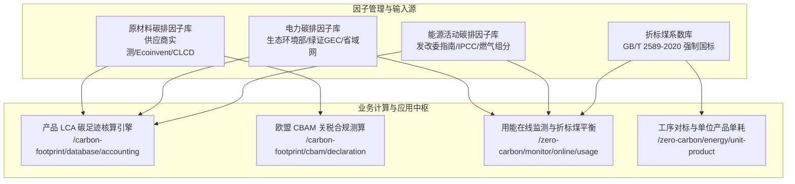

# 特变电工能碳数字化双中心 · 因子库与折标煤管理体系 · 全景功能需求规格说明书 (PRD)

> **受控编号**：`TBEA-PRD-FACTOR-MASTER-2026-V1.0`  
> **文档版本**：`v1.0.0 (全景施工发布基线版)`  
> **密级**：内部绝密 (L4 - Confidential / Top Secret)  
> **归属工程**：特变电工能碳数字化双中心（零碳园区集控中心 + 产品碳足迹集采中心）  
> **编写部门**：产品碳足迹与能碳系统联合项目组 (Product & Architecture Team)  
> **基准规范依赖**：`tbea-module-prd-template` (v1.0.0) × `tbea-industrial-design` (v1.0.0)  
> **发布日期**：2026-09-16  
> **状态**：`APPROVED & BASELINED` (四方联合审签通过，研发、交付与合规实施基准)

---

## 全局目录 (Table of Contents)

- [第1章 因子库与折标煤管理体系全局架构与元数据](#第1章-因子库与折标煤管理体系全局架构与元数据)
- [第2章 原材料碳排因子管理功能需求规格 (Raw Material Factor)](#第2章-原材料碳排因子管理功能需求规格-raw-material-factor)
- [第3章 电力碳排因子管理功能需求规格 (Power Factor)](#第3章-电力碳排因子管理功能需求规格-power-factor)
- [第4章 能源活动碳排因子管理功能需求规格 (Energy Activity Factor)](#第4章-能源活动碳排因子管理功能需求规格-energy-activity-factor)
- [第5章 折标煤系数库管理功能需求规格 (Standard Coal Conversion Library)](#第5章-折标煤系数库管理功能需求规格-standard-coal-conversion-library)
- [第6章 四大因子库统一错误码字典与异常治理规范](#第6章-四大因子库统一错误码字典与异常治理规范)

---

# 第1章 因子库与折标煤管理体系全局架构与元数据

## 1.1 因子库在双中心架构中的基石地位
特变电工能碳数字化双中心（零碳园区集控中心 + 产品碳足迹集采中心）的所有能耗折标、碳排滚算、产品生命周期评价（LCA）及欧盟 CBAM 关税申报，均强依赖于底层标准化因子的精度、时效性与版本不可篡改性。
本体系由四大核心基础库构成：
1. **原材料碳排因子库**：唯一具备全量维护、供应商一级实测入库、摇篮到大门工序拆解与一键回滚能力；
2. **电力碳排因子库**：覆盖全国 6 大区域电网、各省域基准电网因子与市场化绿电/自发自用绿电消纳净零认证；
3. **能源活动碳排因子库**：覆盖天然气、原煤、柴油、外购蒸汽与制冷剂等化石能源直接燃烧（Scope 1）与热力排放（Scope 2）；
4. **折标煤系数库**：依据国家标准 GB/T 2589-2020《综合能耗计算通则》，将各介质实物物理量统一转换为标准煤（tce / kgce）当量与等价基准。



---

# 第2章 原材料碳排因子管理功能需求规格 (Raw Material Factor)

## 【1】定位与架构角色
- **功能定位**：作为产品碳足迹全生命周期（LCA）核算与欧盟 CBAM 关税申报的核心物料数据基石，面向变压器与电线电缆两大产业核心主材，提供权威因子建库、当前值与默认值双轨对比、摇篮到大门（Cradle-to-Gate）工序构成拆解、版本不可变冻结与可信回滚体系。
- **承载角色**：P4 碳核算工程师（因子录入、版本维护与回滚）、P5 国际贸易与关税专家（CBAM 前驱物审核）、P6 外部独立审计机构（数据质量 DQR 审查）。
- **页面路由**：`/carbon-footprint/factor/material`（详情内页：`/carbon-footprint/factor/material/detail/:factorId`，版本历史：右侧抽屉）。
- **上游依赖**：供应商一级实测数据与碳足迹核查证明（CFV）、第三方商业数据库（Ecoinvent 3.10 / Sphera GaBi / CLCD）、国家发改委与生态环境部权威指导值。
- **下游输出**：产品实景 BOM 碳足迹核算工作台（原材料阶段排放量滚算）、欧盟 CBAM 关税申报（直接与间接嵌入排放测算）、ISO 14067 第三方认证材料申报包。
- **本文档定位**：本模块为产品碳足迹集采中心因子库中唯一的“全生命周期维护与版本控制”核心模块（电力、能源活动及折标煤因子为只读消费视图），严格对齐八段式完整度规范。

## 【2】业务场景与用户故事
- **业务场景描述**：在应对国际高标准绿色装备招标或欧盟 CBAM 碳关税时，碳核算工程师需将行业缺省因子替换为宝钢高牌号取向硅钢片、江西铜业低碳铜杆的供应商一级实测因子，以压降产品碳足迹并建立出海竞争力；当某批次实测数据出现争议时，支持平滑回滚至上一核准基准版本并保留全链审计留痕。
- **用户故事**：
  ```text
  As a 碳核算与认证工程师 (Persona P4)，
  I want 在原材料碳排因子库中按适用产业和产品套系检索物料，维护当前因子值、摇篮到大门工序构成与核查证明，并在升级版本时将原值自动沉淀为对比默认值，
  So that 我能在产品 LCA 核算中精准调用低碳主材实测因子降低核算碳排，同时保留完备的版本变更链条以通过第三方机构独立核验。
  ```

## 【3】功能规格与交互契约
- **通用交互与过滤规则**：
  - 顶部提供【适用产业】切片 Tab（全部 / 变压器产业 / 线缆产业 / 通用）；
  - 提供【产品套系联动切片器】（如选中“特高压 1000kV 变压器”自动关联取向硅钢、电解铜、环氧树脂、绝缘油等物料）；
  - 数据表格行高严格固定 **`44px`**（`h-[44px]`），垂直居中，数字列采用等宽 Mono 字体右对齐；激活态仅由边框高亮自解释呈现。
- **因子列表与当前/默认值双轨对比**：
  - 因子核心数值列复合展示：`当前值 / 默认值`（例如 `2.0500 / 2.1200`，单位 `kgCO2e/kg`），当前值加粗呈现，默认值（上一稳定基准版本值）以浅灰展示；
  - 五级客观来源徽章：`供应商实测 (Tier 1)`（绿色）、`第三方核证 (Certified)`（蓝色）、`行业标准 (Industry Avg)`（青色）、`公用数据库 (LCA DB)`（紫色）、`IPCC 缺省值 (Default)`（橙色）。
- **摇篮到大门工序构成拆解 (Cradle-to-Gate)**：
  - 点击行内【详情】滑出抽屉，呈现该物料五阶段碳排放绝对量与占比构成：①矿石开采与洗选 ➔ ②初级冶炼 ➔ ③电解精炼与电力 ➔ ④深加工成型 ➔ ⑤上游运输；提供条形堆叠图解析。
- **因子版本演化与一键回滚状态机**：
  - **版本升级**：输入新因子值、来源与凭证附件后，原当前值沉淀为新默认值，版本号按 `vX.Y` 单调递增；
  - **版本回滚**：在版本历史抽屉中点击【回滚至此版本】，系统生成新版本快照并注明“回滚自 vX.Y”，保障版本时间线单调递增，严禁物理抹除历史；
  - **引用加锁**：已被标记为 `LCA_CERTIFIED` 或 `CBAM_DECLARED` 报告引用的因子版本自动锁定（`is_immutable = true`），操作列【删除】置灰禁用。
- **因子跨层级应用口径矩阵**：
  - 一级节点（集团集控）：统管官方基础因子库，下发推荐优选供应商因子目录；
  - 二级节点（产业公司）：继承集团库，补充产业专属特种物料因子；
  - 三级节点（实体工厂）：依据实际采购批次优先选用合格供应商实测因子；
  - 四级节点（车间/产线）：BOM 依据物料编码自动带出对应因子版本，严禁车间手动修改。
- 📌 【业务约束与工程规范契约】：
  - 变压器专用特种电磁/绝缘材料与线缆专用绝缘护套材料在数据库与界面中严格物理隔离，禁止跨产业混选混用；
  - 系统严禁出现“高污染原料”、“表现优良”等主观定性评价，统一以客观基准偏差量与 DQR 数据质量分级呈现。

## 【4】页面字段字典与数据契约
| 序号 | 字段中文名称 | 数据类型 | 工程单位 | 校验与约束规则 |
| :---: | :--- | :---: | :---: | :--- |
| 1 | 因子唯一编码 | String | — | 唯一，格式 `RM<3位流水><2位校验码>` |
| 2 | 原材料标准名称 | String | — | 非空，最长 64 字符；与 ERP 物料分类名称标准对齐 |
| 3 | 适用产业分类 | Enum | — | 枚举：`变压器产业` / `线缆产业` / `通用` |
| 4 | 当前生效因子值 | Decimal | kgCO2e/kg | 严格 `> 0`；保留 4 位小数；LCA 核心计算参数 |
| 5 | 默认/基准因子值 | Decimal | kgCO2e/kg | 初始等于当前值；版本更新后自动沉淀为上一版本值 |
| 6 | 法定量纲单位 | String | kgCO2e/kg | 全系统强制统一为 `kgCO2e/kg`，严禁量纲混淆 |
| 7 | 数据来源层级 | Enum | — | 枚举：`供应商实测` / `第三方核证` / `行业标准` / `公用数据库` / `IPCC缺省值` |
| 8 | 提供方/数据库名称 | String | — | 如 `宝钢实测报告`、`Ecoinvent 3.10`、`CLCD` 等 |
| 9 | 系统边界定义 | String | — | 固定为 `摇篮到大门 (Cradle-to-Gate)` |
| 10 | 当前发布版本号 | String | — | 格式 `vX.Y`（如 `v3.2`），严格单调递增 |
| 11 | 数据质量评级 (DQR) | Decimal | — | `[1.00, 5.00]`，四维综合评分，数值越低代表质量越高 |
| 12 | 引用锁定防删标识 | Boolean | — | 被已生效报告引用后置为 `true`，前端禁用删除按钮 |

## 【5】核心数学模型与算法框架
📐 【核心业务数学模型与计算公式】

$$EF_{\text{mat}} = \sum_{k=1}^{m} \left( \frac{W_k}{\sum_{j=1}^{m} W_j} \times EF_k \right) \quad (\text{多供应商混料加权综合因子})$$

$$\Delta EF_{\text{pct}} = \frac{EF_{\text{current}} - EF_{\text{default}}}{EF_{\text{default}}} \times 100\% \quad (\text{因子版本变动偏离率})$$

$$DQR = \frac{TeR + GeR + TiR + ReR}{4} \quad (\text{数据质量四维综合评级})$$

$$C_{\text{material}} = \sum_{i=1}^{n} ( M_i \times EF_{\text{mat}, i} ) \quad (\text{产品原材料阶段总碳足迹})$$

- **变量定义与取值约定**：
  - $W_k$ 为向第 $k$ 家供应商采购该物料的实际重量（kg 或 t）；$EF_k$ 为对应供应商核证因子；
  - $TeR$（技术代表性）、$GeR$（地理代表性）、$TiR$（时间代表性）、$ReR$（可靠性）分别按 1~5 档评分；
  - **DQR 分级标准**：$DQR \le 1.6$ 判定为高质量（一级数据）；$1.6 < DQR \le 3.0$ 判定为中质量；$DQR > 3.0$ 判定为低质量并触发合规预警；
  - $\Delta EF_{\text{pct}}$ 为负值代表物料绿色低碳化升级，正值代表碳排放强度上升。

## 【6】展示、对标与判定口径
- **双轨口径**：因子列表常态展示当前值与默认值，默认值作为时序对标基准。
- **偏离口径**：$\Delta EF_{\text{pct}} \le -5.00\%$ 标记绿色优化箭头，$-5.00\% < \Delta EF_{\text{pct}} \le +5.00\%$ 标记灰色持平，$\Delta EF_{\text{pct}} > +5.00\%$ 标记黄色提示。
- **锁定口径**：凡被标记为 `LCA_CERTIFIED` 或 `CBAM_DECLARED` 报告所引用的因子版本强制锁定，仅允许通过发布新版本推进。
- **空值口径**：新建因子无历史基准时默认值显示 `--`；缺失实测值时强制匹配公用数据库缺省值，严禁显示 `0`。
- **溯源口径**：每个因子卡片与行内明确展示版本号、核验机构、有效截止期与操作员工号，保障审计双向追溯。

## 【7】边界条件、异常处理与防错规则
⚠️ 【研发设计红线与强约束校验】
- **除零安全防御**：多供应商加权核算中，当采购总重 $\sum W_j = 0$ 时，加权因子自动兜底采用国家标准缺省值，记录 `E_CALC_FACTOR_WEIGHT_ZERO_FALLBACK`，系统不出现 `NaN` 或白屏。
- **因子数值非正数强阻断**：录入因子必须满足 $EF_{\text{current}} > 0$，输入 $\le 0$ 时阻断提交并提示“因子数值必须严格大于0”，触发 `E_VAL_FACTOR_NON_POSITIVE`。
- **在用因子物理删除阻断**：已被认证报告引用的因子版本禁止执行物理删除，系统弹出强阻断提示并返回错误码 `E_FACTOR_IN_USE_DELETE_DENIED`。
- **版本号冲突阻断**：手动录入版本号若低于当前版本或与已有版本重复，系统阻断保存，触发 `E_FACTOR_VERSION_CONFLICT`。
- **RBAC 越权拦截**：仅 P4 角色具备因子新增、编辑与回滚权限，非授权角色操作返回 `HTTP 403`，触发 `E_AUTH_RBAC_FORBIDDEN`。
- **回滚必须留痕**：执行版本回滚必须填写不少于 10 个字符的业务原因说明，空理由禁止提交。

## 【8】QA 自动化验收准则（Gherkin BDD）
🧪 【QA 自动化验收准则 · Gherkin BDD 用例契约】

```gherkin
Feature: 原材料碳排因子全生命周期治理与版本控制
  Scenario: 供应商实测高保真因子新增与版本初始化
    Given P4 认证工程师登录并进入变压器产业原材料因子管理界面
    When 点击新建因子，录入名称 "高磁导取向硅钢片", 产业 "变压器产业", 因子值 1.9500, 单位 "kgCO2e/kg", 来源 "供应商实测", 提供方 "宝钢股份"
    Then 系统保存成功并生成唯一编码 RM 开头
    And 当前生效因子值显示为 1.9500
    And 默认值列自动初始化为 1.9500
    And 历史版本流水中自动写入版本号 "v1.0" 与操作人员工号

  Scenario: 被引用因子不可变性与删除强阻断防御
    Given 某原材料因子 "电解铜" (RM002, v3.2) 已被型号 "SZ11-50000/110" 的已归档 LCA 报告引用
    When 用户在列表操作列尝试点击 "删除" 按钮
    Then "删除" 按钮处于置灰禁用状态并悬停提示 "该因子已被生效报告引用，禁止删除"
    And 后台 API 拦截该 DELETE 请求并返回错误码 E_FACTOR_IN_USE_DELETE_DENIED
    And 数据库中该行数据保持完整未受破坏

  Scenario: 因子版本一键回滚与默认值重置流水断言
    Given 原材料因子 "电工铝锭" 当前版本为 "v2.6", 因子值为 8.1000, 历史存在版本 "v2.5" (因子值 7.8000)
    When 用户在版本抽屉中选中 "v2.5" 并点击 "回滚至此版本", 填写理由 "有色协会数据复测更正说明"
    Then 因子当前生效值更新为 7.8000
    And 默认值列自动变更为回滚前的当前值 8.1000
    And 系统生成新版本节点 "v3.0 (回滚自 v2.5)"
    And 审计日志表中新增一条操作类型为 "因子版本回滚" 的留痕记录

  Scenario: 极限数值除零防御与非法输入拦截
    Given 用户在录入界面将因子值输入为 "0" 或 "-1.25"
    When 用户点击确认提交表单
    Then 输入框下方立即出现红色校验告警 "因子数值必须严格大于0"
    And 提交按钮被禁用，阻断表单向后端发起无效请求
    And 系统不产生任何前端脚本崩溃或未捕获异常
```

---

# 第3章 电力碳排因子管理功能需求规格 (Power Factor)

## 【1】定位与架构角色
- **功能定位**：作为全集团范围二（Scope 2）外购电力间接温室气体排放核算、车间工序分时用电碳排分析与市场化绿电消纳抵扣的核心参数库，实现国家级、区域电网级、省域电网级以及特定清洁电源级因子的统一纳管与版本同步。
- **承载角色**：P1 集团决策层（只读查验全网平均因子）、P2 园区能碳专员（属地电网因子匹配）、P4 碳核算工程师（绿电消纳核准与证书冲抵）。
- **页面路由**：`/carbon-footprint/factor/power`（集采中心消费视图）与 `/zero-carbon/config/factor/power`（集控中心管理视图）。
- **上游依赖**：生态环境部与国家统计局年度《中国区域电网基准线排放因子》公开发布版、北京电力交易中心与广州电力交易中心绿证（GEC）划转核销记录。
- **下游输出**：用能在线监测（`/zero-carbon/monitor/online/usage`，日/月电力间接碳排计算）、工业微电网监测（`/zero-carbon/monitor/online/microgrid`，自发自用光伏消纳减碳量核算）、产品 LCA 生产制造阶段电力间接排放分摊。
- **本文档定位**：本模块在集采中心展现为只读视图，在集控中心基础管理提供维护支持，严格遵循八段式完整度。

## 【2】业务场景与用户故事
- **业务场景描述**：特变电工在全国拥有 15 大现代化产业园区，分布于新疆（西北电网）、天津/北京（华北电网）、上海（华东电网）、湖南（华中电网）、辽宁（东北电网）与广东（南方电网）。不同属地电网因能源结构差异，电力排放因子相差显著（从华东 0.5257 到西北 0.6127 kgCO2e/kWh）；同时各厂区大力消纳屋顶光伏与直购绿电。系统需根据生产工厂的属地电网与绿电交易凭证精准匹配电力碳排因子。
- **用户故事**：
  ```text
  As a 园区能碳专员 (Persona P2)，
  I want 按照工厂属地省份与区域电网检索生效的电力碳排因子，并查看常规市电、自发自用光伏与绿电交易的对应因子值，
  So that 我能准确核算车间及全厂外购电力的真实 Scope 2 间接排放，并在核销绿电后合规享受零碳排放核减。
  ```

## 【3】功能规格与交互契约
- **多维组合筛选与视图组织**：
  - 顶部提供【区域电网】切片（`华北` / `华东` / `华中` / `东北` / `西北` / `南方` / `全国统一`）；
  - 提供【省份下钻】下拉选框（北京、天津、上海、湖南、辽宁、新疆、山东、四川、广东等）；
  - 提供【电力来源】过滤（`电网平均` / `燃煤自备电厂` / `光伏发电` / `风力发电` / `水力发电` / `绿电（市场化交易）`）；
  - 表格每一行高固定 **`44px`**（`h-[44px]`），垂直居中，数字列 Mono 等宽右对齐。
- **电网因子当前值与默认值对照**：
  - 因子值列统一以 `当前值 / 默认值` 显示（如新疆电网平均当前值 `0.6127` / 默认值 `0.6200 kgCO2e/kWh`）；
  - 绿电（市场化交易）经过权威核销后，其因子显示为 `0.0000 kgCO2e/kWh`，并打上实心绿底 `Zero-Emission` 徽章。
- **年度电网因子版本快照机制**：
  - 当生态环境部发布新年度全国及区域电网因子时，系统建立新年度版本（如 `v2024.1`），历史年度版本（`v2023.1`）自动固化为冻结归档态，仅供追溯历史财务年份数据。
- 📌 【业务约束与工程规范契约】：
  - **绿电唯一性核销契约**：直购绿电或绿色电力证书（GEC）在冲抵电力碳排时，必须具有国家可再生能源信息管理中心的唯一证书编号，严禁“一证多抵”；
  - **自备电厂独立口径**：园区内部拥有燃煤自备电厂的实体单位（如天池能源），其自备发电必须采用机组实测供电碳排放强度（如 0.8320 kgCO2e/kWh），严禁套用外部公用电网均值掩盖自身排放。

## 【4】页面字段字典与数据契约
| 序号 | 字段中文名称 | 数据类型 | 工程单位 | 校验与约束规则 |
| :---: | :--- | :---: | :---: | :--- |
| 1 | 电力因子唯一编码 | String | — | 唯一，格式 `PW<3位流水><2位校验码>` |
| 2 | 所属行政省份 | String | — | 涵盖集团各厂区属地，如 `新疆`、`湖南`、`辽宁` 等 |
| 3 | 所属区域电网 | Enum | — | 枚举：华北 / 华东 / 华中 / 东北 / 西北 / 南方区域电网 |
| 4 | 电力来源类别 | Enum | — | 电网平均 / 燃煤自备电厂 / 光伏发电 / 风力发电 / 水力发电 / 市场化绿电 |
| 5 | 当前生效因子值 | Decimal | kgCO2e/kWh | `>= 0`；绿电核销后为 0.0000；常规电网取值区间 `[0.3000, 1.2000]` |
| 6 | 默认/基准因子值 | Decimal | kgCO2e/kWh | 取上一年度生态环境部发布的官方基准因子值 |
| 7 | 法定量纲单位 | String | kgCO2e/kWh | 统一为 `kgCO2e/kWh`，禁止混入 MWh 或度 |
| 8 | 来源发布机构 | String | — | 如 `生态环境部`、`省级生态环境厅`、`国家电力调度中心` |
| 9 | 适用发布年度版本 | String | — | 格式 `v<年>.<版本>`（如 `v2024.1`） |
| 10 | 是否属于零碳绿电 | Boolean | — | `true` 为可再生能源/市场化核销绿电，`false` 为化石市电 |

## 【5】核心数学模型与算法框架
📐 【核心业务数学模型与计算公式】

$$EF_{\text{grid\_composite}} = \frac{\sum_{i=1}^{p} ( Q_{\text{purchased}, i} \times EF_{\text{grid}, i} )}{\sum_{i=1}^{p} Q_{\text{purchased}, i}} \quad (\text{全集团购网电力综合加权因子})$$

$$C_{\text{Scope2, elec}} = ( Q_{\text{grid\_total}} - Q_{\text{green\_verified}} ) \times EF_{\text{grid}} + Q_{\text{green\_verified}} \times 0 \quad (\text{电力间接排放净额})$$

$$R_{\text{green\_power}} = \frac{Q_{\text{pv\_self}} + Q_{\text{green\_market}}}{Q_{\text{grid\_total}} + Q_{\text{pv\_self}}} \times 100\% \quad (\text{绿电综合消纳占比})$$

- **变量定义与取值约定**：
  - $Q_{\text{purchased}, i}$：第 $i$ 个园区购入市电量（kWh）；
  - $EF_{\text{grid}, i}$：第 $i$ 个园区所在地电网排放因子（kgCO2e/kWh）；
  - $Q_{\text{green\_verified}}$：取得官方核销绿证对应的结算电量（kWh）；
  - 严禁出现负碳计算：当 $Q_{\text{green\_verified}} > Q_{\text{grid\_total}}$ 时，$C_{\text{Scope2, elec}}$ 兜底锁定为 `0.00`，不得产生“负碳抵消外部化石燃料”。

## 【6】展示、对标与判定口径
- **分级对标口径**：各园区电力排放因子常态与全国平均电网因子（全国基准线 0.5703）横向对齐；
- **消纳认定口径**：厂房屋顶分布式光伏自发自用电量，因子按 `0.0000 kgCO2e/kWh` 认定，全生命周期 LCA 制造端分摊按 `0.0480 kgCO2e/kWh` 认定；
- **空值口径**：对于未联网的小微测点，因子默认继承所在地所属省级电网平均因子，严禁显示 `--` 导致计算中断。

## 【7】边界条件、异常处理与防错规则
⚠️ 【研发设计红线与强约束校验】
- **历史关账月度强冻结**：已完成财务锁账的月份，其核算所引用的电力因子版本自动固化，即便后续生态环境部补丁修正因子，历史月份禁止自动刷新，触发 `E_SYS_FACTOR_LOCKED_HISTORIC`；
- **绿电超量抵扣截断**：绿电核销申报量大于用电总量时，系统自动截断至总用电量，溢出部分自动流转至下一统计周期，记录告警 `E_CALC_GREEN_OFFSET_OVERFLOW`；
- **自备电厂实测脱失拦截**：自备电厂当月未上传连续在线监测（CEMS）烟气实测值时，系统阻断其提交“超低因子”，强制采用燃煤发电机组上限值 0.8320 kgCO2e/kWh，抛出 `E_VAL_CEMS_OFFLINE_PENALTY`。

## 【8】QA 自动化验收准则（Gherkin BDD）
🧪 【QA 自动化验收准则 · Gherkin BDD 用例契约】

```gherkin
Feature: 电力碳排因子多电网匹配与绿电核销
  Scenario: 跨省多园区属地电网因子精准匹配
    Given 新疆变压器厂位于乌鲁木齐，上海销售技术中心位于上海闵行
    When 系统分别抓取两地当月市电消耗的计算因子
    Then 新疆园区自动匹配西北电网因子 0.6127 kgCO2e/kWh
    And 上海中心自动匹配华东电网因子 0.5257 kgCO2e/kWh
    And 系统不产生跨电网串用

  Scenario: 市场化绿电凭证冲抵归零断言
    Given 某车间当月市电消耗 100,000 kWh, 录入合规核销绿电凭证 40,000 kWh
    When 系统计算该车间当月外购电力 Scope 2 间接排放
    Then 40,000 kWh 绿电部分按 0.0000 kgCO2e/kWh 核算
    And 剩余 60,000 kWh 按属地电网因子核算
    And 总电力排放精准等于 60,000 × EF_grid
```

---

# 第4章 能源活动碳排因子管理功能需求规格 (Energy Activity Factor)

## 【1】定位与架构角色
- **功能定位**：作为全集团范围一（Scope 1）化石燃料直接燃烧温室气体排放及外购热力蒸汽排放的核算参数中枢，管理化石燃料（天然气、柴油、汽油、原煤、液化石油气）、外购工业蒸汽以及设备逸散制冷剂（如 R134a、R410A）的核心排放参数。
- **承载角色**：P2 园区能碳专员（燃料消耗录入与检验单上传）、P4 碳核算工程师（因子基线核准与低位发热量实测修正）。
- **页面路由**：`/carbon-footprint/factor/energy` 与 `/zero-carbon/config/factor/energy`。
- **上游依赖**：燃气公司管道天然气月度化验单、燃料供应商采购发票与质检报告、国家发展改革委《企业温室气体排放核算方法与报告指南》、IPCC 国家温室气体清单指南。
- **下游输出**：用能在线监测（`/zero-carbon/monitor/online/usage`，直接碳排放核算）、综合能源平衡分析（`/zero-carbon/energy/structure`，折标与碳排映射）、产品 LCA 生产制造阶段天然气与柴油排放分摊。
- **本文档定位**：支撑集团范围一直接排放与外购热力核算的统一参数库，严格遵循八段式完整度。

## 【2】业务场景与用户故事
- **业务场景描述**：特变电工大型变压器绝缘干燥车间配有大型燃气热风炉与煤油气相干燥罐，线缆拉丝车间退火炉常年消耗管道天然气；厂区物流叉车与应急柴油发电机定期消耗轻柴油；高压试验室大型空调系统存在微量制冷剂逸散。上述能源活动的物理消耗量必须精准乘以对应能源活动碳排因子，转化为二氧化碳当量（tCO2e）。
- **用户故事**：
  ```text
  As a 园区能碳专员 (Persona P2)，
  I want 在能源活动碳排因子库中查看各类燃料的标准因子值，并能根据天然气每月化验单录入低位热值与含碳量以动态刷新实测因子，
  So that 我能依据精准的燃料特性核算车间工业炉窑的直接燃烧碳排放，避免采用保守缺省值虚增企业碳排。
  ```

## 【3】功能规格与交互契约
- **分类导航与界面排版**：
  - 顶部提供【能源活动类别】切片（`全部` / `化石燃料` / `热力/蒸汽` / `制冷剂` / `其他`）；
  - 数据表格行高严格锁定 **`44px`**（`h-[44px]`），垂直居中，数字列 Mono 等宽右对齐；
  - 因子值列复合呈现：`当前生效值 / 默认缺省值`（例如天然气 `2.1622 / 2.1800 kgCO2e/m³`，柴油 `3.0959 / 3.1200 kgCO2e/kg`）。
- **三参数三层级透明穿透展示**：
  - 点击化石燃料因子行展开，展示底层三大核算参数：
    1. **低位发热量 (NCV)**：如天然气标况 `38.931 MJ/m³`；
    2. **单位热值含碳量 (CC)**：如天然气 `15.32 tC/TJ`；
    3. **碳氧化率 (OF)**：如工业炉天然气燃烧 `99.0%`；
  - 清晰标注该因子是采用国家指南缺省值，还是基于燃气化验单的实测修正值。
- **外购工业蒸汽因子温压解耦与热焓计算**：
  - 外购蒸汽因子支持根据蒸汽供汽类型（低压饱和蒸汽 / 过热蒸汽）与表压（MPa）、温度（°C）自动从国际水蒸气热焓表（IAPWS-IF97）插值匹配比焓值，计算专属排放因子（如 `0.1100 kgCO2e/MJ` 或 `276.5 kgCO2e/t`）。
- 📌 【业务约束与工程规范契约】：
  - **客观中立原则**：严禁在燃煤或重油因子卡片标注“劣质燃料”或“污染严重”等情绪化词汇，仅如实标注热值与单位含碳量；
  - **制冷剂逸散全球变暖潜能值 (GWP) 强制锚定 IPCC 第五次评估报告 (AR5)**，R134a 强制锁定为 1430，严禁任意篡改。

## 【4】页面字段字典与数据契约
| 序号 | 字段中文名称 | 数据类型 | 工程单位 | 校验与约束规则 |
| :---: | :--- | :---: | :---: | :--- |
| 1 | 能源活动因子编码 | String | — | 唯一，格式 `EA<3位流水><2位校验码>` |
| 2 | 能源活动/燃料名称 | String | — | 如 `管道天然气`、`轻柴油`、`原煤(烟煤)`、`外购蒸汽` |
| 3 | 能源大类归属 | Enum | — | 化石燃料 / 热力/蒸汽 / 制冷剂 / 其他 |
| 4 | 当前生效因子值 | Decimal | 实物单位 | 严格 `> 0`；天然气为 `kgCO2e/m³`，燃料油为 `kgCO2e/kg`，蒸汽为 `kgCO2e/MJ` |
| 5 | 默认/缺省因子值 | Decimal | 实物单位 | 国家发改委核算指南推荐缺省值 |
| 6 | 低位发热量 (NCV) | Decimal | MJ/kg 或 MJ/m³ | 严格 `> 0`；按实测或国标录入 |
| 7 | 单位热值含碳量 (CC)| Decimal | tC/TJ | 严格 `> 0`；碳核算关键中间参数 |
| 8 | 碳氧化率 (OF) | Decimal | % | 取值区间 `[90.0, 100.0]`，炉窑燃烧效率 |
| 9 | 制冷剂潜能值 (GWP) | Integer | — | 仅制冷剂类型有效，如 R134a 锁定为 1430 |
| 10 | 因子版本发布代号 | String | — | 格式 `v<年份>.<流水>`（如 `v2023.2`） |

## 【5】核心数学模型与算法框架
📐 【核心业务数学模型与计算公式】

$$EF_{\text{fossil}} = \text{NCV} \times \text{CC} \times \text{OF} \times \frac{44}{12} \times 10^{-3} \quad (\text{化石燃料直接燃烧排放因子})$$

$$EF_{\text{steam}} = \frac{h_{\text{steam}} - h_{\text{water}}}{\eta_{\text{boiler}}} \times EF_{\text{fuel}} \quad (\text{外购工业蒸汽折算因子})$$

$$C_{\text{Scope1, total}} = \sum_{j=1}^{k} \left( Q_{\text{fuel}, j} \times EF_{\text{fossil}, j} \right) + \sum_{m=1}^{r} \left( L_{\text{refrig}, m} \times \text{GWP}_m \right) \quad (\text{范围一直接排放量})$$

- **变量定义与取值约定**：
  - $\text{NCV}$：平均低位发热量（固体/液体为 $\text{kJ/kg}$，气体为 $\text{kJ/m}^3$）；
  - $\text{CC}$：单位热值含碳量（$\text{tC/TJ}$）；
  - $\text{OF}$：碳氧化率（百分比）；
  - $44/12$：二氧化碳与碳的分子量比率（约等于 $3.6667$）；
  - $h_{\text{steam}}$：蒸汽供汽比焓（$\text{kJ/kg}$）；$h_{\text{water}}$：锅炉给水温度比焓（$\text{kJ/kg}$）；$\eta_{\text{boiler}}$：供热锅炉综合热效率（系统缺省取 $80.0\%$）。

## 【6】展示、对标与判定口径
- **双轨展示**：因子卡片明确标注实测值与发改委缺省值对比；
- **温室气体折算口径**：所有能源活动排放结果统一以二氧化碳当量（$\text{tCO}_2\text{e}$）汇总，非二氧化碳温室气体（如甲烷 $\text{CH}_4$、氧化亚氮 $\text{N}_2\text{O}$）已按 GWP 统一折算入综合因子中；
- **空值口径**：任何车间新增特种燃气或工业副产气未录入实测热值时，系统强制回退采用通用化石燃料上限缺省值，严禁空值运行。

## 【7】边界条件、异常处理与防错规则
⚠️ 【研发设计红线与强约束校验】
- **发热量非物理极值拦截**：低位发热量输入超过热力学物理极限（如天然气输入 $> 50 \text{ MJ/m}^3$）时，系统强阻断保存，抛出 `E_VAL_NCV_OUT_OF_PHYSICAL_RANGE`；
- **碳氧化率非法越界阻断**：碳氧化率输入必须在 `[90.0%, 100.0%]` 之间，大于 100% 阻断提交，记录 `E_VAL_OF_RATE_INVALID`；
- **蒸汽热焓查表失效兜底**：当输入表压与温度在 IAPWS 饱和区外时，系统自动使用经验线性插值计算，并弹出黄色非标提示，避免算式除零崩溃。

## 【8】QA 自动化验收准则（Gherkin BDD）
🧪 【QA 自动化验收准则 · Gherkin BDD 用例契约】

```gherkin
Feature: 能源活动与化石燃料碳排因子核算验证
  Scenario: 天然气三参数动态计算排放因子精度
    Given 天然气实测低位热值 NCV 为 38.931 MJ/m³, 单位热值含碳量 CC 为 15.32 tC/TJ, 碳氧化率 OF 为 99.0%
    When 碳核算引擎计算其综合二氧化碳排放因子
    Then 计算出的因子值精确等于 2.1622 kgCO2e/m³ (容差 <= 0.0001)
    And 界面因子当前值同步更新并标注为实测修正源

  Scenario: 碳氧化率越界与极端物理量防御
    Given 用户在录入柴油因子时，误将碳氧化率输入为 105.0%
    When 用户点击确认提交保存
    Then 表单标红提示 "碳氧化率不得超过100.0%"
    And 提交动作被底层安全校验直接拦截
    And 数据库不写入任何脏数据
```

---

# 第5章 折标煤系数库管理功能需求规格 (Standard Coal Conversion Library)

## 【1】定位与架构角色
- **功能定位**：严格依据国家标准 **GB/T 2589-2020《综合能耗计算通则》**，构建全集团各类能源介质（电力、天然气、原煤、柴油、汽油、外购蒸汽、新鲜水、氮气、压缩空气等）实物计量单位向“千克标准煤 (kgce)”与“吨标准煤 (tce)”转换的法定换算中枢。
- **承载角色**：P1 集团决策层（集团综合能效核准）、P2 园区能碳专员（车间折标能耗统计）、PM 业务总监（指标考核基准锁定）。
- **页面路由**：`/carbon-footprint/factor/coal` 与 `/zero-carbon/config/factor/coal`。
- **上游依赖**：国家标准化管理委员会强制性国标 GB/T 2589-2020 附录 A、工业锅炉蒸汽供热协议、重点用能单位耗能工质折算通则。
- **下游输出**：用能在线监测（全厂综合能耗统计）、能耗能效分析（单位产值综合能耗、单位产品综合单耗对标）、统计报表（能源购销存与综合能耗平衡报表）。
- **本文档定位**：支撑全平台所有“吨标煤 (tce)”相关 KPI 运算的核心底层标准库，严格遵循八段式完整度。

## 【2】业务场景与用户故事
- **业务场景描述**：特变电工在统计全厂能源消费时，面临电（kWh）、气（m³）、煤（kg）、水（t）、汽（MJ/t）量纲不统一的现实问题，无法直接累加。必须通过折标煤系数库将各介质实物消费量换算为标准煤（当量热值 $29,307.6 \text{ kJ/kgce}$），以此核算全集团、各园区及关键工序的综合能源消费总量与万元产值能耗指标。
- **用户故事**：
  ```text
  As a 园区能碳专员 (Persona P2)，
  I want 按照法定国标查验电力、天然气、外购蒸汽等各类能源介质的折标煤系数及低位发热量，
  So that 我能依据国家标准精准核算车间及全厂的综合能源消费量 (tce)，确保对标管理与政府能效报送口径 100% 合规。
  ```

## 【3】功能规格与交互契约
- **界面结构与国标展示**：
  - 列表清晰展示能源品种、折标系数（`kgce/实物单位`）、低位热值基准（MJ/实物单位）、数据来源及版本依据；
  - 表格行高严格固定 **`44px`**（`h-[44px]`），垂直居中，数字列 Mono 等宽右对齐；
  - 界面顶部常态置顶展示国标基准徽章：`GB/T 2589-2020 强制性国家标准`。
- **双口径折标系数透明并存**：
  - **当量值折标 (Equivalent)**：电力固定为 `0.1229 kgce/kWh`（理论热值折算）；
  - **等价热值折标 (Primary Energy Equiv)**：根据年度供电煤耗动态配置（如国家统计局公布的火电供电平均煤耗约 `0.2850 kgce/kWh`），支持双模式切换展示与报表生成。
- **耗能工质综合转换矩阵**：
  - 不仅涵盖一次能源与二次能源，全量集成耗能工质折标系数：工业新鲜水（$0.0857 \text{ kgce/t}$）、软化水（$0.4857 \text{ kgce/t}$）、压缩空气（$0.0400 \text{ kgce/m}^3$）、高纯液氮（$0.6714 \text{ kgce/m}^3$）。
- 📌 【业务约束与工程规范契约】：
  - **国标常量强制只读防篡改**：电力当量值 0.1229、天然气 1.2143 等法定标准常数被系统加锁锁定，除国家发布新修订标准外，任何用户（包括超级管理员）禁止随意在线修改系数；
  - **分母为零安全兜底**：当基于折标煤计算单位产品单耗时，产量或产值为 0 必须安全输出 `--`，严禁抛出异常。

## 【4】页面字段字典与数据契约
| 序号 | 字段中文名称 | 数据类型 | 工程单位 | 校验与约束规则 |
| :---: | :--- | :---: | :---: | :--- |
| 1 | 折标系数唯一编码 | String | — | 唯一，格式 `CC<3位流水><2位校验码>` |
| 2 | 能源品种/工质名称 | String | — | 如 `电力`、`天然气`、`原煤`、`柴油`、`外购蒸汽`、`新鲜水` |
| 3 | 当量折标煤系数 | Decimal | kgce/实物单位 | 严格依据 GB/T 2589-2020；电力为 0.1229，天然气为 1.2143 |
| 4 | 等价折标煤系数 | Decimal | kgce/实物单位 | 供电煤耗等价值，按年度发布 |
| 5 | 基准低位发热量 | Decimal | MJ/实物单位 | 天然气标况 35.588，标准煤理论 29.3076 |
| 6 | 引用国标标准代号 | String | — | 固定为 `GB/T 2589-2020` |
| 7 | 是否为法定耗能工质 | Boolean | — | `true` 为新鲜水/软水/氮气/压缩空气，`false` 为常规能源 |
| 8 | 当前启用状态 | Enum | — | 枚举：`启用` / `停用` |

## 【5】核心数学模型与算法框架
📐 【核心业务数学模型与计算公式】

$$E_{\text{tce}} = \sum_{i=1}^{n} \frac{E_i \times k_i}{1000} \quad (\text{全厂综合能耗折标煤总量，单位: tce})$$

$$k_i = \frac{\text{NCV}_i}{29307.6 \text{ kJ/kgce}} \quad (\text{理论低位发热量换算折标系数公式})$$

$$e_{\text{output\_val}} = \begin{cases} \frac{E_{\text{tce}}}{G_{\text{output}} / 10000}, & G_{\text{output}} > 0 \\ \text{兜底: "--"}, & G_{\text{output}} = 0 \end{cases} \quad (\text{万元产值综合能耗，单位: tce/万元})$$

- **变量定义与取值约定**：
  - $E_i$：第 $i$ 种能源实物消费量（如 kWh, m³, kg, t）；
  - $k_i$：第 $i$ 种能源对应的国家标准折标煤系数（$\text{kgce/实物单位}$）；
  - $1000$：千克标准煤与吨标准煤进位制（$1 \text{ tce} = 1000 \text{ kgce}$）；
  - $G_{\text{output}}$：工业产值（元），分母为 0 时安全兜底显示 `--`。

## 【6】展示、对标与判定口径
- **统一当量展示**：系统全景图表默认均采用“当量热值”折标计算，报表导出提供“当量/等价”双列切换；
- **精度口径**：$\text{tce}$ 保留 4 位小数，$\text{kgce}$ 保留 2 位小数；
- **空值口径**：若工厂当期某能源消费为 0，折标煤量如实显示 `0.0000 tce`；若仪表断网未上报，统一显示 `--`，严禁将断网视为 0 能耗。

## 【7】边界条件、异常处理与防错规则
⚠️ 【研发设计红线与强约束校验】
- **单耗计算除零软拦截**：产值或产品产量为 0 时，折标单耗严禁除零崩溃，必须安全返回 `--`，抛出软告警 `E_CALC_UNIT_DIV_ZERO_SOFT`；
- **国标核心字段修改阻断**：任何角色在线编辑电力（0.1229）、天然气（1.2143）系数时，系统弹出阻断并提示“GB/T 2589-2020 强制国标受控字段不可在线直接编辑”，触发 `E_SYS_GB_STD_IMMUTABLE`；
- **实物物理量负数校验**：能耗实物量输入 $< 0$ 时拦截保存，触发 `E_VAL_ENERGY_USAGE_NEGATIVE`。

## 【8】QA 自动化验收准则（Gherkin BDD）
🧪 【QA 自动化验收准则 · Gherkin BDD 用例契约】

```gherkin
Feature: GB/T 2589-2020 折标煤模型与除零防御
  Scenario: 全介质实物量转标煤计算精度验证
    Given 某车间月度消耗电力 10,000 kWh, 天然气 1,000 m³, 工业新鲜水 500 t
    When 系统调用折标煤系数库执行综合能耗核算
    Then 电力折标煤量精确等于 1.2290 tce
    And 天然气折标煤量精确等于 1.2143 tce
    And 新鲜水工质折算量精确等于 0.0429 tce
    And 车间总综合能耗精确等于 2.4862 tce (容差 <= 0.0001)

  Scenario: 万元产值能耗除零极限边界防御
    Given 某新建车间当月综合能耗为 5.5000 tce，但产值报工为 0 元
    When 系统渲染该车间万元产值综合能耗指标
    Then 页面安全展示为 "--"
    And 系统不出现 NaN、Infinity 或前端崩溃异常
    And 后台记录软处理告警 E_CALC_UNIT_DIV_ZERO_SOFT
```

---

# 第6章 四大因子库统一错误码字典与异常治理规范

| 错误代码 (Error Code) | 错误级别 | 归属模块 | 触发业务场景与边界 | 前端用户呈现与交互动作 |
| :--- | :---: | :---: | :--- | :--- |
| `E_VAL_FACTOR_NON_POSITIVE` | 严重阻断 | 原材料/化石 | 输入因子值小于或等于 0 | 输入框标红提示“因子数值必须严格大于0”，禁用提交按钮 |
| `E_FACTOR_IN_USE_DELETE_DENIED`| 业务拦截 | 原材料因子 | 尝试删除已被认证报告引用的因子版本 | 弹出阻断警示弹窗，提示具体被引用的报告编号，置灰删除按钮 |
| `E_FACTOR_VERSION_CONFLICT` | 逻辑冲突 | 全因子库 | 版本号未递增或与历史版本号重复 | 提示“版本号必须单调递增（如从v3.1到v3.2）”，阻止保存 |
| `E_CALC_FACTOR_WEIGHT_ZERO_FALLBACK`| 容错兜底 | 原材料因子 | 多供应商加权采购总重为 0 | 自动回退采用国家标准缺省值，并在计算明细中予以标注 |
| `E_SYS_FACTOR_LOCKED_HISTORIC` | 安全阻断 | 电力/化石 | 尝试重算或修改已财务锁账月份的因子 | 提示“已关账月份数据已固化，禁止修改”，返回 403 阻断 |
| `E_CALC_GREEN_OFFSET_OVERFLOW` | 业务预警 | 电力碳排 | 绿电核销申报量超过实际购电用电总量 | 自动截断至总用电量，提示“超出绿电量已结转至下月” |
| `E_VAL_CEMS_OFFLINE_PENALTY` | 惩治兜底 | 自备电厂 | 燃煤自备电厂烟气监测脱网缺失实测值 | 强制采用高阶惩罚性缺省因子（0.8320），并高亮标黄预警 |
| `E_VAL_NCV_OUT_OF_PHYSICAL_RANGE`| 科学阻断 | 能源活动 | 燃料低位发热量输入超出物理极值 | 提示“发热量超出物理极限范围，请重新校对化验单” |
| `E_SYS_GB_STD_IMMUTABLE` | 权限锁死 | 折标煤库 | 尝试在线覆盖 GB/T 2589-2020 国标常量 | 强行锁定保存按钮，提示“国标受控常量仅允许通过版本补丁升级” |
| `E_CALC_UNIT_DIV_ZERO_SOFT` | 柔性容错 | 全系统单耗 | 产量、产值或电量分母为 0 时计算单耗 | 前端安全显示 `--`，底层静默记入系统计算日志，杜绝白屏崩溃 |

---

# 第7章 电装统一维护计算系数与因子基准表（2026 官方权威纳管清单）

依照特变电工（电装）最新统一管控规范，全平台因子库正式纳管以下 13 项核心计算系数与基准因子。系统采用“如有重复则去重合并、无则扩充入库”原则，全面纳管至测点点表与后台核算引擎中：

| 序号 | 因子 / 参数名称 | 属性分类 | 业务口径与计算说明 | 计量单位 | 维护主体 | 维护方式 | 复核频次 | 适用范围 | 纳管状态 / 测点Tag |
| :---: | :--- | :---: | :--- | :---: | :---: | :---: | :---: | :---: | :--- |
| 1 | **电力折标准煤系数（当量值）** | 计算系数 | 电力按当量值折算标准煤的系数，用于综合能源消费量计算 (0.1229 kgce/kWh) | `kgce/kWh` | 电装统一维护 | 系统维护 | 年度复核 | 电装 | **去重保留** (`BASE_FACTOR_ELEC_EQUIVALENT`) |
| 2 | **电力折标准煤系数（等价值）** | 计算系数 | 电力按等价值折算标准煤的系数；优先使用所在省平均发电煤耗，无法获取时取 0.2856 | `kgce/kWh` | 电装统一维护 | 系统维护 | 年度复核 | 电装 | **去重保留** (`BASE_FACTOR_ELEC_EQUAL_VALUE`) |
| 3 | **天然气折标准煤系数** | 计算系数 | 天然气折算标准煤系数 (1.2143 kgce/m³) | `kgce/m³` | 电装统一维护 | 系统维护 | 年度复核 | 电装 | **去重保留** (`BASE_FACTOR_NATURAL_GAS`) |
| 4 | **蒸汽折标准煤系数** | 计算系数 | 蒸汽按热焓折算标准煤的系数（随蒸汽压力 / 温度变化，如饱和蒸汽 94.1 kgce/t，过热蒸汽 104.1 kgce/t） | `kgce/t` | 电装统一维护 | 系统维护 | 年度复核 | 电装 | **去重保留** (`BASE_FACTOR_STEAM`，单位规范为 kgce/t) |
| 5 | **热力折标准煤系数** | 计算系数 | 热力折算标准煤系数 (34.12 kgce/GJ，基于 0.03412 kgce/MJ 折算) | `kgce/GJ` | 电装统一维护 | 系统维护 | 年度复核 | 电装 | **✨ 全新纳管** (`BASE_FACTOR_HEAT_COAL`) |
| 6 | **柴油折标准煤系数** | 计算系数 | 柴油折算标准煤系数 (1.4571 kgce/kg) | `kgce/kg` | 电装统一维护 | 系统维护 | 年度复核 | 电装 | **去重保留** (`BASE_FACTOR_DIESEL`) |
| 7 | **汽油折标准煤系数** | 计算系数 | 汽油折算标准煤系数 (GB/T 2589 规定基准 1.4714 kgce/kg) | `kgce/kg` | 电装统一维护 | 系统维护 | 年度复核 | 电装 | **✨ 全新纳管** (`BASE_FACTOR_GASOLINE_COAL`) |
| 8 | **煤油折标准煤系数** | 计算系数 | 煤油折算标准煤系数 (GB/T 2589 规定基准 1.4714 kgce/kg，相变干燥溶剂耗损) | `kgce/kg` | 电装统一维护 | 系统维护 | 年度复核 | 电装 | **✨ 全新纳管** (`BASE_FACTOR_KEROSENE_COAL`) |
| 9 | **电力二氧化碳排放因子** | 计算系数 | 省级电网平均二氧化碳排放因子，用于购入电力碳排放核算 (全国均值 0.5703 tCO2/MWh) | `tCO2/MWh` | 电装统一维护 | 系统维护 | 年度复核 | 电装 | **去重保留** (`BASE_FACTOR_GRID_EMISSION_NAT`) |
| 10 | **化石燃料单位热值含碳量** | 计算系数 | 各化石燃料的单位热值含碳量，用于燃烧排放核算 (如天然气 15.32 tC/TJ) | `tC/GJ` | 电装统一维护 | 系统维护 | 年度复核 | 电装 | **✨ 全新纳管** (`BASE_FACTOR_FOSSIL_CARBON_CONTENT`) |
| 11 | **化石燃料低位发热量** | 计算系数 | 各化石燃料的低位发热量 (如天然气 389.31 GJ/万m³，柴油 42.65 GJ/t) | `GJ/t 或 GJ/万m³` | 电装统一维护 | 系统维护 | 年度复核 | 电装 | **✨ 全新纳管** (`BASE_FACTOR_FOSSIL_NCV`) |
| 12 | **化石燃料碳氧化率** | 计算系数 | 各化石燃料燃烧的碳氧化率 (气体燃料通常取 99.0%，液体燃料取 98.0%) | `%` | 电装统一维护 | 系统维护 | 年度复核 | 电装 | **✨ 全新纳管** (`BASE_FACTOR_FOSSIL_OXIDATION_RATE`) |
| 13 | **热力二氧化碳排放因子** | 计算系数 | 购入热力对应的二氧化碳排放因子 (生态环境部推荐缺省值 0.1100 tCO2/GJ) | `tCO2/GJ` | 电装统一维护 | 系统维护 | 年度复核 | 电装 | **✨ 全新纳管** (`BASE_FACTOR_PURCHASED_HEAT_EMISSION`) |

