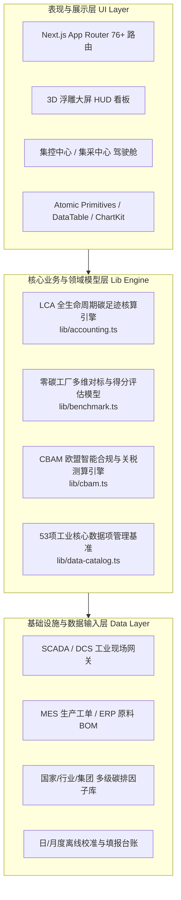

# 特变电工电装集团能碳双中心数字化集成平台 · 系统开发技术文档 (Technical Architecture & Engineering Specification)

> **版本**：v2.0 (生产就绪与技术架构完整版)  
> **面向对象**：前端架构师、后端工程师、数据工程师、DevOps SRE、系统集成测试工程师  
> **覆盖范围**：零碳园区集控中心 (Zero-Carbon Cockpit) + 产品碳足迹集采中心 (Carbon-Footprint Platform) + 共性系统管理  
> **生产线上集群**：`8.215.89.194:3000` (暗黑科技蓝主系统) / `8.215.89.194:3001` (浅色镜像环境)

---

## 目录

- [一、总体架构与技术选型](#一总体架构与技术选型)
  - [1.1 核心技术栈清单](#11-核心技术栈清单)
  - [1.2 代码工程目录解耦规范](#12-代码工程目录解耦规范)
  - [1.3 分层架构与核心依赖拓扑](#13-分层架构与核心依赖拓扑)
- [二、组织架构与六级多维数据模型](#二组织架构与六级多维数据模型)
  - [2.1 组织与对象层级树](#21-组织与对象层级树)
  - [2.2 核心数据字典与实体定义](#22-核心数据字典与实体定义)
  - [2.3 产业-工厂-工序能源介质映射拓扑](#23-产业-工厂-工序能源介质映射拓扑)
- [三、核心领域核算模型与算法实现](#三核心领域核算模型与算法实现)
  - [3.1 综合能源消费折标煤算法模型](#31-综合能源消费折标煤算法模型)
  - [3.2 产品全生命周期 (LCA) 碳足迹核算模型 (ISO 14067)](#32-产品全生命周期-lca-碳足迹核算模型-iso-14067)
  - [3.3 欧盟 CBAM 嵌入排放与综合关税测算算法](#33-欧盟-cbam-嵌入排放与综合关税测算算法)
  - [3.4 零碳工厂多维对标综合评价与红黑榜加权算法](#34-零碳工厂多维对标综合评价与红黑榜加权算法)
  - [3.5 园区微电网削峰填谷与绿电消纳率计算模型](#35-园区微电网削峰填谷与绿电消纳率计算模型)
- [四、大屏可视化与 3D 地图工程规范](#四大屏可视化与-3d-地图工程规范)
  - [4.1 航天级金属 HUD 框架与 1080P/2K 弹性自适应设计](#41-航天级金属-hud-框架与-1080p2k-弹性自适应设计)
  - [4.2 3D 立体中国浮雕地图与雷达脉冲点渲染算法](#42-3d-立体中国浮雕地图与雷达脉冲点渲染算法)
  - [4.3 ECharts 6 与 Recharts 深色科技蓝适配准则](#43-echarts-6-与-recharts-深色科技蓝适配准则)
- [五、接口协议、数据采集与离线填报规范](#五接口协议数据采集与离线填报规范)
  - [5.1 自动化数据采集边界 (SCADA / MES / ERP / IoT)](#51-自动化数据采集边界-scada--mes--erp--iot)
  - [5.2 离线填报、表计差值防伪与环比波动预警算法](#52-离线填报表计差值防伪与环比波动预警算法)
  - [5.3 集团/经营单位多级因子库版本化继承策略](#53-集团经营单位多级因子库版本化继承策略)
- [六、构建、部署与生产运维规范](#六构建部署与生产运维规范)
  - [6.1 SSG 静态预渲染与 Turbopack 构建流](#61-ssg-静态预渲染与-turbopack-构建流)
  - [6.2 生产服务器 (8.215.89.194) 双端口部署架构](#62-生产服务器-821589194-双端口部署架构)
  - [6.3 CI/CD 发布脚本与平滑运维机制](#63-cicd-发布脚本与平滑运维机制)

---

## 一、总体架构与技术选型

### 1.1 核心技术栈清单

| 分层维度 | 技术选型 | 版本 | 选型考量与技术约束 |
| :--- | :--- | :--- | :--- |
| **基础框架** | Next.js (App Router) | 16.3.0 | 选用 App Router 架构，支持 Turbopack 极速构建，全站开启静态导出 (`output: 'export'`) |
| **视图引擎** | React | 19.0.0 | 支持并发渲染 (Concurrent Rendering) 与原生客户端组件分离 |
| **开发语言** | TypeScript | 5.x | 全面开启严格模式 (`strict: true`)，禁止隐式 `any`，领域核算实体全强类型覆盖 |
| **样式体系** | Tailwind CSS + PostCSS | 4.0.0 | 引入最新 CSS 原生嵌套与 `@theme` 变量系统，暗黑科技蓝与浅色模式双主题秒级切换 |
| **基础图标** | Lucide React | 1.16.0 | 统一矢量图标库，支持按需加载，语义化呈现 |
| **数据可视化** | ECharts / Recharts | 6.1.0 / 3.10.1 | ECharts 负责复杂地理坐标映射、仪表盘；Recharts 负责高频响应式双轴折线与堆叠柱状图 |
| **空间地理渲染**| React Simple Maps + D3 Geo | 3.0.0 / 3.1.1 | 结合经纬度投影实现全国产业园区分布拓扑及俯仰视角投影 |

---

### 1.2 代码工程目录解耦规范

项目采用现代前端单体大仓（Modular Monorepo/Decoupled Architecture）设计，业务逻辑按**功能域 (Domain-Driven Design)** 严格切分：

```text
产品原型/
├── app/                                 # 路由页面层 (Next.js App Router 76+ 静态路由)
│   ├── layout.tsx                       # 全局根布局 (注入科技蓝深色全局样式及字体)
│   ├── page.tsx                         # 门户总览主页 (集成全产业入口与智能问数助手)
│   ├── docs/                            # 系统开发手册与技术规范内页 (/docs)
│   ├── zero-carbon/                     # 零碳园区集控中心业务域
│   │   ├── screen/                      # 园区监控中心大屏看板
│   │   ├── monitor/                     # 集中监管 (指标管控、设备监测、微电网、用能)
│   │   ├── energy/                      # 能耗能效 (结构、成本、单耗、产值、对标)
│   │   ├── carbon/                      # 碳管理 (核算、多维分析、报告与核查)
│   │   ├── project/                     # 零碳项目 (立项、效益评估、零碳工厂自评估)
│   │   ├── reports/                     # 统计报表 (能耗、碳排、成本、单耗)
│   │   ├── alarm/                       # 告警管理 (规则、台账、推送策略)
│   │   └── config/                      # 基础配置 (因子、费价、折标转换、离线填报)
│   ├── carbon-footprint/                # 产品碳足迹集采中心业务域
│   │   ├── cockpit/                     # 集团产品碳足迹驾驶舱
│   │   ├── database/                    # 实景数据库 (型号核算、订单核算、能耗追溯)
│   │   ├── analysis/                    # 多维分析 (品类对比、碳热点模拟、对标)
│   │   ├── cbam/                        # 欧盟 CBAM 应对 (合规、申报、关税测算、知识库)
│   │   ├── certification/               # 第三方认证 (申请提报、机构审核、证书防伪)
│   │   └── factor/                      # 因子库管理 (原料因子、电网因子、运输因子)
│   └── system/                          # 共性系统管理 (账号组织、角色权限、审计日志)
├── components/                          # 表现层与高阶交互组件
│   ├── shared/                          # 全局原子组件 (Modal, Select, DataTable, Charts)
│   ├── screen/                          # 大屏专用高保真 HUD、3D 地图、雷达点位组件
│   ├── database/                        # 实景数据库核算视图、订单追溯与数据追踪弹窗
│   └── docs/                            # 技术文档交互渲染视图 (DocsView)
├── lib/                                 # 核心领域计算模型与数据服务层 (纯函数 / 无状态)
│   ├── accounting.ts                    # LCA 碳足迹核算、工序能耗折标与多阶拆解模型
│   ├── benchmark.ts                     # 零碳工厂多维对标算法、得分模型与红黑榜机制
│   ├── cbam.ts                          # CBAM 欧盟法规规则库、HS-CN 映射与关税测算引擎
│   ├── data-catalog.ts                  # 53 项工业核心数据项定义与采集清单标准
│   ├── requirements.ts                  # 功能矩阵与产品-工序-能源介质映射基准表
│   └── mock-data.ts                     # 6大园区、37家经营单位基础组织与设备字典
└── public/                              # 静态资源 (3D 地图高清纹理底图、高保真设备模型)
```

---

### 1.3 分层架构与核心依赖拓扑



---

## 二、组织架构与六级多维数据模型

### 2.1 组织与对象层级树

系统数据模型严格围绕特变电工集团实际工业组织结构进行构建，支持自顶向下任意层级的**穿透下钻 (Drill-Down)** 与自底向上的**加权卷积汇总 (Roll-Up)**：

$$\text{集团 (Group)} \longrightarrow \text{产业园区 (6 Parks)} \longrightarrow \text{经营单位 (37 Units)} \longrightarrow \text{产线车间 (Lines)} \longrightarrow \text{产品型号 (Models)} \longrightarrow \text{生产订单/批次 (Orders)}$$

1. **集团层级**：宏观战略视图，汇总全集团综合能耗、碳配额利用率、直供绿电消纳量、CBAM 关税暴露敞口；
2. **产业园区 (6 大园区)**：
   - 衡阳产业园（湘变公司承载）
   - 天津产业园（天变公司承载）
   - 山东产业园（鲁能泰山电缆承载）
   - 沈阳产业园（沈变本部承载）
   - 西安产业园（西开电气成套装备承载）
   - 新疆产业园（本部新特能源、新变厂承载）
3. **经营单位/项目公司 (37 家单位)**：
   - 包含变压器主机制造厂、特种线缆制造厂、成套开关设备厂、硅钢组件厂；
   - **在建项目公司与未投产单位规则**：在组织树中予以置灰标注（`text-muted-foreground`），**默认不计入红黑榜与零碳达标率统计**。
4. **产线/车间**：如低压箔绕车间、气相干燥真空车间、立式交联立塔产线；
5. **产品型号**：如变压器 `SFZ11-110/31500`、交联聚乙烯电缆 `YJV22-8.7/15kV`；
6. **生产订单与批次**：如订单 `SO-260710`、计划批次 `PI-260710-01`。

---

### 2.2 核心数据字典与实体定义

#### 1. 生产计划与批次数据结构 (`ProdOrder`)
```typescript
export interface ProdOrder {
  order: string          // 销售订单编号 (如: SO-260710)
  model: string          // 产品规格型号 (如: SFZ11-110)
  qty: number            // 订单计划制造台数 (台 / 公里)
  plans: {
    plan: string         // 生产作业计划批次号 (如: PI-260710-01)
    window: string       // 计划生产执行周期 (如: 2026-07-10 ~ 2026-07-20)
    qty: number          // 当前批次执行台数
  }[]
}
```

#### 2. 工序能源消费追踪行数据结构
```typescript
export interface StageProcessEnergyRow {
  unit: string           // 生产制造单元 (如: 绕线、器身、总装、成品、公用系统)
  processName: string    // 关键工序标准名称 (如: 低压箔绕与高压绕制)
  energyType: '市电' | '绿电' | '蒸汽' | '天然气'
  startTime: string      // 精确到秒的开始时间 (YYYY-MM-DD HH:mm:ss)
  endTime: string        // 精确到秒的结束时间 (YYYY-MM-DD HH:mm:ss)
  consumption: number    // 实物能源消耗量 (kWh / m³ / t)
  coefKgce: number       // 折标煤系数 (kgce/单位)
  totalKgce: number      // 综合折标能耗 (kgce)
}
```

---

### 2.3 产业-工厂-工序能源介质映射拓扑

根据特变电工现场工艺标准，不同产业存在严格的物理能源介质约束，系统在核算与填报校验时强制遵循以下基准：

| 产业大类 | 代表产品 | 核心耗能工序 | 主控能源介质 | 关键工艺特征与数据约束 |
| :--- | :--- | :--- | :--- | :--- |
| **变压器产业** | 电力变压器、特高压换流变、干式变 | 气相干燥、固化炉、冲击试验 | **电力**、**工业蒸汽** | 绝缘气相干燥需要高温工业蒸汽脱水；全生命周期无燃煤消耗 |
| **线缆产业** | 高压交联电缆、架空导线、光伏电缆 | 铜铝拉丝、立塔挤出交联、成缆 | **电力**、**高纯氮气** | 立塔悬垂交联采用高纯氮气高压热交联；**全流程严禁统计工业蒸汽** |
| **开关成套** | GIS 组合电器、真空断路器、中低压开关柜 | 壳体精加工、自动焊接、防尘装配 | **电力** | 以精密机械加工、高压气密性试验和表面喷涂为主 |
| **特种装备** | 硅钢铁芯、绝缘套管、特种电抗器 | 纵剪横切、叠片成型、真空浸漆 | **电力**、**天然气** | 硅钢退火和绝缘干燥部分采用天然气清洁燃烧加热 |

---

## 三、核心领域核算模型与算法实现

### 3.1 综合能源消费折标煤算法模型

将企业消费的各种实物能源统一折算为标准煤（kgce 或 tce），以消除不同能源热值差异：

$$E_{\text{kgce}} = \sum_{i=1}^{n} \left( M_i \times C_i \right)$$

其中：
- $M_i$：第 $i$ 种能源介质的实物消费量（如电力 $\text{kWh}$、蒸汽 $\text{t}$、天然气 $\text{m}^3$）；
- $C_i$：第 $i$ 种能源的折标煤系数。

系统支持**当量值**与**等价值**双口径灵活切换：
- **电力当量折标系数**（物理热值当量）：
  $$C_{\text{elec, 当量}} = 0.1229 \text{ kgce/kWh}$$
- **电力等价折标系数**（国家发电平均煤耗）：
  $$C_{\text{elec, 等价}} = 0.3150 \text{ kgce/kWh}$$
- **蒸汽折标系数**：取饱和蒸汽平均焓值折算为 $0.1286 \text{ kgce/kg}$；
- **天然气折标系数**：取典型干气热值 $1.2143 \text{ kgce/m}^3$。

---

### 3.2 产品全生命周期 (LCA) 碳足迹核算模型 (ISO 14067)

产品碳足迹采用“摇篮到大门 (Cradle-to-Gate)”边界准则，全方位覆盖四大阶段：

$$\text{PCF}_{\text{total}} = E_{\text{raw}} + E_{\text{trans}} + E_{\text{mfg}} + E_{\text{waste}}$$

#### 工厂制造环节 ($E_{\text{mfg}}$) 核心电网减排算法：
为精确量化绿色电力市场化交易与分布式光伏的减排贡献，制造工序碳排公式如下：

$$E_{\text{mfg}} = \sum_{j \in \text{工序}} \left( Q_{j, \text{grid}} \times EF_{\text{grid}} + Q_{j, \text{green}} \times EF_{\text{green}} + Q_{j, \text{steam}} \times EF_{\text{steam}} \right)$$

- $EF_{\text{grid}}$：全国/华北区域电网平均排放因子，取 **$0.5366 \text{ kgCO}_2/\text{kWh}$**；
- $EF_{\text{green}}$：绿电交易/自发自用光伏生命周期排放因子，取 **$0.05664 \text{ kgCO}_2/\text{kWh}$**；
- 绿电替代减排效益：
  $$\Delta E_{\text{reduction}} = Q_{\text{green}} \times (EF_{\text{grid}} - EF_{\text{green}}) = Q_{\text{green}} \times 0.47996 \text{ kgCO}_2/\text{kWh}$$

---

### 3.3 欧盟 CBAM 嵌入排放与综合关税测算算法

针对变压器、电缆用铜铝金属前驱物出口欧盟，CBAM 模型实现从海关编码（HS Code）到欧盟 CN 码的映射、前驱物嵌入排放（Embedded Emissions）核算及碳税成本预测。

#### 1. 直接嵌入排放与间接嵌入排放核算
$$\text{SE}_{\text{direct}} = \frac{\text{DirEm}}{\text{ProdVolume}} \quad (\text{tCO}_2\text{e/t})$$
$$\text{SE}_{\text{indirect}} = \frac{\text{ElectricityCons} \times EF_{\text{grid}}}{\text{ProdVolume}} \quad (\text{tCO}_2\text{e/t})$$

#### 2. CBAM 碳税成本预估公式
$$\text{Cost}_{\text{CBAM}} = \text{ExportVolume} \times \text{SE}_{\text{direct}} \times \max\left(0, P_{\text{EU ETS}} - P_{\text{Domestic Carbon}}\right)$$

- $P_{\text{EU ETS}}$：欧盟碳配额当期拍卖结算价（如 $75 \text{ EUR/tCO}_2$）；
- $P_{\text{Domestic Carbon}}$：国内全国碳市场 CEA 折算抵扣价（如 $12 \text{ EUR/tCO}_2$）；
- 模型支持高/中/低 3 种情景动态模拟外贸成本变动风险。

---

### 3.4 零碳工厂多维对标综合评价与红黑榜加权算法

集控中心对各经营单位的零碳推进水平进行综合评分（0–100 分），杜绝“单项指标过度极值掩盖其余短板”的现象。

#### 1. 单指标达标系数 $\text{Achievement}(v, m)$
$$\text{Achievement}(v, m) = \begin{cases} \frac{\text{Benchmark}}{v}, & \text{指标为越低越好（如单耗、碳排放强度）} \\ \frac{v}{\text{Benchmark}}, & \text{指标为越高越好（如绿电占比、自给率）} \end{cases}$$

#### 2. 距标杆差距比率 $\text{GapPct}(v, m)$
$$\text{GapPct}(v, m) = \begin{cases} \frac{v - \text{Benchmark}}{\text{Benchmark}} \times 100\%, & \text{越低越好（正值表示落后，需改进）} \\ \frac{\text{Benchmark} - v}{\text{Benchmark}} \times 100\%, & \text{越高越好（正值表示落后，需改进）} \end{cases}$$

#### 3. 综合对标得分加权截断公式
$$\text{Score} = \text{clamp}\left(45, 99, \frac{1}{K} \sum_{k=1}^{K} \min\left(1.15, \text{Achievement}_k\right) \times 86\right)$$

- $\min(1.15, \cdot)$：**截断过度溢出**，防止某单项指标过度超出导致低能效工厂获得虚高评分；
- 评级判定阈值：
  - $\text{Score} \ge 90$：**领跑者（绿色）**
  - $78 \le \text{Score} < 90$：**达标者（黄色）**
  - $\text{Score} < 78$：**改进对象（红色高亮，红榜抓手）**

---

### 3.5 园区微电网削峰填谷与绿电消纳率计算模型

实时动态监控园区屋顶光伏发电功率 $P_{\text{pv}}(t)$、储能充放电功率 $P_{\text{ess}}(t)$、厂区负荷 $P_{\text{load}}(t)$ 与电网交换功率 $P_{\text{grid}}(t)$：

$$P_{\text{load}}(t) = P_{\text{pv, self}}(t) + P_{\text{ess, discharge}}(t) + P_{\text{grid, import}}(t) - P_{\text{ess, charge}}(t)$$

综合绿电消纳率定义：
$$\eta_{\text{green}} = \frac{\int_{0}^{T} \left( P_{\text{pv, self}}(t) + P_{\text{green, trade}}(t) + P_{\text{ess, green}}(t) \right) dt}{\int_{0}^{T} P_{\text{load}}(t) dt} \times 100\%$$

---

## 四、大屏可视化与 3D 地图工程规范

### 4.1 航天级金属 HUD 框架与 1080P/2K 弹性自适应设计

1. **基底色彩体系 (Dark Tech-Blue Design Tokens)**：
   - 空间深蓝底色：`#020b18`（深空背景）与 `#081a30`（卡片微光底层）；
   - 主科技发光青：`#00f0ff`（高亮发光）、`#00b4d8`（副高光）；
   - 状态语义色：正常 `#10b981`、告警 `#f59e0b`、严重 `#ef4444`。
2. **切角科技边框 (Tech Bevel Cut)**：
   - 采用纯 CSS `clip-path: polygon(...)` 结合发光线条，避免使用重量级图片切片；
   - 顶部 HUD 采用倒梯形切角与航天金属微反光。
3. **弹性适配机制**：
   - 以 `1920 × 1080` 为设计基准标准分辨率；
   - 采用 CSS Grid 与 `vh/vw` 混合布局，自适应 2K (`2560 × 1440`) 与 4K (`3840 × 2160`)，保证在任何长宽比下**杜绝出现纵向双滚动条**。

---

### 4.2 3D 立体中国浮雕地图与雷达脉冲点渲染算法

1. **投影换算**：将衡阳、天津、沈阳、西安、新疆等地理经纬度通过 D3 Geo 转换为二维相对平面坐标；
2. **透视矩阵**：在父级容器施加 `perspective: 1200px` 与 `rotateX(22deg) rotateZ(-3deg)` 营造深邃下视景深；
3. **脉冲雷达点**：利用 Tailwind `animate-ping` 与渐变光晕叠加，核心示范园区享有专属青蓝发光涟漪；
4. **科技引线对齐**：通过 SVG `stroke-dasharray` 绘制从地图锚点到右上角浮动详情卡的流动发光虚线。

---

### 4.3 ECharts 6 与 Recharts 深色科技蓝适配准则

1. **图表文字背景透明化**：强制设置 `backgroundColor: 'transparent'`，杜绝出现默认白底色块；
2. **坐标轴与网格线**：轴线统一采用 `rgba(255, 255, 255, 0.12)`，网格虚线采用 `strokeDasharray: '3 3'`；
3. **Tooltip 悬浮窗深色拟态**：
   - `background: rgba(8, 26, 48, 0.95)`
   - `border: 1px solid rgba(0, 240, 255, 0.35)`
   - `backdropFilter: blur(8px)`
4. **重叠与遮挡防范**：在环形南丁格尔玫瑰图与甜甜圈饼图中，扇区数值标签必须具备安全半径与碰撞保护阈值，杜绝文字重叠。

---

## 五、接口协议、数据采集与离线填报规范

### 5.1 自动化数据采集边界 (SCADA / MES / ERP / IoT)

1. **高频秒级/分钟级**：光伏发电、储能 PCS、关键车间总负荷通过 MQTT / OPC-UA 接入时序网关；
2. **班次/日级**：MES 生产工单、批次产品投料、出厂试验电耗由 ETL 批量抽取；
3. **月度级**：ERP 工业总产值、增加值、财务蒸汽水费单据提供离线校准接口。

---

### 5.2 离线填报、表计差值防伪与环比波动预警算法

1. **表计起止读数校验机制**：
   $$\text{本月用量} = (\text{本月止度} - \text{上月止度}) \times \text{互感器倍率}$$
   - **防伪规则**：若 $\text{本月止度} < \text{上月止度}$，触发“表计倒走或换表重置”强制校验警报。
2. **±5% 环比与同比波动智能预警算法**：
   $$\text{Fluctuation} = \left| \frac{V_{\text{current}} - V_{\text{prev}}}{V_{\text{prev}}} \right| \times 100\%$$
   - 当 $\text{Fluctuation} \ge 15\%$ 时，输入框呈现琥珀色警告，要求填报专员选择波动原因（如“季节性停产检修”、“新增产线调试”）；
   - 当 $\text{Fluctuation} \ge 50\%$ 时，系统阻止一键提交，要求二级安全审核人双签名核验。

---

### 5.3 集团/经营单位多级因子库版本化继承策略

因子库采用四级继承与覆盖机制，确保国际核查合规性：
1. **国家基准层**：生态环境部、国家电网发布的全国及六大区域电网排放因子；
2. **行业规范层**：机械工业联合会、电气装备行业特定材料生命周期因子；
3. **集团标准层**：特变电工统一发布的铜杆、铝排、高牌号取向硅钢集采集约因子；
4. **经营单位实测层**：具有权威第三方 CMA/CNAS 碳足迹检测报告的供应商实际因子。
- **解析优先级**：$\text{经营单位实测层} > \text{集团标准层} > \text{行业规范层} > \text{国家基准层}$。所有因子变更均写入不可篡改审计日志，并附带时间戳版本版本号（如 `V2026.07`）。

---

## 六、构建、部署与生产运维规范

### 6.1 SSG 静态预渲染与 Turbopack 构建流

项目 `next.config.mjs` 配置了严格的静态导出标准：

```javascript
/** @type {import('next').NextConfig} */
const nextConfig = {
  output: 'export',          // 纯静态 HTML/JS/CSS 导出至 out/ 目录
  images: {
    unoptimized: true,       // 离线环境与内网 Nginx 零 Node.js 运行时依赖
  },
  trailingSlash: false,
}
export default nextConfig
```

- **极速构建命令**：`pnpm build`
- **产物验证**：自动化生成 76/76 个全静态独立路由，零动态服务端渲染故障点，防范生产崩溃。

---

### 6.2 生产服务器 (8.215.89.194) 双端口部署架构

```text
                  Internet / Intranet 用户访问
                               │
            ┌──────────────────┴──────────────────┐
            ▼                                     ▼
   http://8.215.89.194:3000              http://8.215.89.194:3001
   [暗黑科技蓝 (Dark Tech-Blue)]          [清爽浅色镜像 (Light Mode)]
            │                                     │
            ▼                                     ▼
 Nginx: /var/www/tbea-nengtan           Nginx: /var/www/tbea-nengtan-old
 (Root: static out/ assets)             (Root: static out/ assets)
```

---

### 6.3 CI/CD 发布脚本与平滑运维机制

本地打包后一键同步至生产环境的标杆运维自动化流程：

```powershell
# 1. 编译两套独立主题前端产物
cd "D:\Project\TJ-nengtan\产品原型" && pnpm build
cd "D:\Project\TJ-nengtan\产品原型-旧\产品原型" && pnpm build

# 2. 打包生成轻量 tar.gz 归档
tar.exe -czf "$env:TEMP\tbea-dark.tar.gz" -C "D:\Project\TJ-nengtan\产品原型\out" .
tar.exe -czf "$env:TEMP\tbea-light.tar.gz" -C "D:\Project\TJ-nengtan\产品原型-旧\产品原型\out" .

# 3. SCP 上传并远程原子解压与 Nginx 平滑重载
scp.exe "$env:TEMP\tbea-dark.tar.gz" admin@8.215.89.194:/home/admin/
scp.exe "$env:TEMP\tbea-light.tar.gz" admin@8.215.89.194:/home/admin/
ssh.exe admin@8.215.89.194 "sudo rm -rf /var/www/tbea-nengtan/* && sudo tar -xzf /home/admin/tbea-dark.tar.gz -C /var/www/tbea-nengtan/ && sudo rm -rf /var/www/tbea-nengtan-old/* && sudo tar -xzf /home/admin/tbea-light.tar.gz -C /var/www/tbea-nengtan-old/ && sudo chown -R www-data:www-data /var/www/tbea-nengtan* && sudo systemctl reload nginx && echo 'SUCCESS_DEPLOY'"
```

---

> **文档维护归档**：特变电工电装集团数字化转型工作组 & 能碳双中心技术委员会  
> **最后修订日期**：2026 年 9 月 4 日  
> **合规认证基准**：符合 GB/T 23331 能源管理体系、ISO 14064 组织碳核算、ISO 14067 产品碳足迹及欧盟 CBAM 2026 实施条例。
