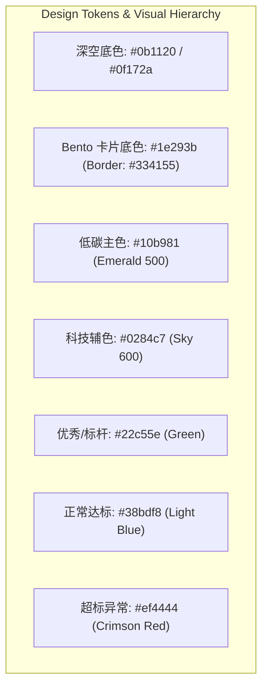
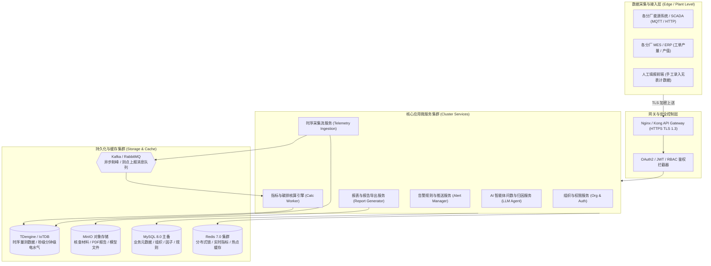
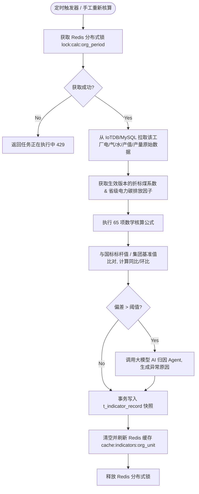

# 🏢 特变电工“双中心”能碳管控系统全维度多 Agent 需求调研与分析报告

> **项目名称**：特变电工（电装集团）“双中心”建设项目（零碳园区集控中心 + 产品碳足迹集采中心）  
> **报告版本**：V1.0-Engineering-Release  
> **多 Agent 联合会诊**：Product Manager (`role-pm`), UI/UX Designer (`role-ui-ux`), Software Architect (`role-architect`), Frontend Engineer (`role-frontend`), Backend Engineer (`role-backend`), Security Analyst (`role-security`), DevOps/SRE (`role-devops`), QA Lead (`role-qa`)  
> **核心里程碑**：
> - **2026-09-15**：高保真原型图 + PRD 交付，启动核心研发
> - **2026-12-05**：系统核心功能上线
> - **2026-12-31**：首批 5 家重点标杆工厂数据全量接入
> - **2027 年**：逐步接入集团全部 15 个产业园区、21 家项目工厂
> - **2027-10**：项目全面终验

---

## 目录索引
1. [👨‍💼 产品经理 (PM) 需求规格与商业分析报告](#1-产品经理-pm-需求规格与商业分析报告)
2. [🎨 UI/UX 视觉体系与交互设计规范](#2-uiux-视觉体系与交互设计规范)
3. [🛠️ 技术架构师 (Architect) 系统总体架构与 API 契约](#3-技术架构师-architect-系统总体架构与-api-契约)
4. [💻 前端工程师 (Frontend) 组件树与状态管理方案](#4-前端工程师-frontend-组件树与状态管理方案)
5. [⚙️ 后端工程师 (Backend) 控制流、核算引擎与缓存策略](#5-后端工程师-backend-控制流核算引擎与缓存策略)
6. [🔒 网络安全工程师 (Security) STRIDE 威胁建模与防护](#6-网络安全工程师-security-stride-威胁建模与防护)
7. [🚀 DevOps / SRE 运维与容器化部署方案](#7-devops--sre-运维与容器化部署方案)
8. [🧪 测试工程师 (QA) 测试矩阵与高风险规避方案](#8-测试工程师-qa-测试矩阵与高风险规避方案)

---

## 1. 👨‍💼 产品经理 (PM) 需求规格与商业分析报告

### 1.1 业务背景与核心痛点
特变电工（电装集团）拥有遍布全国的 **15 个产业园区**、**21 家核心项目工厂**（涵盖变压器、电缆、开关柜、套管、互感器、二次设备、GIL/GIS、硅钢等高用能与高端装备制造）。
目前面临的核心痛点包括：
1. **数据孤岛与能碳可见度低**：各工厂自动化程度不一（部分有远传表计，部分无气表或仅有线下月报），集团高层缺乏全局视角；
2. **零碳工厂评价标准与核算繁琐**：国家级零碳工厂标准（GB/T 24067, ISO 14067）要求严苛，指标涉及 65+ 项（单耗、绿电占比、折标煤、范围一/二碳排等），人工核算极易出错；
3. **应对出口与绿色供应链壁垒（CBAM / 绿色招采）**：变压器与线缆等产品出口面临欧盟碳关税（CBAM）与全生命周期碳足迹核查挑战；
4. **决策滞后**：能耗突增、单耗偏离基准时缺乏实时告警与根因智能诊断（AI 辅助）。

### 1.2 北极星指标 (North Star Metrics)
- **集团核心管控指标自动采集率**：首期 $\ge 85\%$，终期 $\ge 98\%$
- **碳核算与绿电消纳报告生成耗时**：从传统 **5 人天/厂** 降至 **分钟级一键秒出**
- **异常用能与超标排放发现定位时效**：由 **月度事后复盘** 提升至 **15 分钟内实时预警闭环**

### 1.3 用户画像矩阵 (Target Personas)
| 角色画像 | 典型用户 | 核心诉求 | 核心操作场景 |
| :--- | :--- | :--- | :--- |
| **集团高管 / 决策层** | 倪总 / 李总 | 宏观掌握集团 15 个园区零碳转型进程、能耗总量、绿电收益与对外参观展示 | 驾驶舱大屏、GIS 全局下钻、月度智能报告 |
| **集控中心管理员** | 孙彩平 / 魏翔宇 | 集中监控 21 家工厂 65+ 项管控指标、异常指标定位、绿电消纳报告生成、因子与费价维护 | 集中监管、指标管控二级下钻、绿电消纳报告审核、因子库版本重算 |
| **工厂能碳专员** | 各分厂工程师 | 上报缺失手工数据（气/水/产值）、处理能耗超标告警、查看本厂工序单耗与对标排名 | 线下数据填报、告警确认与闭环、工序能耗实时监测 |
| **碳资产与合规专员** | 碳足迹业务员 | 产品碳足迹建模、实景数据库溯源、CBAM 申报资料合规包导出、第三方核查归档 | 碳足迹集采中心、CBAM 管理、核查材料导出 |

### 1.4 功能范围界定 (Scope Boundaries)
- **In-Scope (本次交付范围)**：
  1. **零碳园区集控中心**：大屏驾驶舱、集中监管（指标管控、在线监测、绿电监测）、能耗能效分析（用能结构、成本分析、单耗分析、单位产值能耗、对标管理）、碳管理（碳核算、碳分析、碳报告）、零碳项目评估（档案、模型、效益评估、园区自评估）、统计报表、告警闭环（规则、处理、推送）、基础配置（账号权限、碳排因子、费价模型、折标煤系数、接口配置、手工数据录入）、智能助手（语音控制、智能问数、AI 根因分析）。
  2. **产品碳足迹集采中心**：全景驾驶舱、多维分析（型号对比、碳热点）、实景数据库、CBAM 专区、认证管理、因子库同步与下发、数据采集清单。
- **Out-of-Scope (明确延期或外部系统集成)**：
  - 各分厂底层 SCADA/DCS/MES 控制系统的写控制（仅作单向数据读取与监测，不下发设备启停指令）；
  - 碳配额二级交易市场实时买卖结算（仅支持绿证/绿电交易量录入与抵消核算）。

### 1.5 核心 User Stories (Gherkin 规范)

#### US-01: 经营单位与工厂指标多级下钻与 AI 根因分析
```gherkin
Feature: 指标管控多级树下钻与异常根因诊断
  Scenario: 集团管理员查看沈变公司单位产品能耗并获取 AI 归因
    Given 集团管理员已登录集控中心并打开“指标管控”页面
    When 管理员在左侧组织树展开“沈变公司”，选中“沈变本部”
    And 筛选时间维度为“2026年8月”，点击“单位产品能耗”卡片
    Then 系统展开二级指标详情页，显示当前值、基准值、标杆值、计算公式及参与运算的源数据
    And 页面下方以红色高亮标注同比上涨 12.5%（异常状态）
    And 页面右侧 AI 助手自动生成诊断结论：“本月干燥工序蒸汽能耗异常偏高，主要原因为 2 号干燥罐密封胶条老化导致热损增加 18%”。
```

#### US-02: 绿电消纳核算与报告自动化生成
```gherkin
Feature: 绿电消纳核算与标准化报告导出
  Scenario: 管理员按月生成衡变本部绿电消纳报告
    Given 衡变本部的光伏发电量、储能充放电、市电购电数据已完成汇总
    When 用户进入“绿电监测”模块，切换至“绿电消纳报告”Tab
    And 选择统计周期为“2026-07-01 至 2026-07-31”并点击“生成报告”
    Then 系统自动拆解电量流向（光伏自发自用、光伏充储能、储能放电供给负荷、余电上网、电网购电）
    And 依据标准公式计算出“绿电本地消纳率 92.4%”、“用电侧绿电占比 38.6%”
    And 支持一键导出符合集团审计规范的 PDF / Word 格式报告。
```

### 1.6 功能优先级矩阵 (RICE 框架评估)
| 模块序号 | 功能模块 | 核心内容 | Reach | Impact | Confidence | Effort | RICE 得分 | 优先级 |
| :---: | :--- | :--- | :---: | :---: | :---: | :---: | :---: | :---: |
| **M1** | **集中监管** | 65+ 项管控指标卡片、左侧树下钻、同环比与标杆比、在线监测、绿电监测 | 1500人/月 | Massive (3) | 95% | 3 人周 | **1425** | **P0 (Must)** |
| **M2** | **碳管理 & 因子库** | 范围一/二碳核算引擎、因子多版本管理与历史重算、国标模版报告 | 800人/月 | Massive (3) | 90% | 2.5 人周 | **864** | **P0 (Must)** |
| **M3** | **数据接入与录入** | 多厂接口配置管理、字段映射、线下人工补录表单与权限隔离 | 1200人/月 | High (2) | 90% | 2 人周 | **1080** | **P0 (Must)** |
| **M4** | **能耗能效分析** | 桑基能流图、能源成本、产品单耗/产值能耗矩阵、对标榜单 | 1000人/月 | High (2) | 85% | 2 人周 | **850** | **P1 (Should)** |
| **M5** | **大屏驾驶舱** | GIS 地图、15 园区成果对比、转型里程碑时间轴 | 2000人/月 | Medium (1.5) | 90% | 2 人周 | **1350** | **P1 (Should)** |
| **M6** | **产品碳足迹与CBAM** | 实景数据库、CBAM 合规包、摇篮到大门工单溯源 | 600人/月 | High (2) | 80% | 2.5 人周 | **384** | **P1 (Should)** |
| **M7** | **告警与闭环** | 多维阈值规则引擎、超时升级、工单状态流转、企业微信推送 | 800人/月 | High (2) | 85% | 1.5 人周 | **906** | **P1 (Should)** |
| **M8** | **智能助手 (AI)** | 语音唤醒、自然语言智能问数、语音页面直达、AI 根因分析 | 500人/月 | Medium (1.5) | 80% | 1.5 人周 | **400** | **P2 (Could)** |

---

## 2. 🎨 UI/UX 视觉体系与交互设计规范

### 2.1 整体设计风格定位
采用**现代工业科技风 (Industrial Cyber Dark Mode + Crisp Light Mode 双模态)**，主色调以工业石板灰深色为底，融合**低碳翡翠绿 (Emerald Green)** 与 **智控科技蓝 (Cyan Blue)**，重点数据以 **警示琥珀金 (Amber)** 与 **危险绯红 (Crimson)** 呈现。



### 2.2 信息架构与导航层级 (Information Architecture)
1. **顶层双中心平台切换 (Platform Switcher)**：
   - 🌐 **零碳园区集控中心** (`/zero-carbon`)
   - 🍃 **产品碳足迹集采中心** (`/carbon-footprint`)
2. **左侧动态组织架构树 (Org Filter Tree)**：
   - 集团 $\rightarrow$ 一级经营单位（沈变、衡变、新变、鲁缆、新缆、德缆） $\rightarrow$ 二级项目公司（沈变本部、和新套管、超高压、天变等） $\rightarrow$ 关键工序 / 重点设备（干燥罐、拉丝机、交联线、测试站）。
   - 支持实时拼音/汉字快捷搜索过滤，未接入项目公司以置灰（Disabled）但可查看静态台账状态展示。
3. **Bento Grid 卡片式信息排布**：
   - 顶部：全局时间粒度选择器（日/月/年） + 采样频率（15/30/60min） + 核心 KPI 概览（综合能耗、碳排放、绿电占比、单耗）。
   - 中部：左侧折线/面积趋势图（用电负荷、正向有功电能） + 右侧尖峰平谷环形分布与日/月堆叠柱状图。
   - 底部：各关键测点/工序实时数据表格 + AI 诊断卡片。

### 2.3 Design Tokens 规范定义
```json
{
  "theme": {
    "colors": {
      "bg-base": "hsl(222, 47%, 7%)",
      "bg-surface": "hsl(217, 33%, 12%)",
      "bg-surface-hover": "hsl(217, 33%, 17%)",
      "border-default": "hsl(217, 24%, 22%)",
      "primary-green": "hsl(160, 84%, 39%)",
      "accent-blue": "hsl(199, 89%, 48%)",
      "kpi-good": "hsl(142, 71%, 45%)",
      "kpi-alert": "hsl(0, 84%, 60%)",
      "kpi-warn": "hsl(38, 92%, 50%)"
    },
    "spacing": { "xs": "4px", "sm": "8px", "md": "16px", "lg": "24px", "xl": "32px" },
    "radius": { "sm": "4px", "md": "8px", "lg": "12px", "xl": "16px" },
    "shadow": {
      "card": "0 4px 20px -2px rgba(0, 0, 0, 0.5)",
      "glow-green": "0 0 15px rgba(16, 185, 129, 0.25)"
    }
  }
}
```

### 2.4 组件状态矩阵 (Component State Matrix)
| 组件类型 | 正常态 (Normal) | 悬停态 (Hover) | 激活/选中态 (Active) | 聚焦态 (Focus a11y) | 异常态 (Error/Alert) | 加载态 (Loading) |
| :--- | :--- | :--- | :--- | :--- | :--- | :--- |
| **指标卡片** | 背景 `#1e293b`，边框 `#334155` | 边框高亮 `#10b981`，微浮 2px | 翡翠绿阴影 Glow 边框 | 2px 科技蓝外圈 Outline | 红色呼吸边框闪烁 | 骨架屏 Skeleton 流光 |
| **左侧组织树节点** | 文字 `#94a3b8`，透明背景 | 背景 `rgba(255,255,255,0.05)` | 背景 `rgba(16,185,129,0.15)` 文字 `#10b981` | 键盘 Tab 蓝圈 | 置灰 `#64748b` (未接入) | 节点微型 Spinner |
| **主操作 CTA 按钮** | 翡翠绿渐变实色 | 亮度 110%，Scale(1.02) | 深度按下 Scale(0.98) | 2px 蓝白双环 Ring | 禁用置灰 + `not-allowed` | 内嵌 16px 圆形 Spinner |

---

## 3. 🛠️ 技术架构师 (Architect) 系统总体架构与 API 契约

### 3.1 领域驱动设计 (DDD Bounded Contexts)
系统划分为 **6 大领域界限上下文**：
1. **组织与资产拓扑域 (Org & Asset Domain)**：管理 15 园区、6 大经营单位、21 家工厂、车间、产线、工序、表计测点四级层级。
2. **能源在线采集域 (Energy Ingestion & Telemetry Domain)**：处理水、电、气、蒸汽、光伏、储能、市电的秒级/分钟级实时时序流。
3. **指标与核算管控域 (Indicator & Carbon Calculation Domain)**：负责 65+ 项管控指标（单耗、产值比、折标煤、碳足迹）定时计算与版本追溯。
4. **碳资产与报告域 (Carbon Asset & Report Domain)**：因子库多版本管理、费价模型、国标碳核算报告生成与第三方核查材料包导出。
5. **智能诊断与告警域 (Diagnosis & Alert Domain)**：阈值规则引擎、超时升级调度、大模型智能归因与问数引擎。
6. **产品碳足迹与 CBAM 域 (LCA & CBAM Domain)**：BOM 工单级碳足迹穿透、实景背景数据库、CBAM 出口申报。

### 3.2 C4 模型：系统容器架构图 (Container Level)


### 3.3 核心数据库 DDL 设计 (MySQL 8.0 规范)

```sql
-- 1. 组织架构与园区工厂表
CREATE TABLE `t_org_unit` (
    `id` BIGINT UNSIGNED NOT NULL AUTO_INCREMENT COMMENT '主键ID',
    `unit_code` VARCHAR(64) NOT NULL COMMENT '组织编码',
    `unit_name` VARCHAR(128) NOT NULL COMMENT '组织名称',
    `unit_level` TINYINT NOT NULL COMMENT '层级: 1-集团, 2-一级经营单位, 3-二级项目公司, 4-车间/产线',
    `parent_id` BIGINT UNSIGNED NOT NULL DEFAULT 0 COMMENT '父级ID',
    `park_name` VARCHAR(128) DEFAULT NULL COMMENT '所属零碳园区名称',
    `is_connected` TINYINT NOT NULL DEFAULT 1 COMMENT '是否本次接入: 1-已接入, 0-置灰未接入',
    `created_at` DATETIME(3) NOT NULL DEFAULT CURRENT_TIMESTAMP(3),
    `updated_at` DATETIME(3) NOT NULL DEFAULT CURRENT_TIMESTAMP(3) ON UPDATE CURRENT_TIMESTAMP(3),
    PRIMARY KEY (`id`),
    UNIQUE KEY `uk_unit_code` (`unit_code`),
    KEY `idx_parent_level` (`parent_id`, `unit_level`)
) ENGINE=InnoDB DEFAULT CHARSET=utf8mb4 COLLATE=utf8mb4_unicode_ci COMMENT='组织架构与园区工厂台账表';

-- 2. 65+ 项能碳管控指标定义与基准值表
CREATE TABLE `t_indicator_meta` (
    `id` BIGINT UNSIGNED NOT NULL AUTO_INCREMENT COMMENT '指标ID',
    `indicator_code` VARCHAR(64) NOT NULL COMMENT '指标英文标识',
    `indicator_name` VARCHAR(128) NOT NULL COMMENT '指标中文名',
    `category` VARCHAR(64) NOT NULL COMMENT '指标类别: 碳排放/综合能耗/单位产品能耗/单位产值能耗/关键工序/绿电',
    `unit` VARCHAR(32) NOT NULL COMMENT '计量单位(如 tce/万元, kWh/t, %)',
    `center_type` ENUM('集控', '集采') NOT NULL DEFAULT '集控' COMMENT '所属中心',
    `calc_formula` TEXT NOT NULL COMMENT '计算公式表达式文本',
    `calc_period` ENUM('REALTIME', 'DAY', 'MONTH', 'YEAR') NOT NULL DEFAULT 'MONTH' COMMENT '核算周期',
    `standard_value` DECIMAL(14, 4) DEFAULT NULL COMMENT '国家/行业标杆值',
    `benchmark_value` DECIMAL(14, 4) DEFAULT NULL COMMENT '集团内部基准值',
    `created_at` DATETIME(3) NOT NULL DEFAULT CURRENT_TIMESTAMP(3),
    PRIMARY KEY (`id`),
    UNIQUE KEY `uk_indicator_code` (`indicator_code`)
) ENGINE=InnoDB DEFAULT CHARSET=utf8mb4 COLLATE=utf8mb4_unicode_ci COMMENT='指标元数据与基准配置表';

-- 3. 指标核算结果与快照表
CREATE TABLE `t_indicator_record` (
    `id` BIGINT UNSIGNED NOT NULL AUTO_INCREMENT COMMENT '主键ID',
    `org_unit_id` BIGINT UNSIGNED NOT NULL COMMENT '所属组织工厂ID',
    `indicator_id` BIGINT UNSIGNED NOT NULL COMMENT '指标ID',
    `period_date` VARCHAR(16) NOT NULL COMMENT '统计周期标签 (如 2026-08 或 2026-08-21)',
    `actual_value` DECIMAL(16, 4) NOT NULL COMMENT '实际计算值',
    `yoy_delta_rate` DECIMAL(8, 4) DEFAULT NULL COMMENT '同比变化率(%)',
    `mom_delta_rate` DECIMAL(8, 4) DEFAULT NULL COMMENT '环比变化率(%)',
    `status` ENUM('EXCELLENT', 'NORMAL', 'ALERT') NOT NULL DEFAULT 'NORMAL' COMMENT '判定状态',
    `raw_payload` JSON DEFAULT NULL COMMENT '参与计算的原始入参快照(溯源JSON)',
    `ai_reasoning` TEXT DEFAULT NULL COMMENT 'AI生成的异常归因结论',
    `created_at` DATETIME(3) NOT NULL DEFAULT CURRENT_TIMESTAMP(3),
    PRIMARY KEY (`id`),
    UNIQUE KEY `uk_unit_ind_period` (`org_unit_id`, `indicator_id`, `period_date`),
    KEY `idx_period_status` (`period_date`, `status`)
) ENGINE=InnoDB DEFAULT CHARSET=utf8mb4 COLLATE=utf8mb4_unicode_ci COMMENT='指标周期核算结果与归因表';
```

### 3.4 OpenAPI 3.0 接口契约规范示例

```yaml
openapi: 3.0.3
info:
  title: 特变电工“双中心”能碳管控接口契约
  version: 1.0.0
paths:
  /api/v1/zero-carbon/indicators/overview:
    get:
      summary: 查询指定工厂的全部管控指标概览与状态
      parameters:
        - name: orgUnitId
          in: query
          required: true
          schema:
            type: integer
        - name: period
          in: query
          required: true
          schema:
            type: string
            example: "2026-08"
      responses:
        '200':
          description: 成功返回指标矩阵与同环比
          content:
            application/json:
              schema:
                type: object
                properties:
                  code: { type: string, example: "SUCCESS" }
                  data:
                    type: array
                    items:
                      type: object
                      properties:
                        indicatorId: { type: integer }
                        name: { type: string }
                        actualValue: { type: number }
                        unit: { type: string }
                        yoyRate: { type: number }
                        status: { type: string, enum: [EXCELLENT, NORMAL, ALERT] }
                        aiReasoning: { type: string }

  /api/v1/zero-carbon/telemetry/ingest:
    post:
      summary: 分厂边缘网关批量上报表计量测数据
      headers:
        X-Plant-AppKey:
          schema: { type: string }
          required: true
      requestBody:
        required: true
        content:
          application/json:
            schema:
              type: object
              properties:
                plantCode: { type: string, example: "SB-01" }
                timestamp: { type: integer, example: 1787572800000 }
                metrics:
                  type: array
                  items:
                    type: object
                    properties:
                      meterCode: { type: string }
                      energyType: { type: string, enum: [POWER, WATER, GAS, STEAM] }
                      value: { type: number }
      responses:
        '200':
          description: 上报成功
```

---

## 4. 💻 前端工程师 (Frontend) 组件树与状态管理方案

### 4.1 现代前端架构体系
- **框架与构建**：Next.js 15/16 (App Router) + React 19 + TypeScript 5.7+
- **样式与组件库**：Tailwind CSS v4 + Radix UI / Base UI + Lucide React 图标体系
- **图表与可视化**：Recharts 3.x + ECharts 5.x (支持桑基能流图、GIS 园区地图、负荷热力图)
- **状态管理**：
  - **Server State (异步服务端状态)**：TanStack Query v5（负责数据缓存、自动 Stale 刷新、轮询）
  - **Client State (客户端交互状态)**：Zustand（负责双中心模式切换、左侧组织树展开/选中、全局时间筛选器、主题模式）

### 4.2 前端目录与组件树架构
```text
src/
├── app/
│   ├── (auth)/login/
│   ├── zero-carbon/                     # 零碳园区集控中心
│   │   ├── screen/page.tsx              # 1. 驾驶舱大屏
│   │   ├── monitor/
│   │   │   ├── indicator/page.tsx       # 2.1 指标管控 (65+指标矩阵与下钻)
│   │   │   ├── online/page.tsx          # 2.2 在线监测 (电/水/气/新能源)
│   │   │   └── green/page.tsx           # 2.3 绿电监测与消纳报告
│   │   ├── energy/                      # 3. 能耗能效分析 (结构/成本/单耗/产值/对标)
│   │   ├── carbon/                      # 4. 碳管理 (核算/分析/报告)
│   │   ├── project/                     # 5. 零碳项目评估
│   │   ├── reports/                     # 6. 统计报表
│   │   ├── alarm/                       # 7. 告警管理
│   │   ├── config/                      # 8. 基础配置
│   │   └── assistant/page.tsx           # 9. 智能助手
│   └── carbon-footprint/                # 产品碳足迹集采中心
│       ├── cockpit/page.tsx
│       ├── analysis/page.tsx
│       ├── database/page.tsx
│       ├── cbam/page.tsx
│       └── factor/page.tsx
├── components/
│   ├── layout/                          # 平台外壳、顶栏切换、左侧树
│   │   ├── PlatformShell.tsx
│   │   ├── OrgTreeNav.tsx
│   │   └── TopHeader.tsx
│   ├── charts/                          # 图表封装
│   │   ├── EnergySankeyChart.tsx        # 能流桑基图
│   │   ├── PowerLoadCurve.tsx           # 负荷与正向有功电能曲线
│   │   └── PeakValleyDonut.tsx          # 尖峰平谷占比环形图
│   └── shared/                          # 基础卡片、模态框、时间选择器
└── store/
    ├── useOrgStore.ts                   # 组织选择状态
    └── useTimeRangeStore.ts             # 时间粒度状态
```

### 4.3 Web Vitals 性能优化保证
1. **LCP < 1.5s**：大屏核心 KPI 与关键图表采用 Next.js SSR 预渲染骨架，图表组件按需 `next/dynamic` 懒加载；
2. **INP < 80ms**：左侧组织树 200+ 节点及 65+ 指标卡片列表引入虚拟化渲染 (`@tanstack/react-virtual`)，搜索过滤结合 `useDeferredValue` 降级，杜绝主线程卡顿；
3. **CLS < 0.02**：所有图表容器、指标 Card、Tab 栏严格声明固定高度与 Min-Height，防止动态数据加载时页面抖动。

---

## 5. ⚙️ 后端工程师 (Backend) 控制流、核算引擎与缓存策略

### 5.1 能碳自动核算引擎核心控制流


### 5.2 Redis 缓存与防御策略
| Key 格式 | 数据结构 | TTL | 策略设计 |
| :--- | :--- | :--- | :--- |
| `cache:org:tree` | String (JSON) | 24h + 随机扰动 2h | **防雪崩**：基础组织树加随机 Jitter；节点修改时主动失效 |
| `cache:ind:overview:{unitId}:{period}` | Hash | 30m + 随机扰动 5m | **防击穿**：热点查询互斥锁 (Mutex)，未命中时回源 DB |
| `lock:calc:{unitId}:{period}` | String (UUID) | 30s (支持看门狗续期) | **防并发写**：Redlock 保证单工厂同周期核算任务绝对串行 |
| `cache:null:plant:{code}` | String ("EMPTY") | 5m | **防穿透**：针对非法查询缓存空对象，外层布隆过滤器拦截 |

### 5.3 统一错误码规范
- `1001_AUTH_INVALID_TOKEN`: 鉴权凭证失效或无权限访问该工厂
- `2001_DATA_METER_OFFLINE`: 关键工序表计离线，无法计算自动采集率
- `3001_CALC_FACTOR_NOT_FOUND`: 当前核算周期未找到生效的碳排因子版本
- `4001_AI_REASONING_TIMEOUT`: AI 归因大模型响应超时，已降级为基础告警规则

---

## 6. 🔒 网络安全工程师 (Security) STRIDE 威胁建模与防护

### 6.1 STRIDE 威胁建模与应对矩阵
| STRIDE 威胁类型 | 工业能碳场景风险点 | 防护措施与合规实现 |
| :--- | :--- | :--- |
| **Spoofing (身份伪造)** | 伪造边缘工厂网关上送虚假低能耗数据 | 边缘网关接入统一强制 `X-Plant-AppKey` + HMAC-SHA256 签名校验，双向 TLS 1.3 |
| **Tampering (数据篡改)** | 篡改碳排因子历史版本使工厂违规达标 | 因子库变更必须经集团多级审批流，核心核算结果生成 SHA-256 审计哈希链，篡改即报警 |
| **Repudiation (抵赖性)** | 工厂管理员拒不承认超标用能告警已确认 | 告警确认与处理措施记录完整操作日志（用户 ID、IP、时间戳、留痕快照），不可伪造 |
| **Information Disclosure (信息泄露)** | 变压器/电缆核心工艺产能数据被越权窃取 | 多租户与分厂严格基于 RBAC+ABAC 隔离，沈变无法查看衡变敏感产值数据；传输全链路加密 |
| **Denial of Service (拒绝服务)** | 边缘网关异常高频重发瘫痪集控中心 | 网关层部署令牌桶限流（单工厂限流 100 QPS），超出自动排队熔断 |
| **Elevation of Privilege (特权提升)** | 分厂普通操作员越权修改集团全局折标煤系数 | 严格接口层权限注解校验，写操作必须校验 `ROLE_GROUP_ADMIN` 权限 |

---

## 7. 🚀 DevOps / SRE 运维与容器化部署方案

### 7.1 SRE 四大黄金指标保障 (Golden Signals)
- **可用性 (Availability)**：SLA $\ge 99.95\%$（年故障停机时间 $< 4.38$ 小时）
- **延迟 (Latency)**：大屏与综合看板 P95 响应时间 $< 500\text{ms}$，时序曲线查询 $< 800\text{ms}$
- **流量 (Traffic)**：支持每秒 2,000+ 测点高并发并发摄入
- **错误率 (Error Rate)**：HTTP 5xx 错误率 $< 0.01\%$

### 7.2 生产级 Multi-stage Dockerfile
```dockerfile
# Stage 1: Build
FROM node:20-alpine AS builder
WORKDIR /app
RUN npm install -g pnpm
COPY package.json pnpm-lock.yaml* ./
RUN pnpm install --frozen-lockfile
COPY . .
RUN pnpm build

# Stage 2: Production Runner
FROM node:20-alpine AS runner
WORKDIR /app
ENV NODE_ENV=production
RUN addgroup --system --gid 1001 nodejs && adduser --system --uid 1001 nextjs
COPY --from=builder /app/public ./public
COPY --from=builder --chown=nextjs:nodejs /app/.next/standalone ./
COPY --from=builder --chown=nextjs:nodejs /app/.next/static ./.next/static
USER nextjs
EXPOSE 3000
ENV PORT=3000
CMD ["node", "server.js"]
```

### 7.3 CI/CD 与高可用 K8s 部署
- **流水线**：GitLab CI / GitHub Actions 自动化执行 Lint $\rightarrow$ Unit Test $\rightarrow$ Docker Build $\rightarrow$ 镜像漏洞扫描 $\rightarrow$ 金丝雀发布 (Canary 10% $\rightarrow$ 50% $\rightarrow$ 100%)。
- **K8s 韧性**：微服务配置 HPA（CPU > 70% 自动扩容至 10 Pods），配置 `PodDisruptionBudget` 保证升级时无感知零宕机。

---

## 8. 🧪 测试工程师 (QA) 测试矩阵与高风险规避方案

### 8.1 边界值 (BVA) 与等价类 (EQP) 测试用例矩阵
| 用例编号 | 测试模块 | 输入条件与边界 | 预期结果与容错逻辑 |
| :--- | :--- | :--- | :--- |
| **TC-CALC-01** | 单位产品能耗核算 | 某工厂月度产量 $M = 0$（当月停产检修） | 系统自动识别除零边界，捕获为特殊状态，提示“当月停产无单耗”，不抛出 NaN/Exception |
| **TC-CALC-02** | 关键数据采集率 | 理论装表数 $N_l = 100$，实际自动采集 $N_s = 105$（超额配置） | 自动采集率按 $100\%$ 封顶，并告警提示“实际表计超出理论规划台账” |
| **TC-GREEN-01** | 绿电消纳平衡 | 光伏发电量 100万kWh，直接消纳 60万 + 充储 30万 + 上网 20万 (总量 110万 > 100万) | 数据一致性校验拦截，标红提示电量不守恒，阻断报告生成并通知管理员排查 |
| **TC-DATA-01** | 手工数据补录 | 工业增加值输入负数或非法字符串 `abc` | 前端强类型 Schema 拦截 + 后端 JSR-303 / Zod 二次校验拦截，拒绝写入 |

### 8.2 高并发压力测试指标
- **压测工具**：JMeter / k6
- **并发场景**：首批 5 家工厂 $\times$ 100 测点同时在整点触发分钟级数据上报（模拟 2,000 QPS 突发流量）
- **合格标准**：无请求丢失，消息队列无堆积，数据入库落库延时 $< 2$ 秒。

---

## 9. 总结与后续原型开发建议 (Next Steps)

1. **原型架构就绪**：当前工程中已具备完备的 Next.js 16 原型工程底座，已定义 65+ 管控指标模型 (`lib/indicators.ts`) 与组织结构树 (`lib/org.ts`)。
2. **高优先级开发路线**：
   - 第一阶段（当前）：围绕 **集中监管**（指标管控二级下钻、在线监测多能源图表、绿电消纳报告）、**能耗能效分析**（桑基图与单耗矩阵）完善高保真交互与可视化。
   - 第二阶段（下周）：打通 **碳核算模型配置** 与 **人工数据补录表单**。
   - 第三阶段（9月上旬）：集成 **智能问数 Assistant** 与 **告警闭环流转**，准备 9 月 15 日终版汇报交付。
