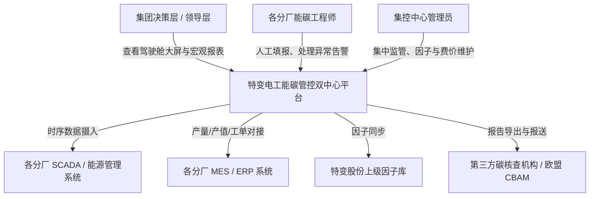

# 🛠️ 系统总体架构设计与 C4 模型规范手册

## 1. 架构设计哲学与原则 (Architectural Principles)
1. **DDD 领域驱动设计 (Domain-Driven Design)**：系统划分为 6 大界限上下文（组织拓扑域、能源采集域、指标核算域、碳资产域、诊断告警域、产品碳足迹域），严格定义聚合根 (Aggregate Root) 与值对象。
2. **读写分离与分层存储 (Polyglot Persistence)**：
   - 关系型业务数据（组织、因子、费价、规则、用户）：**MySQL 8.0 主备**；
   - 海量高频时序量测数据（秒级/分钟级电、水、气、光伏、储能采样）：**时序数据库 TDengine / IoTDB**；
   - 热点数据与并发控制：**Redis 7.0 分布式集群 (Redlock + 缓存防御)**；
   - 文件与报告归档：**MinIO 对象存储**。
3. **高可用 SLA 保证 (99.95%)**：无单点故障 (No SPOF)，支持服务动态横向扩容与优雅降级。

---

## 2. C4 架构模型

### 2.1 System Context (系统上下文)


### 2.2 Container Diagram (容器架构图)
```mermaid
graph TB
    subgraph ClientTier["客户端层"]
        WebPC[Web 管理后台 (PC 端)]
        Screen[大屏可视化驾驶舱 (4K)]
        Mobile[企业微信 / 移动端通知]
    end

    subgraph GatewayTier["接入与网关层"]
        Kong[Kong / Nginx API Gateway<br/>(TLS 1.3, 鉴权, 令牌桶限流)]
    end

    subgraph ServiceMesh["核心微服务集群"]
        AuthSvc[认证与权限服务 (Auth Service)]
        OrgSvc[组织与拓扑台账服务 (Org Service)]
        TelemetrySvc[时序采集与数据摄入服务 (Telemetry Ingestion)]
        CalcWorker[能碳指标计算引擎 (Calculation Worker)]
        CarbonReportSvc[碳管理与报告服务 (Carbon & Report Service)]
        AlertSvc[告警规则与闭环流转服务 (Alert Service)]
        AIAssistantSvc[AI 智能问数与归因大模型服务 (LLM Agent)]
    end

    subgraph StorageTier["存储与消息中间件"]
        MySQL[(MySQL 8.0 主备集群)]
        IoTDB[(TDengine / IoTDB 时序库)]
        RedisCluster[(Redis 7.0 分布式集群)]
        KafkaMQ{{Kafka 消息队列}}
        MinIO[(MinIO 对象存储)]
    end

    ClientTier --> Kong
    Kong --> ServiceMesh
    TelemetrySvc --> KafkaMQ
    KafkaMQ --> CalcWorker
    ServiceMesh --> MySQL
    TelemetrySvc --> IoTDB
    CalcWorker --> IoTDB
    ServiceMesh --> RedisCluster
    CarbonReportSvc --> MinIO
```

---

## 3. 数据库核心 DDL 规范 (MySQL 8.0)

```sql
-- 组织与工厂台账表
CREATE TABLE `t_org_unit` (
    `id` BIGINT UNSIGNED NOT NULL AUTO_INCREMENT COMMENT '主键ID',
    `unit_code` VARCHAR(64) NOT NULL COMMENT '组织编码',
    `unit_name` VARCHAR(128) NOT NULL COMMENT '组织名称',
    `unit_level` TINYINT NOT NULL COMMENT '层级: 1-集团, 2-一级经营单位, 3-二级项目公司, 4-车间/产线',
    `parent_id` BIGINT UNSIGNED NOT NULL DEFAULT 0 COMMENT '父级ID',
    `park_name` VARCHAR(128) DEFAULT NULL COMMENT '所属零碳园区名称',
    `is_connected` TINYINT NOT NULL DEFAULT 1 COMMENT '是否本次接入: 1-已接入, 0-置灰未接入',
    `created_at` DATETIME(3) NOT NULL DEFAULT CURRENT_TIMESTAMP(3),
    `updated_at` DATETIME(3) NOT NULL DEFAULT CURRENT_TIMESTAMP(3) ON UPDATE CURRENT_TIMESTAMP(3),
    PRIMARY KEY (`id`),
    UNIQUE KEY `uk_unit_code` (`unit_code`),
    KEY `idx_parent_level` (`parent_id`, `unit_level`)
) ENGINE=InnoDB DEFAULT CHARSET=utf8mb4 COLLATE=utf8mb4_unicode_ci COMMENT='组织架构与园区工厂台账表';

-- 指标元数据表
CREATE TABLE `t_indicator_meta` (
    `id` BIGINT UNSIGNED NOT NULL AUTO_INCREMENT COMMENT '指标ID',
    `indicator_code` VARCHAR(64) NOT NULL COMMENT '指标英文标识',
    `indicator_name` VARCHAR(128) NOT NULL COMMENT '指标中文名',
    `category` VARCHAR(64) NOT NULL COMMENT '指标类别: 碳排放/综合能耗/单位产品能耗/单位产值能耗/关键工序/绿电',
    `unit` VARCHAR(32) NOT NULL COMMENT '计量单位',
    `center_type` ENUM('集控', '集采') NOT NULL DEFAULT '集控' COMMENT '所属中心',
    `calc_formula` TEXT NOT NULL COMMENT '计算公式表达式文本',
    `calc_period` ENUM('REALTIME', 'DAY', 'MONTH', 'YEAR') NOT NULL DEFAULT 'MONTH' COMMENT '核算周期',
    `standard_value` DECIMAL(14, 4) DEFAULT NULL COMMENT '国家/行业标杆值',
    `benchmark_value` DECIMAL(14, 4) DEFAULT NULL COMMENT '集团内部基准值',
    `created_at` DATETIME(3) NOT NULL DEFAULT CURRENT_TIMESTAMP(3),
    PRIMARY KEY (`id`),
    UNIQUE KEY `uk_indicator_code` (`indicator_code`)
) ENGINE=InnoDB DEFAULT CHARSET=utf8mb4 COLLATE=utf8mb4_unicode_ci COMMENT='指标元数据与基准配置表';

-- 指标核算结果快照表
CREATE TABLE `t_indicator_record` (
    `id` BIGINT UNSIGNED NOT NULL AUTO_INCREMENT COMMENT '主键ID',
    `org_unit_id` BIGINT UNSIGNED NOT NULL COMMENT '所属组织工厂ID',
    `indicator_id` BIGINT UNSIGNED NOT NULL COMMENT '指标ID',
    `period_date` VARCHAR(16) NOT NULL COMMENT '统计周期标签 (如 2026-08)',
    `actual_value` DECIMAL(16, 4) NOT NULL COMMENT '实际计算值',
    `yoy_delta_rate` DECIMAL(8, 4) DEFAULT NULL COMMENT '同比变化率(%)',
    `mom_delta_rate` DECIMAL(8, 4) DEFAULT NULL COMMENT '环比变化率(%)',
    `status` ENUM('EXCELLENT', 'NORMAL', 'ALERT') NOT NULL DEFAULT 'NORMAL' COMMENT '判定状态',
    `raw_payload` JSON DEFAULT NULL COMMENT '参与计算的原始入参快照',
    `ai_reasoning` TEXT DEFAULT NULL COMMENT 'AI生成的异常归因结论',
    `created_at` DATETIME(3) NOT NULL DEFAULT CURRENT_TIMESTAMP(3),
    PRIMARY KEY (`id`),
    UNIQUE KEY `uk_unit_ind_period` (`org_unit_id`, `indicator_id`, `period_date`),
    KEY `idx_period_status` (`period_date`, `status`)
) ENGINE=InnoDB DEFAULT CHARSET=utf8mb4 COLLATE=utf8mb4_unicode_ci COMMENT='指标周期核算结果与归因表';

-- 碳排因子多版本库
CREATE TABLE `t_emission_factor` (
    `id` BIGINT UNSIGNED NOT NULL AUTO_INCREMENT COMMENT '主键ID',
    `factor_code` VARCHAR(64) NOT NULL COMMENT '因子标识',
    `factor_name` VARCHAR(128) NOT NULL COMMENT '因子名称 (如 全国电网平均因子/省级电力因子)',
    `factor_value` DECIMAL(12, 6) NOT NULL COMMENT '因数值 (tCO2/MWh 或 kgCO2/kg)',
    `unit` VARCHAR(32) NOT NULL COMMENT '单位',
    `version_tag` VARCHAR(32) NOT NULL COMMENT '版本号 (如 2026-V1.0)',
    `is_active` TINYINT NOT NULL DEFAULT 1 COMMENT '是否当前生效',
    `source_reference` VARCHAR(255) DEFAULT NULL COMMENT '依据来源',
    `created_at` DATETIME(3) NOT NULL DEFAULT CURRENT_TIMESTAMP(3),
    PRIMARY KEY (`id`),
    UNIQUE KEY `uk_factor_version` (`factor_code`, `version_tag`)
) ENGINE=InnoDB DEFAULT CHARSET=utf8mb4 COLLATE=utf8mb4_unicode_ci COMMENT='碳排放因子多版本管理表';
```
