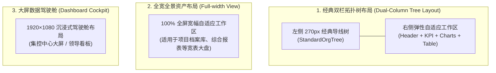

# 🎨 05. 前端开发手册与 UI 设计规范体系 (TBEA Design System v1.01)

> **版本**：v1.0.1 (工业级标准正式版)  
> **适用平台**：特变电工（电装集团）“双中心”数字化集成平台（零碳园区集控中心 + 产品碳足迹集采中心）  
> **技术底座**：Next.js 16.3 (Turbopack) + React 19 + TypeScript 5.7+ + Tailwind CSS 4.3 + Lucide Icons + Recharts 3.10  
> **归口团队**：多 Agent 联合工程架构组 (PM + UI/UX + Frontend + QA + Security)

---

## 🏛️ 一、 设计哲学与系统定位

特变电工“双中心”平台面向集团管理层、各直属基地厂长、能源工程师与双碳审计员，设计遵循 **“工业严谨、现代清爽、高效透视、等宽精准”** 四大核心原则：

1. **工业严谨 (Industrial Rigor)**：采用经典 270px 导线组织拓扑树与双层级穿透（集团大盘 ⇄ 基地车间），贴合大型工业制造企业的管理心智。
2. **现代清爽 (Modern Bento & Clean Tone)**：以浅灰蓝底色 (`#f0f2f5`) 搭配纯白卡片 (`#ffffff`)，采用 Bento Grid 现代化分块架构，消除传统工业软件的沉闷感。
3. **高效透视 (Actionable & Transparent)**：全量支持多维时序筛选（日/月/季/年）、多介质切换、排序与流式 Excel 导出。
4. **等宽精准 (Monospace & Tabular Alignment)**：所有计量数字、时序采样、财务金额与指标全量启用 `JetBrains Mono` 与 `tabular-nums` 等宽排版，杜绝字符抖动与错位。

---

## 🎨 二、 视觉 Design Tokens 变量体系

### 2.1 基础色系与表面 Token (`globals.css`)

```css
:root {
  color-scheme: light;
  --radius: 0.5rem;

  /* 基础底色与表面色 (TBEA Modern Light Industrial Style) */
  --background: #f0f2f5;          /* 全局浅灰蓝底色 */
  --foreground: #1f2937;          /* 高对比度主文本深色 */
  --panel: #ffffff;               /* 纯白卡片背景 */
  --panel-foreground: #1f2937;
  --border: #e2e8f0;              /* 1px 工业细腻边框 (border-slate-200) */
  --input: #d9d9d9;
  --ring: rgba(22, 119, 255, 0.4);

  /* 品牌核心主色 */
  --primary: #1677ff;             /* TBEA 标志性皇家科技蓝 */
  --primary-foreground: #ffffff;
  --sidebar: #0958d9;             /* 左侧经典深蓝背景 */
  --sidebar-foreground: #ffffff;
  --sidebar-accent: #1677ff;
  --sidebar-border: rgba(255, 255, 255, 0.12);
}
```

### 2.2 能源介质与业务语义色彩表 (Semantic Colors)

| 业务/介质分类 | 官方色值 | Tailwind 常用类 | 语义与场景应用 |
| :--- | :---: | :--- | :--- |
| **品牌科技蓝** | `#1677ff` | `text-[#1677ff] bg-blue-50 border-blue-200` | 主操作按钮、选中国标项、电力主负荷 |
| **低碳翡翠绿** | `#52c41a` | `text-emerald-700 bg-emerald-50 border-emerald-200` | 绿电替代、光伏出力、考核达标、运行正常 |
| **暖阳橙** | `#fa8c16` | `text-amber-700 bg-amber-50 border-amber-200` | 储能配置、天然气介质、预警提示、规划状态 |
| **双碳优雅紫** | `#722ed1` | `text-purple-700 bg-purple-50 border-purple-200` | 碳减排量、蒸汽工质、微电网协同、智慧微网 |
| **水务青湖蓝** | `#13c2c2` | `text-cyan-700 bg-cyan-50 border-cyan-200` | 工业水务、新鲜水、软化水、循环冷却 |
| **超标警报红** | `#f5222d` | `text-rose-700 bg-rose-50 border-rose-200` | 越限告警、断线停运、超标未达标、删除操作 |

### 2.3 字体排版标尺 (Typography)

```css
/* 字体栈规范 */
--font-sans: 'Inter', 'PingFang SC', 'Microsoft YaHei', 'Noto Sans SC', system-ui, -apple-system, sans-serif;
--font-mono: 'JetBrains Mono', 'SF Mono', 'Consolas', monospace;
```

* **主标题 (Page Title)**：`text-base font-bold text-slate-800` (16px, 700)
* **卡片标题 (Card Title)**：`text-xs font-bold text-slate-800 tracking-wider` (12px, 700)
* **KPI 关键数字 (Key Metrics)**：`text-2xl font-extrabold font-mono text-slate-900` (24px, 800)
* **正文与表格文本 (Body / Table)**：`text-xs text-slate-800 font-sans` (12px, 400~500)
* **辅助说明与时间戳 (Caption / Meta)**：`text-[11px] text-slate-500 font-mono` (11px, 400)

### 2.4 布局间距与圆角标尺 (Spacing & Radius)

* **全局模块间距**：统一 `gap-3.5` (14px)
* **卡片内边距**：标准卡片 `p-3.5` (14px)，核心指标/大弹窗 `p-5` 或 `p-6` (20px~24px)
* **卡片圆角**：业务卡片 `rounded-xl` (12px)，大弹窗 `rounded-2xl` (16px)，按钮 `rounded-lg` (8px)，小型 Badge `rounded` (4px)

---

## 📐 三、 页面三大标准布局模版



---

## 🧩 四、 核心通用组件设计标准

### 4.1 统一页面标题栏 (Page Header)

统一放置在右侧工作区顶部，具备标准的左侧浅蓝图标方块 + 主标题 + 右侧多维筛选/导出工具栏：

```tsx
<div className="bg-white p-3.5 rounded-xl border border-slate-200 shadow-xs flex flex-wrap items-center justify-between gap-3">
  <div className="flex items-center gap-3">
    <div className="size-9 rounded-lg bg-blue-50 border border-blue-200 flex items-center justify-center text-[#1677ff] shrink-0">
      <FileSpreadsheet className="size-5" />
    </div>
    <div>
      <h1 className="text-base font-bold text-slate-800">用能报表</h1>
    </div>
  </div>

  <div className="flex flex-wrap items-center gap-2">
    {/* 周期切换 / 筛选下拉框 / 导出 Excel 按钮 */}
  </div>
</div>
```

### 4.2 Bento 栅格指标卡片 (Bento KPI Cards)

指标卡片采用横向 4 列等分（或 2 列响应式），具备分类微型 Icon、主数值、同比/环比/折标副属性：

```tsx
<div className="bg-white p-3.5 rounded-xl border border-slate-200 shadow-xs flex items-center justify-between">
  <div>
    <span className="text-xs text-slate-500 block font-medium">综合用能总折标</span>
    <div className="text-2xl font-extrabold font-mono text-slate-900 mt-0.5">
      48,320.5 <span className="text-xs font-sans text-slate-500 font-normal">tce</span>
    </div>
    <span className="text-[10px] text-emerald-600 block mt-1 font-mono font-bold">
      ↓ 5.8% 同比下降
    </span>
  </div>
  <div className="size-10 rounded-lg bg-blue-50 border border-blue-200 flex items-center justify-center text-[#1677ff]">
    <Zap className="size-5" />
  </div>
</div>
```

### 4.3 经典工业级导线组织树 (Classic Show-Line Tree)

* **固定宽度**：`270px`，带 `shrink-0`，支持独立滚动；
* **视觉特征**：支持树连接导线（Show-Line）、三级节点（集团总部 ➔ 6 大制造基地 ➔ 26+ 车间工序）、节点数量徽章、快速模糊搜索与全部展开/折叠。

### 4.4 工业级数据表格规范 (Industrial Data Table)

* **表头设计**：`bg-slate-50 text-slate-600 font-bold font-sans border-b border-slate-200`，字号 `text-xs`；
* **行悬停态**：`hover:bg-blue-50/40 transition-colors cursor-pointer group`；
* **数值排版**：数字一律使用 `font-mono` 且靠右对齐 (`text-right`)，状态标签居中 (`text-center`)；
* **表尾汇总条**：`bg-slate-50/50 p-3 border-t border-slate-100` 显示当前筛选数据条数与总投资/能耗/减碳汇总。

### 4.5 宽幅大模态弹窗规范 (Max-W-5xl Modal)

* **容器尺寸**：统一为 **`w-full max-w-5xl max-h-[92vh] rounded-2xl shadow-2xl`**；
* **Header 区域**：平滑渐变背景 `bg-gradient-to-r from-slate-50 via-blue-50/30 to-slate-50`，左侧独立 `size-12 rounded-2xl` 矢量 Icon 方块，主标题平铺展示名称、编码标签、类别徽章与状态 Badge；
* **Body 区域**：采用 **Bento 栅格（顶部 4 列 KPI + 中部 7:5 左右双栏）** 布局，左右分别为时序里程碑/财务参数与附件档案清单；
* **Footer 区域**：左侧提供辅助动作（如「编辑维护」），右侧提供主要动作（如「导出 PDF」与「关闭」）。

---

## ⚡ 五、 组件 8 种核心交互状态机规范

| 状态名称 | 视觉表现 | 代码类名规范 |
| :--- | :--- | :--- |
| **1. Normal (默认态)** | 纯白背景，`border-slate-200` 细边框，字体清晰对比 | `bg-white border border-slate-200 text-slate-800` |
| **2. Hover (悬停态)** | 边框微渐变到科技蓝，背景微透浅蓝 | `hover:border-blue-300 hover:bg-blue-50/40 transition-all` |
| **3. Active (选中态)** | 浅蓝底色，科技蓝文字，加粗加深 | `bg-blue-50 text-[#1677ff] font-bold border-blue-200` |
| **4. Focus (焦点态)** | 2px 科技蓝光晕轮廓 | `focus:outline-none focus:ring-2 focus:ring-[#1677ff]/30` |
| **5. Loading (加载态)** | 带有脉冲流动光效的 Skeleton 骨架屏 | `animate-pulse bg-slate-200 rounded-lg` |
| **6. Disabled (禁用态)** | 灰度 50%，鼠标禁用手势 | `opacity-50 cursor-not-allowed bg-slate-100` |
| **7. Empty (空状态)** | 工业风缺省插画 + 提示说明文案 | 居中展示 `FileX2` 图标 + “暂无该周期明细数据” |
| **8. Alert (异常超标态)** | 柔和红色警告边框 + 闪烁红点 | `border-rose-300 bg-rose-50/50 text-rose-700` |

---

## 🛠️ 六、 前端工程与代码编写准则

1. **零警告零报错**：所有页面与组件必须保持 100% TypeScript 类型安全与 Next.js 静态构建全绿通过；
2. **数字计算防崩溃**：除零防御（`total > 0 ? (a / total) : 0`）、浮点数四舍五入防溢出（`toFixed(1)` / `toFixed(2)`）；
3. **组件原子化复用**：复杂看板提取至 `components/shared/`，公共图表统一调用 `components/shared/charts.tsx`；
4. **性能与流式渲染**：客户端高频交互组件标记 `'use client'`，重计算使用 `useMemo` 缓存，大数据量渲染使用虚拟滚动或分页。
