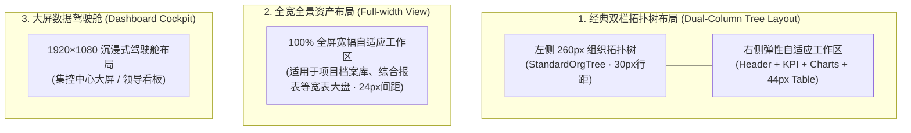

# 🎨 05. 前端开发手册与 UI 设计规范体系 (TBEA Design System v1.1.0)

> **版本**：v1.1.0 (依据官方《UI页面修改 (2).pdf》全面升级版)  
> **适用平台**：特变电工（电装集团）“双中心”数字化集成平台（零碳园区集控中心 + 产品碳足迹集采中心）  
> **技术底座**：Next.js 16.3 (Turbopack) + React 19 + TypeScript 5.7+ + Tailwind CSS 4.3 + Lucide Icons + Recharts 3.10  
> **归口团队**：多 Agent 联合工程架构组 (PM + UI/UX + Frontend + QA + Security)  
> **权威参考依据**：
> 1. 《UI页面修改 (2).pdf》（特变电工官方下发核心 UI 界面设计与视觉规范文件）  
> 2. [`36_UI页面设计规范与工业视觉标准手册.md`](./36_UI页面设计规范与工业视觉标准手册.md)（官方 UI 变更细化落地手册）  
> 3. [`37_左上角品牌规范与双中心导航交互开发手册.md`](./37_左上角品牌规范与双中心导航交互开发手册.md)（导航栏与品牌规范专项手册）  
> 4. 项目专属技能：[`tbea-industrial-design`](../.gemini/skills/tbea-industrial-design/SKILL.md) 与 [`AGENTS.md`](../AGENTS.md)

---

> [!IMPORTANT]
> **权威规范升级声明**：本手册已依据特变电工官方最新下发的《UI页面修改 (2).pdf》完成全量 Design Tokens、色彩字典、组件规格与人机工程的全面升级！全系统严格执行 **`#F3F7FB` 主背景底色、`24px` 板块间距、`8px` 面板圆角、`44px` 工业表格行高、8 大能源介质与 4 段分时电量标准色字典、`260px` 侧边栏宽度、`30px` 导航/树文字间距、`80×36px` 导出按钮及 `200×36px` 输入下拉框**。

---

## 🏛️ 一、 设计哲学与系统定位

特变电工“双中心”平台面向集团管理层、各直属基地厂长、能源工程师与双碳审计员，设计遵循 **“工业严谨、现代清爽、高效透视、等宽精准”** 四大核心原则：

1. **工业严谨 (Industrial Rigor)**：采用经典 260px 宽度组织拓扑树与双层级穿透（集团大盘 ⇄ 基地车间），节点间距统一 30px，激活态呈现浅蓝圆角底色 `#EBF3FF`，贴合大型工业制造企业的管理心智。
2. **现代清爽 (Modern Bento & Clean Tone)**：以浅灰蓝底色 (`#F3F7FB`) 搭配纯白面板 (`#FFFFFF`)，面板描边 `#DBE6EE`，圆角固定 `8px`，板块间距拉开 `24px`，消除纯白刺眼眩光与视觉拥挤感。
3. **高效透视 (Actionable & Transparent)**：全量支持多维时序筛选（日/月/季/年）、多介质切换、排序与流式 Excel 导出（导出按钮统一 `80px × 36px`，实心蓝 `#2C7CFF`）。
4. **等宽精准 (Monospace & Tabular Alignment)**：所有计量数字、时序采样、财务金额与指标全量启用 `JetBrains Mono` 与 `tabular-nums` 等宽排版，核心数值统一 `24px 加粗`，杜绝字符抖动与错位。

---

## 🎨 二、 视觉 Design Tokens 变量体系 (基于《UI页面修改 (2).pdf》)

### 2.1 基础色系与表面 Token (`globals.css`)

```css
:root {
  color-scheme: light;
  --radius: 8px;                  /* 面板与核心控件圆角固定 8px */

  /* 基础底色与表面色 (依据《UI页面修改 (2).pdf》权威基准) */
  --background: #F3F7FB;          /* 全局浅灰蓝主底色，柔和防眩光 */
  --foreground: #1c2024;          /* 高对比度主文本深色 */
  --panel: #FFFFFF;               /* 纯白面板与卡片填充色 */
  --panel-foreground: #1c2024;
  --border: #DBE6EE;              /* 统一面板浅蓝灰工业描边 */
  --input: #E2E8F0;               /* 输入框与下拉框边框色 */
  --ring: rgba(44, 124, 255, 0.4);

  /* 品牌核心主色 */
  --primary: #2C7CFF;             /* 特变电工标准科技蓝 (主题色/总用电量) */
  --primary-foreground: #ffffff;
  --sidebar: #0958d9;             /* 左侧科技深蓝背景 */
  --sidebar-foreground: #ffffff;
  --sidebar-accent: #2C7CFF;
  --sidebar-border: rgba(255, 255, 255, 0.15);
}
```

### 2.2 8 大能源介质与分时电量 4 段色彩字典 (Color Tokens)

系统严格规范 8 大能源介质与 TOU 峰平谷分时电量标准色，全站图表、卡片指标、进度条及徽章 100% 同步执行：

#### （1）8 大能源介质标准色表

| 序号 | 能源介质名称 | 标准 Hex 色值 | Tailwind 类名 | 业务场景与图表映射 |
| :---: | :--- | :---: | :--- | :--- |
| **1** | **主题科技蓝 / 总用电量** | **`#2C7CFF`** | `bg-[#2C7CFF] text-[#2C7CFF]` | 平台主题主色、全厂总用电量折线/柱状图、主操作按钮 |
| **2** | **市电量** | **`#41C0FF`** | `bg-[#41C0FF] text-[#41C0FF]` | 电网购入电量、市电供应占比、受电变压器监测 |
| **3** | **直供绿电量** | **`#00D492`** | `bg-[#00D492] text-[#00D492]` | 分布式光伏发电、市场化绿电直购、零碳绿电消纳率 |
| **4** | **水资源** | **`#10C4CE`** | `bg-[#10C4CE] text-[#10C4CE]` | 新鲜工业用水、循环冷却水消耗、万元产值用水量 |
| **5** | **天然气** | **`#FF6536`** | `bg-[#FF6536] text-[#FF6536]` | 窑炉天然气消耗、锅炉燃烧热力、烘房用气监测 |
| **6** | **蒸汽** | **`#FFBA00`** | `bg-[#FFBA00] text-[#FFBA00]` | 外购蒸汽总量、工艺干燥固化蒸汽单耗 |
| **7** | **油消耗** | **`#8E73ED`** | `bg-[#8E73ED] text-[#8E73ED]` | 变压器油注油台账、柴油发电机应急燃油消耗 |
| **8** | **液氮** | **`#4F39F6`** | `bg-[#4F39F6] text-[#4F39F6]` | 低温试验保护、特殊制造氮气介质消耗 |

#### （2）分时电量 4 段类型色表 (TOU: 尖 / 峰 / 平 / 谷)

| 时段类型 | 标准 Hex 色值 | 视觉语义 | 界面图表与指示要求 |
| :---: | :---: | :--- | :--- |
| **尖峰 (Sharp Peak)** | **`#FF6536`** | 警示热力橙红 | 尖峰时段用电量、避峰负荷监测、尖峰电量占比饼图 |
| **高峰 (Peak)** | **`#FFBA00`** | 活力明朗金黄 | 高峰时段用电量、生产班次负荷走势 |
| **平段 (Flat)** | **`#2C7CFF`** | 稳健主题科技蓝 | 平段时段用电量、常规连续负荷 |
| **低谷 (Valley)** | **`#10C4CE`** | 低谷生态湖蓝青 | 低谷蓄能用电、储能充电时段用电量、谷电消纳占比 |

### 2.3 字体排版标尺 (Typography Hierarchy)

```css
/* 字体栈规范 */
--font-sans: 'Inter', 'PingFang SC', 'Microsoft YaHei', 'Noto Sans SC', system-ui, -apple-system, sans-serif;
--font-mono: 'JetBrains Mono', 'SF Mono', 'Consolas', monospace;
```

* **面板主标题 (Panel Title)**：`text-base font-bold text-slate-800` (**`16px 加粗`**)
* **卡片标题 (Card Title)**：`text-sm font-medium text-slate-700` (**`14px`**)
* **KPI 关键主数字 (Key Metrics)**：`text-2xl font-bold font-mono text-slate-900` (**`24px 加粗`**)
* **正文与表格文本 (Body / Table)**：`text-sm text-slate-800 font-sans` (**`14px`**，表格行高强制 **`44px`**)
* **辅助说明与单位 (Caption / Unit)**：`text-sm text-slate-500` (**`14px`**)

### 2.4 布局间距、圆角与控制组件标尺 (Spacing & Controls)

* **全局板块间距**：统一修改为 **`24px`** (`gap-6` / `space-y-6`)
* **面板/卡片填充与描边**：填充 `#FFFFFF`，描边 `#DBE6EE`，圆角固定 **`8px`** (`rounded-lg`)
* **侧边导航栏规格**：宽度统一固定为 **`260px`** (`w-[260px]`)，导航与树文字间距/行高增大到 **`30px`**
* **TAB 切换组件**：激活项为实心主题蓝 **`#2C7CFF`** 胶囊 + 白字 + **`8px`** 圆角，未激活项纯文本无背景
* **导出按钮规格**：宽度固定 **`80px`**，高度固定 **`36px`**，背景填充 **`#2C7CFF`**，圆角 **`8px`**，白色下载图标 + 白字
* **输入/下拉框规格**：推荐宽度 **`200px`**，高度固定 **`36px`**，背景纯白 `#FFFFFF`，描边 `#E2E8F0`，圆角 **`8px`**

---

## 📐 三、 页面三大标准布局模版


```mermaid
graph TD
    subgraph Arch1["1. 经典双栏拓扑树布局 (Dual-Column Tree Layout)"]
        Tree["左侧 260px 组织拓扑树<br/>(StandardOrgTree · 30px行距)"]
        Work1["右侧弹性自适应工作区<br/>(Header + KPI + Charts + 44px Table)"]
        Tree --- Work1
    end

    subgraph Arch2["2. 全宽全景资产布局 (Full-width View)"]
        Work2["100% 全屏宽幅自适应工作区<br/>(适用于项目档案库、综合报表等宽表大盘 · 24px间距)"]
    end

    subgraph Arch3["3. 大屏数据驾驶舱 (Dashboard Cockpit)"]
        Work3["1920×1080 沉浸式驾驶舱布局<br/>(集控中心大屏 / 领导看板)"]
    end
```

---

## 🧩 四、 核心通用组件设计标准

### 4.1 统一页面标题栏 (Page Header)

统一放置在右侧工作区顶部，具备标准的左侧浅蓝图标方块 + 主标题 + 右侧多维筛选/导出工具栏（导出按钮统一 80×36px，填充 `#2C7CFF`）：

```tsx
<div className="bg-white p-4 rounded-lg border border-[#DBE6EE] shadow-xs flex flex-wrap items-center justify-between gap-4">
  <div className="flex items-center gap-3">
    <div className="size-9 rounded-lg bg-blue-50 border border-blue-200 flex items-center justify-center text-[#2C7CFF] shrink-0">
      <FileSpreadsheet className="size-5" />
    </div>
    <div>
      <h1 className="text-base font-bold text-slate-800">用能报表</h1>
    </div>
  </div>

  <div className="flex flex-wrap items-center gap-3">
    {/* 周期切换 TAB (实心蓝胶囊) / 200×36px 筛选下拉框 / 80×36px 导出按钮 */}
  </div>
</div>
```

### 4.2 标准指标卡片 (Metric Cards)

依据《UI页面修改 (2).pdf》，指标卡片标题为 14px，主数值为 24px 加粗 Mono，其他辅助说明与单位为 14px：

```tsx
<div className="bg-white p-4 rounded-lg border border-[#DBE6EE] shadow-xs flex items-center justify-between">
  <div>
    <span className="text-sm text-slate-700 block font-medium">综合能源消费量</span>
    <div className="text-2xl font-bold font-mono text-slate-900 mt-1">
      12,845 <span className="text-sm font-sans text-slate-500 font-normal">tce</span>
    </div>
    <span className="text-sm text-primary block mt-1 font-mono">
      同比 -4.8% ↗
    </span>
  </div>
  <div className="size-10 rounded-lg bg-blue-50 border border-blue-200 flex items-center justify-center text-[#2C7CFF]">
    <Zap className="size-5" />
  </div>
</div>
```

### 4.3 企业组织拓扑树 (Organization Topology Tree)

* **固定宽度**：**`260px`**，带 `shrink-0`，支持独立滚动；
* **视觉特征**：支持树连接导线、节点文字垂直间距/行高统一 **`30px`**，搜索框规范化（“请输入搜索关键词”），层级语义图标（集团/公司使用建筑图标，工厂/车间使用架构图标），激活选中态呈现浅蓝圆角底色 **`#EBF3FF`** + 蓝字高亮。

### 4.4 工业级数据表格规范 (Industrial Data Table)

* **强制行高**：全系统数据表格行高统一固定为标准的 **`44px`**（`h-[44px]`），垂直居中，满足高密度工业监控人机工效；
* **表头设计**：`bg-slate-50 text-slate-600 font-bold font-sans border-b border-[#DBE6EE]`，字号 `text-sm`；
* **行悬停态**：`hover:bg-blue-50/40 transition-colors cursor-pointer group`；
* **数值排版**：数字一律使用 `font-mono` 且靠右对齐 (`text-right`)，状态标签居中 (`text-center`)；
* **表尾汇总条**：`bg-slate-50/50 p-3 border-t border-[#DBE6EE]` 显示当前筛选数据条数与总投资/能耗/减碳汇总。

### 4.5 宽幅大模态弹窗规范 (Max-W-5xl Modal)

* **容器尺寸**：统一为 **`w-full max-w-5xl max-h-[92vh] rounded-2xl shadow-2xl`**；
* **Header 区域**：平滑渐变背景 `bg-gradient-to-r from-slate-50 via-blue-50/30 to-slate-50`，左侧独立 `size-12 rounded-2xl` 矢量 Icon 方块，主标题平铺展示名称、编码标签、类别徽章与状态 Badge；
* **Body 区域**：采用 **Bento 栅格（顶部 4 列 KPI + 中部 7:5 左右双栏）** 布局，左右分别为时序里程碑/财务参数与附件档案清单；
* **Footer 区域**：左侧提供辅助动作（如「编辑维护」），右侧提供主要动作（如「导出 PDF」与「关闭」）。

---

## ⚡ 五、 组件 8 种核心交互状态机规范

| 状态名称 | 视觉表现 | 代码类名规范 |
| :--- | :--- | :--- |
| **1. Normal (默认态)** | 纯白背景，`border-slate-200` 细边框，字体清晰对比 | `bg-white border border-slate-200 text-slate-800` |
| **2. Hover (悬停态)** | 边框微渐变到科技蓝，背景微透浅蓝 | `hover:border-blue-300 hover:bg-blue-50/40 transition-all` |
| **3. Active (选中态)** | 浅蓝底色，科技蓝文字，加粗加深 | `bg-blue-50 text-[#1677ff] font-bold border-blue-200` |
| **4. Focus (焦点态)** | 2px 科技蓝光晕轮廓 | `focus:outline-none focus:ring-2 focus:ring-[#1677ff]/30` |
| **5. Loading (加载态)** | 带有脉冲流动光效的 Skeleton 骨架屏 | `animate-pulse bg-slate-200 rounded-lg` |
| **6. Disabled (禁用态)** | 灰度 50%，鼠标禁用手势 | `opacity-50 cursor-not-allowed bg-slate-100` |
| **7. Empty (空状态)** | 工业风缺省插画 + 提示说明文案 | 居中展示 `FileX2` 图标 + “暂无该周期明细数据” |
| **8. Alert (异常超标态)** | 柔和红色警告边框 + 闪烁红点 | `border-rose-300 bg-rose-50/50 text-rose-700` |

---

## 🛠️ 六、 前端工程与代码编写准则

1. **零警告零报错**：所有页面与组件必须保持 100% TypeScript 类型安全与 Next.js 静态构建全绿通过；
2. **数字计算防崩溃**：除零防御（`total > 0 ? (a / total) : 0`）、浮点数四舍五入防溢出（`toFixed(1)` / `toFixed(2)`）；
3. **组件原子化复用**：复杂看板提取至 `components/shared/`，公共图表统一调用 `components/shared/charts.tsx`；
4. **性能与流式渲染**：客户端高频交互组件标记 `'use client'`，重计算使用 `useMemo` 缓存，大数据量渲染使用虚拟滚动或分页。
