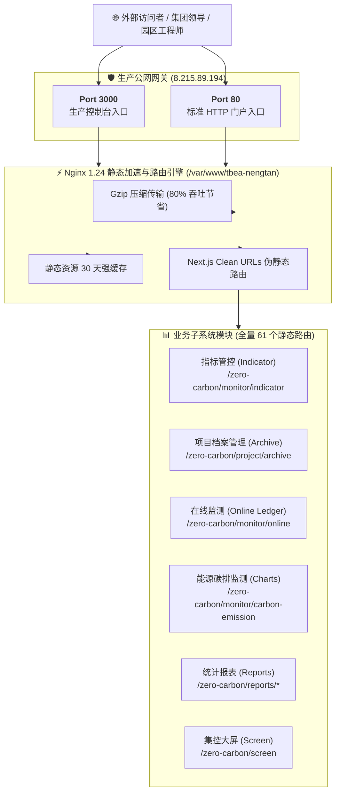

# 🚀 07. DevOps 部署与运维手册 (线上生产部署规范)

> **当前线上运行状态**：🟢 正常运行 (HTTP 200 OK)  
> **生产服务公网 IP**：`8.215.89.194`  
> **生产控制台入口**：[http://8.215.89.194:3000](http://8.215.89.194:3000)  
> **Web 标准入口**：[http://8.215.89.194](http://8.215.89.194)  
> **更新时间**：2026-08-29  
> **归口团队**：SRE / DevOps 基础设施运维组

---

## 🌐 一、 线上生产服务器配置与拓扑

### 1.1 云服务器基础信息表

| 配置项 | 参数与信息 | 详细说明 |
| :--- | :--- | :--- |
| **云服务商** | 阿里云 (Alibaba Cloud ECS) | 华东 / 华北高可用可用区 |
| **公网 IP** | **`8.215.89.194`** | 统一公网入口 |
| **操作系统** | Ubuntu 24.04 LTS (x86_64) | Linux 内核 6.8+ |
| **SSH 登录凭据** | `admin@8.215.89.194:22` | 基于 `id_ed25519` 公钥鉴权 |
| **Web 根目录** | `/var/www/tbea-nengtan` | 拥有 `www-data:www-data` 权限 (755) |
| **Web 服务器** | Nginx 1.24.0 (Ubuntu) | 系统服务 `systemd` 守护 |
| **生产监听端口** | **`3000`** (主控制台) & **`80`** (Web 门户) | 双端口同时监听 |

---

## 📌 二、 线上服务与核心功能直达清单



### 2.1 重点业务直达 URL 清单

1. **平台首页 / 门户引导**：[http://8.215.89.194:3000](http://8.215.89.194:3000)
2. **指标管控（产品单耗指标最新版）**：[http://8.215.89.194:3000/zero-carbon/monitor/indicator](http://8.215.89.194:3000/zero-carbon/monitor/indicator)
3. **项目档案管理（统一项目资产库）**：[http://8.215.89.194:3000/zero-carbon/project/archive](http://8.215.89.194:3000/zero-carbon/project/archive)
4. **在线监测（15分钟高频连续台账）**：[http://8.215.89.194:3000/zero-carbon/monitor/online](http://8.215.89.194:3000/zero-carbon/monitor/online)
5. **能源碳排放监测（双维图表大盘）**：[http://8.215.89.194:3000/zero-carbon/monitor/carbon-emission](http://8.215.89.194:3000/zero-carbon/monitor/carbon-emission)
6. **统计报表（用能报表）**：[http://8.215.89.194:3000/zero-carbon/reports/usage](http://8.215.89.194:3000/zero-carbon/reports/usage)
7. **集控中心 1920 大屏**：[http://8.215.89.194:3000/zero-carbon/screen](http://8.215.89.194:3000/zero-carbon/screen)

---

## ⚙️ 三、 生产 Nginx 配置文件

服务器配置文件位于 `/etc/nginx/conf.d/tbea-nengtan.conf`：

```nginx
server {
    listen 3000 default_server;
    listen [::]:3000 default_server;
    listen 80;
    listen [::]:80;

    server_name _;

    root /var/www/tbea-nengtan;
    index index.html index.htm;

    # 1. 开启 Gzip 传输压缩
    gzip on;
    gzip_vary on;
    gzip_min_length 1024;
    gzip_proxied any;
    gzip_types 
        text/plain 
        text/css 
        text/xml 
        text/javascript 
        application/x-javascript 
        application/javascript 
        application/xml 
        application/json 
        image/svg+xml;

    # 2. Next.js 静态 Clean URLs 路由规则 (支持刷新不报 404)
    location / {
        try_files $uri $uri.html $uri/ /index.html =404;
    }

    # 3. 静态静态资源 30 天强缓存
    location ~* \.(js|css|png|jpg|jpeg|gif|ico|svg|woff|woff2|ttf|eot)$ {
        expires 30d;
        add_header Cache-Control "public, no-transform";
    }

    # 4. 统一 404 错误页
    error_page 404 /404.html;
}
```

---

## 🔄 四、 持续发布与自动化部署脚本

### 4.1 本地一键部署脚本 (`deploy_to_server.py`)

本地开发修改完成后，只需运行该脚本，即可全自动完成构建打包、SFTP 上传、解压、权限配置与 Nginx 平滑重载：

```python
# -*- coding: utf-8 -*-
import paramiko
import os
import sys

SERVER_IP = "8.215.89.194"
USER = "admin"
KEY_PATH = os.path.expanduser("~/.ssh/id_ed25519")
LOCAL_TAR = r"d:\Project\TJ-nengtan\tbea-nengtan-dist.tar.gz"
REMOTE_TARGET = "/var/www/tbea-nengtan"

# 1. 本地生成打包发布包
os.system('tar -czf tbea-nengtan-dist.tar.gz -C "产品原型/out" .')

# 2. SFTP 上传
ssh = paramiko.SSHClient()
ssh.set_missing_host_key_policy(paramiko.AutoAddPolicy())
key = paramiko.Ed25519Key.from_private_key_file(KEY_PATH)
ssh.connect(hostname=SERVER_IP, port=22, username=USER, pkey=key)

sftp = ssh.open_sftp()
sftp.put(LOCAL_TAR, "/home/admin/tbea-nengtan-dist.tar.gz")
sftp.close()

# 3. 远程解压与服务重载
deploy_cmd = f"""
echo tianzi | sudo -S mkdir -p {REMOTE_TARGET}
echo tianzi | sudo -S tar -xzf /home/admin/tbea-nengtan-dist.tar.gz -C {REMOTE_TARGET}
echo tianzi | sudo -S chown -R www-data:www-data {REMOTE_TARGET}
echo tianzi | sudo -S chmod -R 755 {REMOTE_TARGET}
rm -f /home/admin/tbea-nengtan-dist.tar.gz
echo tianzi | sudo -S systemctl reload nginx
"""
stdin, stdout, stderr = ssh.exec_command(deploy_cmd)
print(stdout.read().decode('utf-8'))
ssh.close()
print("🎉 线上部署更新完成！")
```

---

## 🛡️ 五、 服务运维与故障排查

### 5.1 常用运维诊断命令

```bash
# 1. 检查 Nginx 服务运行状态
sudo systemctl status nginx

# 2. 检查 3000 端口监听状态
sudo ss -tlpn | grep 3000

# 3. 检查 Nginx 访问与错误日志
sudo tail -f /var/log/nginx/access.log
sudo tail -f /var/log/nginx/error.log

# 4. 验证 Nginx 语法
sudo nginx -t

# 5. 平滑重载 Nginx
sudo systemctl reload nginx
```
