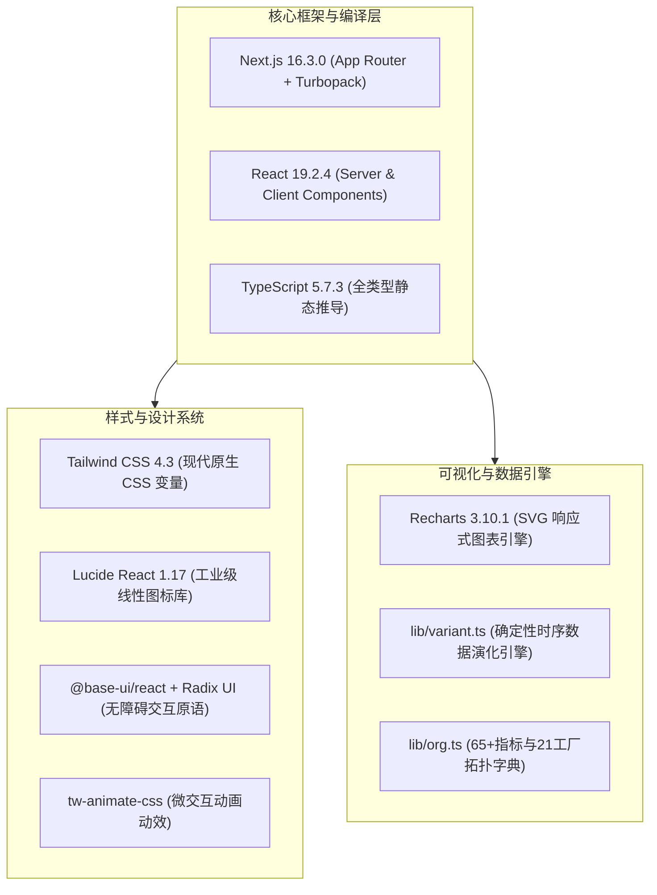
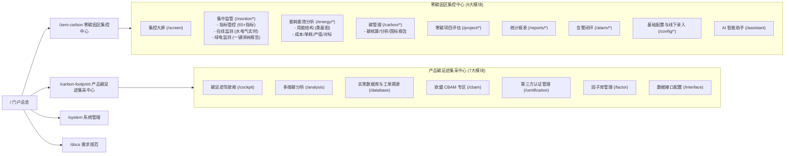

# 📐 特变电工“双中心”产品原型工程架构与技术说明书

本项目是为特变电工（电装集团）定制构建的高保真可交互前端产品原型系统，基于 **Next.js 16 (App Router) + React 19 + TypeScript + Tailwind CSS 4** 架构设计，全面覆盖 **零碳园区集控中心** 与 **产品碳足迹集采中心** 两大核心业务底座，共包含 **53 个业务页面路由**、**20+ 通用业务与基础组件** 及 **7 大核心领域数据字典**。

---

## 🛠️ 一、技术栈选型与工程底座



| 层次/模块 | 选型技术 | 版本 | 核心作用与优势 |
| :--- | :--- | :--- | :--- |
| **运行时框架** | `Next.js` (App Router) | `16.3.0` | 采用 Turbopack 毫秒级极速热重载，支持静态路由预渲染与客户端交互切片 |
| **视图引擎** | `React` | `19.2.4` | 原生支持 Hooks、Actions、Transitions 与现代化状态流转 |
| **开发语言** | `TypeScript` | `5.7.3` | 提供完整的组织节点、指标元数据、时序数据、告警规则的强类型定义 |
| **样式体系** | `Tailwind CSS` | `4.3.3` | 基于 CSS 变量的 Design Tokens，打造深空石板灰与低碳翡翠绿工业科技暗黑风 |
| **图表可视化** | `Recharts` | `3.10.1` | 封装了折线趋势 (`LineTrend`)、面积图 (`AreaTrend`)、环形图 (`Donut`) 与柱状图 |
| **图标体系** | `Lucide React` | `1.17.0` | 统一的现代线性矢量图标体系，覆盖电力、工业、低碳、告警等所有语义 |

---

## 📁 二、项目目录结构与职责划分

```text
d:\Project\TJ-nengtan\产品原型\
├── app/                          # 页面与路由层 (Next.js App Router)
│   ├── layout.tsx                # 全局根布局 (暗黑主题、Inter 字体、Metadata)
│   ├── page.tsx                  # 集团总览双中心门户首页 (Portal)
│   ├── docs/                     # 需求文档与系统规格说明页
│   ├── system/                   # 系统管理 (用户/角色/组织权限/审计日志)
│   ├── zero-carbon/              # 【平台一】零碳园区集控中心 (30+ 路由)
│   │   ├── layout.tsx            # 集控中心外壳 (PlatformShell 注入)
│   │   ├── screen/               # 集控大屏驾驶舱 (GIS 地图、阶段打分、核心 KPI)
│   │   ├── monitor/              # 集中监管 (指标管控 / 在线监测 / 绿电监测)
│   │   ├── energy/               # 能耗能效分析 (用能结构/成本/单耗/产值/对标/综合)
│   │   ├── carbon/               # 碳管理 (碳核算 / 碳分析 / 碳报告与核查)
│   │   ├── project/              # 零碳项目评估 (档案 / 模型 / 效益评估 / 自评估)
│   │   ├── reports/              # 统计报表 (用量 / 成本 / 单耗 / 碳排放)
│   │   ├── alarm/                # 告警管理 (告警记录 / 规则配置 / 多渠道推送)
│   │   ├── config/               # 基础配置 (因子库 / 费价模型 / 折标转换 / 接口 / 线下录入)
│   │   ├── assistant/            # 智能助手 (AI 语音控制与自然语言问数)
│   │   └── data-catalog/         # 零碳数据采集清单
│   └── carbon-footprint/         # 【平台二】产品碳足迹集采中心 (15+ 路由)
│       ├── layout.tsx            # 碳足迹外壳 (PlatformShell 注入)
│       ├── cockpit/              # 碳足迹全景驾驶舱 (LCA 概览、红黑榜、荣誉轮播)
│       ├── analysis/             # 多维碳分析 (同类产品对比、碳热点模型、基准对标)
│       ├── database/             # 实景数据库 (BOM 溯源、工单能耗穿透、ISO 14067 报告)
│       ├── cbam/                 # 欧盟 CBAM 专区 (HS-CN 映射、资质、成本测算、知识库)
│       ├── certification/        # 第三方认证管理 (资料模板、申报流、证书归档)
│       ├── factor/               # 因子库管理 (股份同步、经营单位下发、因子集构建)
│       ├── config/ & interface/  # 接口与字段映射配置
│       └── data-catalog/         # 碳足迹数据采集清单
├── components/                   # 组件层 (Atomic Design 原语与共享业务组件)
│   ├── shared/                   # 全局复用组件
│   │   ├── platform-shell.tsx    # 双中心外壳（双平台胶囊切换、侧边栏折叠、顶栏面包屑）
│   │   ├── primitives.tsx        # 工业原子组件 (Panel, PanelTitle, Badge, StatusBadge, DataTable, KpiCard)
│   │   ├── charts.tsx            # Recharts 响应式图表二次封装
│   │   ├── modal.tsx             # 模态弹窗组件
│   │   ├── select.tsx            # 工业级下拉选择器
│   │   ├── time-range.tsx        # 时间范围与采样频率切换器
│   │   └── enterprise-compare.tsx# 多工厂多单位横向对比视图
│   ├── portal/                   # 集团总览门户专属视图组件
│   ├── system/                   # 系统管理专属视图组件
│   └── docs/                     # 需求文档浏览视图组件
├── lib/                          # 业务逻辑、领域建模与确定性数据引擎
│   ├── org.ts                    # 6 大一级经营单位、21 家二级工厂、15 园区拓扑树
│   ├── indicators.ts             # 65+ 项管控指标字典、计算公式说明与状态判定
│   ├── nav-config.ts             # 双中心全量导航菜单与元数据配置
│   ├── mock-data.ts              # 全局业务时序量测、尖峰平谷、负荷曲线、CBAM 等数据集
│   ├── variant.ts                # 确定性数据演化引擎 (基于 Seed 的无闪烁时序演变算法)
│   ├── data-catalog.ts           # 静态与动态数据采集需求清单
│   └── utils.ts                  # Tailwind 类名合并工具 (`cn`)
├── public/                       # 静态资源 (图片、SVG 图标、Logo)
├── package.json                  # 依赖配置清单
└── tsconfig.json                 # TypeScript 编译选项与路径别名 (`@/*`)
```

---

## 🧭 三、“双中心”核心业务架构与路由矩阵



---

## 🎨 四、视觉与组件规范体系 (Design Tokens)

### 1. 工业科技视觉调色盘 (Color System)
* **深空石板底色 (`--bg-deep`)**：`#0b1120` / `#0f172a`，提供沉浸式中控大屏与工业监控氛围；
* **卡片背景 (`--card`)**：`#1e293b`（附带 `border-border/60` 细边框与悬停微光）；
* **低碳翡翠绿 (`--color-primary`)**：`#10b981` / `#059669`，用于标识达标、绿电、优秀与主操作；
* **科技深海蓝 (`--chart-1`)**：`#0284c7`，用于标识市电负荷、水资源与基准线；
* **警告与异常色**：`#f59e0b`（琥珀黄预警）、`#ef4444`（玫瑰红超标告警）。

### 2. 核心通用业务组件
1. **`PlatformShell`**：全系统顶层外壳，内置顶部平台无缝切换器（集控 ↔ 集采）、左侧收缩菜单、全局时间/园区筛选与快捷系统管理入口；
2. **`Panel` & `PanelTitle`**：Bento Grid 栅格化容器，统一卡片圆角、内边距、边框及标题图标；
3. **`KpiCard`**：核心指标展示卡片，支持数值、单位、同环比变化率徽章与语义色调 (`ok` / `warn` / `danger` / `info`)；
4. **`DataTable`**：响应式工业数据表格，支持斑马纹、状态胶囊徽章与行内操作；
5. **`LineTrend` / `AreaTrend` / `Donut`**：深度封装 Recharts，适配暗黑模式，自适应容器宽高，内置 Tooltip 与图例格式化。

---

## ⚡ 五、确定性动态演化引擎 (`lib/variant.ts`)

为了解决前端原型在演示和评审时“数据假死”或“随机闪烁不稳定”的痛点，工程内置了基于散列因子的**确定性演化引擎**：
1. **`seedFactor(...seeds)`**：将当前选中的组织工厂名称（如“沈变本部”）与统计周期（如“2026-08”）计算为唯一的特征因子（范围 `0.72 ~ 1.28`）；
2. **`vary(dataset, factor, options)`**：根据特征因子等比例缩放数据集中的数值字段，保证**同一工厂/同一时间查出的数据绝对一致稳定**，而**切换工厂或时间时，所有图表与 KPI 联动产生自然合理的时序变化**；
3. **`varyNum(value, factor)`**：单值安全缩放并根据有效数字保留小数位。

---

## 🚀 六、核心业务交互亮点

1. **集中监管 - 指标管控 (`/zero-carbon/monitor/indicator`)**：
   * 左侧组织工厂树快速过滤；
   * 「工厂综合」「产品整体」「关键工序」三级指标 Tab 切换；
   * 卡片展示当前值与同比/环比**差值与百分比**；
   * 右侧滑出抽屉：展示原始数据明细、计算公式说明、近8个月趋势对比折线图及 **AI 根因诊断分析卡片**。
2. **集中监管 - 在线监测 (`/zero-carbon/monitor/online`)**：
   * 拓扑树：工厂 → 产线 → 工序 → 重点用能设备（如 500kW 干燥罐、立塔挤出机）；
   * 电/水/气/蒸汽四介质 Tab 切换；
   * 24小时负荷、光伏发电、储能充放、市电购电**多曲线勾选对比联动**；
   * 尖峰平谷用电结构环形图 + 实时电气参数表（电压/电流/有功/功率因数）。
3. **集中监管 - 绿电监测与消纳报告 (`/zero-carbon/monitor/green`)**：
   * 直供绿电、市场化交易绿电、GEC 绿证认购三大流向精确拆解；
   * 内置**一键生成绿电消纳分析报告**模态框，提供电量公式拆解与 **AI 储能削峰填谷优化与光伏清洗调度建议**。
4. **线下手工数据填报 (`/zero-carbon/config/entry`)**：
   * 针对无自动化表计能源（天然气、柴油、工业增加值）提供合规录入表单。
5. **智能助手 (`/zero-carbon/assistant`)**：
   * 支持语音麦克风唤醒与自然语言智能问数，可生成图表并深层直达目标页面。

---

## 💡 七、开发者扩展与二次开发指引

### 1. 增加新页面/新路由
直接在 `app/zero-carbon/` 或 `app/carbon-footprint/` 目录下新建文件夹和 `page.tsx`，并在 `lib/nav-config.ts` 中的导航数组中添加对应菜单项即可自动在侧边栏渲染。

### 2. 增加/调整管控指标
直接编辑 `lib/indicators.ts` 中的 `indicators` 数组，定义指标的 `id`、`name`、`category`、`formula`、`unit`、`base`、`target` 及 `aiReasoning`。

### 3. 本地编译与启动
```bash
# 进入产品原型目录
cd d:\Project\TJ-nengtan\产品原型

# 启动热重载开发服务器
pnpm dev

# 执行全静态路由编译校验
pnpm build
```
