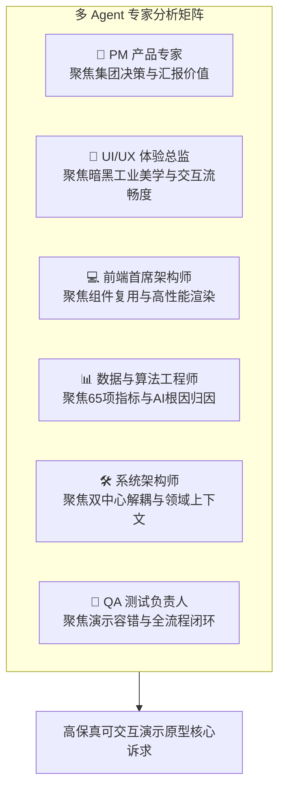
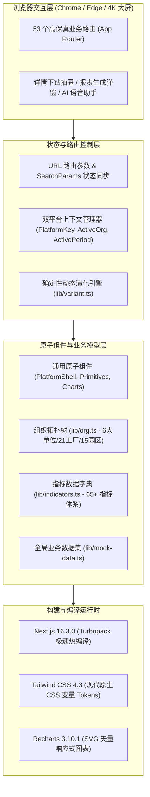
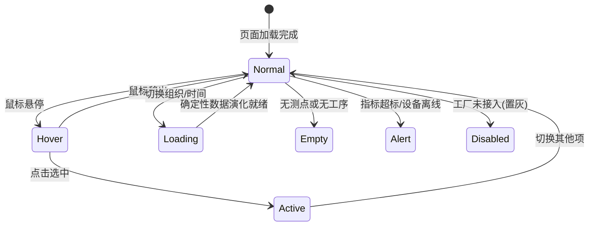
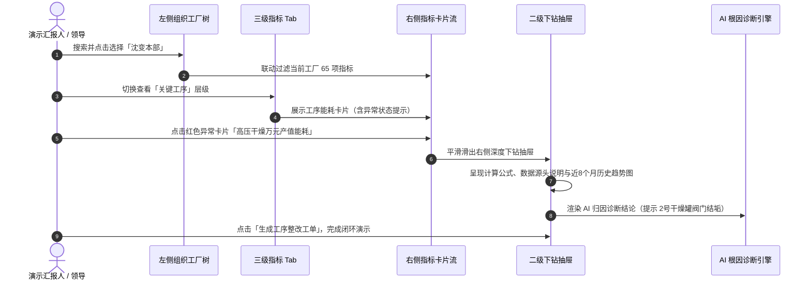
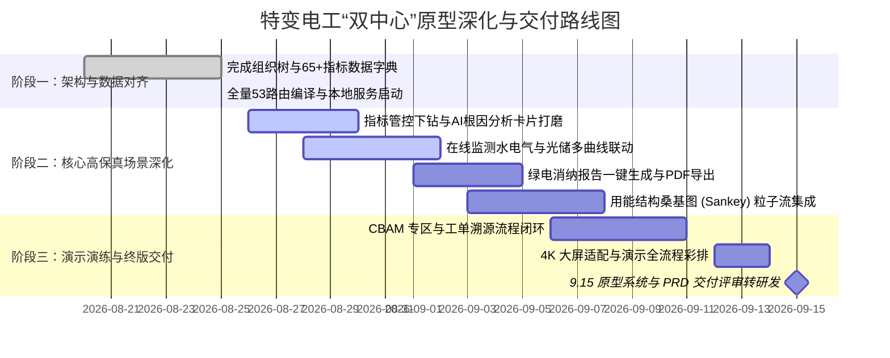

# 🌟 特变电工“双中心”高保真演示原型系统规划与开发建议书

> **文档版本**：V2.0-HighFidelity  
> **编制架构**：多 Agent 专家组（PM 产品专家、UI/UX 体验总监、前端首席架构师、数据与算法工程师、系统架构师、QA 测试负责人）  
> **适用对象**：特变电工（电装集团）项目组、领导汇报团队、产品经理、前端开发团队

---

## 📑 目录索引
1. [多 Agent 视角需求与演示价值解构](#一多-agent-视角需求与演示价值解构)
2. [高保真演示原型总体技术架构](#二高保真演示原型总体技术架构)
3. [UI/UX 设计风格与 Design System 规范](#三uiux-设计风格与-design-system-规范)
4. [核心高保真演示场景与交互动线规划](#四核心高保真演示场景与交互动线规划)
5. [数据真实感与确定性动态演化方案](#五数据真实感与确定性动态演化方案)
6. [原型深化开发实施路线图 (9.15 节点攻坚)](#六原型深化开发实施路线图-915-节点攻坚)

---

## 一、多 Agent 视角需求与演示价值解构



### 1. 🎯 产品经理 (PM) 视角：演示汇报的“三大高光时刻”
* **高光时刻一：集团驾驶舱宏观掌控力** —— 首页总览与 4K 大屏展示 15 个零碳园区地理分布、21 家工厂接入、绿电综合占比 38.6%、万元产值碳排强度下降 6.5%，一屏尽览集团绿色转型成效；
* **高光时刻二：生产现场工序级穿透力** —— 集中监管支持从“沈变公司”到“沈变本部”再到“高压真空干燥工序”，卡片直观呈现当前值、同比/环比差值及比例，并弹出 **AI 根因分析诊断卡片**，让领导看到数字化赋能现场节能的实际落地；
* **高光时刻三：国际合规与出海竞争力** —— 产品碳足迹集采中心展示从原材料 BOM 到工单级实景核算，以及 **欧盟 CBAM 碳关税一键合规申报包** 与 ISO 14067 证书归档，支撑特变装备出海贸易。

### 2. 🎨 UI/UX 体验总监视角：工业科技质感与微交互
* **视觉基调**：摒弃传统工业软件沉闷呆板的灰白表格，采用 **深空石板灰 (`#0b1120`) + 低碳翡翠绿 (`#10b981`) + 科技深海蓝 (`#0284c7`)** 的现代化暗黑科技风格；
* **信息架构**：采用 **Bento Grid（便当盒栅格）** 布局，主次分明，重点指标大字体呼吸排版，卡片带有 1px 极细边框与悬停微光浮动效果；
* **色彩语义严格管控**：绿色代表“达标/优秀/绿电”，蓝色代表“正常/基准/市电”，黄色代表“预警/临期”，红色代表“超标/严重异常”，严格满足 WCAG 2.1 AA 4.5:1 对比度标准。

### 3. 💻 前端首席架构师视角：模块化与可维护性
* 建立统一的 **`PlatformShell` 顶层外壳**，实现“零碳园区集控中心”与“产品碳足迹集采中心”两大业务系统**双平台胶囊无缝切换**，切换过程保持选中的工厂和时间上下文状态；
* 封装通用原子组件库（`Panel`, `Badge`, `StatusBadge`, `KpiCard`, `DataTable`, `LineTrend`, `Donut`, `Modal`），杜绝页面间代码重复复制，保证全系统 53 个路由交互行为 100% 一致。

### 4. 📊 数据与算法工程师视角：65+ 指标与 AI 智能化
* 完整内嵌《“双中心”项目能碳管控指标体系 V1.4》中的 **65+ 项指标定义、数学公式、基准值与标杆值**；
* 每一项指标均包含：
  $$\text{当前值} \quad \big| \quad \Delta_{\text{同比}} = \text{当前值} - \text{去年同期} \quad \big| \quad \text{同比率} = \frac{\Delta_{\text{同比}}}{\text{去年同期}} \times 100\%$$
* 集成 **AI 根因诊断逻辑**，针对异常指标（如高压干燥罐蒸汽超标 18%）自动生成专家级成因分析与阀门检修建议。

---

## 二、高保真演示原型总体技术架构



### 推荐前端技术选型清单

| 模块类别 | 选型技术 | 版本要求 | 选型理由与架构优势 |
| :--- | :--- | :--- | :--- |
| **应用框架** | **Next.js (App Router)** | `16.3.x` | 原生支持服务端渲染与客户端切片，Turbopack 保证页面秒级切换无白屏 |
| **视图引擎** | **React** | `19.2.x` | 现代 React Hooks 与 Transitions 机制，支持复杂图表高频刷新不卡顿 |
| **类型系统** | **TypeScript** | `5.7.x` | 强类型约束指标结构体、组织树节点与告警规则，杜绝运行期未定义错误 |
| **样式体系** | **Tailwind CSS 4** | `4.3.x` | 结合 CSS Variables 实现全套 Design Tokens，支持动态换肤与暗黑工业质感 |
| **可视化图表** | **Recharts + ECharts 5** | `3.10.x` | Recharts 负责时序折线图、峰谷环形图；ECharts 负责**多工序能流桑基图 (Sankey)** |
| **图标库** | **Lucide React** | `1.17.x` | 现代化轻量矢量图标，涵盖能源、碳排、工厂、仪表、告警等所有语义 |
| **语音交互** | **Web Speech API** | 原生标准 | 浏览器原生语音识别与合成，实现原型演示中免插件麦克风语音问数与页面跳转 |

---

## 三、UI/UX 设计风格与 Design System 规范

### 1. 颜色 Design Tokens 定义
```css
:root {
  /* 基础背景色阶（深空石板灰系列） */
  --bg-deep: #0b1120;             /* 最底层全屏背景 */
  --bg-surface: #1e293b;          /* 卡片与面板主背景 */
  --bg-surface-hover: #334155;    /* 悬停微高亮背景 */
  --border-slate: rgba(51, 65, 85, 0.6); /* 1px 细边框 */

  /* 核心语义主色 */
  --color-primary: #10b981;       /* 低碳翡翠绿（品牌主色，达标、绿电、优秀） */
  --color-primary-glow: rgba(16, 185, 129, 0.2);
  --color-cyber-blue: #0284c7;    /* 科技深海蓝（市电、基准、负荷曲线） */
  --color-warning: #f59e0b;       /* 琥珀金（预警、储能放电、临期证书） */
  --color-danger: #ef4444;        /* 玫瑰红（超标异常、尖峰电量、设备故障） */

  /* 字体排印 */
  --font-sans: 'Inter', system-ui, -apple-system, sans-serif;
  --font-mono: 'JetBrains Mono', 'Roboto Mono', monospace; /* 用于数字、公式、指标 */
}
```

### 2. Bento Grid 布局与卡片设计规范
* **卡片规范**：所有卡片采用统一的圆角 `rounded-lg (8px)`，背景 `bg-card (#1e293b)`，带有 `border border-border/60`；
* **悬停动效**：鼠标悬停在指标卡片时，边框颜色平滑过渡到 `border-primary/60`（过渡时间 200ms），卡片整体沿 Y 轴向上浮动 2px，并伴随内发光效果；
* **数字可读性**：所有关键 KPI 数值强制使用等宽字体（`font-mono`），保证多位数在对比和刷新时不发生左右横向跳动。

### 3. 组件 8 种核心状态交互规范


---

## 四、核心高保真演示场景与交互动线规划

### 场景一：集中监管 —— 指标管控与 AI 根因穿透


### 场景二：集中监管 —— 在线监测与光储新能源联动
* **多介质快速切换**：提供“电力”“工业水”“天然气”“蒸汽”四大能源介质快捷 Tab；
* **拓扑树精细化**：左侧组织树展开至末级设备（如“1号真空干燥罐 500kW”“全自动数控叠片台”“无局放试验变压器”）；
* **多曲线自由勾选联动**：
  * ☑ 总用电负荷（蓝色）
  * ☑ 光伏发电出力（绿色）
  * ☑ 储能充放功率（黄色）
  * ☑ 市电购电负荷（红色）
* **尖峰平谷与电气参数**：左侧环形图呈现尖峰/高峰/平段/低谷用电结构，右侧表格呈现进线回路与干燥回路的实时电压、电流、有功功率及功率因数（`0.98`）。

### 场景三：集中监管 —— 绿电消纳分析与一键导出报告
* **三大来源精准拆解**：
  * **直供绿电 (58%)**：自建屋顶分布式光伏与储能直供；
  * **市场化交易绿电 (28%)**：省电力交易中心跨省风光绿电合同；
  * **GEC 绿证认购 (14%)**：国家能源局可再生能源信息管理中心绿证；
* **一键生成绿电消纳报告**：点击顶部「一键生成绿电消纳报告」按钮，弹出高保真报告模态框，包含：
  1. 报告概述与主体信息；
  2. 绿电消费量精准拆解与物理认定量公式计算；
  3. **AI 智能调度建议**（午间 11:30~13:30 储能以 5MW 满功率充电、3号车间光伏板机器人清洗调度）；
  4. 支持一键导出 PDF 报告。

### 场景四：能耗能效 —— 多工序能流桑基图 (Sankey Diagram)
* 在「用能结构分析」页面中，以交互式能流桑基图直观呈现从“市政电网 + 屋顶光伏 + 锅炉蒸汽”输入，分流流向“高压干燥罐 + 连续退火炉 + SMT 贴片机 + 公辅空压站”，各分支流线带有流动粒子动效与悬停能量损耗百分比。

### 场景五：产品碳足迹集采中心 —— CBAM 欧盟申报与工单溯源
* **BOM 级数据溯源**：从变压器成品（如 `SZ-110kV/63000kVA`）穿透展开硅钢片 (62%)、电解铜 (21%)、绝缘油 (9%) 及直接加工能耗 (8%)；
* **欧盟 CBAM 申报专区**：匹配 HS 编码 `8504.23`，计算单台隐含碳排放 `1.42 tCO2/台`，在 €80/t 碳价情景下预估碳关税支出 `€142,500`，并支持一键下载 CBAM 季度申报 XML 合规包。

---

## 五、数据真实感与确定性动态演化方案

高保真原型在面对不同领导与客户演示时，最忌讳“切换工厂后数字完全不变（假死）”或“每次刷新随机生成离谱数字（失真）”。

本方案采用内置的 **确定性数据演化算法 (`lib/variant.ts`)**：

$$f(\text{Org}, \text{Period}) = 0.72 + 0.56 \times \left( \frac{\text{Hash}(\text{Org} \parallel \text{Period}) \pmod{1000}}{1000} \right) \in [0.72, 1.28]$$

$$\text{Metric}_{\text{Actual}} = \text{Metric}_{\text{Base}} \times f(\text{Org}, \text{Period})$$

### 演化机制优势：
1. **绝对确定性与可复现性**：选择“沈变本部 + 2026年8月”，计算出的综合能耗始终是 `1284.5 tce`，反复切换不会跳字；
2. **自然的梯度演变**：切换到“鲁缆本部”，因子平滑变化，所有线缆指标（如吨铜电耗 `82.4 kWh/t`）与图表联动呈现与变压器不同的合理数值；
3. **关键业务逻辑锁定**：百分比、合规结论、AI 建议文本不参与盲目缩放，严格遵循业务真值。

---

## 六、原型深化开发实施路线图 (9.15 节点攻坚)



---

## 🎯 总结与落地建议

1. **统一代码主干**：所有前端页面开发工作均在 `d:\Project\TJ-nengtan\产品原型` 目录下进行，利用 `pnpm dev` 保持实时预览；
2. **规范先行**：开发任何新页面前，参考 [`05_前端开发手册与组件规范.md`](file:///d:/Project/TJ-nengtan/开发手册/05_前端开发手册与组件规范.md) 和 [`03_65项能碳管控指标体系与计算引擎手册.md`](file:///d:/Project/TJ-nengtan/开发手册/03_65项能碳管控指标体系与计算引擎手册.md)；
3. **突出智能化与国际化**：在演示汇报中重点展示 **“AI 根因分析诊断”**、**“一键生成绿电消纳报告”** 与 **“CBAM 欧盟碳关税合规专区”**，充分体现特变电工在新能源装备领域的行业领军水准与数字化创新能力！
