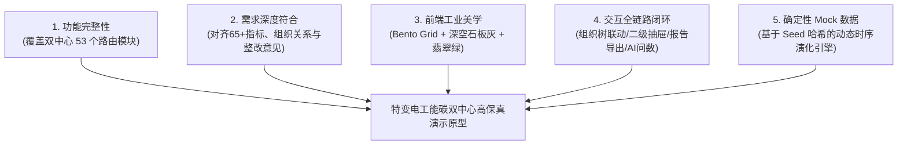
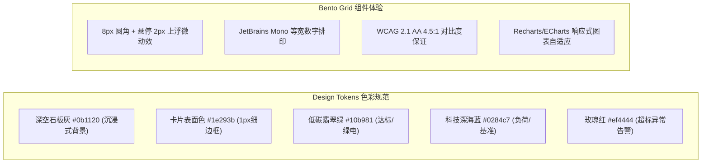
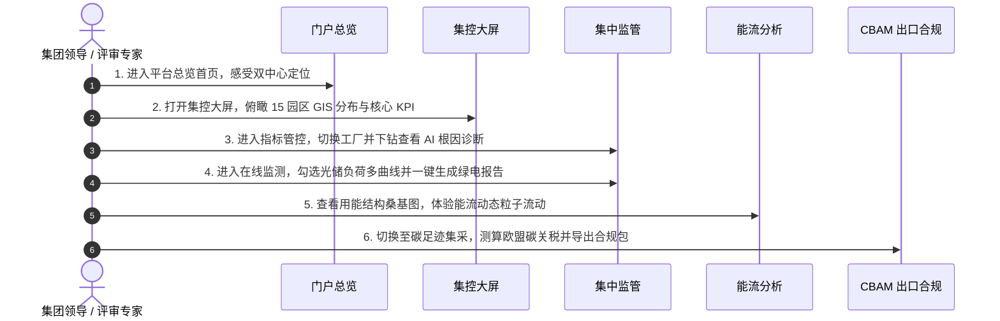

# 💎 特变电工“双中心”高保真原型系统完整开发方案

> **项目名称**：特变电工（电装集团）能碳管控“双中心”平台原型系统  
> **核心目标**：构建兼具**功能完整性、业务深度对齐、工业暗黑科技美学、全链路交互闭环与可信 Mock 演示数据**的集团级高保真产品原型系统。  
> **归档位置**：`d:\Project\TJ-nengtan\开发手册\10_特变电工双中心高保真原型完整开发方案.md`

---

## 📑 方案总览与五大核心目标矩阵

---

## 一、系统全景功能架构与 10 大核心业务模块深度设计

### 1. 🌐 集团总览门户与 4K 驾驶舱大屏 (`/` 与 `/zero-carbon/screen`)
* **总览门户 (`/`)**：
  * 顶部特变电工集团品牌标识与用户角色切换；
  * 双核心平台大卡片入口（**零碳园区集控中心** ↔ **产品碳足迹集采中心**），带有 3D 拟物图标、核心功能矩阵概览与平滑悬停光效；
  * 底部快速直达：系统管理、需求规格文档、智能助手。
* **集控大屏 (`/zero-carbon/screen`)**：
  * **中心区域**：全国 15 个零碳产业园区 GIS 拓扑分布地图，实时显示各园区建设阶段（规划中/在建中/已认证）、综合评分及绿电占比；
  * **顶部 KPI 矩阵**：接入园区数 (`15个`)、接入工厂数 (`21家`)、综合绿电占比 (`38.6%`)、年综合能源消费量 (`12.8万tce`)、万元产值碳排放强度 (`0.62 tCO2/万元`)、实施零碳技改项目 (`34个`)；
  * **左右 Bento 栏**：月度能耗趋势堆叠图、用能结构占比环形图、新能源实时出力与削峰填谷曲线、园区达标进度排行榜。

---

### 2. ⚡ 集中监管模块 (`/zero-carbon/monitor/*`)

#### ① 指标管控 (`/zero-carbon/monitor/indicator`) —— 65+ 指标三级体系与 AI 根因分析
* **左侧多级组织树**：支持 6 大一级经营单位（沈变、衡变、新变、鲁缆、新缆、德缆）与 21 家二级工厂折叠展开与即时模糊搜索；未接入工厂置灰并附带“规划接入中”提示；
* **三级指标层级切换 Tab**：
  * **工厂综合指标（11项）**：综合能源消费量、总碳排放量、单位能耗碳排、非化石能源消费占比、物理认定量占比、工业增加值能耗、关键能源自动采集率、节能装备应用占比等；
  * **产品整体指标（5项）**：单型号综合能耗、产品电耗、蒸汽单耗、天然气单耗、水耗；
  * **关键工序指标（49项）**：变压器高压干燥/试验、线缆铜铝拉丝/交联、开关柜钣金加工/喷涂、电容器真空浸渍等；
* **指标卡片设计**：
  * 明确展示 **“当前核算值 + 内部基准值 + 行业标杆值”**；
  * 同比/环比变化采用 **“先体现差值，再展示比例”** 格式（如：`同比: +0.15 (+11.54%)`），清晰标识红/绿/蓝状态徽章；
* **二级详情深度下钻抽屉 (Drawer)**：
  * 点击任意卡片滑出右侧抽屉，包含：参与计算的原始参数列表、可追溯核算公式、近 8 个月历史趋势对比折线图；
  * **AI 根因分析与优化诊断卡片**（如：“该产品干燥工序蒸汽能耗超标 18%，归因于 2 号真空干燥罐温控疏水阀微漏”）。

#### ② 在线监测 (`/zero-carbon/monitor/online`) —— 水电气四介质与光储负荷多曲线联动
* **四介质快捷 Tab 切换**：电力、工业水、天然气、工业蒸汽；
* **产线工序设备树**：工厂 ➔ 产线 ➔ 工序 ➔ 重点用能设备（如 500kW 干燥罐、全自动数控叠片台、无局放试验变压器）；
* **多能源汇总与明细**：针对选中节点汇总展示有功功率、本日累计用电、水耗、气耗；
* **24 小时多曲线勾选对比看板**：
  * 支持自由勾选联动：☑ 总用电负荷（蓝色）、☑ 光伏发电（绿色）、☑ 储能充放（黄色）、☑ 市电购电（红色）；
* **尖峰平谷与实时量测**：
  * 尖峰/高峰/平段/低谷用电结构与电费环形图；
  * 实时电气参数表（电压、电流、有功功率、无功功率、功率因数 `0.98`）。

#### ③ 绿电监测与消纳报告 (`/zero-carbon/monitor/green`)
* **三大绿电来源精准拆解**：
  * 直供绿电 (58%)、市场化交易绿电 (28%)、GEC 绿证认购 (14%)，支持穿透查看溯源单号与购售电合同附件；
* **一键生成绿电消纳分析报告**：
  * 点击顶部操作按钮弹出规范报告模态框；
  * 包含报告概述、基础信息、电量流向公式精确拆解、**AI 储能削峰填谷策略（午间满充、晚峰放电）与光伏板机器人清洗调度建议**、结论总结；支持一键导出 PDF。

---

### 3. 📊 能耗能效分析模块 (`/zero-carbon/energy/*`)

* **用能结构分析 (`/energy/structure`)**：
  * 交互式**能流桑基图 (Sankey Diagram)**，直观呈现电力、气、水、蒸汽从进线输入流向各生产车间与关键工序的流动损耗；
  * 各介质月度/季度同环比占比分析。
* **能源成本分析 (`/energy/cost`)**：
  * 电费、水费、气费、蒸汽费用横向占比与多家经营单位成本分布对比；
  * 峰谷电费套利优化建议。
* **单位产品能耗分析 (`/energy/unit-product`)**：
  * 提供**产品型号对比、产品种类对比、产线对比**；
  * 同产品在**多家经营单位横向对比**（如沈变 vs 衡变同规格变压器单耗）；
  * 同产品在**不同时段历史对比**，异常单耗波动标记。
* **单位产值能耗分析 (`/energy/unit-output`)**：
  * 按月度、季度、年度统计分析产值与综合能耗协同趋势；
* **对标管理 (`/energy/benchmark`)**：
  * 集团领跑榜与标杆值管理，支持自定义对标规则与行业前沿对标。

---

### 4. 🍃 碳管理模块 (`/zero-carbon/carbon/*`)

* **碳排放核算 (`/carbon/accounting`)**：
  * 范围一（直接燃烧）与范围二（外购电力/热力）分项核算；
  * 核算公式可配置、可回溯，关联因子库版本；
* **碳排放分析 (`/carbon/analysis`)**：
  * 按排放源、能源类型、车间产线多维拆解碳排放构成；
* **碳报告与核查支撑 (`/carbon/report`)**：
  * 内置符合国家标准模板的碳排放月报与年报，一键生成导出；
  * 组织层面汇集碳核算原始凭据，一键打包第三方核查支撑材料。

---

### 5. 🎯 零碳项目评估、统计报表、告警与配置模块

* **零碳项目评估 (`/zero-carbon/project/*`)**：
  * 项目档案库（光伏、储能、余热回收）；
  * 效益评估模型（投资回收期、IRR、单位减排成本）；
  * **零碳园区自评估打分**（涵盖能源利用、低碳技术、管理体系多维雷达图）。
* **统计报表 (`/zero-carbon/reports/*`)**：
  * 能源用量、能源成本、能源单耗、碳排放月度/季度导出报表，支持 Excel/PDF。
* **告警闭环 (`/zero-carbon/alarm/*`)**：
  * 多维阈值规则配置（能耗突增、单耗超标、设备离线、三级告警）；
  * 在线确认、整改措施闭环处理流；多渠道推送策略（站内信、企微、短信）。
* **基础配置与线下录入 (`/zero-carbon/config/*`)**：
  * 碳排因子多版本库管理（支持历史数据重新计算）；
  * 分时/阶梯费价模型；折标煤转换工具；接口配置管理；
  * **线下人工数据录入 (`/config/entry`)**：针对天然气、柴油、工业增加值提供合规填报表单。
* **智能助手 (`/zero-carbon/assistant`)**：
  * AI 语音唤醒与识别，自然语言问数（如“上个月哪个工厂单耗最高”），自动生成对比图表并支持语音直达深层页面。

---

### 6. 🌍 产品碳足迹集采中心 (`/carbon-footprint/*`)

* **碳足迹驾驶舱 (`/cockpit`)**：产品全生命周期 LCA 摇篮到大门阶段宏观概览与红黑榜；
* **多维碳分析 (`/analysis`)**：同品类产品横向对比与工序碳热点模型；
* **实景数据库 (`/database`)**：BOM 物料溯源、订单工单能耗切片穿透、ISO 14067 碳足迹核查报告；
* **欧盟 CBAM 专区 (`/cbam`)**：
  * 绑定 HS 码 `8504.23`（变压器）与 `8544.60`（电缆）；
  * 隐含碳排放测算与 €80/t 碳价情景测算；
  * 一键下载 CBAM 季度申报 XML 合规包；
* **认证管理与因子库 (`/certification` & `/factor`)**：
  * 资质材料库与申报流程；股份因子同步与下发。

---

## 二、前端工程美学与 UI/UX 规范体系

---

## 三、确定性 Mock 数据演化体系 (`lib/variant.ts`)

为了保证原型在面对不同领导与客户演示时**数据既真实联动又绝对可信可复现**，系统采用散列特征演化算法：

$$f(\text{Org}, \text{Period}) = 0.72 + 0.56 \times \left( \frac{\text{Hash}(\text{Org} \parallel \text{Period}) \pmod{1000}}{1000} \right)$$

* **演示稳定性**：多次选择“沈变本部 + 2026年8月”，指标值永远是绝对精准的 `1284.5 tce`；
* **动态联动感**：切换到“鲁缆本部”或“新变厂”，所有指标和图表联动生成自然合理的线缆/变压器特色时序数据，完全告别“假死”与“乱跳”。

---

## 四、高保真原型演示标准动线 (Demo Presentation Flow)

---

## 五、9.15 节点交付与落地排期表

| 阶段 | 时间周期 | 核心交付成果与验收标准 |
| :--- | :--- | :--- |
| **阶段一** | 8月20日 ~ 8月25日 | 完成组织树、65+ 指标库、全量 53 路由搭建，本地 `pnpm build` 100% 编译通过并后台运行 |
| **阶段二** | 8月26日 ~ 9月05日 | 深度打磨指标抽屉下钻动画、在线监测多曲线勾选、绿电消纳报告一键导出与桑基图粒子流 |
| **阶段三** | 9月06日 ~ 9月14日 | 完善 CBAM 申报专区、4K 大屏高保真适配与全链路演示彩排 |
| **阶段四** | **9月15日** | **高保真原型系统 + 完整 PRD 规范评审交付，正式无缝转入生产开发** |
