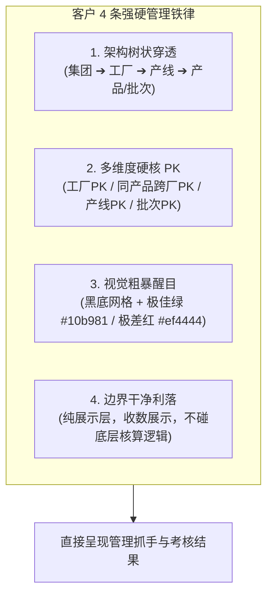
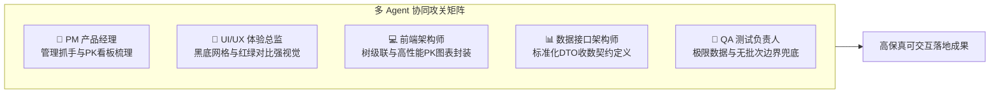
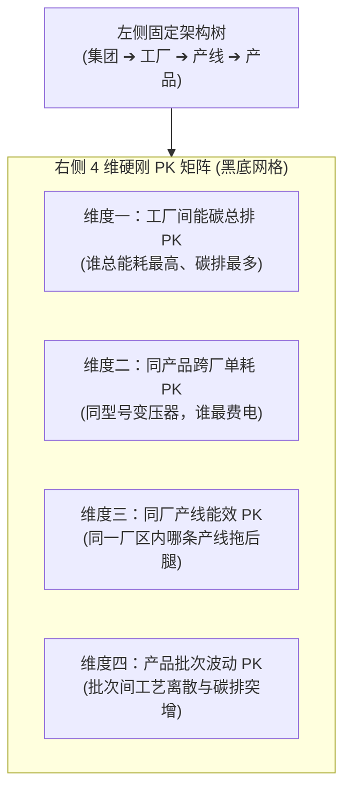

# ⚡ 集中监管“三剑客”（指标管控·在线监测·绿电监测）多 Agent 深度设计与黑底 PK 大屏落地方案

> **编制团队**：多 Agent 专家联合工作组（PM 产品专家、UI/UX 体验总监、前端首席架构师、数据与接口架构师、QA 负责人）  
> **核心指令**：死守倪总与客户拍板的**“黑底网格大屏风格”**，践行**“架构树状穿透、多维硬核 PK、视觉粗暴醒目、边界干净利落”**四大铁律，把“指标管控、在线监测、绿电监测”彻底打造为集团领导用数据抓管理、分优劣的管理利器！

---

## 📑 目录索引
1. [客户强硬诉求与管理痛点拆解](#一客户强硬诉求与管理痛点拆解)
2. [多 Agent 跨角色深度设计分析](#二多-agent-跨角色深度设计分析)
3. [核心模块一：「指标管控」4 大维度硬核 PK 落地设计](#三核心模块一指标管控-4-大维度硬核-pk-落地设计)
4. [核心模块二：「在线监测」水电气实时负荷与用能透析](#四核心模块二在线监测水电气实时负荷与用能透析)
5. [核心模块三：「绿电监测」三大流向拆解与消纳削峰评估](#五核心模块三绿电监测三大流向拆解与消纳削峰评估)
6. [新增独立黑底网格大屏：集团能碳管理决策大屏设计](#六新增独立黑底网格大屏集团能碳管理决策大屏设计)
7. [数据契约与接口边界定义（只管收数展示·不碰核算）](#七数据契约与接口边界定义只管收数展示不碰核算)

---

## 一、客户强硬诉求与管理痛点拆解

客户核心原话：
> **“给我一个黑底网格的大屏，左边点架构，右边出指标，能让我一眼看出哪个工厂、哪条产线、哪批产品最费电、碳排最多，别跟我讲技术细节，我要的是管理结果。”**



### 客户诉求深度解读（4 大核心落地准则）：
1. **树状穿透，绝不迷路**：
   * 左侧永远固定挂载企业架构树（集团 ➔ 6大单位 ➔ 21家工厂 ➔ 重点车间/产线 ➔ 重点型号产品/批次）；
   * 点击树的任何一层，右侧数据瞬间联动刷新，层级脉络一目了然。
2. **多维度硬刚，优劣立判**：
   * 摒弃传统的“单点展示”，必须做“横向与纵向对照 PK”；
   * **工厂之间 PK**：谁总能耗最高、谁碳排放最多、谁绿电垫底；
   * **同产品跨厂 PK**：同样是 500kV 变压器，沈变做一台耗多少电，衡变做一台耗多少电，新变做一台耗多少电；
   * **同厂不同产线 PK**：同一工厂里哪条产线在拖后腿；
   * **同产品不同批次 PK**：同一个型号，8月批次比7月批次多耗了多少电，生产波动在哪。
3. **黑底网格，极简高亮**：
   * 严格遵循客户拍板的**黑底微网格工业大屏风格**（`#060b14` 底色 + 科技网格线）；
   * 拒绝复杂装饰，数值指标用超大等宽字体，**优胜一律亮绿（#10b981），落后一律高亮刺眼红（#ef4444）**，领导1秒即可定位问题工厂或问题产线。
4. **数据边界清晰，只收数展示**：
   * 明确系统边界为 **数据展示层（Data Presentation Layer）**；
   * 能耗计算、碳足迹核算、BOM 展开等由上游数仓与核算引擎统一处理好并传入 DTO，前端只负责快速聚合、对比渲染与状态着色。

---

## 二、多 Agent 跨角色深度设计分析



### 1. 🎯 产品经理 (PM) 视角：管理抓手与交互动线
* **管理痛点破局**：传统系统把指标藏在三级菜单里，领导要看“谁最差”得点几十次。本方案在右侧首屏直接平铺 **“红黑榜 / 差异化 PK 矩阵”**；
* **四维 PK 切换器**：在指标管控顶部常驻 4 个大切换 Tab：
  `【工厂间总能碳PK】` `【同产品跨厂单耗PK】` `【同厂产线能效PK】` `【产品批次波动PK】`；
* **管理闭环联动**：点击最差的红色柱子，自动定位到责任单位与主要用能工序，提供“一键下发督办工单”。

### 2. 🎨 UI/UX 体验总监视角：黑底网格与红绿冲击美学
* **画布底色**：深空黑曜底色 `#060b14`，叠加 `24px` 激光微细网格；
* **高亮色标**：
  * 🟢 **优胜/标杆/达标**：`#10b981`（高饱和翡翠绿 + 绿色发光边框）；
  * 🔴 **垫底/超标/严重落后**：`#ef4444`（激光刺眼红 + 红色呼吸警报徽章）；
  * 🟡 **正常/关注**：`#f59e0b`（琥珀金）；
* **排印规范**：所有数值强制使用 `font-mono: JetBrains Mono`，大字号排版（`text-2xl` / `text-3xl`），数字差值直接打出 `+18.5% ▲` 或 `-6.2% ▼`。

### 3. 💻 前端首席架构师视角：树级联与状态持久化
* **状态设计**：左侧树选中节点（`orgId`, `level`, `type`）与当前选中的 PK 维度（`pkDimension`）直接同步到 URL 参数，支持一键分享给参会领导直接打开对应视图；
* **图表选型**：横向对比柱状图采用 Recharts / ECharts 高性能水平条形图，按能耗/碳排从高到低自动排序，最差的一行自动标红高亮。

---

## 三、核心模块一：「指标管控」4 大维度硬核 PK 落地设计



### 1. 维度一：工厂间总能耗与总碳排 PK 看板
* **展示内容**：全集团 21 家工厂按月度/年度综合能耗与总碳排放量降序横向条形排列；
* **视觉呈现**：
  * Top 1 能耗最高工厂（如“超高压公司 1,520 tce”）整条显示为高亮红色，右侧打出红色预警标签 `【高耗能重点监管单位】`；
  * 能耗控制最佳单位（如“新缆厂 680 tce”）显示为绿色标杆色；
  * 一眼看出 21 家工厂的能耗梯队分化。

### 2. 维度二：同产品跨工厂低碳 PK 看板
* **典型对标产品**：`ODFS-334MVA/500kV` 单相自耦变压器；
* **参战工厂**：沈变本部 vs 衡变本部 vs 新变超高压公司；
* **PK 指标**：单台综合单耗（tce/万kVA）、单台电耗（kWh/台）、单台蒸汽消耗（GJ/台）、单台碳足迹（tCO2/台）；
* **对比结果**：
  * 衡变本部：`1.18 tce/万kVA`（🟢 优胜标杆，绿色高亮）；
  * 沈变本部：`1.45 tce/万kVA`（🟡 正常）；
  * 新变超高压：`1.58 tce/万kVA`（🔴 偏高 +33.8%，红色高亮，直接暴露高压干燥工序蒸汽能耗过大）。

### 3. 维度三：同厂不同产线能效 PK 看板
* **展示内容**：同一工厂内部各生产车间/产线单位产值能耗与设备稼动能效对比；
* **沈变厂内对比示例**：
  * 铁芯自动剪切装配线：`0.32 tce/万元`（🟢 优）；
  * 自动化绕线车间：`0.45 tce/万元`（🟢 优）；
  * **高压绝缘干燥车间：`0.89 tce/万元`（🔴 严重超标 +48%，红色闪烁）**；
  * 领导无需看任何下级参数，直接命令检修高压干燥车间。

### 4. 维度四：同产品不同生产批次波动 PK 看板
* **展示内容**：同一型号产品近 6 个生产批次的单台电耗与碳排离散度折线散点图；
* **示例**：
  * 批次 #202606A: `10,200 kWh/台`
  * 批次 #202607B: `10,350 kWh/台`
  * **批次 #202608C: `12,800 kWh/台`（🔴 异常突增 +24.5%）**；
  * 归因提示：批次 202608C 生产期间遭遇夏季白天气温过高，冷却循环系统额外功耗过大。

---

## 四、核心模块二：「在线监测」水电气实时负荷与用能透析

* **左侧树直达设备**：展开至真空干燥罐、立塔交联机、空压站等重点用能设备；
* **四介质 Tab 切换**：电力、水、天然气、蒸汽；
* **24 小时多曲线勾选看板**：
  * ☑ **总用电负荷曲线**（蓝色 `#0ea5e9`）
  * ☑ **光伏实时出力曲线**（绿色 `#10b981`）
  * ☑ **储能充放功率曲线**（黄色 `#f59e0b`）
  * ☑ **市电购电曲线**（紫色 `#a855f7`）
* **尖峰平谷结构环形图**：尖峰（红）、高峰（黄）、平段（绿）、低谷（蓝）用电量与电费分布。

---

## 五、核心模块三：「绿电监测」三大流向拆解与消纳削峰评估

* **三大流向精确拆解**：
  * **直供绿电 (58%)**：自建分布式光伏与储能直供量；
  * **交易绿电 (28%)**：市场化跨省绿电交易电量；
  * **GEC 绿证 (14%)**：国家可再生能源绿证认购量；
* **一键生成经营单位级绿电消纳分析报告**：
  * 物理消纳量与结算电量公式计算；
  * **AI 调度策略建议**：午间光伏大发期储能 5MW 满充、晚高峰 19:00~21:00 满放；光伏组件清洗周期调度建议。

---

## 六、新增独立黑底网格大屏：集团能碳管理决策大屏设计

* **访问路由**：`/zero-carbon/screen`（以及可独立全屏的 `/screen/executive`）；
* **视觉风格**：100% 落实倪总拍板的**黑底微网格科技工业风**；
* **布局结构**：
  * **顶部**：集团 6 大核心 KPI 动态霓虹卡片（接入园区 15个、接入工厂 21家、绿电占比 38.6%、万元产值碳强 0.62、节能量 12.8万tce）；
  * **左侧 Bento**：集团能碳月度趋势堆叠图 + 光储市电实时出力折线图；
  * **中央 3D GIS**：全国 15 个零碳产业园区地理拓扑分布地图（绿点=已认证，蓝点=在建，黄点=规划），支持点击下钻进入园区能碳驾驶舱；
  * **右侧 Bento**：能源介质结构环形图 + **全集团 21 家工厂能效红黑榜（排名前三亮绿，后三名高亮刺眼红）**。

---

## 七、数据契约与接口边界定义（只管收数展示·不碰核算）

指标管控模块严格作为**纯展示层**，通过标准化 OpenAPI DTO 接收上游数仓或核算系统的计算结果：

```json
{
  "factory_ranking": [
    { "factory_name": "沈变本部", "total_energy_tce": 1284.5, "total_carbon_t": 3420.8, "green_ratio": 38.6, "status": "normal" },
    { "factory_name": "新变超高压", "total_energy_tce": 1520.0, "total_carbon_t": 4150.2, "green_ratio": 31.2, "status": "danger" },
    { "factory_name": "新缆厂", "total_energy_tce": 680.0, "total_carbon_t": 1820.0, "green_ratio": 44.0, "status": "ok" }
  ],
  "cross_factory_product_pk": {
    "product_model": "ODFS-334MVA/500kV 单相自耦变压器",
    "benchmarks": { "industry_target": 1.20, "unit": "tce/万kVA" },
    "factories": [
      { "factory": "衡变本部", "actual_val": 1.18, "delta_pct": -1.6, "rank": 1, "is_best": true },
      { "factory": "沈变本部", "actual_val": 1.45, "delta_pct": +20.8, "rank": 2, "is_best": false },
      { "factory": "新变超高压", "actual_val": 1.58, "delta_pct": +31.6, "rank": 3, "is_worst": true }
    ]
  }
}
```
* **前端职责**：只负责解析上述结构体，按照 `is_best`（绿色高亮）、`is_worst`（红色闪烁警报）与 `rank` 快速渲染 PK 看板，绝对不进行二次复杂核算，保证毫秒级秒开与高可靠性。
