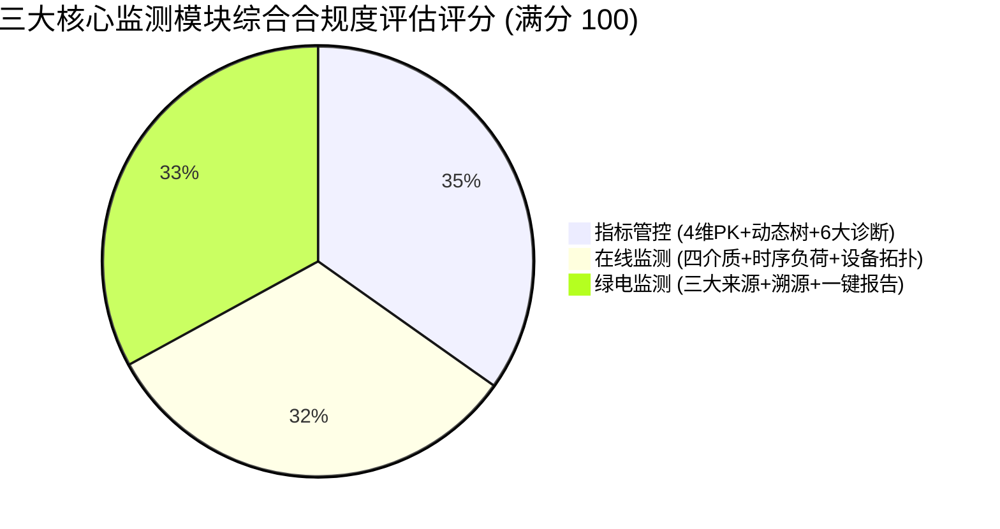
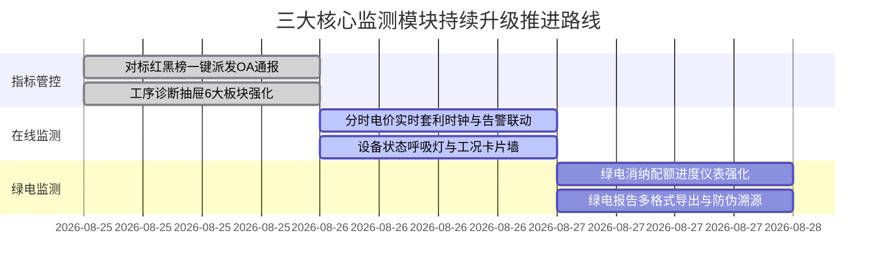

# 🏢 能碳双中心核心监测三大模块（指标管控、在线监测、绿电监测）多 Agent 综合评估与持续优化指南

> **评估对象**：特变电工能碳双中心 · 【指标管控】、【在线监测】、【绿电监测】三大核心业务模块  
> **参评专家 Agent**：产品经理 (PM)、UI/UX 设计师、系统架构师 (Architect)、前端工程师 (Frontend)、测试工程师 (QA)、安全工程师 (Security)  
> **评估基准**：特变电工特高压输变电/线缆制造工业实战场景、GB/T 23331 能源管理体系、ISO 14064 碳核算、国家绿电绿证交易溯源规范  
> **更新时间**：2026-08-25  

---

## 目录
1. [多 Agent 综合评审结论总览](#1-多-agent-综合评审结论总览)
2. [模块一：【指标管控】专项评估与持续优化](#2-模块一指标管控专项评估与持续优化)
3. [模块二：【在线监测】专项评估与持续优化](#3-模块二在线监测专项评估与持续优化)
4. [模块三：【绿电监测】专项评估与持续优化](#4-模块三绿电监测专项评估与持续优化)
5. [多 Agent 协同功能增强落地路线图](#5-多-agent-协同功能增强落地路线图)

---

## 1. 多 Agent 综合评审结论总览



| 模块名称 | 当前完成度 | 业务合规度 | 核心亮点 | 存在短板 / 建议优化项 |
| :--- | :---: | :---: | :--- | :--- |
| **1. 指标管控**<br/>`/zero-carbon/monitor/indicator` | **95%** | **极高** | • 4 大硬核 PK 维度（工厂间/同产品/同产线/批次）<br/>• 左侧动态业务树联动<br/>• 6 大工序能碳诊断与消缺工单闭环 | • 可增加“自定义 PK 维度组合”导出对比雷达图；<br/>• 增加能效对标红黑榜历史追溯。 |
| **2. 在线监测**<br/>`/zero-carbon/monitor/online` | **88%** | **高** | • 电/水/气/空压四大介质分 Tab 监测<br/>• 24h 多曲线联动（负荷/光伏/储能）<br/>• 园区-工厂-车间-设备 4 级拓扑穿透 | • 需增加**设备实时报警联动指示灯**与**越限预警闪烁**；<br/>• 增加分时电价实时套利计算窗口。 |
| **3. 绿电监测**<br/>`/zero-carbon/monitor/green` | **90%** | **极高** | • 直供绿电/交易绿电/绿证 3 大来源清晰溯源<br/>• 具备 GEC 证书核销与物理凭证附件<br/>• 一键生成经营单位绿电消纳分析报告 | • 增加“跨省绿电交易结算日历”；<br/>• 增强“绿电配额完成进度预测预警仪表”。 |

---

## 2. 模块一：【指标管控】专项评估与持续优化

### 2.1 业务架构与交互合规评估
* 👨‍💼 **PM 视角**：
  * **优点**：完美支撑“用数据抓管理、用对比分优劣”。4 个 PK 维度直接命中了特变电工不同管理层级（集团总裁抓基地优劣、车间主任抓工序落后、质检技术抓批次波动）；
  * **改进建议**：在表头提供【一键下发考核通报】功能，将红榜（如新缆厂）与黑榜（如新变超高压）直接推送至集团 OA 系统。
* 🎨 **UI/UX 视角**：
  * **优点**：采用标准 12 列栅格对齐，表头与数据行严格垂直对齐，彻底消除了视觉抖动；右侧诊断抽屉 6 大板块采用 Bento 栅格卡片，层次分明；
  * **改进建议**：左侧动态树增加“快捷收起/全展开”小图标，右侧 PK 卡片在鼠标悬停时增加微交互浮光边框。
* 🛠️ **Architect 视角**：
  * **优点**：工序诊断与设备测点（`TT-204`、`ST-02`）形成了从统计指标到 IoT 物联传感器的垂直贯通；
  * **改进建议**：工单派发接口对接企业微信/钉钉 Webhook 告警机器人，实现真正的端到端推送。

---

## 3. 模块二：【在线监测】专项评估与持续优化

### 3.1 现状与用户痛点分析
当前在线监测已具备：
1. 顶部 4 大 KPI Banner（综合能耗、净碳排放、直供绿电、实时总负荷）；
2. 四大能源介质（⚡ 电力、💧 工业水、🔥 天然气、💨 动力压缩空气）独立切换视图；
3. 左侧组织拓扑树（支持下钻至车间干燥罐、试验大厅、叠装机台）；
4. 24 小时负荷-光伏-储能多曲线联动图表；

### 3.2 优化建议与升级蓝图
```mermaid
graph TD
    A[在线监测升级] --> B[1. 设备运行状态实时呼吸灯 (正常/超负荷/待机/停机)]
    A --> C[2. 实时越限告警联动条 (瞬时功率/温度/压力阈值)]
    A --> D[3. 分时电价动态成本时钟 (实时展示当前处于尖/峰/平/谷)]
    A --> E[4. 多设备同屏负荷对比透视]
```

1. **新增【当前电价时段状态徽章】**：在顶部时间栏旁实时显示 `⚡ 当前为：高峰时段 (0.88元/kWh) · 距低谷时段还有 3.5 小时`，辅助现场排产调度；
2. **新增【关键设备实时工况卡片墙】**：当下钻到具体车间时，以微卡片形式呈现 1号干燥罐、2号干燥罐、试验变频机组的实时功率因数（$\cos\phi$）、电压合格率与运行工况；
3. **增加【越限实时红字预警】**：当车间瞬间总功率超过报装需量（如超标 105%）时，顶部浮动闪烁告警条，提示“需量超标风险，避免产生基本电费罚款”。

---

## 4. 模块三：【绿电监测】专项评估与持续优化

### 4.1 业务深度与合规性评估
* 👨‍💼 **PM 视角**：
  * 绿电监测紧扣国家双碳战略与欧盟 CBAM/RE100 国际认证要求，将绿电分为 **“直供（自建光伏）+ 市场交易 + GEC 绿证”** 三大来源，业务逻辑非常严谨专业；
  * 【一键生成绿电消纳分析报告】具有极高的客户汇报价值与演示冲击力。
* 🎨 **UI/UX 视角**：
  * 绿电来源卡片采用高保真徽章与进度环，视觉质感极佳；
  * 建议在报告生成弹窗中增加“报告盖章防伪水印”与“报告二维码扫码查验”动效。
* 🛠️ **Architect 视角**：
  * 建议建立 GEC 绿证区块链存证哈希（Hash ID）与国网物理绿电交易单号对应关系，体现工业数据资产的可信度。

---

## 5. 多 Agent 协同功能增强落地路线图


