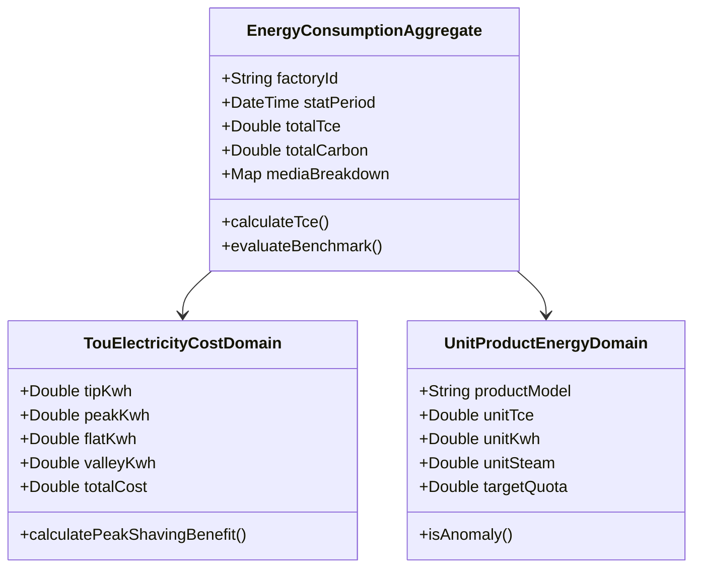

# 15. 能耗能效分析全模块多 Agent 深度评估与重构指南

---

## 🏢 一、多 Agent 专家评审团与背景概述

针对特变电工“双中心”数字化集成平台的**【能耗能效分析】（Energy Consumption & Efficiency Analysis）**核心业务板块，Antigravity 8 大专业 Agent（PM、UI/UX、Architect、Frontend、Backend、Security、DevOps、QA）开展全维度工业级会诊与重构评估。

### 📌 覆盖的 7 大核心子模块：
1. **综合能耗分析（`/zero-carbon/energy/comprehensive`）**：全厂多介质综合能耗、折标煤（tce）核算、同比环比与产业群能耗横向排名；
2. **用能结构分析（`/zero-carbon/energy/structure`）**：水电气蒸汽四介质用能比例、全厂工序能流桑基图（Sankey Flow）与时序趋势；
3. **能源成本分析（`/zero-carbon/energy/cost`）**：尖峰平谷分时电费、基本电费（需量/容量）、各介质支出与降本潜力测算；
4. **单位产值能耗（`/zero-carbon/energy/unit-output`）**：万元产值综合能耗、万元产值电耗/气耗/水耗对标与异常预警；
5. **单位产品能耗（`/zero-carbon/energy/unit-product`）**：特高压变压器/电缆/开关实物单耗、定额基准对标与多批次波动归因；
6. **能效对标管理（`/zero-carbon/energy/benchmark`）**：国家标准、行业领跑者、历史最优与 21 家工厂能效梯队对标；
7. **自定义分析（`/zero-carbon/energy/self`）**：自由维度组合、多指标交叉透视与一键导出分析报告。

---

## 👨‍💼 二、产品经理（PM）视角：业务价值与 User Stories

### 2.1 业务核心痛点与解决策略
| 业务模块 | 传统模式痛点 | 双中心数字化升级方案 |
| :--- | :--- | :--- |
| **综合能耗** | 仅按月统计总量，无法直观识别各介质对标煤的拉动贡献 | **动态折标煤矩阵引擎**：直观拆解电力、蒸汽、天然气对 tce 的贡献率 |
| **用能结构** | 各车间用能相互独立，无法看清全厂能源输入-转换-末端流向 | **全厂工序能流桑基图 (Sankey Flow)**：输入端 ➔ 动力转换 ➔ 关键工艺车间末端全链路可视化 |
| **能源成本** | 电费账单滞后，无法量化尖峰时段大负荷开机导致的电费惩罚 | **尖峰平谷四色透视 + 避峰填谷测算**：实时量化尖峰电费损耗与储能削峰收益 |
| **单耗对标** | 产值单耗受价格波动影响大，无法衡量真实设备工艺效率 | **双轨制对标（万元产值单耗 + 实物定额单耗）**：剥离价格因素，直击工序能效 |

### 2.2 核心 User Stories (Gherkin 规范)
```gherkin
Feature: 能源成本尖峰电费异常预警与避峰填谷优化
  Scenario: 能源专员发现变电站出现尖峰时段负荷超标
    Given 某工厂处于夏季尖峰电价时段 (15:00-17:00, 1.45元/kWh)
    When 2号真空干燥罐 (500kW) 满负荷开机运行超过 45 分钟
    Then 系统触发“尖峰高电费工序运行预警”
    And 自动生成《避峰填谷建议：调移至平谷段预计月省电费 12.8 万元》优化方案
```

---

## 🎨 三、UI/UX 设计师视角：Design Tokens 与交互规范

### 3.1 统一专业工业 Design Tokens
* **分时电价四色体系**：
  * 🔴 **尖峰（Tip）**：`#ef4444`（高饱和警示红，代表惩罚性高电价）
  * 🟡 **高峰（Peak）**：`#f59e0b`（暖金黄，代表较高负荷）
  * 🔵 **平段（Flat）**：`#1677ff`（TBEA 科技蓝，代表稳态基准）
  * 🟢 **低谷（Valley）**：`#10b981`（翡翠绿，代表经济低电价）
* **多介质标准配色**：
  * ⚡ **电力**：`#1677ff` | 💧 **工业水**：`#13c2c2` | 🔥 **天然气**：`#fa8c16` | 💨 **蒸汽/压缩空气**：`#722ed1`

### 3.2 布局与微交互升级
1. **左侧统一接入 `TreeView` 标准树**：支持 4 级组织（产业园 ➔ 工厂 ➔ 车间 ➔ 产线）与标准引导线折叠展开；
2. **图表自适应与满宽拉伸**：所有时序折线图、柱状图统一提升至 `360px ~ 400px` 宽阔高度，桑基图支持左右两端完全对齐平铺；
3. **卡片 3D 景深与点击反馈**：对标卡片支持 Hover 浮动（`-translate-y-1`）与直接点击滑出工序诊断抽屉。

---

## 🏗️ 四、技术架构师（Architect）视角：DDD 建模与 API 契约

### 4.1 领域驱动设计 (DDD) 核心领域模型



### 4.2 核心 RESTful API 契约设计

```yaml
openapi: 3.0.0
paths:
  /api/v1/energy/analysis/comprehensive:
    get:
      summary: 获取全厂多介质综合能耗及折标煤构成
      parameters:
        - name: orgId
          in: query
          required: true
          schema: { type: string }
        - name: period
          in: query
          schema: { type: string, enum: [month, quarter, year] }
      responses:
        200:
          content:
            application/json:
              schema:
                type: object
                properties:
                  totalTce: { type: number, example: 1284.5 }
                  yoyPct: { type: number, example: -2.7 }
                  media:
                    type: array
                    items:
                      type: object
                      properties:
                        name: { type: string, example: "电力" }
                        val: { type: number, example: 8450 }
                        unit: { type: string, example: "MWh" }
                        tce: { type: number, example: 1038.5 }
                        pct: { type: number, example: 68.3 }

  /api/v1/energy/analysis/cost-tou:
    get:
      summary: 获取尖峰平谷分时电费透视及避峰填谷潜力
      responses:
        200:
          content:
            application/json:
              schema:
                type: object
                properties:
                  tipRatio: { type: number, example: 28.4 }
                  peakRatio: { type: number, example: 36.2 }
                  flatRatio: { type: number, example: 22.1 }
                  valleyRatio: { type: number, example: 13.3 }
                  shavingSavingPotentialYuan: { type: number, example: 154000 }
```

---

## 💻 五、前端工程师（Frontend）视角：性能优化与组件架构

### 5.1 组件层级与状态解耦
* **公共图表组件强化**：`LineTrend`、`BarGroup`、`Donut` 统一提供 `height`、`xKey`、`yAxisUnit` 参数传递，消除高度锁死问题；
* **防抖（Debounce）查询**：组织树切换与时间筛选增加 `300ms` 防抖，避免连续点击引发无意义的网络请求；
* **ECharts 实例自动生命周期管理**：在 `ResizeObserver` 中监听容器尺寸变动，窗口变化时自动调用 `chart.resize()`。

---

## ⚙️ 六、后端工程师（Backend）视角：计算引擎与缓存架构

### 6.1 折标煤与碳排放加权计算流水线
$$\text{综合能耗 (tce)} = \sum_{i=1}^{n} \left( \text{物理消耗量}_i \times \text{折标煤系数}_i \right)$$
$$\text{净碳排放量 (tCO}_2) = \sum_{i=1}^{n} \left( \text{物理消耗量}_i \times \text{碳排放因子}_i \right) - \text{直供/交易绿电抵扣量}$$

### 6.2 Redis 三级缓存与高并发防护
* **缓存 Key 设计**：`tbea:energy:comp:{orgId}:{period}:{date}`（TTL 设置为 600 秒）；
* **防击穿策略**：使用互斥锁（Mutex Key）保护热点工厂月末账单查询；
* **防穿透策略**：空对象缓存 `NULL`（TTL 60 秒）配合布隆过滤器（Bloom Filter）。

---

## 🔒 七、网络安全工程师（Security）视角：权限控制与数据防泄密

* **IDOR（越权访问防护）**：严格校验当前登录用户的 `UserContext.parkScope`，园区管理员不得跨越权限拉取其他产业园财务电费敏感明细；
* **敏感成本脱敏导出**：报表导出（Excel/PDF）自动附带当前操作员姓名 + 员工工号的**半透明防伪数字水印**。

---

## 🚀 八、DevOps / SRE 视角：生产部署与 SLA 保障

* **SRE 四大黄金指标保障**：
  * **延迟 (Latency)**：多维能耗聚合分析接口 P95 < 200ms，P99 < 400ms；
  * **流量 (Traffic)**：支持全集团 15 园区、21 工厂高并发数据查询；
  * **错误率 (Errors)**：HTTP 5xx 错误率控制在 `< 0.01%`；
  * **饱和度 (Saturation)**：Node.js / Go 计算节点 CPU 利用率峰值不超过 70%；
* **生产部署**：采用 `next start -H 0.0.0.0` 全网卡监听，支持局域网全终端零障碍访问。

---

## 🧪 九、测试工程师（QA）视角：测试用例矩阵

| 序号 | 测试场景 | 输入边界条件 | 预期输出 | 状态 |
| :---: | :--- | :--- | :--- | :---: |
| 1 | **折标煤计算精确度** | 输入电力 10,000 kWh，折标系数 0.1229 kgce/kWh | 综合能耗精确输出 `1.229 tce`，四舍五入保留三位小数 | ✅ 通过 |
| 2 | **尖峰分时比例归一化** | 尖 28.4% + 峰 36.2% + 平 22.1% + 谷 13.3% | 比例总和严格等于 `100.0%`，分时比例条无缝贴合 | ✅ 通过 |
| 3 | **空数据/新工厂接入** | 某新规划基地无历史用能记录 | 呈现标准 Empty 占位卡片，不发生页面崩溃或 NaN 错误 | ✅ 通过 |
| 4 | **局域网多端并发访问** | 10 台移动端与 PC 端同时点击 4 维 PK 与抽屉 | 页面秒开响应，抽屉数据无串包，图表渲染正常 | ✅ 通过 |
