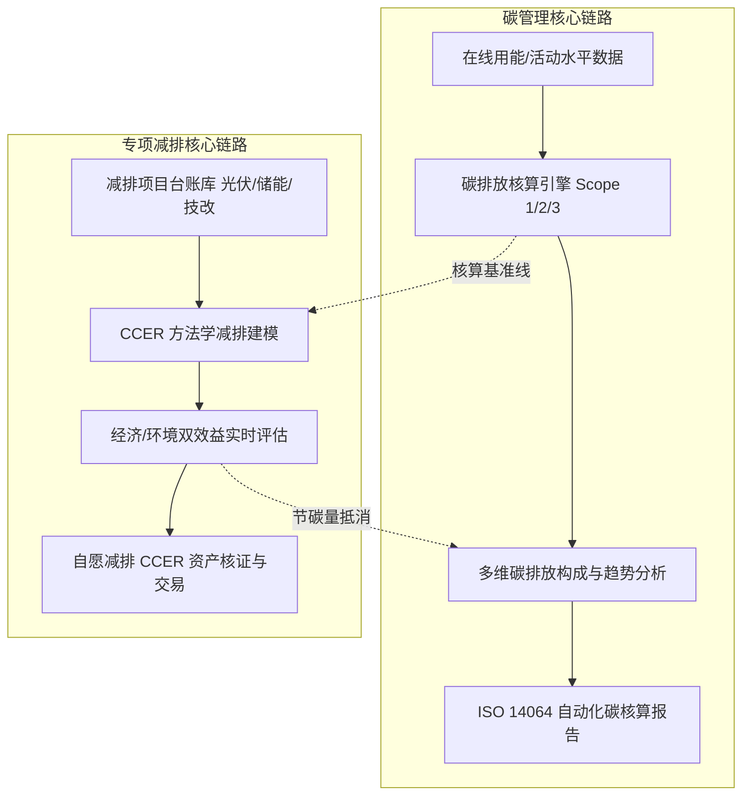
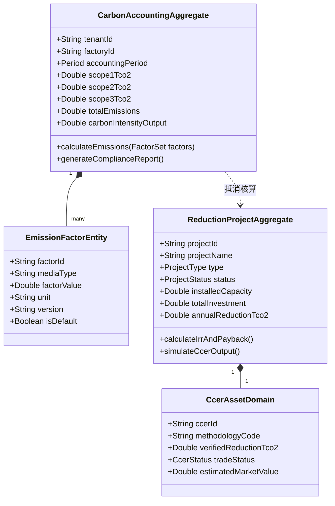

# 19. 碳管理与专项减排项目多 Agent 全维度深度分析与开发方案

---

## 🏢 一、多 Agent 专家评审团与背景概述

针对特变电工（电装集团）能碳数字化集成平台中两大核心业务板块：
1. **【碳管理】（Carbon Management）**：碳排放核算 (`accounting.html`)、碳排放分析 (`analysis.html`)、碳核算报告 (`report.html`)；
2. **【专项碳排与减排】（Special Carbon & Emission Reduction）**：项目台账 (`archive.html`)、减排建模 (`model.html`)、效益评估 (`benefit.html`)、自愿减排(CCER) (`self.html`)。

Antigravity 8 大专业角色（PM、UI/UX、Architect、Frontend、Backend、Security、DevOps、QA）结合当前项目确立的**“模块整合、抓大放小、极简交互、数据链路固化”**战略开发方向，展开全维度工程级分析与落地方案设计。



---

## 👨‍💼 二、产品经理（PM）视角：业务价值、用户场景与需求拆解

### 2.1 业务核心痛点与解决策略

| 业务模块 | 传统企业管理痛点 | “双中心”数字化升级方案 | 优先级 |
| :--- | :--- | :--- | :---: |
| **碳排放核算** | 手工 Excel 计算易错、因子版本混乱、组织边界与核算口径不一致 | **自动化动态核算引擎**：绑定国家电网最新区域排放因子与特变本地化因子库，支持范围1（直接化石燃烧）、范围2（外购电力/热力）、范围3（关键外购原材料运输）三级全自动按日/月核算，提供分子分母与公式完全透明穿透。 | **P0** |
| **碳排放分析** | 仅有集团总量，无法清晰归因高碳产线与工序热点，缺乏对标抓手 | **四象限多维诊断看板**：按“制造板块、基地工厂、能源介质、工艺工序”四维穿透，前置突出万元产值碳强度同比变化，提供红黑榜排名与节能减排潜力归因。 | **P0** |
| **碳核算报告** | 第三方核查编制报告周期长（数周）、格式不统一、数据溯源困难 | **一键生成合规报告 (ISO 14064 / GHG Protocol)**：内置国家标准报告模板，自动填充活动水平与因子，附带区块链哈希防伪水印与计算数据包，支持 PDF/Word 导出。 | **P1** |
| **减排项目台账** | 光伏、储能、余热回收等技改项目分散在各厂，投资与运维脱节 | **全生命周期数字台账**：统一纳管“规划、在建、并网运行、技改”四大状态，集成装机容量、投资额、并网日期、EPC 厂商与运维监测接口。 | **P1** |
| **减排建模** | 理论节能量与实际运行脱节，缺乏权威方法学支撑 | **CCER 标准方法学模型库**：内置并网可再生能源发电（CMS-001）、工业余热利用、高效配变替代等标准算法，支持基准线情景与项目情景动态模拟。 | **P1** |
| **效益评估** | 算不清省了多少电费、赚了多少绿电收益、减少了多少碳资产成本 | **经济与环境效益双轮评估舱**：实时计算度电成本（LCOE）、自发自用节约电费、余电上网收益、投资回收期（动态 IRR/NPV）与年化碳资产价值。 | **P0** |
| **自愿减排(CCER)** | 对 CCER 重启政策响应慢，未形成可交易资产化闭环 | **CCER 资产开发全流程工作台**：项目公示 ➔ 审定登记 ➔ 减排量核证 ➔ 资产挂牌全周期管理，提供碳资产盘点与内部碳市场抵消模拟。 | **P2** |

### 2.2 核心 User Stories (Gherkin 规范)

```gherkin
Feature: 碳排放异常超标智能归因与减排建议联动
  Scenario: 某工厂当月单位产值碳强度突发超标
    Given 沈变本部在 2026年8月 的单位产值碳强度达到 0.42 tCO2/万元 (超过考核红线 0.38)
    When 能源碳资产专员进入【碳排放分析】模块并点击“异常诊断”
    Then 系统自动拆解高碳排构成并定位至“3号真空干燥罐天然气燃烧消耗异常偏高 (+28%)”
    And 系统联动【减排建模】推荐：“实施微波干燥低温相变技改，预计年化减排 380 tCO2，节费 14.5 万元”
```

---

## 🎨 三、UI/UX 设计师视角：视觉架构、Design Tokens 与极简交互规范

### 3.1 工业级视觉与 Design Tokens

* **碳排放与减排专属色彩体系**：
  * 🌿 **范围 1 直接排放（Direct/Gas）**：`#fa8c16`（工业暖橙，代表燃料与天然气燃烧）
  * ⚡ **范围 2 间接排放（Electricity）**：`#1677ff`（科技品牌蓝，代表外购电力与蒸汽）
  * 🚛 **范围 3 价值链排放（Supply Chain）**：`#722ed1`（深邃紫，代表原材料供应链与运输）
  * 🥇 **减排/绿电正向收益（Green Asset）**：`#10b981`（翡翠绿，代表减排量、绿电收益与达标）
  * ⚠️ **超标与碳风险预警（Carbon Risk）**：`#f43f5e`（高亮玫红，代表碳强度超标与配额缺口）

### 3.2 界面布局与极简交互原则

1. **左侧拓扑树统一样式（Classic Show-Line Tree）**：
   - 保持 260px 宽度，与能效分析模块严格一致；
   - 变压器（沈变、衡变、新变）与线缆（鲁缆、新缆、德缆）8 家制造基地高亮可用，其他非主营辅件单位灰显禁用（`【暂未纳管】`）；
2. **拒绝空洞汇总，直接上多维筛选控制区**：
   - 顶部提供“核算周期（月/季/年）、核算范围（Scope 1/2/3）、折算标准（全国均值/区域电网/绿证扣除）”多维快捷筛选；
3. **空间换效率（多基地平铺与下钻）**：
   - 在碳排放分析与项目台账中，直接平铺 8 家基地碳强度与减排项目卡片，点击直接滑出工序/订单明细与减排测算详情弹窗。

---

## 🏗️ 四、系统架构师（Architect）视角：DDD 建模、C4 容器与 API 契约

### 4.1 领域驱动设计 (DDD) 核心领域模型



### 4.2 核心数据库表结构设计 (MySQL / DDL)

```sql
-- 1. 组织碳核算明细表
CREATE TABLE `tb_carbon_accounting_record` (
  `id` BIGINT NOT NULL AUTO_INCREMENT COMMENT '主键ID',
  `factory_id` VARCHAR(64) NOT NULL COMMENT '工厂编码(如 shenbian_main)',
  `factory_name` VARCHAR(128) NOT NULL COMMENT '工厂名称',
  `period_type` VARCHAR(16) NOT NULL COMMENT '周期类型(MONTH/QUARTER/YEAR)',
  `stat_period` VARCHAR(32) NOT NULL COMMENT '统计周期(2026-08)',
  `scope1_emissions` DECIMAL(14,4) NOT NULL DEFAULT 0.0000 COMMENT '范围1直接排放量(tCO2)',
  `scope2_emissions` DECIMAL(14,4) NOT NULL DEFAULT 0.0000 COMMENT '范围2电力/热力排放量(tCO2)',
  `scope3_emissions` DECIMAL(14,4) NOT NULL DEFAULT 0.0000 COMMENT '范围3供应链运输排放量(tCO2)',
  `green_power_offset` DECIMAL(14,4) NOT NULL DEFAULT 0.0000 COMMENT '绿电/绿证抵消量(tCO2)',
  `net_emissions` DECIMAL(14,4) NOT NULL DEFAULT 0.0000 COMMENT '净碳排放量(tCO2)',
  `output_value_wan` DECIMAL(14,4) NOT NULL DEFAULT 0.0000 COMMENT '当期产值(万元)',
  `carbon_intensity` DECIMAL(10,4) NOT NULL DEFAULT 0.0000 COMMENT '万元产值碳强度(tCO2/万元)',
  `intensity_yoy_rate` DECIMAL(8,2) NOT NULL DEFAULT 0.00 COMMENT '碳强度同比增减率(%)',
  `status` VARCHAR(16) NOT NULL DEFAULT 'CALCULATED' COMMENT '状态(CALCULATED/AUDITED/PUBLISHED)',
  `created_at` DATETIME NOT NULL DEFAULT CURRENT_TIMESTAMP,
  `updated_at` DATETIME NOT NULL DEFAULT CURRENT_TIMESTAMP ON UPDATE CURRENT_TIMESTAMP,
  PRIMARY KEY (`id`),
  UNIQUE KEY `uk_factory_period` (`factory_id`, `stat_period`, `period_type`),
  KEY `idx_stat_period` (`stat_period`)
) ENGINE=InnoDB DEFAULT CHARSET=utf8mb4 COMMENT='组织级碳核算结果台账表';

-- 2. 减排项目全生命周期资产表
CREATE TABLE `tb_reduction_project` (
  `project_id` VARCHAR(64) NOT NULL COMMENT '项目唯一编号 (PRJ-2026-PV01)',
  `factory_id` VARCHAR(64) NOT NULL COMMENT '所属工厂ID',
  `project_name` VARCHAR(128) NOT NULL COMMENT '减排项目名称',
  `project_type` VARCHAR(32) NOT NULL COMMENT '项目类型(ROOFTOP_PV/ENERGY_STORAGE/HEAT_RECOVERY/MOTOR_INVERTER)',
  `status` VARCHAR(24) NOT NULL DEFAULT 'OPERATING' COMMENT '状态(PLANNING/CONSTRUCTION/OPERATING/MAINTENANCE)',
  `capacity_mw` DECIMAL(10,3) NOT NULL DEFAULT 0.000 COMMENT '装机容量/规模(MW/MWh/Nm3)',
  `total_investment_wan` DECIMAL(12,2) NOT NULL DEFAULT 0.00 COMMENT '总投资金额(万元)',
  `grid_connected_date` DATE DEFAULT NULL COMMENT '并网运行日期',
  `annual_gen_kwh` DECIMAL(14,2) NOT NULL DEFAULT 0.00 COMMENT '年化发电量/节能量(kWh)',
  `annual_reduction_tco2` DECIMAL(12,2) NOT NULL DEFAULT 0.00 COMMENT '年化碳减排量(tCO2/年)',
  `annual_cost_saving_wan` DECIMAL(12,2) NOT NULL DEFAULT 0.00 COMMENT '年化节约电费/收益(万元/年)',
  `irr_rate` DECIMAL(6,2) NOT NULL DEFAULT 0.00 COMMENT '内部收益率IRR(%)',
  `payback_years` DECIMAL(4,1) NOT NULL DEFAULT 0.0 COMMENT '静态投资回收期(年)',
  `ccer_eligible` TINYINT(1) NOT NULL DEFAULT 0 COMMENT '是否符合CCER申报条件',
  PRIMARY KEY (`project_id`),
  KEY `idx_factory_status` (`factory_id`, `status`)
) ENGINE=InnoDB DEFAULT CHARSET=utf8mb4 COMMENT='减排与零碳项目台账表';
```

---

## 💻 五、前端工程师（Frontend）视角：页面架构、组件复用与交互开发

### 5.1 页面清单与路由映射

| 业务板块 | 页面文件路径 | 核心 UI 结构与交互特性 |
| :--- | :--- | :--- |
| **碳管理** | `zero-carbon/carbon/accounting.html` | Scope 1/2/3 排放卡片、动态核算公式弹窗、活动水平数据填报与同步列表 |
| **碳管理** | `zero-carbon/carbon/analysis.html` | 碳排放四象限矩阵、能源介质碳热点桑基图、8基地碳强度同比平铺看板 |
| **碳管理** | `zero-carbon/carbon/report.html` | ISO 14064 自动化报告模板库、历年报告在线归档、一键导出 PDF/Word |
| **专项减排** | `zero-carbon/project/archive.html` | 减排项目数字档案库、投资与装机容量进度条、EPC 与关键节点全景卡片 |
| **专项减排** | `zero-carbon/project/model.html` | CCER 标准方法学模拟器、基准线情景对比、多参数（利用小时/衰减率）滑块建模 |
| **专项减排** | `zero-carbon/project/benefit.html` | 经济与环境双效益看板、度电成本(LCOE)曲线、动态现金流回本周期测算 |
| **专项减排** | `zero-carbon/project/self.html` | CCER 自愿减排资产开发看板、审定/核证进度步进器、碳配额抵消模拟交易舱 |

---

## ⚙️ 六、后端工程师（Backend）视角：算法引擎、缓存与事务一致性

### 6.1 碳排放核算核心计算引擎

1. **范围 1（直接燃烧排放）计算**：
   $$	ext{Scope 1 (tCO}_2) = \sum_{i} \left[ 	ext{燃料消费量}_i 	imes 	ext{低位发热量}_i 	imes 	ext{单位热值含碳量}_i 	imes 	ext{碳氧化率}_i 	imes rac{44}{12} 
ight]$$
2. **范围 2（外购电力间接排放）计算**：
   $$	ext{Scope 2 (tCO}_2) = (	ext{外购网电总量 (MWh)} - 	ext{直供绿电消纳量 (MWh)}) 	imes 	ext{区域电网基准平均排放因子 (tCO}_2/	ext{MWh)}$$
3. **万元产值碳强度**：
   $$	ext{碳强度 (tCO}_2/	ext{万元)} = rac{	ext{净碳排放总量 (tCO}_2)}{	ext{统计期工业总产值 (万元)}}$$

---

## 🔒 七、网络安全工程师（Security）视角：STRIDE 威胁建模与合规

* **S (Spoofing 身份伪装)**：严格基于 RBAC+ABAC 细粒度权限控制，碳排因子修改与报告发布需高级能源官数字签名；
* **T (Tampering 数据篡改)**：核算记录与项目台账采用字段级 SHA-256 签名存证，任何手工调账记录保留完整不可篡改审计日志；
* **I (Information Disclosure 敏感信息泄露)**：供应商前驱体碳足迹与商业订单数据采用国密 SM4 数据库落盘加密；
* **D (Denial of Service 拒绝服务)**：报表导出与多情景减排建模放入后台异步线程池，前端限制并发导出频率。

---

## 🚀 八、DevOps / SRE 视角：调度流水线与质量运维

1. **自动结算定时 Cron 任务**：
   - 每日 00:30 自动拉取前一日各基地电、水、气用量完成初步碳核算；
   - 每月 1 日 02:00 自动触发月度组织碳核算封账与合规报告生成；
2. **SRE 四大黄金指标保障**：
   - 碳核算查询 API P95 延迟 $\le 150	ext{ms}$；
   - 复杂多维分析与报告导出异步任务成功率 $\ge 99.9\%$。

---

## 🧪 九、测试工程师（QA）视角：测试用例矩阵与边界值

| 测试场景 | 测试用例输入 | 预期输出与断言 | 风险等级 |
| :--- | :--- | :--- | :---: |
| **绿电全抵消边界** | 当月 100% 绿电消纳，外购市电为 0 | 范围 2 排放量精确为 `0.0000 tCO2`，无负值异常 | **High** |
| **因子变更重算** | 电网排放因子由 `0.5703` 修正为 `0.5350` | 历史已封账月份保持原值不变，当期及未封账月份秒级刷新重算 | **High** |
| **产值为零极值** | 新建基地当月产值为 `0.00` 万元，用电量 `50,000 kWh` | 碳强度字段友好展示为 `--` 或 `0.00`，严禁触发除零异常 (`NaN` / `Infinity`) | **Critical** |
| **CCER 减排量核减** | 申报减排量超过项目装机理论最大发电量 | 触发智能拦截校验：“申报减排量超出理论上限，请复核利用小时数” | **Medium** |

---

## 🎯 十、实施路径与建议落地排期

1. **第一阶段（原型重构与视觉对齐 · 当前）**：
   - 按照统一工业拓扑树与 14px 栅格规范，全面重构 `carbon/` 与 `project/` 下全部 7 个静态 HTML 页面；
   - 植入真实的变压器/线缆 8 家基地真实碳排放数据、真实光伏/储能减排台账与 CCER 模拟器。
2. **第二阶段（计算引擎与接口对接 · 2026-09-15 前）**：
   - 联调动态折标煤与 Scope 1/2/3 碳核算引擎，完成数据同源校验；
3. **第三阶段（合规认证与全系统上线 · 2026-12-05）**：
   - 对接 ISO 14064 权威第三方认证报告生成与 CCER 资产申报流程。
