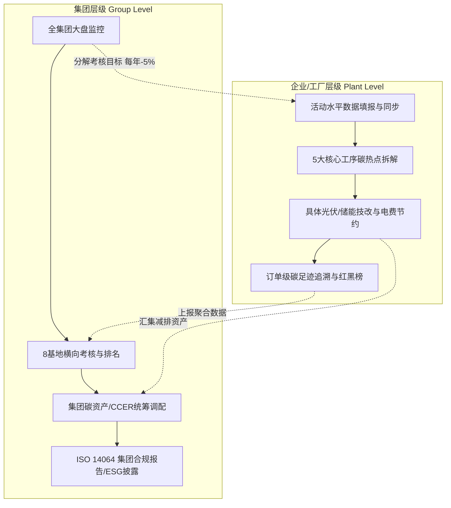

# 20. 集团与企业双层级能碳管控架构设计与功能落地方案

---

## 🏢 一、双层级设计哲学与总体定位

特变电工（电装集团）“双中心”数字化集成平台在设计【碳管理】与【专项碳排与减排】时，必须严格区分**集团（Group Level）**与**企业/工厂（Enterprise / Plant Level）**两个管理层级。

> **核心设计准则**：  
> **“集团看大盘、抓考核、控战略、配资产；企业看细节、抓工序、填数据、做技改”**  
> 巧妙化解跨层级数据口径差异与管理颗粒度矛盾，既保证集团宏观战略统一，又满足底层基地精细化操作诉求。

---

## 📊 二、双层级数据维度与核心诉求差异矩阵

| 对比维度 | 🏢 集团层级 (Group Level · 电装集团本部) | 🏭 企业/工厂层级 (Plant Level · 沈变/衡变/鲁缆等) |
| :--- | :--- | :--- |
| **主要使用者** | 集团总裁、分管能碳高管、集团能源资产管理部 | 制造基地厂长、车间主任、动力科长、能源碳资产专员 |
| **核心管理诉求** | **看大盘、抓考核、控战略、配资产** • 总裁“每年同比下降5%”全集团战略督办 • 8大制造基地横向对比、综合标杆达标率 • 集团总碳配额、CCER 资产池统一盘点与调配 • 集团对外碳中和示范、ESG 披露与第三方评级 | **看细节、抓工序、填数据、做技改** • 具体产线、车间、高耗能设备测点监测 • 真实活动水平数据（电/水/气）填报与核对 • 真实生产订单单台能耗/碳排分析与红黑榜 • 具体光伏/储能/余热技改建设进度与电费节省 |
| **数据颗粒度** | **宏观聚合 + 基地级横向指标** • 集团总排放量 (Scope 1/2/3)、净排放量 • 各基地万元产值碳强度及同比排名 • 集团减排项目投资总览 (IRR / 年化节碳量) • 集团 CCER 资产核证总量与市值 | **微观工序 + 订单/设备级明细** • 铁芯/线圈/真空干燥罐/试验站各工序直接排放 • 电网因子/天然气折算过程明细公式 • 具体项目 EPC、逆变器效率、日消纳曲线 • 异常工序排查、节能工单派发与闭环整改 |
| **穿透与下钻边界** | **最多下钻至电装成品/基地总体** • 严禁过度暴露车间底层工艺与配方数据 • 重点提供“集团大盘排名与趋势总览”弹窗 | **深度穿透至具体工序、测点与订单** • 支持穿透至干燥罐、电抗器试验站、具体订单号 • 提供分子分母原数据校验与修改记录追溯 |

---

## 🎯 三、【碳管理】三大子模块双层级功能设计

### 3.1 碳排放核算 (`carbon/accounting.html`)
* **🏢 集团视角 (选中“特变电工集团”)**：
  1. **全集团碳排放大盘**：汇总 6 大板块、8 家基地总净碳排放量（`18.42 万吨 CO₂`），展示 Scope 1（化石直接）、Scope 2（外购电热）、Scope 3（供应链运输）比例；
  2. **8 家基地达标红黑榜**：按万元产值碳强度升序排列，展示达标状态（绿灯超额达标 vs 红灯超标预警）；
  3. **因子标准统一管控**：集团层级固化并下发最新区域电网排放因子标准版本。
* **🏭 企业视角 (选中“沈变本部”或“新变厂”)**：
  1. **活动水平数据填报与同步**：该基地市电（kWh）、天然气（m³）、蒸汽（t）、直供绿电（kWh）等原始台账与同步状态；
  2. **动态公式透明穿透**：Scope 1/2/3 明细卡片点击弹出专属计算公式，分子分母透明可查；
  3. **异常突增智能预警**：单月介质消耗突增 >15% 自动标黄提示动力车间复核。

### 3.2 碳排放分析 (`carbon/analysis.html`)
* **🏢 集团视角**：
  1. **基地四象限散点矩阵**：横轴“产值规模”，纵轴“万元产值碳强度”，直观区分领跑基地、稳健基地、潜力基地与重点改善基地；
  2. **集团 12 个月大盘演进趋势**：实测走势 vs 集团领跑目标线对比；
  3. **全集团全介质碳热点桑基图**：直观展示能源介质流向变压器/线缆两大板块的碳排分布。
* **🏭 企业视角**：
  1. **车间工序碳排强度拆解**：变压器 5 大核心工序（铁芯剪切/线圈绕制/真空干燥/总装配/试验站）碳强度柱状图；
  2. **重点型号单台碳足迹对标**：如 ODFS-334MVA 单台碳足迹与行业先进定额对比；
  3. **工序减排诊断建议**：自动识别高碳瓶颈并生成技改建议工单。

### 3.3 碳核算报告 (`carbon/report.html`)
* **🏢 集团视角**：
  1. **集团级 ISO 14064-1 / ESG 披露报告**：一键生成面向上市公司与投资者的全景碳盘查报告；
  2. **跨年度减排成效对比库**：历年集团碳盘查报告归档与减排轨迹图谱；
  3. **第三方核查一键打包**：自动汇聚 8 家工厂核算佐证数据包，供权威机构核验。
* **🏭 企业视角**：
  1. **工厂级专项核算报告**：导出该基地专属的季度/年度碳排放报告；
  2. **核查资料在线上传**：上传电费账单、天然气发票、绿证凭证等原始凭证。

---

## ⚡ 四、【专项碳排与减排】四大子模块双层级功能设计

### 4.1 项目台账 (`project/archive.html`)
* **🏢 集团视角**：
  1. **集团资产总盘**：总投资额（`1.85 亿元`）、总装机容量（`42.5 MW/MWh`）、年化总节碳量（`3.82 万吨 CO₂`）；
  2. **多基地项目布局看板**：平铺 8 家基地在建与并网项目矩阵，实时监测绿电替代率提升进度。
* **🏭 企业视角**：
  1. **本厂项目数字卡片**：如“沈变本部 5.8MW 屋顶光伏”、“2MW/4MWh 储能电站”；
  2. **运维与工程参数**：并网日期、EPC 厂商、逆变器运行效率、每日发电与消纳时序曲线。

### 4.2 减排建模 (`project/model.html`)
* **🏢 集团视角**：
  1. **统一方法学模型库**：维护并发布国家 CCER 权威方法学（可再生能源并网 CMS-001、工业余热利用）；
  2. **集团减排空间宏观推演**：模拟未来 3 年全集团光伏铺满情景下的碳减排总量与节费潜力。
* **🏭 企业视角**：
  1. **项目级参数模拟器**：支持输入装机容量、年有效利用小时数、系统效率、衰减率，动态模拟 25 年现金流与逐年节碳量；
  2. **基准线情景对比**：直观对比“无项目基准线” vs “技改项目情景”能耗与碳排差异。

### 4.3 效益评估 (`project/benefit.html`)
* **🏢 集团视角**：
  1. **全集团投资回报综合大盘**：全集团综合 IRR（`11.8%`）、平均静态回收期（`5.6 年`）、年化总节费（`2,480 万元`）；
  2. **各基地投资回报率横向排行**：资金利用效率评估与优质项目示范推广。
* **🏭 企业视角**：
  1. **度电成本 (LCOE) 与收益构成**：自发自用节约电费 vs 余电上网收益明细；
  2. **月度财务账单对冲**：直观对比项目投运前后工厂电费账单节约金额。

### 4.4 自愿减排(CCER) (`project/self.html`)
* **🏢 集团视角**：
  1. **集团 CCER 资产池统筹**：全集团已核证 CCER 资产（`6.5 万吨`）、预估市值（`460 万元`）；
  2. **集团内部配额抵消流转**：模拟各工厂超标配额通过集团内部 CCER 统一抵消。
* **🏭 企业视角**：
  1. **本厂 CCER 申报项目推进看板**：立项 ➔ 审定 ➔ 备案 ➔ 监测 ➔ 核证全流程 5 级步进器；
  2. **核证资料填报与监测数据上传**：提交并网电表逆流监测日志与第三方审定报告。

---

## 🛠️ 五、落地文件与实现架构映射

* [`/html/zero-carbon/carbon/accounting.html`](file:///d:/Project/TJ-nengtan/html/zero-carbon/carbon/accounting.html) —— 碳排放核算
* [`/html/zero-carbon/carbon/analysis.html`](file:///d:/Project/TJ-nengtan/html/zero-carbon/carbon/analysis.html) —— 碳排放分析
* [`/html/zero-carbon/carbon/report.html`](file:///d:/Project/TJ-nengtan/html/zero-carbon/carbon/report.html) —— 碳核算报告
* [`/html/zero-carbon/project/archive.html`](file:///d:/Project/TJ-nengtan/html/zero-carbon/project/archive.html) —— 减排项目台账
* [`/html/zero-carbon/project/model.html`](file:///d:/Project/TJ-nengtan/html/zero-carbon/project/model.html) —— 减排建模
* [`/html/zero-carbon/project/benefit.html`](file:///d:/Project/TJ-nengtan/html/zero-carbon/project/benefit.html) —— 效益评估
* [`/html/zero-carbon/project/self.html`](file:///d:/Project/TJ-nengtan/html/zero-carbon/project/self.html) —— 自愿减排(CCER)
