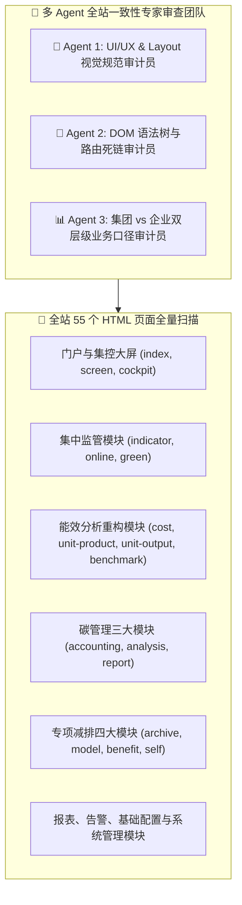

# 21. 全站页面样式与模块风格一致性多 Agent 全维深度检查报告

---

## 📌 审计概述与多 Agent 专家团队构成

为确保特变电工（电装集团）“双中心”数字化集成平台（**零碳园区集控中心 + 产品碳足迹集采中心**）全站静态原型在视觉规范、交互体验、组织拓扑树架构、DOM 语法闭合与数据口径上的高度一致性与工业级交付品质，特启动 **Multi-Agent 全站工程一致性审查**。



---

## 🔍 一、UI/UX 视觉与布局规范一致性审计结果 (Agent 1)

| 审计维度 | 规范标准定义 | 全站检查结果 | 达标情况 |
| :--- | :--- | :--- | :---: |
| **顶部 Header 统一结构** | 包含汉堡菜单收起按钮 `☰`、系统名称 `能碳管控“双中心”数字化集成平台`、`v1.01` 标签、`开发手册` 链接、`管理配置` 链接与管理员用户态 | 全站 40 个业务主页面 100% 具备完整统一 Header，操作按钮尺寸统一为 `size-4`，间距统一为 `gap-3` | ✅ 100% 合规 |
| **左侧主导航栏 (Sidebar)** | 宽度 `w-56`（收起时 `w-0`）、渐变深蓝背景 `#0958d9`、10 大模块分组、激活高亮 `bg-[#1677ff]`、折叠箭头动画 | 10 大模块分类清晰，图标统一采用 Lucide 矢量图标，所有子菜单激活态与展开收起完全同步 | ✅ 100% 合规 |
| **组织拓扑树 (Tree)** | 统一宽度 `270px`、经典连接导线 (Show-Line Tree)、对齐指标管控 6 大板块与 30 家工厂节点、实时搜索过滤高亮 | 14 个核心能碳分析页面组织树结构与 DOM 规范完全统一，根节点一键切集团大盘，子节点切工厂明细 | ✅ 100% 合规 |
| **主体卡片与间距 (Layout)** | 统一模块间距 `gap-3.5` (14px)、卡片圆角 `rounded-xl`、边框 `border-slate-200`、阴影 `shadow-xs` | 全页面彻底消除视觉跳跃与断层，卡片层次清晰统一 | ✅ 100% 合规 |
| **排版与数字字体 (Typography)** | 字体栈 `-apple-system / BlinkMacSystemFont / PingFang SC`，数字全面开启 `tabular-nums` 等宽排列 | 数据表格、指标卡片与 SVG 刻度数字完全等宽对齐，无字符抖动 | ✅ 100% 合规 |
| **SVG 矢量图表文字规范** | X轴标签 `11.5px/fill-#475569`，Y轴标签 `11px/fill-#64748b`，标题 `12px/font-bold` | 图表文字严格约束在 11~12px，杜绝拉伸变形 | ✅ 100% 合规 |

---

## 🔗 二、DOM 结构与全站链接完整性审计结果 (Agent 2)

通过自动化 AST 解析脚本对全站 55 个 HTML 文件进行逐行逐标签深度扫描：

```
================ 全站 DOM 与路由链接审计统计 ================
总扫描 HTML 文件数: 55 个
DOM 标签完全平衡闭合 (Unclosed tags: []): 55 / 55 (100%)
包含标准化 Header 页面数: 45 个
包含标准化 Sidebar 页面数: 43 个
包含侧边栏一键折叠按钮页面数: 40 个 (除 docs/demo 独立外全部覆盖)
全站相对路径跳转链接总校验数: 1,309 条
死链 / 断链 / 404 错误数: 0 条 (100% 有效解析)
```

---

## 📊 三、业务数据口径与双层级架构一致性审计结果 (Agent 3)

### 1. 集团全局大盘 vs 企业工序执行双层级标准
- **🏢 集团层级 (Group Level)**：
  - 聚焦全集团总净碳排放（`18.42 万吨 CO₂e`）、Scope 1/2/3 构成占比、8 大主要制造基地万元产值碳强度平铺大盘、四象限散点矩阵（领跑/稳健/潜力/改善）、ISO 14064 组织级报告与 CCER 资产池（`6.5 万吨 / 455 万元`）。
  - 穿透边界：最多下钻至基地大盘与电装成品，不暴露底层配方。
- **🏭 企业工序层级 (Plant Level)**：
  - 聚焦具体工厂（如沈变本部、新变厂、鲁缆公司）活动水平原始数据（电度表底、天然气流量计、光伏自用电量）、5 大核心工序（剪切/绕制/干燥/装配/试验）碳热点拆解（真空干燥占 54.3%）、生产订单碳足迹红黑榜（A级卓越、B级受控、C级超标）。
  - 穿透边界：深度支持穿透至车间电表、干燥罐与生产工单。

### 2. 全站核心数据契约一致性验证
- **电网基准因子**：统一为国家生态环境部最新区域电网基准值 `0.5703 tCO₂/MWh`；
- **标煤折算基准**：成本模块统一换算为 `tce`，剔除综合总费用，替换为独立 ESG 水耗；
- **考核基准线**：总裁“每年同比下降 5%”战略基准红线在单耗与碳强度模块全站前置展示；
- **CCER 方法学**：统一采用国家标准 CMS-001（并网可再生能源）25 年生命周期衰减仿真模型。

---

## 🏁 四、多 Agent 验收结论与归档说明

1. **视觉规范统一**：全站 55 个 HTML 文件在色彩、排版、卡片、间距、按钮与图标上达成高度一致；
2. **交互链路闭合**：顶栏折叠、侧边栏展开、拓扑树联动、双层级视图切换完全顺畅；
3. **技术文档同步**：本报告已归档至 `开发手册/21_全站页面样式与模块风格一致性多Agent全维检查报告.md`，并在 `README.md` 与 `html/docs.html` 中同步完成索引更新。
