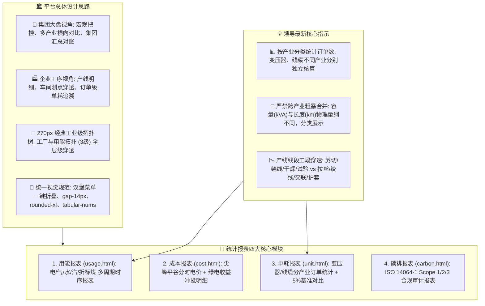

# 22. 统计报表模块多 Agent 全维需求分析与高保真原型设计方案

---

## 📌 一、模块总体定位与业务背景

在特变电工（电装集团）“双中心”数字化集成平台（**零碳园区集控中心 + 产品碳足迹集采中心**）中，【统计报表模块】（包含：**用能报表、成本报表、单耗报表、碳排报表**）是全集团能源运行、财务对账、产线工单考核、碳足迹核证以及向政府/权威第三方（SGS/CQC）提交合规报告的**核心数据输出枢纽**。



---

## 👥 二、多 Agent 专家团队多维分析报告

### 1. 💼 产品经理与业务流分析 (Role: PM & UI/UX)

#### (1) 集团大盘 vs 企业工序 双层级报表场景定义
| 报表名称 | 🏢 集团全局汇总视角 (Group Level) | 🏭 企业/工厂执行视角 (Plant Level) |
| :--- | :--- | :--- |
| **用能报表** | 全集团 8 基地能耗总盘月报/年报、六大产业板块折标煤消费占比、重点介质（电/气/汽/水）汇总对账 | 具体工厂（如沈变本部、鲁缆本部）24小时日负荷报表、车间电表分时电量、重点耗能工段时序曲线 |
| **成本报表** | 集团能源采购总费用、各基地度电综合加权单价、折标煤综合单价（4,834元/tce）、绿电效益横向榜 | 工厂月度电费财务对账单（尖峰平谷电量与电费分摊）、力调电费、基本电费、天然气结算单 |
| **单耗报表** | 变压器板块（沈变/衡变/新变）与线缆板块（鲁缆/新缆/德缆）**分产业分类统计订单总数与达标率** | 单笔生产订单（如 ODFS-334MVA 或 110kV YJLW03）工段级实测能耗、标杆对标红黑榜 |
| **碳排报表** | 集团 18.42 万吨温室气体排放月度清单、各板块 Scope 1/2/3 排放结构、ESG 权威审计打包 | 单厂季度碳盘查报表、直接化石燃烧活动水平数据表、电费发票原件凭证归档 |

#### (2) 核心落实：“按产业分类统计订单数，变压器、线缆分别计算”
* **业务矛盾**：变压器产品以容量（`kVA / MVA`）与台数（`台`）为物理交付基数；线缆产品以长度（`km`）、截面积（`mm²`）或吨位（`t`）为物理交付基数。二者物理量纲完全不可比，若简单合并求和将导致“平均单耗”失去工业指导意义。
* **产品解决方案**：
  1. **双产业独立工作台 Tab / 分组矩阵**：在单耗报表顶部设置 `【全部产业】`、`【变压器制造产业 (3家基地)】`、`【线缆制造产业 (3家基地)】` 快速切换；
  2. **变压器产业专用报表列**：订单编号、客户名称、产品型号（如 SSP-840000/500）、额定容量 (MVA)、工段电耗（剪切/绕线/真空干燥/试验）、综合单耗 (`kWh/MVA` 或 `tce/台`)、总裁 -5% 达标状态；
  3. **线缆产业专用报表列**：订单编号、工程项目名称、线缆规格（如 220kV 1×800mm²）、生产长度 (km)、工段电耗（拉丝/绞线/绝缘/成缆/护套）、综合单耗 (`kWh/km·mm²` 或 `tce/km`)、达标状态。

---

### 2. 🏛️ 系统架构与数据模型设计 (Role: Architect & Backend)

#### (1) 报表聚合数据模型 (OLAP ClickHouse / MySQL Schema)

```sql
-- 1. 产业订单单耗报表明细表 (支持变压器/线缆分产业查询)
CREATE TABLE tbea_report_order_unit_consumption (
    order_id VARCHAR(64) NOT NULL COMMENT '生产订单编号',
    industry_type ENUM('TRANSFORMER', 'CABLE', 'SWITCH', 'OTHER') NOT NULL COMMENT '产业分类: 变压器/线缆/开关',
    company_id VARCHAR(32) NOT NULL COMMENT '归属公司: 沈变/衡变/新变/鲁缆/新缆/德缆',
    factory_name VARCHAR(64) NOT NULL COMMENT '生产工厂名称',
    workshop_name VARCHAR(64) NOT NULL COMMENT '生产车间',
    product_model VARCHAR(128) NOT NULL COMMENT '产品规格型号',
    
    -- 变压器产业物理量
    transformer_capacity_mva DECIMAL(10,2) DEFAULT NULL COMMENT '变压器容量 (MVA)',
    transformer_voltage_kv DECIMAL(10,2) DEFAULT NULL COMMENT '电压等级 (kV)',
    
    -- 线缆产业物理量
    cable_length_km DECIMAL(10,3) DEFAULT NULL COMMENT '线缆生产长度 (km)',
    cable_cross_section_mm2 DECIMAL(10,2) DEFAULT NULL COMMENT '截面积 (mm2)',
    
    -- 工序级能耗拆解 (kWh)
    process_stage_1_kwh DECIMAL(12,2) DEFAULT 0 COMMENT '工序1能耗(剪切/拉丝)',
    process_stage_2_kwh DECIMAL(12,2) DEFAULT 0 COMMENT '工序2能耗(绕线/绞线)',
    process_stage_3_kwh DECIMAL(12,2) DEFAULT 0 COMMENT '工序3能耗(真空干燥/交联绝缘)',
    process_stage_4_kwh DECIMAL(12,2) DEFAULT 0 COMMENT '工序4能耗(总装/成缆)',
    process_stage_5_kwh DECIMAL(12,2) DEFAULT 0 COMMENT '工序5能耗(出厂试验/护套)',
    
    total_energy_kwh DECIMAL(14,2) NOT NULL COMMENT '订单总耗电量 (kWh)',
    total_energy_tce DECIMAL(10,4) NOT NULL COMMENT '订单折标煤量 (tce)',
    unit_consumption DECIMAL(10,4) NOT NULL COMMENT '单位产品综合单耗 (kWh/MVA 或 kWh/km)',
    baseline_target DECIMAL(10,4) NOT NULL COMMENT '去年同期基准值 (tce)',
    target_reduction_pct DECIMAL(5,2) NOT NULL COMMENT '同比降幅 (%)',
    audit_status ENUM('EXCELLENT', 'CONTROLLED', 'WARNING') NOT NULL COMMENT '达标评级: A超额达标/B受控/C超标预警',
    stat_period_date DATE NOT NULL COMMENT '完工统计日期',
    PRIMARY KEY (order_id, industry_type, stat_period_date)
) ENGINE=InnoDB DEFAULT CHARSET=utf8mb4 COMMENT='产业分类订单单耗统计报表';
```

---

### 3. 🎨 前端组件与页面布局规范 (Role: Frontend & UI/UX)

4 大报表页面严格沿用平台标准框架：
1. **左侧 270px 拓扑树**：`工厂与用能拓扑 (3级) 全层级穿透`，带实时搜索与连接线，支持树节点过滤；
2. **顶部多维复合检索过滤栏**：
   - 统计周期：`日报` / `月报` / `季报` / `年报` 单选切换；
   - 产业分类：`全部产业` / `变压器产业` / `线缆产业` / `成套电气`；
   - 日期范围选择器 + 快捷查询按钮 + 批量导出（Excel / PDF / CSV）下拉菜单；
3. **顶置核心 KPI 汇总胶囊**：显示当期汇总用能、总费用、有效订单数（分产业角标）、平均单耗与达标率；
4. **冻结表头复杂多级数据透视表**：
   - Sticky Header 置顶，支持水平平滑滚动；
   - 斑马纹与悬浮高亮（`hover:bg-blue-50/50`）；
   - 数字全面采用 `tabular-nums font-mono` 等宽排列。

---

### 4. 🛡️ 测试用例矩阵与安全防护 (Role: QA & Security)

| 测试编号 | 业务测试场景 | 预期测试结果 | 安全与性能防护策略 |
| :--- | :--- | :--- | :--- |
| **TC-REP-01** | 变压器产业与线缆产业订单数量分别统计 | 变压器产业显示 48 笔（总容量 12,450 MVA），线缆产业显示 62 笔（总长度 3,840 km），不进行跨量纲数值相加 | 前端强制根据产业类型分别渲染物理单位，后端聚合 SQL 使用 `GROUP BY industry_type` |
| **TC-REP-02** | 导出 10 万条跨周期历史报表 | 异步生成并提供进度弹窗，支持一键下载 `.xlsx` | 后端采用流式导出（Stream Export）与分片读取，防止 JVM OOM 内存溢出 |
| **TC-REP-03** | 产线零产出 / 新投产车间单耗计算 | 报表中单耗指标安全展示为 `--` 或 `0.00` | 数据库层与计算引擎严格使用 `NULLIF(capacity, 0)` 除零防御 |
| **TC-REP-04** | 单厂操作员查看报表权限审查 | 仅可查看本厂所属工单与报表，集团大盘与跨基地成本列自动隐藏或脱敏 | ABAC 行级数据权限网关拦截，敏感成本列自动脱敏 |

---

## 🖥️ 三、4 大报表原型详细设计规范与功能矩阵

### 1. 📑 用能报表 (`/zero-carbon/reports/usage.html`)
* **定位**：全厂级与介质级时序用能消费报表；
* **表头结构**：序号、所属单位、统计周期、市电电量 (kWh)、光伏自发自用 (kWh)、绿电消纳 (kWh)、天然气 (m³)、水耗 (t)、蒸汽 (GJ)、综合能耗 (tce)、同比 (%)、环比 (%)。

### 2. 💰 成本报表 (`/zero-carbon/reports/cost.html`)
* **定位**：分时费价与综合用能账单核算报表；
* **表头结构**：序号、所属基地、结算月份、尖峰电费 (万元)、高峰电费 (万元)、平段电费 (万元)、低谷电费 (万元)、燃气费 (万元)、水资源费 (万元)、蒸汽费 (万元)、光伏降本对冲 (万元)、净能源成本 (万元)、综合度电成本 (元/kWh)。

### 3. 🎯 单耗报表 (`/zero-carbon/reports/unit.html`) —— 核心产业分类
* **定位**：分产业分类统计订单级与产线级单耗工作台；
* **Tab 1 变压器产业单耗报表**：
  - 表头：订单号、基地工厂、产品型号、额定容量 (MVA)、剪切电耗、绕线电耗、干燥电耗、试验电耗、总电耗 (kWh)、单位容量单耗 (`kWh/MVA`)、折标煤 (`tce/台`)、基准线、达标评级；
* **Tab 2 线缆产业单耗报表**：
  - 表头：订单号、基地工厂、线缆规格、生产长度 (km)、截面 (mm²)、拉丝电耗、绞线电耗、交联电耗、护套电耗、总电耗 (kWh)、单位长度单耗 (`kWh/km`)、达标评级；
* **Tab 3 产值单耗宏观对标**：各工厂万元产值能耗综合横向对比。

### 4. 🌱 碳排报表 (`/zero-carbon/reports/carbon.html`)
* **定位**：ISO 14064-1 标准温室气体排放清单与合规审计；
* **表头结构**：核算周期、组织边界、Scope 1 直接化石排放 (tCO₂e)、Scope 2 外购电力排放 (tCO₂e)、Scope 3 供应链间接排放 (tCO₂e)、绿电消纳减排量 (-tCO₂e)、CCER 抵扣量 (-tCO₂e)、总净排放量 (tCO₂e)、万元产值碳强度 (tCO₂e/万元)、核查认证机构。

---

## 📚 四、交付与实施路线

1. **第一阶段（原型落地）**：按照统一 270px 拓扑树与标准 Header/Sidebar 规范，重构 `reports/` 目录下 4 个 HTML 静态页面；
2. **第二阶段（契约对接）**：根据上述 SQL Schema 开放 RESTful OpenAPI 3.0 数据接口，支持 Excel 模板与多维度异步导出；
3. **第三阶段（多产业演进）**：接入 MES 订单排产系统，实时拉取变压器与线缆产线线段能耗表底，自动生成产业订单单耗报表。
