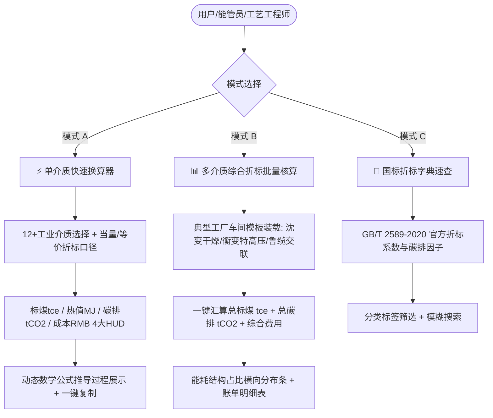

# 📊 23_能源转换工具多Agent评估与全维重构方案

## 1. 业务背景与重构定位

特变电工（电装集团）下辖 15 大现代化工业园区与 21 家重型制造基地。在“零碳园区集控中心”与“产品碳足迹集采中心”建设中，**能源转换与折标核算**是贯穿底层 SCADA 数据采集、车间月度报表填报、工序单耗考核、产品 LCA 碳足迹模型以及欧盟 CBAM 碳关税申报的**基石级计算引擎**。

---

## 2. 核心功能架构

---

## 3. 国标能源介质参数矩阵

依据 **GB/T 2589-2020《综合能耗计算通则》** 及生态环境部最新公告因子：

| 能源介质名称 | 计量单位 | 低位发热量 (MJ) | 当量折标系数 (kgce) | 等价值折标系数 (kgce) | 碳排放因子 (kgCO2) | 选用依据与标准出处 |
| :--- | :---: | :---: | :---: | :---: | :---: | :--- |
| **电网电力 (市电)** | kWh | 3.6000 | 0.1229 | 0.3150 | 0.5703 | GB/T 2589 (当量) / 全国电网平均 |
| **管道天然气** | m³ | 38.9310 | 1.3300 | — | 2.1622 | GB/T 2589-2020 附录 A |
| **过热工业蒸汽 (1.6MPa)** | t | 3050.0000 | 104.1000 | — | 77.3000 | GB/T 2589-2020 焓值法测算 |
| **饱和工业蒸汽 (0.8~1.0MPa)**| t | 2756.7000 | 94.1000 | — | 65.2000 | GB/T 2589-2020 饱和蒸汽表 |
| **轻柴油 (生产动力)** | kg | 42.6520 | 1.4571 | — | 3.1000 | GB/T 2589-2020 表 A.1 |
| **车用汽油** | kg | 43.0700 | 1.4714 | — | 2.9250 | GB/T 2589-2020 表 A.1 |
| **动力原煤 / 烟煤** | kg | 20.9080 | 0.7143 | — | 1.9000 | GB/T 2589-2020 表 A.1 |
| **工业新鲜自来水** | t | 2.5100 | 0.0857 | — | 0.1680 | 地方耗能工质折标通则 |
| **工业软化脱盐纯水** | t | 14.2300 | 0.4857 | — | 0.9520 | 高纯水制备折标标准 |
| **压缩空气 (0.8MPa)** | m³ | 1.1700 | 0.0400 | — | 0.0230 | 机械工业能耗统计通则 |
| **高纯氢气 (99.999%)** | m³ | 12.7400 | 0.4350 | — | 0.0000 | 工业气体折标技术规程 |
| **高纯氮气 (N₂)** | m³ | 1.9000 | 0.0650 | — | 0.0284 | 空分气体工质折标规范 |
