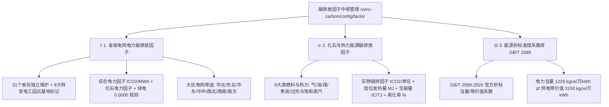

# 📊 24_碳排放因子三大维度独立维护架构设计与落地方案

## 1. 业务背景与重构定位

在特变电工（电装集团）“零碳园区集控中心”与“产品碳足迹集采中心”中，**碳排放因子与折标煤系数**是全厂组织碳排放核算 (Scope 1 / Scope 2 / Scope 3) 以及产品 LCA 碳足迹计算（ISO 14067 / CBAM 碳关税）的核心基准参数。

针对业务要求，系统将【碳排放因子】配置模块划分为**三大独立维护板块**：
1. ⚡ **省级区域电网电力碳排放因子**（支持全国 31 省级电网独立配置、特变电工 8 大产业基地重点标记、绿电 0 排放核算）
2. 🔥 **化石与热力能源碳排放因子**（天然气、轻柴油、汽油、原煤、焦炭、工业蒸汽等实物因子、发热量、含碳量与氧化率）
3. ⚖️ **能源折标准煤系数库 (GB/T 2589-2020)**（国家标准官方折标系数、低位发热量基准、当量值与等价值双口径）

---

## 2. 核心架构与功能矩阵

---

## 3. 核心参数标准基准矩阵

### 3.1 省级电网电力碳排放因子精选（特变电工核心园区所在省份）
| 省份 / 区域电网 | 所属大区 | 特变电工基地 | 综合电力碳排因子 (tCO2/MWh) | 化石电力因子 (tCO2/MWh) | 绿电核算因子 | 发布依据与来源出处 |
| :--- | :---: | :---: | :---: | :---: | :---: | :--- |
| **新疆维吾尔自治区** | 西北 | 昌吉园区/超高压新变 | **0.5312** | 0.7950 | 0.0000 | 国家生态环境部最新区域电网公告 |
| **辽宁省** | 东北 | 沈阳变压器/开关园区 | **0.5840** | 0.8320 | 0.0000 | 东北区域电网省级排放基准 |
| **湖南省** | 华中 | 衡阳变压器/电缆园区 | **0.5120** | 0.7890 | 0.0000 | 华中区域电网湖南省电力碳足迹因子 |
| **山东省** | 华东 | 新泰鲁缆工业基地 | **0.6210** | 0.8650 | 0.0000 | 华东区域电网省级电力排放因子公告 |
| **四川省** | 西南 | 德阳线缆/变压器基地 | **0.1820** | 0.6210 | 0.0000 | 西南高比例清洁水电网发布因子 |
| **陕西省** | 西北 | 西安变压器/套管基地 | **0.5630** | 0.8140 | 0.0000 | 西北电网省级排放基准公告 |
| **天津市** | 华北 | 天津变压器制造园区 | **0.5980** | 0.8410 | 0.0000 | 华北区域电网京津冀电力基准 |
| **全国平均电网** | 全国 | 全局缺省基准 | **0.5703** | 0.8120 | 0.0000 | 生态环境部最新全国电力排放因子公告 |
