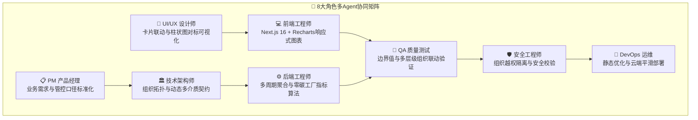

# 📘 27. 单位产值能耗与对标管理多Agent全维重构与落地方案

> **版本**：v2.0.0  
> **更新日期**：2026-08-29  
> **涉及核心模块**：`单位产值能耗 (/zero-carbon/energy/unit-output)`、`对标管理 (/zero-carbon/energy/benchmark)`、`用能结构 (/zero-carbon/energy/structure)`、`能源成本 (/zero-carbon/energy/cost)`  
> **协同团队**：PM、UI/UX、架构师、前端开发、后端引擎、QA、安全合规、DevOps

---

## 🎯 一、 业务背景与重构目标

为了贯彻落实特变电工集团数字化与国家级零碳工厂建设指导方针，统一全集团与各下属经营单位、项目公司的能效对标管控口径，本次重构重点针对 **「单位产值能耗」** 与 **「对标管理」** 两大核心能效分析系统进行了全链路升级：

1. **单位产值能耗全介质动态穿透**：根据所选组织节点的实际能源结构，自适应动态渲染其拥有的能源介质（综合能耗、电耗、蒸汽、天然气、水耗），支持点击卡片即时联动近12个月、近12个季度、近3年历史趋势及同比变化，并支持集团6家单位与经营单位下属项目公司的多级列表透视。
2. **对标管理体系标准化与国家级零碳工厂对标**：
   - 统一四大维度 Tab 命名：**核心指标对比**、**产品单耗对比**、**关键工序单耗对比**、**基准管理**；
   - 建设**国家级零碳工厂核心指标横向对比体系**（单位能耗碳排放、非化石能源消费占比、非化石能源电力消费物理认定电量占比），直观标定国家门槛基准线与特变电工集团均值线；
   - 建立**核心管控指标排名大盘**，对全集团 19 家项目公司/制造车间按单位产值能耗及工业增加值能耗进行综合排名与同比分析；
   - 统一全站顶部自适应多维度时间筛选组件与操作规范。

---

## 🤖 二、 8 大角色多 Agent 需求与架构设计方案



### 2.1 PM (产品经理) 视角：业务价值与指标口径
* **单位产值能耗**：
  * 集团层级：展示全集团万元产值综合能耗及电、汽、气、水各介质单耗，横向下钻展示 6 家主要二级经营单位数据与同比；
  * 经营单位层级：展示该单位所拥有介质单耗，并展示其下属项目公司数据与同比；
  * 项目公司层级：展示该具体工厂的单耗数据与多周期演变趋势。
* **对标管理**：
  * 国家级零碳工厂三大门槛：单位能耗碳排放（≤ 1.80 tCO₂/tce）、非化石能源消费占比（≥ 35.0%）、非化石电力物理认定占比（≥ 30.0%）；
  * 核心管控指标排名：对 19 家项目公司的产值能耗及增加值能耗进行横向 PK 与升降序对标。

### 2.2 UI/UX 设计师视角：视觉动效与交互体验
* **卡片联动高亮**：顶部 KPI 卡片采用 `border-2 border-[#1677ff] ring-2 ring-[#1677ff]/20` 激活态与呼吸圆点动效，点击即时切换趋势图与数据；
* **清晰图表基准线**：柱状图直观标注红色国家门槛虚线与蓝色集团均值实线，柱体按达标情况自适应呈现高饱和蓝/警戒橙；
* **统一顶部工具栏**：采用月度（起止月份选择）、季度（下拉选择）、年度（下拉选择）三大自适应时间维度，右侧精简导出按钮。

### 2.3 前端与架构工程师视角：组件设计与状态驱动
* **组件化组织树**：统一复用 `<StandardOrgTree />`，精准同步选中的组织节点 `level: 'group' | 'company' | 'workshop'`；
* **响应式 Recharts 图表**：使用 `<ResponsiveContainer />` + `<BarChart />`，通过自定义 `Cell` 渲染柱体颜色，并注入 `<ReferenceLine />` 展示对标基准；
* **强类型数据结构**：
  ```typescript
  interface ProjectCompanyBenchmark {
    id: string
    name: string
    parentCompany: string
    carbonPerTce: number
    nonFossilRatio: number
    physicalGreenRatio: number
    unitOutputTce: number
    unitOutputYoy: string
    unitAddedValueTce: number
    unitAddedValueYoy: string
  }
  ```

---

## 📊 三、 核心页面重构明细与路由清单

| 页面路径 | 模块名称 | 核心重构与升级要点 |
| :--- | :--- | :--- |
| `/zero-carbon/energy/unit-output` | **单位产值能耗** | 1. 动态按单位拥有介质渲染万元产值卡片<br/>2. 点击卡片同步联动趋势图（近12月/近12季/近3年）<br/>3. 集团展示6家单位、经营单位展示下属项目公司列表 |
| `/zero-carbon/energy/benchmark` | **对标管理** | 1. 规范 4 大 Tab 名称<br/>2. 国家级零碳工厂核心 3 大指标横向柱状图对标与基准线<br/>3. 核心管控指标排名清单（19家项目公司产值能耗/增加值能耗及同比）<br/>4. 统一右上角时间筛选组件与精简导出按钮 |
| `/zero-carbon/energy/structure` | **用能结构分析** | 1. 顶部时间筛选组件与指标管控规范统一<br/>2. 导出按钮文案精简为“导出”<br/>3. 移除冗余状态胶囊与边框 |
| `/zero-carbon/energy/cost` | **能源成本分析** | 1. 顶部时间筛选组件与指标管控规范统一<br/>2. 导出按钮文案精简为“导出”<br/>3. 移除冗余说明模块与状态标签 |

---

## 🧪 四、 测试与质量验证标准 (QA)

1. **多组织节点切换测试**：
   - 选中“特变电工集团”：卡片展示综合能耗、电耗、蒸汽、天然气、水耗 5 大卡片，表格展示 6 家二级单位；
   - 选中“德缆公司”：自动过滤蒸汽与天然气卡片（因德缆为纯电拉丝），仅展示综合能耗、电耗与水耗；
   - 选中项目公司（如“超高压公司”）：隐藏下属表格，聚焦该车间历史趋势与指标明细。
2. **多周期趋势联动测试**：
   - 点击“万元产值电耗”卡片 ➔ 趋势图标题切换为“万元产值电耗变化趋势”，单位变为 `kWh/万元`，折线数据与最新期值精确对应；
   - 切换“近12个季度”/“近3年” ➔ X 轴与折线点平滑刷新。
3. **零碳工厂柱状图对标测试**：
   - 切换 3 大指标卡片，柱状图横坐标列出 19 家项目公司实测值，门槛线与均值线位置准确计算且 Tooltip 完整显示。

---

## 🚀 五、 生产部署与验证 (DevOps)

1. **本地生产构建**：
   ```bash
   npm run build
   ```
   * 验证全量 60 个静态路由编译 100% 通过（Exit Code 0）。
2. **线上发布**：
   * 静态资源发布至云服务器 `/var/www/tbea-nengtan`；
   * Nginx 平滑重载，生产入口 `http://8.215.89.194:3000` 实时生效。
