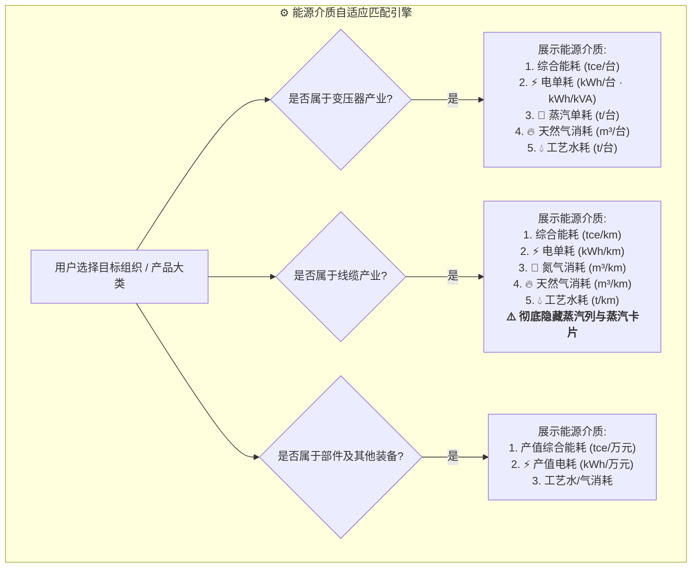

# 🏭 企业、产品、产品类型与消耗能源工序对应规范手册

> **依据文件**：`《生产单位与涉及关键工序对应表(1).et》` (双中心数据需求最新权威基准 2026-08-29)  
> **适用范围**：零碳园区集控中心、能耗能效分析、单位产品能耗、工序单耗对标、指标管控计算引擎

---

## 一、 全景总览与领域界限定义

在特变电工电装集团能碳双中心平台中，各制造企业（一级经营单位与二级项目公司）所生产的产品存在明确的**产品大类**、**细分产品类型**、**核心热/电制造工序**与**主要消耗能源介质**的强对应约束：

1. **变压器产业（特高压/中低压）**：
   - 核心工艺为**真空热干燥 / 固化**与**高压耐压试验**；
   - 必须重点核算 **【电力】** 与 **【工业蒸汽】** 两大主流介质，辅以 **【天然气】**（发生炉/采暖）与 **【工艺新鲜水】**（试压冷却）。
2. **线缆产业（超高压/中低压/特缆）**：
   - 核心工艺为**铜铝连铸拉丝**与**干法悬垂立塔交联**；
   - 必须重点核算 **【电力】** 与 **【高纯工艺氮气】**（绝缘保护介质）；
   - **⚠️ 核心判定原则**：线缆全制造流程**无蒸汽消耗**，在数据采集、指标核算、卡片展示与明细台账中，必须严格自适应隐藏蒸汽指标。
3. **关键配套部件及成套电气产业（开关柜、GIS、电抗器、电容器、GIL、套管、互感器、铁芯）**：
   - 以机械加工、钣金涂装、真空浸渍、绝缘绕制为主，主要消耗 **【电力】**，部分特殊干燥/浸渍工序（如互感器）消耗 **【蒸汽】**。

---

## 二、 生产单位、产品、产品类型与消耗能源完整对应矩阵表

| 行号 | 一级单位 | 二级项目公司 | 所属产品大类 | 主要产品与规格细分 | 涉及关键制造工序 | **工序主要消耗能源** | **管控与核算对应指标** | 业务核算与展示规则 |
| :---: | :--- | :--- | :--- | :--- | :--- | :--- | :--- | :--- |
| 1 | **沈变公司** | **沈变本部** | 变压器产业 | **变压器-高压** (500kV/220kV/110kV) | ① 变压器-高压-干燥 ② 变压器-试验 | **电力、蒸汽** *(试验仅耗电)* | ① 单位产值综合能耗 (`tce/万元`) ② 单位产值电耗 (`kWh/万元`) ③ 单位产值蒸汽消耗 (`t/万元`) ④ 单位产量综合能耗 (`tce/万kVA` · `tce/台`) ⑤ 单位产量电耗 (`kWh/kVA`) ⑥ 单位产量蒸汽消耗 (`t/台`) | 气相干燥需计量煤油气相热蒸汽；试验工位独立装设电度表 |
| 2 |  | 和新套管公司 | 电气配套部件 | **套管** (高压/特高压套管) | ① 套管-干燥 | **电力** | ① 单位产值电耗 (`kWh/万元`) | 烘箱电加热干燥，无蒸汽消耗 |
| 3 |  | 康嘉互感器 | 电气配套部件 | **互感器** (电流/电压互感器) | ① 互感器-干燥 ② 变压器-试验 | **电力、蒸汽** *(试验仅耗电)* | ① 单位产值综合能耗 ② 单位产值电耗 ③ 单位产值蒸汽消耗 | 环氧浇注与干燥罐消耗蒸汽 |
| 4 | **衡变公司** | **衡变本部** | 变压器产业 | **变压器-高压** (1000kV/500kV/220kV) | ① 变压器-高压-干燥 ② 变压器-试验 | **电力、蒸汽** *(试验仅耗电)* | ① 单位产值/产量综合能耗 ② 单位产值/产量电耗 ③ 单位产值/产量蒸汽消耗 | 包含百万伏特高压干燥罐，蒸汽计量主表接入 SCADA |
| 5 |  | **湖南电气** | 变压器产业 | **变压器-高压** (220kV/110kV) | ① 变压器-高压-干燥 ② 变压器-试验 | **电力、蒸汽** | ① 单位产值/产量综合能耗 ② 单位产值/产量电耗 ③ 单位产值/产量蒸汽消耗 | 变压器主产线标准配置 |
| 6 |  | **特能建** | 变压器产业 | **变压器-高压** (新能源升压变) | ① 变压器-高压-干燥 ② 变压器-试验 | **电力、蒸汽** | ① 单位产值/产量综合能耗 ② 单位产值/产量电耗 ③ 单位产值/产量蒸汽消耗 | 新能源集成与升压变总装 |
| 7 |  | 云集电气 | 成套开关设备 | **中低压开关柜** (KYN/GGD) | ① 钣金加工 ② 钣金喷涂 | **电力** | ① 单位产值电耗 (`kWh/万元`) | 数控冲剪与静电喷涂线电耗 |
| 8 |  | 新疆自控 | 成套开关设备 | **中低压开关柜** (配电自控柜) | ① 钣金加工 ② 钣金喷涂 | **电力** | ① 单位产值电耗 (`kWh/万元`) | 钣金成型与烘道电力消耗 |
| 9 |  | 云集高压开关 | 特高压开关 | **GIS** (气体绝缘金属封闭开关) | ① GIS-抽真空 ② GIS-绝缘件干燥 ③ GIS-工频耐压试验 ④ GIS-空调恒温除湿 | **电力** | ① 单位产值电耗 (`kWh/万元`) | 恒温恒湿净化车间空调电耗占比较高 |
| 10 |  | 合容电气股份 | 特种电气装备 | **干式电抗器** (空心/铁心电抗器) | ① 干式电抗器-固化 ② 干式电抗器-试验 | **电力** | ① 单位产值电耗 (`kWh/万元`) | 电加热固化炉，主耗电力 |
| 11 |  | 合容电力设备 | 特种电气装备 | **电容器** (高压并联电容器) | ① 芯子卷绕 ② 真空浸渍 ③ 喷漆 ④ 试验 | **电力** | ① 单位产值电耗 (`kWh/万元`) | 真空浸渍电加热与净化恒温 |
| 12 |  | 赛杰爱迪 | 特高压输电装备 | **GIL** (气体绝缘输电线路) | ① 螺旋焊管生产 ② 绝缘子生产 ③ 测试 | **电力** | ① 单位产值电耗 (`kWh/万元`) | 铝合金管道焊接与绝缘件成型 |
| 13 | **新变厂** | **超高压公司** | 变压器产业 | **变压器-高压** (750kV/500kV/220kV) | ① 变压器-高压-干燥 ② 变压器-试验 | **电力、蒸汽** | ① 单位产值/产量综合能耗 ② 单位产值/产量电耗 ③ 单位产值/产量蒸汽消耗 | 西北输变电中心主体制造厂区 |
| 14 |  | **天变公司** | 变压器产业 | **变压器-中低压-干变** (SCB系列) | ① 干变-固化 ② 变压器-试验 | **电力、蒸汽** | ① 单位产值/产量综合能耗 ② 单位产值/产量电耗 ③ 单位产值/产量蒸汽消耗 | 环氧浇注树脂高温固化工序 |
| 15 |  | **智能电气公司** | 变压器产业 | **变压器-中低压-干变** (配网干变) | ① 干变-固化 ② 变压器-试验 | **电力、蒸汽** | ① 单位产值/产量综合能耗 ② 单位产值/产量电耗 ③ 单位产值/产量蒸汽消耗 | 智能化配电变压器装配区 |
| 16 |  | **京津冀公司** | 变压器产业 | **变压器-中低压-油变** (SZ系列) | ① 油变-干燥 ② 变压器-试验 | **电力、蒸汽** | ① 单位产值/产量综合能耗 ② 单位产值/产量电耗 ③ 单位产值/产量蒸汽消耗 | 华北油浸配电变压器制造区 |
| 17 |  | 珠峰硅钢 | 变压器核心部件 | **变压器-铁芯** (硅钢/非晶) | ① 非晶合金铁心-退火 ② 硅钢铁心-纵剪 ③ 硅钢铁心-中型叠装 ④ 硅钢铁心-大型叠装 | **电力** | ① 铁芯吨产量电耗 (`kWh/t`) | 重点监控纵剪、退火电阻炉与数控叠装电耗 |
| 18 | **鲁缆公司** | **鲁缆本部** | 线缆产业 | **线缆-中低压 / 线缆-高压** | ① 线缆-拉丝 (铜/铝) ② 线缆-中低压-交联 (干法) ③ 线缆-高压-交联 (干法立塔) | **电力、氮气** *(⚠️ 全线无蒸汽)* | ① 单位吨铜电耗 (`kWh/t`) ② 单位吨铝电耗 (`kWh/t`) ③ 单位产量电耗 (`kWh/km`) ④ 单位综合单耗 (`tce/km`) | **重点**：超高压干法悬垂立塔交联需计量高纯保护氮气消耗量；铜拉丝按吨铜考核 |
| 19 |  | **曙光公司** | 线缆产业 | **线缆-特种电缆** (光伏/风电软缆) | ① 细线拉丝 ② 环保挤塑与交联 | **电力、氮气** | ① 吨铜电耗 (`kWh/t`) ② 单位产量电耗 (`kWh/km`) | 特种耐寒耐扭曲软电缆生产线 |
| 20 | **新缆厂** | **特变电工新疆电缆有限公司** | 线缆产业 | **线缆-中低压 / 线缆-高压** | ① 线缆-拉丝 ② 线缆-中低压-交联 (干法) | **电力、氮气** | ① 单位吨铜/吨铝电耗 ② 单位产量电耗 (`kWh/km`) | 新疆区域主力线缆生产基地 |
| 21 |  | **特变电工新疆线缆厂** | 线缆产业 | **线缆-中低压** (民用/建筑线缆) | ① 线缆-拉丝 ② 线缆-中低压-交联 (干法) | **电力、氮气** | ① 单位吨铜/吨铝电耗 ② 单位产量电耗 (`kWh/km`) | 连续连铸连轧拉丝工段 |
| 22 | **德缆公司** | **特变电工（德阳）电缆股份有限公司** | 线缆产业 | **线缆-中低压 / 线缆-高压** | ① 线缆-拉丝 ② 线缆-中低压-交联 (干法) | **电力、氮气** | ① 单位吨铜/吨铝电耗 ② 单位产量电耗 (`kWh/km`) | 西南线缆制造中心，主力消耗清洁水电与氮气 |

---

## 三、 产品单耗与工序能源匹配设计准则

在前端原型及后端计算引擎中，必须严格贯彻以下业务逻辑：

### 1. 为什么线缆产业不呈现蒸汽？
根据工艺物理特性，线缆制造中的交联工序采用“干法悬垂立塔交联”或“连续挤塑硫化”，加热采用电加热套，保护气氛采用高纯氮气（$N_2$），冷却采用循环冷却水。整个生产车间不设蒸汽管网，无工业蒸汽消耗。若在界面中展示“蒸汽消耗：0.00”或空列，会严重误导业务用户。**因此必须自适应隐藏蒸汽列**。

### 2. 为什么变压器产业重点呈现电与蒸汽？
大型电力变压器核心绝缘结构（绝缘纸板、垫块、线圈）在装配前必须经过“煤油气相真空干燥处理”或“热风循环蒸汽烘干”，消耗大量中低压过热蒸汽（折标煤系数 $0.1286	ext{ kgce/kg}$），干燥工序能耗占变压器制造总能耗的 $50\%\sim 60\%$。出厂试验阶段（雷电冲击、工频耐压、温升试验）则在特高压试验大厅消耗大量瞬时峰值电力。因此变压器产品必须将**电耗与蒸汽消耗**并列为最核心的管控介质。

---

## 四、 版本修订记录

| 版本 | 修订日期 | 修订人 | 修订内容说明 |
| :---: | :---: | :---: | :--- |
| **V1.0** | 2026-08-30 | 数字化双碳项目组 | 根据《生产单位与涉及关键工序对应表(1).et》权威建立全集团 6 大经营单位、22 家二级工厂、产品类型、工序及主要消耗能源对应规范，指导「单位产品能耗」及「工序单耗」开发落地。 |
