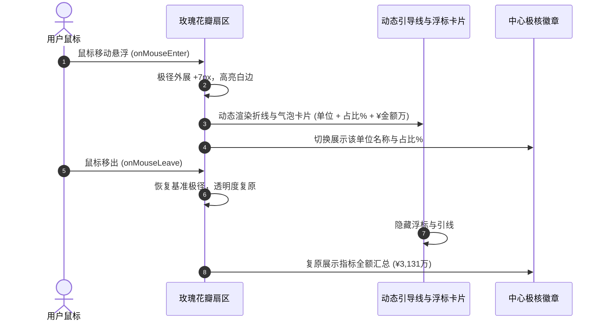

# 29. 能源成本分析直属经营单位层级下钻与南丁格尔玫瑰图开发方案

> **模块路径**：`/zero-carbon/energy/cost`  
> **关联模块**：`/zero-carbon/energy/structure`、`/zero-carbon/energy/unit-output`  
> **适用版本**：特变电工（电装集团）· 能源管理与双中心平台 v1.01

---

## 一、 需求背景与核心设计目标

能源成本分析作为集团经营管理层、财务与生产能源主管决策的核心驾驶舱，承担着“以价值量度量物理能耗、以成本结构指导节能降本”的关键使命。在工业级原型落地过程中，围绕以下关键目标进行了深度重构与升级：

1. **组织层级感知与下钻透视**：
   - 集团视角（1 级节点）：统揽 6 家直属经营单位的能源支出与比重；
   - 经营单位视角（2 级节点）：自动下钻透视该单位下属车间/项目公司明细，支持继续穿透至产线/车间级。
2. **术语规范与台账纯净化**：
   - 规范表格第 2 列表头为 **「直属经营单位」**；
   - 移除「所属基地与电网」与「市电成本占比」等冗余列，强化核心价值指标。
3. **能源介质名称精简化**：
   - 统一缩短为：`市电`、`天然气`、`外购蒸汽`、`油`、`氮气`、`水`，卡片底部统一标明 `占比`。
4. **动态南丁格尔玫瑰图（Nightingale Rose Chart）**：
   - 双维度极坐标表达：极径表金额量（¥ 万元），扇面表份额占比（%）；
   - 交互触发显示：默认纯净无杂乱引线，鼠标指向特定扇区时动态展开引线与数据浮标；
   - 彻底解决 SSR 浮点精度引发的水合不一致（Hydration Mismatch）问题。

---

## 二、 数据模型与结构设计

### 1. 核心成本指标字典（`COST_METRICS_META`）

```typescript
export type CostMetricKey =
  | 'totalCost'
  | 'gridElecCost'
  | 'gasCost'
  | 'steamCost'
  | 'oilCost'
  | 'nitrogenCost'
  | 'waterCost'

export const COST_METRICS_META: Record<CostMetricKey, CostMetricMeta> = {
  totalCost: {
    key: 'totalCost',
    name: '总用能成本',
    shortName: '总用能成本',
    unit: '万元',
    color: '#059669',
    description: '全厂区所有能源介质外购与消费总支出',
  },
  gridElecCost: {
    key: 'gridElecCost',
    name: '市电',
    shortName: '市电',
    unit: '万元',
    color: '#1677ff',
    description: '从公共电网外购结算的电力总费用',
  },
  gasCost: {
    key: 'gasCost',
    name: '天然气',
    shortName: '天然气',
    unit: '万元',
    color: '#f59e0b',
    description: '管道天然气用气采购与燃料支出',
  },
  steamCost: {
    key: 'steamCost',
    name: '外购蒸汽',
    shortName: '外购蒸汽',
    unit: '万元',
    color: '#8b5cf6',
    description: '工业园区集中供热与工艺外购蒸汽费用',
  },
  oilCost: {
    key: 'oilCost',
    name: '油',
    shortName: '油',
    unit: '万元',
    color: '#f43f5e',
    description: '厂区物流运输车辆及发电机柴汽油消费',
  },
  nitrogenCost: {
    key: 'nitrogenCost',
    name: '氮气',
    shortName: '氮气',
    unit: '万元',
    color: '#06b6d4',
    description: '特种绝缘干燥与工艺惰化液氮采购支出',
  },
  waterCost: {
    key: 'waterCost',
    name: '水',
    shortName: '水',
    unit: '万元',
    color: '#0284c7',
    description: '生产循环水与生活辅助用水费用',
  },
}
```

### 2. 2 级直属经营单位下属 3 级单位成本字典（`COMPANY_SUB_UNITS_COST`）

系统内置完整的下属 3 级车间与项目公司数据字典：
- **沈变公司**：沈变本部（¥420.0万）、露娜公司（¥120.0万）、智慧能源（¥72.5万）、和新套管（¥65.0万）、康嘉互感器（¥55.0万）、印能公司（¥30.0万）；
- **衡变公司**：衡变本部（¥320.0万）、南京电研（¥85.0万）、云集电气（¥62.0万）、湖南电气（¥58.0万）、云集高压开关（¥45.0万）、新疆自控（¥35.0万）、上开（¥25.0万）、柯贝尔（¥20.0万）、特能建（¥15.0万）、合容电气（¥12.0万）、赛杰爱迪（¥8.0万）；
- **新变厂**：超高压公司（¥280.0万）、天变公司（¥110.0万）、智能电气（¥80.0万）、京津冀公司（¥55.0万）、珠峰硅钢（¥35.2万）、智慧能源（¥18.0万）、银利电气（¥12.0万）；
- **鲁缆公司**：鲁缆本部（¥260.0万）、智缆公司（¥75.0万）、昭和公司（¥50.8万）、曙光公司（¥35.0万）；
- **新缆厂**：新疆电缆有限公司（¥200.0万）、新疆线缆厂（¥112.0万）；
- **德缆公司**：德阳电缆制造主体车间（¥360.5万）。

---

## 三、 南丁格尔玫瑰图核心算法与实现

### 1. 极坐标数学模型与 SSR 精度控制

```typescript
// 极坐标转换辅助计算函数 (严格保留 2 位小数规范化，防止 SSR 与客户端 Hydration 浮点微差)
function polarToCartesian(centerX: number, centerY: number, radius: number, angleInDegrees: number) {
  const angleInRadians = ((angleInDegrees - 90) * Math.PI) / 180.0
  const x = centerX + radius * Math.cos(angleInRadians)
  const y = centerY + radius * Math.sin(angleInRadians)
  return {
    x: Number(x.toFixed(2)),
    y: Number(y.toFixed(2)),
  }
}

function describeRoseSector(x: number, y: number, innerRadius: number, outerRadius: number, startAngle: number, endAngle: number) {
  const rOut = Number(outerRadius.toFixed(2))
  const rIn = Number(innerRadius.toFixed(2))
  const startOuter = polarToCartesian(x, y, rOut, endAngle)
  const endOuter = polarToCartesian(x, y, rOut, startAngle)
  const startInner = polarToCartesian(x, y, rIn, startAngle)
  const endInner = polarToCartesian(x, y, rIn, endAngle)
  const largeArcFlag = endAngle - startAngle <= 180 ? '0' : '1'

  return [
    'M', startOuter.x, startOuter.y,
    'A', rOut, rOut, 0, largeArcFlag, 0, endOuter.x, endOuter.y,
    'L', startInner.x, startInner.y,
    'A', rIn, rIn, 0, largeArcFlag, 1, endInner.x, endInner.y,
    'Z',
  ].join(' ')
}
```

### 2. 交互式指向触发架构（Hover Callout）



---

## 四、 页面布局与图表尺寸规格

| 图表组件 | 宽度占比 | 高度 | 极径/坐标规格 | 说明 |
| :--- | :--- | :--- | :--- | :--- |
| **南丁格尔玫瑰图** | 5/12 列宽 | **`290px`** | 内径 26px，外径 44~122px | 6 瓣等分角度，极径由金额驱动，悬浮展开折线与气泡卡片 |
| **横向对比柱状图** | 7/12 列宽 | **`310px`** | 直角坐标系，Y 轴自动刻度 | 按金额数值从高到低排序，与左侧玫瑰图形成极坐标与直角坐标双重视角 |
| **直属单位明细台账** | 12/12 铺满 | 自适应 | 6 列紧凑表格 | 支持点击「下钻查看该单位成本」穿透切换组织树 |

---

## 五、 验证与自测用例

1. **组织树下钻验证**：
   - 选根节点「电装集团」➔ 表格展示 6 家直属经营单位，表头显示为 `直属经营单位`；
   - 点击沈变公司「下钻查看该单位成本」➔ 组织树自动高亮沈变公司，表格与图表动态切换为 6 家 3 级车间（沈变本部、露娜公司等）。
2. **交互悬浮测试**：
   - 悬浮在沈变花瓣上 ➔ 极径外展，弹出 `沈变公司 24.4% ¥762.5万元` 气泡卡片；
   - 鼠标离开图表 ➔ 气泡卡片消失，图表恢复纯净极简外观，中心显示 `总额 ¥3,131万`。
3. **SSR 水合测试**：
   - 刷新页面与构建静态导出，控制台 0 错误 0 Hydration Warning。