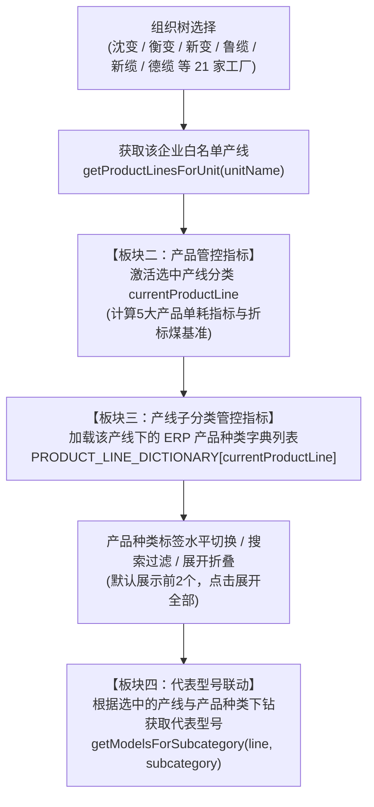

# 📚 35_指标管控产品大类与产品种类标准字典开发手册

> **文档元数据 (Document Metadata)**  
> - **版本号**：V1.0  
> - **编制日期**：2026-09-11  
> - **适用团队**：特变电工能碳数字化双中心研发团队（PM / 前端开发 / 后端架构 / 数据治理 / QA测试）  
> - **关联系统模块**：
>   - 集中监管中心 · 指标管控看板 (`zero-carbon/monitor/indicator`)
>   - 能耗能效分析 · 单位产品能耗与能效对标 (`zero-carbon/energy/unit-product` & `benchmark`)
>   - 产品碳足迹集采中心 · 实景数据库与对比分析 (`carbon-footprint/database/accounting` & `compare` / `ranking`)
> - **权威参考依据**：
>   1. 《01-6 产品分类与产线匹配关系-外发.xlsx》（电气产业产线分类、ERP 导出产品分类、物料与型号明细）
>   2. 《线缆产线分类.xlsx》（线缆产业 8 大产线、14 大产品大类、50+ 产品中类、519 项产品细分四级编码）
>   3. 《生产单位与涉及关键工序对应表(1).et》（6 大经营单位 21 家重点工厂组织白名单与关键工序定义）
>   4. 《“双中心”项目能碳管控指标体系V1.5(1).xlsx》与《能碳管控指标体系-整体产品工序指标.xlsx》

---

## 一、 编制背景与业务价值 (Context & Business Purpose)

### 1.1 建设背景与历史痛点
在特变电工数字化平台建设初期，各直属经营单位（沈变、衡变、新变、鲁缆、新缆、德缆）与下属 21 家专业工厂在上报生产台账、能耗指标与碳足迹核算数据时，存在以下结构性痛点：
1. **层级概念混淆与错位**：“产品大类”、“产线分类”、“产品种类（中类/子类）”与“具体产品型号”在不同系统页面中混用。例如在能效对标与集采中心曾将型号（如 `SFZ11-110`、`YJV-0.6/1kV`）直接作为主筛选条件，导致列表臃肿、跨厂对比维度失焦；
2. **ERP 数据口径脱节**：各厂 ERP 系统导出的产品类别字符串冗长（如 `制造业-变压器产品-交流变压器-35KV及以下`），前端若直接切分或展示会导致排版混乱，缺少工业级简明标准映射；
3. **主观评价与虚假对抗**：部分老版本页面存在跨产业跨品类的虚假横向对比和主观评价用语，严重违背特变电工实事求是的工业中立性原则。

### 1.2 统一的标准四级数据层级模型 (Standard 4-Tier Hierarchy)
为彻底解决上述问题，本项目在前端与数据层全面固化**统一的四级产品分类与能碳核算体系**：

```
Level 1: 产业 (Industry)
  ├── 电器产业 (变压器产业 / 电气装备)
  └── 线缆产业 (电线电缆产业)
        │
Level 2: 产品大类 (Major Category / 对应产线分类 Line Category)
  ├── 电器: 变压器-高压、变压器-中低压-油变、变压器-中低压-干变、套管、互感器、GIS、GIL、电抗器、电容器、开关柜等
  └── 线缆: 电力电缆、电气装备用电线电缆、裸导线/架空导线、特种电缆、橡套电缆、控制电缆、风电电缆、光伏电缆等
        │
Level 3: 产品种类 / 产品中类 / 产线子分类 (Product Subcategory / Medium Category)
  ├── 电器: 交流变压器-110KV、特种变压器-电炉变、干式配变-H级干变、高压开关-GIS-126至145kV、交流套管-72.5至252kV 等 (共 222+ 项 ERP 权威子分类)
  └── 线缆: 铝合金绞线、钢芯铝绞线、0.6/1kV XLPE电力电缆、6~35kV 中压电缆、船用电缆、光伏专用电缆、通用橡套电缆 等 (共 50+ 核心中类)
        │
Level 4: 代表型号 / 规格实例 (Representative Models / Spec)
  ├── 电器: SFZ-63000/110, SFSZ-120000/220, SCB13-1600, ZF-126/T2000-40 等
  └── 线缆: YJV-0.6/1kV 4*240, JL/G1A-400/35, WDZN-BYJ-2.5, YCW-3*16+1*10 等
```

---

## 二、 两大主产业分类与产线映射全景表 (Industry & Line Taxonomy)

| 一级主产业 | 二级产品大类 (业务/集采维度) | 对应标准产线分类 (指标管控维度) | 产量折算统计单位 | 涉及核心经营单位与基地 |
| :--- | :--- | :--- | :---: | :--- |
| **电器产业** | 变压器-高压 | 高压产线、超高压产线、特高压产线 | `万kVA` | 沈变本部、衡变本部、新变厂、超高压公司、特缆建 |
| **电器产业** | 变压器-中低压-油变 | 配变产线（油变）、配变产线（中特） | `万kVA` | 新变厂、衡变本部、湖南电气、智能电气、京津冀科技 |
| **电器产业** | 变压器-中低压-干变 | 配变产线（干变）、配变产线（中特） | `万kVA` | 天变公司（天津基地/沈阳基地/衡阳基地）、智能电气 |
| **电器产业** | 箱式变电站 | 配变产线（箱变） | `台` / `万kVA` | 天变智能科技、衡变本部、新变厂、京津冀科技 |
| **电器产业** | 变压器-铁芯 | 硅钢产线（横剪） | `吨` | 珠峰硅钢、新变厂 |
| **电器产业** | 套管 | 套管产线 | `支` | 和新套管公司（沈变旗下） |
| **电器产业** | 互感器 | 互感器产线 | `台` | 康嘉互感器（沈变旗下） |
| **电器产业** | 高压组合电器 GIS | GIS 产线 | `间隔` | 衡变公司（云集高压开关、上开） |
| **电器产业** | 管道母线 GIL | GIL 产线 | `百米` | 衡变公司（事杰爱迪） |
| **电器产业** | 干式电抗器 | 电抗器产线（干式空心） | `台` | 衡变本部、合容电气（西安基地） |
| **电器产业** | 电容器 | 电容器产线（油浸式/干式） | `台` | 衡变公司（合容电气股份、合容电力设备、科贝尔） |
| **电器产业** | 中低压开关柜 | 开关柜产线、二次产线 | `面` | 衡变公司（云集电气、南京公司、新疆自控、合容开关） |
| **线缆产业** | 裸导线 / 架空导线 | 导线产线 | `吨` / `万m` | 鲁缆本部、新缆厂本部、德缆公司本部 |
| **线缆产业** | 布电线 | 布电线产线 | `万m` / `km` | 鲁缆公司、新缆厂、德缆公司、新疆电缆 |
| **线缆产业** | 低压电力电缆 | 低压力缆产线 | `万m` / `km` | 鲁缆公司、新缆厂、德缆公司、新疆电缆 |
| **线缆产业** | 中压电力电缆 | 中压力缆产线 | `万m` / `km` | 鲁缆公司、新缆厂、德缆公司、新疆电缆 |
| **线缆产业** | 高压电力电缆 | 高压力缆产线 | `万m` / `km` | 鲁缆本部、新缆厂本部、德缆公司本部 |
| **线缆产业** | 电气装备用电缆 | 电气装备电缆产线 | `万m` / `km` | 鲁缆公司、新缆厂、德缆公司、新疆电缆 |
| **线缆产业** | 橡套电缆 | 橡套电缆产线 | `万m` / `km` | 鲁缆本部、新缆厂本部、德缆公司本部 |
| **线缆产业** | 特种电缆 | 特种电缆产线 | `万m` / `km` | 昭和公司、曙光公司、鲁缆公司、新缆厂、德缆公司 |

---

## 三、 电器产业 17 大制造产线与 199 项 ERP 产品种类标准字典

依据《01-6 产品分类与产线匹配关系-外发.xlsx》Sheet【电气产业ERP产品分类与产线匹配】，系统收录了完整的 17 大制造产线共 199 项 ERP 导出产品分类标准映射（另含 23 项集成服务业衍生分类）。

### 3.1 产线：配变产线（中特）（折算单位：`万kVA`，共 7 项产品种类）

| 序号 | 10位 ERP 产品编码 | 产品种类简明名称 (中类) | ERP 导出完整产品说明 (全称) | 统计折算单位 | 核心管控单耗指标 |
| :---: | :---: | :--- | :--- | :---: | :--- |
| 1 | `1001010101` | **35KV及以下** | 制造业-变压器产品-交流变压器-35KV及以下 | `万kVA` | 单位产品综合能耗 (tce/万kVA)、单位电耗 (kWh/万kVA) |
| 2 | `1001030101` | **35kV及以下** | 制造业-变压器产品-特种变压器-工业整流变-35kV及以下 | `万kVA` | 单位产品综合能耗 (tce/万kVA)、单位电耗 (kWh/万kVA) |
| 3 | `1001030201` | **35kV** | 制造业-变压器产品-特种变压器-电炉变-35kV | `万kVA` | 单位产品综合能耗 (tce/万kVA)、单位电耗 (kWh/万kVA) |
| 4 | `1001030304` | **2*27.5自耦变** | 制造业-变压器产品-特种变压器-站用牵引变-2*27.5自耦变 | `万kVA` | 单位产品综合能耗 (tce/万kVA)、单位电耗 (kWh/万kVA) |
| 5 | `1001030401` | **10kV** | 制造业-变压器产品-特种变压器-地铁牵引整流变-10kV | `万kVA` | 单位产品综合能耗 (tce/万kVA)、单位电耗 (kWh/万kVA) |
| 6 | `1001030402` | **35kV** | 制造业-变压器产品-特种变压器-地铁牵引整流变-35kV | `万kVA` | 单位产品综合能耗 (tce/万kVA)、单位电耗 (kWh/万kVA) |
| 7 | `1001050101` | **35kV以下** | 制造业-变压器产品-电抗器-油浸式电抗器-35kV以下 | `万kVA` | 单位产品综合能耗 (tce/万kVA)、单位电耗 (kWh/万kVA) |

### 3.2 产线：高压产线（折算单位：`万kVA`，共 9 项产品种类）

| 序号 | 10位 ERP 产品编码 | 产品种类简明名称 (中类) | ERP 导出完整产品说明 (全称) | 统计折算单位 | 核心管控单耗指标 |
| :---: | :---: | :--- | :--- | :---: | :--- |
| 1 | `1001010201` | **110KV** | 制造业-变压器产品-交流变压器-110KV | `万kVA` | 单位产品综合能耗 (tce/万kVA)、单位电耗 (kWh/万kVA) |
| 2 | `1001010301` | **220KV** | 制造业-变压器产品-交流变压器-220KV | `万kVA` | 单位产品综合能耗 (tce/万kVA)、单位电耗 (kWh/万kVA) |
| 3 | `1001020101` | **±400kv及以下** | 制造业-变压器产品-直流变压器-±400kv及以下 | `万kVA` | 单位产品综合能耗 (tce/万kVA)、单位电耗 (kWh/万kVA) |
| 4 | `1001030102` | **110kV** | 制造业-变压器产品-特种变压器-工业整流变-110kV | `万kVA` | 单位产品综合能耗 (tce/万kVA)、单位电耗 (kWh/万kVA) |
| 5 | `1001030103` | **220kV** | 制造业-变压器产品-特种变压器-工业整流变-220kV | `万kVA` | 单位产品综合能耗 (tce/万kVA)、单位电耗 (kWh/万kVA) |
| 6 | `1001030202` | **110kV** | 制造业-变压器产品-特种变压器-电炉变-110kV | `万kVA` | 单位产品综合能耗 (tce/万kVA)、单位电耗 (kWh/万kVA) |
| 7 | `1001030301` | **110kV** | 制造业-变压器产品-特种变压器-站用牵引变-110kV | `万kVA` | 单位产品综合能耗 (tce/万kVA)、单位电耗 (kWh/万kVA) |
| 8 | `1001030302` | **220kV** | 制造业-变压器产品-特种变压器-站用牵引变-220kV | `万kVA` | 单位产品综合能耗 (tce/万kVA)、单位电耗 (kWh/万kVA) |
| 9 | `1001050102` | **66至220kV** | 制造业-变压器产品-电抗器-油浸式电抗器-66至220kV | `万kVA` | 单位产品综合能耗 (tce/万kVA)、单位电耗 (kWh/万kVA) |

### 3.3 产线：超高压产线（折算单位：`万kVA`，共 8 项产品种类）

| 序号 | 10位 ERP 产品编码 | 产品种类简明名称 (中类) | ERP 导出完整产品说明 (全称) | 统计折算单位 | 核心管控单耗指标 |
| :---: | :---: | :--- | :--- | :---: | :--- |
| 1 | `1001010401` | **330KV** | 制造业-变压器产品-交流变压器-330KV | `万kVA` | 单位产品综合能耗 (tce/万kVA)、单位电耗 (kWh/万kVA) |
| 2 | `1001010501` | **500KV** | 制造业-变压器产品-交流变压器-500KV | `万kVA` | 单位产品综合能耗 (tce/万kVA)、单位电耗 (kWh/万kVA) |
| 3 | `1001010601` | **750kV** | 制造业-变压器产品-交流变压器-750kV | `万kVA` | 单位产品综合能耗 (tce/万kVA)、单位电耗 (kWh/万kVA) |
| 4 | `1001020201` | **±500kv** | 制造业-变压器产品-直流变压器-±500kv | `万kVA` | 单位产品综合能耗 (tce/万kVA)、单位电耗 (kWh/万kVA) |
| 5 | `1001020301` | **±600kv** | 制造业-变压器产品-直流变压器-±600kv | `万kVA` | 单位产品综合能耗 (tce/万kVA)、单位电耗 (kWh/万kVA) |
| 6 | `1001030303` | **330kV** | 制造业-变压器产品-特种变压器-站用牵引变-330kV | `万kVA` | 单位产品综合能耗 (tce/万kVA)、单位电耗 (kWh/万kVA) |
| 7 | `1001050103` | **330至500kV** | 制造业-变压器产品-电抗器-油浸式电抗器-330至500kV | `万kVA` | 单位产品综合能耗 (tce/万kVA)、单位电耗 (kWh/万kVA) |
| 8 | `1001050104` | **750kV** | 制造业-变压器产品-电抗器-油浸式电抗器-750kV | `万kVA` | 单位产品综合能耗 (tce/万kVA)、单位电耗 (kWh/万kVA) |

### 3.4 产线：特高压产线（折算单位：`万kVA`，共 4 项产品种类）

| 序号 | 10位 ERP 产品编码 | 产品种类简明名称 (中类) | ERP 导出完整产品说明 (全称) | 统计折算单位 | 核心管控单耗指标 |
| :---: | :---: | :--- | :--- | :---: | :--- |
| 1 | `1001010701` | **1000kV** | 制造业-变压器产品-交流变压器-1000kV | `万kVA` | 单位产品综合能耗 (tce/万kVA)、单位电耗 (kWh/万kVA) |
| 2 | `1001020401` | **±800kv** | 制造业-变压器产品-直流变压器-±800kv | `万kVA` | 单位产品综合能耗 (tce/万kVA)、单位电耗 (kWh/万kVA) |
| 3 | `1001020501` | **±1100kv** | 制造业-变压器产品-直流变压器-±1100kv | `万kVA` | 单位产品综合能耗 (tce/万kVA)、单位电耗 (kWh/万kVA) |
| 4 | `1001050105` | **1000kV** | 制造业-变压器产品-电抗器-油浸式电抗器-1000kV | `万kVA` | 单位产品综合能耗 (tce/万kVA)、单位电耗 (kWh/万kVA) |

### 3.5 产线：其他（折算单位：`台`，共 99 项产品种类）

| 序号 | 10位 ERP 产品编码 | 产品种类简明名称 (中类) | ERP 导出完整产品说明 (全称) | 统计折算单位 | 核心管控单耗指标 |
| :---: | :---: | :--- | :--- | :---: | :--- |
| 1 | `1001039999` | **其他** | 制造业-变压器产品-特种变压器-其他 | `台` | 单位产品综合能耗 (tce/台)、单位电耗 (kWh/台) |
| 2 | `1001070101` | **国际电表** | 制造业-变压器产品-变压器辅助控制-国际电表 | `台` | 单位产品综合能耗 (tce/台)、单位电耗 (kWh/台) |
| 3 | `1001070203` | **监测** | 制造业-变压器产品-变压器辅助控制-变压器附控-监测 | `台` | 单位产品综合能耗 (tce/台)、单位电耗 (kWh/台) |
| 4 | `1001070204` | **中性点** | 制造业-变压器产品-变压器辅助控制-变压器附控-中性点 | `台` | 单位产品综合能耗 (tce/台)、单位电耗 (kWh/台) |
| 5 | `1001070206` | **其他** | 制造业-变压器产品-变压器辅助控制-变压器附控-其他 | `台` | 单位产品综合能耗 (tce/台)、单位电耗 (kWh/台) |
| 6 | `1002019999` | **其他** | 制造业-延伸类-高压开关-其他 | `台` | 单位产品综合能耗 (tce/台)、单位电耗 (kWh/台) |
| 7 | `1002029999` | **其他** | 制造业-延伸类-套管-其他 | `台` | 单位产品综合能耗 (tce/台)、单位电耗 (kWh/台) |
| 8 | `1002039999` | **其他** | 制造业-延伸类-互感器-其他 | `台` | 单位产品综合能耗 (tce/台)、单位电耗 (kWh/台) |
| 9 | `1003010101` | **裸导线** | 制造业-线缆行业-裸导线 | `台` | 单位产品综合能耗 (tce/台)、单位电耗 (kWh/台) |
| 10 | `1003010104` | **裸导线** | 制造业-线缆行业-裸导线 | `台` | 单位产品综合能耗 (tce/台)、单位电耗 (kWh/台) |
| 11 | `1003020101` | **布电线** | 制造业-线缆行业-布电线 | `台` | 单位产品综合能耗 (tce/台)、单位电耗 (kWh/台) |
| 12 | `1003030101` | **通用橡套软电缆** | 制造业-线缆行业-通用橡套软电缆 | `台` | 单位产品综合能耗 (tce/台)、单位电耗 (kWh/台) |
| 13 | `1003040101` | **低压XLPE绝缘电力电缆** | 制造业-线缆行业-低压XLPE绝缘电力电缆 | `台` | 单位产品综合能耗 (tce/台)、单位电耗 (kWh/台) |
| 14 | `1003050101` | **低压PVC绝缘电力电缆** | 制造业-线缆行业-低压PVC绝缘电力电缆 | `台` | 单位产品综合能耗 (tce/台)、单位电耗 (kWh/台) |
| 15 | `1003050201` | **交联电缆（中低压）** | 制造业-线缆行业-交联电缆-交联电缆（中低压） | `台` | 单位产品综合能耗 (tce/台)、单位电耗 (kWh/台) |
| 16 | `1003060101` | **中压电力电缆** | 制造业-线缆行业-中压电力电缆 | `台` | 单位产品综合能耗 (tce/台)、单位电耗 (kWh/台) |
| 17 | `1003070101` | **电磁线** | 制造业-线缆行业-电磁线 | `台` | 单位产品综合能耗 (tce/台)、单位电耗 (kWh/台) |
| 18 | `1003080101` | **PVC绝缘控制电缆** | 制造业-线缆行业-PVC绝缘控制电缆 | `台` | 单位产品综合能耗 (tce/台)、单位电耗 (kWh/台) |
| 19 | `1003090101` | **电缆附件** | 制造业-线缆行业-电缆附件 | `台` | 单位产品综合能耗 (tce/台)、单位电耗 (kWh/台) |
| 20 | `1003100101` | **铜杆** | 制造业-线缆行业-铜杆 | `台` | 单位产品综合能耗 (tce/台)、单位电耗 (kWh/台) |
| 21 | `1003110101` | **铝杆** | 制造业-线缆行业-铝杆 | `台` | 单位产品综合能耗 (tce/台)、单位电耗 (kWh/台) |
| 22 | `1003120101` | **PVC料** | 制造业-线缆行业-PVC料 | `台` | 单位产品综合能耗 (tce/台)、单位电耗 (kWh/台) |
| 23 | `1003130101` | **工装轮** | 制造业-线缆行业-工装轮 | `台` | 单位产品综合能耗 (tce/台)、单位电耗 (kWh/台) |
| 24 | `1003140101` | **架空绝缘电缆** | 制造业-线缆行业-架空绝缘电缆 | `台` | 单位产品综合能耗 (tce/台)、单位电耗 (kWh/台) |
| 25 | `1003150101` | **PVC绝缘控制电缆** | 制造业-线缆行业-PVC绝缘控制电缆 | `台` | 单位产品综合能耗 (tce/台)、单位电耗 (kWh/台) |
| 26 | `1003160101` | **XLPE绝缘控制电缆** | 制造业-线缆行业-XLPE绝缘控制电缆 | `台` | 单位产品综合能耗 (tce/台)、单位电耗 (kWh/台) |
| 27 | `1003170101` | **矿用橡套电缆** | 制造业-线缆行业-矿用橡套电缆 | `台` | 单位产品综合能耗 (tce/台)、单位电耗 (kWh/台) |
| 28 | `1003180101` | **矿用塑料电力电缆** | 制造业-线缆行业-矿用塑料电力电缆 | `台` | 单位产品综合能耗 (tce/台)、单位电耗 (kWh/台) |
| 29 | `1003190101` | **计算机电缆** | 制造业-线缆行业-计算机电缆 | `台` | 单位产品综合能耗 (tce/台)、单位电耗 (kWh/台) |
| 30 | `1003200101` | **氟塑料绝缘电缆** | 制造业-线缆行业-氟塑料绝缘电缆 | `台` | 单位产品综合能耗 (tce/台)、单位电耗 (kWh/台) |
| 31 | `1003210101` | **预分支电缆** | 制造业-线缆行业-预分支电缆 | `台` | 单位产品综合能耗 (tce/台)、单位电耗 (kWh/台) |
| 32 | `1003220101` | **光伏电缆** | 制造业-线缆行业-光伏电缆 | `台` | 单位产品综合能耗 (tce/台)、单位电耗 (kWh/台) |
| 33 | `1003230101` | **变频电缆** | 制造业-线缆行业-变频电缆 | `台` | 单位产品综合能耗 (tce/台)、单位电耗 (kWh/台) |
| 34 | `1003240101` | **国外标准电缆** | 制造业-线缆行业-国外标准电缆 | `台` | 单位产品综合能耗 (tce/台)、单位电耗 (kWh/台) |
| 35 | `1003250101` | **防火电缆** | 制造业-线缆行业-防火电缆 | `台` | 单位产品综合能耗 (tce/台)、单位电耗 (kWh/台) |
| 36 | `1003260101` | **高压电力电缆** | 制造业-线缆行业-高压电力电缆 | `台` | 单位产品综合能耗 (tce/台)、单位电耗 (kWh/台) |
| 37 | `1003270101` | **风电电缆** | 制造业-线缆行业-风电电缆 | `台` | 单位产品综合能耗 (tce/台)、单位电耗 (kWh/台) |
| 38 | `1003280101` | **盾构机电缆** | 制造业-线缆行业-盾构机电缆 | `台` | 单位产品综合能耗 (tce/台)、单位电耗 (kWh/台) |
| 39 | `1003290101` | **船用电缆** | 制造业-线缆行业-船用电缆 | `台` | 单位产品综合能耗 (tce/台)、单位电耗 (kWh/台) |
| 40 | `1003300101` | **硅橡胶绝缘电缆** | 制造业-线缆行业-硅橡胶绝缘电缆 | `台` | 单位产品综合能耗 (tce/台)、单位电耗 (kWh/台) |
| 41 | `1003310101` | **其他电缆** | 制造业-线缆行业-其他电缆 | `台` | 单位产品综合能耗 (tce/台)、单位电耗 (kWh/台) |
| 42 | `1003999999` | **其他** | 制造业-线缆行业-其他 | `台` | 单位产品综合能耗 (tce/台)、单位电耗 (kWh/台) |
| 43 | `1004010101` | **500KW** | 制造业-新能源行业-逆变器-集中式并网逆变器-500KW | `台` | 单位产品综合能耗 (tce/台)、单位电耗 (kWh/台) |
| 44 | `1004010102` | **630KW** | 制造业-新能源行业-逆变器-集中式并网逆变器-630KW | `台` | 单位产品综合能耗 (tce/台)、单位电耗 (kWh/台) |
| 45 | `1004010199` | **其他** | 制造业-新能源行业-逆变器-集中式并网逆变器-其他 | `台` | 单位产品综合能耗 (tce/台)、单位电耗 (kWh/台) |
| 46 | `1004010201` | **1MW** | 制造业-新能源行业-逆变器-一体化机房-1MW | `台` | 单位产品综合能耗 (tce/台)、单位电耗 (kWh/台) |
| 47 | `1004010202` | **1.25MW** | 制造业-新能源行业-逆变器-一体化机房-1.25MW | `台` | 单位产品综合能耗 (tce/台)、单位电耗 (kWh/台) |
| 48 | `1004010203` | **2MW** | 制造业-新能源行业-逆变器-一体化机房-2MW | `台` | 单位产品综合能耗 (tce/台)、单位电耗 (kWh/台) |
| 49 | `1004010204` | **2.5MW** | 制造业-新能源行业-逆变器-一体化机房-2.5MW | `台` | 单位产品综合能耗 (tce/台)、单位电耗 (kWh/台) |
| 50 | `1004010299` | **其他** | 制造业-新能源行业-逆变器-一体化机房-其他 | `台` | 单位产品综合能耗 (tce/台)、单位电耗 (kWh/台) |
| 51 | `1004010301` | **40KW及以下** | 制造业-新能源行业-逆变器-组串式逆变器-40KW及以下 | `台` | 单位产品综合能耗 (tce/台)、单位电耗 (kWh/台) |
| 52 | `1004010302` | **50KW** | 制造业-新能源行业-逆变器-组串式逆变器-50KW | `台` | 单位产品综合能耗 (tce/台)、单位电耗 (kWh/台) |
| 53 | `1004010303` | **60KW及以上** | 制造业-新能源行业-逆变器-组串式逆变器-60KW及以上 | `台` | 单位产品综合能耗 (tce/台)、单位电耗 (kWh/台) |
| 54 | `1004019999` | **其他** | 制造业-新能源行业-逆变器-其他 | `台` | 单位产品综合能耗 (tce/台)、单位电耗 (kWh/台) |
| 55 | `1004020101` | **SVG** | 制造业-新能源行业-SVG | `台` | 单位产品综合能耗 (tce/台)、单位电耗 (kWh/台) |
| 56 | `1004030101` | **充电桩产品** | 制造业-新能源行业-充电桩产品 | `台` | 单位产品综合能耗 (tce/台)、单位电耗 (kWh/台) |
| 57 | `1004040101` | **逆变器相关其他产品** | 制造业-新能源行业-逆变器相关其他产品 | `台` | 单位产品综合能耗 (tce/台)、单位电耗 (kWh/台) |
| 58 | `1004050101` | **多晶硅** | 制造业-新能源行业-多晶硅 | `台` | 单位产品综合能耗 (tce/台)、单位电耗 (kWh/台) |
| 59 | `1004060101` | **白炭黑** | 制造业-新能源行业-白炭黑 | `台` | 单位产品综合能耗 (tce/台)、单位电耗 (kWh/台) |
| 60 | `1004070101` | **加气块** | 制造业-新能源行业-加气块 | `台` | 单位产品综合能耗 (tce/台)、单位电耗 (kWh/台) |
| 61 | `1004080101` | **氮化硅** | 制造业-新能源行业-氮化硅 | `台` | 单位产品综合能耗 (tce/台)、单位电耗 (kWh/台) |
| 62 | `1004090101` | **液氯** | 制造业-新能源行业-液氯 | `台` | 单位产品综合能耗 (tce/台)、单位电耗 (kWh/台) |
| 63 | `1004100101` | **片碱** | 制造业-新能源行业-片碱 | `台` | 单位产品综合能耗 (tce/台)、单位电耗 (kWh/台) |
| 64 | `1004110101` | **柔直产品** | 制造业-新能源行业-柔直产品 | `台` | 单位产品综合能耗 (tce/台)、单位电耗 (kWh/台) |
| 65 | `1004120101` | **石墨件** | 制造业-新能源行业-石墨件 | `台` | 单位产品综合能耗 (tce/台)、单位电耗 (kWh/台) |
| 66 | `1004130101` | **硅烷偶联剂** | 制造业-新能源行业-有机硅-硅烷偶联剂 | `台` | 单位产品综合能耗 (tce/台)、单位电耗 (kWh/台) |
| 67 | `1004140101` | **氯锆** | 制造业-新能源行业-氯锆 | `台` | 单位产品综合能耗 (tce/台)、单位电耗 (kWh/台) |
| 68 | `1004999999` | **其他** | 制造业-新能源行业-其他 | `台` | 单位产品综合能耗 (tce/台)、单位电耗 (kWh/台) |
| 69 | `1099999999` | **其他** | 制造业-其他 | `台` | 单位产品综合能耗 (tce/台)、单位电耗 (kWh/台) |
| 70 | `1301010101` | **自备电厂** | 运营商-自备电厂 | `台` | 单位产品综合能耗 (tce/台)、单位电耗 (kWh/台) |
| 71 | `1302010101` | **火电电厂** | 运营商-火电电厂 | `台` | 单位产品综合能耗 (tce/台)、单位电耗 (kWh/台) |
| 72 | `1303010101` | **光伏电厂** | 运营商-光伏电厂 | `台` | 单位产品综合能耗 (tce/台)、单位电耗 (kWh/台) |
| 73 | `1304010101` | **风能电厂** | 运营商-风能电厂 | `台` | 单位产品综合能耗 (tce/台)、单位电耗 (kWh/台) |
| 74 | `1305010101` | **充电站** | 运营商-充电站 | `台` | 单位产品综合能耗 (tce/台)、单位电耗 (kWh/台) |
| 75 | `1306010101` | **售电公司** | 运营商-售电公司 | `台` | 单位产品综合能耗 (tce/台)、单位电耗 (kWh/台) |
| 76 | `1307010101` | **供热公司** | 运营商-供热公司 | `台` | 单位产品综合能耗 (tce/台)、单位电耗 (kWh/台) |
| 77 | `1399999999` | **其它** | 运营商-其它 | `台` | 单位产品综合能耗 (tce/台)、单位电耗 (kWh/台) |
| 78 | `1401010101` | **大块** | 煤炭行业-大块 | `台` | 单位产品综合能耗 (tce/台)、单位电耗 (kWh/台) |
| 79 | `1402010101` | **中块** | 煤炭行业-中块 | `台` | 单位产品综合能耗 (tce/台)、单位电耗 (kWh/台) |
| 80 | `1403010101` | **小中块** | 煤炭行业-小中块 | `台` | 单位产品综合能耗 (tce/台)、单位电耗 (kWh/台) |
| 81 | `1404010101` | **三八块** | 煤炭行业-三八块 | `台` | 单位产品综合能耗 (tce/台)、单位电耗 (kWh/台) |
| 82 | `1405010101` | **二五块** | 煤炭行业-二五块 | `台` | 单位产品综合能耗 (tce/台)、单位电耗 (kWh/台) |
| 83 | `1406010101` | **四六块** | 煤炭行业-四六块 | `台` | 单位产品综合能耗 (tce/台)、单位电耗 (kWh/台) |
| 84 | `1407010101` | **锯采煤** | 煤炭行业-锯采煤 | `台` | 单位产品综合能耗 (tce/台)、单位电耗 (kWh/台) |
| 85 | `1408010101` | **末煤** | 煤炭行业-末煤 | `台` | 单位产品综合能耗 (tce/台)、单位电耗 (kWh/台) |
| 86 | `1499999999` | **其它** | 煤炭行业-其它 | `台` | 单位产品综合能耗 (tce/台)、单位电耗 (kWh/台) |
| 87 | `1501010101` | **会议费** | 服务行业-会议费 | `台` | 单位产品综合能耗 (tce/台)、单位电耗 (kWh/台) |
| 88 | `1502010101` | **物业费** | 服务行业-物业费 | `台` | 单位产品综合能耗 (tce/台)、单位电耗 (kWh/台) |
| 89 | `1503010101` | **劳务** | 服务行业-劳务 | `台` | 单位产品综合能耗 (tce/台)、单位电耗 (kWh/台) |
| 90 | `1504010101` | **花苗** | 服务行业-花苗 | `台` | 单位产品综合能耗 (tce/台)、单位电耗 (kWh/台) |
| 91 | `1505010101` | **住宿** | 服务行业-住宿 | `台` | 单位产品综合能耗 (tce/台)、单位电耗 (kWh/台) |
| 92 | `1506010101` | **机票代理** | 服务行业-机票代理 | `台` | 单位产品综合能耗 (tce/台)、单位电耗 (kWh/台) |
| 93 | `1507010101` | **日用百货** | 服务行业-日用百货 | `台` | 单位产品综合能耗 (tce/台)、单位电耗 (kWh/台) |
| 94 | `1508010101` | **电费** | 服务行业-电费 | `台` | 单位产品综合能耗 (tce/台)、单位电耗 (kWh/台) |
| 95 | `1509010101` | **水汽暖** | 服务行业-水汽暖 | `台` | 单位产品综合能耗 (tce/台)、单位电耗 (kWh/台) |
| 96 | `1510010101` | **餐饮** | 服务行业-餐饮 | `台` | 单位产品综合能耗 (tce/台)、单位电耗 (kWh/台) |
| 97 | `1599999999` | **其他** | 服务行业-其他 | `台` | 单位产品综合能耗 (tce/台)、单位电耗 (kWh/台) |
| 98 | `1999999999` | **其他** | 其他 | `台` | 单位产品综合能耗 (tce/台)、单位电耗 (kWh/台) |
| 99 | `1002049999` | **其他** | 制造业-延伸类-二次-其他 | `台` | 单位产品综合能耗 (tce/台)、单位电耗 (kWh/台) |

### 3.6 产线：配变产线（油变）（折算单位：`万kVA`，共 7 项产品种类）

| 序号 | 10位 ERP 产品编码 | 产品种类简明名称 (中类) | ERP 导出完整产品说明 (全称) | 统计折算单位 | 核心管控单耗指标 |
| :---: | :---: | :--- | :--- | :---: | :--- |
| 1 | `1001040101` | **硅钢卷铁芯** | 制造业-变压器产品-配电变压器-油浸式配变-硅钢卷铁芯 | `万kVA` | 单位产品综合能耗 (tce/万kVA)、单位电耗 (kWh/万kVA) |
| 2 | `1001040102` | **硅钢叠铁芯** | 制造业-变压器产品-配电变压器-油浸式配变-硅钢叠铁芯 | `万kVA` | 单位产品综合能耗 (tce/万kVA)、单位电耗 (kWh/万kVA) |
| 3 | `1001040103` | **非晶合金** | 制造业-变压器产品-配电变压器-油浸式配变-非晶合金 | `万kVA` | 单位产品综合能耗 (tce/万kVA)、单位电耗 (kWh/万kVA) |
| 4 | `1001040104` | **非晶合金卷铁心** | 制造业-变压器产品-配电变压器-油浸式配变-非晶合金卷铁心 | `万kVA` | 单位产品综合能耗 (tce/万kVA)、单位电耗 (kWh/万kVA) |
| 5 | `1001040105` | **硅钢叠铁心** | 制造业-变压器产品-配电变压器-油浸式配变-硅钢叠铁心 | `万kVA` | 单位产品综合能耗 (tce/万kVA)、单位电耗 (kWh/万kVA) |
| 6 | `1001040301` | **台成套招标** | 制造业-变压器产品-配电变压器-配电台成套-台成套招标 | `万kVA` | 单位产品综合能耗 (tce/万kVA)、单位电耗 (kWh/万kVA) |
| 7 | `1001040302` | **一体化台变** | 制造业-变压器产品-配电变压器-配电台成套-一体化台变 | `万kVA` | 单位产品综合能耗 (tce/万kVA)、单位电耗 (kWh/万kVA) |

### 3.7 产线：硅钢产线（横剪）（折算单位：`吨`，共 4 项产品种类）

| 序号 | 10位 ERP 产品编码 | 产品种类简明名称 (中类) | ERP 导出完整产品说明 (全称) | 统计折算单位 | 核心管控单耗指标 |
| :---: | :---: | :--- | :--- | :---: | :--- |
| 1 | `1001040106` | **硅钢叠铁心** | 制造业-变压器产品-配电变压器-组合式变压器-硅钢叠铁心 | `吨` | 单位产品综合能耗 (tce/吨)、单位电耗 (kWh/吨) |
| 2 | `1001040108` | **硅钢叠铁心** | 制造业-变压器产品-配电变压器-电力变压器-硅钢叠铁心 | `吨` | 单位产品综合能耗 (tce/吨)、单位电耗 (kWh/吨) |
| 3 | `1001040109` | **柱料** | 制造业-变压器产品-其它-柱料 | `吨` | 单位产品综合能耗 (tce/吨)、单位电耗 (kWh/吨) |
| 4 | `1001040110` | **条料** | 制造业-变压器产品-其它-条料 | `吨` | 单位产品综合能耗 (tce/吨)、单位电耗 (kWh/吨) |

### 3.8 产线：配变产线（干变）（折算单位：`万kVA`，共 3 项产品种类）

| 序号 | 10位 ERP 产品编码 | 产品种类简明名称 (中类) | ERP 导出完整产品说明 (全称) | 统计折算单位 | 核心管控单耗指标 |
| :---: | :---: | :--- | :--- | :---: | :--- |
| 1 | `1001040107` | **硅钢叠铁心** | 制造业-变压器产品-配电变压器-干式配变-硅钢叠铁心 | `万kVA` | 单位产品综合能耗 (tce/万kVA)、单位电耗 (kWh/万kVA) |
| 2 | `1001040201` | **H级干变** | 制造业-变压器产品-配电变压器-干式配变-H级干变 | `万kVA` | 单位产品综合能耗 (tce/万kVA)、单位电耗 (kWh/万kVA) |
| 3 | `1001040202` | **F级干变** | 制造业-变压器产品-配电变压器-干式配变-F级干变 | `万kVA` | 单位产品综合能耗 (tce/万kVA)、单位电耗 (kWh/万kVA) |

### 3.9 产线：配变产线（箱变）（折算单位：`万kVA`，共 3 项产品种类）

| 序号 | 10位 ERP 产品编码 | 产品种类简明名称 (中类) | ERP 导出完整产品说明 (全称) | 统计折算单位 | 核心管控单耗指标 |
| :---: | :---: | :--- | :--- | :---: | :--- |
| 1 | `1001040401` | **美式箱变** | 制造业-变压器产品-配电变压器-箱式变电站-美式箱变 | `万kVA` | 单位产品综合能耗 (tce/万kVA)、单位电耗 (kWh/万kVA) |
| 2 | `1001040402` | **欧式箱变** | 制造业-变压器产品-配电变压器-箱式变电站-欧式箱变 | `万kVA` | 单位产品综合能耗 (tce/万kVA)、单位电耗 (kWh/万kVA) |
| 3 | `1001040403` | **华式箱变** | 制造业-变压器产品-配电变压器-箱式变电站-华式箱变 | `万kVA` | 单位产品综合能耗 (tce/万kVA)、单位电耗 (kWh/万kVA) |

### 3.10 产线：电抗器产线（干式空心）（折算单位：`台`，共 2 项产品种类）

| 序号 | 10位 ERP 产品编码 | 产品种类简明名称 (中类) | ERP 导出完整产品说明 (全称) | 统计折算单位 | 核心管控单耗指标 |
| :---: | :---: | :--- | :--- | :---: | :--- |
| 1 | `1001050201` | **110kV以下** | 制造业-变压器产品-电抗器-干式电抗器-110kV以下 | `台` | 单位产品综合能耗 (tce/台)、单位电耗 (kWh/台) |
| 2 | `1001050202` | **220kV以上** | 制造业-变压器产品-电抗器-干式电抗器-220kV以上 | `台` | 单位产品综合能耗 (tce/台)、单位电耗 (kWh/台) |

### 3.11 产线：开关柜产线（折算单位：`面`，共 4 项产品种类）

| 序号 | 10位 ERP 产品编码 | 产品种类简明名称 (中类) | ERP 导出完整产品说明 (全称) | 统计折算单位 | 核心管控单耗指标 |
| :---: | :---: | :--- | :--- | :---: | :--- |
| 1 | `1001060101` | **开关柜** | 制造业-变压器产品-开关柜 | `面` | 单位产品综合能耗 (tce/面)、单位电耗 (kWh/面) |
| 2 | `1001070201` | **控制柜** | 制造业-变压器产品-变压器辅助控制-变压器附控-控制柜 | `面` | 单位产品综合能耗 (tce/面)、单位电耗 (kWh/面) |
| 3 | `1001070202` | **端子箱** | 制造业-变压器产品-变压器辅助控制-变压器附控-端子箱 | `面` | 单位产品综合能耗 (tce/面)、单位电耗 (kWh/面) |
| 4 | `1001070205` | **汇控柜** | 制造业-变压器产品-变压器辅助控制-变压器附控-汇控柜 | `面` | 单位产品综合能耗 (tce/面)、单位电耗 (kWh/面) |

### 3.12 产线：GIS 产线（折算单位：`间隔`，共 14 项产品种类）

| 序号 | 10位 ERP 产品编码 | 产品种类简明名称 (中类) | ERP 导出完整产品说明 (全称) | 统计折算单位 | 核心管控单耗指标 |
| :---: | :---: | :--- | :--- | :---: | :--- |
| 1 | `1002010101` | **126至145kV** | 制造业-延伸类-高压开关-GIS-126至145kV | `间隔` | 单位产品综合能耗 (tce/间隔)、单位电耗 (kWh/间隔) |
| 2 | `1002010102` | **252至363kV** | 制造业-延伸类-高压开关-GIS-252至363kV | `间隔` | 单位产品综合能耗 (tce/间隔)、单位电耗 (kWh/间隔) |
| 3 | `1002010103` | **420至550kV** | 制造业-延伸类-高压开关-GIS-420至550kV | `间隔` | 单位产品综合能耗 (tce/间隔)、单位电耗 (kWh/间隔) |
| 4 | `1002010201` | **40.5kV** | 制造业-延伸类-高压开关-隔地/接地开关-40.5kV | `间隔` | 单位产品综合能耗 (tce/间隔)、单位电耗 (kWh/间隔) |
| 5 | `1002010202` | **126至145kV** | 制造业-延伸类-高压开关-隔地/接地开关-126至145kV | `间隔` | 单位产品综合能耗 (tce/间隔)、单位电耗 (kWh/间隔) |
| 6 | `1002010203` | **252至363kV** | 制造业-延伸类-高压开关-隔地/接地开关-252至363kV | `间隔` | 单位产品综合能耗 (tce/间隔)、单位电耗 (kWh/间隔) |
| 7 | `1002010204` | **420至550kV** | 制造业-延伸类-高压开关-隔地/接地开关-420至550kV | `间隔` | 单位产品综合能耗 (tce/间隔)、单位电耗 (kWh/间隔) |
| 8 | `1002010301` | **40.5kV** | 制造业-延伸类-高压开关-断路器-40.5kV | `间隔` | 单位产品综合能耗 (tce/间隔)、单位电耗 (kWh/间隔) |
| 9 | `1002010302` | **126至145kV** | 制造业-延伸类-高压开关-断路器-126至145kV | `间隔` | 单位产品综合能耗 (tce/间隔)、单位电耗 (kWh/间隔) |
| 10 | `1002010303` | **252至363kV** | 制造业-延伸类-高压开关-断路器-252至363kV | `间隔` | 单位产品综合能耗 (tce/间隔)、单位电耗 (kWh/间隔) |
| 11 | `1002010304` | **420至550kV** | 制造业-延伸类-高压开关-断路器-420至550kV | `间隔` | 单位产品综合能耗 (tce/间隔)、单位电耗 (kWh/间隔) |
| 12 | `1002010305` | **800kV** | 制造业-延伸类-高压开关-断路器-800kV | `间隔` | 单位产品综合能耗 (tce/间隔)、单位电耗 (kWh/间隔) |
| 13 | `1002010306` | **12kV** | 制造业-延伸类-高压开关-断路器-12kV | `间隔` | 单位产品综合能耗 (tce/间隔)、单位电耗 (kWh/间隔) |
| 14 | `1002010401` | **柱上开关** | 制造业-延伸类-高压开关-柱上开关 | `间隔` | 单位产品综合能耗 (tce/间隔)、单位电耗 (kWh/间隔) |

### 3.13 产线：套管产线（折算单位：`支`，共 7 项产品种类）

| 序号 | 10位 ERP 产品编码 | 产品种类简明名称 (中类) | ERP 导出完整产品说明 (全称) | 统计折算单位 | 核心管控单耗指标 |
| :---: | :---: | :--- | :--- | :---: | :--- |
| 1 | `1002020101` | **40.5kV以下** | 制造业-延伸类-套管-交流套管-40.5kV以下 | `支` | 单位产品综合能耗 (tce/支)、单位电耗 (kWh/支) |
| 2 | `1002020102` | **72.5至252kV** | 制造业-延伸类-套管-交流套管-72.5至252kV | `支` | 单位产品综合能耗 (tce/支)、单位电耗 (kWh/支) |
| 3 | `1002020103` | **363至550kV** | 制造业-延伸类-套管-交流套管-363至550kV | `支` | 单位产品综合能耗 (tce/支)、单位电耗 (kWh/支) |
| 4 | `1002020104` | **800kV** | 制造业-延伸类-套管-交流套管-800kV | `支` | 单位产品综合能耗 (tce/支)、单位电耗 (kWh/支) |
| 5 | `1002020105` | **1100kV** | 制造业-延伸类-套管-交流套管-1100kV | `支` | 单位产品综合能耗 (tce/支)、单位电耗 (kWh/支) |
| 6 | `1002020201` | **±500kV以下** | 制造业-延伸类-套管-直流套管-±500kV以下 | `支` | 单位产品综合能耗 (tce/支)、单位电耗 (kWh/支) |
| 7 | `1002020202` | **±600kV以上** | 制造业-延伸类-套管-直流套管-±600kV以上 | `支` | 单位产品综合能耗 (tce/支)、单位电耗 (kWh/支) |

### 3.14 产线：互感器产线（折算单位：`台`，共 9 项产品种类）

| 序号 | 10位 ERP 产品编码 | 产品种类简明名称 (中类) | ERP 导出完整产品说明 (全称) | 统计折算单位 | 核心管控单耗指标 |
| :---: | :---: | :--- | :--- | :---: | :--- |
| 1 | `1002030101` | **72.5至252kV** | 制造业-延伸类-互感器-电流互感器-72.5至252kV | `台` | 单位产品综合能耗 (tce/台)、单位电耗 (kWh/台) |
| 2 | `1002030102` | **363至550kV** | 制造业-延伸类-互感器-电流互感器-363至550kV | `台` | 单位产品综合能耗 (tce/台)、单位电耗 (kWh/台) |
| 3 | `1002030103` | **765kV及以上** | 制造业-延伸类-互感器-电流互感器-765kV及以上 | `台` | 单位产品综合能耗 (tce/台)、单位电耗 (kWh/台) |
| 4 | `1002030201` | **72.5至252kV** | 制造业-延伸类-互感器-组合互感器-72.5至252kV | `台` | 单位产品综合能耗 (tce/台)、单位电耗 (kWh/台) |
| 5 | `1002030202` | **363至550kV** | 制造业-延伸类-互感器-组合互感器-363至550kV | `台` | 单位产品综合能耗 (tce/台)、单位电耗 (kWh/台) |
| 6 | `1002030203` | **765kV及以上** | 制造业-延伸类-互感器-组合互感器-765kV及以上 | `台` | 单位产品综合能耗 (tce/台)、单位电耗 (kWh/台) |
| 7 | `1002030301` | **72.5至252kV** | 制造业-延伸类-互感器-组合互感器-72.5至252kV | `台` | 单位产品综合能耗 (tce/台)、单位电耗 (kWh/台) |
| 8 | `1002030302` | **363至550kV** | 制造业-延伸类-互感器-组合互感器-363至550kV | `台` | 单位产品综合能耗 (tce/台)、单位电耗 (kWh/台) |
| 9 | `1002030303` | **765kV及以上** | 制造业-延伸类-互感器-组合互感器-765kV及以上 | `台` | 单位产品综合能耗 (tce/台)、单位电耗 (kWh/台) |

### 3.15 产线：二次产线（折算单位：`面`，共 11 项产品种类）

| 序号 | 10位 ERP 产品编码 | 产品种类简明名称 (中类) | ERP 导出完整产品说明 (全称) | 统计折算单位 | 核心管控单耗指标 |
| :---: | :---: | :--- | :--- | :---: | :--- |
| 1 | `1002040301` | **充电桩** | 制造业-延伸类-二次-充电桩 | `面` | 单位产品综合能耗 (tce/面)、单位电耗 (kWh/面) |
| 2 | `1002040101` | **保护监控** | 制造业-延伸类-二次-综合自动化-保护监控 | `面` | 单位产品综合能耗 (tce/面)、单位电耗 (kWh/面) |
| 3 | `1002040102` | **系统集成** | 制造业-延伸类-二次-综合自动化-系统集成 | `面` | 单位产品综合能耗 (tce/面)、单位电耗 (kWh/面) |
| 4 | `1002040201` | **主站系统** | 制造业-延伸类-二次-配网自动化-主站系统 | `面` | 单位产品综合能耗 (tce/面)、单位电耗 (kWh/面) |
| 5 | `1002040202` | **DTU** | 制造业-延伸类-二次-配网自动化-DTU | `面` | 单位产品综合能耗 (tce/面)、单位电耗 (kWh/面) |
| 6 | `1002040203` | **FTU** | 制造业-延伸类-二次-配网自动化-FTU | `面` | 单位产品综合能耗 (tce/面)、单位电耗 (kWh/面) |
| 7 | `1002040204` | **TTU** | 制造业-延伸类-二次-配网自动化-TTU | `面` | 单位产品综合能耗 (tce/面)、单位电耗 (kWh/面) |
| 8 | `1002040205` | **故障指示器** | 制造业-延伸类-二次-配网自动化-故障指示器 | `面` | 单位产品综合能耗 (tce/面)、单位电耗 (kWh/面) |
| 9 | `1002040206` | **一二次融合** | 制造业-延伸类-二次-配网自动化-一二次融合 | `面` | 单位产品综合能耗 (tce/面)、单位电耗 (kWh/面) |
| 10 | `1002040305` | **激光器** | 制造业-延伸类-二次-激光器 | `面` | 单位产品综合能耗 (tce/面)、单位电耗 (kWh/面) |
| 11 | `1002040401` | **预装式变电站系统集成（含车载式）** | 制造业-延伸类-二次-预装式变电站系统集成（含车载式） | `面` | 单位产品综合能耗 (tce/面)、单位电耗 (kWh/面) |

### 3.16 产线：服务业（折算单位：`项/单`，共 23 项产品种类）

| 序号 | 10位 ERP 产品编码 | 产品种类简明名称 (中类) | ERP 导出完整产品说明 (全称) | 统计折算单位 | 核心管控单耗指标 |
| :---: | :---: | :--- | :--- | :---: | :--- |
| 1 | `1101010101` | **EPC模式** | 集成服务业-工程行业-输变电工程-EPC模式 | `项/单` | 单位产品综合能耗 (tce/项/单)、单位电耗 (kWh/项/单) |
| 2 | `1101010201` | **BT模式** | 集成服务业-工程行业-输变电工程-BT模式 | `项/单` | 单位产品综合能耗 (tce/项/单)、单位电耗 (kWh/项/单) |
| 3 | `1101019999` | **其他模式** | 集成服务业-工程行业-输变电工程-其他模式 | `项/单` | 单位产品综合能耗 (tce/项/单)、单位电耗 (kWh/项/单) |
| 4 | `1101020101` | **投标EPC模式** | 集成服务业-工程行业-光伏工程-投标EPC模式 | `项/单` | 单位产品综合能耗 (tce/项/单)、单位电耗 (kWh/项/单) |
| 5 | `1101020201` | **合作置换EPC模式** | 集成服务业-工程行业-光伏工程-合作置换EPC模式 | `项/单` | 单位产品综合能耗 (tce/项/单)、单位电耗 (kWh/项/单) |
| 6 | `1101020301` | **垫资EPC模式** | 集成服务业-工程行业-光伏工程-垫资EPC模式 | `项/单` | 单位产品综合能耗 (tce/项/单)、单位电耗 (kWh/项/单) |
| 7 | `1101030101` | **EPC模式** | 集成服务业-工程行业-火电工程-EPC模式 | `项/单` | 单位产品综合能耗 (tce/项/单)、单位电耗 (kWh/项/单) |
| 8 | `1101030201` | **BT模式** | 集成服务业-工程行业-火电工程-BT模式 | `项/单` | 单位产品综合能耗 (tce/项/单)、单位电耗 (kWh/项/单) |
| 9 | `1101039999` | **其他模式** | 集成服务业-工程行业-火电工程-其他模式 | `项/单` | 单位产品综合能耗 (tce/项/单)、单位电耗 (kWh/项/单) |
| 10 | `1101040101` | **投标EPC模式** | 集成服务业-工程行业-风电工程-投标EPC模式 | `项/单` | 单位产品综合能耗 (tce/项/单)、单位电耗 (kWh/项/单) |
| 11 | `1101040201` | **合作置换EPC模式** | 集成服务业-工程行业-风电工程-合作置换EPC模式 | `项/单` | 单位产品综合能耗 (tce/项/单)、单位电耗 (kWh/项/单) |
| 12 | `1101040301` | **垫资EPC模式** | 集成服务业-工程行业-风电工程-垫资EPC模式 | `项/单` | 单位产品综合能耗 (tce/项/单)、单位电耗 (kWh/项/单) |
| 13 | `1102010101` | **返厂检修** | 集成服务业-检修服务业-检俢业务-返厂检修 | `项/单` | 单位产品综合能耗 (tce/项/单)、单位电耗 (kWh/项/单) |
| 14 | `1102010201` | **现场检修** | 集成服务业-检修服务业-检俢业务-现场检修 | `项/单` | 单位产品综合能耗 (tce/项/单)、单位电耗 (kWh/项/单) |
| 15 | `1102020101` | **备品备件销售** | 集成服务业-检修服务业-备品备件销售 | `项/单` | 单位产品综合能耗 (tce/项/单)、单位电耗 (kWh/项/单) |
| 16 | `1102030101` | **运维检测服务** | 集成服务业-检修服务业-运维检测服务 | `项/单` | 单位产品综合能耗 (tce/项/单)、单位电耗 (kWh/项/单) |
| 17 | `1102040101` | **联合科研** | 集成服务业-检修服务业-联合科研 | `项/单` | 单位产品综合能耗 (tce/项/单)、单位电耗 (kWh/项/单) |
| 18 | `1102050101` | **以旧换新** | 集成服务业-检修服务业-以旧换新 | `项/单` | 单位产品综合能耗 (tce/项/单)、单位电耗 (kWh/项/单) |
| 19 | `1103010101` | **设计服务** | 集成服务业-设计服务 | `项/单` | 单位产品综合能耗 (tce/项/单)、单位电耗 (kWh/项/单) |
| 20 | `1104010101` | **咨询服务** | 集成服务业-咨询服务 | `项/单` | 单位产品综合能耗 (tce/项/单)、单位电耗 (kWh/项/单) |
| 21 | `1201010101` | **物流贸易** | 物流贸易 | `项/单` | 单位产品综合能耗 (tce/项/单)、单位电耗 (kWh/项/单) |
| 22 | `1202010101` | **公路** | 物流贸易-物流运输-公路 | `项/单` | 单位产品综合能耗 (tce/项/单)、单位电耗 (kWh/项/单) |
| 23 | `1202010102` | **铁路** | 物流贸易-物流运输-铁路 | `项/单` | 单位产品综合能耗 (tce/项/单)、单位电耗 (kWh/项/单) |

### 3.17 产线：电容器产线（油浸式）（折算单位：`台`，共 6 项产品种类）

| 序号 | 10位 ERP 产品编码 | 产品种类简明名称 (中类) | ERP 导出完整产品说明 (全称) | 统计折算单位 | 核心管控单耗指标 |
| :---: | :---: | :--- | :--- | :---: | :--- |
| 1 | `1001110101` | **预制舱式电容器成套产品** | 制造业-变压器产品-预制舱式电容器成套产品 | `台` | 单位产品综合能耗 (tce/台)、单位电耗 (kWh/台) |
| 2 | `1001110102` | **柜式电容器成套产品** | 制造业-变压器产品-柜式电容器成套产品 | `台` | 单位产品综合能耗 (tce/台)、单位电耗 (kWh/台) |
| 3 | `1001110103` | **集合式电容器成套产品** | 制造业-变压器产品-集合式电容器成套产品 | `台` | 单位产品综合能耗 (tce/台)、单位电耗 (kWh/台) |
| 4 | `1001110104` | **框架式电容器成套产品** | 制造业-变压器产品-框架式电容器成套产品 | `台` | 单位产品综合能耗 (tce/台)、单位电耗 (kWh/台) |
| 5 | `1001110105` | **集合式电容器** | 制造业-变压器产品-集合式电容器 | `台` | 单位产品综合能耗 (tce/台)、单位电耗 (kWh/台) |
| 6 | `1001110107` | **油浸式电容器** | 制造业-变压器产品-油浸式电容器 | `台` | 单位产品综合能耗 (tce/台)、单位电耗 (kWh/台) |

### 3.18 产线：电容器产线（干式）（折算单位：`台`，共 1 项产品种类）

| 序号 | 10位 ERP 产品编码 | 产品种类简明名称 (中类) | ERP 导出完整产品说明 (全称) | 统计折算单位 | 核心管控单耗指标 |
| :---: | :---: | :--- | :--- | :---: | :--- |
| 1 | `1001110106` | **干式电容器** | 制造业-变压器产品-干式电容器 | `台` | 单位产品综合能耗 (tce/台)、单位电耗 (kWh/台) |

---

## 四、 线缆产业 8 大产线与 14 大产品大类标准字典

依据《线缆产线分类.xlsx》，线缆产业建立了统一的 8 大标准产线，向下辐射 14 大核心产品大类、50+ 产品中类，以及 519 项四级细分产品明细。

### 4.1 线缆产业产品大类与中类明细对照表

| 序号 | 产品大类 (二级分类) | 核心产品中类 (三级分类 / 产品种类) | 所属标准产线 | 细分四级规格示例 |
| :---: | :--- | :--- | :--- | :--- |
| **1** | **裸导线** | 裸铝绞线、钢芯铝绞线、铝合金绞线、钢芯铝合金绞线、铝合金芯铝绞线、铝包钢绞线、特种耐热导线 | `导线产线` | JL/G1A 钢芯铝绞线、JLHA2 铝合金绞线、JL/LHA1 铝合金芯铝绞线、碳纤维复合芯导线 |
| **2** | **布电线** | 普通塑料布电线、阻燃塑料布电线、耐火塑料布电线、低烟无卤阻燃塑料布电线、尼龙护套线、屏蔽布电线、汽车线 | `布电线产线` | BV、BVR、WDZ-BYJ、BVN、RVV、BLV 铝芯聚氯乙烯绝缘电线 |
| **3** | **低压电力电缆** | PVC绝缘电力电缆、XLPE绝缘电力电缆、低烟无卤阻燃电力电缆、耐火电力电缆、防蚁防鼠电缆、铝合金电力电缆、刚性/柔性防火电缆 | `低压力缆产线` | VV22、YJV-0.6/1kV、WDZN-YJY、YJLV、BTTZ 矿物绝缘刚性防火电缆、YTTW 柔性防火电缆 |
| **4** | **中压电力电缆** | 6~35kV XLPE绝缘电力电缆、阻燃中压电缆、耐火中压电缆、防水电力电缆、矿用中压电缆 | `中压力缆产线` | YJV-8.7/15kV、YJV22-26/35kV、WDZ-YJY-10kV、FS-YJV 防水中压交联电缆 |
| **5** | **高压电力电缆** | 皱纹铝护套电力电缆、平滑铝护套电力电缆、铅护套电力电缆、铝塑复合套电力电缆、铜护套电力电缆、直流高压电缆、超高压交联电缆 | `高压力缆产线` | YJLW02-64/110kV、YJLW03-127/220kV、YJLLW03-290/500kV、±535kV 直流电缆 |
| **6** | **控制电缆** | PVC绝缘控制电缆、XLPE绝缘控制电缆、阻燃控制电缆、耐火控制电缆、低烟无卤控制电缆、屏蔽控制电缆 | `电气装备电缆产线` | KVV、KVV22、KVVP2 铜箔屏蔽控制电缆、WDZN-KYJY、KYJVP |
| **7** | **计算机与仪表电缆** | 计算机电缆、本安计算机电缆、硅橡胶计算机电缆、低电容信号电缆 | `电气装备电缆产线` | DJYVP、DJYPVP、ZR-IA-DJYP2VP2 本安防爆屏蔽电缆 |
| **8** | **光伏电缆** | 光伏电缆 PV1-F、光伏电缆 H1Z2Z2-K、光伏用电力电缆、光伏用控制电缆 | `特种电缆产线` | PV1-F 1*4mm²、H1Z2Z2-K 1*6mm² 双层电子辐照交联特种电缆 |
| **9** | **风电电缆** | 橡皮绝缘风电电缆、塑料绝缘风电电缆、弹性体绝缘风电电缆、硅橡胶风电电缆、风机扭转连接线 | `橡套电缆产线` | FD-EYH-0.6/1kV 抗扭耐低温风能电缆、FD-YCW 高抗扭橡套软电缆 |
| **10** | **盾构机电缆** | 橡皮绝缘低压盾构机电缆、橡皮绝缘中压盾构机电缆、高抗拉耐磨耐油盾构机电缆 | `特种电缆产线` | UGEFP-3.6/6kV 盾构机用高抗拉橡套软电缆 |
| **11** | **船用电缆** | 船用橡胶绝缘阻燃电力电缆、船用塑料绝缘阻燃耐火电力电缆、船用通信电缆 | `电气装备电缆产线` | CEFR/DA、CHV82/SA、CJPF96/SC 船用低烟无卤阻燃耐火电缆 |
| **12** | **变频电缆** | XLPE绝缘变频电缆、PVC绝缘变频电缆、对称屏蔽结构变频电缆 | `电气装备电缆产线` | BP-YJVP、BP-YJVP2-ZR 变频电机专用高屏蔽电缆 |
| **13** | **通用与矿用橡套电缆** | 通用橡套软电缆、矿用橡套软电缆、电焊机电缆、潜水泵电缆 | `橡套电缆产线` | YC、YCW、YCZ、MY-0.38/0.66kV、MYPT-6/10kV 煤矿用屏蔽橡套软电缆、YH 电焊机电缆 |
| **14** | **其他特种电缆** | 储能专用电缆、补偿电缆、定日镜电缆、机场助航灯光回路埋地电缆、捣炉机电缆 | `特种电缆产线` | F-CE-1500V 储能专用耐候电缆、KX/EX 热电偶用补偿导线 |

---

## 五、 指标管控看板（Indicator Monitor）系统交互与数据联动逻辑

在集中监管中心 · 指标管控看板 (`zero-carbon/monitor/indicator/page.tsx`) 中，该字典用于驱动**企业 ➔ 产线 ➔ 产品种类 ➔ 代表型号**的四级垂直联动闭环：



### 5.1 板块二：产品管控指标（5 大单耗联动）
- **动态指标生成**：根据激活选中的产线分类（`currentProductLine`），界面自动动态生成 5 大产品管控指标卡片：
  1. `单位产品能耗` (tce/单位)
  2. `单位产品电耗` (kWh/单位)
  3. `单位产品蒸汽耗` (GJ/单位)
  4. `单位产品天然气耗` (m³/单位)
  5. `单位产品水耗` (t/单位)
- **产线名称转产品大类**：依据 `LINE_TO_PRODUCT_CATEGORY_MAPPING`，卡片名称中将产线后缀剥离并映射为标准产品大类（如 `配变产线（中特）` ➔ `中特配变`，`布电线产线` ➔ `布电线`，`高压产线` ➔ `高压变压器`）。

### 5.2 板块三：产线子分类（产品种类）管控指标
- **ERP 导出说明与简明名称对应**：读取 `PRODUCT_LINE_DICTIONARY[currentProductLine]`，每个子分类以卡片/列表形式展示该种类的综合单耗、电耗、蒸汽耗、同比变化率与考核公式。
- **高密防遮挡折叠策略**：当该产线下的产品种类超过 2 个且未触发搜索过滤时，界面默认仅展示前 2 个核心子分类，并提供 `展开全部 (N个) / 收起` 按钮，防止页面纵向无限拉伸。

### 5.3 板块四：代表型号联动
- **型号精准关联**：选择某个产品种类（如 `交流变压器-110KV`）后，下方即时调取 `getModelsForSubcategory(line, subcategory)` 获取具体型号明细（如 `SFZ-63000/110`、`SFSZ-120000/220`），并提供容量、电压等级与单位能耗数据。

---

## 六、 跨模块协同标准与产品碳足迹集采中心级联规范

为了保证“双中心”架构的一致性，产品大类与产品种类字典在全系统实现无缝打通：

### 6.1 实景数据库（Real Scene View）级联规范
在 `carbon-footprint/database/accounting/real-scene-view.tsx` 中：
- 顶部第一行配置统一的级联控制条：
  - 【产业】：`全部` \| `电器` \| `线缆`
  - 【产品大类】：根据产业自适应（电器：`变压器`、`电抗器`、`开关/GIS`、`套管`、`互感器`、`电容器`、`开关柜` 等；线缆：`电力电缆`、`电气装备电缆`、`裸导线`、`特种电缆`、`橡套电缆` 等）
  - 【产品中类】：根据选中的大类联动呈现对应的标准产品中类（产品种类）
- 列表移除冗余的型号混杂列，统一设为【产品大类】与【产品中类】独立列，保持 44px 工业高密表格标准。

### 6.2 能效对标与横纵向对比模块规范
在 `carbon-footprint/database/accounting/compare-view.tsx` 与 `ranking-view.tsx` 中：
- **移除产品型号筛选**：横向对标与纵向对标核心对比“同产业、同大类、同中类”在不同工厂、不同批次间的碳足迹与能效表现，彻底剥离微观型号差异带来的噪音；
- **自解释与客观中立**：图表与卡片标题自适应呈现产品中类名称，严格禁止“处于领跑标杆”、“落后单位”等说教性评价，统一采用客观数值对比（同比、环比、基准偏差量）。

---

## 七、 21 家重点工厂与产线白名单对照表（含精准判空规范）

严格依据《生产单位与涉及关键工序对应表(1).et》，全系统 21 家重点工厂与 10 家无工序/无产线单位判定白名单如下：

| 所属公司 | 二级单位 / 工厂名称 | 涉及标准产线分类 | 涉及主要产品大类 | 工序判空规则 |
| :--- | :--- | :--- | :--- | :---: |
| **沈变公司** | 沈变本部 | 特高压产线、超高压产线、高压产线 | 变压器-高压、超高压变压器、特高压变压器 | 正常呈现 |
| **沈变公司** | 和新套管公司 | 套管产线 | 套管 (交流/直流套管) | 正常呈现 |
| **沈变公司** | 康嘉互感器 | 互感器产线 | 互感器 (电流/电压/组合互感器) | 正常呈现 |
| **沈变公司** | 智慧能源 / 印能公司 / 露娜公司 | 无产线 | 无产品 | ⚠️ **单行输出 `暂无相关工序！`** |
| **衡变公司** | 衡变本部 | 特高压产线、超高压产线、高压产线 | 变压器-高压、超高压变压器、特高压变压器 | 正常呈现 |
| **衡变公司** | 湖南电气 | 高压产线、配变产线（中特/油变/箱变） | 高压变压器、配电变压器、箱式变电站 | 正常呈现 |
| **衡变公司** | 云集高压开关 / 上开 | GIS 产线 | 高压开关、组合电器 GIS | 正常呈现 |
| **衡变公司** | 事杰爱迪 | GIL 产线 | 管道母线 GIL | 正常呈现 |
| **衡变公司** | 云集电气 / 新疆自控 | 开关柜产线 | 中低压开关柜 | 正常呈现 |
| **衡变公司** | 合容电气股份 / 电力设备 / 科贝尔 | 电容器产线（油浸/干式）、电抗器产线 | 电容器、干式电抗器 | 正常呈现 |
| **衡变公司** | 南京公司 / 南京电研 | 二次产线 | 二次自动化、配网自动化 | 正常呈现 |
| **衡变公司** | 特缆建 / 特能建 | 高压产线、超高压产线、配变产线（中特） | 高压变压器、特种变压器 | 正常呈现 |
| **新变厂** | 新变厂本部 / 超高压公司 | 特高压产线、超高压产线、高压产线、配变产线 | 变压器全系列、配电变压器 | 正常呈现 |
| **新变厂** | 天变公司 (天津/衡阳/沈阳基地) | 配变产线（干变）、配变产线（箱变） | 干式配变、箱式变电站 | 正常呈现 |
| **新变厂** | 智能电气 (智能电气公司) | 高压产线、配变产线（干变/油变/箱变/中特） | 高压变压器、干变、油变、箱变 | 正常呈现 |
| **新变厂** | 京津冀科技 (京津冀公司) | 高压产线、配变产线（油变/箱变/中特） | 高压变压器、配电变压器、箱变 | 正常呈现 |
| **新变厂** | 珠峰硅钢 | 硅钢产线（横剪） | 硅钢铁芯 (常规片/横剪片/卷铁芯) | 正常呈现 |
| **新变厂** | 天变智慧能源 / 银利电气 | 无产线 | 无产品 | ⚠️ **单行输出 `暂无相关工序！`** |
| **鲁缆公司** | 鲁缆本部 | 导线、布电线、低压力缆、中压力缆、高压力缆、装备电缆、橡套电缆、特种电缆 | 裸导线、布电线、低/中/高压电缆、橡套电缆 | 正常呈现 |
| **鲁缆公司** | 昭和公司 / 曙光公司 | 特种电缆产线 | 光伏电缆、风电电缆、耐火电缆等特种电缆 | 正常呈现 |
| **鲁缆公司** | 智缆公司 | 无产线 | 无产品 | ⚠️ **单行输出 `暂无相关工序！`** |
| **新缆厂** | 新变厂本部 (新疆线缆厂) | 导线、布电线、低压力缆、中压力缆、高压力缆、装备电缆、橡套电缆、特种电缆 | 裸导线、布电线、低/中/高压电缆、特种电缆 | 正常呈现 |
| **新缆厂** | 新疆电缆有限公司 | 布电线、低压力缆、中压力缆、装备电缆、特种电缆 | 布电线、电力电缆、装备电缆、特种电缆 | 正常呈现 |
| **德缆公司** | 德缆公司本部 | 导线、布电线、低压力缆、中压力缆、高压力缆、装备电缆、橡套电缆、特种电缆 | 裸导线、布电线、低/中/高压电缆、橡套电缆 | 正常呈现 |

> [!IMPORTANT]
> **空状态单行判空硬红线 (Strict Null Handling)**：
> 针对上表中沈变智慧能源、印能公司、露娜公司、天变智慧能源、银利电气、智缆公司等 10 家无关键工序企业，系统在切换到这些节点时，**必须精准单行呈现 `暂无相关工序！`**，绝不允许渲染出空表格或虚构工序数据，保持工业系统的严谨性与严肃性。

---

## 八、 总结与工程维护守则

1. **统一数据源单向流**：前端所有涉及产品分类、产线分类与 ERP 子分类的组件，统一自 `@/lib/product-line-subcategories`、`@/lib/product-models` 与 `@/lib/procurement` 引入，严禁在页面组件中私自硬编码字典；
2. **双端 100% 同构发布**：暗黑科技蓝端（3000端口）与浅色商务办公端（3001端口）在修改字典或页面逻辑时必须完全同步；
3. **本地静态编译守则**：所有涉及字典更新的代码必须通过本地 `pnpm build`（双端 77/77 路由 0 报错）自测闭环；
4. **Git 与部署纪律**：严守未获用户明确指令绝不执行自动 `git commit`、`git push` 或向线上机器部署的最高纪律。
