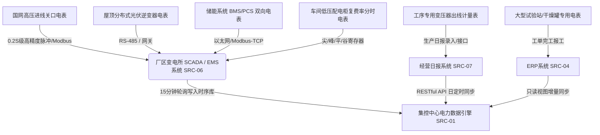

# 特变电工能碳数字化双中心 · 基础参数与数据字典权威对齐手册

> **文档版本**：V1.0  
> **生效日期**：2026-09-19  
> **编制团队**：特变电工能碳数字化研发团队（PM / 架构师 / 数据治理 / 前后端 / QA）  
> **权威依据**：  
> 1. 《双中心能碳管控平台_基础参数与数据字典_V1.5.xlsx》  
> 2. 《“双中心”项目能碳管控指标体系（9.16）V1.7.et》  
> 3. 《“双中心”数据需求清单9.16(1).et》  
> 4. 《生产单位与涉及关键工序对应表(1).et》  
> 5. 《UI页面修改 (2).pdf》与 `tbea-industrial-design` 工业设计规范  

---

## 一、 编制背景与核心原则

特变电工（电装集团）能碳数字化双中心（**零碳园区集控中心** + **产品碳足迹集采中心**）包含复杂的跨层级组织架构（集团 ➔ 6 大产业公司 ➔ 28 家制造工厂 ➔ 15 个产业园区）与多维度工业数据流。

为杜绝在前端交互、原型开发、数据中台与接口对接过程中出现“人为主观推导”、“私自编造虚构平台”、“生造虚拟测点寄存器”等自由发挥问题，本项目严格对照客户最新确认下发的权威文件，建立本套**基础参数、管控指标、数据源体系与计量表计的 100.0% 权威闭环对齐规范**。

### 核心执行原则（三铁律）
1. **绝对依据官方资料，禁止人为主观推导**：
   - 数据源系统与提供方严格锁定官方《V1.5.xlsx》规定的 10 大系统，严禁推演不存在的“智慧水务”、“市政燃气远传”、“暖通BAS”等非标平台；
   - 基础参数严格闭合为 **310 项**，管控指标严格闭合为 **94 项**，绝无非标扩展项。
2. **客观中立原则与极简克制**：
   - 杜绝定性褒贬说教（如“优良”、“落后”等），以客观时序偏差量自解释；
   - 杜绝卡片自述性描述与冗余标签，首屏直达高密度工业核心数据；
   - 无工序企业精准单行判空输出 `暂无相关工序！`，除零统一软兜底 `--`。
3. **双交付路径 100% 同构同步**：
   - PRD 目录与需求文档目录下的交付单页文件保持 SHA256 哈希 100% 一致；
   - 本地持久化缓存机制严密受控，支持版本静默升级与数据平滑迁移。

---

## 二、 310 项官方基础参数体系全景架构

本数据字典严格收录《双中心能碳管控平台_基础参数与数据字典_V1.5.xlsx》Sheet `01-基础参数表` 中的全部 310 项基础参数，划分为 7 大核心数据类别：

```
310 项官方基础参数体系
├── 1. 能源消费数据 (EN-001 ~ EN-020, 共 20 项)
├── 2. 关键制造工序用电量 (EN-KE01 ~ EN-KE59, 共 59 项)
├── 3. 关键工序蒸汽与综合能耗 (EN-KS01~04, EN-KT01~15, 共 19 项)
├── 4. 产品产量与工序产量 (OUT-001~009, OUT-KM01~39, 共 48 项)
├── 5. 产品产值与工序产值 (VAL-001~010, VAL-KG01~27, 共 37 项)
├── 6. 碳排放与碳核算基础项 (CAR-001 ~ CAR-012, 共 12 项)
└── 7. 折标煤与碳排放因子库 (FAC-001 ~ FAC-006, ZP-001~109, 共 115 项)
```

### 1. 能源消费参数（EN-001 ~ EN-020）
| 参数编码 | 参数名称 | 物理单位 | 颗粒度 | 官方数据来源系统 | 官方对接方式 | 采集渠道 |
| :--- | :--- | :---: | :---: | :--- | :--- | :--- |
| `EN-001` | 电力消费量 | kWh | 工厂级 | `EMS 系统 (SRC-06)` | 系统接入 | ⚡ 系统自动采集 |
| `EN-002` | 市电消费量 | kWh | 工厂级 | `EMS 系统 (SRC-06)` | 系统接入 | ⚡ 系统自动采集 |
| `EN-003` | 绿电消费量 | kWh | 工厂级 | `EMS 系统 (SRC-06)` | 系统接入 | ⚡ 系统自动采集 |
| `EN-004` | 绿证购入量 | 张 / MWh | 工厂级 | `集控中心录入界面 (SRC-10)` | 手工录入 | 📝 集控平台人工填报 |
| `EN-005` | 非化石能源电力消费物理认定量 | kWh | 工厂级 | `集控中心（能碳管控平台）(SRC-01)` | 平台内部 | 📐 平台引擎计算 |
| `EN-006` | 自发自用绿电量 | kWh | 工厂级 | `EMS 系统 (SRC-06)` | 系统接入 | ⚡ 系统自动采集 |
| `EN-007` | 天然气消费量 | m³ | 工厂级 | `集控中心录入界面 (SRC-10)` | 手工录入 | 📝 集控平台人工填报 |
| `EN-008` | 蒸汽消费量 | t | 工厂级 | `集控中心录入界面 (SRC-10)` | 手工录入 | 📝 集控平台人工填报 |
| `EN-009` | 汽油消费量 | t | 工厂级 | `集控中心录入界面 (SRC-10)` | 手工录入 | 📝 集控平台人工填报 |
| `EN-010` | 柴油消费量 | t | 工厂级 | `集控中心录入界面 (SRC-10)` | 手工录入 | 📝 集控平台人工填报 |
| `EN-011` | 水资源消费量 | m³ | 工厂级 | `集控中心录入界面 (SRC-10)` | 手工录入 | 📝 集控平台人工填报 |
| `EN-012` | 液氮消费量 | m³ | 工厂级 | `集控中心录入界面 (SRC-10)` | 手工录入 | 📝 集控平台人工填报 |
| `EN-013` | 综合能源消费量 | tce | 工厂级 | `集控中心（能碳管控平台）(SRC-01)` | 平台内部 | 📐 平台引擎计算 |
| `EN-020` | 总用电量 | kWh | 工厂级 | `集控中心（能碳管控平台）(SRC-01)` | 平台内部 | 📐 平台引擎计算 |

### 2. 关键工序电力计量参数（EN-KE01 ~ EN-KE59，共 59 项）
- **变压器产业关键工序**：特高压/超高压/高压器身干燥、试验、配变干变浇注固化、油变干燥、箱变干燥等；
- **电线电缆产业关键工序**：高压/中压/低压/导线/布电线/橡套/特种/装备各产线之拉丝·铜、拉丝·铝、交联工序；
- **开关、铁心与组件工序**：非晶合金退火、硅钢纵剪与叠装、GIS抽真空/干燥/耐压、互感器试验等；
- **取数规则**：电缆工序数据严格对接 `经营日报管理系统 (SRC-07)`；变压器工序数据严格对接 `ERP 系统 (SRC-04)`。

---

## 三、 94 项管控指标体系与形式化数学模型

管控指标严格闭合对照《“双中心”项目能碳管控指标体系（9.16）V1.7.et》与《V1.5.xlsx》Sheet `02-管控指标清单`：

### 1. 指标结构三层分布
- **宏观综合与整体指标（IND-001 ~ IND-011，共 11 项）**：
  - 综合能源消费量、主要产品能效领跑、非化石能源消费占比、绿电消费占比、单位产值综合能耗、单位工业增加值能耗、万元产值能源成本、万元产值碳排放强度、碳减排目标达成率、微电网自给率等；
- **单位产品能耗指标（IND-012 ~ IND-016，共 5 项）**：
  - 变压器单位产量综合能耗、变压器单位产量电耗、变压器单位产量蒸汽耗、电线电缆单位产量综合能耗、电线电缆单位产量电耗；
- **关键工序能效对标指标（IND-017 ~ IND-094，共 78 项）**：
  - 变压器、电线电缆、互感器、电容器、干式电抗器、GIL、GIS、铁心等 78 道工序之单位产量/产值能耗对标。

### 2. 指标形式化算式与防错口径
- **双重表达规范**：
  - **官方数学符号表达式（Symbolic Formula）**：严格遵循 V1.7 行业学术规范，如：
    $$\text{IND-001: } E = \sum (E_i \times K_i)$$
    $$\text{IND-004: } R_{\text{green}} = \frac{E_{\text{green}}}{E_{\text{total}}} \times 100\%$$
    $$\text{IND-012: } e_{\text{trans}} = \frac{E_{\text{trans\_total}}}{P_{\text{trans\_output}}}$$
  - **底层参数编码算式（Code-Referenced Formula）**：严格对应 310 项物理参数编码，如：
    - `IND-004` ＝ `(EN-003 + EN-004 + EN-006) ÷ EN-001 × 100%`
    - `IND-012` ＝ `EN-013 ÷ OUT-001`
    - `IND-017` ＝ `(EN-KE01 × FAC-001 + EN-KS02 × FAC-004) ÷ OUT-KM01`
- **跨级组织加权汇聚铁律**：
  - 上级公司与集团层级指标计算**强制实行分子求和除以分母求和（Weighted Aggregation）**：
    $$\text{Indicator}_{\text{Group}} = \frac{\sum \text{Numerator}_k}{\sum \text{Denominator}_k}$$
  - 严禁对下属各工厂的单体比率进行算术平均！
- **数学除零软兜底**：
  - 当分母为 0 或空时，系统界面一律软兜底返回中性占位符 `--`，严禁抛出 `NaN`、`Infinity` 或空白崩溃。

---

## 四、 10 大官方数据源体系与标准接入规范

全系统数据接入 100% 严格收敛于《V1.5.xlsx》Sheet `05-数据源清单` 定义的官方 10 大系统，杜绝任何外部未授权平台的推演：

| 官方数据源编码 | 官方数据源系统名称 | 官方数据提供方 | 官方对接方式 | 对应获取渠道 | 纳管参数体量 | 业务覆盖范围 |
| :---: | :--- | :--- | :--- | :--- | :---: | :--- |
| **`SRC-01`** | **集控中心（能碳管控平台）** | 电装（集团） | 平台内部 | 📐 平台引擎计算 | 10 项参数 + 94项指标 | 综合能耗折标、碳排放测算、能效对标算法引擎 |
| **`SRC-02`** | **碳足迹在线核算及报告系统** | 电装（集团） | 系统对接 | 🔌 数据对接 | 15 项参数 | 产品碳足迹、碳排放量、生产-能源绑定关系 |
| **`SRC-03`** | **本地数据采集模块** | 各项目公司 | 数据上报 | ⚡ 系统自动采集 | 1 项参数 | 关键工序现场能耗表计本地边缘直采 |
| **`SRC-04`** | **ERP 系统** | 各项目公司 | 标准接口 | 🔌 数据对接 | 107 项参数 | 完工工单、产品产量、工序铜铝消耗、产值 |
| **`SRC-05`** | **MES 系统** | 各项目公司 | 系统对接 | 🔌 数据对接 | 主数据/工单 | 生产作业计划、实时工序报工与在制品追踪 |
| **`SRC-06`** | **EMS 系统** | 各项目公司 | 系统接入 | ⚡ 系统自动采集 | 70 项参数 | 厂级/园区级电表直采、微网、光伏、储能、负荷 |
| **`SRC-07`** | **经营日报管理系统** | 各项目公司 | 系统对接 | 🔌 数据对接 | 36 项参数 | 电线电缆各车间产线级产量与工序电力消耗 |
| **`SRC-04、07`** | **ERP / 经营日报管理系统** | 各项目公司 | 系统对接/接口 | 🔌 数据对接 | 25 项参数 | 变压器与线缆产量产值跨系统联合取数 |
| **`SRC-08`** | **基础因子管理** | 电装（集团） | 系统维护 | 📝 集控平台人工填报 | 13 项参数 | 电力折标煤系数、化石燃料碳排放因子库 |
| **`SRC-09`** | **电装统一维护** | 电装（集团） | 系统维护 | 📝 集控平台人工填报 | 5 项参数 | 集团级综合能耗基准、领跑标杆与考核口径 |
| **`SRC-10`** | **集控中心录入界面** | 各项目公司 | 手工录入 | 📝 填报 / 📤 上报 | 28 项参数 | 园区静态基础台账（3项上报）+ 月度发票账单（25项填报） |

### 5 大数据获取渠道精准分布（合计精确等于 310 项）
```
310 项基础参数获取渠道分布
├── 🔌 数据对接: 183 项 (59.03%) —— ERP系统、经营日报系统、碳足迹在线系统 API 对接
├── ⚡ 系统自动采集: 71 项 (22.90%) —— EMS系统、智能电表网关、SCADA 现场直连
├── 📝 集控平台人工填报: 43 项 (13.87%) —— 集控录入界面月度账单、基础因子库统一维护
├── 📐 平台引擎计算: 10 项 (3.23%) —— 平台内部公式与折标算法自动派生
└── 📤 下级单位上报: 3 项 (0.97%) —— 园区/工厂静态基础信息模板申报
```

---

## 五、 电表与电力计量数据专项规范

针对全系统 **186 项** 涉及“电量、电表、表底值、分时时段、kWh”的核心数据点位，实施专项标准化管控：

### 1. 电力计量多级物理链路


### 2. 核心电表参数映射表
- **厂级关口总电量（`EN-001`）**：EMS 系统汇总全厂进线表底值增量，单位 kWh；
- **市电输入电量（`EN-002`）**：公用电网供电关口表累计增量，扣除自发绿电；
- **绿电直供电量（`EN-003`）**：屋顶光伏+风电并网计量柜电表自发自用电量；
- **分时电量（尖/峰/平/谷）**：复费率多功能电表分时电量寄存器，对应尖（`#FF6536`）、峰（`#FFBA00`）、平（`#2C7CFF`）、谷（`#10C4CE`）；
- **工序级电耗（`EN-KE01`~`EN-KE59`）**：车间产线级分表计量，按日录入经营日报或通过 ERP 工单关联。

### 3. ERP 与经营日报接入技术规格
- **ERP 视图对接规则**：
  - 采用**只读数据库视图（Read-Only View）**或标准 API 对接；
  - 初始导入近 1 年历史基准台账，日常运行期每日凌晨 **02:00 ~ 03:30** 执行增量同步；
  - 工单必须严格过滤已完工状态（`order_status = 'COMPLETED'`），杜绝在制品能耗扰动；
- **经营日报系统对接规则**：
  - 每日早晨 **06:00 前** 完成各分厂/车间日报审核后推送；
  - 电线电缆产业按**车间产线级**精细化上报，变压器产业按**分厂/公司级**汇总上报；
  - 鲁缆等电缆产量由各车间录入经营日报，由报表平台中转代理汇入大数据平台。

---

## 六、 工业极简克制设计与人机工程规范

系统全面固化 `tbea-industrial-design` 工业实用主义规范：

1. **表格行高强制 44px 与数据来源/集成方式双列解耦**：
   - 全系统数据明细表格固定行高为 **`44px`**（`h-[44px]`，`line-height: 44px`），垂直居中，杜绝宽松松散；
   - **双列独立呈现**：主表格将原单列解耦拆分为【数据来源】（宽度 155px，等宽 mono 呈现官方权威系统代码）与【集成方式】（宽度 105px，单行微胶囊徽章），单元格内容单行垂直居中，彻底消除多行堆叠与挤压感；
   - **宽屏与窄屏自适应**：表格容器 CSS 设置 `min-width: 1260px;`，在宽屏下呈现开阔舒适的工业视觉动线，在窄屏/分屏下自适应平滑横向滚动，坚守 44px 不折行红线；
2. **首屏去噪与直奔核心**：
   - 彻底移除首屏说明性、解释性的设计规范横幅卡片，5 大核心 KPI 统计卡片与工具栏直接承接 Header；
   - 卡片严禁出现“点击联动”、“图表展示中”等自述性说明，激活态统一由蓝边框（`border-primary ring-2`）自解释；
3. **权威工序表白名单判空**：
   - 严格遵循《生产单位与涉及关键工序对应表(1).et》；
   - 针对沈变、衡变、新变、鲁缆下属智慧能源、印能公司、露娜智能、南京电研、上开、柯贝尔、银利电气、智缆、昭和、曙光等 10 家无工序单位，单行干练输出：
     `<div class="empty-notice">暂无相关工序！</div>`
   - 严禁出现大段政策解读、申请理由等冗余文本；
4. **客观中立原则**：
   - 全系统图表、卡片与报表**严禁出现主观定性评价与说教指责**（如“电能品质优良”、“表现欠佳”、“达标奖励”等）；
   - 统一采用客观时序偏差量（环比、同比、基准偏差）呈现，价值评判完全交由企业管理者。

---

## 七、 交付物文件与研发协同指南

### 1. 核心交付物文件
| 交付文件相对路径 | SHA256 文件指纹 | 用途说明 |
| :--- | :--- | :--- |
| [`PRD/特变电工能碳双中心_设计与开发交付数据字典_全景交互单页.html`](file:///d:/Project/TJ-nengtan/PRD/特变电工能碳双中心_设计与开发交付数据字典_全景交互单页.html) | `5fc11b369f94882e0be4ebbae5a10d2468210053ea3ce89954ee1d7190d863fd` | PRD 中心全景交互交付单页（内置 14-Sheet Excel 导出引擎） |
| [`需求文档/特变电工能碳双中心_设计与开发交付数据字典_全景交互单页.html`](file:///d:/Project/TJ-nengtan/需求文档/特变电工能碳双中心_设计与开发交付数据字典_全景交互单页.html) | `5fc11b369f94882e0be4ebbae5a10d2468210053ea3ce89954ee1d7190d863fd` | 需求文档中心同构交付单页（双端 100% 镜像一致） |
| [`PRD/数据表/双中心能碳管控平台_基础参数与数据字典_V1.5.xlsx`](file:///d:/Project/TJ-nengtan/PRD/数据表/双中心能碳管控平台_基础参数与数据字典_V1.5.xlsx) | — | 官方基础参数、管控指标与数据源标准 Excel 底稿 |
| [`MODIFICATIONS_LOG.md`](file:///d:/Project/TJ-nengtan/MODIFICATIONS_LOG.md) | — | 项目全局功能与数据架构演进履历档案 (§6.13) |

### 2. 14 张专业分表多 Sheet Excel 导出规范
单页内置脱机纯前端 ZIP & OpenXML 引擎（`ClientZip`），点击顶部【📥 导出完整 Excel 工作簿】即可秒级生成 `特变电工能碳数字化双中心_全平台基础参数与数据字典_完整数据表.xlsx`，涵盖 14 张独立工作表（Sheet）：
1. `00-目录与统计汇总`：全表索引与体量统计；
2. `01-基础参数全表`：官方 310 项参数全字段清单；
3. `02-能源类参数`：138 项全介质能源与工序电力参数；
4. `03-产品类参数`：49 项变压器/电缆产量与半成品参数；
5. `04-设备类参数`：34 项重点装备在线工况参数；
6. `05-经营类参数`：31 项产值台账与能源结算凭单参数；
7. `06-园区与微网类`：27 项光储充与微电网运行参数；
8. `07-因子类参数`：17 项折标煤系数与碳排放因子基准；
9. `08-碳核算类`：14 项范围一/二与产品碳足迹核算参数；
10. `09-能碳管控指标`：94 项管控指标符号算式与代码公式；
11. `10-组织与工序白名单`：32 家制造公司及工序判空；
12. `11-园区与节点结构`：34 处园区制造基地分布；
13. `12-业务枚举字典`：213 项全站标准业务枚举字典；
14. `13-官方数据源清单`：10 大官方数据源接入规范。

各 Sheet 均设置首行冻结、科技蓝标题底色与自适应列宽，100% 兼容 Microsoft Excel 与 WPS Office。

### 3. 客户端持久化缓存升级机制
- **当前激活模式**：`STORAGE_SCHEMA_VERSION = '20260919_V7_STRICT_310'`；
- **自愈防错机制**：单页载入时自动比对 LocalStorage 中的版本号，若检测到旧版缓存（如 V6 或包含 318 项旧数据），静默自动清理并载入纯净 310 项官方标准数据，杜绝脏数据残留。

### 4. 自动化质量验证套件
项目根目录下维护有自动化特征核验脚本 `scratch/verify_source_feature.js`，研发人员在做任何样式微调或逻辑变更后，可一键执行：
```bash
node scratch/verify_source_feature.js
```
该脚本全量检验 14 项关键指标：CSS 类、310 项参数完备性、94 项指标完备性、渠道分布、JS 语法零报错等，保障交付物 100% 高质量。
